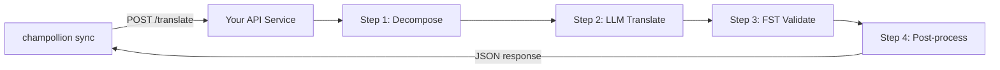

# Eine benutzerdefinierte Methode als API bereitstellen

Die **`api`-Methode** von champollion ermöglicht es Ihnen, jedes Übersetzungspaar auf einen externen HTTP-Endpunkt zu verweisen. So integrieren Sie Pipelines, die für einen einzelnen LLM-Prompt zu komplex sind — morphologische Analysewerkzeuge, endliche Zustandsübersetzer (FSTs), mehrstufige LLM-Ketten oder jede benutzerdefinierte Forschungsmethode, die Sie entwickelt haben.

Es gibt zwei Möglichkeiten, einen solchen Endpunkt bereitzustellen:

1. **`champollion serve`** — ein einziger Befehl, der den konfigurierten Stack Ihres bestehenden Champollion-Projekts (Methode, Register, Coaching, Translation Memory, Quality Gate) hinter diesem Vertrag bereitstellt. Kein Server-Code erforderlich. Siehe [den codefreien Weg](#the-zero-code-path-champollion-serve).
2. **Ein benutzerdefinierter Dienst** — schreiben Sie Ihren eigenen HTTP-Server, der den Vertrag implementiert, für Pipelines, die sich vollständig außerhalb von Champollion befinden.

## Warum ein API-Dienst?

Manche Übersetzungs-Pipelines lassen sich nicht innerhalb eines einfachen Prompt-Antwort-Zyklus ausführen:

| Pipeline-Schritt | Beispiel |
|---|---|
| **Morphologische Zerlegung** | Zerlegen polysynthetischer Wörter in Morpheme vor der Übersetzung |
| **FST-Validierung** | Ablehnen von Ausgaben, die phonologische oder morphologische Regeln verletzen |
| **Mehrstufige LLM-Ketten** | Zyklen aus Generieren → Verifizieren → Korrigieren mit verschiedenen Modellen |
| **Wörterbuch-Nachschlagen** | Abgleich mit einem kuratierten zweisprachigen Wörterbuch mitten in der Pipeline |
| **Human-in-the-Loop** | Einreihen unsicherer Übersetzungen zur Prüfung durch Fachleute |

Die `api`-Methode behandelt Ihre Pipeline als Blackbox — champollion sendet Quellzeichenketten, Ihr Dienst gibt Übersetzungen zurück. Was intern geschieht, liegt vollständig bei Ihnen.

## Architektur


```mermaid
graph LR
    A[champollion sync] -->|POST /translate| B[Your API Service]
    B --> C[Step 1: Decompose]
    C --> D[Step 2: LLM Translate]
    D --> E[Step 3: FST Validate]
    E --> F[Step 4: Post-process]
    F -->|JSON response| A
```

## Der codefreie Weg: `champollion serve`

Wenn Ihre Pipeline bereits ein Champollion-Projekt ist — eine konfigurierte Methode (LLM, Coached oder eine Engine), Register, Coaching-Dateien, Translation Memory und das deterministische Quality Gate —, müssen Sie überhaupt keinen Server schreiben. `champollion serve` stellt **Ihren eigenen konfigurierten Stack** hinter genau dem unten beschriebenen Vertrag bereit:

```bash
# Owner side — run from the project whose champollion.config.json defines the stack
CHAMPOLLION_SERVE_TOKEN=$(openssl rand -hex 24) npx champollion serve
# [OK] champollion serve listening on http://127.0.0.1:1822/translate
```

Jede Anfrage durchläuft dieselbe Pipeline, die auch `champollion sync` verwendet:

- **Translation Memory** — Zeichenfolgen, die das TM bereits enthält, werden kostenlos aus dem Cache bereitgestellt, ohne Ihren Upstream-Anbieter zu kontaktieren. Vom Gate validierte API-Ergebnisse werden für die nächste Anfrage zwischengespeichert.
- **Quality Gate** — jede Antwort wird deterministisch validiert (Wiederholung, Längenverhältnis, Skriptkonformität, Quellenecho). Fehler werden als strukturierte Fehler pro Schlüssel zurückgegeben (HTTP 207/422) — niemals als unbemerkt beeinträchtigte Ausgabe.
- **Cost Guard** — `--max-cost-per-request` und `--max-session-cost` weisen Anfragen ab, deren *geschätzte* Upstream-Kosten Ihre Obergrenzen überschreiten, noch bevor ein Anbieteraufruf erfolgt. Methoden mit unbekannter Preisgestaltung werden unter einer Obergrenze ebenfalls abgewiesen: Unbekannt ist nicht kostenlos. Durch das TM abgedeckte Anfragen kosten bekanntermaßen 0 $ und passieren immer.

Der Server bindet standardmäßig an `127.0.0.1`: Jeder, der den Port erreichen kann, kann Ihr Upstream-API-Budget verbrauchen. Die Freigabe ist daher eine explizite Entscheidung — `--bind 0.0.0.0` plus ein starkes Bearer-Token. `--no-auth` wird nur zusammen mit einer Loopback-Bindung akzeptiert. Eine Ratenbegrenzung pro IP und eine Begrenzung der Anfrageröße sind standardmäßig aktiviert; siehe `champollion serve --help`.

### Einen Consumer darauf verweisen

Erzeugen Sie das Plugin-Manifest, das Consumer installieren (ein Befehl auf jeder Seite):

```bash
# Owner side
champollion serve --emit-manifest --endpoint https://translate.example.org
# [OK] Wrote ./my-project-serve/method.json
```

```bash
# Consumer side
champollion plugin install ./my-project-serve
```

```json title="champollion.config.json (consumer)"
{
  "pairs": {
    "en:crk": { "methodPlugin": "my-project-serve" }
  }
}
```

```bash
CHAMPOLLION_API_KEY=<the server's bearer token> champollion sync
```

Die `api`-Methode des Consumers sendet Quellzeichenfolgen per POST an Ihren Server; Ihr Stack übersetzt, prüft per Gate und speichert im Cache; das `qualityTier` des Manifests ist eine transparente Weiterleitung Ihrer konfigurierten Paare (die konservativste Stufe, falls sie sich unterscheiden). Ihre Prompts, Coaching-Daten und Anbieterschlüssel verlassen niemals Ihren Rechner.

Der Rest dieses Leitfadens behandelt das Schreiben eines **benutzerdefinierten** Dienstes — nützlich, wenn Ihre Pipeline kein Champollion-Projekt ist (eine Python-FST-Kette, ein maßgeschneidertes Forschungssystem). Der Netzwerkvertrag ist in beiden Fällen identisch.

## Einrichten Ihres Dienstes

Ihr API-Dienst muss einen einzelnen Endpunkt implementieren, der JSON akzeptiert und zurückgibt:

### Anfrageformat

champollion sendet exakt diesen JSON-Body (siehe [api.js](https://github.com/gamedaysuits/Champollion/blob/main/cli/lib/methods/api.js)):

```json
POST /translate
Content-Type: application/json
Authorization: Bearer <CHAMPOLLION_API_KEY>

{
  "source_locale": "en",
  "target_locale": "crk",
  "method": "my-project-serve",
  "keys": {
    "greeting": "Hello, welcome to our app",
    "farewell": "Goodbye and thanks"
  }
}
```

| Feld | Typ | Beschreibung |
|-------|------|-------------|
| `source_locale` | string | BCP-47-Quellsprachcode |
| `target_locale` | string | BCP-47-Zielsprachcode |
| `method` | string | Plugin-Name oder `"default"` |
| `keys` | object | Zuordnung von Schlüssel → zu übersetzende Quellzeichenfolge |
| `instructions` | object | Nur wenn der Endpunkt `"acceptsInstructions": true` deklariert: Schlüssel → schlüsselspezifische Hinweise (welche Pluralformen eine Nachricht benötigt, Feedback eines Quality-Gate-Wiederholungsversuchs) |
| `text_format` | string | `"markdown"` für Markdown-Dokumenttext (siehe unten); fehlt bei App-Zeichenfolgen |

### Antwortformat

Ihr Dienst muss ein `translations`-Objekt zurückgeben. Ein optionales `meta`-Objekt kann Kosten- und Diagnoseinformationen enthalten:

```json
{
  "translations": {
    "greeting": "<the greeting, translated>",
    "farewell": "<the farewell, translated>"
  },
  "meta": {
    "model": "my-custom-pipeline/v1",
    "cost_usd": 0.0042,
    "method": "decompose-translate-validate"
  }
}
```

| Feld | Typ | Erforderlich | Beschreibung |
|-------|------|----------|-------------|
| `translations` | object | ✅ | Zuordnung von Schlüssel → übersetzte Zeichenfolge |
| `meta` | object | — | Optionale Metadaten |
| `meta.cost_usd` | number | — | Falls vorhanden, in der Ausgabe von Champollion angezeigt |
| `errors` | object | — | Bei Teilerfolg (HTTP 207): Zuordnung von Schlüssel → `{ message }` |

### Minimaler Express-Server

```javascript
import express from 'express';

const app = express();
app.use(express.json());

/**
 * champollion API contract:
 *
 * Request:  { source_locale, target_locale, method, keys: { "key": "source" } }
 * Response: { translations: { "key": "translated" }, meta: { ... } }
 */
app.post('/translate', async (req, res) => {
  const { source_locale, target_locale, method, keys } = req.body;

  const translations = {};

  for (const [key, source] of Object.entries(keys)) {
    // --- Your pipeline goes here ---
    // Step 1: Morphological decomposition
    const morphemes = await decompose(source, source_locale);

    // Step 2: LLM translation with context
    const draft = await llmTranslate(morphemes, target_locale);

    // Step 3: FST validation
    const validated = await fstValidate(draft, target_locale);

    // Step 4: Post-processing (orthography normalization, etc.)
    translations[key] = await postProcess(validated);
  }

  res.json({
    translations,
    meta: {
      model: 'my-custom-pipeline/v1',
      method: 'decompose-translate-validate',
    },
  });
});

app.listen(3001, () => {
  console.log('Translation API running on http://localhost:3001');
});
```

## Champollion konfigurieren

Verweisen Sie in `champollion.config.json` ein Übersetzungspaar auf Ihren laufenden Dienst:

```json
{
  "inputLocale": "en",
  "pairs": {
    "en:crk": {
      "method": "api",
      "endpoint": "http://localhost:3001/translate",
      "register": "Formal Plains Cree. Use SRO orthography."
    }
  }
}
```

Führen Sie die Synchronisierung dann wie gewohnt aus:

```bash
npx champollion sync
```

Champollion sendet Ihre Quellzeichenfolgen per POST an den Endpunkt und schreibt die zurückgegebenen Übersetzungen in `crk.json`.

### Befolgt Ihr Endpunkt Anweisungen?

Geben Sie dies mit `"acceptsInstructions"` beim Paar an (oder auf oberster Ebene von `method.json` des Plugins):

- **`false`** — ein trainiertes NMT-Modell, wie es beispielsweise von `nmt-forge serve` bereitgestellt wird, übersetzt Text und nichts anderes; wird es zweimal gefragt, antwortet es identisch. Wenn das Quality Gate eine seiner Antworten ablehnt, fragt Champollion **nicht** erneut an (dies wäre ein vergeblicher Aufruf); es beurteilt die erste Antwort so, wie eine zweite Antwort beurteilt werden würde (ein unverändert beibehaltener Name wird akzeptiert) und sendet den Rest an `fallback` des Paares.
- **`true`** — ein LLM hinter Ihrem Endpunkt kann schlüsselspezifische Hinweise nutzen: Anfragen enthalten ein `instructions`-Objekt, und ein abgelehnter Schlüssel wird mit dem Feedback des Gates erneut angefragt.
- **nicht gesetzt** — Champollion kann dies nicht feststellen. Ein abgelehnter Schlüssel wird einmal ohne Feedback erneut angefragt, und der Durchlauf weist darauf hin, dass der Endpunkt dies möglicherweise ignoriert.

```json
{
  "pairs": {
    "en:crk": {
      "method": "api",
      "endpoint": "http://127.0.0.1:8378/translate",
      "acceptsInstructions": false,
      "fallback": { "method": "llm-coached" }
    }
  }
}
```

Das Fallback ist hier ein gehostetes Modell. Um alles auf dieser Maschine zu behalten, verwenden Sie stattdessen `"fallback": { "method": "local", "model": "<your local model>" }` (siehe [Fallback-Methode](/docs/getting-started/configuration#fallback) dazu, wann welche Option zu wählen ist).

## Fallstudie: Plains-Cree-Pipeline

:::info[In Entwicklung]
Die unten beschriebene Plains-Cree-Pipeline befindet sich **in aktiver Entwicklung** und ist noch nicht produktiv im Einsatz. Die Angaben hier spiegeln die aktuelle Entwurfsrichtung wider und können sich im Zuge der Weiterentwicklung des Projekts ändern.
:::

Das Projekt **arena** demonstriert dieses Muster. Seine Plains-Cree-Pipeline nutzt:

1. **Morphologische Zerlegung** — polysynthetische Cree-Wörter in übersetzbare Morphemketten aufteilen
2. **LLM-Übersetzung** — kontextangereicherte GPT-4o-Übersetzung mit Coaching-Daten (SRO-Orthografieregeln, Registeranweisungen)
3. **FST-Validierung** — Finite-State-Transducer prüft, ob die Ausgaben den phonologischen Regeln des Cree entsprechen
4. **Konfidenzbewertung** — jede Übersetzung erhält einen Konfidenzwert basierend auf der FST-Bestehensquote und der Wörterbuchabdeckung

Die gesamte Pipeline läuft als ein einziger HTTP-Endpunkt, den Champollion über die `api`-Methode aufruft.

### Evaluierungen ausführen

Nach dem Übersetzen können Sie die Ausgabequalität direkt über das Harness evaluieren:

```bash
# Clone the harness
git clone https://github.com/gamedaysuits/Champollion.git
cd Champollion/arena
python3 -m pip install -e .

# Run the evaluation against a real, non-bundled corpus
mt-eval run --corpus eval-amh-fra-globalvoices-test-v1 --model google/gemini-3.1-pro-preview --yes
```

Dies erzeugt strukturierte Evaluierungsdatensätze mit chrF++-, BLEU- und Exact-Match-Werten, die als Regressions-Baselines verwendet werden können.

## Authentifizierung

Wenn Ihre API eine Authentifizierung erfordert, benennen Sie die Umgebungsvariable, die
ihr Token enthält, beim Paar (`"${VAR}"`, gelesen aus der Umgebung oder `.env.local`),
oder setzen Sie `CHAMPOLLION_API_KEY`. Champollion sendet nur dieses Token an den
Endpunkt — niemals den Schlüssel eines anderen Anbieters. Ein Loopback-Endpunkt (`nmt-forge
serve`, `champollion serve`) benötigt keines.

```json
{
  "pairs": {
    "en:crk": {
      "method": "api",
      "endpoint": "https://my-mt-service.example.com/translate",
      "apiKey": "${CRK_API_KEY}"
    }
  }
}
```

Inhalte (Markdown-Texte) laufen über denselben Vertrag: Jeder Block ist ein Schlüssel
(`segment.<N>` oder `body` für eine ganze Seite), und die Anfrage übermittelt
`"text_format": "markdown"`, sodass ein Server Dokumenttext von App-Zeichenfolgen
unterscheiden kann. Server, die das Feld nicht kennen, können es ignorieren.

## Datensouveränität

Die `api`-Methode ist besonders wichtig für **Gemeinschaften indigener Sprachen**. Durch das Self-Hosting der Übersetzungspipeline behält eine Gemeinschaft die volle Kontrolle über:

- **Eigene Coaching-Daten** — Registeranweisungen, Orthografieregeln und Fachglossare verlassen niemals die Infrastruktur der Gemeinschaft.
- **Linguistische Ressourcen** — kuratierte Wörterbücher, FST-Grammatiken und von Ältesten verifizierte Übersetzungen verbleiben im Eigentum der Gemeinschaft.
- **Zugriffsrichtlinien** — die Gemeinschaft entscheidet, wer den Endpunkt unter welchen Bedingungen aufrufen darf.

Dieser Entwurf folgt den [Prinzipien indigener Datensouveränität](/docs/network/community/low-resource-languages#data-sovereignty-principles) — gemeinschaftliches Eigentum und Kontrolle über Sprachdaten: Sensible Sprachdaten bleiben unter der Kontrolle der Gemeinschaft statt auf Plattformen von Drittanbietern.

:::tip
Kombinieren Sie die `api`-Methode mit einem privaten Deployment (z. B. einer gemeinschaftlich gehosteten VM oder einem On-Premise-Server), um die größtmögliche Datensouveränität zu gewährleisten. `champollion serve` ermöglicht einer Gemeinschaft genau diesen Self-Hosting-Ansatz, ohne jeglichen Server-Code schreiben zu müssen — Coaching-Daten, Anbieterschlüssel und das Translation Memory verbleiben vollständig auf der Infrastruktur der Gemeinschaft. Eine vollständige Anleitung finden Sie unter [Eine ressourcenarme Sprache unterstützen](/docs/network/community/low-resource-languages).
:::

## Kostenschätzung

Die `api`-Methode gibt für die Kostenschätzung standardmäßig `null` zurück — Ihr Dienst steuert die Preisgestaltung. Wenn Sie Kostentransparenz bieten möchten, lassen Sie Ihre API ein `cost`-Feld in den Metadaten zurückgeben:

```json
{
  "translations": { "...": "..." },
  "metadata": {
    "cost": {
      "estimatedCost": 0.0042,
      "currency": "USD",
      "source": "my-service-pricing"
    }
  }
}
```

## Bewährte Praktiken

1. **Bei Fehlern keine Übersetzung zurückgeben** — Geben Sie nicht die Quellzeichenfolge als „Übersetzung“ zurück. Lassen Sie den Schlüssel in `translations` weg (oder melden Sie ihn unter `errors` mit HTTP 207): Der Schlüssel wird übersprungen und bei der nächsten Synchronisierung erneut angefragt. Eine vom Quality Gate abgelehnte Antwort — eine leere Zeichenfolge, ein Echo der Quelle — wird gespeichert, und ein normaler Synchronisierungslauf sendet diesen Schlüssel nicht erneut an Ihren Endpunkt, bis er explizit mit `--redo keys:` angegeben wird (dies würde dieselbe Antwort erneut abrechnen).
2. **Konfidenzwerte einbinden** — Wenn Ihre Pipeline die Qualität schätzen kann, geben Sie diese in den Metadaten zurück. Dies erleichtert die Qualitätsprüfung.
3. **Health-Checks implementieren** — Fügen Sie einen `GET /health`-Endpunkt hinzu, damit Champollion die Konnektivität überprüfen kann, bevor eine umfangreiche Synchronisierung gestartet wird.
4. **Ratenbegrenzungen sauber handhaben** — Wenn Ihre Pipeline Durchsatzbeschränkungen hat, geben Sie `429`-Statuscodes zurück. Das Batch-System von Champollion führt dann ein Backoff durch.
5. **Alles protokollieren** — Mehrstufige Pipelines können unbemerkt fehlschlagen. Protokollieren Sie Ein- und Ausgaben jedes Schritts zu Debugging-Zwecken.

## Lizenzierung

Das `api`-Methodenmuster ist vollständig offen — es gibt keine Lizenzbeschränkungen für das Einbinden Ihrer eigenen Übersetzungs-Pipeline als HTTP-Dienst. Das `arena`-Eval-Harness ist unter AGPL-3.0-or-later lizenziert (mit einer §7-Ausnahme für eval-standard-plugin); Sie können es unter diesen Bedingungen studieren und darauf aufbauen.

## Siehe auch

- [Übersetzungsmethoden](/docs/guides/translation-methods) — Übersicht über alle integrierten Methoden (`openai`, `google`, `api` usw.)
- [Plugin-Spezifikation](/docs/reference/plugin-spec) — vollständiges Schema für `champollion.config.json` einschließlich der `api`-Methodenfelder
- [Eine ressourcenarme Sprache unterstützen](/docs/network/community/low-resource-languages) — durchgehender Leitfaden für ressourcenarme Sprachen, einschließlich Prinzipien der Datensouveränität
- [Architektur](/docs/concepts/architecture) — wie Champollions Synchronisierungsschleife, Batching und Methoden-Dispatch funktionieren
- [MT-Evaluierung](/docs/network/leaderboard/rules) — Evaluierungsmethodik, Metriken und der Einreichungsprozess für die Bestenliste
- [Methoden-Bestenliste](/leaderboard) — Live-Qualitätsrankings über Methoden und Sprachpaare hinweg
