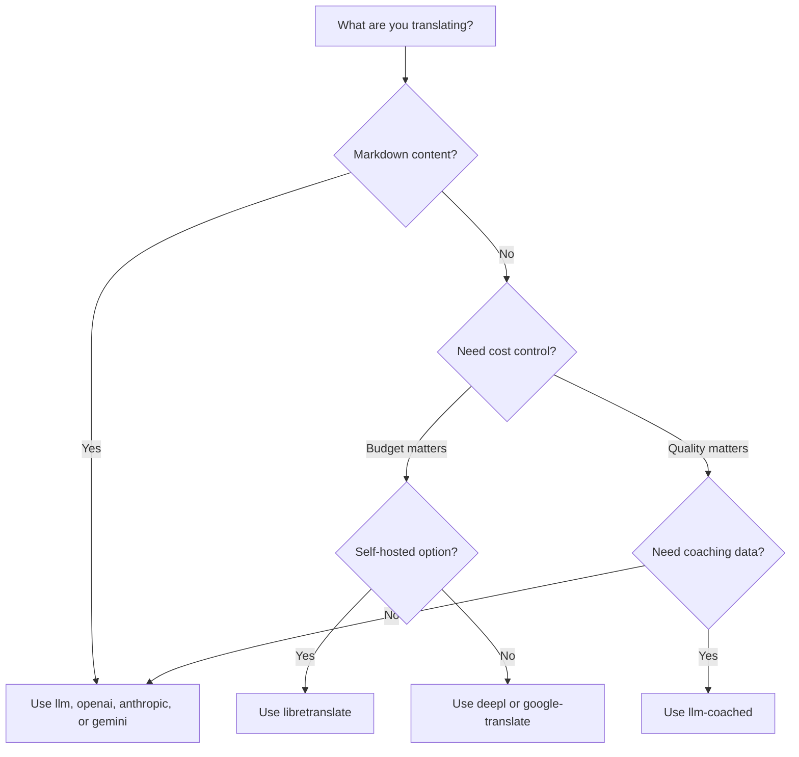

# Übersetzungsmethoden

Champollion unterstützt mehrere Übersetzungsmethoden. Jedes Sprachpaar kann eine andere Methode verwenden — Sie sind nicht auf einen einzigen Ansatz für Ihr gesamtes Projekt festgelegt.

## Methodenvergleich

### LLM-Anbieter

Qualitätsorientiert, Markdown-fähig, Coaching-kompatibel. Am besten geeignet für inhaltslastige Projekte.

| Methode | Schlüssel | Funktion |
|--------|-----|-------------|
| `llm` (Standard) | `OPENROUTER_API_KEY` | LLM über OpenRouter — 200+ Modelle, automatisches Routing |
| `llm-coached` | `OPENROUTER_API_KEY` | LLM + Grammatikregeln, Wörterbücher, Stilhinweise |
| `openai` | `OPENAI_API_KEY` | Direkte OpenAI-API (gpt-4o, gpt-4o-mini) |
| `anthropic` | `ANTHROPIC_API_KEY` | Direkte Anthropic-API (Claude Sonnet, Haiku, Opus) |
| `gemini` | `GEMINI_API_KEY` | Direkte Google-Gemini-API (Flash, Pro) — kostenlose Stufe |

### Traditionelle MÜ

Geschwindigkeits- und kostenorientiert. Am besten geeignet für hohe Mengen an Schlüssel-Wert-Paaren.

| Methode | Schlüssel | Funktion |
|--------|-----|-------------|
| `google-translate` | `GOOGLE_TRANSLATE_API_KEY` | Google Cloud Translation API v2 (194 Sprachen) |
| `deepl` | `DEEPL_API_KEY` | DeepL API mit Glossar-Unterstützung (33 Sprachen) |
| `microsoft-translator` | `MICROSOFT_TRANSLATOR_API_KEY` | Azure Cognitive Services Translator (135 Sprachen) |
| `libretranslate` | *(selbst gehostet)* | Selbst gehostetes LibreTranslate (AGPL, kostenlos) |
| `tilde` | `TILDE_API_KEY` | Tilde MT — in der EU entwickelte Engines, stark bei baltischen und europäischen Sprachen |
| `translated` | `LARA_ACCESS_KEY_ID` + `LARA_ACCESS_KEY_SECRET` | Translateds Lara — professionelle adaptive MT (200 Sprachen) |

### Infrastruktur

| Methode | Schlüssel | Funktion |
|--------|-----|-------------|
| `api` | *(pro Anbieter)* | Schlanker HTTP-Client für beliebige REST-Übersetzungsendpunkte |

## Entscheidungsbaum



---

## `llm` — LLM-Übersetzung (Standard)

Übersetzt über ein beliebiges LLM auf [OpenRouter](https://openrouter.ai). Dies ist die Standardmethode und die vielseitigste.

**Funktionsweise:**
1. Fasst Schlüssel in Batches zusammen (Standard 80/Batch) mit Register- und Kontextanweisungen
2. Sendet an OpenRouter als strukturierten Prompt
3. Analysiert die JSON-Antwort
4. Validiert jede Übersetzung über das [Quality Gate](/docs/concepts/quality-gate)
5. Schreibt bestandene Übersetzungen, wiederholt oder verwirft Fehlschläge

**Wann zu verwenden:** Für die meisten Projekte. Insbesondere inhaltslastige Websites mit Markdown, bei denen Codeblöcke und Shortcodes geschützt werden müssen.

**Konfiguration:**

```json
{
  "defaultMethod": "llm",
  "model": "google/gemini-3.5-flash"
}
```

## `llm-coached` — Gecoachte LLM-Übersetzung

Wie `llm`, jedoch mit Grammatikregeln, Terminologiewörterbüchern und Stilhinweisen, die in jeden Prompt eingefügt werden.

**Funktionsweise:**
1. Lädt Coaching-Daten aus `.champollion/coaching/<locale>.json` oder dem `coaching/`-Verzeichnis eines Plugins
2. Fügt Grammatikregeln, Wörterbuchbegriffe und Stilhinweise in den System-Prompt ein
3. Wörterbuchbegriffe, die mit Quellschlüsseln übereinstimmen, werden als erforderliche Terminologie einbezogen
4. Die Übersetzung erfolgt wie bei `llm`, wobei die Coaching-Daten für zusätzliche Präzision sorgen

**Wann zu verwenden:** Bei ressourcenarmen Sprachen, domänenspezifischer Terminologie (Recht, Medizin), formalen Registern oder in jedem Fall, in dem die generische LLM-Ausgabe nicht präzise genug ist.

**Format der Coaching-Daten:**

```json title=".champollion/coaching/fr.json"
{
  "grammar_rules": [
    "French adjectives agree in gender and number with the noun they modify",
    "Use 'vous' for formal contexts, 'tu' for informal"
  ],
  "dictionary": {
    "dashboard": "tableau de bord",
    "deployment": "déploiement",
    "settings": "paramètres"
  },
  "style_notes": "Prefer active voice. Avoid anglicisms where a native French term exists."
}
```

Siehe auch: [Leitfaden zu ressourcenarmen Sprachen](/docs/network/community/low-resource-languages)

---

## `openai` — Direkte OpenAI-API

Übersetzt direkt über die OpenAI Chat Completions API. Kein OpenRouter-Zwischenglied — Ihr Schlüssel, Ihr Konto, Ihr Nutzungs-Dashboard.

**Modelle:** `gpt-4o` (Standard), `gpt-4o-mini`

**Funktionen:**
- ✅ Markdown-fähig (Inhaltsübersetzung)
- ✅ Coaching-Unterstützung (Grammatikregeln, Wörterbuch-Overrides, Stilhinweise)
- ✅ JSON-Modus für strukturierte Schlüssel-Wert-Ausgabe
- ✅ Exponentielles Backoff mit Wiederholung

**Konfiguration:**

```json
{
  "pairs": {
    "en:fr": { "method": "openai", "model": "gpt-4o-mini" }
  }
}
```

```bash
export OPENAI_API_KEY=sk-proj-...
```

Beziehen Sie Ihren Schlüssel unter [platform.openai.com/api-keys](https://platform.openai.com/api-keys).

## `anthropic` — Direkte Anthropic-API

Übersetzt direkt über die Anthropic Messages API. Verwendet den Parameter `system` für Coaching-Daten und ermöglicht so das Prompt-Caching von Anthropic.

**Modelle:** `claude-sonnet-4-6` (Standard), `claude-haiku-4-5`, `claude-opus-4-7`

**Funktionen:**
- ✅ Markdown-fähig (Inhaltsübersetzung)
- ✅ Coaching-Unterstützung (Grammatikregeln, Wörterbuch-Overrides, Stilhinweise)
- ✅ System-Prompt-Caching (amortisiert die Coaching-Kosten über mehrere Batches hinweg)
- ✅ Exponentielles Backoff mit Wiederholung

**Konfiguration:**

```json
{
  "pairs": {
    "en:ja": { "method": "anthropic", "model": "claude-haiku-4-5" }
  }
}
```

```bash
export ANTHROPIC_API_KEY=sk-ant-...
```

Beziehen Sie Ihren Schlüssel unter [console.anthropic.com](https://console.anthropic.com/settings/keys).

## `gemini` — Direkte Google-Gemini-API

Übersetzt direkt über die Google-Gemini-`generateContent`-API. **Kostenlose Stufe verfügbar** — bester kostenloser Einstiegspunkt.

**Modelle:** `gemini-2.5-flash` (Standard), `gemini-2.5-pro`

**Funktionen:**
- ✅ Markdown-fähig (Inhaltsübersetzung)
- ✅ Coaching-Unterstützung (Grammatikregeln, Wörterbuch-Overrides, Stilhinweise)
- ✅ JSON-Antwortmodus über `responseMimeType`
- ✅ Kostenlose Stufe (großzügiges Tageskontingent)
- ✅ Exponentielles Backoff mit Wiederholung

**Konfiguration:**

```json
{
  "pairs": {
    "en:ko": { "method": "gemini", "model": "gemini-2.5-pro" }
  }
}
```

```bash
export GEMINI_API_KEY=AI...
```

Beziehen Sie Ihren Schlüssel unter [aistudio.google.com/apikey](https://aistudio.google.com/apikey).

### Modellvalidierung {#model-validation}

Die direkten LLM-Anbieter (`openai`, `anthropic`, `gemini`) validieren Ihre Modellzeichenfolge bei der ersten Verwendung. Damit werden drei Kategorien von Fehlern erkannt:

**Falsches Methodenformat** — Verwendung eines Modellpfads im OpenRouter-Stil mit einem direkten Anbieter:

```
[WARN] OpenAI: model "google/gemini-3.5-flash" looks like an OpenRouter path.
       Direct providers use bare model names (e.g., "gpt-4o").
       To use OpenRouter models, set method to 'llm' instead.
```

**Falscher Anbieter** — Verwendung eines Modells eines gänzlich anderen Anbieters:

```
[WARN] Gemini: model "claude-sonnet-4-6" is an Anthropic model.
       This provider (gemini) cannot serve Anthropic models.
       Use --method anthropic or set "method": "anthropic" in config.
```

**Veraltetes oder falsch geschriebenes Modell** — Beim ersten API-Aufruf ruft champollion die Live-Modellliste des Anbieters ab und prüft Ihr Modell dagegen:

```
[WARN] Gemini: model "gemini-1.5-flash" not found in available models.
       Similar models: gemini-2.0-flash, gemini-2.5-flash, gemini-2.5-pro
       The API call will proceed — the provider will give the final verdict.
```

:::note[Dies sind Warnungen, keine Fehler]
Die Modellvalidierung protokolliert Warnungen, blockiert den API-Aufruf jedoch nicht. Die Provider-API fällt das endgültige Urteil – ein zukünftiger Modellname könnte einem anderen Muster entsprechen, und wir möchten nicht auf Basis von Heuristiken blockieren.
:::

---

## `google-translate` — Google Cloud Translation API

Direkte Integration mit der Google Cloud Translation API v2. Verwendet die REST-API — kein SDK, kein Dienstkonto. Nur der API-Schlüssel.

**Wann zu verwenden:** Große Mengen an Schlüssel-Wert-Zeichenfolgenpaaren, bei denen Geschwindigkeit und Kosten wichtiger sind als Nuancen. Unterstützt standardmäßig 194 Sprachen ([von Google veröffentlichte Liste](https://docs.cloud.google.com/translate/docs/languages)).

**Einschränkungen:**
- ⚠️ **Keine Markdown-Fähigkeit.** Beschädigt Codeblöcke, Shortcodes und Interpolationsvariablen.
- Keine Register-/Tonkontrolle
- Kein Coaching und keine Terminologiedurchsetzung

```bash
npx champollion sync --method google-translate
```

:::tip[Automatische Erkennung]
Wenn nur `GOOGLE_TRANSLATE_API_KEY` gesetzt ist (kein OpenRouter-Schlüssel), wechselt champollion automatisch zu Google Translate. Keine Konfigurationsänderung erforderlich.
:::

## `deepl` — DeepL-API

Direkte Integration mit der DeepL-Übersetzungs-API. Unterstützt Glossare für konsistente Terminologie.

**Wann zu verwenden:** Bei europäischen Sprachen, bei denen DeepL brilliert (Deutsch, Französisch, Spanisch, Niederländisch, Polnisch usw.). Die Glossarunterstützung setzt konsistente Terminologie ohne Coaching-Daten durch.

**Funktionen:**
- ✅ Automatische Erkennung des kostenlosen/Pro-Endpunkts (Suffix `:fx` bei kostenlosen Schlüsseln)
- ✅ Glossarerstellung und -verwaltung
- ✅ Kontrolle des Formalitätsgrads
- ⚠️ **Keine Markdown-Fähigkeit** — nur Schlüssel-Wert-Paare

**Konfiguration:**

```json
{
  "pairs": {
    "en:de": { "method": "deepl" }
  }
}
```

```bash
export DEEPL_API_KEY=your-key-here
```

Beziehen Sie Ihren Schlüssel unter [deepl.com/pro-api](https://www.deepl.com/pro-api).

## `microsoft-translator` — Azure Cognitive Services

Direkte Integration mit der Microsoft Translator Text API v3.

**Wann zu verwenden:** Unternehmensumgebungen mit bestehender Azure-Infrastruktur. Unterstützt 135 Sprachen, einschließlich einiger, die Google Translate nicht abdeckt (Tibetisch, Färöisch, Inuktitut und andere).

**Funktionen:**
- ✅ Bis zu 100 Segmente pro Anfrage (hoher Durchsatz)
- ✅ Optionaler Regionsparameter zur Latenzoptimierung
- ⚠️ **Keine Markdown-Fähigkeit** — nur Schlüssel-Wert-Paare
- ⚠️ **Keine Inhaltsübersetzung** — nur Schlüssel-Wert-Paare

**Konfiguration:**

```json
{
  "pairs": {
    "en:ar": { "method": "microsoft-translator" }
  }
}
```

```bash
export MICROSOFT_TRANSLATOR_API_KEY=your-key
export MICROSOFT_TRANSLATOR_REGION=global  # optional
```

Beziehen Sie Ihren Schlüssel über das [Azure Portal](https://portal.azure.com) → Cognitive Services → Translator.

## `libretranslate` — Selbst gehostete Übersetzung

Selbst gehostete Open-Source-Übersetzung mit LibreTranslate. Läuft lokal oder auf Ihrer eigenen Infrastruktur — keine API-Kosten, vollständige Datenhoheit.

**Wann zu verwenden:** Bei Projekten, die Offline-Übersetzung, Datenschutzkonformität (DSGVO) oder kostenlosen Betrieb erfordern. Besonders nützlich für CI-Pipelines, die nicht von externen APIs abhängen sollten.

**Funktionen:**
- ✅ Selbst gehostet — keine externen API-Aufrufe
- ✅ Kostenlos und Open Source (AGPL-3.0)
- ✅ Docker-Bereitstellung verfügbar
- ⚠️ **Keine Markdown-Fähigkeit** — nur Schlüssel-Wert-Paare
- ⚠️ **Keine Inhaltsübersetzung** — nur Schlüssel-Wert-Paare
- ⚠️ Die Qualität variiert je nach Sprachpaar

**Einrichtung:**

```bash
# Run LibreTranslate locally with Docker
docker run -d -p 5000:5000 libretranslate/libretranslate

# Configure (optional — defaults to localhost:5000)
export LIBRETRANSLATE_API_URL=http://localhost:5000/translate
```

```json
{
  "pairs": {
    "en:es": { "method": "libretranslate" }
  }
}
```

---

## `api` — Remote-Übersetzungs-API

Ein schlanker HTTP-Client für community-gehostete oder IP-geschützte Übersetzungsendpunkte. Champollion sendet Schlüssel aus und empfängt Übersetzungen zurück — es enthält keinerlei Übersetzungslogik.

**Wann zu verwenden:** Wenn Übersetzungsmethoden serverseitig gehostet werden (z. B. proprietäre Coaching-Daten, feinabgestimmte Modelle, FST-Pipelines, die nicht verteilt werden können).

```json
{
  "pairs": {
    "en:crk": {
      "method": "api",
      "endpoint": "https://api.example.com/v1/translate",
      "apiKey": "your-key"
    }
  }
}
```

:::note[Community-gesteuerte Übersetzung (souveränitätsanstrebend)]
Die Methode `api` ist die Brücke zur **von der Community gehosteten Übersetzung unter Community-Kontrolle (souveränitätsanstrebend)**. Gemeinschaften indigener und Minderheitensprachen können ihre eigenen Übersetzungs-Endpunkte hosten — wodurch Trainingsdaten, feinabgestimmte Modelle und linguistisches geistiges Eigentum unter der Kontrolle der Gemeinschaft bleiben —, während Champollion sich als Thin Client mit ihnen verbindet.

Siehe [Unterstützung einer ressourcenarmen Sprache](/docs/network/community/low-resource-languages) für die vollständige Anleitung zum Community-Hosting sowie [Bereitstellung einer Methode über eine API](/docs/guides/serving-a-method) für die Anforderungen an Endpunkte.
:::

---

## Konfiguration pro Sprachpaar

Die wahre Stärke liegt im Mischen von Methoden pro Sprachpaar:

```json title="champollion.config.json"
{
  "version": 3,
  "pairs": {
    "en:fr": { "method": "deepl" },
    "en:ja": { "method": "openai", "model": "gpt-4o" },
    "en:ko": { "method": "gemini" },
    "en:ar": { "method": "microsoft-translator" },
    "en:crk": { "methodPlugin": "crk-coached-v1" }
  }
}
```

Damit wird Französisch über DeepL (Glossarunterstützung), Japanisch über OpenAI (Qualität), Koreanisch über Gemini (kostenlose Stufe), Arabisch über Microsoft Translator (Abdeckung) und Plains Cree über ein gecoachtes Plugin (spezialisiert) übersetzt.

## Plugins

Plugins sind vorgefertigte Übersetzungsrezepte für bestimmte Sprachpaare. Es handelt sich um JSON-Manifeste — kein Code — die champollion mitteilen, welche Methode mit welchen Einstellungen verwendet werden soll und welche Qualität als Benchmark ermittelt wurde.

:::tip[Vom Eval-Harness zur Produktion in einem einzigen Befehl]
Plugins, die im [Eval-Harness](/docs/network/specifications/harness) entwickelt und erprobt wurden, können direkt installiert werden – die dort validierte Methode wird hier mit einem einzigen `plugin install`-Befehl bereitgestellt. Siehe [MT Evaluation](/docs/network/leaderboard/rules) für den vollständigen Bewertungsablauf.
:::

```bash
champollion plugin install ./french-formal-v1/
champollion plugin list
champollion plugin remove french-formal-v1
```

Siehe die [Plugin-Spezifikation](/docs/reference/plugin-spec) für das vollständige Manifestformat.

---

## Anbieter wechseln

Wechseln Sie zwischen Methoden? Das Modellformat und die Umgebungsvariable ändern sich — hier ist die Zuordnung:

### OpenRouter → Direkter Anbieter

```diff title="champollion.config.json"
 {
   "pairs": {
     "en:fr": {
-      "method": "llm",
-      "model": "openai/gpt-4o"
+      "method": "openai",
+      "model": "gpt-4o"
     }
   }
 }
```

```diff title="Environment variables"
- export OPENROUTER_API_KEY=sk-or-v1-...
+ export OPENAI_API_KEY=sk-proj-...
```

**Wesentliche Unterschiede:**
- OpenRouter verwendet das Format `provider/model` (z. B. `openai/gpt-4o`). Direkte Anbieter verwenden reine Modellnamen (z. B. `gpt-4o`).
- Jeder direkte Anbieter hat seine eigene Umgebungsvariable (`OPENAI_API_KEY`, `ANTHROPIC_API_KEY`, `GEMINI_API_KEY`).
- Wenn Sie das falsche Modellformat verwenden, warnt champollion Sie — siehe [Modellvalidierung](#model-validation).

### Direkter Anbieter → OpenRouter

```diff title="champollion.config.json"
 {
   "pairs": {
     "en:ja": {
-      "method": "anthropic",
-      "model": "claude-sonnet-4-6"
+      "method": "llm",
+      "model": "anthropic/claude-sonnet-4-6"
     }
   }
 }
```

:::tip[Wann OpenRouter und wann Direct verwenden]
**Verwenden Sie OpenRouter**, wenn Sie zwischen Modellen wechseln möchten, ohne Umgebungsvariablen zu ändern, oder wenn Sie mit einem einzigen Schlüssel Zugriff auf über 200 Modelle wünschen. **Verwenden Sie direkte Provider**, wenn Sie eine einfachere Abrechnung, geringere Latenz (kein Vermittler) oder Zugriff auf providerspezifische Funktionen wie das Prompt-Caching von Anthropic wünschen.
:::

---

## Kostenvergleich

Ungefähre Kosten pro 1.000 übersetzte Schlüssel (bei angenommenen ~10 Token pro Schlüssel, 80 Schlüssel pro Batch):

| Methode | Kosten / 1K Schlüssel | Geschwindigkeit | Qualität | Am besten geeignet für |
|--------|----------------|-------|---------|----------|
| `gemini` (Flash) | **Kostenlos** (innerhalb der Stufe) | Schnell | Gut | Einstieg, private Projekte |
| `google-translate` | ~$0,02 | Am schnellsten | Angemessen | Hohe Mengen, europäische Sprachen |
| `deepl` | ~$0,02 | Schnell | Gut | Europäische Sprachen, Terminologie |
| `microsoft-translator` | ~$0,01 | Schnell | Angemessen | Azure-Umgebungen, breite Sprachabdeckung |
| `libretranslate` | **Kostenlos** (selbst gehostet) | Variiert | Ausreichend | Air-Gapped-Umgebungen, DSGVO, CI-Pipelines |
| `gemini` (Pro) | ~$0,07 | Mittel | Sehr gut | Qualitätssensibel, kostenloses Kontingent |
| `openai` (GPT-4o-mini) | ~$0,01 | Schnell | Gut | Budget-LLM |
| `openai` (GPT-4o) | ~$0,10 | Mittel | Sehr gut | Qualitätssensibel |
| `anthropic` (Haiku) | ~$0,01 | Schnell | Gut | Budget-LLM |
| `anthropic` (Sonnet) | ~$0,10 | Mittel | Sehr gut | Qualitätssensibel |
| `anthropic` (Opus) | ~$0,50 | Langsam | Ausgezeichnet | Maximale Qualität |
| `llm` (OpenRouter) | Variiert je nach Modell | Variiert | Variiert | Modellvergleich, Experimentieren |

:::note[Dies sind Schätzwerte]
Die tatsächlichen Kosten hängen von der Länge Ihres Ausgangstexts, der Stapelgröße und Änderungen der Provider-Preise ab. Prüfen Sie die aktuelle Preisseite jedes Providers für die genauen Tarife.
:::

---

## Siehe auch

- [Unterstützte Sprachen](/docs/reference/supported-languages)
- [Coaching-Daten](/docs/concepts/coaching-data)
- [Unterstützung einer ressourcenarmen Sprache](/docs/network/community/low-resource-languages)
- [Plugin-Spezifikation](/docs/reference/plugin-spec)
- [Bereitstellung einer Methode über eine API](/docs/guides/serving-a-method)
- [Quality Gate](/docs/concepts/quality-gate)
- [Architektur](/docs/concepts/architecture)
- [Fehlerbehebung](/docs/guides/troubleshooting) — Modellfehler, API-Probleme

