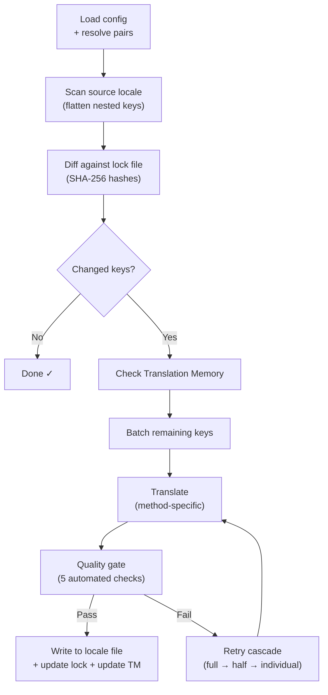

# Wie champollion funktioniert

champollion übersetzt die Locale-Dateien Ihrer App mit einem einzigen Befehl. Hier erfahren Sie, was im Hintergrund geschieht.

## Die Pipeline

Wenn Sie `npx champollion sync` ausführen, durchläuft champollion eine sechsstufige Pipeline:



**Zentrale Designentscheidungen:**

- **Änderungserkennung über SHA-256-Hashes.** Champollion verfolgt jeden Quellwert mit einem Hash in `.champollion.lock`. Wenn Sie einen englischen String aktualisieren, wird nur dieser Schlüssel neu übersetzt. Aus diesem Grund ist `sync` bei wiederholten Durchläufen schnell — es leistet nur minimalen Aufwand.

- **Caching über Translation Memory.** Bevor ein API-Aufruf erfolgt, prüft champollion `.champollion/tm.json` auf zwischengespeicherte Übersetzungen (indexiert nach Quelltext + Locale + Methode). Bei einer typischen erneuten Synchronisierung nach Änderung eines Schlüssels stammen 142 Schlüssel aus dem Cache und 1 Schlüssel aus der API.

- **Qualitätsprüfung vor dem Schreiben.** Jede Übersetzung durchläuft fünf automatisierte Prüfungen (leer, Wiederholung des Quelltexts, Halluzinationsschleife, Längenaufblähung, Skriptkonformität), bevor sie Ihre Dateien berührt. Fehler werden protokolliert und niemals stillschweigend akzeptiert.

- **Wiederholungskaskade bei Fehlern.** Wenn ein Batch fehlschlägt (JSON-Parse-Fehler, API-Timeout), wiederholt champollion den Vorgang mit zunehmend kleineren Batches: vollständig → halb → einzeln. Dies isoliert den problematischen Schlüssel, ohne den Rest zu blockieren.

## Übersetzungsmethoden

Champollion unterstützt mehrere Übersetzungsmethoden, die jeweils für unterschiedliche Szenarien geeignet sind. Die wichtigsten sind:

| Methode | Funktionsweise | Am besten geeignet für |
|--------|-------------|----------|
| **`llm`** | Strukturierter Prompt an ein beliebiges OpenRouter-Modell | Gut ausgestattete Sprachen |
| **`llm-coached`** | Derselbe Prompt + Grammatikregeln, Wörterbuch und Stilhinweise | Sprachen, bei denen LLMs vorhersehbare Fehler machen |
| **`google-translate`** | Batch-Anfrage an die Google Cloud Translation API | Ressourcenstarke Sprachen mit guter GT-Unterstützung |
| **`api`** | HTTP POST an Ihren eigenen Endpunkt | Benutzerdefinierte Pipelines, von der Community kontrollierte Modelle |

Die Methoden werden pro Sprachpaar konfiguriert. Sie könnten `google-translate` für Französisch verwenden, aber `llm-coached` für Plains Cree — jedes Paar erhält die Methode, die am besten dafür funktioniert.

## Coaching-Daten

Für `llm-coached`-Paare vermitteln Coaching-Daten dem LLM explizites linguistisches Wissen: Grammatikregeln, erzwungene Terminologie und Stilpräferenzen. Diese werden jedem Prompt als strukturierter Kontext beigefügt.

```json title="coaching/crk.json"
{
  "grammar_rules": ["Animate nouns take different plural forms than inanimate nouns"],
  "dictionary": {"welcome": "ᑕᓂᓯ", "settings": "ᐃᑕᐢᑌᐘᐃᓇ"},
  "style_notes": "Use Standard Roman Orthography (SRO) unless explicitly configured otherwise."
}
```

Coaching-Daten sind der primäre Mechanismus zur Verbesserung der Übersetzungsqualität, ohne ein Modell feinabzustimmen. Ändern Sie die Regeln → führen Sie die Synchronisierung erneut aus → prüfen Sie, ob es hilft. Die Iteration erfolgt sofort.

## Plugins

Plugins sind vorgefertigte Übersetzungsrezepte für bestimmte Sprachpaare. Es handelt sich um JSON-Manifeste — kein Code — die champollion mitteilen, welche Methode mit welchen Einstellungen verwendet werden soll und welche Qualität als Benchmark ermittelt wurde.

```bash
champollion plugin install ./crk-coached-v3/
champollion sync   # uses the installed plugin for en→crk
```

Plugins schlagen die Brücke zwischen Forschung und Produktion: Eine Methode, die im [Network](/arena) gut abschneidet, kann als Plugin verpackt und hier eingesetzt werden.

## Das Gesamtbild

champollion ist eine Hälfte eines zweiteiligen Ökosystems:

- **[das Network](/arena)** — wo Übersetzungsmethoden mit reproduzierbarem Benchmarking **entwickelt und nachgewiesen** werden
- **champollion** — wo nachgewiesene Methoden zur Übersetzung realer Inhalte **eingesetzt** werden

Die [Eval Harness Bridge](/docs/guides/bridge) verbindet die beiden. Eine Methode, die sich im Network bewährt, wird hier eingesetzt. Rückmeldungen von Sprechern aus der Produktion verbessern die nächste Version.

---

## Tiefer eintauchen

- [Wie die Synchronisierung funktioniert](/docs/concepts/how-sync-works) — detaillierte schrittweise Durchsicht der Pipeline
- [Qualitätsprüfung](/docs/concepts/quality-gate) — die fünf automatisierten Prüfungen
- [Translation Memory](/docs/concepts/translation-memory) — Caching und Kosteneinsparungen
- [Übersetzungsmethoden](/docs/guides/translation-methods) — detaillierter Methodenvergleich
- [Architektur](/docs/concepts/architecture) — Überblick über das Systemdesign
