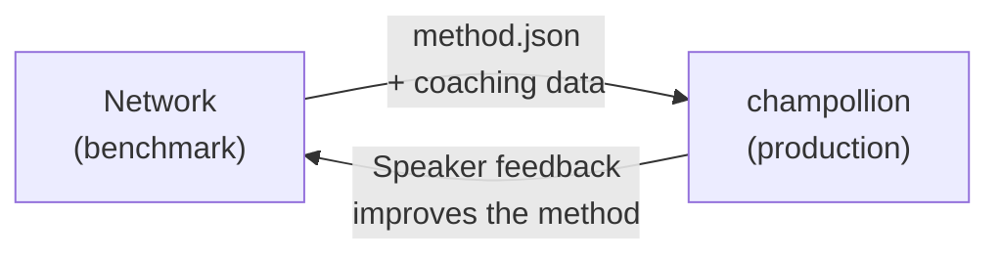

# In Produktion bereitstellen

Sie haben im Network bewiesen, dass es funktioniert. Jetzt stellen Sie es bereit.

Das Network dient der Forschung und Entwicklung – dem Entwickeln, Benchmarking und Vergleichen von Übersetzungsmethoden. **Die Bereitstellung in Produktion** erfolgt über [champollion](https://champollion.dev), die entwicklerorientierte Übersetzungs-CLI. Sie sind über ein gemeinsames Plugin-Format miteinander verbunden.



---

## Der Bereitstellungspfad

### 1. Exportieren Sie Ihre Methode als Plugin

Erstellen Sie ein `method.json`-Manifest, das Ihre Benchmark-Ergebnisse verpackt:

```json
{
  "name": "crk-coached-v3",
  "type": "llm-coached",
  "version": "3.0.0",
  "description": "Coached LLM translation for Plains Cree",
  "locales": ["crk"],
  "config": {
    "model": "google/gemini-2.5-flash",
    "temperature": 0.3
  },
  "benchmarks": {
    "crk": {
      "composite_score": 0.67,
      "fst_acceptance": 0.82,
      "corpus_size": 150
    }
  }
}
```

Fügen Sie alle Coaching-Daten (Grammatikregeln, Wörterbücher) zusammen mit dem Manifest bei.

### 2. In Champollion installieren

```bash
champollion plugin install ./my-method-plugin/
```

### 3. Konfigurieren Sie Ihr Sprachpaar

```json title="champollion.config.json"
{
  "pairs": {
    "en-crk": { "method": "plugin", "plugin": "crk-coached-v3" }
  }
}
```

### 4. Echten Inhalt übersetzen

```bash
npx champollion sync
```

Ihre per Benchmark getestete Methode erzeugt nun echte Übersetzungen in Produktion.

---

## Für indigene Sprachen

Methoden, die indigenen Sprachgemeinschaften dienen, erfordern vor dem produktiven Einsatz die **Zustimmung der Gemeinschaft**. Indigene Prinzipien der Datensouveränität — Eigentum und Kontrolle der Gemeinschaft über ihre Sprachdaten — regeln, wie Übersetzungsmethoden entwickelt, evaluiert und bereitgestellt werden.

Eine Methode, die die Stufe „Deployable“ (0,70+) erreicht, wird nicht automatisch bereitgestellt – sie wird **dann und nur dann** bereitgestellt, wenn das Governance-Gremium der Sprachgemeinschaft seine Zustimmung erteilt.

Den vollständigen Governance-Rahmen finden Sie unter [Data Sovereignty](/docs/network/sovereignty/data-sovereignty) und [Ownership Transfer](/docs/network/sovereignty/ownership-transfer).

---

## Siehe auch

- [The Eval Harness Bridge](https://champollion.dev/docs/guides/bridge) – detaillierte Anleitung zur Network→champollion-Pipeline
- [Plugin Specification](https://champollion.dev/docs/reference/plugin-spec) – das Manifest-Format der method.json
- [champollion Agent Guide](https://champollion.dev/docs/guides/agent-guide) – Verwendung von champollion für die Übersetzung
