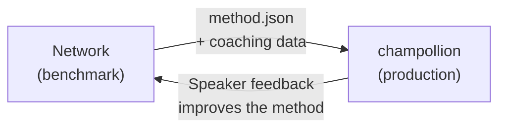

# In Produktion bereitstellen

Sie haben im Network bewiesen, dass es funktioniert. Jetzt stellen Sie es bereit.

Das Network dient der Forschung und Entwicklung – dem Entwickeln, Benchmarking und Vergleichen von Übersetzungsmethoden. **Die Bereitstellung in Produktion** erfolgt über [champollion](https://champollion.dev), die entwicklerorientierte Übersetzungs-CLI. Sie sind über ein gemeinsames Plugin-Format miteinander verbunden.


```mermaid
graph LR
    A["Network\n(benchmark)"] -->|"method.json\n+ coaching data"| B["champollion\n(production)"]
    B -->|"Speaker feedback\nimproves the method"| A
```

---

## Der Bereitstellungspfad

### 1. Exportieren Sie Ihre Methode als Plugin

Erstellen Sie ein `method.json`-Manifest, das Ihre Benchmark-Ergebnisse verpackt:

```json
{
  "name": "french-formal-v1",
  "type": "llm-coached",
  "version": "1.0.0",
  "description": "Formal-register French (example manifest; the benchmark values are illustrative)",
  "locales": ["fr"],
  "config": {
    "model": "google/gemini-2.5-flash",
    "temperature": 0.3
  },
  "benchmarks": {
    "fr": {
      "corpus_chrf": 72.3,
      "exact_match_rate": 0.42,
      "corpus_size": 500
    }
  }
}
```

Fügen Sie alle Coaching-Daten (Grammatikregeln, Wörterbücher) zusammen mit dem Manifest bei.

### 2. In Champollion installieren

```bash
champollion plugin install ./french-formal-v1/
```

### 3. Konfigurieren Sie Ihr Sprachpaar

```json title="champollion.config.json"
{
  "pairs": {
    "en:fr": { "methodPlugin": "french-formal-v1" }
  }
}
```

### 4. Echten Inhalt übersetzen

```bash
npx champollion sync
```

Ihre per Benchmark getestete Methode erzeugt nun echte Übersetzungen in Produktion.

---

## Für indigene Sprachen

Methoden, die indigene Sprachgemeinschaften unterstützen, erfordern vor dem Produktiveinsatz die **Zustimmung der Gemeinschaft**. Prinzipien der indigenen Datensouveränität – gemeinschaftliches Eigentum an Sprachdaten und die Kontrolle darüber – bestimmen, wie Übersetzungsmethoden entwickelt, evaluiert und eingesetzt werden.

Kein Score macht eine Methode einsatzbereit – weder ein hoher chrF++-Wert noch ein Preis-Schwellenwert. Sie wird **nur dann und erst dann** eingesetzt, wenn das Leitungsgremium der Sprachgemeinschaft seine Zustimmung erteilt, nachdem Sprecher der Sprache die Ergebnisse beurteilt haben.

Den vollständigen Governance-Rahmen finden Sie unter [Data Sovereignty](/docs/network/sovereignty/data-sovereignty) und [Ownership Transfer](/docs/network/sovereignty/ownership-transfer).

---

## Siehe auch

- [The Eval Harness Bridge](https://champollion.dev/docs/guides/bridge) – detaillierte Anleitung zur Network→champollion-Pipeline
- [Plugin Specification](https://champollion.dev/docs/reference/plugin-spec) – das Manifest-Format der method.json
- [champollion Agent Guide](https://champollion.dev/docs/guides/agent-guide) – Verwendung von champollion für die Übersetzung
