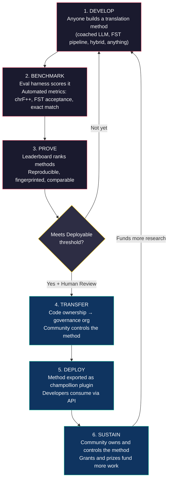
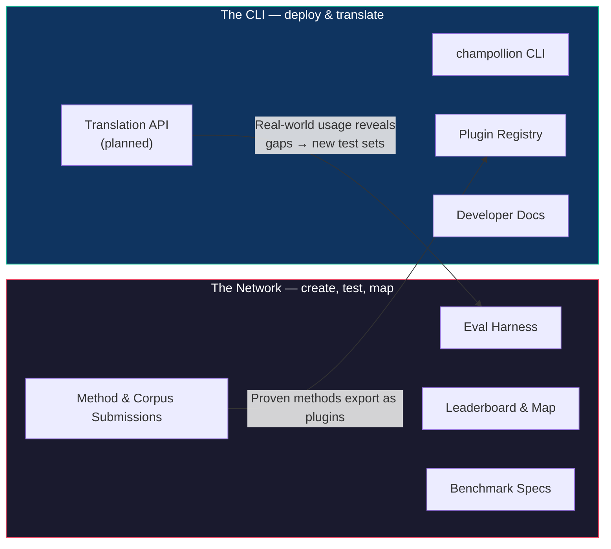
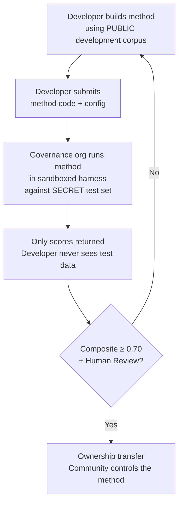

# Wie das Netzwerk funktioniert: Erstellen, Testen, Entwickeln, Bereitstellen

> **Zusammenfassung.** Maschinelle Übersetzung für die unterversorgten Sprachen der Welt ist kein Problem des Modelltrainings – es ist ein *Infrastrukturproblem*. Kein einzelnes Modell, Labor oder Unternehmen wird es lösen. Dieses Dokument beschreibt eine Plattformarchitektur, die die globale Gemeinschaft von ML-Ingenieuren, Linguisten und Sprechern in ein verteiltes Forschungslabor verwandelt: Jeder kann eine Übersetzungsmethode entwickeln, das Netzwerk testet, ob sie funktioniert – auch anhand von Evaluierungsdaten der Gemeinschaft, die die Plattform nie zu Gesicht bekommt –, und funktionierende Methoden werden zu Vermögenswerten im Besitz der Gemeinschaften, deren Sprachen sie dienen. Der Mechanismus ist eine offene, kollaborative Methodenentwicklung gepaart mit flexiblen, von den Verwaltern festgelegten Bedingungen – eine Kombination, die in der Praxis noch selten ist und die unserer Meinung nach für dieses Problem erforderlich ist.

---

> [!IMPORTANT]
> **Geltungsbereich.** Diese Plattform evaluiert die **Übersetzung formeller geschriebener Texte** – Dokumente, Lehrmaterialien, offizielle Mitteilungen, UI-Strings. Sie ist kein Chatbot, Echtzeit-Dolmetscher oder Konversationssystem mit uneingeschränktem Themenbereich. Die Rangliste (Leaderboard) bewertet Übersetzungsmethoden anhand kuratierter paralleler Korpora in spezifischen Textdomänen (siehe [Benchmark Specification §2.7](/docs/network/specifications/benchmark#27-domain) für die Domänentaxonomie). Maschinelle Übersetzung (MT) ist eine Infrastruktur für die Sprachrevitalisierung, kein Ersatz dafür. Kinder lernen Sprache von Menschen, nicht von Maschinen.

### Aktuelle Domänenabdeckung

Das Board ist **live und füllt sich** – Durchläufe (Runs) werden kontinuierlich darauf veröffentlicht, und
jeder kann weitere hinzufügen. Die folgende Tabelle zeigt, welche öffentlichen Referenzkorpora
pro Domäne *unterstützt* werden; das [Leaderboard](/leaderboard) enthält die Live-Ranglisten.
Korpora werden zur Laufzeit von der Quelle abgerufen und niemals hier gehostet.

| Domäne | Referenzkorpus | Status | Anmerkungen |
|--------|----------------|--------|-------------|
| Nachrichten / Journalismus | Global Voices (OPUS) | Unterstützt – offen für Einreichungen | 493 Sprachpaare, CC BY 3.0 |
| Alltag / Gemischt (geschrieben) | Tatoeba | Unterstützt – offen für Einreichungen | 874 Sprachpaare, CC BY 2.0 |
| Bildung / Lehrbuch | EdTeKLA (Plains Cree) | Nur Forschung – **nicht im Ranking**; Remote-Modell-API-Evaluierung erfordert Zustimmung | EdTeKLAs modifizierte CC BY-NC-SA (souveränitätsbezogen, nicht-kommerziell); ausgenommen von Leaderboard, Preisen und API/kommerziellen Wegen |
| Narrativ / Literarisch | — | Geplant | Noch kein ausführbares Korpus angebunden |
| Religiös / Schriftlich | FLORES+ (Bibel-Domäne) | Angebunden, nur relativ | Ausführbares Korpus; HOHE Kontamination, daher nur relativ – wird niemals für die offizielle Bewertung verwendet |
| Gesprochen / Echtzeit | — | Außerhalb des Geltungsbereichs | Dieses System evaluiert geschriebenen Text, keine Sprache |
| Technisch / Wissenschaftlich | — | Zukünftig | Erfordert domänenspezifische Terminologievalidierung |

## Wofür das Netzwerk da ist

Vor der Mechanik die Mission. Das Champollion Network beruht auf vier Verpflichtungen:

1. **Erstellung und Vertrauen in Übersetzungs-Testsets.** Für die meisten Sprachen ist das knappe, wertvolle Gut nicht ein weiteres Modell – es ist ein *vertrauenswürdiges* Testset: von Menschen verfasst, domänenehrlich und versionsgebunden. Das Netzwerk existiert, um diese Testsets zu erstellen und sie vertrauenswürdig zu machen.
2. **Das Feld navigierbar machen.** Wer was übersetzen kann, wie gut jede Methode bei jeder Art von Text ist und wo die Lücken sind – dargestellt als öffentliche Karte, nicht vergraben in verstreuten Papieren und PDFs.
3. **Jede Methode ist willkommen – Mensch und Maschine.** Wir sind Pragmatiker mit einer Vorliebe für Lösungen. Ein professioneller Übersetzer, ein regelbasiertes System, ein gecoachtes LLM, ein feinabgestimmtes Modell – alle sind erstklassig. Uns geht es darum, Sprachen zu übersetzen, nicht darum, welches Werkzeug gewinnt.
4. **Gebaut *mit* Gemeinschaften, niemals gescrapt – und Souveränität ist nicht verhandelbar.** Sprachdaten sind Biodaten; die Menschen, die ein Korpus bereitstellen, besitzen die Schlüssel dazu und zu allem, was daran gemessen wird.

Alles Folgende – der Kreislauf, das Harness, das Leaderboard, die Bereitstellungsbrücke – steht im Dienst dieser vier Verpflichtungen.

---

## 1. Das Problem: Maschinelle Übersetzung ≠ Maschinelles Lernen

Maschinelle Übersetzung für ressourcenarme Sprachen (Low-Resource Languages, LRLs) wird üblicherweise als Problem des maschinellen Lernens dargestellt: Daten sammeln, ein Modell trainieren, bereitstellen. Diese Darstellung ist falsch, und der Fehler ist folgenschwer – er lenkt Finanzierung, Talent und Infrastruktur auf einen Ansatz, der strukturell für die Mehrheit der Sprachen der Welt nicht funktionieren kann.

### 1.1 Warum die ML-Darstellung scheitert

Die Standard-ML-Pipeline für MT erfordert drei Dinge: große parallele Korpora, validierte Evaluierungs-Benchmarks und einen Bereitstellungspfad. Für die 194 Sprachen auf der Cloud Translation-Liste von Google und die 200 von NLLB-200 abgedeckten Sprachen existieren alle drei. Für die ~1.200 Sprachen im Long Tail von OMT-1600 – unsere Rechnung: die 1.600, die es abdeckt, abzüglich der 400+, von denen die Autoren berichten, dass die Modelle sie "ausreichend gut verstehen" – existieren Evaluierungsdaten, aber die Qualität liegt meist unterhalb nutzbarer Schwellenwerte, die Modellgewichte sind nicht öffentlich verfügbar und es gibt keine Bereitstellungspipeline. Für die verbleibenden ~5.400+ existiert überhaupt nichts davon.

| Anforderung | Ressourcenstarke Sprachen | OMT-1600 Long Tail (~1.200 LRLs) | Verbleibende ~5.400 Sprachen |
|-------------|---------------------------|----------------------------------|------------------------------|
| **Parallele Korpora** | Millionen von Satzpaaren (Europarl, UN Corpus, OpenSubtitles) | Bibel-Domänen-Bitext, Web-Scrapes, synthetische Rückübersetzung. Keine von der Gemeinschaft kuratierten Daten. | Hunderte bis niedrige Tausende, wenn überhaupt |
| **Evaluierungs-Benchmarks** | WMT, FLORES, NTREX – standardisiert, reproduzierbar | BOUQuET (Bibel-Domäne), met-BOUQuET. Keine morphologische Validierung. Keine unabhängige Evaluierung. | Keine Standard-Benchmarks; Ad-hoc-Evaluierung |
| **Bereitstellungspfad** | Google Translate, DeepL, Azure – kommerzielle APIs | Modellgewichte nicht veröffentlicht. Keine CLI, kein Plugin-System, keine von der Gemeinschaft bereitstellbare API. | Nichts. Keine API, kein Produkt, kein Markt. |

Der ML-Ansatz funktioniert, wenn die Daten zum Trainieren vorhanden sind und der Markt für die Bereitstellung existiert. OMT-1600 hat die erste Bedingung erheblich erweitert – aber eine Erweiterung ohne unabhängige Qualitätsprüfung, morphologische Validierung oder Governance durch die Gemeinschaft ist eine Erweiterung ohne Vertrauen. Das Problem ist nicht nur "wir brauchen ein besseres Modell" – es ist "wir brauchen eine Infrastruktur, die beweist, dass das Modell funktioniert, und zwar zu Bedingungen, die die Gemeinschaft kontrolliert."

### 1.2 Was MT für LRLs tatsächlich erfordert

Die Übersetzung für unterversorgte Sprachen ist in erster Linie kein Trainingsproblem. Es ist ein Problem des **Method Engineering** – die Herausforderung, verfügbare Ressourcen (LLMs, morphologische Werkzeuge, Wissen der Gemeinschaft, linguistische Regeln) zu funktionierenden Übersetzungspipelines zusammenzusetzen und dann durch rigorose Evaluierung zu beweisen, dass sie funktionieren.

Die Unterscheidung ist wichtig:

| Dimension | ML-Ansatz | Method Engineering-Ansatz |
|-----------|-----------|---------------------------|
| **Kernaktivität** | Ein Modell mit Daten trainieren | Werkzeuge, Prompts und linguistisches Wissen zu einer Pipeline kombinieren |
| **Engpass** | Volumen paralleler Daten | Technische Kreativität + Evaluierungsinfrastruktur |
| **Wer beitragen kann** | Teams mit GPU-Clustern und Datensätzen | Jeder mit einem API-Schlüssel, einem Wörterbuch und einer Idee |
| **Evaluierung** | BLEU/chrF auf zurückgehaltenen Testsets | Morphologische Validierung + menschliche Überprüfung + automatisierte Metriken |
| **Bereitstellung** | Das Modell bereitstellen | Die Methode als Plugin verpacken |

Moderne LLMs enthalten bereits latentes Wissen über viele ressourcenarme Sprachen – genug, um Ausgaben zu erzeugen, die plausibel *aussehen*. Das Problem ist, dass diese Ausgabe oft morphologisch ungültig ist (das Modell halluziniert Wortformen, die in der Sprache nicht existieren). Die technische Herausforderung lautet: Wie extrahiert man das, was das LLM weiß, validiert es anhand der linguistischen Realität und verpackt das Ergebnis für den produktiven Einsatz?

Deshalb benchmarken wir **Methoden**, nicht Modelle. Eine Methode ist das vollständige Rezept: Modellauswahl + Prompt Engineering + Werkzeugnutzung + Vor-/Nachbearbeitung + Coaching-Daten + Wiederholungsstrategien. Zwei Teams, die dasselbe Modell mit unterschiedlichen Methoden verwenden, werden unterschiedliche Punktzahlen erhalten. Genau das ist der Punkt.

### 1.3 Warum polysynthetische Sprachen alles zunichtemachen

Viele der am stärksten unterversorgten Sprachen der Welt sind **polysynthetisch** – sie kodieren ganze Sätze durch produktive morphologische Prozesse in einzelne Wörter. Betrachten Sie das Wort in Plains Cree:

> **ê-kî-nitawi-kîskinwahamâkosiyân**
> *"als ich zur Schule gegangen war"*

Ein Wort. Es kodiert Zeitform (Vergangenheit), Richtung (hingehen), die Wurzel (lernen), Diathese (Passiv/Reflexiv) und Person (erste Singular). Englisch benötigt sechs Wörter für das, was Cree in einem ausdrückt.

Dies macht Standard-MT auf jeder Ebene zunichte:

- **Tokenisierung** – BPE und SentencePiece zerkleinern polysynthetische Wörter in bedeutungslose Fragmente, da sie für konkatenative Morphologie entwickelt wurden.
- **Halluzination** – LLMs erzeugen plausibel aussehende Zeichenfolgen, die keine gültigen Wörter sind. Ein Nicht-Sprecher kann den Unterschied nicht erkennen. Ohne morphologische Validierung sind Halluzinationen unsichtbar.
- **Evaluierung** – Metriken auf Wortebene (BLEU) bestrafen die natürliche flektierende Variation, die grundlegend dafür ist, wie diese Sprachen funktionieren. Metriken auf Zeichenebene (chrF++) sind besser, aber ohne strukturelle Validierung immer noch unzureichend.

Die Lösung ist kein größeres Modell oder mehr Trainingsdaten. Es ist eine **Infrastruktur, die Halluzinationen abfängt, bevor sie die Benutzer erreichen** – morphologische Analysatoren (FSTs), die definitiv sagen können: "Dies ist kein Wort in dieser Sprache."

---

## 2. Warum bestehende Ansätze nicht funktionieren

### 2.1 Kommerzielle MT

Kommerzielle Übersetzungsdienste haben historisch auf Marktvolumen optimiert. Metas OMT-1600 (März 2026) stellt eine signifikante Verschiebung dar – 1.600 Sprachen in einem System. Aber für die ~1.200 in seinem Long Tail (unsere Rechnung: 1.600 abzüglich der 400+, von denen die Autoren berichten, dass die Modelle sie "ausreichend gut verstehen") liegt die Qualität unterhalb nutzbarer Schwellenwerte, die Modellgewichte sind nicht verfügbar und es gibt keine Bereitstellungspipeline. Das strukturelle Anreizproblem hat sich weiterentwickelt: Big Tech kann jetzt Modelle für LRLs bauen, aber ohne unabhängige Evaluierung, morphologische Validierung oder Governance durch die Gemeinschaft löst die Abdeckung allein das Problem nicht.

### 2.2 Akademische Forschung

Die akademische MT-Forschung konzentriert sich überwiegend auf ressourcenstarke Sprachpaare, weil sich dort die Trainingsdaten, Shared Tasks und Publikationsorte befinden. Forscher, die an ressourcenarmen Paaren arbeiten, haben Schwierigkeiten zu publizieren, Rechenleistung zu finanzieren und bereitzustellen – weil die Bereitstellungsinfrastruktur für LRLs nicht existiert.

### 2.3 Einmalige Wettbewerbe

Sie könnten einen Kaggle-Wettbewerb veranstalten: "Englisch→Plains Cree, bestes chrF++ gewinnt 10.000 $." Folgendes passiert:

1. Jemand gewinnt, reicht ein Notebook ein, kassiert den Preis, geht nach Hause.
2. Das Notebook verrottet im Kaggle-Archiv. Niemand stellt es bereit. Niemand wartet es.
3. Das Testset wird schließlich veröffentlicht – für immer kontaminiert.
4. Die Governance-Organisation hat ihre linguistischen Daten unter den Nutzungsbedingungen von Google auf die Infrastruktur von Google hochgeladen, ohne wirkliche Kontrolle über den Lebenszyklus.
5. Keine Bereitstellungsbrücke. Ein gewinnendes Notebook ist keine funktionierende API.

Ein einmaliges Kopfgeld zieht Kopfgeldjäger an. Ein fortlaufendes Leaderboard mit Governance durch die Gemeinschaft schafft nachhaltiges Engagement.

### 2.4 Feinabstimmung (Fine-Tuning)

Die Feinabstimmung eines offenen Modells auf parallelem Text ist der offensichtliche ML-Ansatz. Aber für die meisten LRLs ist das für die Feinabstimmung benötigte parallele Korpus genau die Datenmenge, die nicht existiert – und ihre Erstellung erfordert dieselben zweisprachigen Sprecher und dasselbe Engagement der Gemeinschaft, die die Feinabstimmung eigentlich ersetzen soll. Sie können sich nicht mit einer Technik, die Daten erfordert, aus einem Datenknappheitsproblem herausziehen.

---

## 3. Die Lösung: Kollaborative Methodenentwicklung mit souveräner Evaluierung

Die Plattform kehrt den traditionellen Ansatz um: Anstatt dass ein Team ein Modell baut, **baut und testet die globale Gemeinschaft gemeinsam Übersetzungsmethoden**, das Netzwerk verifiziert, was funktioniert, und funktionierende Methoden werden in die Produktion überführt, wobei die Sprachgemeinschaft das Eigentum und die Kontrolle behält.

### 3.1 Der vollständige Kreislauf

Jede Phase hat eine spezifische Funktion:

| Phase | Was passiert | Wer profitiert |
|-------|--------------|----------------|
| **Entwickeln** | Ein Forscher, Student oder Bastler baut eine Übersetzungsmethode mit beliebigen Werkzeugen – LLM-Prompting, FST-Pipelines, Wörterbücher, feinabgestimmte Modelle, regelbasierte Systeme oder Hybride | Der Mitwirkende lernt, experimentiert, publiziert |
| **Benchmarken** | Das Eval-Harness bewertet die Methode anhand eines standardisierten Korpus mit reproduzierbaren Metriken. Jeder Durchlauf erzeugt eine [Run Card](/docs/network/specifications/benchmark#3-run-card-schema) – eine vollständige Aufzeichnung dessen, was getestet wurde und wie es abgeschnitten hat | Forscher erhalten reproduzierbare, vergleichbare Ergebnisse |
| **Beweisen** | Ergebnisse erscheinen auf dem öffentlichen Leaderboard. Methoden werden eingestuft, verglichen und geprüft. Die Gemeinschaft sieht, was funktioniert und was nicht | Jeder erhält Einblick in den Stand der Technik |
| **Übertragen** | Bei indigenen Sprachen wird das Code-Eigentum von Methoden, die den Schwellenwert für die Bereitstellung (Composite ≥ 0,70) erreichen UND die menschliche Validierung bestehen, an die Governance-Organisation der Sprachgemeinschaft übertragen | Die Gemeinschaft besitzt die Methode vollständig – Code, Gewichte und Bereitstellungsentscheidungen |
| **Bereitstellen** | Die Methode wird als [champollion](https://github.com/gamedaysuits/Champollion)-Plugin exportiert, das die Gemeinschaft auf ihrer eigenen Infrastruktur ausführen kann. Entwickler konsumieren Übersetzungen, ohne die zugrunde liegende Methode verstehen zu müssen | Entwickler erhalten Übersetzungen für Sprachen, die von kommerziellen APIs nicht bedient werden |
| **Erhalten** | Fördermittel und gesponserte Preise – um die sich das Projekt aktiv bemüht; heute ist es selbstfinanziert – bezahlen für mehr Korpora, Sprechervalidierung und Forschung. Champollion ist nicht-kommerziell und nimmt keinen Anteil an dem, was eine Gemeinschaft mit einem ihr gehörenden Vermögenswert verdient | Bezahlte Korpusarbeit und Methoden im Besitz der Gemeinschaft überdauern jeden einzelnen Zuschuss |

### 3.2 Warum offene Zusammenarbeit funktioniert

Offene Teilnahme ist nicht nebensächlich – sie ist der Mechanismus. Hier ist der Grund:

**Vielfalt der Ansätze.** Die beste Methode für Englisch→Plains Cree könnte ein FST-gesteuertes gecoachtes LLM sein. Die beste für Englisch→Quechua könnte eine wörterbucherweiterte Pipeline sein. Die beste für Englisch→Inuktitut könnte ein feinabgestimmtes Modell sein, das aus dem Nunavut Hansard-Korpus gebootstrappt wurde. Kein einzelnes Team oder Ansatz wird über alle Sprachen hinweg dominieren. Das Leaderboard zeigt, welche *Arten* von Ansätzen für welche *Arten* von Sprachen funktionieren – ein Meta-Ergebnis, das selbst ein Forschungsbeitrag ist.

**Nachhaltiges Engagement.** Ein Leaderboard ist niemals fertig. Es gibt immer eine bessere Methode zu bauen. Jede Einreichung spendet Rechenleistung und intellektuellen Aufwand für das Problem. Im Gegensatz zu einem einmaligen Zuschuss generiert der offene, fortlaufende Prozess nachhaltige Forschungsinvestitionen aus der globalen Gemeinschaft.

**Niedrige Eintrittsbarriere.** Sie benötigen einen API-Schlüssel, ein Wörterbuch und eine Idee. Das Eval-Harness ist Open Source. Das Korpusformat ist einfaches JSON. Ein Linguistikstudent kann mit einem gut ausgestatteten Labor mithalten – und manchmal besser abschneiden, weil Domänenwissen (das Verständnis der Sprache) Rechenressourcen überwiegen kann.

**Bereitstellungsbrücke.** Dieselbe Methode, die im Harness gut abschneidet, wird mit einer Konfigurationsänderung in die Produktion überführt. "Hier beweisen, dort bereitstellen." Dies ist die Lücke, die Kaggle, WMT Shared Tasks und akademische Publikationen nicht überbrücken.

### 3.3 Die Plattformarchitektur

champollion.dev ist **ein Knotenpunkt mit zwei Gesichtern**. Dieselbe Website hostet das Netzwerk – wo Testsets erstellt, Methoden evaluiert und Ergebnisse abgebildet werden – und die CLI, wo bewährte Methoden in realen Projekten bereitgestellt werden. Sie teilen sich eine Domain, einen Satz von Dokumentationen und eine Datenschicht; die untenstehenden Bezeichnungen beschreiben zwei *Rollen*, nicht zwei Websites.

**Das [Netzwerk](/docs/network/)** ist das Testgelände. Sein Publikum sind Übersetzer, Linguisten, Gemeinschaften und Forscher. Hier dreht sich alles darum, Testsets zu erstellen, Methoden anhand dieser zu evaluieren – menschlich oder maschinell – und abzubilden, wo die Lücken sind.

**Die [CLI](https://champollion.dev)** ist die Bereitstellungsseite. Ihr Publikum sind Entwickler, die Übersetzungen für ihre Apps benötigen. Sie müssen nicht verstehen, wie eine Methode funktioniert – sie rufen sie einfach auf.

Die Brücke zwischen den beiden Gesichtern ist die **Methode**: erstellt und vertrauenswürdig im Netzwerk, verpackt für die Bereitstellung über die CLI und – für Gemeinschaftssprachen – im Besitz der Gemeinschaft.

---

## 4. Souveräne Evaluierung: Warum die Infrastruktur wichtig ist

Die Evaluierungsinfrastruktur ist kein technisches Detail – sie ist der Kern des Souveränitätsmodells. Standard-Evaluierung (Laden Sie Ihr Testset auf eine gemeinsame Plattform hoch) funktioniert für indigene Sprachen nicht, da sie die Kontrolle über die linguistischen Daten aufgibt.

### 4.1 Der Souveränitätsmechanismus

Der Entwickler sieht niemals die Goldstandard-Evaluierungsdaten. Er entwickelt anhand eines öffentlichen Entwicklungskorpus und reicht dann seinen Methodencode bei der Governance-Organisation ein, die ihn in einer Sandbox gegen das geheime Testset ausführt. Nur Punktzahlen kommen zurück. Dies ist nicht nur Sicherheit – es ist auf die indigenen Prinzipien der Datensouveränität hin gebaut, die Eigentum und Kontrolle der Gemeinschaften über ihre Sprachdaten erfordern. Ob es diese erfüllt, liegt nicht in unserem Ermessen: Die Entscheidung obliegt den beteiligten Gemeinschaften.

### 4.2 Warum dies nicht auf der Plattform eines anderen laufen kann

Auf Kaggle lädt die Governance-Organisation ihre linguistischen Daten unter den Nutzungsbedingungen von Google auf die Infrastruktur von Google hoch. Sie können den Zugriff nicht nach ihrem eigenen Zeitplan widerrufen. Sie können Einreichungen keine benutzerdefinierten rechtlichen Bedingungen (wie Eigentumsübertragung) anhängen. Sie haben keine kryptografische Garantie, dass die Daten nicht für andere Zwecke verwendet werden. Datensouveränität bedeutet, dass die Gemeinschaft den Evaluierungs-Endpunkt kontrolliert, die Schlüssel besitzt und ihn abschalten kann.

---

## 5. Evaluierungsphilosophie: Microeval und LYSS

Standard-MT-Metriken (BLEU, chrF++, COMET) sind darauf ausgelegt, über Sprachen hinweg zu generalisieren. Diese Allgemeingültigkeit ist ihre Stärke – und ihr blinder Fleck. Bei polysynthetischen Sprachen erzielt ein morphologisch ungültiges Wort, das Zeichen-N-Gramme mit der Referenz teilt, bei chrF++ eine gute Punktzahl, würde aber von jedem Sprecher als Kauderwelsch erkannt werden.

**Microeval-Entwicklung** bedeutet, Evaluierungsmetriken zu erstellen, die auf spezifische Sprachen zugeschnitten sind, unter Verwendung der besten verfügbaren linguistischen Werkzeuge. Das Framework heißt **LYSS** (Linguistically-informed Yield & Structural Scoring):

| Komponente | Was sie misst | Werkzeug | Status |
|------------|---------------|----------|--------|
| **LYSS-fst** | Morphologische Gültigkeit | Finite-State Transducer | ✅ Implementiert (Plains Cree) |
| **LYSS-eq** | Linguistische Äquivalenz | Von Linguisten kuratierte Variantenregeln | ✅ Implementiert (Plains Cree) |
| **LYSS-sem** | Semantische Erhaltung | Sprachspezifische semantische Modelle | ✅ Implementiert (Plains Cree) |

Die universellen Metriken (chrF++, BLEU) dienen als Basislinien und als primäre Signale für Sprachen ohne LYSS-Werkzeuge. Wo immer sprachspezifische Werkzeuge existieren, tragen LYSS-Komponenten das Bewertungsgewicht – denn die Dinge, die für jede Sprache am wichtigsten sind, sind die Dinge, die nur sprachspezifische Werkzeuge messen können.

Für die vollständige LYSS-Spezifikation und die Logik der zusammengesetzten Bewertung (Composite Scoring) siehe [SCORING_SPEC.md §4](/docs/network/specifications/scoring#4-composite-score).

> [!WARNING]
> **Vergleichbarkeit über Durchläufe hinweg.** Beim Vergleich von Durchläufen mit unterschiedlicher Metrikverfügbarkeit (z. B. hat ein Durchlauf FST-Werte, ein anderer nicht) sind die zusammengesetzten Punktzahlen nicht direkt vergleichbar. Die Zusammensetzung normalisiert sich auf verfügbare Metriken, aber ein Durchlauf, der mit 5 Metriken evaluiert wurde, trägt mehr Informationen als einer, der mit 2 evaluiert wurde. Das Leaderboard gibt die Metrikabdeckung für jeden Eintrag an.

---

## 6. Wem dies dient

### Für ML-Ingenieure & Forscher

Ein offenes Leaderboard mit standardisierten Benchmarks für Sprachpaare, die von keinem Shared Task abgedeckt werden. Reproduzieren Sie jedes Ergebnis mit dem Eval-Harness. Veröffentlichen Sie Ihre Methode. Übertreffen Sie die Höchstpunktzahl. Jede Einreichung wird mit einem Fingerabdruck für eine spezifische Konfiguration und Datensatzversion versehen – keine Unklarheit darüber, was getestet wurde.

### Für Sprachgemeinschaften

Eigentum und Kontrolle über Übersetzungstechnologie, die für Ihre Sprache entwickelt wurde. Die Wettbewerbsdynamik bedeutet, dass mehrere Teams gleichzeitig an Ihrer Sprache arbeiten – Sie profitieren von allen und besitzen das Ergebnis. Der Nutzen fließt durch Eigentum, Namensnennung, Kapazität und Datenbedingungen, die die Gemeinschaft regelt – niemals durch eine Umsatzbeteiligung: Champollion ist nicht-kommerziell und nimmt keinen Anteil an dem, was eine Gemeinschaft mit einem ihr gehörenden Vermögenswert verdient.

### Für Geldgeber & Gutachter von Fördermitteln

Transparente, reproduzierbare Metriken zur Evaluierung von Forschungsanträgen im Bereich Übersetzung. Messbare Ergebnisse jenseits von Publikationen: Qualitätsmetriken im Zeitverlauf, Sprachabdeckung, aufgebaute und unter der Kontrolle von Verwaltern registrierte Korpora, bezahlte Sprecherstunden, die an Gemeinschaften geliefert werden. Eine erfolgreiche Methode wird zu einem Vermögenswert im Besitz der Gemeinschaft, der auf einer offenen Evaluierungsinfrastruktur läuft – die Wirkung des Zuschusses verstärkt sich durch wiederverwendbare Methoden und öffentliche Benchmarks, anstatt zu enden, wenn die Finanzierung ausläuft.

### Für Entwickler

Übersetzung für Sprachen, die von keiner kommerziellen API bedient werden. Ein CLI-Befehl (`npx champollion sync`) übersetzt Ihre Locale-Dateien unter Verwendung von durch die Gemeinschaft bewährten Methoden. Verwenden Sie Google Translate für Französisch, ein gecoachtes LLM für Plains Cree und eine Community-API für Quechua – alles im selben Projekt, alles mit derselben Schnittstelle.

### Für Studenten

Eine offene Herausforderung mit realen Auswirkungen. Bauen Sie eine Übersetzungsmethode für eine unterversorgte Sprache, benchmarken Sie sie und veröffentlichen Sie Ihre Ergebnisse. Die Infrastruktur ist kostenlos, die Datensätze sind offen, und dem Leaderboard ist es egal, ob Sie an einer Top-10-Universität sind oder von einem Bibliotheksterminal aus arbeiten.

---

## 7. Sozialer und technischer Kontext

### 7.1 Sprachrevitalisierung beschleunigt sich

Bemühungen zur Sprachrevitalisierung nehmen weltweit zu. Immersionsschulen, gemeinschaftliche Sprachnester und digitale Archivierungsprojekte expandieren in indigenen Gemeinschaften in Kanada, den Vereinigten Staaten, Australien, Neuseeland und Nordeuropa. Diese Bemühungen benötigen Technologie – insbesondere Übersetzungstechnologie, die die Souveränität der Gemeinschaft über linguistische Daten respektiert.

### 7.2 LLMs haben die Basislinie verändert

Vor 2023 erforderte der Aufbau jeglicher MT-Fähigkeit für eine polysynthetische Sprache erhebliche NLP-Expertise, individuelles Modelltraining und große Rechenbudgets. Moderne LLMs haben die Basislinie verändert: Ein gut ausgearbeiteter Prompt mit Coaching-Daten und morphologischer Validierung kann für einige Sprachpaare brauchbare Übersetzungen liefern – kein Training erforderlich. Dies senkt die Eintrittsbarriere für die Methodenentwicklung drastisch. Das Problem hat sich verlagert von "Wie bauen wir ein Modell?" zu "Wie bauen wir eine Pipeline, die das validiert und korrigiert, was das Modell produziert?"

### 7.3 Offene, reproduzierbare Messung

Öffentliche, gemeinsame Evaluierung hat die Art und Weise, wie das Feld lernt, was funktioniert, neu gestaltet. Die Chatbot Arena, LMSYS und das Hugging Face Open LLM Leaderboard haben gezeigt, dass offene, reproduzierbare Messungen – jeder kann sie ausführen, jeder kann sie überprüfen – echten Fortschritt schneller zutage fördern als geschlossene, selbstberichtete Behauptungen. Wir nehmen diese Lektion, nicht die Turnierkultur, und richten sie auf die Übersetzung für die Tausenden von Sprachen, für die kommerzielle MT entweder nicht existiert oder nicht unabhängig verifiziert wurde. Das Ziel ist eine gemeinsame, überprüfbare Karte dessen, was für welche Sprachen und welche Arten von Texten funktioniert – kein Ranking darüber, wer wen geschlagen hat.

### 7.4 Indigene Datensouveränität ist nicht verhandelbar

Indigene Prinzipien der Datensouveränität — Eigentum und Kontrolle der Gemeinschaften über ihre Sprachdaten —, die CARE-Prinzipien (Collective Benefit, Authority to Control, Responsibility, Ethics) und Frameworks wie Te Mana Raraunga (Māori Data Sovereignty) sind keine optionalen Zusätze – sie sind strukturelle Anforderungen für jede Technologie, die indigene linguistische Ressourcen berührt. Unsere Evaluierungsinfrastruktur ist so aufgebaut, dass sie architektonisch mit diesen Prinzipien übereinstimmt, nicht nur in Grundsatzerklärungen – und ob sie diese erfüllt, ist eine Entscheidung, die den Gemeinschaften obliegt, nicht uns.

---

## 8. Spannungen und Einschränkungen {#8-tensions-and-limitations}

Dieses Projekt nutzt einen westlichen Mechanismus – wettbewerbsorientiertes Benchmarking –, um Wissenssystemen zu dienen, die oft gemeinschaftlich, relational und von Ältesten (Elders) geleitet sind. Diese Spannung ist real und muss benannt werden, anstatt sie durch bloße Behauptungen aufzulösen.

**Benchmarking vs. gemeinschaftliches Wissen.** Leaderboards stufen Individuen ein und optimieren numerische Punktzahlen. Indigene Wissenstraditionen betonen relationale Autorität, gemeinschaftliche Korrektur und beziehungsbasierte Legitimität. Wir können nicht behaupten, diesen Wissenssystemen zu dienen, während wir eine Plattform aufbauen, deren Kernmechanismus die individuelle wettbewerbsorientierte Optimierung ist. Die Souveränitätsarchitektur (§4) – in der Gemeinschaften Methoden besitzen, die Evaluierung kontrollieren und entscheiden, was bereitgestellt wird – ist unsere strukturelle Antwort, aber sie löst die Spannung nicht auf. Ein Leaderboard bleibt ein Leaderboard.

**Was wir dagegen tun.** Die Plattform unterstützt Team- und Gemeinschaftseinreichungen neben individuellen. Das Leaderboard rahmt die Ergebnisse als "aktuellen Stand der Technik" ein, anstatt als "wer gewinnt". Die Governance-Organisation – nicht die Leaderboard-Punktzahl – bestimmt, was bereitgestellt wird. Keine automatisierte Punktzahl berechtigt einen Entwickler zu irgendetwas; die Gemeinschaft entscheidet. Und wir unterhalten eine fortlaufende beratende Feedbackschleife mit Partnergemeinschaften darüber, ob die Rahmung und Anreizstruktur der Plattform ihnen dient. Wenn nicht, ändern wir sie.

**MT ist keine Revitalisierung.** Übersetzung konvertiert Text zwischen Sprachen. Revitalisierung schafft neue Sprecher. Ein perfektes MT-System löst weder das Übertragungsproblem noch das Prestigeproblem oder das pädagogische Problem. Es könnte sogar die Illusion erzeugen, dass "der Computer die Sprache sprechen kann", was die Dringlichkeit der menschlichen Übertragung untergräbt. Wir bauen MT als Infrastruktur – Entwurfsübersetzung für das Post-Editing, morphologische Werkzeuge für Sprachlern-Apps, politisches Druckmittel für Gemeinschaften, die Dienstleistungen in ihrer Sprache fordern – nicht als Ersatz für die intergenerationelle Übertragung. Die Gemeinschaft kontrolliert, ob, wann und wie die Technologie eingesetzt wird.

Dieser Abschnitt existiert, weil diese Spannungen in einer eingeladenen Kritik (Mai 2026) identifiziert wurden und wir uns verpflichtet haben, sie öffentlich zu benennen, anstatt sie in internen Dokumenten zu vergraben.

> [!NOTE]
> **Leaderboard-Punktzahlen sind automatisierte Proxys.** Alle auf dem Leaderboard angezeigten Punktzahlen sind automatisierte Messungen, die vom Evaluierungs-Harness unter kontrollierten Bedingungen berechnet werden. Sie geben die relative Methodenleistung an, stellen aber keine Qualitätsgarantien dar. Von der Gemeinschaft validierte Methoden werden separat gekennzeichnet. Keine automatisierte Punktzahl berechtigt einen Entwickler zur Bereitstellung – die Governance-Organisation trifft diese Entscheidung.

---

## 9. Aktueller Stand

### Was heute existiert

- **champollion** – das CLI-Tool. Mehrere Übersetzungsmethoden, Konfiguration pro Paar, Quality Gates und Unterstützung für die gängigen Locale-Dateiformate.
- **MT Eval Harness** – Funktionierendes Evaluierungs-Framework. chrF++, FST-Akzeptanz und Exact-Match-Metriken implementiert. Run-Card-Schema finalisiert. Fingerprinting und Integritätsprüfung funktionieren.
- **EDTeKLA Dev v1** – Plains Cree Evaluierungskorpus (EdTeKLAs modifizierte CC BY-NC-SA – souveränitätsbezogen, nicht-kommerziell), bezogen von der EdTeKLA-Forschungsgruppe der University of Alberta. Ausgenommen von Leaderboard, Preisen und dem API/kommerziellen Weg (nicht-kommerzielle Lizenz); die Anzahl der Einträge wird einmal auf der Seite [Evaluation Datasets](/docs/network/leaderboard/datasets#edtekla-development-set-v1) angegeben.
- **FLORES+ Devtest** – 1.012 Sätze × 870 katalogisierte Sprachpaare (CC BY-SA 4.0).
- **Network-Website** – Docusaurus-basierte Dokumentationsseite mit Leaderboard, Spezifikationen, Tutorials und Souveränitäts-Framework.
- **Benchmark Specification** – [Kanonische Spezifikation](/docs/network/specifications/benchmark), die Korpusschema, Run-Card-Format und Evaluierungsprotokoll definiert. Für Metrikdefinitionen, zusammengesetzte Gewichtungen und Qualitätsstufen siehe [SCORING_SPEC.md](/docs/network/specifications/scoring).

### Was als Nächstes kommt

| Phase | Was | Status |
|-------|-----|--------|
| Baseline-Sweep | 12 Modelle × 3 Temperaturen × 2 Coaching-Konfigurationen auf EDTeKLA | ⏸ Erfordert Zustimmung – wartet auf die aufgezeichnete Erlaubnis des Rechteinhabers für die Remote-Modell-API-Evaluierung |
| Composite Score | Implementierung gewichteter Metriken im Harness | ✅ Erledigt |
| Semantic Score | Urteilsgewichtete Punktzahl von CrkSemanticMetric (Eval-Standard) | ✅ Erledigt |
| Morphologische Genauigkeit | Bewertung pro Morphem anhand einer Goldstandard-Analyse | 🔲 Geplant |
| Äquivalente Übereinstimmung | Variantenklassen-Abgleich über CrkLinterMetric (Eval-Standard) | ✅ Erledigt |
| Champollion API | API für Methoden im Besitz der Gemeinschaft | 🔲 Geplant |
| Zweite Sprache | Erweiterung auf ein zweites Sprachpaar (Inuktitut, Quechua oder Samisch) | 🔲 Geplant |

---

## 10. Erste Schritte

**Bauen Sie eine Methode:** Klonen Sie das [Eval-Harness](https://github.com/gamedaysuits/Champollion), führen Sie ein Baseline-Experiment durch und sehen Sie, wo Sie auf dem Leaderboard landen.

**Steuern Sie ein Korpus bei:** Wenn Sie eine unterversorgte Sprache sprechen, reichen schon 50 kuratierte Übersetzungspaare aus, um einen neuen Leaderboard-Track zu eröffnen. Siehe [Für Sprachgemeinschaften](/docs/network/community/for-language-communities).

**Stellen Sie Übersetzungen bereit:** Installieren Sie [champollion](https://github.com/gamedaysuits/Champollion) und übersetzen Sie Ihre App mit `npx champollion sync`.

**Finanzieren Sie die Bemühungen:** Siehe [Das Wirtschaftsmodell](/docs/network/sovereignty/economic-model) für Kostenrahmen und Nachhaltigkeitsprognosen.

---

## Siehe auch

- **[Benchmark Specification](/docs/network/specifications/benchmark)** – Korpusformat, Run-Card-Schema, Evaluierungsprotokoll, Souveränität
- **[Scoring Specification](/docs/network/specifications/scoring)** – Metriken, zusammengesetzte Gewichtungen, Qualitätsstufen, Kosten-/Geschwindigkeitsformeln
- **[das Netzwerk](/arena)** – das F&E-Testgelände
- **[champollion](https://github.com/gamedaysuits/Champollion)** – die Bereitstellungsplattform
- **[Support a Low-Resource Language](/docs/network/community/low-resource-languages)** – tiefer Einblick in die Herausforderungen und Ansätze der polysynthetischen MT

---

*Dieses Dokument ist der Einstiegspunkt für jeden, der zum ersten Mal auf das Projekt stößt. Für die vollständige technische Spezifikation siehe [BENCHMARK_SPEC.md](/docs/network/specifications/benchmark) (Protokoll) und [SCORING_SPEC.md](/docs/network/specifications/scoring) (Metriken).*
