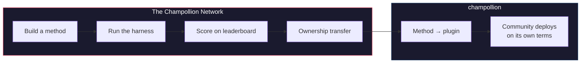

# Das Champollion-Netzwerk

> **Zusammenfassung.** Das Champollion-Netzwerk ist eine offene Infrastruktur, um Übersetzungs-Testsets für so viele Sprachpaare wie möglich zu *erstellen und ihnen zu vertrauen* — aufgebaut *mit* Fachleuten und Gemeinschaften, niemals von ihnen ohne Erlaubnis gesammelt — und um das gesamte Feld navigierbar zu machen: wer was übersetzen kann, wie gut jede Methode bei welcher Textart abschneidet und wo die Lücken sind. Jede Methode ist willkommen, ob Mensch oder Maschine. Sie können auch eine Methode entwickeln und einreichen und sehen, wie sie im Vergleich zu echten Korpora abschneidet. Für die Sprachen, deren Daten von Gemeinschaften bereitgestellt werden, ist Souveränität nicht verhandelbar: Die Menschen, die ein Korpus bereitstellen, besitzen die Schlüssel dazu und zu allem, was daran gemessen wird.

Dieser Abschnitt ist das Zuhause der Karte. Die darunterliegenden Seiten erklären, wie das
Netzwerk der gemessenen Paare aufgebaut ist ([Wie das Netzwerk
funktioniert](/docs/network/how-it-works)), warum die öffentliche Arbeitswarteschlange das priorisiert, was sie
priorisiert ([Warum die Warteschlange](/docs/network/perspectives/why-the-queue) und die
[Spezifikation zur Erstellung der Warteschlange](/docs/network/specifications/queue-construction)),
und wie die Stärke einer Verbindung berechnet wird
([Verbindungsstärke](/docs/network/specifications/connection-strength)).
Wenn Sie noch entscheiden, ob Sie dem Projekt überhaupt vertrauen können, beginnen Sie mit
[Ehrliche Einschränkungen](/docs/network/honest-limitations); wenn Sie bereits wissen,
was Sie entwickeln möchten, finden Sie den Einstieg unter
[Was Champollion ist](/docs/what-is-champollion).

**Es basiert auf zwei Arten von Benchmarks.** *Öffentliche Benchmarks* nutzen offene Datensätze, um jede Methode kostengünstig und offen abzubilden und einzustufen — die Scraping-/Open-Data-Basisstufe, wobei das Kontaminationsrisiko vermerkt wird. *Souveräne Benchmarks* sind der Goldstandard: geheime Testsets, die von Sprachgemeinschaften erstellt, besessen und kontrolliert werden und die Champollion **niemals sieht** — blind evaluiert und nur dann, wenn die Gemeinschaft es autorisiert. Die Infrastruktur selbst ist im Quelltext verfügbar und wird von einer einzigen Instanz verwaltet; was einer Gemeinschaft gehört, sind die Testsets für ihre Sprache und die dafür entwickelten Methoden.

:::info[Start-/Aufbauphase]
Das Netzwerk ist jung, aber live: Die Rangliste enthält echte, veröffentlichte Durchläufe
und ist für die Einreichungen aller offen. Für genau das, was wir bereits beanspruchen und was noch nicht
— Verifizierung, Validierung durch die Gemeinschaft, Evaluierung mit zurückgehaltenen Daten — siehe
**[Ehrliche Einschränkungen](/docs/network/honest-limitations)**.
:::

---

## Das Problem

Der Cloud Translation-Dienst von Google listet 194 Sprachen auf ([Googles veröffentlichte Liste](https://docs.cloud.google.com/translate/docs/languages)). Metas NLLB-200 deckt 200 ab, und OMT-1600 (März 2026) beansprucht 1.600. Auf der Erde werden über 7.000 Sprachen gesprochen. Für die ~1.200 Sprachen im Long Tail von OMT-1600 — unsere Rechnung: die 1.600 abgedeckten Sprachen abzüglich der über 400, von denen die Autoren berichten, dass die Modelle sie "ausreichend gut verstehen" — sind die Modellgewichte nicht verfügbar, die Qualität liegt unterhalb brauchbarer Schwellenwerte, und die Evaluierung verwendete Texte aus dem Bibel-Bereich mit maschinellen Standardmetriken — keine morphologische Validierung, keine unabhängigen Tests, keine Verwaltung durch die Gemeinschaft. Für die verbleibenden ~5.400 Sprachen erzeugt kein vortrainiertes Modell überhaupt eine Ausgabe.

Große Technologieunternehmen investieren nun in die Abdeckung von ressourcenarmen Sprachen (LRL) — aber Abdeckung ohne unabhängige Qualitätsprüfung, morphologische Validierung oder Verwaltung durch die Gemeinschaft ist Abdeckung ohne Vertrauen. Die Sprecher, die Übersetzungswerkzeuge am dringendsten benötigen, sind dieselben Gemeinschaften, für die sie am unwahrscheinlichsten entwickelt werden.

**Das Netzwerk existiert, um das zu ändern.** Es bietet die Infrastruktur, um Testsets zu erstellen, jede Methode daran zu evaluieren — ob Mensch oder Maschine — und die Ergebnisse für jede Sprache abzubilden, mit reproduzierbarer Bewertung, offener Einreichung und Verwaltung durch die Gemeinschaft darüber, wer die Daten und die Ergebnisse kontrolliert.

Sprachdaten sind *Biodaten*. Wie genetische oder gesundheitliche Daten trägt eine Sprache die Identität und die Beziehungen der Menschen in sich, die sie sprechen, und sie kann nicht sinnvoll anonymisiert werden — daher besitzen die Menschen, die ein Korpus bereitstellen, die Schlüssel dazu und zu allem, was daran gemessen wird. Souveränität ist hier kein nachträglich angehängtes Merkmal; sie ist das Fundament, auf dem alles andere aufbaut.

---

## Wie es funktioniert

1. **Sie entwickeln eine Übersetzungsmethode** — ein angeleitetes LLM, ein feinabgestimmtes Modell, eine FST-gesteuerte Pipeline oder alles andere, was Übersetzungen erzeugt.
2. **Die Testumgebung (Harness) führt Benchmarks durch** — standardisierte Metriken (chrF++, exakte Übereinstimmung, FST-Akzeptanz), mit einem Fingerabdruck versehen und an einen spezifischen Git-Commit gebunden.
3. **Ergebnisse erscheinen auf der Rangliste** — live und offen für Einreichungen; jeder veröffentlichte Durchlauf ist reproduzierbar und vergleichbar.
4. **Wenn eine Methode funktioniert, geht das Eigentum über** — bei indigenen Sprachen wird der Code der Methode an die Verwaltungsorganisation der Gemeinschaft übertragen.
5. **Die Gemeinschaft stellt sie bereit — ob und wie sie möchte.** Die Methode wird als [champollion](https://champollion.dev)-Plugin exportiert und kann vollständig auf der Infrastruktur der Gemeinschaft ausgeführt werden. Champollion beansprucht keinen Anteil an dem, was dort eingenommen wird.

**Hier entwickeln. Dort bereitstellen.**

:::tip[Eine Sprache knacken, gewinnen, sie zurückgeben]
Dies ist absichtlich eine ML-Benchmarking-Operation — Wettbewerb ist der Weg, wie schwierige Paare
gelöst werden. Wir laden ML-Forscher und jeden fähigen Entwickler ein, die beste
Methode für ein spezifisch schwieriges Paar zu entwickeln, **eine Prämie zu gewinnen, wenn eine ausgeschrieben ist**, *und* die
daraus resultierende Methode an die Souveränitätsorganisation zu übergeben, der diese Sprache gehört. Die
Wettbewerbsenergie ist real; sie ist auf die Mission gerichtet, nicht darauf, um ihrer selbst willen eine
Rangliste zu erklimmen. Siehe die [Preis-Spezifikation](/docs/network/specifications/prizes).
:::

---

## Für wen dies gedacht ist

| Sie sind... | Das Netzwerk bietet Ihnen... |
|---|---|
| **ML-Ingenieur / Forscher** | Standardisierte Benchmarks, reproduzierbare Bewertungen, ein gemeinsames Korpus zum Testen |
| **Linguist** | Ein Framework, um Grammatikregeln und Wörterbücher in testbare Methoden zu verwandeln |
| **Professioneller / menschlicher Übersetzer** | Einen Ort, um Ihre Dienste zu registrieren und gefunden zu werden — menschliche Übersetzung ist hier eine erstklassige Methode, die neben den Maschinen gelistet und bewertet wird, kein nachträglicher Einfall |
| **Mitglied einer Sprachgemeinschaft** | Verwaltung darüber, wie die Methoden Ihrer Sprache entwickelt und bereitgestellt werden |
| **Geldgeber / Gutachter für Fördermittel** | Transparente, reproduzierbare Metriken zur Bewertung von Forschungsanträgen im Bereich Übersetzung |
| **Student** | Eine offene Einladung mit echter Wirkung — entwickeln Sie eine Methode, steuern Sie Ihre Ergebnisse bei |

---

## Unterstützte Referenzkorpora

**Die Rangliste ist live und noch in einem frühen Stadium** — die ersten Durchläufe sind veröffentlicht und
weitere folgen, während Mitwirkende Elemente der Warteschlange ausführen. Was folgt, ist keine
Rangliste; es ist die Menge der öffentlichen Referenzkorpora, gegen die eine Einreichung heute
bewertet werden kann. Korpora werden niemals hier gehostet: Die Testumgebung ruft Referenzen zur Laufzeit von der
Upstream-Quelle ab und bewertet gegen die frisch abgerufenen Daten.

### Global Voices (OPUS) — Nachrichtenbereich
- **Abdeckung:** 493 Sprachpaare katalogisiert und ausführbar (z. B. `eval-amh-fra-globalvoices-test-v1`, Amharisch → Französisch)
- **Lizenz:** CC BY 3.0
- **Quelle:** [Global Voices via OPUS](https://opus.nlpl.eu/)

### Tatoeba — Konversation / gemischter Bereich
- **Abdeckung:** 874 Sprachpaare katalogisiert und ausführbar (z. B. `eval-afr-eng-tatoeba-dev-v1`, Afrikaans → Englisch)
- **Lizenz:** CC BY 2.0
- **Quelle:** [Tatoeba-Gemeinschaft](https://tatoeba.org)

:::note[EdTeKLA ist nur für die Forschung — kein Ranking-Benchmark]
Das EdTeKLA Plains Cree-Korpus (*Cree: Language of the Plains*) unterliegt
[EdTeKLAs **modifizierter** CC BY-NC-SA](https://github.com/EdTeKLA/IndigenousLanguages_Corpora)
— souveränitätsbezogene, nicht-kommerzielle Bedingungen (das zugrundeliegende Lehrbuch selbst ist CC
BY-NC-ND 4.0). Es ist **von jeglichem Ranking ausgenommen** — es qualifiziert sich nicht für
die Rangliste, irgendeinen Preis oder die API-/kommerziellen Spuren — und die Remote-Evaluierung
über Modell-APIs ist **zustimmungspflichtig**: Die Testumgebung weigert sich, seinen
Text an Modell-APIs von Drittanbietern zu senden, es sei denn, die ausdrückliche Erlaubnis des Rechteinhabers
ist hinterlegt (lokale Evaluierung bleibt möglich).

FLORES+ **ist** hier angebunden und ausführbar (870 katalogisierte Paare, z. B.
`eval-flores-devtest-v1-amh-fra`), aber es weist eine **HOHE Kontamination** auf — öffentliche,
im Web gecrawlte Evaluierungsdaten, die Frontier-Modelle sehr wahrscheinlich bereits gesehen haben.
Es ist daher **nur relativ** zu betrachten: nutzbar, um Methoden direkt miteinander zu vergleichen, aber
**niemals als Benchmark für absolute Qualität ausgewiesen**, und es dient **nur zu Test- /
Illustrationszwecken**. Ein FLORES+-Ergebnis wird niemals als Qualitätsbewertung eingestuft und
niemals als Kettenkante auf der [Übersetzungskarte](https://champollion.dev) verwendet.
Siehe [Ehrliche Einschränkungen](/docs/network/honest-limitations) für genau das, was wir
beanspruchen und was nicht.
:::

---

## Die einzige Regel

:::danger[Nicht mit Evaluierungsdaten trainieren]
Methoden, die dem Benchmark-Datensatz ausgesetzt waren — als Trainingsdaten, Few-Shot-Beispiele, Wörterbucheinträge oder Prompt-Material — werden **disqualifiziert**. Führen Sie Fine-Tuning mit allem durch, was Sie möchten. Nur nicht mit dem Testset.
:::

---

## Nächste Schritte

- **[Eine Methode einreichen](/docs/network/getting-started/submit-a-method)** — wie Sie Ihren ersten Benchmark-Durchlauf einreichen
- **[Benchmark-Spezifikation](/docs/network/specifications/benchmark)** — das vollständige Experimentierprotokoll
- **[Ranglisten-Regeln](/docs/network/leaderboard/rules)** — Einreichungskriterien und Richtlinien gegen Manipulation
- **[Datenverwaltung](/docs/network/sovereignty/data-sovereignty)** — Korpora verbleiben bei ihren Verwaltern; jede Lizenz wird respektiert
- **[Wie die Arbeit finanziert wird](/docs/network/sovereignty/economic-model)** — nicht-kommerziell und derzeit selbstfinanziert; Geldgeber gesucht, und das Ziel jedes Dollars wird veröffentlicht

**[→ Rangliste ansehen](https://champollion.dev/leaderboard)**
