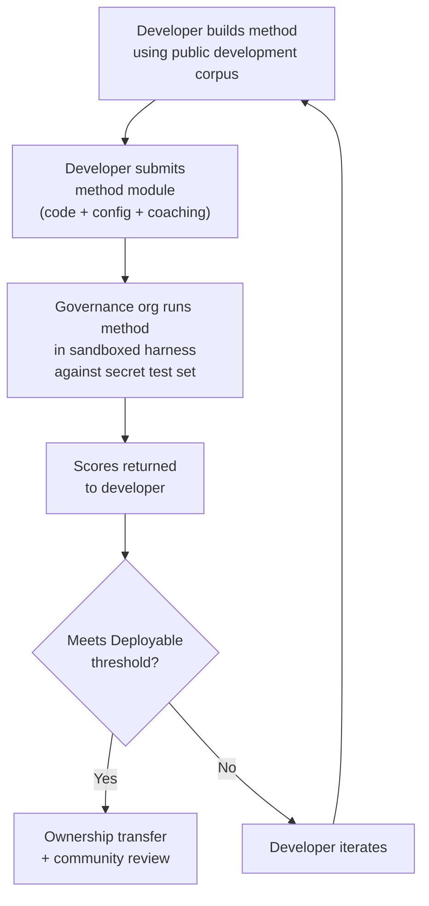

# Benchmark-Spezifikation

> **Zusammenfassung.** Dieses Dokument definiert das Evaluierungsprotokoll für das Champollion-MT-Evaluierungsökosystem: Korpusformat (§2), Run-Card-Schema (§3), Benchmark-Protokoll (§6), Anforderungen an die menschliche Validierung (§7), Souveränitätsmechanismen (§8), Leaderboard und Einreichungsmodell (§9), Kostenrahmen (§10) und Erweiterbarkeit auf neue Sprachen (§11). Für Metrikdefinitionen, zusammengesetzte Bewertungsgewichtungen, Schwellenwerte für Qualitätsstufen und Formeln für Kosten-/Geschwindigkeitsmetriken siehe `SCORING_SPEC.md` — die einzige verlässliche Quelle (Single Source of Truth) für die gesamte Bewertungslogik. Dieses Dokument verweist auf SCORING_SPEC für diese Details, anstatt sie zu duplizieren.


---

## 1. Grundsätze

### 1.1 Sprachen sind Biodaten

Eine Sprache ist kein neutrales Testmaterial. Wie genetische oder gesundheitsbezogene Daten sind Sprachdaten **Biodaten**: Sie tragen die Identität, Verwandtschaft und Beziehungen der Menschen in sich, die sie sprechen, und sie lassen sich nicht sinnvoll anonymisieren — entfernt man die Metadaten, kodiert die Sprache dennoch, wer ihre Menschen sind. Die Konsequenz für diese Spezifikation ist konkret: Die Menschen, die ein Korpus bereitstellen, halten die Schlüssel dazu und zu allem, was daran gemessen wird. Souveränität (§8) ist daher kein Zusatz zum Protokoll; sie ist dessen Voraussetzung, und jeder andere nachfolgende Grundsatz wirkt innerhalb ihrer.

### 1.2 Automatisierte Metriken sind Näherungswerte

Jede in diesem Dokument definierte Metrik wird maschinell berechnet. chrF++, FST-Akzeptanz, morphologische Genauigkeit, semantische Ähnlichkeit — sie alle sind automatisierte Näherungswerte für die Übersetzungsqualität. Sie sind nützlich für schnelle Iteration, systematischen Vergleich und das Erkennen von Regressionen. Sie sind **kein Ersatz für menschliches Urteilsvermögen**.

Die Evaluierungshierarchie:

```
Automated metrics (run cards, benchmarks)
    ↓ proxy for
Human review (bilingual speakers validate output)
    ↓ proxy for
Actual utility (does this help a language community?)
```

Keine automatisierte Bewertung, gleich wie hoch, kann eine sprachkundige Person ersetzen, die die Ausgabe liest und bestätigt, dass sie korrekt, natürlich und kulturell angemessen ist. Die in §5 definierten Qualitätsstufen sind heuristische Bezeichnungen für automatisierte zusammengesetzte Bewertungen — nützlich, um Fortschritte zu verfolgen, aber niemals allein hinreichend.

### 1.3 Methoden, nicht Modelle

Wir benchmarken **Methoden**, nicht Modelle. Ein Modell ist eine Komponente. Eine Methode ist das vollständige Rezept: Modellauswahl, Prompt-Design, Werkzeugeinsatz, Vor-/Nachverarbeitung, Coaching-Daten, Wiederholungsstrategien, alles. Zwei Teams, die dasselbe Modell mit unterschiedlichen Methoden verwenden, erhalten unterschiedliche Bewertungen. Das ist der Sinn der Sache.

### 1.4 Reproduzierbarkeit

Jedes Benchmark-Ergebnis muss reproduzierbar sein. Die Run Card (§3) erfasst die vollständige Konfiguration eines Experiments. Der Fingerprint (§3.5) identifiziert den experimentellen Aufbau. Der Run-Card-Hash (§3.6) verifiziert die Integrität des Ergebnisses. Jede Person mit derselben Methode, demselben Korpus und derselben Konfiguration sollte Bewertungen innerhalb von ±2 % erreichen (unter Berücksichtigung der Nicht-Determiniertheit des LLM-Samplings bei Temperatur > 0).

### 1.5 Keine synthetischen Evaluierungsdaten

**Dieses Projekt erzeugt, verwendet oder befürwortet keine synthetischen Evaluierungsdaten.** Alle Korpora müssen aus echtem, von Menschen verfasstem Text stammen — veröffentlichte Übersetzungen, Lehrbücher, zweisprachige Dokumente oder elizitierte Übersetzungen von sprachkundigen Personen.

LLMs dürfen unterstützen bei:
- Satzausrichtung (Auffinden paralleler Passagen in bestehenden zweisprachigen Texten)
- Formatkonvertierung (Überführung veröffentlichter Materialien in das Korpusschema)
- Metadaten-Anreicherung (Vorschlagen von Schwierigkeitsstufen, Registerbezeichnungen)
- Vorschlagen von Ausgangssätzen für die menschliche Übersetzung (§11.3 — der Übersetzungsschritt erfolgt stets durch Menschen)

LLMs dürfen **niemals** Referenzübersetzungen oder Evaluierungspaare erzeugen.

**Wir verhalten uns entwicklungsneutral gegenüber Trainingsdaten.** Wenn eine Methodenentwicklerin oder ein Methodenentwickler synthetische Trainingsdaten, Rückübersetzung oder Datenerweiterung in ihrer bzw. seiner Methode verwendet, ist das ihre bzw. seine Entscheidung — wir evaluieren die Ausgabe, nicht den Trainingsprozess. Metas OMT-1600 verwendet etwa 270 Millionen synthetische Parallelsätze, die per Rückübersetzung erzeugt wurden. Wir haben keine Einwände gegen so trainierte Methoden. Wir testen ausschließlich anhand menschlicher Kuratierung.

> **Warum kein Bibeltext zur Evaluierung?** OMT-1600 evaluiert 1.560 von 1.600 Sprachen anhand von Text aus der Bibeldomäne (Meta AI, *Omnilingual MT*, arXiv:2603.16309, 2026). Bibelübersetzungen haben ein archaisches Register, liturgisches Vokabular und formelhafte Satzstruktur. Unsere Evaluierungskorpora stammen aus gemeinschaftlich kuratiertem, domänenvielfältigem Text — aus den Bereichen Gesundheit, Recht, Bildung, Verwaltung, Konversation und Technik (siehe §2.7). Dies ist eine bewusste Designentscheidung. Gemeinschaften benötigen Übersetzungen für die Domänen, in denen sie tatsächlich leben und arbeiten, nicht ein einzelnes religiöses Register. Eine Methode, die bei Genesis 1,1 gut abschneidet, sagt Ihnen fast nichts über ihre Leistung bei einer Tagesordnung eines Band Council oder einem Aufnahmeformular einer Klinik.

---

## 2. Korpusschema

Ein Korpus ist ein kuratierter Satz paralleler Textpaare mit strukturierten Metadaten. Es ist die Grundwahrheit (Ground Truth), an der alle Methoden gemessen werden.

### 2.1 Datensatz-Umschlag

Die oberste Struktur einer Korpusdatei:

```json
{
  "dataset": {
    "id": "edtekla-dev-v1",
    "version": "1.0",
    "language_pair": "EN→CRK",
    "source_language": "en",
    "target_language": "crk",
    "created": "2026-05-01",
    "license": "LicenseRef-EdTeKLA-Modified-CC-BY-NC-SA-4.0",
    "provenance": ["gold_standard", "textbook"]
  },
  "entries": [ ... ]
}
```

| Feld | Typ | Erforderlich | Beschreibung |
|-------|------|----------|-------------|
| `id` | string | ✅ | Eindeutige Datensatzkennung, verwendet in Run Cards und im Leaderboard |
| `version` | string | ✅ | Semantische Version. Ein Hochzählen macht vorherige Run-Card-Vergleiche ungültig |
| `language_pair` | string | ✅ | Anzeigebezeichnung (z. B. `EN→CRK`) |
| `source_language` | string | ✅ | BCP-47-Ausgangssprachcode |
| `target_language` | string | ✅ | BCP-47-Zielsprachcode |
| `created` | string | ✅ | ISO-8601-Erstellungsdatum |
| `license` | string | ✅ | SPDX-Lizenzkennung |
| `provenance` | string[] | ✅ | Liste der über alle Einträge verwendeten Provenienz-Tags |

### 2.2 Eintragsschema

Jeder Eintrag im Korpus stellt eine Übersetzungsherausforderung dar:

```json
{
  "id": 42,
  "source": "I see the dog",
  "reference": "niwâpamâw atim",
  "segment": "gold_standard",
  "difficulty": 2,
  "provenance": "gold_standard",
  "register": "conversational",
  "context": "declaration",
  "morphological_analysis": "ni-wâpam-âw atim | 1sg-see.TA-3sg.DIR dog.AN",
  "notes": "Animate noun (atim); direct form because speaker is proximate",
  "variant_class": "simple-ta-direct"
}
```

| Feld | Typ | Erforderlich | Beschreibung |
|-------|------|----------|-------------|
| `id` | integer | ✅ | Eindeutige Kennung innerhalb des Korpus |
| `source` | string | ✅ | Ausgangstext in der Ausgangssprache |
| `reference` | string | ✅ | Goldstandard-Referenzübersetzung in der Zielsprache |
| `segment` | string | 📎 | Korpuspartition: `gold_standard`, `held_out`, `development` oder `diagnostic` |
| `difficulty` | integer | 📎 | Schwierigkeitsbewertung 1–5 (siehe §2.4) |
| `provenance` | string | 📎 | Herkunft dieses Eintrags (siehe §2.5) |
| `register` | string | 📎 | Register-/Formalitätsstufe (siehe §2.6) |
| `context` | string | 📎 | Kommunikative Funktion (siehe §2.6) |
| `domain` | string | 📎 | Anwendungsdomäne aus der 16-Code-Taxonomie (siehe §2.7). Muss eine der folgenden sein: `conv`, `ecommerce`, `edu`, `financial`, `gov`, `legal`, `literary`, `marketing`, `medical`, `news`, `religious`, `scientific`, `subtitles`, `support`, `tech`, `ui`. Wird zur Konstruktionszeit validiert. |

> **📎 = EMPFOHLEN.** Der Harness behandelt fehlende optionale Felder mittels Standardwerten reibungslos. Korpora von Drittanbietern müssen pro Eintrag lediglich `id`, `source` und `reference` bereitstellen.
| `morphological_analysis` | string | ❌ | Goldstandard-morphologische Aufschlüsselung |
| `notes` | string | ❌ | Übersetzernotizen, dialektale Varianten, Ambiguitätskennzeichen |
| `variant_class` | string | ❌ | Klassenbezeichnung zur Gruppierung akzeptabler Übersetzungsvarianten |


### 2.3 Korpussegmente

Das Korpus ist in Segmente mit unterschiedlichen Zugriffsebenen unterteilt:

| Segment | Zweck | Zugriff | Mindestgröße |
|---------|---------|--------|-------------|
| `development` | Methodenentwicklung und Iteration. Entwickler nutzen diese frei. | **Öffentlich** | 30 Einträge |
| `diagnostic` | Gezielte Tests für spezifische linguistische Phänomene. | **Öffentlich** | 10 Einträge |
| `gold_standard` | Offizielle Benchmark-Evaluierung. Leaderboard-Bewertungen stammen hierher. | **Geheim** — verwahrt von der Governance-Organisation | 50 Einträge |
| `held_out` | Reserviert für zukünftige Evaluierung. Wird bis zur Aktivierung nie verwendet. | **Geheim** — verwahrt von der Governance-Organisation | 10 Einträge |

> **Aktueller Stand:** Nur das Segment `development` existiert in ausgelieferten Datensätzen. Die Segmente `diagnostic`, `gold_standard` und `held_out` sind für die zukünftige Verwendung definiert, wenn die Korpora wachsen.

Die Segmente `gold_standard` und `held_out` sind vollständig geheim. Sowohl die Ausgangssätze als auch die Referenzübersetzungen werden auf einer Governance-kontrollierten Infrastruktur verwahrt. Methodenentwickler sehen weder die Fragen noch die Antworten. Siehe §8 für den Souveränitätsmechanismus.

### 2.4 Schwierigkeitsstufen

| Stufe | Beschreibung | Beispiele |
|------|-------------|----------|
| 1 — Grundwortschatz | Einzelne Wörter, gängige Begrüßungen, Zahlen | „hello" → „tânisi", „dog" → „atim" |
| 2 — Einfache Sätze | Subjekt-Verb oder SVO, Präsens | „I see the dog" → „niwâpamâw atim" |
| 3 — Mittlere Komplexität | Vergangenheits-/Zukunftsform, Possessiva, Belebtheit | „I saw his dog yesterday" |
| 4 — Komplexe Morphologie | Obviation, Passiv, Konjunktordnung, Relativsätze | „the woman whose son went to the store" |
| 5 — Fortgeschritten | Mehrsätzig, formelles Register, zeremoniell, idiomatisch | Ganzer Absatz mit registergerechtem Ton |

Ein gut konstruiertes Korpus sollte Einträge über alle fünf Schwierigkeitsstufen hinweg enthalten, mit Schwerpunkt auf den Stufen 2–4, in die die meisten realen Übersetzungsherausforderungen fallen.

### 2.5 Provenienz-Tags

Jeder Eintrag muss seine Herkunft angeben:

| Tag | Bedeutung |
|-----|---------|
| `gold_standard` | Von sprachkundigen Personen verifiziert |
| `textbook` | Aus veröffentlichten Bildungsmaterialien |
| `elicited` | Durch strukturierte Elizitationssitzungen erzeugt |
| `corpus` | Aus einem Parallelkorpus extrahiert |

> **Hinweis:** In der Praxis sind Provenienzwerte frei formulierte Zeichenketten. Die obigen Tags sind Konventionen, kein validiertes Enum — Datensätze können andere beschreibende Provenienz-Zeichenketten verwenden.

### 2.6 Register und Kontext

**Register** beschreibt die Formalität und den sozialen Kontext:

| Register | Beschreibung |
|----------|-------------|
| `conversational` | Alltagssprache zwischen Gleichrangigen |
| `formal` | Amtliche oder institutionelle Sprache |
| `technical` | Domänenspezifisches Vokabular |
| `ceremonial` | Traditioneller oder sakraler Sprachgebrauch |
| `educational` | Sprachlehrmaterialien |

**Kontext** beschreibt die kommunikative Funktion:

> 🔲 **Geplant.** Das Feld `context` ist im Schema definiert, aber in aktuellen Datensätzen noch nicht befüllt. Es ist für die zukünftige Korpusanreicherung reserviert.

| Kontext | Beschreibung |
|---------|-------------|
| `greeting` | Soziale Begrüßung oder Verabschiedung |
| `declaration` | Tatsachenfeststellung |
| `question` | Interrogativ |
| `instruction` | Befehl oder Anweisung |
| `narrative` | Erzählung oder Beschreibung |
| `label` | UI-Bezeichnung, Schaltflächentext oder Überschrift |
| `error` | Fehlermeldung oder Warnung |

### 2.7 Domäne {#27-domain}

**Domäne** beschreibt den realen Anwendungsfall — die Art des zu übersetzenden Inhalts. Dies ist orthogonal zu Register und Kontext:

- **Register** beantwortet: *Wie formell ist dies?*
- **Kontext** beantwortet: *Was tut dieser Satz?*
- **Domäne** beantwortet: *Für welche Branche/welchen Anwendungsfall ist dies?*

Ein Rechtsvertrag (Domäne: `legal`) könnte formell sein (Register: `formal`) und eine Erklärung enthalten (Kontext: `declaration`). Ein Chatbot-Transkript im Rechtsbereich (Domäne: `legal`) könnte konversationell sein (Register: `conversational`) und Fragen enthalten (Kontext: `question`). Dieselbe Domäne, unterschiedliches Register und Kontext.

| Domänencode | Beschreibung | Typische Abnehmer |
|-------------|-------------|-------------------|
| `ui` | Zeichenketten von Softwareoberflächen | App-Entwickler, Lokalisierungsteams |
| `legal` | Verträge, Gesetze, Gerichtsakten, Einwanderungsdokumente | Anwaltskanzleien, Gerichte, Compliance-Teams, IP-Anwälte |
| `medical` | Klinische Notizen, Arzneimitteletiketten, Patientenkommunikation, Studienprotokolle | Krankenhäuser, Pharmaunternehmen, klinische Studien, Patientenportale |
| `financial` | Bankwesen, Versicherung, Aufsichtsmeldungen, Prüfberichte | Banken, Versicherer, Aufsichtsbehörden, Prüfer |
| `edu` | Lehrbücher, Lehrpläne, Unterrichtsplanungen, akademische Materialien | Schulen, Universitäten, Lehrbuchverlage |
| `ecommerce` | Produktbeschreibungen, Rezensionen, Marktplatzangebote | Online-Händler, Marktplatzverkäufer |
| `marketing` | Werbetexte, Markenbotschaften, Kampagnen, Slogans | Werbeagenturen, Markenteams |
| `gov` | Grundsatzdokumente, Verordnungen, öffentliche Bekanntmachungen, Gesetzgebung | Behörden, Compliance-Teams |
| `scientific` | Forschungsarbeiten, Abstracts, Methodik, Förderanträge | Forschende, Fachzeitschriften, Förderorganisationen |
| `religious` | Heilige Schriften, liturgische Texte, theologische Kommentare | Glaubensgemeinschaften, liturgische Verlage |
| `support` | FAQs, Fehlermeldungen, Fehlerbehebungsanleitungen, Chatbot-Skripte | SaaS-Unternehmen, Helpdesks |
| `subtitles` | Film-, Fernseh-, Streaming- und Gaming-Dialoge | Streaming-Plattformen, Studios, Gaming-Unternehmen |
| `news` | Journalismus, Agenturmeldungen, Redaktionelles, Pressemitteilungen | Medienorganisationen, Nachrichtenagenturen |
| `literary` | Belletristik, Poesie, Erzählung, kulturelle Texte | Verlage, Organisationen zur kulturellen Bewahrung |
| `conv` | Informelle Konversation, soziale Medien, Nachrichtenaustausch | Verbraucher-Apps, soziale Plattformen |
| `tech` | API-Dokumentation, Handbücher, technische Spezifikationen, technische Leitfäden | Dokumentationsteams, Engineering-Organisationen |

> **Domänenspezifische Benchmarks.** Der allgemeine Benchmark evaluiert eine Methode über alle Domänen hinweg. Das Network unterstützt jedoch auch **domänengefilterte Benchmarks** — bei denen Bewertungen nur für Einträge berechnet werden, die mit einer bestimmten Domäne getaggt sind. So können Nutzer folgende Frage beantworten: „Welche Methode ist am besten für die Übersetzung von Rechtsdokumenten ins Französische?" im Vergleich zu „Welche Methode hat die beste Gesamtbewertung für Französisch?"
>
> Domänengefilterte Leaderboard-Rankings ermöglichen es Nutzern, Methoden innerhalb eines einzelnen Anwendungsfalls zu vergleichen. Unterschiedliche Methoden schneiden über verschiedene Domänen hinweg unterschiedlich ab — eine auf Rechtsterminologie feinabgestimmte Methode kann bei Rechtstext weitaus besser abschneiden als bei Konversationstext. Das Network hilft Nutzern, die Methode zu finden, die für ihren spezifischen Anwendungsfall am besten funktioniert.

> **Zukünftig: Network-Assistent.** Ein konversationeller Assistent, der Nutzern hilft, ihren MT-Anwendungsfall zu beschreiben (Domäne, Sprachpaar, Qualitätsanforderungen) und relevante gemeinschaftsvalidierte Methoden aus dem Leaderboard hervorhebt — etwa „welche Methode erzielt die höchste Bewertung bei EN→JA-Benchmarks der medizinischen Domäne?" — ist eine Navigationshilfe, die wir in Erwägung ziehen, abhängig von ausreichend domänengetaggten Evaluierungsdaten und Methodenvielfalt.

---

## 3. Run-Card-Schema {#3-run-card-schema}

Die Run Card ist die atomare Einheit der Evaluierung. Sie ist ein eigenständiges JSON-Dokument, das die vollständige Konfiguration und die Ergebnisse eines einzelnen Evaluierungslaufs aufzeichnet: eine Methode, ein Modell, eine Konfiguration, ein Datensatz.

Jede Run Card erfasst drei Dimensionen:
- **Qualität** — wie gut sind die Übersetzungen?
- **Kosten** — wie viel hat ihre Erstellung gekostet?
- **Geschwindigkeit** — wie lange hat es gedauert?

### 3.1 Felder der obersten Ebene

| Feld | Typ | Beschreibung |
|-------|------|-------------|
| `run_id` | string | UUID v4, generiert zu Beginn des Laufs |
| `harness_version` | string | Semantische Version des Harness (z. B. `2.0`) |
| `timestamp` | string | ISO-8601-UTC-Zeitstempel des Laufbeginns |
| `elapsed_seconds` | number | Reale Dauer (Wall-Clock) des gesamten Laufs |

### 3.2 Methodenkonfiguration

Diese Felder definieren den experimentellen Aufbau — was getestet wurde und wie.

| Feld | Typ | Erforderlich | Beschreibung |
|-------|------|----------|-------------|
| `model_slug` | string | ✅ | Modellkennung (z. B. `google/gemini-2.5-flash`) |
| `model_id` | string | ❌ | Aufgelöste Modellkennung, die von der API zurückgegeben wird |
| `condition` | string | ✅ | Experimentbezeichnung (z. B. `baseline`, `coached-v3`, `few-shot`) |
| `temperature` | number | ✅ | Sampling-Temperatur |
| `system_prompt_sha256` | string | ✅ | SHA-256-Hash des vollständigen System-Prompts |
| `system_prompt_used` | string | ✅ | Der vollständige System-Prompt-Text |
| `coaching_data_sha256` | string | ❌ | SHA-256-Hash der Coaching-Datendatei, falls verwendet |
| `fst_version` | string | ❌ | Version des FST-Analysators, falls verwendet |
| `tools_enabled` | string[] | ❌ | Liste der der Methode verfügbaren Werkzeuge |
| `batch_size` | number | ❌ | Einträge pro nebenläufigem API-Batch |
| `max_retries` | number | ❌ | Maximale Wiederholungen bei FST-Ablehnung, falls zutreffend |

:::info[Veröffentlichte Run Cards enthalten method_config]
Wenn eine Run Card auf dem Leaderboard veröffentlicht wird (über `mt-eval publish`), enthält sie außerdem einen `method_config`-Block mit der kanonischen 8-Feld-MethodConfig (`model`, `temperature`, `batchSize`, `register`, `coachingFile`, `coachingPrompt`, `promptContext`, `qualityTier` — alle in camelCase). Dies ermöglicht einen Import ohne Rekonstruktion: `champollion leaderboard --install` liest `method_config` direkt und schreibt es als Plugin-Manifest. Die oben genannten Telemetriefelder (§3.2) erfassen, was der Harness beobachtet hat; `method_config` erfasst, was der Entwickler beabsichtigt hat.
:::

### 3.3 Datensatzreferenz

| Feld | Typ | Beschreibung |
|-------|------|-------------|
| `dataset.id` | string | Datensatzkennung |
| `dataset.version` | string | Datensatzversion |
| `dataset.language_pair` | string | Anzeigebezeichnung |
| `dataset.sha256` | string | SHA-256-Hash des Datensatzdateiinhalts |
| `dataset.entry_count` | number | Anzahl der evaluierten Einträge |

Der SHA-256 des Datensatzes verankert das Ergebnis an einer bestimmten Version der Daten. Wenn sich der Datensatz ändert, sind alte Run Cards nicht vergleichbar.

### 3.4 Bewertungen (Qualität)

Aggregierte Metriken für den gesamten Lauf. Alle Qualitätsmetriken sind **automatisiert** — siehe §1.2.

| Feld | Typ | Beschreibung |
|-------|------|-------------|
| `scores.total` | number | Insgesamt evaluierte Einträge |
| `scores.exact_matches` | number | Einträge, bei denen die Ausgabe exakt mit der Referenz übereinstimmte |
| `scores.exact_match_rate` | number | 0.0–1.0 |
| `scores.equivalent_matches` | number | Einträge, die einer akzeptablen Variante entsprechen |
| `scores.equivalent_match_rate` | number | 0.0–1.0 |
| `scores.fst_accepted` | number | Vom FST-Analysator akzeptierte Einträge |
| `scores.fst_acceptance_rate` | number | 0.0–1.0, `null` falls kein FST konfiguriert |
| `scores.morphological_accuracy` | number | 0.0–1.0, FST-abgeleitet (Lemma-abgeglichen), `null` falls kein FST / keine Lemma-abgeglichenen Wörter. Beratend bis zur Aktivierung — siehe Scoring Spec §2.2 |
| `scores.morph_coverage` | number | 0.0–1.0, Anteil der analysierbaren vorhergesagten Wörter, die auf Lemma-Ebene mit der Referenz übereinstimmen (offenbart, wie spärlich `morphological_accuracy` ist) |
| `scores.chrf_plus_plus` | number | chrF++-Bewertung auf Korpusebene (0–100) |
| `scores.semantic_score` | number | Embedding-basierte semantische Ähnlichkeit (0.0–1.0) |
| `scores.ter` | number | Translation Edit Rate (0–∞, niedriger ist besser) |
| `scores.length_ratio` | number | avg(len(predicted)/len(reference)), ideal = 1.0 |
| `scores.code_switching_rate` | number | 0.0–1.0, Anteil der Einträge mit Ausgangssprachen-Durchsickern |
| `scores.hallucination_rate` | number | 0.0–1.0, Anteil der Einträge mit halluziniertem Inhalt |
| `scores.terminology_adherence` | number | 0.0–1.0, Einhaltung von Glossarbegriffen (`null` falls kein Glossar) |
| `scores.tokens_per_second` | number | total_tokens / elapsed_seconds |
| `scores.entries_per_minute` | number | pro Minute übersetzte Einträge |
| `scores.composite` | number | Gewichtete zusammengesetzte Bewertung (0.0–1.0). Siehe SCORING_SPEC §4 |
| `scores.errors` | number | Einträge, die fehlgeschlagen sind (API-Fehler, Zeitüberschreitung usw.) |
| `scores.by_difficulty` | object | Nach Schwierigkeitsstufe aufgeschlüsselte Bewertungen |
| `scores.by_provenance` | object | Nach Provenienz-Tag aufgeschlüsselte Bewertungen |
| `scores.by_domain` | object | ✅ Implementiert — Nach Domäne aufgeschlüsselte Bewertungen (§2.7). Ermöglicht domänengefiltertes Leaderboard-Ranking. Berechnet von tester.py und durchgereicht von publish.py. |

### 3.5 Summen (Kosten)

| Feld | Typ | Beschreibung |
|-------|------|-------------|
| `totals.prompt_tokens` | number | Gesamtzahl der Eingabe-Token über alle API-Aufrufe |
| `totals.completion_tokens` | number | Gesamtzahl der Ausgabe-Token |
| `totals.reasoning_tokens` | number | Für Chain-of-Thought verwendete Token (0 bei den meisten Modellen) |
| `totals.cached_tokens` | number | Aus dem Prompt-Cache des Anbieters bereitgestellte Token |
| `totals.total_cost_usd` | number | Gesamtkosten in USD |
| `totals.cost_per_entry_usd` | number | `total_cost_usd / entry_count` |
| `totals.cost_per_source_char` | number | USD pro Ausgangszeichen — sprachübergreifend vergleichbar |

### 3.6 Zeitmessung (Geschwindigkeit)

| Feld | Typ | Beschreibung |
|-------|------|-------------|
| `elapsed_seconds` | number | Reale Dauer (Wall-Clock) des gesamten Laufs (oberste Ebene) |
| `scores.avg_latency_seconds` | number | Mittlere Antwortzeit pro Eintrag |
| `scores.median_latency_seconds` | number | Median-Antwortzeit pro Eintrag |
| `scores.p95_latency_seconds` | number | 95. Perzentil der Antwortzeit pro Eintrag |

### 3.7 Ergebnisse pro Eintrag

Jeder Eintrag im `results[]`-Array zeichnet eine Übersetzung auf. Die Daten pro Eintrag werden in der `run_card_entries`-Tabelle (Migration 005) mit denormalisierten LYSS-Verdikten (Migration 006) persistiert.

| Feld | Typ | Beschreibung |
|-------|------|-------------|
| `entry_id` | string | Entspricht `entries[].id` im Korpus |
| `source` | string | Übersetzter Ausgangstext |
| `expected` | string | Goldstandard-Referenzübersetzung |
| `raw_predicted` | string \| null | Rohe Modellausgabe vor der Nachverarbeitung |
| `predicted` | string | Tatsächliche Ausgabe der Methode (nachverarbeitet) |
| `segment` | string | Segmentkennung (z. B. Satzindex) |
| `difficulty` | string \| null | Schwierigkeitsstufe aus dem Korpus |
| `domain` | string | Domänen-Tag aus dem Korpus (§2.7) |
| `exact_match` | boolean | Ob die Ausgabe exakt mit der Referenz übereinstimmte |
| `chrf_score` | number \| null | chrF++ auf Satzebene (0–100) |
| `bleu_score` | number \| null | BLEU auf Satzebene (0–100) |
| `latency_s` | number \| null | Antwortzeit in Sekunden |
| `cost_usd` | number \| null | Kosten in USD für diesen Eintrag |
| `tool_call_count` | integer | Anzahl der verwendeten Werkzeugaufrufe (0, falls keine) |
| `error` | string \| null | Fehlermeldung, falls dieser Eintrag fehlgeschlagen ist |
| `plugin_metrics` | object | Vollständige Plugin-Ausgabe pro Eintrag (JSONB) |
| `fst_valid` | boolean \| null | GiellaLT-FST hat die Vorhersage akzeptiert (denormalisiertes LYSS-fst) |
| `equivalent_match` | boolean \| null | CRK-Linter hat strukturelle Äquivalenz bestätigt (denormalisiertes LYSS-eq) |
| `semantic_verdict` | string \| null | LYSS-sem-Verdikt: `VALID`, `MISMATCH`, `UNKNOWN`, `ERROR` |
| `code_switching_detected` | boolean \| null | Ausgangssprachen-Token in der Ausgabe erkannt |
| `hallucination_detected` | boolean \| null | Erfundener Inhalt in der Ausgabe erkannt |


### 3.8 Fingerprint

Eine Kennung zur Reproduzierbarkeit. Zwei Läufe mit identischen Fingerprints verwendeten dasselbe experimentelle Setup.

Der Fingerprint ist der SHA-256-Hash der sortierten Verkettung von:
- `dataset.sha256`
- `model_slug`
- `condition`
- `system_prompt_sha256`
- `temperature`
- `harness_version`
- `batch_size`
- `tools_enabled`

> **Warum 8 Komponenten?** Batch-Größe und Werkzeugaufrufe beeinflussen die Ausgabequalität wesentlich und müssen in die Identität einbezogen werden. Zwei Läufe mit unterschiedlichen Batch-Größen oder unterschiedlichen aktivierten Werkzeugen sind unterschiedliche experimentelle Aufbauten, selbst wenn alle anderen Parameter übereinstimmen.

Zwei Läufe mit identischen Fingerprints sollten vergleichbare Ergebnisse liefern. Unterschiede sind auf API-Nicht-Determiniertheit (Temperatur > 0) oder anbieterseitige Modellaktualisierungen zurückzuführen.

### 3.9 Run-Card-Hash

Der SHA-256-Hash der gesamten Run-Card-JSON (wobei das Feld `run_card_hash` selbst während des Hashens auf `""` gesetzt wird). Dies ist das Manipulationserkennungssiegel. Wenn sich irgendein Feld ändert, bricht der Hash.

---

## 4. Automatisierte Metriken

Alle Metriken in diesem Abschnitt werden maschinell berechnet. Siehe §1.2.

### 4.1 Metrikdefinitionen

| Metrik | Status | Was sie misst | Bereich |
|--------|--------|-----------------|-------|
| **chrF++** | ✅ Implementiert | Zeichen-n-Gramm-F-Score. Arbeitet auf Zeichenebene und ist dadurch robuster als Metriken auf Wortebene (BLEU) für morphologisch reiche Sprachen, in denen Wörter lang und stark flektiert sind. Berechnet durch sacrebleu. | 0–100 (native Skala). Wird durch 100 geteilt, wenn im Composite verwendet. |
| **FST-Akzeptanzrate** | ✅ Implementiert | Anteil der vorhergesagten Wörter, die vom morphologischen Analysator (GiellaLT HFST) als gültige Formen in der Zielsprache akzeptiert werden. Ein vom FST akzeptiertes Wort ist ein echtes, strukturell gültiges Wort — keine Halluzination. | 0.0–1.0 |
| **Exakte Übereinstimmung** | ✅ Implementiert | Anteil der Vorhersagen, die nach Unicode-Normalisierung exakt mit der Referenz übereinstimmen. Streng, aber eindeutig — nützlich als Obergrenzenprüfung. | 0.0–1.0 |
| **Morphologische Genauigkeit** | 🔲 Geplant | Für Einträge mit morphologischer Goldstandard-Analyse: Anteil der korrekt erzeugten Morpheme. Feingranularer als FST-Akzeptanz — ein Wort kann FST-gültig sein, aber die falsche Morphemstruktur haben (richtige Wurzel, falsche Zeitform). | 0.0–1.0 |
| **Äquivalente Übereinstimmung** | ⚡ Teilweise | Anteil, der einer akzeptablen Variante der Referenz entspricht — unter Berücksichtigung von Wortreihenfolge, dialektalen Unterschieden und orthografischen Konventionen. Derzeit für CRK über die `CrkLinterMetric` des CRK-Eval-Standards implementiert (in `eval_standards/crk/`); automatisch über die `evalMetrics`-Deklaration der CRK-Sprachkarte geladen. Eine generische Implementierung erfordert pro Eintrag `variants[]` im Korpus. | 0.0–1.0 |
| **Semantische Bewertung** | ⚡ Teilweise | Bedeutungserhaltung unabhängig von der Oberflächenform. Derzeit für CRK über die `CrkSemanticMetric` des CRK-Eval-Standards implementiert (in `eval_standards/crk/`, verdikt-gewichteter Näherungswert). Universelle Embedding-basierte Kosinus-Ähnlichkeit ist geplant — siehe SCORING_SPEC §2.3. | 0.0–1.0 |

### 4.2 Zusammengesetzte Bewertung

Die zusammengesetzte Bewertung ist ein gewichteter Durchschnitt aller *verfügbaren* Metriken:

```
composite = Σ (weight_i × metric_i)   for all available metrics
             ─────────────────────
             Σ weight_i              (renormalized to sum to 1.0)
```

Wenn eine Metrik nicht verfügbar ist (kein FST konfiguriert, keine Variantenklassen definiert, kein Embedding-Modell), wird ihr Gewicht anteilig auf die verbleibenden Metriken umverteilt. Das bedeutet, dass das Composite innerhalb einer Sprache stets vergleichbar ist — es verwendet die für diese Sprache verfügbaren Metriken und normalisiert entsprechend.

**Gewichtstabellen, Regeln zur Eingabenormalisierung und das vollständige Metrikinventar sind in `SCORING_SPEC.md` §4 definiert.** Dieses Dokument ist die SSOT für:
- Profil-A-Gewichte (Sprachen mit FST-Abdeckung — 9 Metriken, strukturelle Metriken tragen 40 %)
- Profil-B-Gewichte (Sprachen ohne FST-Abdeckung — 8 Metriken)
- Normalisierungsregeln (chrF++ ÷ 100, Invertierung von Code-Switching- und Halluzinationsrate)
- Aus dem Composite ausgeschlossene Metriken (BLEU, COMET, TER, Längenverhältnis, Konsistenz) und warum

Der Harness-Code spiegelt diese Tabellen in `mt_eval_harness/scoring.py` wider. Wenn sich SCORING_SPEC ändert, wird `scoring.py` zur Übereinstimmung aktualisiert und `test_scoring_ssot.py` validiert die Ausrichtung.

> **Warum kein BLEU?** BLEU arbeitet auf Wortebene und bestraft morphologische Variation. Für polysynthetische Sprachen kann ein einzelnes Wort ein ganzer Satz sein — BLEU würde geringfügige flexionelle Unterschiede als komplette Fehlschläge behandeln. chrF++ handhabt dies besser, indem es auf Zeichenebene arbeitet. BLEU ist aus beiden Gewichtstabellen ausgeschlossen. Siehe SCORING_SPEC Anhang A für die vollständige Begründung.


### 4.3 Kostenbereinigte Bewertung

Für Methoden, die kostenpflichtige APIs verwenden, berichten wir auch ein sekundäres Ranking. Die kostenbereinigte Formel ist in `SCORING_SPEC.md` §6.3 definiert.

---

## 5. Qualitätsstufen {#5-quality-tiers}

Qualitätsstufen sind heuristische Bezeichnungen für automatisierte zusammengesetzte Bewertungen. Sie beschreiben, was die Bewertungen in der Praxis tendenziell bedeuten, basierend auf menschlicher Überprüfung der Ausgaben auf jeder Ebene. **Sie sind keine validierten Qualitätsurteile** — nur menschliche Überprüfung (§6) kann die tatsächliche Nutzbarkeit bestätigen.

**Die Schwellenwerte und Beschreibungen der Stufen sind in `SCORING_SPEC.md` §5 definiert.** Die Stufen sind: Baseline (0,00–0,30), Emerging (0,30–0,50), Functional (0,50–0,70), Deployable (0,70–0,85) und Fluent (0,85–1,00).

> [!IMPORTANT]
> **Automatisierte Stufen sind vorläufig.** Diese Bezeichnungen sind Nominierungen zur Überprüfung, keine Qualitätserklärungen. Eine Methode, die bei automatisierten Metriken „Deployable" erreicht, ist ein Kandidat für die Gemeinschaftsevaluierung — kein auslieferungsfertiges Produkt. Nur menschliche Überprüfung (§7) kann die tatsächliche Nutzbarkeit bestätigen. Die Stufengrenzen können sich zwischen Sprachen unterscheiden.

Diese Stufen sind vorläufig. Sie werden neu kalibriert, sobald Daten aus menschlicher Validierung zusammenkommen und wir lernen, wo die tatsächliche Schwelle „eine sprechende Person findet dies nützlich" für jede Sprache liegt. Die Stufengrenzen können sich zwischen Sprachen unterscheiden.

Keine Methode kann **Deployable** oder höher beanspruchen, ohne eine Gemeinschaftsüberprüfung, die bestätigt, dass zweisprachige Sprecher der Nutzbarkeit der Ausgabe zustimmen.

---

## 6. Benchmark-Protokoll

Ein **Benchmark** ist die systematische Erzeugung von Run Cards über einen deklarierten Parameterraum auf einem gegebenen Datensatz. Es handelt sich nicht um einen einzelnen Lauf — es ist eine strukturierte Erkundung dessen, wie verschiedene Konfigurationen abschneiden.

### 6.1 Was ein Benchmark erzeugt

Ein Benchmark erzeugt eine **Matrix von Run Cards** — eine für jede Kombination von Parameterwerten. Die Matrix ermöglicht einen facettenreichen Vergleich über:

- **Qualität** — zusammengesetzte Bewertung, Aufschlüsselung einzelner Metriken
- **Kosten** — Gesamt- und Pro-Eintrag-Kosten für jede Konfiguration
- **Geschwindigkeit** — reale Zeit (Wall-Clock) und Latenz pro Eintrag

Es gibt keine einzelne „Benchmark-Bewertung". Der Benchmark ist die vollständige Matrix. Verschiedene Interessengruppen werden sich für verschiedene Facetten interessieren: eine Forscherin optimiert für die zusammengesetzte Bewertung, ein Deployment-Ingenieur optimiert für Kosten pro Eintrag, eine Gemeinschaft überprüft die Qualität.

### 6.2 Parameterraum

Ein Benchmark deklariert, welche Parameter permutiert werden:

| Achse | Typische Werte | Zweck |
|------|---------------|-------|
| `model` | 4–12 Modelle (Frontier + Mittelklasse + Budget) | Wie sehr zählt die Modellfähigkeit? |
| `temperature` | 0.0, 0.3, 0.7 | Hilft oder schadet die Sampling-Zufälligkeit? |
| `prompt_version` | 2–3 Prompt-Strategien | Wie empfindlich ist die Methode gegenüber dem Prompt-Design? |
| `coaching_config` | mit/ohne Coaching-Daten | Verbessert das Einspeisen linguistischen Wissens die Ausgabe? |
| `tool_config` | mit/ohne FST, mit/ohne Wörterbuch | Verbessern linguistische Werkzeuge die Ausgabe? |

Der vollständige Permutationsraum:
```
runs = |models| × |temperatures| × |prompts| × |coaching| × |tools|
```

Ein typischer anfänglicher Benchmark: 12 Modelle × 3 Temperaturen × 2 Prompts × 2 Coaching = 144 Läufe.

### 6.3 Baselining vs. Methodenevaluierung

Ein Benchmark dient zwei unterschiedlichen Zwecken:

**Baselining** — Kartierung der Landschaft mit naiven Ansätzen. „Was können bestehende Modelle für diese Sprache ohne jegliches sprachspezifisches Engineering leisten?" Dies legt die Messlatte fest. Die Baseline-Matrix sagt Ihnen: welche Modelle am wenigsten halluzinieren, welche Temperaturen die konsistenteste Ausgabe erzeugen, ob Coaching-Daten überhaupt helfen, wo alle Modelle einheitlich versagen (was schwierige linguistische Probleme offenbart).

**Methodenevaluierung** — Testen einer spezifischen konstruierten Methode. „Schlägt meine FST-gesteuerte, gecoachte Pipeline die Baselines?" Die Run Card der Methode wird mit der Baseline-Matrix verglichen. Eine Methode ist interessant, wenn sie die beste Baseline übertrifft — wenn Engineering einen Mehrwert gegenüber naiven Modellaufrufen schafft.

Beide Aktivitäten erzeugen Run Cards mit demselben Schema. Der Unterschied liegt in der Absicht und im Parameterraum: Baselines permutieren über Modelle und Konfigurationen; die Methodenevaluierung testet eine Methode gegen die besten Konfigurationen.

### 6.4 Dev- vs. Goldstandard-Evaluierung

Methodenentwickler iterieren frei gegen die Korpussegmente `development` und `diagnostic`. Dies ist informell — keine Grenzen, keine Einreichungen, keine Beteiligung der Governance. Die Entwicklerin oder der Entwickler lernt, was funktioniert.

Offizielle Leaderboard-Bewertungen stammen ausschließlich aus der `gold_standard`-Evaluierung. Dies ist formell:
1. Die Entwicklerin oder der Entwickler reicht ihre bzw. seine vollständige, ausführbare Methode ein (Code + Konfiguration + Coaching-Daten)
2. Die Governance-Organisation führt sie in einem gesandboxten Harness gegen den geheimen Testsatz aus
3. Es kommen nur Bewertungen zurück

Siehe §8 für den vollständigen Souveränitätsmechanismus.

---

## 7. Menschliche Validierung {#7-human-validation}

Automatisierte Metriken sind Näherungswerte. Menschliche Validierung ist die Grundwahrheit.

### 7.1 Was menschliche Überprüfung erfasst, das Metriken entgeht

- **Morphologisch gültig, aber semantisch falsch** — das FST akzeptiert das Wort, chrF++ ist hoch, aber die Übersetzung bedeutet etwas anderes
- **Kulturell unangemessen** — die Übersetzung ist technisch korrekt, verwendet aber ein Register oder eine Rahmung, die eine Gemeinschaft ablehnen würde
- **Halluzinierte Plausibilität** — die Ausgabe sieht für eine nicht sprachkundige Person wie die Zielsprache aus, ist aber für eine sprachkundige Person Kauderwelsch
- **Akzeptable, aber nicht markierte Variation** — die Ausgabe ist korrekt, aber die automatisierten Metriken markieren sie als falsch, weil sie eine dialektale Variante verwendet, die nicht in der Referenz enthalten ist

### 7.2 Das Validierungstor

Keine Methode kann von der Stufe **Functional** zur Stufe **Deployable** aufsteigen, ohne dass eine menschliche Validierung bestätigt, dass zweisprachige Sprecher der Nutzbarkeit der Ausgabe zustimmen. Dies ist keine Formalität — es ist der Sinn der Sache. Die automatisierten Metriken existieren, um das Volumen der Ausgaben zu reduzieren, das menschlich überprüft werden muss. Sie können sie nicht ersetzen.

### 7.3 Protokoll zur Gemeinschaftsüberprüfung

> 🔲 **Geplant**: Die Oberfläche zur Gemeinschaftsüberprüfung ist noch nicht in Betrieb. Dieser Abschnitt beschreibt den beabsichtigten Prozess.

1. Eine Methode erreicht die Deployable-Schwelle bei automatisierten Metriken
2. Eine Stichprobe von Ausgaben (nach Schwierigkeitsstufe stratifiziert) wird zweisprachigen Sprechern vorgelegt
3. Sprecher bewerten jede Übersetzung auf einer Skala: **reject** (ablehnen), **gist** (Bedeutung ist klar, aber die Formulierung ist falsch), **acceptable** (korrekt mit geringfügigen Problemen), **excellent** (nicht von menschlicher Übersetzung zu unterscheiden)
4. Die Governance-Organisation überprüft die aggregierten Bewertungen
5. Wenn die Gemeinschaft die Methode akzeptiert, geht sie zur Eigentumsübertragung und Bereitstellung über

Die Überprüfung weist eine Mindestform auf, bevor sie die Stufe **Community Validated**
(§9.4) verleihen kann: Die geschichtete Stichprobe umfasst **mindestens 30 Einträge**, **mindestens 2
Prüfer** — beide gemäß dem eigenen Protokoll der Community qualifiziert — und **mindestens 70 %**
der Einträge müssen die Akzeptanzschwelle der Community erfüllen. Die Stufe wird
ausschließlich durch die Community verliehen, die die Läufe selbst nach eigenem Ermessen testet,
und die Herabstufung ist symmetrisch: Dasselbe Protokoll, das als Stichprobenprüfung durchgeführt wird, entzieht die Stufe
ebenso öffentlich, wie sie verliehen wurde.

---

## 8. Souveränität

Evaluierungsdatensätze enthalten kuratiertes linguistisches Wissen, das der Sprachgemeinschaft gehört. Dieser Abschnitt definiert den technischen und rechtlichen Rahmen zum Schutz dieser Daten.

### 8.1 Das Problem

Herkömmliche Benchmarks veröffentlichen Testsätze offen. Einmal veröffentlicht, können die Daten nicht wieder zurückgezogen werden. Für indigene und Minderheitensprachgemeinschaften schafft dies eine extraktive Dynamik — linguistische Daten werden ohne fortlaufende Zustimmung verwendet. Der pragmatischen Sicht Dheins auf die Souveränität von Biodaten folgend, behandeln wir linguistische Daten als eine „unbeständige Ressource mit unabsehbarem Potenzial", die eine dynamische, beziehungsorientierte Governance erfordert.

### 8.2 Gesandboxte Ausführung

Der primäre Durchsetzungsmechanismus: Die Entwicklerin oder der Entwickler übergibt ihr bzw. sein Methodenmodul, die Governance-Organisation führt es gegen den vollständig geheimen Testsatz auf ihrer eigenen Infrastruktur aus, und es werden nur Bewertungen zurückgegeben. Die Entwicklerin oder der Entwickler sieht niemals die Ausgangssätze oder die Referenzübersetzungen.



Der Ablauf:
1. **Das Entwicklungskorpus ist öffentlich.** Keine Beschränkungen für die Segmente `development` und `diagnostic`.
2. **Der Goldstandard-Testsatz ist vollständig geheim.** Sowohl Ausgangssätze als auch Referenzübersetzungen befinden sich auf Governance-kontrollierter Infrastruktur.
3. **Um eine offizielle Bewertung zu erhalten, übergeben Sie Ihre Methode.** Die Governance-Organisation führt sie in einer Sandbox aus. Es kommen nur Bewertungen zurück.
4. **Die Governance-Organisation verfügt bereits über die Methode.** Die Einreichung IST der Methodencode. Wenn sie die Deployable-Schwelle erreicht, ist die Eigentumsübertragung bereits im Gange.
5. **Die Einreichung erfordert die Zustimmung zu den Bedingungen.** Einschließlich der Klausel zur Eigentumsübertragung (§8.3).
6. **Die Governance-Organisation kontrolliert den Zugriff vollständig.** Sie kann die Evaluierung jederzeit verweigern oder widerrufen. Dynamische Zustimmung.
7. **Verschlüsselung im Ruhezustand ist eine Verteidigung in der Tiefe.** Die primäre Durchsetzung ist architektonisch.

### 8.3 Eigentumsübertragung

Methoden, die eine zusammengesetzte Bewertung auf oder über der Deployable-Schwelle (0,70) gegen die Goldstandard-Evaluierung erreichen **und** die die menschliche Validierung (§7) bestehen, unterliegen der Eigentumsübertragung.

**Die Entwicklerin oder der Entwickler behält:**
- Zuschreibung und Anerkennung (der Name bleibt auf dem Leaderboard)
- Das Recht, über die Methode zu publizieren
- Das Recht, die Methode für andere Sprachpaare zu verwenden

**Die Governance-Organisation erhält:**
- Das Recht, die Methode für ihre Sprache zu verwenden, zu modifizieren, zu verteilen und zu monetarisieren
- Das Recht zur Unterlizenzierung
- Physischen Besitz des Methodencodes (bereits aus der Evaluierungseinreichung im Besitz)

### 8.4 Anforderungen an die Governance-Organisation

Um als Schlüsselverwahrer für einen Sprach-Benchmark zu dienen:

1. **Die Sprachgemeinschaft vertreten** — nachweisbare Beziehung zu Sprechern und kulturellen Autoritäten
2. **Kapazität für Schlüsselverwaltung** — technische Fähigkeit zur Verwaltung kryptografischer Schlüssel
3. **Verpflichtung zur Evaluierungsverfügbarkeit** — der Benchmark muss evaluierbar bleiben
4. **Teilnahmebedingungen veröffentlichen** — klare Dokumentation dessen, dem Entwickler zustimmen
5. **Unter anerkannten Prinzipien der Datensouveränität operieren** — Eigentum und Kontrolle der Gemeinschaft über ihre Sprachdaten, CARE oder gleichwertig

### 8.5 Umsetzung der Datensouveränitäts- und CARE-Prinzipien

| Prinzip | Implementierung |
|-----------|---------------|
| **Ownership** | Sprachdaten gehören der Gemeinschaft. Die Governance-Organisation kontrolliert die Evaluierungsinfrastruktur. |
| **Control** | Die Governance-Organisation kontrolliert die Evaluierung über eine Sandbox-Ausführung. Sie entscheidet, wer unter welchen Bedingungen einreicht. |
| **Access** | Die Gemeinschaft hat uneingeschränkten Zugang zu ihren eigenen Daten, Ergebnissen und den damit entwickelten Methoden. |
| **Possession** | Das Test-Set verlässt niemals die Governance-Infrastruktur. Verschlüsselung im Ruhezustand (Encryption at rest) als Backup. |
| **Collective Benefit** (CARE) | Die Eigentumsübertragung stellt sicher, dass die Methoden der Gemeinschaft zugutekommen, welche die Methode und alles, was sie einbringt, behält — die Plattform erhält keinen Anteil. |
| **Authority to Control** (CARE) | Die Sandbox-Ausführung ist die technische Implementierung. |
| **Responsibility** (CARE) | Entwickler übernehmen die Verantwortung durch die Teilnahmebedingungen. |
| **Ethics** (CARE) | Die Rechte der Gemeinschaft haben Vorrang vor der Bequemlichkeit der Forscher. |

### 8.6 Abhängigkeitsklassen und die Sandbox-Netzwerkrichtlinie

Gesandboxte Ausführung (§8.2) und Eigentumsübertragung (§8.3) hängen beide davon ab, genau zu wissen, was eine Methode zur Laufzeit benötigt. Die [Method-Interface-Spezifikation](/docs/network/specifications/methods#method-validity-and-dependency-classes) definiert fünf **Abhängigkeitsklassen** — S (self-contained), O (open external), A1 (substituierbare LLM-Inferenz), A2 (nicht substituierbare externe API), X (closed) — sowie das Abhängigkeitsmanifest, das jede Methode deklarieren muss. Dieser Unterabschnitt hält fest, wie die Sandbox-Netzwerkrichtlinie sie durchsetzt.

**Standardmäßiges Verweigern des Egress.** Die Sandbox-Spezifikation verlangt, dass Methoden-Container standardmäßig keinen Netzwerkzugriff haben. Dies ist keine Firewall-Regel — die Spezifikation entfernt das Netzwerk aus der Ausführungsumgebung, sodass eine nicht deklarierte Netzwerkabhängigkeit auf der Architekturebene fehlschlägt, nicht auf der Richtlinienebene. Methoden der Klasse S und O laufen vollständig aus Artefakten, die in die Einreichung eingebettet (vendored) sind (Artefakte der Klasse O werden zum Einreichungszeitpunkt gepinnt und gespiegelt).

**Das LLM-Gateway (🔲 geplant).** Die meisten Methoden rufen LLMs auf, daher definiert die Sandbox-Spezifikation genau eine Egress-Ausnahme: ein **LLM-Gateway**, das von der Evaluierungsinfrastruktur betrieben wird. Das Gateway:

- leitet Inferenzanfragen an eine **explizite Allowlist von festgelegten Modellen** weiter — die Modell-Identifikatoren, die im Manifest und in der Run Card der Methode erfasst sind;
- **protokolliert jede Anfrage und Antwort** im nur erweiterbaren, Hash-verketteten Audit-Log (append-only), sodass der Gateway-Traffic auf Versuche der Datenexfiltration überprüft werden kann, bevor die Bewertungen veröffentlicht werden;
- ist der *einzige* Netzwerkpfad — es gibt keinen allgemeinen ausgehenden Datenverkehr (Egress), kein DNS, keine anderen Endpunkte.

Dies ist es, was Methoden der Klasse A1 evaluierbar macht, ohne die Verifizierbarkeitsgarantien von §8.2 aufzugeben — aber es ist ein echter Kompromiss, und die Spezifikation benennt ihn klar: Das Übersetzen eines geheimen Ausgangssatzes durch ein externes Modell **offenbart diesen Ausgangssatz gegenüber dem Modellanbieter**. Referenzübersetzungen verlassen niemals das System (sie werden vom Harness außerhalb des Containers verwahrt; siehe §8.2), und die Methode selbst kann nach wie vor nichts über das hinaus exfiltrieren, was die protokollierten, in der Allowlist enthaltenen Inferenzaufrufe beinhalten. Ob diese begrenzte Offenlegung für ein bestimmtes Korpus akzeptabel ist, ist eine Entscheidung des Verwahrers: Die Autorisierung einer Evaluierung der Klasse A1 bedeutet, sie wissentlich zu autorisieren, pro Lauf, wie jede andere Nutzung der Daten.

**Status.** Die netzwerkisolierte **Sandbox zur Methodenausführung ist** für von Organisatoren durchgeführte Wettbewerbe **implementiert** (veröffentlicht am 08.07.2026; siehe [Ehrliche Einschränkungen](/docs/network/honest-limitations) für genaue Details darüber, was gebaut wurde und was nicht). Das **LLM-Gateway ist spezifiziert, aber noch nicht gebaut.** Bis das Gateway betriebsbereit ist, können nur Methoden der Klassen S und O Goldstandard-Bewertungen erzielen; Methoden der Klasse A1 bleiben prinzipiell preisberechtigt (siehe [Preisspezifikation §1.6](/docs/network/specifications/prizes)), können aber noch nicht anhand geheimer Segmente evaluiert werden. Abhängigkeiten der Klasse A2 können die Sandbox überhaupt nicht betreten, bis der Rechteinhaber die Erlaubnis erteilt — das Artefakt muss in der Sandbox *existieren* dürfen, bevor sich überhaupt eine Netzwerkfrage stellt.

---

## 9. Leaderboard & Einreichung

### 9.1 Einreichungsanforderungen

Eine gültige Leaderboard-Einreichung muss enthalten:

1. Eine vollständige Run Card (§3) mit allen erforderlichen Feldern
2. Den Methodencode — vollständig ausführbar, mit Installationsanweisungen
3. Alle Abhängigkeiten — Coaching-Daten, Wörterbücher, FST-Binärdateien, Prompts
4. Einen Kostenbericht
5. Eine README, die den Ansatz und die Grenzen der Methode beschreibt

### 9.2 Legitimitätskriterien

1. **Kein Training mit Evaluierungsdaten.** Methoden dürfen nicht mit `gold_standard`- oder `held_out`-Einträgen in Kontakt gekommen sein. (Architektonisch durchgesetzt — man kann nicht mit Daten trainieren, die man nie gesehen hat.)
2. **Nutzung von Entwicklungsdaten deklarieren.** Die Verwendung von `development`-Einträgen für Few-Shot-Prompting ist erlaubt, muss aber deklariert werden.
3. **Reproduzierbarkeit.** Die Governance-Organisation muss in der Lage sein, den Lauf zu wiederholen und Bewertungen innerhalb von ±2 % zu erreichen.
4. **Generalisierung.** Methoden müssen bei ungesehenen Einträgen funktionieren, nicht nur bei auswendig gelernten Beispielen.

### 9.3 Anti-Gaming

1. **Variantenklassen-Linting** — verdächtig perfekte Leistung bei Einträgen mit bekannten Varianten wird gekennzeichnet
2. **Korpusrotation** — die Governance-Organisation kann Einträge ohne Vorankündigung zwischen Segmenten rotieren
3. **Gemeinschaftsüberprüfung** — das menschliche Validierungstor (§7) erfasst Methoden, die Metriken austricksen, aber schlechte Ausgaben produzieren

### 9.4 Verifizierungsstufen

Verifizierungsstufen beschreiben, **wer das Ergebnis validiert hat** — orthogonal zu Qualitätsstufen (§5), die beschreiben, was die automatisierte Bewertung bedeutet.

| Stufe | Bedeutung | Wie erreicht |
|------|---------|--------------|
| **Self-benchmarked** | Entwickler hat die Testumgebung (Harness) ausgeführt und die Run Card eingereicht | PR oder `--publish`-Flag gegen `development`-Segment |
| **Champollion Verified** | Maintainer haben das Ergebnis unabhängig reproduziert | Methode als installierbares Plugin einreichen; Maintainer führen sie erneut aus |
| **Community Validated** | Zweisprachige Sprecher der Zielsprache, die nach dem eigenen Protokoll der Gemeinschaft qualifiziert sind, haben eine geschichtete Stichprobe der Ausgabe (≥30 Einträge, ≥2 Prüfer) überprüft und ≥70 % haben die Anforderungen der Gemeinschaft erfüllt. Wird nur durch die eigenen Tests der Gemeinschaft verliehen; eine Rückstufung durch Stichprobenprüfungen (Spot-Audits) ist symmetrisch | Methodencode bei der Governance-Organisation einreichen (§8.2); diese führt ihn gegen `gold_standard` aus und die Ausgabe besteht die menschliche Validierung (§7) |

Eine Methode kann bei einer Functional-Qualitätsstufe selbst-benchmarked sein. Qualitätsstufe und Verifizierungsstufe sind unabhängige Achsen auf dem Leaderboard.

### 9.5 Geschichtetes Einreichungsmodell

Der Einreichungsmechanismus hängt davon ab, gegen welches Korpussegment Sie evaluieren:

| Segment | Einreichungsweg | Verifizierung | Methodencode erforderlich? |
|---------|----------------|-------------|----------------------|
| `development` | Self-Service: Testumgebung ausführen, Run Card per PR oder API einreichen | Self-benchmarked | Nein — Sie behalten Ihren Code |
| `development` | Erneute Ausführung durch Maintainer: Methode als Plugin einreichen | Champollion Verified | Ja — Methode muss installierbar sein |
| `gold_standard` | Methode bei der Governance-Organisation einreichen; diese führt sie in der Sandbox aus | Community Validated | Ja — Methode wird eingereicht und aufbewahrt |

Der Selbstbedienungspfad (Entwicklungssegment) hat keine Beschränkungen. Der souveräne Pfad (Goldstandard-Segment) erfordert die vollständige Einreichung der Methode, weil (a) die Entwicklerin oder der Entwickler den Testsatz niemals sieht und (b) Methoden, die Deployable erreichen, der Eigentumsübertragung unterliegen (§8.3).

### 9.6 Methodenklassen

Methoden werden nach Typ klassifiziert. Das kanonische Enum ist in der Harness-Codebasis definiert (`VALID_METHOD_CLASSES` in `config.py`):

| Klasse | Beschreibung |
|-------|-------------|
| `raw-llm` | Direkter LLM-Aufruf ohne sprachspezifisches Engineering |
| `coached-llm` | LLM mit Coaching-Daten (Beispiele, Grammatiknotizen, Wörterbucheinträge) |
| `pipeline` | Mehrstufige Pipeline (z. B. übersetzen → FST validieren → wiederholen) |
| `custom-plugin` | Benutzerdefiniertes `TranslationMethod`-Plugin |
| `api` | Externe Übersetzungs-API (Google Translate, DeepL usw.) |
| `human` | Menschliche Übersetzer-Baseline |

### 9.7 Leaderboard-Felder

| Feld | Beschreibung |
|-------|-------------|
| Rang | Position nach zusammengesetzter Bewertung |
| Methodenname | Von der Entwicklerin oder dem Entwickler gewählte Kennung |
| Zusammengesetzte Bewertung | Gewichteter Durchschnitt der verfügbaren Metriken (§4.2) |
| chrF++ | Zeichen-n-Gramm-Bewertung (0–100) |
| FST-Akzeptanz | Rate der morphologischen Gültigkeit (0.0–1.0) |
| Exakte Übereinstimmung | Rate der strikten Übereinstimmung (0.0–1.0) |
| Semantische Bewertung | Bedeutungserhaltung (0.0–1.0) — 🔲 sofern verfügbar |
| Kosten pro Eintrag | USD pro Korpuseintrag |
| Geschwindigkeit | Durchschnittliche Latenz pro Eintrag (Sekunden) |
| Kostenbereinigte Bewertung | Sekundäres Ranking (§4.3) |
| Methodenklasse | Aus dem §9.6-Enum |
| Modell | Verwendetes LLM/Engine |
| Qualitätsstufe | Automatisierter zusammengesetzter Bereich (§5) |
| Verifizierungsstufe | Wer validiert hat (§9.4) |
| Datum | Wann evaluiert |

> [!NOTE]
> **Alle auf dem Leaderboard angezeigten Bewertungen sind automatisierte Näherungsmessungen.** Sie zeigen die relative Methodenleistung unter kontrollierten Bedingungen an, stellen aber keine Qualitätsgarantien dar. Gemeinschaftsvalidierte Methoden werden separat über die Spalte der Verifizierungsstufe gekennzeichnet. Für Methodikdetails siehe [SCORING_SPEC.md](/docs/network/specifications/scoring).

---

## 10. Kostenrahmen {#10-cost-framework}

### 10.1 Kosten pro Lauf

```
run_cost = entries × api_calls_per_entry × cost_per_api_call
```

Typische Kosten pro Lauf für ein Korpus mit 150 Einträgen:

| Methode | Modell | Geschätzte Kosten |
|--------|-------|---------------|
| Naives LLM | Gemini 2.5 Flash | 0,15–0,30 $ |
| Gecoachtes LLM | Gemini 2.5 Flash | 0,30–0,60 $ |
| FST-gesteuert (3 Wiederholungen) | Gemini 2.5 Flash | 0,45–1,20 $ |
| Naives LLM | Claude Sonnet 4 | 0,45–0,90 $ |
| Gecoachtes LLM | GPT-4.1 | 0,60–1,50 $ |

### 10.2 Benchmark-(Sweep-)Kosten

```
sweep_cost = Σ run_cost(i)   for each parameter combination i
```

Typischer Sweep: 12 Modelle × 3 Temperaturen × 2 Prompts × 2 Coaching = 144 Läufe bei ~0,50 $ Durchschnitt = **~72 $ pro Sweep**.

### 10.3 Etablierung pro Sprache

| Komponente | Kostenbereich | Anmerkungen |
|-----------|-----------|-------|
| Vergütung der Sprecher (Korpus) | 2.500–6.000 $ | 50–150 Einträge zu 50–65 $/Std. |
| Vergütung der Sprecher (Überprüfung) | 500–1.500 $ | Überprüfung der Methodenausgabe |
| Rechenleistung (Benchmark-Sweeps) | 100–500 $ | Mehrere Sweeps während der Entwicklung |
| Rechenleistung (laufendes Leaderboard) | 50–200 $/Jahr | Ausführung eingereichter Methoden |
| Infrastruktur (Sandbox) | 200–500 $/Jahr | Eval-Infrastruktur der Governance-Organisation |
| **Etablierung insgesamt** | **3.350–8.500 $** | |

### 10.4 Programmumfang

| Umfang | Jährliche Kosten | Anmerkungen |
|-------|------------|-------|
| 1 Sprache (Wartung) | 1.000–3.000 $ | Nach der Etablierung |
| 5 Sprachen (Etablierung + Wartung) | 25.000–65.000 $ | Erstes Jahr |
| 10 Sprachen (stationärer Zustand) | 15.000–40.000 $ | Pro Jahr nach der Etablierung |

---

## 11. Erweiterung auf neue Sprachen {#11-extending-to-new-languages}

### 11.1 Mindestanforderungen

1. **50+ Einträge** im `gold_standard`-Segment
2. **30+ Einträge** im `development`-Segment
3. **10+ Einträge** im `diagnostic`-Segment, die auf spezifische linguistische Phänomene abzielen
4. **Provenienz** für jeden Eintrag
5. **Schwierigkeitsverteilung** — mindestens 3 von 5 Stufen
6. **Registerverteilung** — mindestens 2 Register
7. **Gemeinschaftszustimmung** — dokumentierte Vereinbarung der Sprachgemeinschaft

### 11.2 Optional, aber wertvoll

- **FST-morphologischer Analysator** — ermöglicht die leistungsstärkste Metrik für polysynthetische Sprachen
- **Zweisprachiges Wörterbuch** — ermöglicht wörterbuchbasierte Methoden, reduziert Halluzinationen
- **Goldstandard-morphologische Analyse** — ermöglicht die Metrik der morphologischen Genauigkeit
- **Variantenklassen** — ermöglicht die Metrik der äquivalenten Übereinstimmung und das Anti-Gaming-Linting
- **Governance-Organisation** — ermöglicht kryptografische Souveränität und Eigentumsübertragung

### 11.3 Der agentengestützte Pfad

> 🔲 **Geplant**: Die agentengestützte Korpuserstellung ist eine zukünftige Fähigkeit.

Für Sprachen ohne umfangreiche bestehende Ressourcen:

1. Ein Agent generiert Kandidaten-Ausgangssätze über Schwierigkeitsstufen und Register hinweg
2. Eine zweisprachige Person übersetzt sie (dieser Schritt erfolgt stets durch Menschen)
3. Der Agent schlägt eine morphologische Analyse vor (validiert durch FST, falls verfügbar, andernfalls durch die sprechende Person)
4. Der Agent formatiert alles in das Korpusschema
5. Eine Linguistin bzw. ein Linguist oder eine sprechende Person überprüft das endgültige Korpus

Dies reduziert die Sprecherzeit von ~80 Stunden auf ~30–40 Stunden pro Sprache.

---

*Diese Spezifikation ist ein lebendiges Dokument. Während wir Benchmarks für weitere Sprachen etablieren, werden wir lernen, was funktioniert, und entsprechend nachbessern. Das Ziel ist, streng genug zu sein, um glaubwürdig zu sein, flexibel genug, um nützlich zu sein, und offen genug, dass jeder teilnehmen kann — zu den Bedingungen der Gemeinschaft.*
