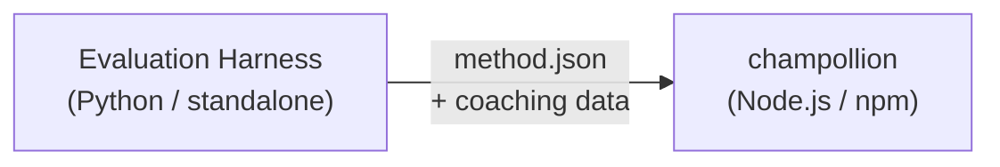

# Spezifikation für Methoden-Plugins

> **Version**: 1.1  
> **Zielgruppe**: Plugin-Entwickler  
> **Kanonisches Schema**: [`shared/schemas/champollion-plugin.schema.json`](https://github.com/gamedaysuits/Champollion/blob/main/cli/shared/schemas/champollion-plugin.schema.json)

## Überblick

champollion verwendet ein **modulares Methodensystem**. Jedes Sprachpaar kann eine andere Übersetzungsmethode verwenden (LLM, coached, script-converter usw.). Methoden werden in `lib/translate.js` registriert und pro Paar über `lib/pairs.js` aufgelöst.

Die Aufgabe des Eval-Harness besteht darin, Übersetzungsmethoden zu **entwickeln, zu testen und zu exportieren**. Die Aufgabe von champollion besteht darin, diese zu **konsumieren und auszuführen**. Das Plugin enthält **ausschließlich Daten** — Konfiguration, Coaching-Inhalte und Benchmark-Ergebnisse. Kein Python-Code, keine Harness-Abhängigkeiten.

### Datenfluss



Der Harness entwickelt und testet Methoden in Python. Sobald eine Methode zur Bereitstellung bereit ist, exportiert der Harness ein `method.json`-Manifest und optionale Coaching-Datendateien. Champollion installiert und führt die Methode unter Verwendung seiner eigenen integrierten Methodenimplementierungen aus.

---

## Format des Methoden-Plugins

Ein Methoden-Plugin ist eine einzelne JSON-Datei (`method.json`) mit optionalen Coaching-Datendateien.

### `method.json` — Erforderlich

```json
{
  "name": "french-formal-v1",
  "type": "llm-coached",
  "version": "1.0.0",
  "description": "Formally-tuned French with terminology enforcement and grammar coaching",
  "author": "Plugin Author",

  "config": {
    "model": "google/gemini-3.5-flash",
    "temperature": 0.2,
    "batchSize": 80,
    "register": "formal",
    "coachingFile": null,
    "coachingPrompt": null,
    "promptContext": null,
    "qualityTier": null
  },

  "locales": ["fr"],

  "benchmarks": {
    "fr": {
      "date": "2026-05-11T00:00:00Z",
      "corpus_size": 500,
      "exact_match_rate": 0.42,
      "corpus_chrf": 72.3,
      "corpus_bleu": 45.1,
      "model": "google/gemini-3.5-flash",
      "harness_version": "1.0.0"
    }
  },

  "provenance": {
    "resources": [],
    "commercialReady": false,
    "flags": ["license-unclear"]
  },

  "coaching": {
    "dir": "coaching"
  }
}
```

### Feldreferenz

| Feld | Typ | Erforderlich | Beschreibung |
|-------|------|----------|-------------|
| `name` | string | ✅ | Eindeutige Methodenkennung (kebab-case) |
| `type` | string | ✅ | Champollion-Methodentyp: `llm`, `llm-coached`, `api`, `google-translate`, `deepl`, `microsoft-translator`, `libretranslate`, `openai`, `anthropic`, `gemini` |
| `version` | string | ✅ | Semver-Version (z. B. `1.0.0`) |
| `locales` | string[] | ✅ | Welche Locale-Codes diese Methode anspricht (mindestens 1) |
| `description` | string | — | Menschenlesbare Beschreibung |
| `author` | string | — | Wer diese Methode entwickelt/getestet hat |
| `config.model` | string | — | OpenRouter-Modellkennung |
| `config.temperature` | number | — | LLM-Temperatur (0.0–2.0, Standard: 0.3) |
| `config.batchSize` | number | — | Schlüssel pro API-Batch (1–200, Standard: 80) |
| `config.register` | string \| null | — | Zielsprachenregister/-ton (Preset-Schlüssel oder Freitext) |
| `config.coachingFile` | string \| null | — | Pfad zur Freitext-Coaching-Prompt-Datei (relativ zum Projektstamm) |
| `config.coachingPrompt` | string \| null | — | Aufgelöster Coaching-Prompt-Text (zur Laufzeit aus `coachingFile` gelesen) |
| `config.promptContext` | string \| null | — | In den System-Prompt eingefügter Anwendungskontext (z. B. "E-Commerce-Produktbeschreibungen") |
| `config.qualityTier` | string \| null | — | Qualitätsstufe aus der Benchmark-Auswertung (`standard`, `high`, `research`, `verified`) |
| `benchmarks` | object | — | Benchmark-Ergebnisse pro Locale aus dem Eval-Harness |
| `provenance` | object | — | Lizenzierungs- und Ressourcenabhängigkeiten |
| `coaching.dir` | string | — | Relativer Pfad zum Coaching-Datenverzeichnis |

:::info[Kanonische MethodConfig-Struktur]
Der `config`-Block verwendet das **kanonische MethodConfig-Schema** — dieselben 8 Felder, die über `champollion.config.json`, Harness-Run-Cards, `mt-eval export-config` und Leaderboard-Publish/Install hinweg verwendet werden. Alle Felder sind stets vorhanden; ungenutzte Werte sind `null`. Dies gewährleistet reibungsloses Round-Tripping zwischen Evaluation und Produktion.
:::

### Benchmark-Objekt (pro Locale)

| Feld | Typ | Erforderlich | Beschreibung |
|-------|------|----------|-------------|
| `date` | string | ✅ | ISO-8601-Zeitstempel des Benchmark-Durchlaufs |
| `corpus_size` | number | ✅ | Anzahl der ausgewerteten Einträge |
| `exact_match_rate` | number | ✅ | 0.0–1.0, Anteil exakter Übereinstimmungen |
| `corpus_chrf` | number | — | chrF++-Wert (0–100) |
| `corpus_bleu` | number | — | BLEU-Wert (0–100) |
| `model` | string | ✅ | Während der Evaluation verwendetes Modell |
| `harness_version` | string | ✅ | Version des verwendeten Evaluations-Harness |

:::info[Welche Metriken werden angezeigt?]
Der Befehl `champollion status` zeigt **chrF++** und die **exakte Übereinstimmungsrate** aus dem Benchmark-Block an. `corpus_bleu` wird im Manifest akzeptiert, wird derzeit jedoch von keinem champollion-Befehl angezeigt oder verwendet. Das [Methoden-Leaderboard](/leaderboard) erfasst chrF++, exakte Übereinstimmung und FST-Akzeptanzrate.
:::

---

### Provenienz-Objekt

Der Provenienz-Block kommuniziert den Lizenzierungsstatus der gebündelten Ressourcen des Plugins.

| Feld | Typ | Standard | Beschreibung |
|-------|------|---------|-------------|
| `resources` | object[] | `[]` | Liste der gebündelten Ressourcen mit `name`, `license` und `type` |
| `commercialReady` | boolean | `false` | Ob das Plugin für die kommerzielle Verteilung freigegeben ist |
| `flags` | string[] | `["license-unclear"]` | Maschinenlesbare Status-Flags |

**Standardzustand** — exportierte Plugins werden mit `commercialReady: false` und `flags: ["license-unclear"]` ausgeliefert.

**Freigegebener Zustand** — wenn die Lizenzierung überprüft wurde: Setzen Sie `commercialReady: true` und löschen Sie die Flags.

---

## Format der Coaching-Daten

Wenn `type` `llm-coached` ist, sollte das Plugin Coaching-Datendateien im Unterverzeichnis `coaching/` enthalten.

### `coaching/<locale>.json`

```json
{
  "grammar_rules": [
    "French adjectives agree in gender and number with the noun they modify",
    "Use 'vous' for formal contexts, 'tu' for informal"
  ],
  "dictionary": {
    "dashboard": "tableau de bord",
    "deployment": "déploiement",
    "settings": "paramètres"
  },
  "style_notes": "Prefer active voice. Avoid anglicisms where a native French term exists."
}
```

| Feld | Typ | Erforderlich | Beschreibung |
|-------|------|----------|-------------|
| `grammar_rules` | string[] | — | Regeln, die in jeden LLM-Prompt für dieses Locale eingefügt werden |
| `dictionary` | object | — | Zuordnung Begriff → Übersetzung. Übereinstimmende Begriffe werden als erforderliche Terminologie eingefügt. |
| `style_notes` | string | — | Freiform-Stilanweisungen, die an den Prompt angehängt werden |

---

## Verzeichnisstruktur

```
french-formal-v1/
  method.json                 # Method manifest with benchmarks
  coaching/
    fr.json                   # Coaching data for French
```

Für Methoden mit mehreren Locales:

```
european-formal-v2/
  method.json                 # locales: ["fr", "de", "es", "it"]
  coaching/
    fr.json
    de.json
    es.json
    it.json
```

---

## Wie Champollion Plugins konsumiert

### Installation

```bash
champollion plugin install ./french-formal-v1/
```

Speichert nach `.champollion/methods/french-formal-v1/`.

### Konfiguration

```json title="champollion.config.json"
{
  "pairs": {
    "en:fr": {
      "methodPlugin": "french-formal-v1"
    }
  }
}
```

:::info[Merge-Semantik]
Das Plugin definiert, *welche* Methode verwendet wird (`type`). Die Paar-Konfiguration steuert, *wie* sie ausgeführt wird (`model`, `register`, `batchSize`). Wenn das Paar `model` setzt, überschreibt dies den Standardwert des Plugins.
:::

### Laufzeit

1. Champollion liest `method.json` aus `.champollion/methods/french-formal-v1/`
2. Das `type`-Feld des Plugins legt die Übersetzungsmethode fest (z. B. `llm-coached`)
3. Lädt Coaching-Daten aus dem `coaching/`-Verzeichnis des Plugins
4. Verwendet den `config`-Block, um Lücken bei Modell/Register/Temperatur zu füllen
5. Der `benchmarks`-Block wird in der `champollion status`-Ausgabe angezeigt
6. Der `provenance`-Block wird von `champollion provenance` auf Lizenzierungs-Flags geprüft

---

## Schema-Validierung

Plugin-Manifeste werden zum Installationszeitpunkt gegen [`shared/schemas/champollion-plugin.schema.json`](https://github.com/gamedaysuits/Champollion/blob/main/cli/shared/schemas/champollion-plugin.schema.json) validiert.

Referenzieren Sie das Schema in Ihrer `method.json` für die IDE-Autovervollständigung:

```json
{
  "$schema": "./node_modules/champollion/shared/schemas/champollion-plugin.schema.json",
  "name": "my-method-v1"
}
```

---

## Was NICHT enthalten sein sollte

- ❌ Kein Python-Code und keine Harness-Abhängigkeiten
- ❌ Keine Rohkorpusdaten oder Run-Logs
- ❌ Keine API-Schlüssel oder Anmeldedaten
- ❌ Keine Harness-Konfiguration
- ❌ Keine internen Prompt-Templates (diese befinden sich in den Methodenimplementierungen von champollion)

Das Plugin enthält **ausschließlich Daten**: Konfiguration, Coaching-Inhalte und Benchmark-Ergebnisse.

---

## Siehe auch

- [Übersetzungsmethoden](/docs/guides/translation-methods) — wie jede integrierte Methode funktioniert
- [Konfiguration](/docs/getting-started/configuration) — Konfiguration pro Paar und pro Sprache
- [Eine Methode über eine API bereitstellen](/docs/guides/serving-a-method) — Methoden als HTTP-Dienste hosten
- [Cookbook: FST-gesteuerte Pipeline](/docs/network/tutorials/fst-gated-pipeline) — Aufbau und Verpackung einer Pipeline
- [MT-Evaluation](/docs/network/leaderboard/rules) — Benchmarking von Methoden für die Leaderboard-Einreichung
- [Eine ressourcenarme Sprache unterstützen](/docs/network/community/low-resource-languages) — der Anwendungsfall für Community-Plugins
