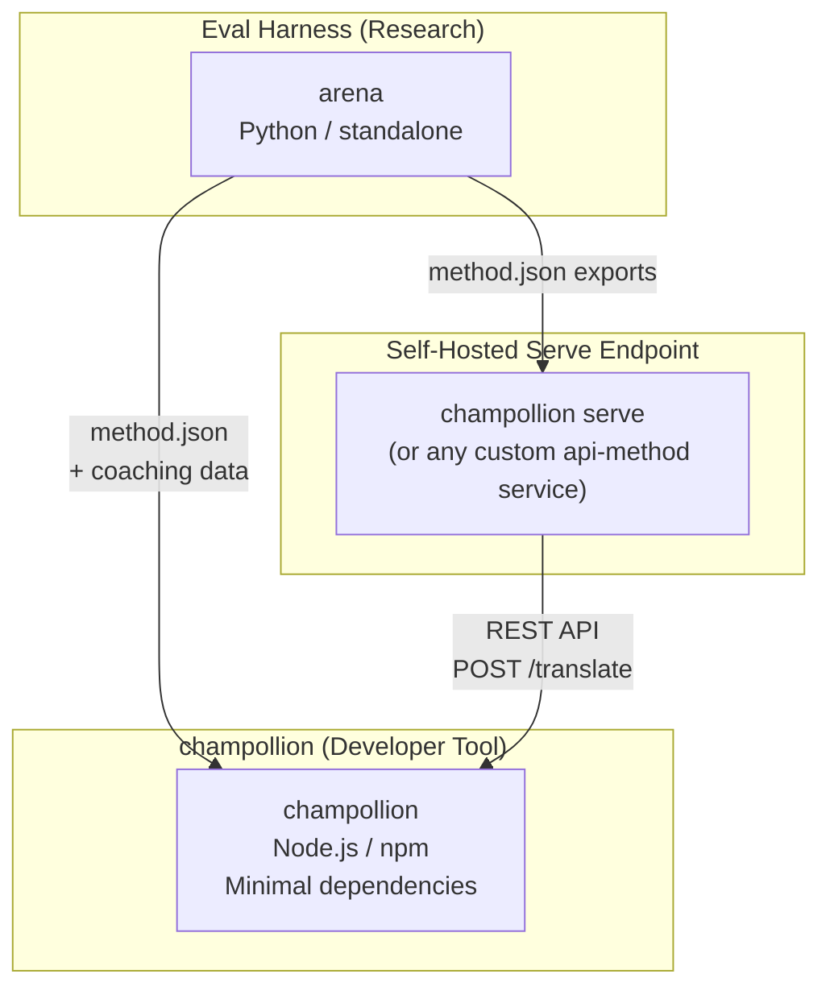
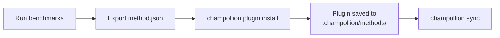
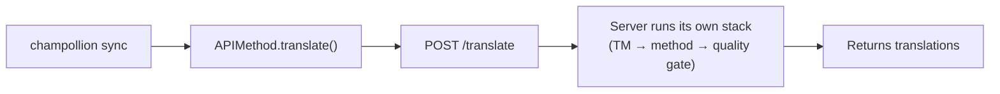
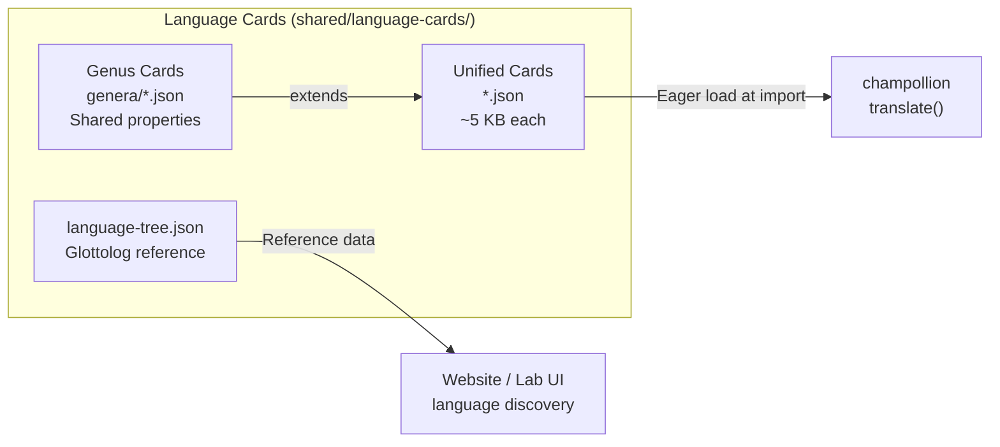

# Arquitectura

El ecosistema de traducción de Champollion consta de tres herramientas independientes que funcionan juntas a través de contratos bien definidos. Ninguna de ellas depende de las otras en tiempo de compilación. Se comunican a través de un **formato de plugin de método** compartido y un **contrato de API REST**.

## Las Tres Piezas



### champollion (este proyecto)

La herramienta para desarrolladores con código fuente disponible (gratuita para uso no comercial). Traduce archivos de localización utilizando métodos conectables. Dependencias mínimas, configuración opcional, funciona de inmediato.

**Métodos integrados:**
- `llm` → OpenRouter / cualquier LLM (200+ modelos)
- `llm-coached` → LLM + coaching de gramática/diccionario
- `openai` → API directo de OpenAI (GPT-4o, GPT-4o-mini)
- `anthropic` → API directo de Anthropic (Claude Sonnet, Haiku, Opus)
- `gemini` → API directo de Google Gemini (Flash, Pro — nivel gratuito disponible)
- `google-translate` → API de Google Cloud Translation v2
- `deepl` → API de DeepL con soporte de glosario
- `microsoft-translator` → Azure Cognitive Services Translator
- `libretranslate` → LibreTranslate autohospedado (AGPL, gratuito)
- `api` → Tubo delgado hacia cualquier punto final REST remoto

### Eval Harness (proyecto complementario)

Una herramienta de investigación para desarrollar, probar y comparar métodos de traducción. Cuando un método alcanza una calidad aceptable, el harness exporta un **plugin de método** — un manifiesto `method.json` y archivos de datos de coaching opcionales.

El harness nunca se ejecuta dentro de champollion. Es una herramienta separada que produce salida estática (archivos JSON). Champollion simplemente lee esos archivos.

[→ Eval Harness en GitHub](https://github.com/gamedaysuits/Champollion)

### Endpoint de servicio autoalojado (`champollion serve`)

Cualquier proyecto de champollion puede servir su propia pila de traducción configurada a través de HTTP con un solo comando — [`champollion serve`](/docs/guides/serving-a-method#the-zero-code-path-champollion-serve) — y cualquier otro proyecto puede consumirla a través del método `api`. Los prompts, los datos de instrucción (coaching), la Memoria de Traducción y las claves de proveedor permanecen en la infraestructura del propietario; los consumidores solo envían cadenas de origen y reciben traducciones. Los pipelines que viven completamente fuera de champollion (una cadena FST, un sistema de investigación) pueden implementar el mismo contrato como un [servicio personalizado](/docs/guides/serving-a-method). No existe un servicio alojado de Champollion — el servicio siempre es autoalojado, por diseño.

## Cómo Se Conectan

### Eval Harness → champollion (exportación unidireccional)



**Contrato**: [Especificación de Plugin](/docs/reference/plugin-spec)

### Endpoint de servicio → champollion (API en tiempo de ejecución)



El `APIMethod` de Champollion es un **tubo tonto**. Envía claves y recibe traducciones de vuelta. No contiene lógica de traducción cero y cero contenido propietario.

## Lo Que Cada Pieza Sabe Sobre Las Otras

| Herramienta | ¿Conoce a champollion? | ¿Conoce un endpoint de servicio? | ¿Conoce a harness? |
|------|---------------------|-------------------------------|---------------------|
| **champollion** | *(es champollion)* | Sí — el método `api` lo llama | No — solo lee las exportaciones de los plugins |
| **Endpoint de servicio** | Sí — sirve sus solicitudes | *(es el endpoint de servicio)* | No — instala métodos exportados como cualquier proyecto |
| **Eval Harness** | Sí — exporta el formato de plugin | No — los métodos se implementan por separado | *(es el harness)* |

## Escenarios de Usuario

### Escenario 1: Gratuito, sin configuración (la mayoría de usuarios)

```bash
export OPENROUTER_API_KEY=sk-...
npx champollion sync
```

Utiliza el método integrado `llm`. Sin plugins, sin servidor, sin harness.

### Escenario 2: Línea base de Google Translate

```bash
export GOOGLE_TRANSLATE_API_KEY=AIza...
npx champollion sync
```

Usa el método `google-translate` integrado. No se necesitan plugins.

### Escenario 3: Plugin abierto con coaching incluido

```bash
champollion plugin install ./french-formal-v1/
champollion sync
```

El plugin tiene `type: "llm-coached"` → champollion usa la clave OpenRouter del usuario. Los datos de coaching son locales (sin llamada al servidor).

### Escenario 4: Coaching DIY (sin plugin, sin harness)

```json title="champollion.config.json"
{
  "pairs": {
    "en:fr": { "method": "llm-coached" }
  }
}
```

El usuario mantiene sus propias reglas de gramática y diccionario en `.champollion/coaching/fr.json`.

### Escenario 5: Consumir la pila servida de otro proyecto

```bash
champollion plugin install ./their-project-serve/   # manifest from `champollion serve --emit-manifest`
CHAMPOLLION_API_KEY=<their bearer token> champollion sync
```

El método `api` del par envía mediante POST las cadenas de origen a su endpoint autoalojado [`champollion serve`](/docs/guides/serving-a-method#the-zero-code-path-champollion-serve); su pila (coaching, MT, control de calidad) realiza la traducción.

## Tarjetas de Idioma

Cada idioma en champollion se configura a través de una **Tarjeta de Idioma** — un archivo JSON unificado que contiene presets de registro, reglas de formalidad, banderas de soporte de método, convenciones tipográficas, clasificación genealógica y datos de referencia lingüística.



Las tarjetas se cargan con entusiasmo en la importación. Cada tarjeta contiene todos los metadatos que el motor de traducción y la documentación del desarrollador necesitan — no hay un nivel de referencia separado. Las tarjetas se generan a partir de fuentes autorizadas (IANA, CLDR, [Glottolog](https://glottolog.org), [WALS](https://wals.info)) usando `scripts/generate-language-card.mjs` y `scripts/build-language-tree.mjs`, luego se curan manualmente para precisión lingüística.

## Principios de Diseño

1. **Sin dependencias circulares.** Los puentes son unidireccionales.
2. **Champollion es el núcleo ligero.** Dependencias mínimas, configuración opcional. Los plugins y la API son aditivos.
3. **La protección de la propiedad intelectual es arquitectónica.** Las técnicas propietarias permanecen en el lado del servicio — quien ejecuta el endpoint conserva sus prompts, coaching y claves. El paquete npm no incluye nada propietario.
4. **El formato del plugin es el contrato.** Todo fluye a través de `method.json`.
5. **Cada herramienta tiene un solo trabajo.** Harness → desarrollar métodos. `champollion serve` → alojar métodos. Champollion → traducir archivos.

---

## Consulte también

- [Métodos de Traducción](/docs/guides/translation-methods) — cómo funciona cada método integrado
- [Especificación de Plugin](/docs/reference/plugin-spec) — el formato del manifiesto method.json
- [Eval Harness](/docs/network/specifications/harness) — la herramienta de investigación complementaria
- [Servir un Método a través de API](/docs/guides/serving-a-method) — alojar tuberías de traducción personalizadas
- [Apoyar un Idioma de Recursos Limitados](/docs/network/community/low-resource-languages) — el caso de uso que impulsó esta arquitectura
