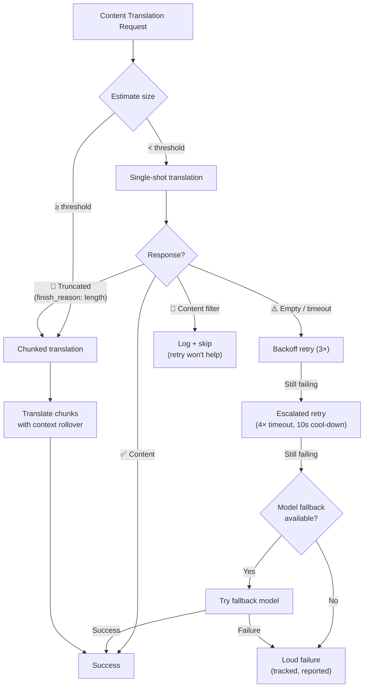

# Resiliencia en la Traducción de Contenido

La canalización de traducción de contenido de Champollion (documentos Markdown/MDX) utiliza un sistema de resiliencia multicapa para manejar fallos de manera elegante. A diferencia de la traducción de pares clave-valor — donde cada lote es pequeño y los reintentos son económicos — la traducción de contenido implica indicaciones grandes y salidas largas que pueden fallar por razones estructurales, no solo transitorias.

## El Problema

La traducción de contenido tiene modos de fallo fundamentalmente diferentes de la traducción de pares clave-valor:

| Modo de Fallo | Clave-Valor | Contenido |
|---|---|---|
| Límite de velocidad (429) | Común, transitorio | Común, transitorio |
| Tiempo de espera agotado | Raro (lotes pequeños) | Común (salida larga) |
| Respuesta vacía | Raro | Común (límites de salida, filtros) |
| Truncamiento de salida | N/A (JSON validado) | Ocurre silenciosamente |
| Filtro de contenido | Extremadamente raro | Posible (docs de CLI, docs de seguridad) |
| Limitación del modelo | El reintento lo soluciona | Reintentar no lo soluciona |

La idea clave: **reintentar la misma solicitud fallida no es redundancia, es terquedad.** Un sistema de resiliencia adecuado identifica *por qué* algo falló y cambia su enfoque en consecuencia.

## Descripción General de la Arquitectura



## Capa 1: Reintento Basado en Diagnóstico

Antes de decidir *cómo* reintentar, el sistema inspecciona la respuesta de la API para entender *qué* falló.

### Análisis de Razón de Finalización

Cada API de LLM devuelve un `finish_reason` junto con el texto generado. Champollion utiliza esto para tomar decisiones de reintento inteligentes:

| `finish_reason` | Significado | Acción |
|---|---|---|
| `stop` + contenido | El modelo se completó normalmente | ✅ Aceptar resultado |
| `stop` + vacío | El modelo no generó nada | ⚠️ Reintentar la misma solicitud (transitorio) |
| `length` | La salida alcanzó el límite de tokens | 🔶 Dividir automáticamente el documento |
| `content_filter` | El filtro de seguridad bloqueó la salida | 🔴 Registrar y omitir (reintentar no ayudará) |
| `null` / faltante | Respuesta malformada | ⚠️ Reintentar la misma solicitud (transitorio) |

Esto reemplaza el enfoque actual de tratar cada fallo de manera idéntica con reintentos de retroceso.

### Presupuesto de Reintento

El presupuesto de reintento estándar para fallos transitorios:

| Ronda | Intentos | Tiempo de Espera | Retroceso |
|---|---|---|---|
| Estándar | 4 (0→3) | 60s | 1s → 2s → 4s |
| Escalado | 4 (0→3) | 120s | 1s → 2s → 4s |
| **Total** | **8** | — | **~3.5 min en el peor caso** |

Entre rondas, un período de enfriamiento de 10 segundos permite que los problemas transitorios se resuelvan.

## Capa 2: División de Contenido

Cuando un documento excede un umbral de tamaño — o cuando la Capa 1 señala truncamiento de salida — el sistema divide el documento en fragmentos de tamaño de traducción.

Consulte [Context Rollover](/docs/concepts/context-rollover#content-chunking) para la configuración detallada de división. Los puntos clave son:

### Estrategia de División

1. **Límites de encabezados** — `##` y `###` son límites naturales de unidades de traducción. Cada sección es lo suficientemente independiente para traducción independiente.
2. **Alternativa de párrafo** — si una sección de encabezado único excede el tamaño del fragmento, dividir en saltos de línea dobles.
3. **División forzada** — último recurso para párrafos extremadamente largos (p. ej., tablas). Dividir en límites de oraciones.

### Contexto Entre Fragmentos

Cada fragmento recibe los últimos 2-3 párrafos de la *traducción del fragmento anterior* como contexto. Esto previene:
- **Desviación de terminología** — el modelo ve lo que llamó "tableau de bord" en el fragmento anterior
- **Resolución de pronombres** — los antecedentes de la sección anterior se trasladan hacia adelante
- **Consistencia de registro** — el tono establecido en el fragmento 1 persiste a través del fragmento N

### Disparadores de División Automática

| Disparador | Comportamiento |
|---|---|
| `contentChunkSize` establecido en config | Siempre dividir docs que excedan ese tamaño |
| `finish_reason: "length"` devuelto | División automática como alternativa (incluso sin config) |
| Entrada > ~12KB (detección automática) | Registrar sugerencia, pero no forzar |

## Capa 3: Cadena de Alternativa de Modelo

Cuando el modelo configurado falla consistentemente — no transitoriamente, sino estructuralmente — el sistema intenta modelos alternativos. Los diferentes modelos tienen diferentes ventanas de contexto, límites de salida, filtros de seguridad y fortalezas multilingües.

### Cadena de Alternativa Predeterminada

```json title="champollion.config.json"
{
  "contentFallbackChain": [
    "google/gemini-2.5-flash",
    "anthropic/claude-sonnet-4"
  ]
}
```

El modelo configurado siempre se intenta primero. Los modelos de alternativa solo se utilizan después de agotar todas las rondas de reintento (estándar + escalado).

### Por Qué Múltiples Arquitecturas

| Escenario | El Modelo Principal Falla | El Modelo de Alternativa Tiene Éxito |
|---|---|---|
| Docs de CLI en vietnamita | Gemini devuelve vacío | Claude lo maneja bien |
| Contenido filtrado por seguridad | OpenAI lo bloquea | Gemini tiene diferentes umbrales de filtro |
| Tablas estructuradas largas | El modelo A trunca | El modelo B tiene una ventana de salida más grande |

El valor de la alternativa es la diversidad arquitectónica — diferentes familias de modelos tienen diferentes modos de fallo. Un fallo que es estructural para un modelo puede ser trivial para otro.

### Alcance

> La alternativa de modelo es **solo para contenido**. Los lotes de pares clave-valor son pequeños y casi nunca fallan estructuralmente. Agregar complejidad de alternativa allí sería sobre-ingeniería.

## Capa 4: Contabilidad de Fallos

Cuando ocurren fallos, el sistema los rastrea e informa adecuadamente en lugar de continuar silenciosamente.

### Durante la Sincronización

- Los elementos fallidos muestran `[FAIL]` en la salida de progreso
- Cada fallo registra la razón específica (tiempo de espera agotado, respuesta vacía, filtro de contenido, truncamiento)
- Los elementos completados se guardan en el manifiesto inmediatamente (persistencia incremental)

### Después de la Sincronización

Un resumen de fallos se imprime al final:

```
  ┌─ Content Translation Failures ─────────────────────────────────────┐
  │                                                                     │
  │  2 of 24 content translations failed:                              │
  │                                                                     │
  │  ✗ docs/reference/cli.md → vi                                      │
  │    Reason: empty response after 8 attempts + 1 fallback model      │
  │    Models tried: google/gemini-3.1-pro-preview, gemini-2.5-flash   │
  │                                                                     │
  │  ✗ docs/guides/troubleshooting.md → ar                             │
  │    Reason: content_filter (no retry — blocked by safety filter)    │
  │                                                                     │
  │  Re-run: npx champollion@latest sync                              │
  │  (22 completed translations are cached and won't re-run)           │
  └─────────────────────────────────────────────────────────────────────┘
```

### Manifiesto de Reintento

Los archivos fallidos se escriben en `.champollion-retry.json`:

```json
{
  "failedAt": "2026-05-27T21:45:00Z",
  "files": [
    {
      "source": "docs/reference/cli.md",
      "locale": "vi",
      "reason": "empty_response",
      "attempts": 8,
      "modelsTried": ["google/gemini-3.1-pro-preview", "google/gemini-2.5-flash"]
    }
  ]
}
```

En la siguiente ejecución de `sync`, solo se reprocesarán estos archivos. Los archivos completados se preservan a través del manifiesto de hash de contenido (`.champollion-content.lock`).

### Códigos de Salida

| Código | Significado |
|---|---|
| 0 | Todas las traducciones tuvieron éxito |
| 1 | Error de configuración, clave de API faltante, etc. |
| 2 | Fallo parcial — algunas traducciones de contenido fallaron |

## Configuración

```json title="champollion.config.json"
{
  "contentChunkSize": 4000,
  "contentOverlap": 200,
  "contentFallbackChain": [
    "google/gemini-2.5-flash",
    "anthropic/claude-sonnet-4"
  ]
}
```

| Campo | Tipo | Predeterminado | Descripción |
|---|---|---|---|
| `contentChunkSize` | `number \| null` | `null` | Máximo de tokens por fragmento de contenido. `null` = sin división (división automática solo en truncamiento) |
| `contentOverlap` | `number` | `200` | Tokens de superposición entre fragmentos de contenido para continuidad de contexto |
| `contentFallbackChain` | `string[]` | `[]` | Modelos de alternativa a intentar cuando el modelo configurado falla estructuralmente |

## Estado de Implementación

| Característica | Estado |
|---|---|
| Reintento basado en diagnóstico (análisis de finish_reason) | 🔲 Planeado |
| División de contenido (división de encabezado/párrafo) | 🔲 Planeado |
| Rollover de contexto entre fragmentos | 🔲 Planeado |
| Cadena de alternativa de modelo | 🔲 Planeado |
| Informe de resumen de fallos | 🔲 Planeado |
| Manifiesto de reintento (.champollion-retry.json) | 🔲 Planeado |
| Código de salida 2 para fallos parciales | 🔲 Planeado |
| Reintento de escalación (tiempo de espera extendido) | ✅ Implementado (v3.3.3) |
| Mensajes de reintento numerados por intento | ✅ Implementado (v3.3.3) |
| Fallo ruidoso en errores de contenido | ✅ Implementado (v3.3.3) |

## Véase También

- [Context Rollover](/docs/concepts/context-rollover) — consistencia de lotes y configuración de división de contenido
- [How Sync Works](/docs/concepts/how-sync-works) — la canalización de sincronización completa
- [Translation Methods](/docs/guides/translation-methods) — métodos disponibles y sus características
