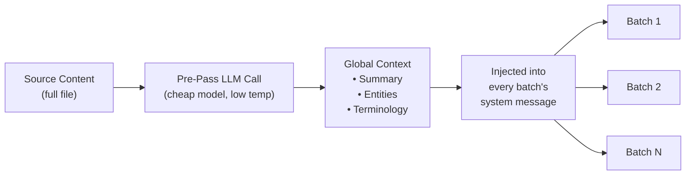

# Agrupamiento de Transferencia de Contexto

La transferencia de contexto es una característica de consistencia de traducción a nivel de documento que lleva adelante una ventana de traducciones anteriores hacia lotes posteriores, proporcionando al LLM "memoria a corto plazo" a través de los límites de los lotes.

## Por Qué Existe

Cuando se traducen archivos grandes (100+ claves o documentos Markdown largos), champollion divide el trabajo en lotes. Sin transferencia, cada lote se traduce de forma independiente — el LLM no tiene memoria de lo que tradujo en el lote anterior. Esto causa:

- **Desviación terminológica**: El mismo término en inglés se traduce de manera diferente entre lotes (p. ej., "dashboard" → "tableau de bord" en el lote 1, "panneau" en el lote 3)
- **Fallo de correferencia**: Los pronombres y referencias que cruzan límites de lotes pierden su antecedente
- **Inconsistencia de registro**: El tono puede cambiar entre lotes (formal → informal → formal)

Este es un problema bien documentado en la literatura de traducción automática. El enfoque de ventana deslizante está validado por investigación en traducción automática a nivel de documento (ACL, talleres WMT).

## Cómo Funciona

### La Ventana Deslizante

Cuando `contextRollover` está habilitado, la canalización de traducción mantiene una ventana de pares clave-valor traducidos recientemente. Después de que cada lote se completa, una porción de su salida (predeterminado: 20% de `batchSize`) se lleva adelante al mensaje del siguiente lote como "traducciones de referencia".

```
Batch 1: Translate keys 1-80         → LLM sees: system prompt + keys 1-80
Batch 2: Translate keys 81-160       → LLM sees: system prompt + [16 reference translations from batch 1] + keys 81-160
Batch 3: Translate keys 161-240      → LLM sees: system prompt + [16 reference translations from batch 2] + keys 161-240
```

Las traducciones de referencia se inyectan en el mensaje del usuario con una etiqueta clara:

```
--- Previous translations for context (do NOT re-translate these) ---
"nav.dashboard": "Tableau de bord"
"nav.settings": "Paramètres"
"header.welcome": "Bienvenue sur la plateforme"
---

{
  "content.main_heading": "Getting Started with Your Dashboard",
  ...
}
```

### Estrategia de Selección

Dos modos para elegir qué traducciones llevar adelante:

| Estrategia | Comportamiento | Mejor Para |
|----------|----------|----------|
| `tail` (predeterminado) | Últimas N traducciones del lote anterior | Documentos secuenciales, contenido Markdown |
| `diverse` | Selecciona entradas que cubren diferentes tipos de claves (botones, encabezados, descripciones) | Archivos JSON grandes con tipos de elementos de interfaz mixtos |

### Presupuesto de Tokens

La ventana de transferencia consume tokens de entrada. Champollion calcula el costo aproximado de tokens y advierte si la ventana excede el 15% de la ventana de contexto estimada del modelo. La advertencia incluye una reducción sugerida:

```
[WARN] Rollover window is ~2400 tokens (18% of model context).
       Consider reducing rolloverSize to 0.15 or lowering batchSize.
```

## Pasada Previa de Contexto Global

Una llamada LLM de primera pasada opcional que se ejecuta **antes** de que comience la traducción. El LLM analiza el contenido fuente completo y produce:

1. **Resumen del Documento** — Descripción de 2-3 oraciones de lo que se está traduciendo
2. **Entidades Nombradas** — Nombres de productos, términos técnicos y nombres propios con manejo sugerido
3. **Lista de Consistencia Terminológica** — Términos clave que el LLM identificó como requiriendo traducción consistente

Este contexto global se inyecta en el **mensaje del sistema** de cada lote, dando a cada lote conciencia del documento completo aunque solo vea una porción.



### Modelo de Pasada Previa

La extracción de contexto global utiliza una llamada LLM separada y económica (predeterminado: `google/gemini-3.5-flash` a temperatura 0.1) independientemente del modelo de traducción configurado por el usuario. Esta es una tarea de extracción de metadatos, no una tarea de traducción — la velocidad y el costo importan más que la salida creativa.

## Fragmentación de Contenido {#content-chunking}

Para documentos Markdown largos (traducción de contenido), el cuerpo puede exceder la ventana de contexto efectiva del LLM, o el modelo puede truncar su salida. La fragmentación de contenido divide el documento en segmentos superpuestos que se traducen de forma independiente y luego se reensamblan.

### Estrategia de División

La fragmentación sigue una cascada de prioridades — intenta el punto de división más significativo semánticamente primero:

1. **Límites de encabezados** — Los marcadores `##` y `###` crean unidades de traducción naturales. Cada sección es lo suficientemente autónoma para traducción independiente, y los encabezados dan al LLM contexto estructural sobre lo que está traduciendo.
2. **Límites de párrafos** — si una sección de encabezado único excede el tamaño del fragmento, divide en saltos de línea dobles (`\n\n`). Los párrafos son el siguiente mejor límite porque representan pensamientos completos.
3. **Límites de oraciones** — último recurso para párrafos extremadamente largos (p. ej., tablas grandes, prosa densa). Divide en límites de punto-espacio respetando abreviaturas.

Los bloques protegidos (cercas de código, shortcodes — ver [Cómo Funciona la Sincronización](/docs/concepts/how-sync-works)) nunca se dividen entre fragmentos. Si un bloque protegido se cortaría, el punto de división se mueve antes o después de él.

### Activadores de Fragmentación Automática

La fragmentación se activa de dos formas:

| Activador | Comportamiento |
|---------|----------|
| `contentChunkSize` establecido en config | Fragmenta proactivamente todos los documentos que excedan ese recuento de tokens |
| El modelo devuelve `finish_reason: "length"` | Fragmenta automáticamente como alternativa, incluso sin config |

El activador de alternativa significa que la fragmentación funciona como red de seguridad incluso si no la configura — si el modelo trunca, champollion automáticamente reintenta con fragmentos.

### Configuración

- **`contentChunkSize`**: Máximo de tokens por fragmento (predeterminado: null = enviar cuerpo completo; establecer a p. ej., 4000 para documentos largos)
- **`contentOverlap`**: Superposición en tokens entre fragmentos (predeterminado: 200). La superposición asegura transiciones suaves en los límites de fragmentos.

Cuando la fragmentación está activa, la transferencia de contexto se aplica automáticamente entre fragmentos — la salida traducida del último párrafo del fragmento anterior se antepone al mensaje del siguiente fragmento.

```json title="champollion.config.json"
{
  "contentChunkSize": 4000,
  "contentOverlap": 200
}
```

> Para el sistema completo de resiliencia de traducción de contenido (reintento diagnóstico, alternativa de modelo, contabilidad de fallos), ver [Resiliencia de Contenido](/docs/concepts/content-resilience).

## Configuración

### Inicio Rápido

```json title="champollion.config.json"
{
  "contextRollover": true,
  "globalContext": true,
  "contentChunkSize": 4000,
  "contentOverlap": 200
}
```

### Opciones Completas

```json title="champollion.config.json (advanced)"
{
  "contextRollover": {
    "size": 0.2,
    "strategy": "tail",
    "maxTokens": null
  },
  "globalContext": {
    "model": "google/gemini-3.5-flash",
    "maxEntities": 20,
    "temperature": 0.1
  },
  "contentChunkSize": 4000,
  "contentOverlap": 200,
  "contentFallbackChain": [
    "google/gemini-2.5-flash",
    "anthropic/claude-sonnet-4"
  ]
}
```

| Campo | Tipo | Predeterminado | Descripción |
|-------|------|---------|-------------|
| `contextRollover` | `boolean \| object` | `false` | Habilitar transferencia de ventana deslizante |
| `contextRollover.size` | `number` | `0.2` | Fracción de `batchSize` a llevar adelante (0.0–1.0) |
| `contextRollover.strategy` | `string` | `"tail"` | Estrategia de selección: `"tail"` o `"diverse"` |
| `contextRollover.maxTokens` | `number \| null` | `null` | Límite máximo en presupuesto de tokens de transferencia |
| `globalContext` | `boolean \| object` | `false` | Habilitar pasada previa de contexto global |
| `globalContext.model` | `string` | `"google/gemini-3.5-flash"` | Modelo para la llamada de pasada previa |
| `globalContext.maxEntities` | `number` | `20` | Máximo de entidades nombradas a extraer |
| `globalContext.temperature` | `number` | `0.1` | Temperatura para la llamada de pasada previa |
| `contentChunkSize` | `number \| null` | `null` | Máximo de tokens por fragmento de contenido (null = sin fragmentación) |
| `contentOverlap` | `number` | `200` | Tokens de superposición entre fragmentos de contenido |
| `contentFallbackChain` | `string[]` | `[]` | Modelos de alternativa para traducción de contenido cuando el modelo configurado falla estructuralmente |

## Cuándo Usarlo

| Escenario | Recomendación |
|----------|---------------|
| Archivos JSON pequeños (< 50 claves) | No necesario — lote único, sin problemas de límites |
| Archivos JSON grandes (100+ claves) | Habilitar `contextRollover` para consistencia terminológica |
| Documentos Markdown largos | Habilitar `contextRollover` + `contentChunkSize` + `globalContext` |
| Documentación técnica | Habilitar `globalContext` para extracción de entidades |
| Cadenas de interfaz con registro mixto | Usar `contextRollover` con `strategy: "diverse"` |

## Estado de Implementación

| Característica | Estado |
|---------|--------|
| Transferencia de ventana deslizante (clave-valor) | 🔲 Planeado |
| Transferencia de ventana deslizante (contenido) | 🔲 Planeado |
| Pasada previa de contexto global | 🔲 Planeado |
| Fragmentación de contenido | 🔲 Planeado |
| Fragmentación automática en truncamiento | 🔲 Planeado |
| Estrategia de selección `diverse` | 🔲 Planeado |

## Literatura

Esta característica se basa en investigación publicada sobre traducción automática a nivel de documento:

- **Enfoque de ventana deslizante**: Validado para mejorar puntuaciones BLEU, chrF y COMET al usar LLMs para traducción (talleres ACL 2023–2025 sobre MT a nivel de documento)
- **Fusión de múltiples conocimientos**: Inyectar resúmenes de documentos y listas de entidades como contexto global mejora la consistencia terminológica en documentos largos
- **Indicación Consciente del Contexto (CAP)**: Seleccionar contexto relevante mediante puntuaciones de atención o similitud semántica para aprendizaje en contexto

## Ver También

- [Resiliencia de Contenido](/docs/concepts/content-resilience) — reintento diagnóstico, alternativa de modelo y contabilidad de fallos
- [Cómo Funciona la Sincronización](/docs/concepts/how-sync-works) — la canalización de lotes que la transferencia aumenta
- [Datos de Coaching](/docs/concepts/coaching-data) — característica complementaria para inyección de gramática/diccionario
- [Memoria de Traducción](/docs/concepts/translation-memory) — la caché de TM que funciona junto con la transferencia
