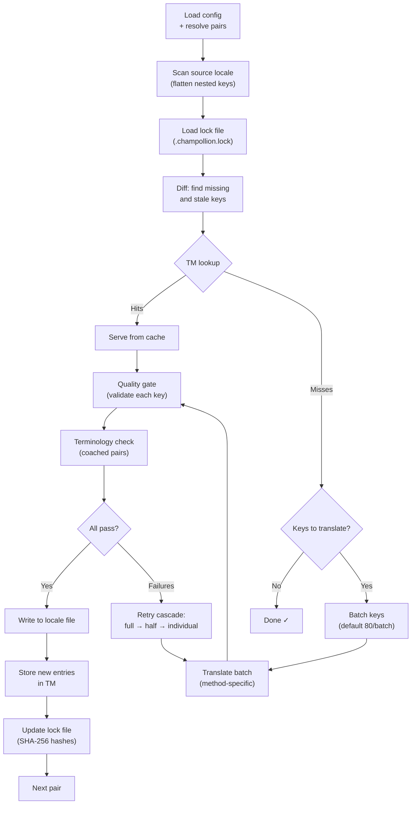

# Cómo funciona Sync

El comando `sync` es la operación central de champollion. Esto es lo que sucede cuando ejecuta `npx champollion sync`.

## Descripción general del pipeline



## Paso a paso

### 1. Resolución de configuración

Champollion carga `champollion.config.json` (o detecta automáticamente la configuración). Resuelve:
- La configuración regional de origen y las configuraciones regionales de destino
- El gráfico de pares (qué combinaciones de origen→destino procesar)
- Configuración de método, modelo y calidad por par

Antes de escanear archivos, champollion imprime un encabezado de inicio:

```
champollion v0.1.0

[INFO] Detected format: json (auto)
[INFO] Detected framework: Hugo
```

- **Banner de versión**: Muestra la versión instalada para depuración e informes de problemas.
- **Detección de formato**: Informa el formato de archivo y si fue detectado automáticamente `(auto)` o configurado explícitamente `(config)`. Admite `json`, `toml` y `yaml`.
- **Detección de framework**: Cuando `contentDir` está configurado, identifica el framework (`Hugo`) para confirmar que la sincronización de contenido está activa.

### 2. Escaneo de origen

El archivo de configuración regional de origen se carga y se aplana en un mapa clave→valor:

```json
// Input (nested)
{ "hero": { "title": "Welcome", "subtitle": "Build" } }

// Flattened
{ "hero.title": "Welcome", "hero.subtitle": "Build" }
```

### 3. Detección de cambios

Champollion lee `.champollion.lock`, que almacena hashes SHA-256 de valores de origen traducidos anteriormente. Para cada clave, verifica:

| Condición | Acción |
|-----------|--------|
| Clave faltante en el destino | **Traducir** |
| Hash de origen cambió desde la última sincronización | **Re-traducir** (obsoleto) |
| El valor de destino comienza con `[EN]` | **Re-traducir** (marcador de fallback heredado) |
| Hash de origen sin cambios, clave existe | **Omitir** |

Por eso champollion solo traduce lo que cambió — no está re-traduciendo su archivo completo en cada sincronización.

### 4. Agrupamiento

Las claves se agrupan en lotes (predeterminado: 80 claves/lote para LLM, 128 para Google Translate). El agrupamiento reduce viajes de API mientras mantiene los prompts manejables.

Durante la traducción, champollion muestra una barra de progreso en línea que se actualiza después de que cada lote se completa:

```
[INFO] fr.json — 2,847 missing
     ████████████████░░░░░░░░░░░░░░░░ 1,440/2,847 keys
```

La barra se renderiza usando `\r` retorno de carro para actualizaciones en el lugar — sin desplazamiento. Suprimida en modos `--quiet` y `--json`.

### 4b. Memoria de traducción

Antes del agrupamiento, champollion verifica el caché de Memoria de Traducción (`.champollion/tm.json`). Las claves cuyo texto de origen + configuración regional + método coinciden con una traducción anterior se sirven instantáneamente desde el caché — sin llamada a API necesaria.

```
  [TM] 142 key(s) served from cache
  Translating 3 key(s) to French (llm)... [OK]
```

TM es el mecanismo principal de ahorro de costos. Re-ejecutar sync después de un cambio de una sola clave solo traduce esa clave, no el archivo completo. Consulte [Memoria de Traducción](/docs/concepts/translation-memory) para más detalles.

Para omitir el caché en una sola ejecución: `champollion sync --no-tm`

### 5. Traducción

Cada lote se envía al método de traducción configurado:

- **`llm`**: Prompt estructurado a OpenRouter con instrucciones de registro y orientación de género
- **`llm-coached`**: Lo mismo, pero con reglas gramaticales, diccionario y notas de estilo inyectadas
- **`google-translate`**: Solicitud de lote de API de Google Cloud Translation v2
- **`api`**: HTTP POST a un punto final remoto

El mensaje del sistema (registro, orientación de género, reglas) es idéntico en todos los lotes para una configuración regional determinada, habilitando **almacenamiento en caché de prompts** — proveedores como Anthropic y Google almacenan en caché mensajes del sistema repetidos, reduciendo costos de tokens.

### 6. Puerta de calidad

Cada traducción se valida antes de escribirse en el disco. Se ejecutan cinco verificaciones:

| Verificación | Qué detecta | Ejemplo |
|--------------|-------------|---------|
| **Vacío/en blanco** | El modelo no devolvió nada | `""` |
| **Eco de origen** | El modelo devolvió la entrada en inglés | `"Welcome"` para japonés |
| **Bucle de alucinación** | Trigramas repetidos | `"Qo' Qo' Qo' Qo'"` |
| **Inflación de longitud** | La salida es 4×+ más larga que la fuente | Fuente de 10 caracteres → salida de 50 caracteres |
| **Cumplimiento de script** | Script incorrecto para la configuración regional | Texto latino para configuración regional árabe |

Los fallos se registran con un prefijo `[GATE]`. Sin fallbacks silenciosos.

Consulte [Puerta de Calidad](/docs/concepts/quality-gate) para más detalles.

### 6b. Verificación de terminología

Para pares entrenados con un diccionario, champollion verifica si el LLM realmente utilizó la terminología requerida después de la traducción. Las violaciones se registran como advertencias `[TERM]`:

```
[TERM] en→fr: 2 term violation(s)
  • "dashboard" → expected "tableau de bord" but got "panneau"
```

Estas son advertencias, no errores de bloqueo — la traducción se escribe de todas formas.

### 7. Cascada de reintentos

En caso de fallo de análisis JSON o errores a nivel de lote, champollion reintenta con lotes progresivamente más pequeños:

```
Full batch (80 keys) → Failed
  └→ Half batch (40 keys) → 1 failure
      └→ Individual keys (1 each) → Isolates the problem key
```

El presupuesto de reintentos está limitado por `maxRetries` (predeterminado: 3) para evitar gastos de tokens descontrolados.

### 8. Escritura y bloqueo

Las traducciones que pasan se escriben en el archivo de configuración regional de destino, preservando la estructura de anidamiento original. El archivo de bloqueo se actualiza con nuevos hashes SHA-256.

### 9. Verificación

Después de procesar todos los pares, champollion re-lee los archivos de configuración regional escritos desde el disco y ejecuta una pasada de verificación (a menos que `--no-verify` esté configurado). Esto detecta la brecha entre el reporte de éxito de sync y las claves siendo incorrectas en realidad:

- **Paridad de claves** — todas las claves de origen presentes en cada destino
- **Marcadores de fallback `[EN]`** — marcadores heredados de ejecuciones anteriores
- **Traducciones vacías** — valores en blanco que se colaron
- **Cumplimiento de script** — configuraciones regionales no latinas con traducciones solo ASCII
- **Preservación de placeholders** — los placeholders ICU coinciden con la fuente
- **Problemas de codificación** — marcadores BOM, caracteres invisibles

Esto también está disponible como comando `champollion verify` independiente para puertas de CI.

## Traducción de contenido (Fase 2)

Para proyectos Docusaurus y Hugo, `sync` ejecuta una segunda fase después de la traducción de claves JSON. Esta fase traduce archivos Markdown y MDX (documentos, publicaciones de blog, tutoriales) utilizando los mismos métodos y puerta de calidad.

### Cómo funciona

1. Champollion descubre todos los archivos de contenido de origen (`.md`, `.mdx`) caminando por el directorio de contenido/documentos
2. Para cada par de archivo × configuración regional, verifica un archivo de bloqueo de contenido separado (`.champollion-content.lock`) para cambios de hash SHA-256
3. Los archivos cambiados o faltantes se recopilan en un grupo de elementos de trabajo plano
4. El grupo se procesa con **concurrencia paralela** (predeterminado: 12 llamadas a API simultáneas)

```
Phase 2: content (79 translations to process, 341 skipped, concurrency: 48)

    [1/79] (1%)  docs/concepts/security.md → ja [RE-TRANSLATE] (~3328s left)
    [2/79] (3%)  docs/concepts/security.md → th [RE-TRANSLATE] (~1821s left)
    ...
    [79/79] (100%) blog/v3-2-quality.md → de [OK]

  [OK] Created 79 content file(s), 341 unchanged
```

### Paralelismo

Tanto la Fase 1 (claves JSON) como la Fase 2 (contenido) ahora se ejecutan en paralelo:

- **Fase 1**: Todas las traducciones de configuración regional se disparan simultáneamente (predeterminado: 50 configuraciones regionales simultáneas). Dentro de cada configuración regional, los lotes de API también se ejecutan en paralelo (4 lotes concurrentes). Una sincronización de 12 configuraciones regionales con 120 claves se completa en ~1 minuto en lugar de ~15 minutos.
- **Fase 2**: Todas las combinaciones de archivo×configuración regional se traducen como un grupo plano (predeterminado: 12 llamadas a API simultáneas). Diferentes archivos y diferentes configuraciones regionales se traducen simultáneamente.

Controle el paralelismo con `--json-concurrency`, `--content-concurrency` o `--concurrency` (establece ambos):

```bash
# Faster JSON sync (more parallel locale translations)
npx champollion sync --json-concurrency 30

# Faster content sync (more parallel API calls)
npx champollion sync --content-concurrency 20

# Slower (gentler on rate limits)
npx champollion sync --concurrency 4
```

### Protección de contenido

Durante la traducción, champollion protege el contenido no traducible:

- **Bloques de código** (cercados e indentados) se reemplazan con placeholders
- **Campos de frontmatter** no en la lista `translatableFields` se preservan tal cual
- **Enlaces**, rutas de imagen y etiquetas HTML están protegidas
- **Shortcodes** y variables de interpolación (p. ej., `{count}`, `{{.Params.title}}`) están protegidas

Después de la traducción, todos los placeholders se restauran y validan. Si alguno falta o está corrupto, la traducción se rechaza y se reintenta.

## Éxito parcial

Un lote fallido no bloquea el resto. Si 9 de 10 lotes tienen éxito, esos 9 se escriben. El lote fallido se registra y puede re-ejecutar `sync` para reintentar.

## Ejecución en seco

Obtenga una vista previa de lo que cambiaría sin escribir ningún archivo:

```bash
npx champollion sync --dry-run
```

## Forzar re-traducción

Fuerza claves específicas a ser re-traducidas incluso si no han cambiado:

```bash
npx champollion sync --force-keys "hero.title,nav.about"
```

## Estimación de costos

Antes de traducir, champollion genera un **informe de costos previos a la sincronización** que muestra costos estimados por par. Esto se ejecuta automáticamente durante cada `sync` — ve esto antes de que se realicen llamadas a API.

```
╔══════════════════════════════════════════════════════════╗
║  Cost Estimate                                          ║
╠════════════╦═══════╦════════════╦════════════════════════╣
║ Pair       ║ Keys  ║ Est. Cost  ║ Method                 ║
╠════════════╬═══════╬════════════╬════════════════════════╣
║ en → fr    ║   142 ║ $0.07      ║ google-translate       ║
║ en → ja    ║    38 ║   —        ║ llm (model-dependent)  ║
║ en → crk   ║    38 ║   —        ║ llm-coached            ║
╚════════════╩═══════╩════════════╩════════════════════════╝
```

### Qué se estima

Cada método de traducción proporciona su propia estimación de costos:

| Método | Base de costos | Precisión |
|--------|----------------|-----------|
| `google-translate` | Tarifa publicada de Google ($20/millón de caracteres) | Preciso |
| `llm` | Varía según el modelo de OpenRouter | Dependiente del modelo — consulte [precios de OpenRouter](https://openrouter.ai/models) |
| `llm-coached` | Lo mismo que `llm` más tokens de contexto de entrenamiento | Dependiente del modelo |
| `api` | Determinado por el servidor | Desconocido — no se puede estimar sin consultar el punto final |

Cuando un método no puede determinar el costo (métodos LLM, APIs remotas), champollion reporta `—` en lugar de adivinar. Use `--dry` para ver estimaciones de costos sin traducir realmente.

---

## Véase también

- [Referencia de CLI — sync](/docs/reference/cli#sync) — banderas de comando y opciones
- [Memoria de Traducción](/docs/concepts/translation-memory) — almacenamiento en caché y ahorro de costos
- [Puerta de Calidad](/docs/concepts/quality-gate) — cómo se validan las traducciones
- [Métodos de Traducción](/docs/guides/translation-methods) — cómo funciona cada método
- [Trabajar con traductores profesionales](/docs/guides/professional-translators) — flujo de trabajo XLIFF
- [Configuración](/docs/getting-started/configuration) — referencia de configuración
- [Guía de CI/CD](/docs/guides/ci-cd) — automatizar sincronizaciones en su pipeline
