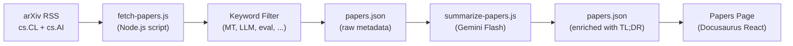

# Feed de Artículos de Investigación

Champollion mantiene un feed curado de artículos de investigación en traducción automática y PNL de arXiv, filtrados y resumidos para profesionales. El feed es semiautomático: los artículos se obtienen y filtran diariamente, se resumen con IA y se publican en el sitio web.

## Por Qué Existe

La canalización de traducción de champollion se construye sobre técnicas de investigación publicada — prompting dirigido por registro, inyección de datos de entrenamiento, rollover de contexto, compuertas de calidad. El feed de artículos sirve tres propósitos:

1. **Transparencia**: Los usuarios pueden ver la investigación que respalda cada característica
2. **Descubrimiento**: Las nuevas técnicas publicadas en arXiv pueden informar características futuras o configuraciones de usuario
3. **Comunidad**: Posiciona a champollion como una herramienta informada por investigación, no solo otro envoltorio de API

## Arquitectura



### Pasos de la Canalización

#### 1. Obtener (Diariamente)

`scripts/fetch-papers.js` consulta la API Atom de arXiv para artículos recientes en:
- `cs.CL` (Computación y Lenguaje)
- `cs.AI` (Inteligencia Artificial)

Retorna: título, autores, resumen, ID de arXiv, enlace a PDF, fecha de publicación, categorías.

#### 2. Filtrar

Los artículos se filtran por relevancia de palabras clave. Un artículo debe coincidir con al menos una palabra clave principal:

**Palabras clave principales** (debe coincidir ≥1):
- `machine translation`, `neural machine translation`, `NMT`
- `LLM`, `large language model`
- `multilingual`, `cross-lingual`
- `document-level translation`
- `low-resource language`, `endangered language`
- `translation evaluation`, `BLEU`, `COMET`, `chrF`
- `tokenization`, `morphology`, `polysynthetic`
- `context window`, `sliding window`
- `prompt engineering` (en contexto de traducción)

**Palabras clave de impulso** (aumentan la puntuación de relevancia):
- `i18n`, `internationalization`, `localization`
- `few-shot`, `in-context learning`
- `terminology`, `glossary`, `consistency`
- `quality estimation`, `hallucination`

#### 3. Resumir (Asistido por IA)

`scripts/summarize-papers.js` procesa artículos nuevos (sin resumir):

Para cada artículo, envía el resumen a Gemini 3.5 Flash con:
```
Read this ML research abstract and produce:
1. A 2-sentence TL;DR accessible to a software developer (not a researcher)
2. A single bullet: "Why this matters for MT" — how could this technique
   improve machine translation quality, cost, or speed in production?

Abstract: {abstract}
```

El resultado se almacena nuevamente en `papers.json` junto con los metadatos sin procesar.

#### 4. Publicar

La página de Artículos de Docusaurus (`website/src/pages/papers.js`) renderiza `papers.json` como una cuadrícula de tarjetas filtrable y paginada.

Cada tarjeta muestra:
- **Título** (enlazado a arXiv)
- **Autores** (primeros 3 + "et al.")
- **Fecha** (publicado o última actualización)
- **TL;DR** (generado por IA)
- **Por qué importa** (generado por IA)
- **Categorías** (etiquetas de arXiv)
- **Enlace a PDF**

### Automatización

Un flujo de trabajo de GitHub Actions ejecuta la canalización diariamente:

```yaml title=".github/workflows/fetch-papers.yml"
name: Fetch MT Research Papers
on:
  schedule:
    - cron: '0 6 * * *'  # 06:00 UTC daily
  workflow_dispatch: {}   # Manual trigger

jobs:
  fetch:
    runs-on: ubuntu-latest
    steps:
      - uses: actions/checkout@v4
      - uses: actions/setup-node@v4
        with:
          node-version: 20
      - run: node scripts/fetch-papers.js
      - run: node scripts/summarize-papers.js
        env:
          GEMINI_API_KEY: ${{ secrets.GEMINI_API_KEY }}
      - name: Commit if changed
        run: |
          git config user.name "github-actions[bot]"
          git config user.email "github-actions[bot]@users.noreply.github.com"
          git add website/src/data/papers.json
          git diff --cached --quiet || git commit -m "chore: update research papers feed"
          git push
```

## Esquema de Datos

```typescript
interface Paper {
  id: string;           // arXiv ID (e.g., "2406.12345")
  title: string;
  authors: string[];
  abstract: string;
  published: string;    // ISO date
  updated: string;      // ISO date
  pdfUrl: string;
  categories: string[];
  primaryCategory: string;

  // Computed by filter
  relevanceScore: number;
  matchedKeywords: string[];

  // Computed by summarizer (null until processed)
  tldr: string | null;
  whyItMatters: string | null;
  summarizedAt: string | null;
}
```

## Ubicaciones de Archivos

| Archivo | Propósito |
|---------|-----------|
| `scripts/fetch-papers.js` | Obtenedor de RSS de arXiv y filtro de palabras clave |
| `scripts/summarize-papers.js` | Resumen por IA vía Gemini |
| `website/src/data/papers.json` | Datos de artículos (confirmados en el repositorio) |
| `website/src/pages/papers.js` | Componente de página de Docusaurus |
| `website/src/pages/papers.module.css` | Estilos de página |
| `.github/workflows/fetch-papers.yml` | Automatización diaria |

## Estado de Implementación

| Característica | Estado |
|----------------|--------|
| `fetch-papers.js` (obtención y filtrado de arXiv) | 🔲 Planeado |
| `summarize-papers.js` (resumen por IA) | 🔲 Planeado |
| Página de artículos (componente React) | 🔲 Planeado |
| Flujo de trabajo de GitHub Actions | 🔲 Planeado |
| Filtrado de categoría/palabra clave en página | 🔲 Planeado |
| Paginación | 🔲 Planeado |

## Véase También

- [Arquitectura](/docs/concepts/architecture) — cómo se relacionan los componentes de champollion
- [Context Rollover](/docs/concepts/context-rollover) — una característica directamente informada por este feed de investigación
