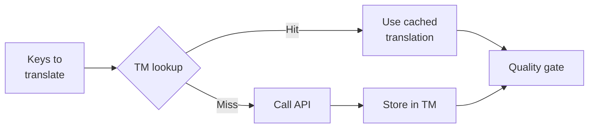

# Memoria de Traducción

La Memoria de Traducción (TM) es la capa de caché integrada de champollion. Almacena cada traducción indexada por texto fuente + locale + método, por lo que ejecutar `sync` solo llama a la API para las claves que han cambiado genuinamente.

## Por qué existe TM

Sin TM, cada `sync` retraduce cada clave modificada — incluso si ya ha traducido el mismo texto en inglés para la misma locale en una ejecución anterior. Escenarios comunes donde esto desperdicia dinero:

| Escenario | Sin TM | Con TM |
|----------|--------|--------|
| Re-ejecutar sync después de 1 cambio de clave (500 claves × 10 locales) | 5,000 llamadas API | 10 llamadas API |
| Revertir una clave a un valor anterior en inglés | Llamada API completa | Acierto de caché instantáneo |
| La misma frase aparece en 3 archivos de locale | 3 × llamadas API | 1 llamada API + 2 aciertos de caché |
| Dry-run → sync real | Llamadas API completas en ambos | Primera ejecución cachea, segunda reutiliza |

TM está **habilitada por defecto** y no requiere configuración. Las traducciones se cachean automáticamente durante cada `sync` y se sirven en ejecuciones posteriores.

## Cómo funciona

### Clave de caché

Cada entrada de TM se indexa mediante un hash SHA-256 de tres valores:

```
SHA-256( sourceValue + '\x00' + locale + '\x00' + method )
```

| Componente | Por qué está en la clave |
|-----------|------------------------|
| `sourceValue` | Texto en inglés diferente → traducción diferente |
| `locale` | "Hello" se traduce diferente al francés vs japonés |
| `method` | Salida de Google Translate ≠ salida de GPT-4o |

El separador de byte nulo (`\x00`) previene colisiones entre `"ab" + "c"` y `"a" + "bc"`.

### Durante Sync



1. Antes de llamar a la API de traducción, champollion particiona las claves en **aciertos de TM** y **fallos de TM**
2. Los aciertos se sirven instantáneamente desde caché — sin llamada API, sin latencia, sin costo
3. Los fallos pasan por el pipeline de traducción normal
4. Las nuevas traducciones de la API se almacenan en TM para futuras ejecuciones
5. Todas las traducciones (cacheadas + nuevas) pasan por la puerta de control de calidad

### Almacenamiento

TM se almacena en `.champollion/tm.json` en la raíz de su proyecto. El archivo utiliza JSON compacto (sin formato bonito) para mantener el tamaño manejable. Cada entrada almacena:

| Campo | Descripción |
|-------|------------|
| `t` | El texto traducido |
| `ts` | Marca de tiempo ISO-8601 de cuándo fue cacheado |
| `l` | Código de locale de destino (para estadísticas/filtrado) |
| `m` | Nombre del método de traducción (para estadísticas/filtrado) |

Con 50 idiomas × 500 claves = 25,000 entradas, el archivo debería tener ~2-3 MB.

## Gestionar el caché

### Ver estadísticas

```bash
champollion tm stats
```

Muestra el recuento de entradas, tamaño de archivo y un desglose por locale:

```
  Translation Memory — .champollion/tm.json

  Entries:      2,847
  File size:    1.2 MB
  Created:      2026-05-20
  Last entry:   2026-05-24

  By locale:
    fr       482 entries  (llm: 380, llm-coached: 102)
    de       471 entries  (llm: 471)
    ja       465 entries  (llm: 465)
```

### Limpiar el caché

```bash
# Clear everything (with confirmation prompt)
champollion tm clear

# Clear without prompt (CI environments)
champollion tm clear --yes

# Clear only one locale
champollion tm clear --locale fr
```

### Omitir TM para una ejecución

```bash
# Force fresh API calls for all keys (useful when switching providers)
champollion sync --no-tm
```

Esto no elimina el caché — simplemente lo ignora para esta ejecución y no almacena nuevos resultados.

## Cuándo TM no ayuda

TM no producirá un acierto de caché cuando:

- **El texto fuente cambió** — el hash cambia, por lo que es un fallo
- **El método cambió** — cambiar de `llm` a `google-translate` significa claves de caché diferentes
- **Primera ejecución** — inicio en frío, sin entradas aún
- **Bandera `--no-tm`** — omite explícitamente el caché

## ¿Debería confirmar `.champollion/tm.json`?

**Generalmente no.** TM es una optimización local para desarrolladores. Se completa automáticamente durante sync y solo ayuda cuando se re-ejecuta sync en la misma máquina. Sin embargo, podría considerar confirmarlo si:

- Su equipo comparte un único ejecutor de CI que sincroniza traducciones
- Desea compilaciones reproducibles sin llamadas API
- Está archivando traducciones para cumplimiento normativo

Agregue `.champollion/tm.json` a `.gitignore` para uso típico.

---

## Véase también

- [Cómo funciona Sync](/docs/concepts/how-sync-works) — dónde encaja TM en el pipeline
- [Referencia CLI — tm](/docs/reference/cli#tm) — referencia de comandos
- [Referencia CLI — sync --no-tm](/docs/reference/cli#sync) — omitiendo TM
