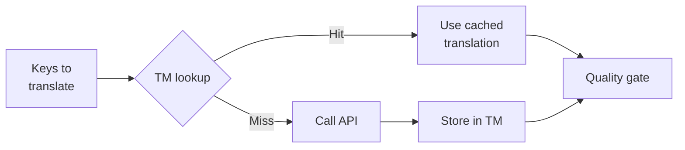

# Memoria de Traducción

La Memoria de Traducción (TM) es la capa de caché integrada de champollion. Almacena cada traducción indexada por texto fuente + locale + método, por lo que ejecutar `sync` solo llama a la API para las claves que han cambiado genuinamente.

## Por qué existe TM

Sin TM, cada `sync` retraduce cada clave modificada — incluso si ya ha traducido el mismo texto en inglés para la misma locale en una ejecución anterior. Escenarios comunes donde esto desperdicia dinero:

| Escenario | Sin TM | Con TM |
|----------|--------|--------|
| Re-ejecutar sync después de 1 cambio de clave (500 claves × 10 locales) | 5,000 llamadas API | 10 llamadas API |
| Revertir una clave a un valor anterior en inglés | Llamada API completa | Acierto de caché instantáneo |
| La misma frase aparece en 3 archivos de locale | 3 × llamadas API | 1 llamada API + 2 aciertos de caché |
| Dry-run → sync real | Llamadas API completas en ambos | Primera ejecución cachea, segunda reutiliza |

TM está **habilitada por defecto** y no requiere configuración. Las traducciones se cachean automáticamente durante cada `sync` y se sirven en ejecuciones posteriores.

## Cómo funciona

### Clave de caché

Cada entrada de TM se indexa mediante un hash SHA-256 de tres valores:

```
SHA-256( sourceValue + '\x00' + locale + '\x00' + method )
```

| Componente | Por qué está en la clave |
|-----------|------------------------|
| `sourceValue` | Texto en inglés diferente → traducción diferente |
| `locale` | "Hello" se traduce diferente al francés vs japonés |
| `method` | Salida de Google Translate ≠ salida de GPT-4o |

El separador de byte nulo (`\x00`) previene colisiones entre `"ab" + "c"` y `"a" + "bc"`.

El `sourceValue` es el texto a partir del cual se traduce la clave, con cualquier otro elemento que distinga dos textos idénticos integrado en él:

- **Contexto de gettext.** Una entrada con un `msgctxt` se almacena en caché con su contexto: "Open" como verbo y "Open" como adjetivo son dos entradas distintas.
- **Formas plurales que el origen no tiene.** i18next almacena los plurales como claves con sufijos, y un idioma de destino puede tener formas que el de origen no posee: el francés y el español añaden `count_many`, que se traduce a partir del texto en inglés de `count_other`. Ambas claves envían el mismo texto, pero al modelo se le solicitan formas diferentes (`"2 recettes"` y `"1 000 000 de recettes"`), por lo que cada una obtiene su propia entrada: `count_other` conserva la forma simple y `count_many` se almacena en caché bajo el texto más su forma. Lo mismo aplica para cualquier forma traducida a partir del texto de otra categoría (árabe `_zero`, `_two`, `_few`, `_many`; ruso `_few`, `_many`; formas ordinales).
- **`msgid_plural` de gettext y plurales de ARB / ICU** son un mensaje por clave (cada forma en un solo valor), por lo que constituyen una sola entrada, como antes.

Antes de la versión 0.4.0, una forma prestada compartía la entrada de la forma a partir de la cual se traduce, y la entrada conservaba la última respuesta que se hubiese almacenado, por lo que `--redo all` podía escribir una misma forma en ambas claves. Una caché de ese período se repara a medida que se utiliza. Cuando la entrada compartida contiene el texto de la forma prestada, este se traslada a la entrada propia de esa forma, y la otra forma se traduce nuevamente la próxima vez que se ponga en cola. De lo contrario, la entrada permanece con la forma de la que toma prestado, y la forma prestada se envía al modelo una sola vez, la primera vez que se pone en cola (la ejecución así lo indica). `champollion verify` advierte cuando una forma prestada contiene exactamente el texto de la forma de la que toma prestado y la caché no muestra que el modelo lo haya escrito de ese modo. Algunos idiomas sí escriben dos formas de manera idéntica, por lo que esto es solo una advertencia; `--redo keys:<key>` vuelve a consultar.

### Durante Sync


```mermaid
flowchart LR
    A["Keys to\ntranslate"] --> B{"TM lookup"}
    B -->|Hit| C["Use cached\ntranslation"]
    B -->|Miss| D["Call API"]
    D --> E["Store in TM"]
    C --> F["Quality gate"]
    E --> F
```

1. Antes de llamar a la API de traducción, champollion particiona las claves en **aciertos de TM** y **fallos de TM**
2. Los aciertos se sirven instantáneamente desde caché — sin llamada API, sin latencia, sin costo
3. Los fallos pasan por el pipeline de traducción normal
4. Las nuevas traducciones de la API se almacenan en TM para futuras ejecuciones
5. Todas las traducciones (cacheadas + nuevas) pasan por la puerta de control de calidad

### Almacenamiento

TM se almacena en `.champollion/tm.json` en la raíz de su proyecto. El archivo utiliza JSON compacto (sin formato bonito) para mantener el tamaño manejable. Cada entrada almacena:

| Campo | Descripción |
|-------|------------|
| `t` | El texto traducido |
| `ts` | Marca de tiempo ISO-8601 de cuándo fue cacheado |
| `l` | Código de locale de destino (para estadísticas/filtrado) |
| `m` | Nombre del método de traducción (para estadísticas/filtrado) |

Con 50 idiomas × 500 claves = 25,000 entradas, el archivo debería tener ~2-3 MB.

## Gestionar el caché

### Ver estadísticas

```bash
champollion tm stats
```

Muestra el recuento de entradas, tamaño de archivo y un desglose por locale:

```
  Translation Memory — .champollion/tm.json

  Entries:      2,847
  File size:    1.2 MB
  Created:      2026-05-20 09:14 MDT
  Last entry:   2026-05-24 17:52 MDT

  By locale:
    fr       482 entries
               380  llm · model google/gemini-3.8-flash · register formal-vous
               102  llm-coached · model google/gemini-3.8-flash · register formal-vous · coaching 3f2a9c1b
    de       471 entries
               471  llm · model google/gemini-3.8-flash · register formal-Sie
    ja       465 entries
               465  llm · model google/gemini-3.8-flash · register polite
```

Las fechas corresponden a la hora local de esta máquina, indicando la zona horaria (`--json`
también incluye las marcas de tiempo UTC almacenadas como `createdAt` y `lastEntryAt`).
Cada línea debajo de un locale representa lo que originó esas entradas: el método, el modelo y
el registro (y una huella digital del texto de coaching, para cada método cuyo
prompt lo incluya: `llm`, `local`, `openai`, `anthropic`, `gemini`,
`llm-coached`; para esto se lee el `coachingFile` propio de un par, idioma o fallback,
y lo que cuenta es su texto, no su ruta). Dos
modelos bajo un mismo locale suelen indicar un cambio de modelo; `champollion status`
indica si los propios archivos de locale mezclan ahora el texto de ambos modelos.

### Limpiar el caché

```bash
# Clear everything (with confirmation prompt)
champollion tm clear

# Clear without prompt (CI environments)
champollion tm clear --yes

# Clear only one locale
champollion tm clear --locale fr
```

### Omitir TM para una ejecución

```bash
# Fresh API calls for everything queued (useful when debugging quality)
champollion sync --redo all --fresh     # --fresh = --no-tm
```

Esto no elimina la caché y no la lee en esta ejecución; sin embargo, lo que la ejecución traduce (y paga) se sigue almacenando, por lo que la siguiente ejecución volverá a utilizar la caché.

## Cambiar de modelo

**Cómo cambiar.** El modelo es una opción de configuración en `champollion.config.json`: edite `"model"` (y `"defaultMethod"` cuando el método también cambie), o el `"model"` propio de un par en `"pairs"`. La siguiente ejecución de `champollion sync` lo utilizará.

`sync --model <name>` (y `--method <name>`) especifican un modelo para **una sola ejecución**: el archivo no se modifica, sync así lo indica, y la siguiente ejecución simple de `sync` utilizará de nuevo el modelo configurado. Lo que esa ejecución tradujo permanece en los archivos. Un sync normal posterior indicará qué traducciones fueron escritas por otro modelo, ofreciendo dos alternativas: conservarlas estableciendo ese modelo como el configurado (asigne `"model"` a este; no se enviará nada) o hacer que el modelo configurado las traduzca (mediante el comando redo que imprime, junto con su costo). `champollion status` indica lo mismo. No es necesario ejecutar `champollion init` de nuevo para cambiar de modelo; `init --force` reescribe únicamente lo que especifican sus flags y conserva todas las demás opciones de configuración ([Referencia de CLI](/docs/reference/cli#init)).

Cambiar de modelo no descarta su caché. Cuando una cadena no tiene una entrada bajo el nuevo modelo, sync reutiliza la traducción realizada bajo el modelo anterior, siempre que el método, el registro y el coaching no hayan cambiado. Las entradas reutilizadas pasan por los mismos controles de calidad que cualquier otro acierto de caché. Antes de la estimación de costos, sync indica cuántas traducciones reutilizará y qué modelo las escribió —esto también ocurre en un simulacro (dry run), e incluso después de completar el cambio: a una cadena que se revierta a un texto que solo el modelo anterior tradujo se le servirá la traducción de dicho modelo, y la ejecución lo indicará antes de la estimación.

Para hacer que el nuevo modelo las traduzca en su lugar (envía las claves que
un modelo anterior tradujo; lo que el nuevo modelo ya haya traducido seguirá
obteniéndose de la caché):

```bash
champollion sync --redo all --fresh-on-model-change
```

Por sí solo, `--fresh-on-model-change` solo afecta a las claves que la ejecución traduce
de todos modos (las nuevas o modificadas). Después de una retraducción completa, sync deja de
anunciar el cambio de modelo para ese idioma. Las claves para las cuales las respuestas del nuevo
modelo fallaron se registran como **pendientes** en `.champollion.lock`: el siguiente
`champollion sync` las solicitará de nuevo al nuevo modelo (no a la caché), y
el cambio se completa cuando se hayan terminado. `champollion status` lista las claves
pendientes e indica cuándo los archivos contienen texto de un modelo anterior, ya sea mezclado
con el actual o en su totalidad ([Control de calidad](/docs/concepts/quality-gate#a-redo-that-could-not-finish)).
Sabe qué modelo escribió cada valor porque sync lo registra en
`.champollion.lock` (el modelo que respondió, o aquel cuya traducción en caché
se sirvió). Para valores escritos antes de la versión 0.4.0, recurre a la
caché e indica "model unknown" cuando dos modelos guardaron en caché el mismo texto. Un
`champollion sync` simple sin nada que traducir indica, en una línea por idioma,
cuándo los archivos fueron escritos por un modelo distinto al configurado, junto con el
comando mencionado arriba.
Un redo masivo nunca reemplaza una traducción que una persona haya editado en el archivo
([Edición de traducciones](/docs/guides/professional-translators#editing-key-value-files)).

Cambiar el método, el registro o el coaching sigue generando traducciones nuevas, ya que esos cambios existen para obtener un texto diferente. Cuando las claves se envían al modelo a pesar de que la caché contiene traducciones del mismo texto realizadas de otra manera (por ejemplo, después de cambiar de `local` → `llm`), sync lo indica una vez por idioma, especificando qué las originó; por esa razón, la ejecución muestra que no se sirvió nada desde la caché.

Un cambio de método, registro o coaching no vuelve a traducir nada por sí solo: un sync simple (o un simulacro) sin nada nuevo que traducir mantiene los archivos tal como están. Así lo indica, por idioma: cuántos valores escribió otro método, el comando redo que los reemplaza (`champollion sync --pair en:fr --redo all`) y cuánto costaría.

## Cuándo TM no ayuda

TM no producirá un acierto de caché cuando:

- **El texto de origen cambió**: el hash cambia, por lo que no se encuentra en caché
- **El método cambió**: cambiar de `llm` a `google-translate` implica claves de caché diferentes
- **El registro o el coaching cambiaron**: la clave de caché los incluye (un cambio de modelo por sí solo se reutiliza; consulte más arriba). El fallback de un par tiene su propia clave (método, modelo, registro, coaching): después de modificarlo, `sync` y `status` indican los valores que escribió su configuración anterior y el comando redo (`--redo all`; con `--fresh-on-model-change` para un cambio de modelo únicamente). Las cachés escritas antes de la versión 0.4.0 solo incluían el coaching en la clave para `llm-coached`; en la primera ejecución, se conservan las entradas creadas con el coaching que el par tenga en ese momento
- **No forman parte de la clave:** el glosario, así como las reglas gramaticales y notas de estilo de `llm-coached`; editarlos no vuelve a traducir nada que esté en caché (`--redo keys:… --fresh` vuelve a consultar)
- **`--retranslate <glob>`**: los archivos de contenido especificados se traducen desde cero a propósito
- **Primera ejecución**: inicio en frío, todavía no hay entradas
- **`--no-tm` / `--fresh`**: omite explícitamente la caché
- **Una clave pendiente**: una clave que un redo no pudo completar se solicita de nuevo al modelo, en lugar de servirse desde la caché

La caché nunca decide si una clave se *pone en cola*: una clave sin cambios cuya traducción ya se encuentra en el archivo se omite antes de cualquier búsqueda (no se contabiliza como un acierto de caché). Y una clave que el control de calidad rechazó de un modelo no se vuelve a enviar a ese modelo en un sync simple, ya que facturaría la misma respuesta ([retenida](/docs/concepts/quality-gate#refused-keys-are-held-back)); aun así, la caché se sigue leyendo para ella.

## ¿Debería confirmar `.champollion/tm.json`?

**Generalmente no.** TM es una optimización local para desarrolladores. Se completa automáticamente durante sync y solo ayuda cuando se re-ejecuta sync en la misma máquina. Sin embargo, podría considerar confirmarlo si:

- Su equipo comparte un único ejecutor de CI que sincroniza traducciones
- Desea compilaciones reproducibles sin llamadas API
- Está archivando traducciones para cumplimiento normativo

Agregue `.champollion/tm.json` a `.gitignore` para uso típico.

---

## Consulte también

- [Cómo funciona Sync](/docs/concepts/how-sync-works) — dónde encaja TM en el pipeline
- [Referencia CLI — tm](/docs/reference/cli#tm) — referencia de comandos
- [Referencia CLI — sync --no-tm](/docs/reference/cli#sync) — omitiendo TM
