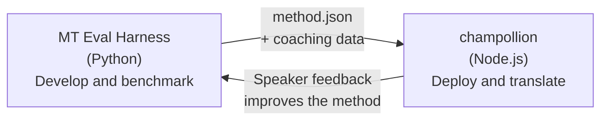

# El Puente del Harness de Evaluación

champollion y el MT Eval Harness son dos herramientas separadas que forman un ecosistema único. El harness es donde los métodos de traducción son **probados**. Champollion es donde los métodos probados son **desplegados**. Se conectan a través de un formato de plugin compartido.



## El Flujo: Investigación → Producción

### 1. Construir un método en el harness

Cualquier clase de Python que implemente `async translate(entries, config) → [{id, predicted}]` puede conectarse al harness. El harness no le importa qué suceda adentro — LLM con prompt, modelo entrenado personalizado, reglas determinísticas, cualquier cosa.

### 2. Evaluarlo

El harness califica su método contra un corpus estandarizado con métricas reproducibles: chrF++, aceptación FST (para idiomas morfológicamente ricos), precisión morfológica y puntuación semántica.

### 3. Exportar como un plugin

Cuando su método alcanza una calidad aceptable, empaquételo como un plugin de champollion — un manifiesto `method.json` con datos de coaching opcionales.

:::info[Se planifica la CLI de exportación]
Actualmente, crea el manifiesto method.json manualmente. El comando `mt-eval export` automatizará esto. Consulte la [Interfaz de método](/docs/network/specifications/methods) para conocer el formato completo del complemento.
:::

### 4. Instalar en champollion

```bash
champollion plugin install ./my-method-plugin/
```

### 5. Traducir contenido real

```bash
champollion sync
```

Su método evaluado ahora está produciendo traducciones reales en producción.

## El Flujo: Producción → Investigación

Las traducciones desplegadas son revisadas por hablantes bilingües. Su retroalimentación identifica errores sistemáticos (patrones de tiempo incorrectos, vocabulario faltante, fraseología poco natural). El investigador actualiza el método en el harness, re-evalúa, re-exporta y redeploy. El sistema aprende del uso.

## El Formato del Plugin

El manifiesto `method.json` es el contrato entre las dos herramientas:

```json
{
  "name": "crk-coached-v3",
  "type": "llm-coached",
  "version": "3.0.0",
  "description": "Coached LLM translation for Plains Cree",
  "locales": ["crk"],
  "config": {
    "model": "google/gemini-3.5-flash",
    "temperature": 0.3
  },
  "benchmarks": {
    "crk": {
      "composite_score": 0.67,
      "fst_acceptance": 0.82,
      "corpus_size": 150
    }
  }
}
```

Consulte la [Especificación del Plugin](/docs/reference/plugin-spec) para el formato completo.

## Qué está Construido vs. Planeado

| Componente | Estado |
|-----------|--------|
| Protocolo TranslationMethod | ✅ Construido |
| Ejecutor de benchmark del harness | ✅ Construido |
| Formato de plugin method.json | ✅ Construido |
| `champollion plugin install/remove/list` | ✅ Construido |
| Carga de datos de coaching | ✅ Construido |
| CLI `mt-eval export` | 🔲 Planeado |
| Interfaz de revisión comunitaria | 🔲 Planeado |
| Evaluación de conjunto de pruebas criptográfica | 🔲 Planeado |

## Lecturas Adicionales

- [Métodos de traducción](/docs/guides/translation-methods) — todos los métodos disponibles y cómo funcionan
- [Especificación de plugins](/docs/reference/plugin-spec) — el formato method.json
- [Servir un método a través de una API](/docs/guides/serving-a-method) — alojar un método del lado del servidor
- [Soberanía de datos](/docs/network/sovereignty/data-sovereignty) — principios indígenas de soberanía de datos, CARE y protección criptográfica
- [Para investigadores de MT](/docs/network/leaderboard/rules) — la documentación del eval harness
