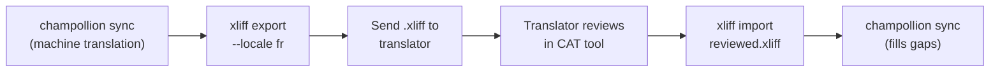

# Trabajar con Traductores Profesionales

Champollion genera traducciones automáticas, pero algunos proyectos requieren revisión humana — contenido regulatorio, copias sensibles a la marca, o interfaces de alto riesgo. El flujo de trabajo XLIFF le permite exportar traducciones para revisión profesional e importarlas nuevamente sin problemas.

## ¿Qué es XLIFF?

XLIFF (XML Localization Interchange File Format) es el formato de intercambio estándar de la industria para herramientas de traducción. Todas las herramientas CAT (Computer-Assisted Translation) profesionales lo soportan:

- **memoQ** — importar XLIFF, revisar en contexto, exportar archivo revisado
- **SDL Trados Studio** — soporte nativo de XLIFF
- **Phrase (Memsource)** — cargar trabajos XLIFF para equipos de traductores
- **Smartling** — canalización de ingesta XLIFF
- **OmegaT** — herramienta CAT gratuita/de código abierto con soporte XLIFF

Champollion genera XLIFF 1.2 (la versión universalmente soportada) en lugar de 2.0+ para máxima compatibilidad con herramientas.

## El Flujo de Trabajo



### Paso 1: Generar Traducciones Automáticas

Ejecute `sync` primero para obtener una traducción automática de referencia:

```bash
champollion sync
```

### Paso 2: Exportar XLIFF

Exporte el par origen-destino como XLIFF:

```bash
champollion xliff export --locale fr
```

Esto escribe `.champollion/xliff/fr.xliff` que contiene:
- Cada clave de origen con su valor en inglés
- La traducción automática actual (si existe) como `<target>`
- Claves sin traducciones marcadas como `state="new"`

```xml
<trans-unit id="hero.title" xml:space="preserve">
  <source>Welcome to our platform</source>
  <target state="translated">Bienvenue sur notre plateforme</target>
</trans-unit>
```

### Paso 3: Enviar al Traductor

Envíe el archivo `.xliff` a su traductor o cárguelo en su plataforma CAT. El traductor ve el lado origen y destino lado a lado, y puede:

- Editar traducciones automáticas
- Completar traducciones faltantes
- Marcar problemas de calidad
- Aplicar su propia memoria de traducción y bases terminológicas

### Paso 4: Importar Archivo Revisado

Cuando el traductor devuelve el `.xliff` revisado, impórtelo:

```bash
# Preview what will change
champollion xliff import .champollion/xliff/fr.xliff --dry

# Apply changes
champollion xliff import .champollion/xliff/fr.xliff
```

Salida:
```
  ✓ Imported 142 translations for fr
    Updated:    23 (changed from existing)
    Added:      0 (new keys)
    Unchanged:  119
    Written to: locales/fr.json
```

### Paso 5: Completar Vacíos

Si se agregaron nuevas claves después de que se exportó el XLIFF, ejecute `sync` para traducirlas:

```bash
champollion sync
```

Champollion solo traduce claves que aún faltan — las traducciones revisadas de la importación XLIFF se preservan.

## Consejos

### Exportar Rutas Personalizadas

```bash
# Export to a specific directory
champollion xliff export --locale ja --out ./for-review/

# Export with a specific filename
champollion xliff export --locale de --out ./review/german.xliff
```

### Múltiples Locales

Exporte cada local por separado:

```bash
for locale in fr de ja ko; do
  champollion xliff export --locale $locale
done
```

### Control de Versiones

Agregue `.champollion/xliff/` a `.gitignore` — los archivos XLIFF son artefactos transitorios, no fuente del proyecto:

```gitignore
.champollion/xliff/
```

### Cuándo Usar XLIFF vs. Solo `sync`

| Escenario | Recomendación |
|----------|---------------|
| Aplicación interna, 90%+ de calidad aceptable | Solo `sync` — la traducción automática es suficiente |
| Copias de marketing orientadas al usuario | Exportar XLIFF para revisión humana |
| Contenido legal/regulatorio | Exportar XLIFF — revisión humana requerida |
| 50+ locales, plazo ajustado | `sync` primero, exportación XLIFF solo para los 5 locales principales |
| Traductor ya usa una herramienta CAT | XLIFF es el formato natural de entrega |

---

## Véase También

- [Referencia CLI — xliff](/docs/reference/cli#xliff) — referencia de comandos
- [Memoria de Traducción](/docs/concepts/translation-memory) — almacenamiento en caché de traducciones revisadas
- [Métodos de Traducción](/docs/guides/translation-methods) — opciones de traducción automática
