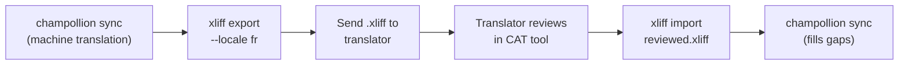

# Trabajar con Traductores Profesionales

Champollion genera traducciones automáticas, pero algunos proyectos requieren revisión humana — contenido regulatorio, copias sensibles a la marca, o interfaces de alto riesgo. El flujo de trabajo XLIFF le permite exportar traducciones para revisión profesional e importarlas nuevamente sin problemas.

XLIFF cubre los **archivos de cadenas** (claves y valores) de su aplicación. El contenido **Markdown** traducido (boletines, publicaciones de blog, páginas de documentación) se revisa de manera diferente: el revisor edita directamente el archivo `.md` traducido y la sincronización conserva esas ediciones. Consulte [Revisión de Markdown traducido](#reviewing-translated-markdown) más abajo.

## ¿Qué es XLIFF?

XLIFF (XML Localization Interchange File Format) es el formato de intercambio estándar de la industria para herramientas de traducción. Todas las herramientas CAT (Computer-Assisted Translation) profesionales lo soportan:

- **memoQ** — importar XLIFF, revisar en contexto, exportar archivo revisado
- **SDL Trados Studio** — soporte nativo de XLIFF
- **Phrase (Memsource)** — cargar trabajos XLIFF para equipos de traductores
- **Smartling** — canalización de ingesta XLIFF
- **OmegaT** — herramienta CAT gratuita/de código abierto con soporte XLIFF

Champollion genera XLIFF 1.2 (la versión universalmente soportada) en lugar de 2.0+ para máxima compatibilidad con herramientas.

## El Flujo de Trabajo


```mermaid
flowchart LR
    A["champollion sync\n(machine translation)"] --> B["xliff export\n--locale fr"]
    B --> C["Send .xliff to\ntranslator"]
    C --> D["Translator reviews\nin CAT tool"]
    D --> E["xliff import\nreviewed.xliff"]
    E --> F["champollion sync\n(fills gaps)"]
```

### Paso 1: Generar Traducciones Automáticas

Ejecute `sync` primero para obtener una traducción automática de referencia:

```bash
champollion sync
```

### Paso 2: Exportar XLIFF

Exporte el par origen-destino como XLIFF:

```bash
champollion xliff export --locale fr
```

Esto escribe `.champollion/xliff/fr.xliff` que contiene:
- Cada clave de origen con su valor en inglés
- La traducción automática actual (si existe) como `<target>`
- Claves sin traducciones marcadas como `state="new"`

```xml
<trans-unit id="hero.title" xml:space="preserve">
  <source>Welcome to our platform</source>
  <target state="translated">Bienvenue sur notre plateforme</target>
</trans-unit>
```

### Paso 3: Enviar al Traductor

Envíe el archivo `.xliff` a su traductor o cárguelo en su plataforma CAT. El traductor ve el lado origen y destino lado a lado, y puede:

- Editar traducciones automáticas
- Completar traducciones faltantes
- Marcar problemas de calidad
- Aplicar su propia memoria de traducción y bases terminológicas

### Paso 4: Importar Archivo Revisado

Cuando el traductor devuelve el `.xliff` revisado, impórtelo:

```bash
# Preview what will change
champollion xliff import .champollion/xliff/fr.xliff --dry

# Apply changes
champollion xliff import .champollion/xliff/fr.xliff
```

Salida:
```
  ✓ Imported 142 translations for fr
    Updated:    23 (changed from existing)
    Added:      0 (new keys)
    Unchanged:  119
    Written to: locales/fr.json
```

### Paso 5: Completar Vacíos

Si se agregaron nuevas claves después de que se exportó el XLIFF, ejecute `sync` para traducirlas:

```bash
champollion sync
```

Champollion solo traduce claves que aún faltan — las traducciones revisadas de la importación XLIFF se preservan.

## Consejos

### Exportar Rutas Personalizadas

```bash
# Export to a specific directory
champollion xliff export --locale ja --out ./for-review/

# Export with a specific filename
champollion xliff export --locale de --out ./review/german.xliff
```

### Múltiples Locales

Exporte cada local por separado:

```bash
for locale in fr de ja ko; do
  champollion xliff export --locale $locale
done
```

### Control de Versiones

Agregue `.champollion/xliff/` a `.gitignore` — los archivos XLIFF son artefactos transitorios, no fuente del proyecto:

```gitignore
.champollion/xliff/
```

### Cuándo Usar XLIFF vs. Solo `sync`

| Escenario | Recomendación |
|----------|---------------|
| Aplicación interna, 90%+ de calidad aceptable | Solo `sync` — la traducción automática es suficiente |
| Copias de marketing orientadas al usuario | Exportar XLIFF para revisión humana |
| Contenido legal/regulatorio | Exportar XLIFF — revisión humana requerida |
| 50+ locales, plazo ajustado | `sync` primero, exportación XLIFF solo para los 5 locales principales |
| Traductor ya usa una herramienta CAT | XLIFF es el formato natural de entrega |

## Edición de traducciones en los archivos de configuración regional {#editing-key-value-files}

Un revisor también puede corregir una traducción directamente en un archivo de configuración regional (`messages/fr.json`, `locale/fr/LC_MESSAGES/django.po`, `app_fr.arb`, …) y hacer commit del cambio. Champollion registra, en `.champollion.lock`, una huella digital de cada valor que escribe. Un valor que ya no coincide fue modificado por una persona, y la sincronización lo trata como propio de esta:

| Qué se ejecuta | Qué sucede con el valor editado |
|---|---|
| Un `sync` simple, con el inglés sin cambios | Intacto (como antes). |
| `sync --redo all` / `--force`, un cambio de modelo (`--redo all --fresh-on-model-change`) o el reintento de claves que una operación de rehacer dejó pendientes | **Se conserva.** La ejecución indica cuántos conservó y cuáles, y cómo reemplazar uno: `--redo keys:<key>`. |
| `sync --redo keys:<key>` especificándola | Se reemplaza: usted solicitó esa clave por su nombre. La redacción editada se imprime primero. |
| La **fuente en inglés de esa clave cambia** | Se traduce de nuevo (la edición era para el texto anterior). La redacción editada se imprime para que pueda volver a aplicarse y se anexa a `.champollion-replaced-edits.jsonl` en la raíz del proyecto. |

`.champollion-replaced-edits.jsonl` es un archivo rastreado junto al lock (la carpeta de caché `.champollion/` es por máquina y está ignorada por git): una línea JSON por cada edición reemplazada, con la configuración regional, el archivo, la clave, la redacción editada, el motivo por el que se reemplazó y el nuevo texto de origen. Haga commit de él junto con el lock — es la única copia de esa redacción. `champollion status` indica cuántas contiene.

Los valores escritos antes de que existiera este registro, o por otra herramienta, no tienen huella digital. Dicho valor se considera de Champollion solo cuando la caché de traducción contiene exactamente ese texto para la clave; de lo contrario, se trata como el trabajo de una persona y se conserva en las operaciones masivas de rehacer (la ejecución los enumera como valores de los que no tiene registro de escritura). Los valores importados con `champollion xliff import` son el trabajo de una persona y se conservan de la misma manera.

## Revisión de Markdown traducido {#reviewing-translated-markdown}

Los archivos de contenido de un `contentDir` (por ejemplo, `newsletters/2026-10.md` → `newsletters/2026-10.crk.md`) no tienen exportación XLIFF. El revisor trabaja directamente en el archivo traducido:

1. Ejecute `champollion sync` y haga commit de las traducciones junto con `.champollion-content.lock`.
2. El revisor edita el archivo traducido, ya sea un párrafo o un campo de front-matter traducido como `title`, y hace commit del cambio.
3. En sincronizaciones posteriores, las ediciones se conservan. Si el texto de origen en inglés cambia en otros párrafos, los párrafos del revisor se mantienen palabra por palabra y solo se traducen los párrafos modificados. La ejecución imprime `kept the edits made by hand to …`.

Hay dos excepciones, y la sincronización advierte sobre ambas. Si el párrafo en inglés que corrigió el revisor también cambia, ese párrafo se traduce nuevamente y la redacción del revisor se imprime para que pueda volver a aplicarse. Si el revisor agregó o eliminó párrafos y la fuente cambia después, el archivo se deja tal como está y se lista en cada sincronización hasta que alguien lo actualice manualmente.

Para descartar las ediciones y volver a la traducción automática, especifique el archivo: `champollion sync --redo files:2026-10.md`. Las reglas completas se encuentran en [Traducción de contenido](/docs/guides/content-translation#reviewing-and-editing-translations).

---

## Consulte también

- [Referencia de la CLI — xliff](/docs/reference/cli#xliff) — referencia de comandos
- [Memoria de traducción](/docs/concepts/translation-memory) — almacenamiento en caché de traducciones revisadas
- [Métodos de traducción](/docs/guides/translation-methods) — opciones de traducción automática
- [Traducción de contenido](/docs/guides/content-translation) — cómo traducir Markdown y cómo se conservan las ediciones de los revisores
- [Quality Gate](/docs/concepts/quality-gate#refused-keys-are-held-back) — claves que el filtro de calidad rechazó y claves que una operación de rehacer dejó pendientes
