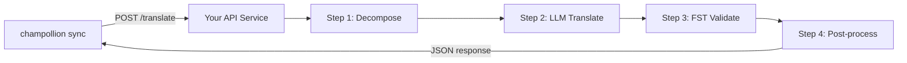

# Servir un Método Personalizado como una API

El **`api` method** de champollion le permite apuntar cualquier par de traducción a un punto final HTTP externo. Así es como integra canalizaciones demasiado complejas para un único mensaje de LLM — analizadores morfológicos, transductores de estado finito (FST), cadenas de LLM de múltiples pasos, o cualquier método de investigación personalizado que haya creado.

Hay dos formas de levantar un *endpoint* de este tipo:

1. **`champollion serve`** — un comando que sirve la pila configurada de su proyecto existente de champollion (método, registros, *coaching*, Memoria de Traducción, puerta de calidad) detrás de este contrato. Sin código de servidor. Consulte [la ruta sin código](#the-zero-code-path-champollion-serve).
2. **Un servicio personalizado** — escriba su propio servidor HTTP implementando el contrato, para *pipelines* que viven completamente fuera de champollion.

## ¿Por qué un Servicio de API?

Algunas canalizaciones de traducción no pueden ejecutarse dentro de un ciclo simple de solicitud-respuesta:

| Paso de canalización | Ejemplo |
|---|---|
| **Descomposición morfológica** | Dividir palabras polisintéticas en morfemas antes de la traducción |
| **Validación FST** | Rechazar salidas que violen reglas fonológicas o morfológicas |
| **Cadenas de LLM de múltiples pasos** | Ciclos de generar → verificar → corregir con diferentes modelos |
| **Búsqueda en diccionario** | Hacer referencia cruzada a un diccionario bilingüe curado a mitad de la canalización |
| **Intervención humana** | Encolar traducciones inciertas para revisión de expertos |

El método `api` trata su canalización como una caja negra — champollion envía cadenas de origen, su servicio devuelve traducciones. Lo que sucede dentro depende completamente de usted.

## Arquitectura



## La ruta sin código: `champollion serve`

Si su *pipeline* ya es un proyecto de champollion — un método configurado (LLM, con *coaching* o un motor), registros, archivos de *coaching*, Memoria de Traducción y la puerta de calidad determinista —, no necesita escribir un servidor en absoluto. `champollion serve` levanta **su propia pila configurada** detrás del contrato exacto que se describe a continuación:

```bash
# Owner side — run from the project whose champollion.config.json defines the stack
CHAMPOLLION_SERVE_TOKEN=$(openssl rand -hex 24) npx champollion serve
# [OK] champollion serve listening on http://127.0.0.1:1822/translate
```

Cada solicitud pasa por el mismo *pipeline* que usa `champollion sync`:

- **Memoria de Traducción** — las cadenas que la MT ya contiene se sirven desde la caché de forma gratuita, sin tocar a su proveedor *upstream*. Los resultados de la API validados por la puerta de calidad se almacenan en caché para la siguiente solicitud.
- **Puerta de calidad** — cada respuesta se valida de forma determinista (repetición, proporción de longitud, cumplimiento del sistema de escritura, eco del origen). Los fallos se devuelven como errores estructurados por clave (HTTP 207/422) — nunca como una salida degradada silenciosamente.
- **Guardia de costos** — `--max-cost-per-request` y `--max-session-cost` rechazan las solicitudes cuyo costo *upstream* *estimado* excede sus límites, antes de que se realice cualquier llamada al proveedor. Los métodos con precios desconocidos también se rechazan bajo un límite: lo desconocido no es gratis. Las solicitudes cubiertas por la MT tienen un costo conocido de $0 y siempre pasan.

El servidor se vincula a `127.0.0.1` por defecto: cualquiera que pueda alcanzar el puerto puede gastar su presupuesto de la API *upstream*, por lo que exponerlo es una decisión explícita — `--bind 0.0.0.0` más un *token bearer* fuerte. `--no-auth` solo se acepta junto con un vínculo *loopback*. Un límite de tasa por IP y un límite de tamaño de solicitud están activados por defecto; consulte `champollion serve --help`.

### Apuntar un consumidor hacia él

Emita el manifiesto del *plugin* que instalan los consumidores (un comando en cada lado):

```bash
# Owner side
champollion serve --emit-manifest --endpoint https://translate.example.org
# [OK] Wrote ./my-project-serve/method.json
```

```bash
# Consumer side
champollion plugin install ./my-project-serve
```

```json title="champollion.config.json (consumer)"
{
  "pairs": {
    "en:crk": { "methodPlugin": "my-project-serve" }
  }
}
```

```bash
CHAMPOLLION_API_KEY=<the server's bearer token> champollion sync
```

El método `api` del consumidor envía las cadenas de origen a su servidor mediante POST; su pila traduce, filtra y almacena en caché; el `qualityTier` del manifiesto es un paso directo y honesto de sus pares configurados (el nivel más conservador cuando difieren). Sus *prompts*, datos de *coaching* y claves de proveedor nunca salen de su computadora.

El resto de esta guía cubre la escritura de un servicio **personalizado** — útil cuando su *pipeline* no es un proyecto de champollion (una cadena FST de Python, un sistema de investigación a medida). El contrato de red es idéntico en ambos casos.

## Configurar Su Servicio

Su servicio de API debe implementar un único punto final que acepte y devuelva JSON:

### Formato de Solicitud

champollion envía este cuerpo JSON exacto (véase [api.js](https://github.com/gamedaysuits/Champollion/blob/main/cli/lib/methods/api.js)):

```json
POST /translate
Content-Type: application/json
Authorization: Bearer <CHAMPOLLION_API_KEY>

{
  "source_locale": "en",
  "target_locale": "crk",
  "method": "crk-coached-v1",
  "keys": {
    "greeting": "Hello, welcome to our app",
    "farewell": "Goodbye and thanks"
  }
}
```

| Campo | Tipo | Descripción |
|-------|------|-------------|
| `source_locale` | string | Código de idioma de origen BCP 47 |
| `target_locale` | string | Código de idioma de destino BCP 47 |
| `method` | string | Nombre del complemento o `"default"` |
| `keys` | object | Mapa de clave → cadena de origen a traducir |
```

### Response Format

Your service must return a `translations` object. An optional `meta` object can include cost and diagnostic info:

```json
{
  "translations": {
    "greeting": "tânisi, pê-kîwêw ôta",
    "farewell": "ekosi mâka, kinanâskomitin"
  },
  "meta": {
    "model": "my-custom-pipeline/v1",
    "cost_usd": 0.0042,
    "method": "decompose-translate-validate"
  }
}
```

| Field | Type | Required | Description |
|-------|------|----------|-------------|
| `translations` | object | ✅ | Map of key → translated string |
| `meta` | object | — | Optional metadata |
| `meta.cost_usd` | number | — | If present, displayed in champollion's output |
| `errors` | object | — | For partial success (HTTP 207): map of key → `{ message }` |

### Minimal Express Server

```javascript
import express from 'express';

const app = express();
app.use(express.json());

/**
 * champollion API contract:
 *
 * Request:  { source_locale, target_locale, method, keys: { "key": "source" } }
 * Response: { translations: { "key": "translated" }, meta: { ... } }
 */
app.post('/translate', async (req, res) => {
  const { source_locale, target_locale, method, keys } = req.body;

  const translations = {};

  for (const [key, source] of Object.entries(keys)) {
    // --- Your pipeline goes here ---
    // Step 1: Morphological decomposition
    const morphemes = await decompose(source, source_locale);

    // Step 2: LLM translation with context
    const draft = await llmTranslate(morphemes, target_locale);

    // Step 3: FST validation
    const validated = await fstValidate(draft, target_locale);

    // Step 4: Post-processing (orthography normalization, etc.)
    translations[key] = await postProcess(validated);
  }

  res.json({
    translations,
    meta: {
      model: 'my-custom-pipeline/v1',
      method: 'decompose-translate-validate',
    },
  });
});

app.listen(3001, () => {
  console.log('Translation API running on http://localhost:3001');
});
```

## Configuring champollion

Point a translation pair at your running service in `champollion.config.json`:

```json
{
  "inputLocale": "en",
  "pairs": {
    "en:crk": {
      "method": "api",
      "endpoint": "http://localhost:3001/translate",
      "register": "Formal Plains Cree. Use SRO orthography."
    }
  }
}
```

Then run sync as usual:

```bash
npx champollion sync
```

champollion will POST your source strings to the endpoint and write the returned translations to `crk.json`.

## Case Study: Plains Cree Pipeline

:::info[Under Development]
The Plains Cree pipeline described below is **under active development** and is not yet running in production. Details here reflect the current design direction and may change as the project evolves.
:::

The **arena** project demonstrates this pattern. Its Plains Cree pipeline uses:

1. **Morphological decomposition** — Break polysynthetic Cree words into translatable morpheme chains
2. **LLM translation** — Context-enriched GPT-4o translation with coaching data (SRO orthography rules, register instructions)
3. **FST validation** — Finite-state transducer checks that outputs conform to Cree phonological rules
4. **Confidence scoring** — Each translation gets a confidence score based on FST pass rate and dictionary coverage

The entire pipeline runs as a single HTTP endpoint that champollion calls via the `api` method.

### Running Evaluations

After translating, you can evaluate output quality using the harness directly:

```bash
# Clone the harness
git clone https://github.com/gamedaysuits/Champollion.git
cd Champollion/arena
pip install -e .

# Run the evaluation against a real, non-bundled corpus
mt-eval run --corpus eval-amh-fra-globalvoices-test-v1 --model gemini-pro --yes
```

This produces structured evaluation records with chrF++, BLEU, and exact match scores that can be used as regression baselines.

## Authentication

If your API requires authentication, set the `apiKey` field or use an environment variable:

```json
{
  "pairs": {
    "en:crk": {
      "method": "api",
      "endpoint": "https://my-mt-service.example.com/translate",
      "apiKey": "${CRK_API_KEY}"
    }
  }
}
```

## Data Sovereignty

The `api` method is particularly important for **Indigenous language communities**. By self-hosting the translation pipeline, a community keeps full control over:

- **Proprietary coaching data** — register instructions, orthography rules, and domain glossaries never leave community infrastructure.
- **Linguistic resources** — curated dictionaries, FST grammars, and elder-verified translations remain under community ownership.
- **Access policies** — the community decides who can call the endpoint and under what terms.

This design follows the direction of [Indigenous data-sovereignty principles](/docs/network/community/low-resource-languages#data-sovereignty-principles) — community ownership and control of language data: sensitive language data stays governed by the community rather than a third-party platform.

:::tip
Combine the `api` method with a private deployment (e.g., a community-hosted VM or on-prem server) for the strongest data-sovereignty posture. `champollion serve` gives a community exactly this self-hosting posture without writing any server code — coaching data, provider keys, and the Translation Memory all stay on community infrastructure. See [Support a Low-Resource Language](/docs/network/community/low-resource-languages) for a full walkthrough.
:::

## Cost Estimation

The `api` method returns `null` for cost estimation by default — your service controls pricing. If you want to provide cost transparency, have your API return a `cost` field in the metadata:

```json
{
  "translations": { "...": "..." },
  "metadata": {
    "cost": {
      "estimatedCost": 0.0042,
      "currency": "USD",
      "source": "my-service-pricing"
    }
  }
}
```

## Mejores Prácticas

1. **Devolver cadenas vacías en caso de fallos** — No devuelva la cadena de origen como una "traducción". Devuelva `""` y la puerta de calidad de champollion lo detectará. La clave se omitirá y se reintentará en la siguiente sincronización.
2. **Incluir puntuaciones de confianza** — Si su canalización puede estimar la calidad, devuélvala en los metadatos. Esto ayuda con la auditoría de calidad.
3. **Implementar verificaciones de salud** — Agregue un punto final `GET /health` para que champollion pueda verificar la conectividad antes de iniciar una sincronización grande.
4. **Limitar velocidad con elegancia** — Si su canalización tiene límites de rendimiento, devuelva códigos de estado `429`. El sistema de lotes de champollion se retirará.
5. **Registrar todo** — Las canalizaciones de múltiples pasos pueden fallar silenciosamente. Registre la entrada/salida de cada paso para depuración.

## Licencia

El patrón del método `api` es completamente abierto — no hay restricciones de licencia para envolver su propia canalización de traducción como un servicio HTTP. El arnés de evaluación `arena` está licenciado bajo AGPL-3.0-or-later (con una excepción de complemento estándar de evaluación §7); puede estudiarlo y construir sobre él bajo esos términos.

## Consulte también

- [Métodos de traducción](/docs/guides/translation-methods) — descripción general de cada método integrado (`openai`, `google`, `api`, etc.)
- [Especificación del plugin](/docs/reference/plugin-spec) — esquema completo para `champollion.config.json` incluyendo los campos del método `api`
- [Apoyar a un idioma de bajos recursos](/docs/network/community/low-resource-languages) — guía de principio a fin para idiomas con pocos recursos, incluyendo los principios de soberanía de datos
- [Arquitectura](/docs/concepts/architecture) — cómo funcionan el bucle de sincronización, el procesamiento por lotes y el despacho de métodos de champollion
- [Evaluación de MT](/docs/network/leaderboard/rules) — metodología de evaluación, métricas y el proceso de envío a la tabla de clasificación
- [Tabla de clasificación de métodos](/leaderboard) — clasificaciones de calidad en vivo en todos los métodos y pares de idiomas

