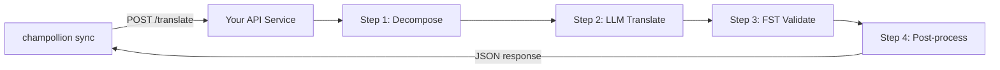

# Servir un Método Personalizado como una API

El **`api` method** de champollion le permite apuntar cualquier par de traducción a un punto final HTTP externo. Así es como integra canalizaciones demasiado complejas para un único mensaje de LLM — analizadores morfológicos, transductores de estado finito (FST), cadenas de LLM de múltiples pasos, o cualquier método de investigación personalizado que haya creado.

Hay dos formas de poner en funcionamiento dicho endpoint:

1. **`champollion serve`** — un solo comando que sirve la pila configurada de su proyecto champollion existente (método, registros, coaching, memoria de traducción, control de calidad) detrás de este contrato. Sin código de servidor. Consulte [la ruta sin código](#the-zero-code-path-champollion-serve).
2. **Un servicio personalizado** — escriba su propio servidor HTTP implementando el contrato, para pipelines que residen completamente fuera de champollion.

## ¿Por qué un Servicio de API?

Algunas canalizaciones de traducción no pueden ejecutarse dentro de un ciclo simple de solicitud-respuesta:

| Paso de canalización | Ejemplo |
|---|---|
| **Descomposición morfológica** | Dividir palabras polisintéticas en morfemas antes de la traducción |
| **Validación FST** | Rechazar salidas que violen reglas fonológicas o morfológicas |
| **Cadenas de LLM de múltiples pasos** | Ciclos de generar → verificar → corregir con diferentes modelos |
| **Búsqueda en diccionario** | Hacer referencia cruzada a un diccionario bilingüe curado a mitad de la canalización |
| **Intervención humana** | Encolar traducciones inciertas para revisión de expertos |

El método `api` trata su canalización como una caja negra — champollion envía cadenas de origen, su servicio devuelve traducciones. Lo que sucede dentro depende completamente de usted.

## Arquitectura


```mermaid
graph LR
    A[champollion sync] -->|POST /translate| B[Your API Service]
    B --> C[Step 1: Decompose]
    C --> D[Step 2: LLM Translate]
    D --> E[Step 3: FST Validate]
    E --> F[Step 4: Post-process]
    F -->|JSON response| A
```

## La ruta sin código: `champollion serve`

Si su pipeline ya es un proyecto de champollion —un método configurado (LLM, con coaching o un motor), registros, archivos de coaching, memoria de traducción y el control de calidad determinista—, no necesita escribir un servidor en absoluto. `champollion serve` levanta **su propia pila configurada** detrás del contrato exacto que se describe a continuación:

```bash
# Owner side — run from the project whose champollion.config.json defines the stack
CHAMPOLLION_SERVE_TOKEN=$(openssl rand -hex 24) npx champollion serve
# [OK] champollion serve listening on http://127.0.0.1:1822/translate
```

Cada solicitud pasa por el mismo pipeline que utiliza `champollion sync`:

- **Memoria de traducción** — las cadenas que la TM ya contiene se sirven desde la caché de forma gratuita, sin contactar a su proveedor upstream. Los resultados de la API validados por el control de calidad se almacenan en caché para la siguiente solicitud.
- **Control de calidad** — cada respuesta se valida de manera determinista (repetición, proporción de longitud, cumplimiento de sistema de escritura, eco de origen). Las fallas se devuelven como errores estructurados por clave (HTTP 207/422), nunca como una salida degradada silenciosamente.
- **Protección de costos** — `--max-cost-per-request` y `--max-session-cost` rechazan solicitudes cuyo costo upstream *estimado* exceda sus límites máximos, antes de que se realice cualquier llamada al proveedor. Los métodos con precios desconocidos también se rechazan bajo un límite: desconocido no significa gratuito. Las solicitudes cubiertas por la TM tienen un costo conocido de $0 y siempre pasan.

El servidor se vincula a `127.0.0.1` de manera predeterminada: cualquiera que pueda alcanzar el puerto puede consumir el presupuesto de su API upstream, por lo que exponerlo es una decisión explícita: `--bind 0.0.0.0` más un token de portador seguro. `--no-auth` solo se acepta junto con una vinculación de bucle invertido (loopback). Un límite de tasa por IP y un límite de tamaño de solicitud están activados por defecto; consulte `champollion serve --help`.

### Apuntar un consumidor hacia él

Emita el manifiesto de plugin que los consumidores instalan (un comando en cada lado):

```bash
# Owner side
champollion serve --emit-manifest --endpoint https://translate.example.org
# [OK] Wrote ./my-project-serve/method.json
```

```bash
# Consumer side
champollion plugin install ./my-project-serve
```

```json title="champollion.config.json (consumer)"
{
  "pairs": {
    "en:crk": { "methodPlugin": "my-project-serve" }
  }
}
```

```bash
CHAMPOLLION_API_KEY=<the server's bearer token> champollion sync
```

El método `api` del consumidor envía mediante POST las cadenas de origen a su servidor; su pila traduce, aplica el control de calidad y almacena en caché; el `qualityTier` del manifiesto es un traspaso fiel de sus pares configurados (el nivel más conservador cuando difieren). Sus prompts, datos de coaching y claves de proveedor nunca salen de su computadora.

El resto de esta guía cubre la creación de un servicio **personalizado**, útil cuando su pipeline no es un proyecto de champollion (una cadena FST en Python, un sistema de investigación a medida). El contrato de transmisión es idéntico en ambos casos.

## Configurar Su Servicio

Su servicio de API debe implementar un único punto final que acepte y devuelva JSON:

### Formato de Solicitud

champollion envía este cuerpo JSON exacto (véase [api.js](https://github.com/gamedaysuits/Champollion/blob/main/cli/lib/methods/api.js)):

```json
POST /translate
Content-Type: application/json
Authorization: Bearer <CHAMPOLLION_API_KEY>

{
  "source_locale": "en",
  "target_locale": "crk",
  "method": "my-project-serve",
  "keys": {
    "greeting": "Hello, welcome to our app",
    "farewell": "Goodbye and thanks"
  }
}
```

| Campo | Tipo | Descripción |
|-------|------|-------------|
| `source_locale` | string | Código de idioma de origen BCP 47 |
| `target_locale` | string | Código de idioma de destino BCP 47 |
| `method` | string | Nombre del plugin o `"default"` |
| `keys` | object | Mapa de clave → cadena de origen a traducir |
| `instructions` | object | Solo cuando el endpoint declara `"acceptsInstructions": true`: clave → notas por clave (qué formas plurales necesita un mensaje, retroalimentación del reintento de control de calidad) |
| `text_format` | string | `"markdown"` para texto de documentos Markdown (ver más abajo); ausente para cadenas de la aplicación |

### Formato de respuesta

Su servicio debe devolver un objeto `translations`. Un objeto opcional `meta` puede incluir información de costo y diagnóstico:

```json
{
  "translations": {
    "greeting": "<the greeting, translated>",
    "farewell": "<the farewell, translated>"
  },
  "meta": {
    "model": "my-custom-pipeline/v1",
    "cost_usd": 0.0042,
    "method": "decompose-translate-validate"
  }
}
```

| Campo | Tipo | Requerido | Descripción |
|-------|------|----------|-------------|
| `translations` | object | ✅ | Mapa de clave → cadena traducida |
| `meta` | object | — | Metadatos opcionales |
| `meta.cost_usd` | number | — | Si está presente, se muestra en la salida de champollion |
| `errors` | object | — | Para éxito parcial (HTTP 207): mapa de clave → `{ message }` |

### Servidor Express mínimo

```javascript
import express from 'express';

const app = express();
app.use(express.json());

/**
 * champollion API contract:
 *
 * Request:  { source_locale, target_locale, method, keys: { "key": "source" } }
 * Response: { translations: { "key": "translated" }, meta: { ... } }
 */
app.post('/translate', async (req, res) => {
  const { source_locale, target_locale, method, keys } = req.body;

  const translations = {};

  for (const [key, source] of Object.entries(keys)) {
    // --- Your pipeline goes here ---
    // Step 1: Morphological decomposition
    const morphemes = await decompose(source, source_locale);

    // Step 2: LLM translation with context
    const draft = await llmTranslate(morphemes, target_locale);

    // Step 3: FST validation
    const validated = await fstValidate(draft, target_locale);

    // Step 4: Post-processing (orthography normalization, etc.)
    translations[key] = await postProcess(validated);
  }

  res.json({
    translations,
    meta: {
      model: 'my-custom-pipeline/v1',
      method: 'decompose-translate-validate',
    },
  });
});

app.listen(3001, () => {
  console.log('Translation API running on http://localhost:3001');
});
```

## Configurar champollion

Apunte un par de traducción hacia su servicio en ejecución en `champollion.config.json`:

```json
{
  "inputLocale": "en",
  "pairs": {
    "en:crk": {
      "method": "api",
      "endpoint": "http://localhost:3001/translate",
      "register": "Formal Plains Cree. Use SRO orthography."
    }
  }
}
```

Luego ejecute la sincronización como de costumbre:

```bash
npx champollion sync
```

champollion enviará por POST sus cadenas de origen al endpoint y escribirá las traducciones devueltas en `crk.json`.

### ¿Su endpoint sigue instrucciones?

Indíquelo con `"acceptsInstructions"` en el par (o en el nivel superior del `method.json` del plugin):

- **`false`** — un modelo NMT entrenado, como uno servido por `nmt-forge serve`, traduce texto y nada más; si se le pregunta dos veces, responde lo mismo. Cuando el control de calidad rechaza una de sus respuestas, champollion **no** vuelve a consultarlo (sería una llamada desperdiciada); evalúa la primera respuesta como se evaluaría una segunda respuesta (se acepta un nombre que se mantenga tal como está escrito) y envía el resto al `fallback` del par.
- **`true`** — un LLM detrás de su endpoint puede utilizar notas por clave: las solicitudes llevan un objeto `instructions`, y una clave rechazada se vuelve a consultar con la retroalimentación del control de calidad.
- **sin configurar** — champollion no puede saberlo. Se vuelve a consultar una clave rechazada una vez más sin retroalimentación, y la ejecución indica que el endpoint podría ignorarla.

```json
{
  "pairs": {
    "en:crk": {
      "method": "api",
      "endpoint": "http://127.0.0.1:8378/translate",
      "acceptsInstructions": false,
      "fallback": { "method": "llm-coached" }
    }
  }
}
```

El método de respaldo aquí es un modelo alojado. Para mantener todo en esta máquina, use `"fallback": { "method": "local", "model": "<your local model>" }` en su lugar (consulte [Método de respaldo](/docs/getting-started/configuration#fallback) para saber cuándo usar cuál).

## Estudio de caso: Pipeline para Cree de las Llanuras

:::info[En desarrollo]
El pipeline para Cree de las Llanuras que se describe a continuación está **en desarrollo activo** y aún no se ejecuta en producción. Los detalles aquí reflejan la dirección de diseño actual y pueden cambiar a medida que el proyecto evolucione.
:::

El proyecto **arena** demuestra este patrón. Su pipeline para Cree de las Llanuras utiliza:

1. **Descomposición morfológica** — Divide las palabras polisintéticas del cree en cadenas de morfemas traducibles
2. **Traducción con LLM** — Traducción enriquecida con contexto mediante GPT-4o con datos de coaching (reglas de ortografía SRO, instrucciones de registro)
3. **Validación FST** — Un transductor de estados finitos comprueba que las salidas se ajusten a las reglas fonológicas del cree
4. **Puntuación de confianza** — Cada traducción obtiene una puntuación de confianza basada en la tasa de aprobación del FST y la cobertura del diccionario

Todo el pipeline se ejecuta como un único endpoint HTTP al que champollion llama a través del método `api`.

### Ejecución de evaluaciones

Después de traducir, usted puede evaluar la calidad de salida utilizando el arnés directamente:

```bash
# Clone the harness
git clone https://github.com/gamedaysuits/Champollion.git
cd Champollion/arena
python3 -m pip install -e .

# Run the evaluation against a real, non-bundled corpus
mt-eval run --corpus eval-amh-fra-globalvoices-test-v1 --model google/gemini-3.1-pro-preview --yes
```

Esto genera registros de evaluación estructurados con puntuaciones de chrF++, BLEU y coincidencia exacta que se pueden utilizar como líneas base de regresión.

## Autenticación

Si su API requiere autenticación, especifique la variable de entorno que contiene
su token en el par (`"${VAR}"`, leída del entorno o de `.env.local`),
o configure `CHAMPOLLION_API_KEY`. Champollion solo envía ese token al
endpoint — nunca la clave de otro proveedor. Un endpoint de bucle invertido (`nmt-forge
serve`, `champollion serve`) no necesita ninguno.

```json
{
  "pairs": {
    "en:crk": {
      "method": "api",
      "endpoint": "https://my-mt-service.example.com/translate",
      "apiKey": "${CRK_API_KEY}"
    }
  }
}
```

El contenido (cuerpos de Markdown) utiliza el mismo contrato: cada bloque es una clave
(`segment.<N>`, o `body` para una página completa) y la solicitud lleva
`"text_format": "markdown"`, de modo que el servidor puede distinguir el texto de documentos de las
cadenas de la aplicación. Los servidores que no reconozcan el campo pueden ignorarlo.

## Soberanía de datos

El método `api` es particularmente importante para las **comunidades de lenguas indígenas**. Al alojar por sí misma el pipeline de traducción, la comunidad mantiene un control total sobre:

- **Datos de coaching patentados** — las instrucciones de registro, las reglas ortográficas y los glosarios de dominio nunca salen de la infraestructura comunitaria.
- **Recursos lingüísticos** — los diccionarios seleccionados, las gramáticas FST y las traducciones verificadas por personas mayores permanecen bajo propiedad comunitaria.
- **Políticas de acceso** — la comunidad decide quién puede llamar al endpoint y bajo qué condiciones.

Este diseño sigue la línea de los [principios de soberanía de datos indígenas](/docs/network/community/low-resource-languages#data-sovereignty-principles) —propiedad y control comunitario de los datos lingüísticos: los datos lingüísticos sensibles siguen siendo gestionados por la comunidad en lugar de una plataforma de terceros.

:::tip
Combine el método `api` con un despliegue privado (por ejemplo, una máquina virtual alojada por la comunidad o un servidor local) para lograr la postura de soberanía de datos más sólida. `champollion serve` brinda a una comunidad exactamente esta capacidad de autoalojamiento sin escribir ningún código de servidor: los datos de coaching, las claves del proveedor y la memoria de traducción permanecen en la infraestructura comunitaria. Consulte [Apoyar un idioma de bajos recursos](/docs/network/community/low-resource-languages) para ver un recorrido completo.
:::

## Estimación de costos

El método `api` devuelve `null` para la estimación de costos de manera predeterminada — su servicio controla los precios. Si desea ofrecer transparencia en los costos, haga que su API devuelva un campo `cost` en los metadatos:

```json
{
  "translations": { "...": "..." },
  "metadata": {
    "cost": {
      "estimatedCost": 0.0042,
      "currency": "USD",
      "source": "my-service-pricing"
    }
  }
}
```

## Mejores Prácticas

1. **No devolver ninguna traducción para los fallos** — No devuelva la cadena de origen como una "traducción". Omita la clave en `translations` (o repórtela bajo `errors` con HTTP 207): la clave se omite y se vuelve a solicitar en la siguiente sincronización. Una respuesta que el control de calidad rechaza —una cadena vacía, un eco del origen— se recuerda, y una sincronización normal no vuelve a enviar esa clave a su endpoint hasta que alguien la especifique con `--redo keys:` (facturaría la misma respuesta).
2. **Incluir puntuaciones de confianza** — Si su pipeline puede estimar la calidad, devuélvala en los metadatos. Esto ayuda con la auditoría de calidad.
3. **Implementar verificaciones de estado (health checks)** — Añada un endpoint `GET /health` para que champollion pueda verificar la conectividad antes de iniciar una sincronización grande.
4. **Limitar la tasa de forma elegante** — Si su pipeline tiene límites de rendimiento, devuelva códigos de estado `429`. El sistema por lotes de champollion aplicará un retroceso progresivo.
5. **Registrar todo** — Los pipelines de varios pasos pueden fallar silenciosamente. Registre la entrada/salida de cada paso para depuración.

## Licencia

El patrón del método `api` es completamente abierto — no hay restricciones de licencia para envolver su propia canalización de traducción como un servicio HTTP. El arnés de evaluación `arena` está licenciado bajo AGPL-3.0-or-later (con una excepción de complemento estándar de evaluación §7); puede estudiarlo y construir sobre él bajo esos términos.

## Consulte también

- [Métodos de traducción](/docs/guides/translation-methods) — descripción general de cada método integrado (`openai`, `google`, `api`, etc.)
- [Especificación de plugins](/docs/reference/plugin-spec) — esquema completo para `champollion.config.json` incluyendo los campos del método `api`
- [Apoyar un idioma de bajos recursos](/docs/network/community/low-resource-languages) — guía integral para idiomas con recursos escasos, incluidos los principios de soberanía de datos
- [Arquitectura](/docs/concepts/architecture) — cómo funcionan el bucle de sincronización, el procesamiento por lotes y el despacho de métodos de champollion
- [Evaluación de MT](/docs/network/leaderboard/rules) — metodología de evaluación, métricas y el proceso de envío a la tabla de clasificación
- [Tabla de clasificación de métodos](/leaderboard) — clasificaciones de calidad en vivo entre métodos y pares de idiomas
