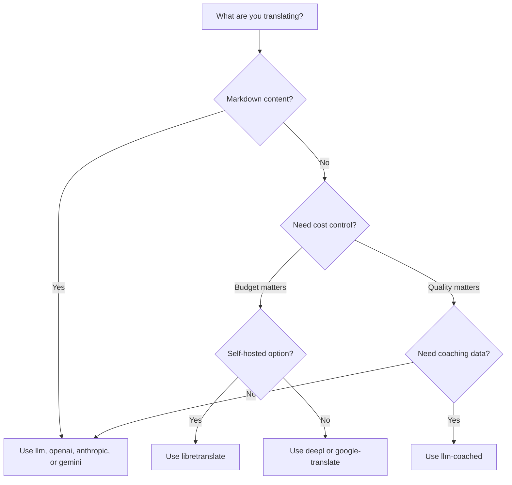

# Métodos de Traducción

Champollion admite múltiples métodos de traducción. Cada par de idiomas puede usar un método diferente; no está limitado a un solo enfoque para todo su proyecto.

## Comparación de Métodos

### Proveedores LLM

Enfocados en calidad, conscientes de Markdown, compatibles con coaching. Ideal para proyectos con mucho contenido.

| Método | Clave | Qué Hace |
|--------|-------|---------|
| `llm` (predeterminado) | `OPENROUTER_API_KEY` | LLM vía OpenRouter — 200+ modelos, enrutamiento automático |
| `llm-coached` | `OPENROUTER_API_KEY` | LLM + reglas gramaticales, diccionarios, notas de estilo |
| `openai` | `OPENAI_API_KEY` | API de OpenAI directo (gpt-4o, gpt-4o-mini) |
| `anthropic` | `ANTHROPIC_API_KEY` | API de Anthropic directo (Claude Sonnet, Haiku, Opus) |
| `gemini` | `GEMINI_API_KEY` | API de Google Gemini directo (Flash, Pro) — nivel gratuito |

### Traducción Automática Tradicional

Enfocada en velocidad y costo. Ideal para pares clave-valor de alto volumen.

| Método | Clave | Qué hace |
|--------|-------|----------|
| `google-translate` | `GOOGLE_TRANSLATE_API_KEY` | Google Cloud Translation API v2 (194 idiomas) |
| `deepl` | `DEEPL_API_KEY` | DeepL API con soporte para glosarios (33 idiomas) |
| `microsoft-translator` | `MICROSOFT_TRANSLATOR_API_KEY` | Azure Cognitive Services Translator (135 idiomas) |
| `libretranslate` | *(autoalojado)* | LibreTranslate autoalojado (AGPL, gratuito) |
| `tilde` | `TILDE_API_KEY` | Tilde MT: motores desarrollados en la UE, sólidos en idiomas bálticos y europeos |
| `translated` | `LARA_ACCESS_KEY_ID` + `LARA_ACCESS_KEY_SECRET` | Translated's Lara: traducción automática adaptativa profesional (200 idiomas) |

### Infraestructura

| Método | Clave | Qué Hace |
|--------|-------|---------|
| `api` | *(por proveedor)* | Cliente HTTP delgado para cualquier punto final de traducción REST |

## Árbol de Decisión



---

## `llm` — Traducción LLM (Predeterminada)

Traduce a través de cualquier LLM en [OpenRouter](https://openrouter.ai). Este es el método predeterminado y el más versátil.

**Cómo funciona:**
1. Agrupa claves (80 por lote de forma predeterminada) con instrucciones de registro y contexto
2. Envía a OpenRouter como un mensaje estructurado
3. Analiza la respuesta JSON
4. Valida cada traducción a través de la [puerta de calidad](/docs/concepts/quality-gate)
5. Escribe las traducciones aprobadas, reintenta o rechaza los fallos

**Cuándo usarlo:** La mayoría de proyectos. Especialmente sitios con mucho contenido y Markdown, donde los bloques de código y shortcodes necesitan protección.

**Configuración:**

```json
{
  "defaultMethod": "llm",
  "model": "google/gemini-3.5-flash"
}
```

## `llm-coached` — Traducción LLM con Coaching

Igual que `llm`, pero con reglas gramaticales, diccionarios de términos y notas de estilo inyectadas en cada mensaje.

**Cómo funciona:**
1. Carga datos de coaching desde `.champollion/coaching/<locale>.json` o el directorio `coaching/` de un plugin
2. Inyecta reglas gramaticales, términos de diccionario y notas de estilo en el mensaje del sistema
3. Los términos del diccionario que coinciden con claves de origen se incluyen como terminología requerida
4. La traducción procede como con `llm`, con datos de coaching añadiendo precisión

**Cuándo usarlo:** Idiomas de recursos limitados, terminología específica del dominio (legal, médica), registros formales, o cualquier caso donde la salida genérica del LLM no sea lo suficientemente precisa.

**Formato de datos de coaching:**

```json title=".champollion/coaching/fr.json"
{
  "grammar_rules": [
    "French adjectives agree in gender and number with the noun they modify",
    "Use 'vous' for formal contexts, 'tu' for informal"
  ],
  "dictionary": {
    "dashboard": "tableau de bord",
    "deployment": "déploiement",
    "settings": "paramètres"
  },
  "style_notes": "Prefer active voice. Avoid anglicisms where a native French term exists."
}
```

Véase también: [Guía de Idiomas de Recursos Limitados](/docs/network/community/low-resource-languages)

---

## `openai` — API de OpenAI Directo

Traduce directamente a través de la API de Chat Completions de OpenAI. Sin intermediario de OpenRouter — su clave, su cuenta, su panel de control de uso.

**Modelos:** `gpt-4o` (predeterminado), `gpt-4o-mini`

**Características:**
- ✅ Consciente de Markdown (traducción de contenido)
- ✅ Soporte de coaching (reglas gramaticales, anulaciones de diccionario, notas de estilo)
- ✅ Modo JSON para salida estructurada de clave-valor
- ✅ Retroceso exponencial con reintento

**Configuración:**

```json
{
  "pairs": {
    "en:fr": { "method": "openai", "model": "gpt-4o-mini" }
  }
}
```

```bash
export OPENAI_API_KEY=sk-proj-...
```

Obtenga su clave en [platform.openai.com/api-keys](https://platform.openai.com/api-keys).

## `anthropic` — API de Anthropic Directo

Traduce directamente a través de la API de Mensajes de Anthropic. Utiliza el parámetro `system` para datos de coaching, habilitando el almacenamiento en caché de mensajes de Anthropic.

**Modelos:** `claude-sonnet-4-6` (predeterminado), `claude-haiku-4-5`, `claude-opus-4-7`

**Características:**
- ✅ Consciente de Markdown (traducción de contenido)
- ✅ Soporte de coaching (reglas gramaticales, anulaciones de diccionario, notas de estilo)
- ✅ Almacenamiento en caché de mensajes del sistema (amortiza el costo de coaching entre lotes)
- ✅ Retroceso exponencial con reintento

**Configuración:**

```json
{
  "pairs": {
    "en:ja": { "method": "anthropic", "model": "claude-haiku-4-5" }
  }
}
```

```bash
export ANTHROPIC_API_KEY=sk-ant-...
```

Obtenga su clave en [console.anthropic.com](https://console.anthropic.com/settings/keys).

## `gemini` — API de Google Gemini Directo

Traduce directamente a través de la API `generateContent` de Google Gemini. **Nivel gratuito disponible** — el mejor punto de partida sin costo.

**Modelos:** `gemini-2.5-flash` (predeterminado), `gemini-2.5-pro`

**Características:**
- ✅ Consciente de Markdown (traducción de contenido)
- ✅ Soporte de coaching (reglas gramaticales, anulaciones de diccionario, notas de estilo)
- ✅ Modo de respuesta JSON vía `responseMimeType`
- ✅ Nivel gratuito (cuota diaria generosa)
- ✅ Retroceso exponencial con reintento

**Configuración:**

```json
{
  "pairs": {
    "en:ko": { "method": "gemini", "model": "gemini-2.5-pro" }
  }
}
```

```bash
export GEMINI_API_KEY=AI...
```

Obtenga su clave en [aistudio.google.com/apikey](https://aistudio.google.com/apikey).

### Validación de Modelo {#model-validation}

Los proveedores LLM directos (`openai`, `anthropic`, `gemini`) validan su cadena de modelo en el primer uso. Esto detecta tres categorías de errores:

**Formato de método incorrecto** — Usar una ruta de modelo estilo OpenRouter con un proveedor directo:

```
[WARN] OpenAI: model "google/gemini-3.5-flash" looks like an OpenRouter path.
       Direct providers use bare model names (e.g., "gpt-4o").
       To use OpenRouter models, set method to 'llm' instead.
```

**Proveedor incorrecto** — Usar un modelo de un proveedor completamente diferente:

```
[WARN] Gemini: model "claude-sonnet-4-6" is an Anthropic model.
       This provider (gemini) cannot serve Anthropic models.
       Use --method anthropic or set "method": "anthropic" in config.
```

**Modelo obsoleto o mal escrito** — En la primera llamada a la API, champollion obtiene la lista de modelos en vivo del proveedor y verifica su modelo:

```
[WARN] Gemini: model "gemini-1.5-flash" not found in available models.
       Similar models: gemini-2.0-flash, gemini-2.5-flash, gemini-2.5-pro
       The API call will proceed — the provider will give the final verdict.
```

:::note[Estos son avisos, no errores]
La validación del modelo registra avisos pero no bloquea la llamada a la API. El proveedor de API da el veredicto final — un nombre de modelo futuro podría coincidir con un patrón diferente, y no queremos depender de heurísticas.
:::

---

## `google-translate` — API de Google Cloud Translation

Integración directa con la API de Google Cloud Translation v2. Utiliza la API REST — sin SDK, sin cuenta de servicio. Solo la clave de API.

**Cuándo usarlo:** Pares de cadenas clave-valor de alto volumen donde la velocidad y el costo importan más que los matices. Admite 194 idiomas de forma nativa ([lista publicada por Google](https://docs.cloud.google.com/translate/docs/languages)).

**Limitaciones:**
- ⚠️ **Sin conciencia de Markdown.** Corromperá bloques de código, shortcodes y variables de interpolación.
- Sin control de registro/tono
- Sin coaching o aplicación de terminología

```bash
npx champollion sync --method google-translate
```

:::tip[Detección automática]
Si solo `GOOGLE_TRANSLATE_API_KEY` está configurado (sin clave de OpenRouter), champollion cambia automáticamente a Google Translate. No se requiere cambio de configuración.
:::

## `deepl` — API de DeepL

Integración directa con la API de traducción de DeepL. Admite glosarios para terminología consistente.

**Cuándo usarlo:** Idiomas europeos donde DeepL destaca (alemán, francés, español, holandés, polaco, etc.). El soporte de glosario aplica terminología consistente sin datos de coaching.

**Características:**
- ✅ Detección automática de punto final gratuito/pro (sufijo `:fx` en claves gratuitas)
- ✅ Creación y gestión de glosarios
- ✅ Control de nivel de formalidad
- ⚠️ **Sin conciencia de Markdown** — solo pares clave-valor

**Configuración:**

```json
{
  "pairs": {
    "en:de": { "method": "deepl" }
  }
}
```

```bash
export DEEPL_API_KEY=your-key-here
```

Obtenga su clave en [deepl.com/pro-api](https://www.deepl.com/pro-api).

## `microsoft-translator` — Azure Cognitive Services

Integración directa con la API de Translator Text v3 de Microsoft.

**Cuándo usarlo:** Entornos empresariales con infraestructura de Azure existente. Admite 135 idiomas, incluidos algunos que Google Translate no cubre (tibetano, feroés, inuktitut y otros).

**Características:**
- ✅ Hasta 100 segmentos por solicitud (alto rendimiento)
- ✅ Parámetro de región opcional para optimización de latencia
- ⚠️ **Sin conciencia de Markdown** — solo pares clave-valor
- ⚠️ **Sin traducción de contenido** — solo pares clave-valor

**Configuración:**

```json
{
  "pairs": {
    "en:ar": { "method": "microsoft-translator" }
  }
}
```

```bash
export MICROSOFT_TRANSLATOR_API_KEY=your-key
export MICROSOFT_TRANSLATOR_REGION=global  # optional
```

Obtenga su clave del [Portal de Azure](https://portal.azure.com) → Cognitive Services → Translator.

## `libretranslate` — Traducción Autohospedada

Traducción de código abierto autohospedada usando LibreTranslate. Se ejecuta localmente o en su propia infraestructura — cero costos de API, soberanía total de datos.

**Cuándo usarlo:** Proyectos que requieren traducción sin conexión, cumplimiento de privacidad de datos (GDPR), u operación sin costo. Especialmente útil para canalizaciones de CI que no deberían depender de APIs externas.

**Características:**
- ✅ Autohospedado — sin llamadas a API externas
- ✅ Gratuito y de código abierto (AGPL-3.0)
- ✅ Implementación Docker disponible
- ⚠️ **Sin conciencia de Markdown** — solo pares clave-valor
- ⚠️ **Sin traducción de contenido** — solo pares clave-valor
- ⚠️ La calidad varía según el par de idiomas

**Configuración:**

```bash
# Run LibreTranslate locally with Docker
docker run -d -p 5000:5000 libretranslate/libretranslate

# Configure (optional — defaults to localhost:5000)
export LIBRETRANSLATE_API_URL=http://localhost:5000/translate
```

```json
{
  "pairs": {
    "en:es": { "method": "libretranslate" }
  }
}
```

---

## `api` — API de Traducción Remota

Un cliente HTTP delgado para puntos finales de traducción autohospedados en la comunidad o protegidos por IP. Champollion envía claves y recibe traducciones — contiene cero lógica de traducción.

**Cuándo usarlo:** Cuando los métodos de traducción se alojan en el servidor (p. ej., datos de coaching propietarios, modelos ajustados, canalizaciones FST que no se pueden distribuir).

```json
{
  "pairs": {
    "en:crk": {
      "method": "api",
      "endpoint": "https://api.example.com/v1/translate",
      "apiKey": "your-key"
    }
  }
}
```

:::note[Traducción controlada por la comunidad (aspirante a la soberanía)]
El método `api` es el puente hacia la **traducción alojada por la comunidad bajo el control de la comunidad (aspirante a la soberanía)**. Las comunidades indígenas y de idiomas minoritarios pueden alojar sus propios puntos de enlace de traducción —manteniendo los datos de entrenamiento, los modelos ajustados y la propiedad intelectual lingüística bajo el control de la comunidad— mientras Champollion se conecta a ellos como un cliente ligero.

Véase [Apoyar un Idioma de Recursos Limitados](/docs/network/community/low-resource-languages) para el recorrido completo de autohospedaje comunitario, y [Servir un Método vía API](/docs/guides/serving-a-method) para los requisitos del punto final.
:::

---

## Configuración por Par

El verdadero poder está en mezclar métodos por par de idiomas:

```json title="champollion.config.json"
{
  "version": 3,
  "pairs": {
    "en:fr": { "method": "deepl" },
    "en:ja": { "method": "openai", "model": "gpt-4o" },
    "en:ko": { "method": "gemini" },
    "en:ar": { "method": "microsoft-translator" },
    "en:crk": { "methodPlugin": "crk-coached-v1" }
  }
}
```

Esto traduce francés vía DeepL (soporte de glosario), japonés vía OpenAI (calidad), coreano vía Gemini (nivel gratuito), árabe vía Microsoft Translator (cobertura), y Plains Cree vía un plugin con coaching (especializado).

## Plugins

Los plugins son recetas de traducción preempaquetadas para pares de idiomas específicos. Son manifiestos JSON — no código — que le dicen a champollion qué método usar, con qué configuración y qué calidad se ha evaluado.

:::tip[Del arnés de evaluación a producción en un comando]
Los complementos desarrollados y probados en el [arnés de evaluación](/docs/network/specifications/harness) se pueden instalar directamente — el método que valida allí se implementa aquí con un único comando `plugin install`. Consulte [Evaluación de MT](/docs/network/leaderboard/rules) para el flujo de trabajo de evaluación completo.
:::

```bash
champollion plugin install ./french-formal-v1/
champollion plugin list
champollion plugin remove french-formal-v1
```

Véase la [Especificación de Plugin](/docs/reference/plugin-spec) para el formato de manifiesto completo.

---

## Cambiar Proveedores

¿Se está moviendo entre métodos? El formato del modelo y la variable de entorno cambian — aquí está el mapa:

### OpenRouter → Proveedor Directo

```diff title="champollion.config.json"
 {
   "pairs": {
     "en:fr": {
-      "method": "llm",
-      "model": "openai/gpt-4o"
+      "method": "openai",
+      "model": "gpt-4o"
     }
   }
 }
```

```diff title="Environment variables"
- export OPENROUTER_API_KEY=sk-or-v1-...
+ export OPENAI_API_KEY=sk-proj-...
```

**Diferencias clave:**
- OpenRouter usa formato `provider/model` (p. ej., `openai/gpt-4o`). Los proveedores directos usan nombres de modelo simples (p. ej., `gpt-4o`).
- Cada proveedor directo tiene su propia variable de entorno (`OPENAI_API_KEY`, `ANTHROPIC_API_KEY`, `GEMINI_API_KEY`).
- Si usa el formato de modelo incorrecto, champollion le advertirá — véase [Validación de Modelo](#model-validation).

### Proveedor Directo → OpenRouter

```diff title="champollion.config.json"
 {
   "pairs": {
     "en:ja": {
-      "method": "anthropic",
-      "model": "claude-sonnet-4-6"
+      "method": "llm",
+      "model": "anthropic/claude-sonnet-4-6"
     }
   }
 }
```

:::tip[Cuándo usar OpenRouter vs Directo]
**Use OpenRouter** cuando desee cambiar entre modelos sin modificar variables de entorno, o cuando desee acceso a más de 200 modelos desde una única clave. **Use proveedores directos** cuando desee facturación más simple, latencia más baja (sin intermediario), o acceso a características específicas del proveedor como el almacenamiento en caché de indicaciones de Anthropic.
:::

---

## Comparación de Costos

Costo aproximado por 1.000 claves traducidas (asume ~10 tokens por clave, 80 claves por lote):

| Método | Costo / 1K Claves | Velocidad | Calidad | Ideal Para |
|--------|-------------------|-----------|---------|-----------|
| `gemini` (Flash) | **Gratuito** (dentro del nivel) | Rápido | Bueno | Comenzar, proyectos personales |
| `google-translate` | ~$0.02 | Más rápido | Adecuado | Alto volumen, idiomas europeos |
| `deepl` | ~$0.02 | Rápido | Bueno | Idiomas europeos, terminología |
| `microsoft-translator` | ~$0.01 | Rápido | Adecuado | Tiendas Azure, cobertura amplia de idiomas |
| `libretranslate` | **Gratuito** (autohospedado) | Varía | Justo | Aislado, GDPR, canalizaciones de CI |
| `gemini` (Pro) | ~$0.07 | Medio | Muy bueno | Sensible a calidad, cuota gratuita |
| `openai` (GPT-4o-mini) | ~$0.01 | Rápido | Bueno | LLM presupuestario |
| `openai` (GPT-4o) | ~$0.10 | Medio | Muy bueno | Sensible a calidad |
| `anthropic` (Haiku) | ~$0.01 | Rápido | Bueno | LLM presupuestario |
| `anthropic` (Sonnet) | ~$0.10 | Medio | Muy bueno | Sensible a calidad |
| `anthropic` (Opus) | ~$0.50 | Lento | Excelente | Calidad máxima |
| `llm` (OpenRouter) | Varía según modelo | Varía | Varía | Comparación de modelos, experimentación |

:::note[Estas son estimaciones]
Los costos reales dependen de la longitud del texto de origen, el tamaño del lote y los cambios de precios del proveedor. Consulte la página de precios actual de cada proveedor para obtener tasas exactas.
:::

---

## Consulte también

- [Idiomas Admitidos](/docs/reference/supported-languages)
- [Datos de Coaching](/docs/concepts/coaching-data)
- [Apoyar un Idioma de Recursos Limitados](/docs/network/community/low-resource-languages)
- [Especificación de Plugin](/docs/reference/plugin-spec)
- [Servir un Método vía API](/docs/guides/serving-a-method)
- [Puerta de Calidad](/docs/concepts/quality-gate)
- [Arquitectura](/docs/concepts/architecture)
- [Solución de Problemas](/docs/guides/troubleshooting) — errores de modelo, problemas de API

