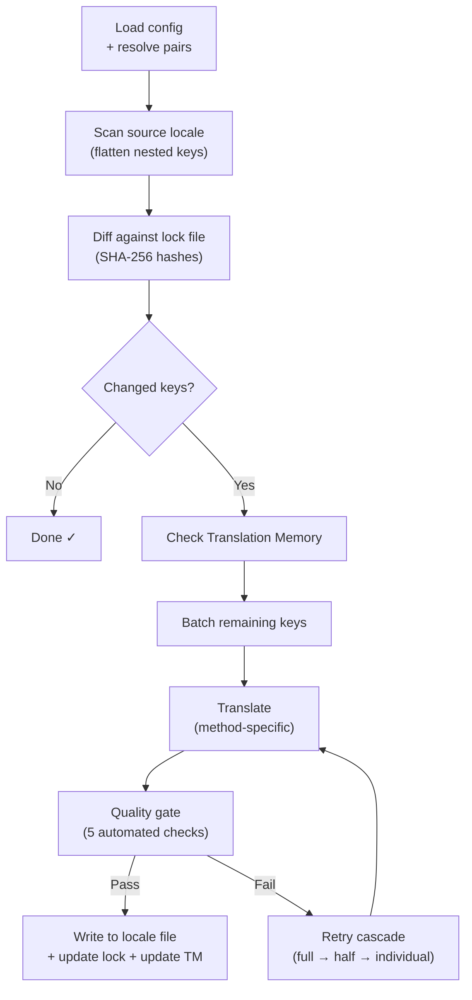

# Cómo funciona champollion

champollion traduce los archivos de configuración regional de su aplicación con un solo comando. Aquí está lo que sucede internamente.

## El Pipeline

Cuando ejecuta `npx champollion sync`, champollion ejecuta un pipeline de seis etapas:



**Decisiones de diseño clave:**

- **Detección de cambios mediante hashes SHA-256.** Champollion rastrea cada valor de origen con un hash en `.champollion.lock`. Cuando actualiza una cadena en inglés, solo esa clave se retraduce. Por eso `sync` es rápido en ejecuciones repetidas — realiza un trabajo mínimo.

- **Almacenamiento en caché de Memoria de Traducción.** Antes de hacer cualquier llamada a API, champollion verifica `.champollion/tm.json` para traducciones en caché (indexadas por texto de origen + configuración regional + método). En una resincronización típica después de cambiar una clave, 142 claves provienen del caché y 1 clave accede a la API.

- **Puerta de calidad antes de escribir.** Cada traducción pasa cinco verificaciones automatizadas (vacío, eco de origen, bucle de alucinación, inflación de longitud, cumplimiento de escritura) antes de tocar sus archivos. Los fallos se registran, nunca se aceptan silenciosamente.

- **Cascada de reintentos en caso de fallo.** Si un lote falla (error de análisis JSON, tiempo de espera de API), champollion reintenta con lotes progresivamente más pequeños: completo → mitad → individual. Esto aísla la clave problemática sin bloquear el resto.

## Métodos de Traducción

Champollion admite múltiples métodos de traducción, cada uno adecuado para diferentes escenarios. Los principales son:

| Método | Cómo funciona | Mejor para |
|--------|-------------|----------|
| **`llm`** | Indicación estructurada a cualquier modelo de OpenRouter | Idiomas bien dotados de recursos |
| **`llm-coached`** | Mismo indicación + reglas gramaticales, diccionario y notas de estilo | Idiomas donde los LLM cometen errores predecibles |
| **`google-translate`** | Solicitud de lote de API de Google Cloud Translation | Idiomas de alto recurso con buen soporte de GT |
| **`api`** | HTTP POST a su propio punto de conexión | Canalizaciones personalizadas, modelos controlados por la comunidad |

Los métodos se configuran por par de idiomas. Podría usar `google-translate` para francés pero `llm-coached` para Plains Cree — cada par obtiene el método que funciona mejor para él.

## Datos de Coaching

Para pares `llm-coached`, los datos de coaching proporcionan al LLM conocimiento lingüístico explícito: reglas gramaticales, terminología forzada y preferencias de estilo. Esto se inyecta en cada indicación como contexto estructurado.

```json title="coaching/crk.json"
{
  "grammar_rules": ["Animate nouns take different plural forms than inanimate nouns"],
  "dictionary": {"welcome": "ᑕᓂᓯ", "settings": "ᐃᑕᐢᑌᐘᐃᓇ"},
  "style_notes": "Use Standard Roman Orthography (SRO) unless explicitly configured otherwise."
}
```

Los datos de coaching son el mecanismo principal para mejorar la calidad de la traducción sin ajustar un modelo. Cambie las reglas → ejecute la sincronización nuevamente → vea si ayuda. La iteración es instantánea.

## Plugins

Los plugins son recetas de traducción preempaquetadas para pares de idiomas específicos. Son manifiestos JSON — no código — que le dicen a champollion qué método usar, con qué configuración y qué calidad se ha evaluado.

```bash
champollion plugin install ./crk-coached-v3/
champollion sync   # uses the installed plugin for en→crk
```

Los plugins cierran la brecha entre investigación y producción: un método que obtiene una buena puntuación en la [Red](/arena) puede empaquetarse como un plugin e implementarse aquí.

## La Imagen Más Grande

champollion es una mitad de un ecosistema de dos partes:

- **[la Red](/arena)** — donde los métodos de traducción se **desarrollan y prueban** con evaluación reproducible
- **champollion** — donde los métodos probados se **implementan** para traducir contenido real

El [Puente del Arnés de Evaluación](/docs/guides/bridge) conecta los dos. Un método que se prueba a sí mismo en la Red se implementa aquí. La retroalimentación de hablantes de la producción mejora la próxima versión.

---

## Profundice Más

- [Cómo Funciona la Sincronización](/docs/concepts/how-sync-works) — recorrido detallado paso a paso del pipeline
- [Puerta de Calidad](/docs/concepts/quality-gate) — las cinco verificaciones automatizadas
- [Memoria de Traducción](/docs/concepts/translation-memory) — almacenamiento en caché y ahorro de costos
- [Métodos de Traducción](/docs/guides/translation-methods) — comparación detallada de métodos
- [Arquitectura](/docs/concepts/architecture) — descripción general del diseño del sistema
