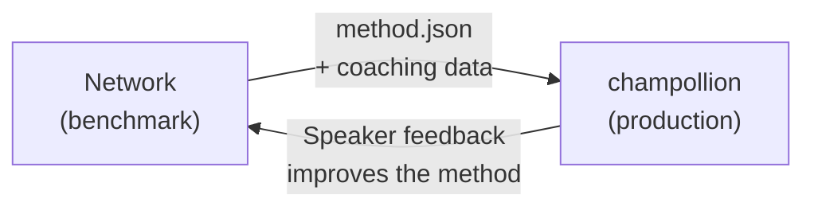

# Desplegar a Producción

Lo probó en la Red. Ahora despliéguelo.

La Red es para I+D — construir, comparar y evaluar métodos de traducción. **El despliegue a producción** ocurre a través de [champollion](https://champollion.dev), la CLI de traducción orientada a desarrolladores. Se conectan a través de un formato de complemento compartido.


```mermaid
graph LR
    A["Network\n(benchmark)"] -->|"method.json\n+ coaching data"| B["champollion\n(production)"]
    B -->|"Speaker feedback\nimproves the method"| A
```

---

## La Ruta de Despliegue

### 1. Exporte Su Método como un Complemento

Cree un manifiesto `method.json` que empaquete sus resultados de evaluación:

```json
{
  "name": "french-formal-v1",
  "type": "llm-coached",
  "version": "1.0.0",
  "description": "Formal-register French (example manifest; the benchmark values are illustrative)",
  "locales": ["fr"],
  "config": {
    "model": "google/gemini-2.5-flash",
    "temperature": 0.3
  },
  "benchmarks": {
    "fr": {
      "corpus_chrf": 72.3,
      "exact_match_rate": 0.42,
      "corpus_size": 500
    }
  }
}
```

Incluya cualquier dato de entrenamiento (reglas gramaticales, diccionarios) junto con el manifiesto.

### 2. Instale en Champollion

```bash
champollion plugin install ./french-formal-v1/
```

### 3. Configure Su Par

```json title="champollion.config.json"
{
  "pairs": {
    "en:fr": { "methodPlugin": "french-formal-v1" }
  }
}
```

### 4. Traduzca Contenido Real

```bash
npx champollion sync
```

Su método evaluado ahora está produciendo traducciones reales en producción.

---

## Para Lenguas Indígenas

Los métodos al servicio de comunidades de lenguas indígenas requieren el **consentimiento de la comunidad** antes de su despliegue a producción. Los principios de soberanía de datos indígenas —propiedad y control comunitarios de los datos lingüísticos— rigen cómo se desarrollan, evalúan y despliegan los métodos de traducción.

Ningún puntaje hace que un método sea desplegable —ni un chrF++ alto, ni el umbral de un premio—. Se despliega **si y cuando** el órgano de gobernanza de la comunidad lingüística otorgue su consentimiento, después de que los hablantes de la lengua hayan evaluado sus resultados.

Consulte [Soberanía de Datos](/docs/network/sovereignty/data-sovereignty) y [Transferencia de Propiedad](/docs/network/sovereignty/ownership-transfer) para el marco de gobernanza completo.

---

## Consulte también

- [El Puente del Arnés de Evaluación](https://champollion.dev/docs/guides/bridge) — recorrido detallado de la canalización Red→champollion
- [Especificación de Complementos](https://champollion.dev/docs/reference/plugin-spec) — el formato del manifiesto method.json
- [Guía del Agente champollion](https://champollion.dev/docs/guides/agent-guide) — cómo usar champollion para traducción
