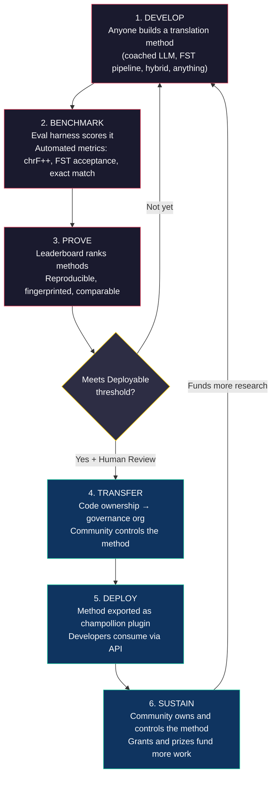
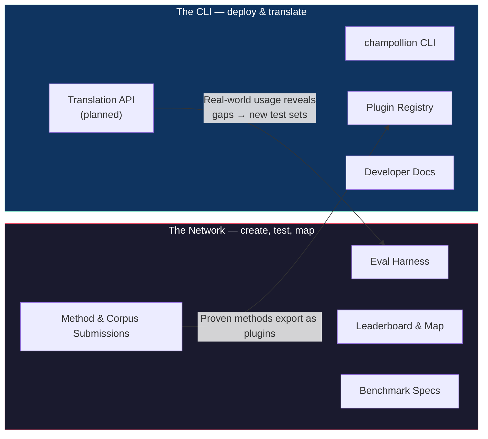
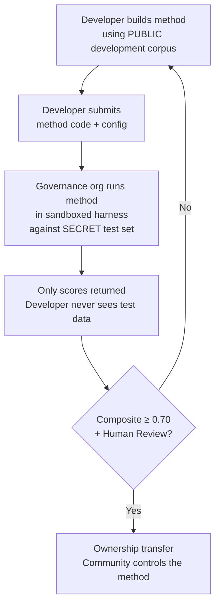

# Cómo funciona la red: Construir, probar, desarrollar, desplegar

> **Resumen ejecutivo.** La traducción automática para los idiomas desatendidos del mundo no es un problema de entrenamiento de modelos: es un problema de *infraestructura*. Ningún modelo, laboratorio o empresa por sí solo lo resolverá. Este documento describe una arquitectura de plataforma que convierte a la comunidad global de ingenieros de aprendizaje automático (ML), lingüistas y hablantes de idiomas en un laboratorio de investigación distribuido: cualquier persona construye un método de traducción, la red prueba si funciona (incluso frente a datos de evaluación en poder de la comunidad que la plataforma nunca ve) y los métodos que funcionan se convierten en activos propiedad de las comunidades a cuyos idiomas sirven. El mecanismo es el desarrollo de métodos abierto y colaborativo combinado con términos flexibles establecidos por los administradores (stewards): una combinación que aún es rara en la práctica y la que creemos que este problema exige.

---

> [!IMPORTANT]
> **Alcance.** Esta plataforma evalúa la **traducción de textos escritos formales**: documentos, materiales educativos, comunicaciones oficiales, cadenas de interfaz de usuario (UI). No es un chatbot, un intérprete en tiempo real ni un sistema conversacional de dominio sin restricciones. La tabla de clasificación clasifica los métodos de traducción frente a corpus paralelos seleccionados en dominios de texto específicos (consulte la [Especificación de Benchmark §2.7](/docs/network/specifications/benchmark#27-domain) para la taxonomía de dominios). La traducción automática (MT) es infraestructura para la revitalización del idioma, no un sustituto de la misma. Los niños aprenden el idioma de las personas, no de las máquinas.

### Cobertura actual de dominios

La tabla está **activa y poblándose**: las ejecuciones se publican en ella continuamente y cualquiera puede agregar más. La siguiente tabla muestra qué corpus de referencia públicos son *compatibles* por dominio; la [tabla de clasificación](/leaderboard) tiene las clasificaciones en vivo.
Los corpus se obtienen de la fuente en tiempo de ejecución, nunca se alojan aquí.

| Dominio | Corpus de referencia | Estado | Notas |
|--------|------------------|--------|-------|
| Noticias / periodismo | Global Voices (OPUS) | Compatible: abierto para envíos | 493 pares de idiomas, CC BY 3.0 |
| Cotidiano / mixto (escrito) | Tatoeba | Compatible: abierto para envíos | 874 pares de idiomas, CC BY 2.0 |
| Educativo / libros de texto | EdTeKLA (Cree de las llanuras) | Solo investigación: **no clasificado**; evaluación remota de API de modelo sujeta a consentimiento | CC BY-NC-SA modificada de EdTeKLA (con alcance de soberanía, no comercial); excluido de la tabla de clasificación, premios y vías comerciales/API |
| Narrativo / literario | — | Planificado | Aún no hay un corpus ejecutable conectado |
| Religioso / escritural | FLORES+ (dominio de la Biblia) | Conectado, solo relativo | Corpus ejecutable; ALTA contaminación, por lo que es solo relativo: nunca se usa para la puntuación oficial |
| Hablado / tiempo real | — | Fuera de alcance | Este sistema evalúa texto escrito, no voz |
| Técnico / científico | — | Futuro | Requiere validación de terminología específica del dominio |

## Para qué sirve la red

Antes de la mecánica, la misión. La Red Champollion se basa en cuatro compromisos:

1. **Crear y confiar en conjuntos de prueba de traducción.** Para la mayoría de los idiomas, lo escaso y valioso no es otro modelo, es un conjunto de prueba *confiable*: creado por humanos, honesto con el dominio y con versión fijada. La Red existe para crear esos conjuntos de prueba y hacerlos confiables.
2. **Hacer que el campo sea navegable.** Quién puede traducir qué, qué tan bueno es cada método en cada tipo de texto y dónde están las brechas: expuesto como un mapa público, no enterrado en artículos y archivos PDF dispersos.
3. **Todo método es bienvenido: humano y automático.** Somos pragmáticos con un sesgo hacia las soluciones. Un traductor profesional, un sistema basado en reglas, un LLM guiado, un modelo con ajuste fino (fine-tuned): todos son de primera clase. Nos importa lograr que los idiomas se traduzcan, no qué herramienta gana.
4. **Construido *con* las comunidades, nunca extraído (scraped), y la soberanía no es negociable.** Los datos lingüísticos son biodatos; las personas que proporcionan un corpus tienen las llaves del mismo y de cualquier cosa que se mida frente a él.

Todo lo que sigue (el ciclo, el entorno de evaluación, la tabla de clasificación, el puente de despliegue) está al servicio de esos cuatro compromisos.

---

## 1. El problema: Traducción automática ≠ Aprendizaje automático

La traducción automática para idiomas de bajos recursos (LRL, por sus siglas en inglés) se enmarca comúnmente como un problema de aprendizaje automático: recopilar datos, entrenar un modelo, desplegar. Este enfoque es incorrecto y el error tiene consecuencias: dirige la financiación, el talento y la infraestructura hacia un enfoque que estructuralmente no puede funcionar para la mayoría de los idiomas del mundo.

### 1.1 Por qué falla el enfoque de ML

El flujo de trabajo estándar de ML para traducción automática (MT) requiere tres cosas: grandes corpus paralelos, benchmarks de evaluación validados y una vía de despliegue. Para los 194 idiomas en la lista de Cloud Translation de Google y los 200 cubiertos por NLLB-200, existen los tres. Para los ~1,200 idiomas en la larga cola de OMT-1600 (nuestra aritmética: los 1,600 que cubre menos los más de 400 que sus autores informan que los modelos "entienden lo suficientemente bien"), existen datos de evaluación, pero la calidad está en su mayoría por debajo de los umbrales utilizables, los pesos del modelo no están disponibles públicamente y no hay un flujo de despliegue. Para los más de ~5,400 restantes, no existe ninguno en absoluto.

| Requisito | Idiomas de altos recursos | Larga cola de OMT-1600 (~1,200 LRL) | ~5,400 idiomas restantes |
|-------------|------------------------|-------------------------------|---------------------------|
| **Corpus paralelos** | Millones de pares de oraciones (Europarl, UN Corpus, OpenSubtitles) | Bitexto del dominio de la Biblia, extracciones web (scrapes), retrotraducción sintética. Sin datos seleccionados por la comunidad. | Cientos a unos pocos miles, si los hay |
| **Benchmarks de evaluación** | WMT, FLORES, NTREX: estandarizados, reproducibles | BOUQuET (dominio de la Biblia), met-BOUQuET. Sin validación morfológica. Sin evaluación independiente. | Sin benchmarks estándar; evaluación ad hoc |
| **Vía de despliegue** | Google Translate, DeepL, Azure: API comerciales | Pesos del modelo no publicados. Sin CLI, sin sistema de plugins, sin API desplegable por la comunidad. | Nada. Sin API, sin producto, sin mercado. |

El enfoque de ML funciona cuando existen los datos para entrenar y el mercado para desplegar. OMT-1600 ha expandido la primera condición significativamente, pero la expansión sin verificación de calidad independiente, validación morfológica o gobernanza comunitaria es expansión sin confianza. El problema no es solo "necesitamos un modelo mejor", es "necesitamos infraestructura que demuestre que el modelo funciona, en términos que la comunidad controle".

### 1.2 Lo que realmente requiere la MT para los LRL

La traducción para idiomas desatendidos no es principalmente un problema de entrenamiento. Es un problema de **ingeniería de métodos**: el desafío de ensamblar los recursos disponibles (LLM, herramientas morfológicas, conocimiento de la comunidad, reglas lingüísticas) en flujos de traducción funcionales, y luego demostrar que funcionan con una evaluación rigurosa.

La distinción importa:

| Dimensión | Enfoque de ML | Enfoque de ingeniería de métodos |
|-----------|------------|---------------------------|
| **Actividad principal** | Entrenar un modelo con datos | Combinar herramientas, prompts y conocimiento lingüístico en un flujo de trabajo (pipeline) |
| **Cuello de botella** | Volumen de datos paralelos | Creatividad de ingeniería + infraestructura de evaluación |
| **Quién puede contribuir** | Equipos con clústeres de GPU y conjuntos de datos | Cualquiera con una clave de API, un diccionario y una idea |
| **Evaluación** | BLEU/chrF en conjuntos de prueba reservados (held-out) | Validación morfológica + revisión humana + métricas automatizadas |
| **Despliegue** | Servir el modelo | Empaquetar el método como un plugin |

Los LLM modernos ya contienen conocimiento latente de muchos idiomas de bajos recursos, lo suficiente como para producir resultados que *parecen* plausibles. El problema es que este resultado a menudo es morfológicamente inválido (el modelo alucina formas de palabras que no existen en el idioma). El desafío de ingeniería es: ¿cómo se extrae lo que sabe el LLM, se valida frente a la realidad lingüística y se empaqueta el resultado para su uso en producción?

Es por eso que evaluamos **métodos**, no modelos. Un método es la receta completa: selección de modelo + ingeniería de prompts + uso de herramientas + pre/post-procesamiento + datos de guía (coaching) + estrategias de reintento. Dos equipos que usen el mismo modelo con diferentes métodos obtendrán puntuaciones diferentes. Ese es el punto.

### 1.3 Por qué las lenguas polisintéticas rompen todo

Muchos de los idiomas más desatendidos del mundo son **polisintéticos**: codifican oraciones enteras en palabras individuales a través de procesos morfológicos productivos. Considere la palabra en Cree de las llanuras:

> **ê-kî-nitawi-kîskinwahamâkosiyân**
> *"cuando había ido a la escuela"*

Una palabra. Codifica el tiempo (pasado), la dirección (ir a), la raíz (aprender), la voz (pasiva/reflexiva) y la persona (primera del singular). El inglés necesita seis palabras para lo que el Cree expresa en una.

Esto rompe la MT estándar en todos los niveles:

- **Tokenización**: BPE y SentencePiece desmenuzan las palabras polisintéticas en fragmentos sin sentido, porque fueron diseñados para la morfología concatenativa.
- **Alucinación**: Los LLM producen cadenas de aspecto plausible que no son palabras válidas. Un no hablante no puede notar la diferencia. Sin validación morfológica, las alucinaciones son invisibles.
- **Evaluación**: Las métricas a nivel de palabra (BLEU) penalizan la variación flexiva natural que es fundamental para el funcionamiento de estos idiomas. Las métricas a nivel de carácter (chrF++) son mejores, pero aún insuficientes sin validación estructural.

La solución no es un modelo más grande o más datos de entrenamiento. Es **infraestructura que detecte las alucinaciones antes de que lleguen a los usuarios**: analizadores morfológicos (FST) que puedan decir definitivamente "esta no es una palabra en este idioma".

---

## 2. Por qué los enfoques existentes no funcionan

### 2.1 MT comercial

Los servicios de traducción comercial históricamente se han optimizado para el volumen del mercado. OMT-1600 de Meta (marzo de 2026) representa un cambio significativo: 1,600 idiomas en un solo sistema. Pero para los ~1,200 en su larga cola (nuestra aritmética: 1,600 menos los más de 400 que sus autores informan que los modelos "entienden lo suficientemente bien"), la calidad está por debajo de los umbrales utilizables, los pesos del modelo no están disponibles y no hay un flujo de despliegue. El problema de incentivos estructurales ha evolucionado: las grandes empresas tecnológicas (Big Tech) ahora pueden construir modelos para LRL, pero sin evaluación independiente, validación morfológica o gobernanza comunitaria, la cobertura por sí sola no resuelve el problema.

### 2.2 Investigación académica

La investigación académica en MT se centra abrumadoramente en pares de idiomas de altos recursos porque ahí es donde están los datos de entrenamiento, las tareas compartidas y los lugares de publicación. Los investigadores que trabajan en pares de bajos recursos luchan por publicar, luchan por financiar la computación y luchan por desplegar, porque la infraestructura de despliegue para los LRL no existe.

### 2.3 Competiciones únicas

Usted podría organizar una competición en Kaggle: "Inglés→Cree de las llanuras, el mejor chrF++ gana $10,000". Esto es lo que sucede:

1. Alguien gana, envía un notebook, cobra el premio, se va a casa.
2. El notebook se pudre en el archivo de Kaggle. Nadie lo despliega. Nadie lo mantiene.
3. El conjunto de prueba finalmente se publica: contaminado para siempre.
4. La organización de gobernanza subió sus datos lingüísticos a la infraestructura de Google bajo los términos de servicio de Google, sin un control real sobre el ciclo de vida.
5. Sin puente de despliegue. Un notebook ganador no es una API funcional.

Una recompensa única atrae a cazarrecompensas. Una tabla de clasificación continua con gobernanza comunitaria crea un compromiso sostenido.

### 2.4 Ajuste fino (Fine-Tuning)

El ajuste fino de un modelo abierto en texto paralelo es el enfoque obvio de ML. Pero para la mayoría de los LRL, el corpus paralelo necesario para el ajuste fino es exactamente el dato que no existe, y crearlo requiere los mismos hablantes bilingües y el compromiso de la comunidad que el ajuste fino pretende reemplazar. No se puede salir de un problema de escasez de datos utilizando una técnica que requiere datos.

---

## 3. La solución: Desarrollo colaborativo de métodos con evaluación soberana

La plataforma invierte el enfoque tradicional: en lugar de que un equipo construya un modelo, **la comunidad global construye y prueba métodos de traducción en conjunto**, la red verifica qué funciona y los métodos que funcionan se despliegan en producción, conservando la comunidad lingüística la propiedad y el control.

### 3.1 El ciclo completo

Cada etapa tiene una función específica:

| Etapa | Qué sucede | Quién se beneficia |
|-------|-------------|--------------|
| **Desarrollar** | Un investigador, estudiante o aficionado construye un método de traducción utilizando las herramientas que desee: prompts de LLM, flujos de FST, diccionarios, modelos con ajuste fino, sistemas basados en reglas o híbridos | El colaborador aprende, experimenta, publica |
| **Evaluar (Benchmark)** | El entorno de evaluación califica el método frente a un corpus estandarizado con métricas reproducibles. Cada ejecución produce una [tarjeta de ejecución](/docs/network/specifications/benchmark#3-run-card-schema): un registro completo de lo que se probó y cómo funcionó | Los investigadores obtienen resultados reproducibles y comparables |
| **Demostrar** | Los resultados aparecen en la tabla de clasificación pública. Los métodos se clasifican, comparan y examinan. La comunidad ve qué funciona y qué no | Todos ganan visibilidad sobre el estado del arte |
| **Transferir** | Para los idiomas indígenas, los métodos que alcanzan el umbral de Desplegable (compuesto ≥ 0.70) Y pasan la validación humana transfieren la propiedad de su código a la organización de gobernanza de la comunidad lingüística | La comunidad es dueña absoluta del método: código, pesos y decisiones de despliegue |
| **Desplegar** | El método se exporta como un plugin de [champollion](https://github.com/gamedaysuits/Champollion) que la comunidad puede ejecutar en su propia infraestructura. Los desarrolladores consumen traducciones sin necesidad de entender el método subyacente | Los desarrolladores obtienen traducción para idiomas que las API comerciales no atienden |
| **Sostener** | La financiación de subvenciones y los premios patrocinados (que el proyecto busca activamente; hoy se autofinancia) pagan por más corpus, validación de hablantes e investigación. Champollion no es comercial y no toma ninguna parte de lo que una comunidad gane de un activo que posee | El trabajo remunerado en corpus y los métodos propiedad de la comunidad sobreviven a cualquier subvención individual |

### 3.2 Por qué funciona la colaboración abierta

La participación abierta no es incidental: es el mecanismo. He aquí por qué:

**Diversidad de enfoques.** El mejor método para Inglés→Cree de las llanuras podría ser un LLM guiado y controlado por FST. El mejor para Inglés→Quechua podría ser un flujo de trabajo aumentado por diccionario. El mejor para Inglés→Inuktitut podría ser un modelo con ajuste fino iniciado a partir del corpus de Nunavut Hansard. Ningún equipo o enfoque dominará en todos los idiomas. La tabla de clasificación revela qué *tipos* de enfoques funcionan para qué *tipos* de idiomas: un metarresultado que en sí mismo es una contribución a la investigación.

**Compromiso sostenido.** Una tabla de clasificación nunca está terminada. Siempre hay un método mejor por construir. Cada envío dona computación y esfuerzo intelectual al problema. A diferencia de una subvención única, el proceso abierto y continuo genera una inversión en investigación sostenida por parte de la comunidad global.

**Baja barrera de entrada.** Usted necesita una clave de API, un diccionario y una idea. El entorno de evaluación es de código abierto. El formato del corpus es un simple JSON. Un estudiante de lingüística puede igualar a un laboratorio con buenos recursos, y a veces hacerlo mejor, porque el conocimiento del dominio (entender el idioma) puede superar a los recursos informáticos.

**Puente de despliegue.** El mismo método que obtiene una buena puntuación en el entorno de evaluación se despliega en producción con un cambio de configuración. "Pruébelo aquí, despliéguelo allá". Esta es la brecha que Kaggle, las tareas compartidas de WMT y las publicaciones académicas no logran cerrar.

### 3.3 La arquitectura de la plataforma

champollion.dev es **un centro con dos caras**. El mismo sitio aloja la Red (donde se crean conjuntos de prueba, se evalúan métodos y se mapean resultados) y la CLI, donde los métodos probados se despliegan en proyectos reales. Comparten un dominio, un conjunto de documentos y una capa de datos; las etiquetas a continuación describen dos *roles*, no dos sitios.

**La [Red](/docs/network/)** es el campo de pruebas. Su audiencia son traductores, lingüistas, comunidades e investigadores. Todo aquí se trata de crear conjuntos de prueba, evaluar métodos frente a ellos (humanos o automáticos) y mapear dónde están las brechas.

**La [CLI](https://champollion.dev)** es el lado del despliegue. Su audiencia son desarrolladores que necesitan traducción para sus aplicaciones. No necesitan entender cómo funciona un método: simplemente lo llaman.

El puente entre las dos caras es el **método**: creado y confiable en la Red, empaquetado para su despliegue a través de la CLI y, para los idiomas de la comunidad, propiedad de la comunidad.

---

## 4. Evaluación soberana: Por qué importa la infraestructura

La infraestructura de evaluación no es un detalle técnico: es el núcleo del modelo de soberanía. La evaluación estándar (subir su conjunto de prueba a una plataforma compartida) no funciona para los idiomas indígenas porque cede el control sobre los datos lingüísticos.

### 4.1 El mecanismo de soberanía

El desarrollador nunca ve los datos de evaluación del estándar de oro (gold-standard). Desarrollan frente a un corpus de desarrollo público, luego envían el código de su método a la organización de gobernanza, que lo ejecuta en un entorno aislado (sandbox) frente al conjunto de prueba secreto. Solo se devuelven las puntuaciones. Esto no es solo seguridad: está construido hacia los principios indígenas de soberanía de datos que exigen la propiedad y el control comunitarios de los datos lingüísticos. Si los cumple o no, no es decisión nuestra: la determinación pertenece a las comunidades involucradas.

### 4.2 Por qué esto no puede ejecutarse en la plataforma de otra persona

En Kaggle, la organización de gobernanza sube sus datos lingüísticos a la infraestructura de Google bajo los términos de servicio de Google. No pueden revocar el acceso en su propio cronograma. No pueden adjuntar términos legales personalizados (como la transferencia de propiedad) a los envíos. No tienen garantía criptográfica de que los datos no se utilizarán para otros fines. La soberanía de los datos significa que la comunidad controla el endpoint de evaluación, posee las llaves y puede apagarlo.

---

## 5. Filosofía de evaluación: Microevaluación y LYSS

Las métricas estándar de MT (BLEU, chrF++, COMET) están diseñadas para generalizar en todos los idiomas. Esa generalidad es su fortaleza y su punto ciego. Para las lenguas polisintéticas, una palabra morfológicamente inválida que comparte n-gramas de caracteres con la referencia obtiene una buena puntuación en chrF++, pero cualquier hablante la reconocería como un galimatías.

El **desarrollo de microevaluaciones** significa construir métricas de evaluación adaptadas a idiomas específicos utilizando las mejores herramientas lingüísticas disponibles. El framework se llama **LYSS** (Linguistically-informed Yield & Structural Scoring):

| Componente | Qué mide | Herramienta | Estado |
|-----------|-----------------|------|--------|
| **LYSS-fst** | Validez morfológica | Transductor de estados finitos | ✅ Implementado (Cree de las llanuras) |
| **LYSS-eq** | Equivalencia lingüística | Reglas de variantes seleccionadas por lingüistas | ✅ Implementado (Cree de las llanuras) |
| **LYSS-sem** | Preservación semántica | Modelos semánticos específicos del idioma | ✅ Implementado (Cree de las llanuras) |

Las métricas universales (chrF++, BLEU) sirven como líneas base y como señales principales para idiomas sin herramientas LYSS. Dondequiera que existan herramientas específicas del idioma, los componentes LYSS llevan el peso de la puntuación, porque las cosas que más importan para cada idioma son las cosas que solo las herramientas específicas del idioma pueden medir.

Para conocer la especificación completa de LYSS y la lógica de puntuación compuesta, consulte [SCORING_SPEC.md §4](/docs/network/specifications/scoring#4-composite-score).

> [!WARNING]
> **Comparabilidad entre ejecuciones.** Al comparar ejecuciones con diferente disponibilidad de métricas (por ejemplo, una ejecución tiene puntuaciones FST y otra no), las puntuaciones compuestas no son directamente comparables. El compuesto se normaliza a las métricas disponibles, pero una ejecución evaluada en 5 métricas contiene más información que una evaluada en 2. La tabla de clasificación indica la cobertura de métricas para cada entrada.

---

## 6. A quién sirve esto

### Para ingenieros e investigadores de ML

Una tabla de clasificación abierta con benchmarks estandarizados para pares de idiomas que ninguna tarea compartida cubre. Reproduzca cualquier resultado con el entorno de evaluación. Publique su método. Supere la puntuación más alta. Cada envío tiene una huella digital (fingerprint) vinculada a una configuración específica y a una versión del conjunto de datos: no hay ambigüedad sobre lo que se probó.

### Para comunidades lingüísticas

Propiedad y control sobre la tecnología de traducción construida para su idioma. La dinámica competitiva significa que varios equipos están trabajando en su idioma simultáneamente: usted se beneficia de todos ellos y es dueño del resultado. El beneficio fluye a través de la propiedad, la atribución, la capacidad y los términos de datos que gobierna la comunidad, nunca a través de un reparto de ingresos: Champollion no es comercial y no se lleva ninguna parte de lo que una comunidad gane de un activo que posee.

### Para financiadores y revisores de subvenciones

Métricas transparentes y reproducibles para evaluar propuestas de investigación en traducción. Resultados medibles más allá de las publicaciones: métricas de calidad a lo largo del tiempo, cobertura de idiomas, corpus construidos y registrados bajo el control de administradores, horas de hablantes remuneradas entregadas a las comunidades. Un método exitoso se convierte en un activo propiedad de la comunidad que se ejecuta en una infraestructura de evaluación abierta: el impacto de la subvención se multiplica a través de métodos reutilizables y benchmarks públicos en lugar de terminar cuando lo hace la financiación.

### Para desarrolladores

Traducción para idiomas que ninguna API comercial atiende. Un comando de la CLI (`npx champollion sync`) traduce sus archivos de configuración regional (locale) utilizando métodos probados por la comunidad. Use Google Translate para francés, un LLM guiado para Cree de las llanuras y una API comunitaria para Quechua: todo en el mismo proyecto, todo con la misma interfaz.

### Para estudiantes

Un desafío abierto con impacto en el mundo real. Construya un método de traducción para un idioma desatendido, evalúelo (benchmark) y publique sus resultados. La infraestructura es gratuita, los conjuntos de datos son abiertos y a la tabla de clasificación no le importa si usted está en una de las 10 mejores universidades o trabajando desde la terminal de una biblioteca.

---

## 7. Contexto social y técnico

### 7.1 La revitalización del idioma se está acelerando

Los esfuerzos de revitalización del idioma están creciendo en todo el mundo. Las escuelas de inmersión, los nidos de idiomas comunitarios y los proyectos de archivo digital se están expandiendo en las comunidades indígenas de Canadá, Estados Unidos, Australia, Nueva Zelanda y el norte de Europa. Estos esfuerzos necesitan tecnología, específicamente, tecnología de traducción que respete la soberanía de la comunidad sobre los datos lingüísticos.

### 7.2 Los LLM cambiaron la línea base

Antes de 2023, construir cualquier capacidad de MT para una lengua polisintética requería una gran experiencia en PNL (procesamiento de lenguaje natural), entrenamiento de modelos personalizados y grandes presupuestos de computación. Los LLM modernos han cambiado la línea base: un prompt bien elaborado con datos de guía y validación morfológica puede producir traducciones utilizables para algunos pares de idiomas, sin necesidad de entrenamiento. Esto reduce drásticamente la barrera de entrada para el desarrollo de métodos. El problema ha pasado de "¿cómo construimos un modelo?" a "¿cómo construimos un flujo de trabajo que valide y corrija lo que produce el modelo?"

### 7.3 Medición abierta y reproducible

La evaluación pública y compartida ha remodelado la forma en que el campo aprende qué funciona. Chatbot Arena, LMSYS y la Open LLM Leaderboard de Hugging Face demostraron que la medición abierta y reproducible (cualquiera puede ejecutarla, cualquiera puede verificarla) saca a la luz el progreso real más rápido que las afirmaciones cerradas y autoinformadas. Tomamos esa lección, no la cultura de los torneos, y la apuntamos a la traducción para los miles de idiomas donde la MT comercial no existe o no ha sido verificada de forma independiente. El objetivo es un mapa compartido y verificable de qué funciona para qué idiomas y qué tipos de texto, no un ranking de quién venció a quién.

### 7.4 La soberanía de los datos indígenas no es negociable

Los principios indígenas de soberanía de datos — la propiedad y el control comunitarios de los datos lingüísticos, los principios CARE (Beneficio Colectivo, Autoridad para Controlar, Responsabilidad, Ética) y marcos como Te Mana Raraunga (Soberanía de Datos Maoríes) — no son complementos opcionales: son requisitos estructurales para cualquier tecnología que toque recursos lingüísticos indígenas. Nuestra infraestructura de evaluación está construida para alinearse con estos principios a nivel arquitectónico, no solo en declaraciones de políticas, y si los cumple es una determinación que pertenece a las comunidades, no a nosotros.

---

## 8. Tensiones y limitaciones {#8-tensions-and-limitations}

Este proyecto utiliza un mecanismo occidental (el benchmarking competitivo) para servir a sistemas de conocimiento que a menudo son comunitarios, relacionales y guiados por ancianos (Elders). Esa tensión es real y debe ser nombrada, no resuelta mediante afirmaciones.

**Benchmarking vs. conocimiento comunitario.** Las tablas de clasificación clasifican a los individuos y optimizan las puntuaciones numéricas. Las tradiciones de conocimiento indígena enfatizan la autoridad relacional, la corrección comunitaria y la legitimidad basada en las relaciones. No podemos afirmar que servimos a estos sistemas de conocimiento mientras construimos una plataforma cuyo mecanismo central es la optimización competitiva individual. La arquitectura de soberanía (§4) (donde las comunidades poseen métodos, controlan la evaluación y deciden qué se despliega) es nuestra respuesta estructural, pero no disuelve la tensión. Una tabla de clasificación sigue siendo una tabla de clasificación.

**Qué estamos haciendo al respecto.** La plataforma admite envíos de equipos y comunidades junto con los individuales. La tabla de clasificación enmarca los resultados como el "estado del arte actual" en lugar de "quién está ganando". La organización de gobernanza (no la puntuación de la tabla de clasificación) determina qué se despliega. Ninguna puntuación automatizada da derecho a un desarrollador a nada; la comunidad decide. Y mantenemos un ciclo continuo de retroalimentación consultiva con las comunidades asociadas sobre si el enfoque y la estructura de incentivos de la plataforma les sirven. Si no es así, lo cambiamos.

**La MT no es revitalización.** La traducción convierte texto entre idiomas. La revitalización crea nuevos hablantes. Un sistema de MT perfecto no resuelve el problema de la transmisión, el problema del prestigio o el problema pedagógico. Incluso podría crear la ilusión de que "la computadora puede hablar el idioma", socavando la urgencia de la transmisión humana. Construimos la MT como infraestructura (borradores de traducción para posedición, herramientas morfológicas para aplicaciones de aprendizaje de idiomas, influencia política para las comunidades que exigen servicios en su idioma), no como un reemplazo de la transmisión intergeneracional. La comunidad controla si la tecnología se despliega, cuándo y cómo.

Esta sección existe porque estas tensiones se identificaron en una crítica invitada (mayo de 2026) y nos comprometimos a nombrarlas públicamente en lugar de enterrarlas en documentos internos.

> [!NOTE]
> **Las puntuaciones de la tabla de clasificación son indicadores automatizados.** Todas las puntuaciones que se muestran en la tabla de clasificación son mediciones automatizadas calculadas por el entorno de evaluación bajo condiciones controladas. Indican el rendimiento relativo del método, pero no constituyen garantías de calidad. Los métodos validados por la comunidad se marcan por separado. Ninguna puntuación automatizada da derecho a un desarrollador al despliegue: la organización de gobernanza toma esa decisión.

---

## 9. Estado actual

### Lo que existe hoy

- **champollion**: la herramienta CLI. Múltiples métodos de traducción, configuración por par, puertas de calidad (quality gates) y soporte para los formatos de archivo de configuración regional (locale) comunes.
- **Entorno de evaluación de MT**: Framework de evaluación funcional. Métricas de chrF++, aceptación de FST y coincidencia exacta implementadas. Esquema de tarjeta de ejecución finalizado. Huellas digitales (fingerprinting) y verificación de integridad en funcionamiento.
- **EDTeKLA Dev v1**: Corpus de evaluación en Cree de las llanuras (CC BY-NC-SA modificada de EdTeKLA: con alcance de soberanía, no comercial), proveniente del grupo de investigación EdTeKLA de la Universidad de Alberta. Excluido de la tabla de clasificación, premios y la vía comercial/API (licencia no comercial); los recuentos de entradas se indican una vez en la [página de Conjuntos de datos de evaluación](/docs/network/leaderboard/datasets#edtekla-development-set-v1).
- **FLORES+ Devtest**: 1,012 oraciones × 870 pares de idiomas catalogados (CC BY-SA 4.0).
- **Sitio web de la Red**: Sitio de documentación basado en Docusaurus con tabla de clasificación, especificaciones, tutoriales y marco de soberanía.
- **Especificación de Benchmark**: [Especificación canónica](/docs/network/specifications/benchmark) que define el esquema del corpus, el formato de la tarjeta de ejecución y el protocolo de evaluación. Para definiciones de métricas, pesos compuestos y niveles de calidad, consulte [SCORING_SPEC.md](/docs/network/specifications/scoring).

### Qué sigue

| Fase | Qué | Estado |
|-------|------|--------|
| Barrido de línea base | 12 modelos × 3 temperaturas × 2 configuraciones de guía en EDTeKLA | ⏸ Sujeto a consentimiento: espera el permiso registrado del titular de los derechos para la evaluación remota de la API del modelo |
| Puntuación compuesta | Implementación de métricas ponderadas en el entorno de evaluación | ✅ Hecho |
| Puntuación semántica | Puntuación ponderada por veredicto de CrkSemanticMetric (estándar de evaluación) | ✅ Hecho |
| Precisión morfológica | Puntuación por morfema frente al análisis del estándar de oro | 🔲 Planificado |
| Coincidencia equivalente | Coincidencia de clase de variante a través de CrkLinterMetric (estándar de evaluación) | ✅ Hecho |
| API de Champollion | API para métodos propiedad de la comunidad | 🔲 Planificado |
| Segundo idioma | Expandir a un segundo par de idiomas (Inuktitut, Quechua o Sami) | 🔲 Planificado |

---

## 10. Primeros pasos

**Construya un método:** Clone el [entorno de evaluación](https://github.com/gamedaysuits/Champollion), ejecute un experimento de línea base y vea dónde aterriza en la tabla de clasificación.

**Contribuya con un corpus:** Si usted habla un idioma desatendido, incluso 50 pares de traducción seleccionados son suficientes para abrir una nueva pista en la tabla de clasificación. Consulte [Para comunidades lingüísticas](/docs/network/community/for-language-communities).

**Despliegue traducciones:** Instale [champollion](https://github.com/gamedaysuits/Champollion) y traduzca su aplicación con `npx champollion sync`.

**Financie el esfuerzo:** Consulte [El modelo económico](/docs/network/sovereignty/economic-model) para conocer los marcos de costos y las proyecciones de sostenibilidad.

---

## Consulte también

- **[Especificación de Benchmark](/docs/network/specifications/benchmark)**: formato del corpus, esquema de la tarjeta de ejecución, protocolo de evaluación, soberanía
- **[Especificación de puntuación](/docs/network/specifications/scoring)**: métricas, pesos compuestos, niveles de calidad, fórmulas de costo/velocidad
- **[la Red](/arena)**: el campo de pruebas de I+D
- **[champollion](https://github.com/gamedaysuits/Champollion)**: la plataforma de despliegue
- **[Apoyar un idioma de bajos recursos](/docs/network/community/low-resource-languages)**: inmersión profunda en los desafíos y enfoques de la MT polisintética

---

*Este documento es el punto de entrada para cualquiera que se encuentre con el proyecto por primera vez. Para conocer la especificación técnica completa, consulte [BENCHMARK_SPEC.md](/docs/network/specifications/benchmark) (protocolo) y [SCORING_SPEC.md](/docs/network/specifications/scoring) (métricas).*

