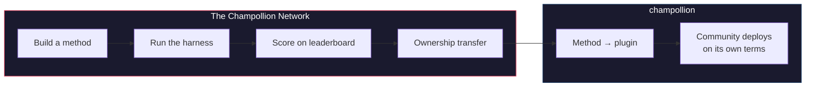

# La Red Champollion

> **Resumen ejecutivo.** La Red Champollion es una infraestructura abierta para *crear y confiar* en conjuntos de pruebas de traducción para la mayor cantidad posible de pares de idiomas —construida *con* profesionales y comunidades, nunca extraída de ellos sin permiso— y para hacer que todo el campo sea navegable: quién puede traducir qué, qué tan bueno es cada método en cada tipo de texto y dónde están las brechas. Todos los métodos son bienvenidos, humanos y automáticos. Usted también puede crear y enviar un método y ver cómo se califica frente a corpus reales. Para los idiomas cuyos datos son proporcionados por las comunidades, la soberanía no es negociable: las personas que proporcionan un corpus tienen las llaves del mismo y de cualquier cosa que se mida frente a él.

Esta sección es el inicio del mapa. Las páginas que se encuentran debajo explican cómo se construye la red de pares medidos ([Cómo funciona la red](/docs/network/how-it-works)), por qué la cola de trabajo pública clasifica lo que clasifica ([Por qué la cola](/docs/network/perspectives/why-the-queue) y la [Especificación de construcción de la cola](/docs/network/specifications/queue-construction)), y cómo se calcula la fuerza de una conexión ([Fuerza de la conexión](/docs/network/specifications/connection-strength)). Si está decidiendo si confiar en el proyecto en absoluto, comience con [Limitaciones honestas](/docs/network/honest-limitations); si ya sabe lo que quiere construir, las puertas están en [Qué es Champollion](/docs/what-is-champollion).

**Funciona con dos tipos de puntos de referencia.** Los *puntos de referencia públicos* utilizan conjuntos de datos abiertos para mapear y clasificar cada método de forma económica y abierta: el nivel base de datos abiertos/extraídos, con el riesgo de contaminación indicado. Los *puntos de referencia soberanos* son el estándar de oro: conjuntos de pruebas secretos que las comunidades lingüísticas crean, poseen y controlan, y que Champollion **nunca ve**, evaluados a ciegas y solo cuando la comunidad lo autoriza. La infraestructura en sí tiene el código fuente disponible y está bajo una administración única; lo que pertenece a una comunidad son los conjuntos de pruebas para su idioma y los métodos construidos para él.

:::info[Etapa de lanzamiento/semilla]
La Red es joven pero está activa: la tabla de clasificación contiene ejecuciones publicadas reales y está abierta para los envíos de cualquier persona. Para saber exactamente qué afirmamos y qué no afirmamos todavía (verificación, validación comunitaria, evaluación con datos retenidos), consulte **[Limitaciones honestas](/docs/network/honest-limitations)**.
:::

---

## El problema

El servicio Cloud Translation de Google enumera 194 idiomas ([lista publicada por Google](https://docs.cloud.google.com/translate/docs/languages)). NLLB-200 de Meta cubre 200, y OMT-1600 (marzo de 2026) afirma cubrir 1.600. Hay más de 7.000 hablados en la Tierra. Para los ~1.200 idiomas en la larga cola de OMT-1600 (nuestra aritmética: los 1.600 que cubre menos los más de 400 que sus autores informan que los modelos "entienden lo suficientemente bien"), los pesos del modelo no están disponibles, la calidad está por debajo de los umbrales utilizables y la evaluación utilizó texto del dominio de la Biblia con métricas automáticas estándar: sin validación morfológica, sin pruebas independientes, sin gobernanza comunitaria. Para los ~5.400 idiomas restantes, ningún modelo preentrenado produce ningún resultado en absoluto.

Las grandes empresas tecnológicas ahora están invirtiendo en la cobertura de idiomas de bajos recursos (LRL), pero la cobertura sin verificación de calidad independiente, validación morfológica o gobernanza comunitaria es cobertura sin confianza. Los hablantes que más necesitan herramientas de traducción son las mismas comunidades con menos probabilidades de que se construyan para ellos.

**La Red existe para cambiar eso.** Proporciona la infraestructura para crear conjuntos de pruebas, evaluar cualquier método frente a ellos (humano o automático) y mapear los resultados, para cualquier idioma, con puntuación reproducible, envío abierto y gobernanza comunitaria sobre quién controla los datos y los resultados.

Los datos lingüísticos son *biodatos*. Al igual que los datos genéticos o de salud, un idioma conlleva la identidad y las relaciones de las personas que lo hablan, y no se puede anonimizar de manera significativa, por lo que las personas que proporcionan un corpus tienen las llaves del mismo y de cualquier cosa que se mida frente a él. La soberanía no es una característica añadida aquí; es la base sobre la que se construye el resto.

---

## Cómo funciona

1. **Usted construye un método de traducción**: un LLM guiado, un modelo ajustado, un flujo de trabajo controlado por FST o cualquier otra cosa que produzca traducciones.
2. **El entorno de pruebas lo evalúa**: métricas estandarizadas (chrF++, coincidencia exacta, aceptación de FST), con una huella digital vinculada a un commit de Git específico.
3. **Los resultados aparecen en la tabla de clasificación**: en vivo y abierta para envíos; cada ejecución publicada es reproducible y comparable.
4. **Cuando un método funciona, la propiedad se transfiere**: para los idiomas indígenas, el código del método se transfiere a la organización de gobernanza comunitaria.
5. **La comunidad lo implementa, si así lo decide y de la manera que elija.** El método se exporta como un complemento de [champollion](https://champollion.dev) y puede ejecutarse completamente en la infraestructura de la comunidad. Champollion no se lleva ninguna parte de lo que gane allí.

**Constrúyalo aquí. Impleméntelo allá.**

:::tip[Descifre un idioma, gane, devuélvalo]
Esta es una operación de evaluación comparativa de aprendizaje automático (ML) a propósito: la competencia es la forma en que se resuelven los pares difíciles. Invitamos a los investigadores de ML y a cualquier desarrollador capaz a construir el mejor método para un par difícil específico, **ganar una recompensa cuando haya una abierta**, *y* entregar el método resultante a la organización soberana que posee ese idioma. La energía competitiva es real; está dirigida a la misión, no a escalar en una tabla de clasificación por el simple hecho de hacerlo. Consulte la [Especificación de premios](/docs/network/specifications/prizes).
:::

---

## Para quién es esto

| Usted es... | La red le ofrece... |
|---|---|
| **Ingeniero / investigador de ML** | Puntos de referencia estandarizados, puntuación reproducible, un corpus compartido para realizar pruebas |
| **Lingüista** | Un marco de trabajo para convertir reglas gramaticales y diccionarios en métodos comprobables |
| **Traductor profesional / humano** | Un lugar para registrar sus servicios y ser encontrado: la traducción humana es un método de primera clase aquí, listado y evaluado junto a las máquinas, no una idea de último momento |
| **Miembro de la comunidad lingüística** | Gobernanza sobre cómo se desarrollan e implementan los métodos de su idioma |
| **Financiador / revisor de subvenciones** | Métricas transparentes y reproducibles para evaluar propuestas de investigación en traducción |
| **Estudiante** | Una invitación abierta con impacto real: construya un método, contribuya con sus resultados |

---

## Corpus de referencia compatibles

**El tablero está activo y aún en sus primeras etapas**: se han publicado los primeros barridos y llegan más a medida que los colaboradores ejecutan elementos de la cola. Lo que sigue no es una tabla de clasificación; es el conjunto de corpus de referencia públicos frente a los cuales se puede calificar un envío hoy en día. Los corpus nunca se alojan aquí: el entorno de pruebas obtiene las referencias de la fuente original en tiempo de ejecución y califica frente a los datos recién obtenidos.

### Global Voices (OPUS) — dominio de noticias
- **Cobertura:** 493 pares de idiomas catalogados y ejecutables (ej. `eval-amh-fra-globalvoices-test-v1`, amárico → francés)
- **Licencia:** CC BY 3.0
- **Fuente:** [Global Voices a través de OPUS](https://opus.nlpl.eu/)

### Tatoeba — dominio conversacional / mixto
- **Cobertura:** 874 pares de idiomas catalogados y ejecutables (ej. `eval-afr-eng-tatoeba-dev-v1`, afrikáans → inglés)
- **Licencia:** CC BY 2.0
- **Fuente:** [Comunidad Tatoeba](https://tatoeba.org)

:::note[EdTeKLA es solo para investigación, no es un punto de referencia de clasificación]
El corpus de cree de las llanuras de EdTeKLA (*Cree: Language of the Plains*) lleva
la [licencia CC BY-NC-SA **modificada** de EdTeKLA](https://github.com/EdTeKLA/IndigenousLanguages_Corpora)
(términos no comerciales y con alcance de soberanía; el libro de texto base en sí es CC
BY-NC-ND 4.0). Está **excluido de toda clasificación**: no califica para
la tabla de clasificación, ningún premio ni las vías comerciales/API, y su evaluación
remota mediante API de modelos está **restringida por consentimiento**: el entorno de pruebas se niega a enviar
su texto a API de modelos de terceros a menos que se registre el permiso explícito
del titular de los derechos (la evaluación local sigue siendo posible).

FLORES+ **está** conectado y es ejecutable aquí (870 pares catalogados, ej.
`eval-flores-devtest-v1-amh-fra`), pero es de **ALTA contaminación**: datos de evaluación públicos
extraídos de la web que es muy probable que los modelos de frontera ya hayan visto.
Por lo tanto, es **solo relativo**: utilizable para comparar métodos frente a frente, pero
**nunca se reporta como un punto de referencia de calidad absoluta**, y es **solo para pruebas /
ilustración**. Un resultado de FLORES+ nunca se clasifica como una puntuación de calidad y
nunca se utiliza como un enlace de cadena en el [mapa de traducción](https://champollion.dev).
Consulte [Limitaciones honestas](/docs/network/honest-limitations) para saber exactamente qué
afirmamos y qué no afirmamos.
:::

---

## La única regla

:::danger[No entrene con datos de evaluación]
Los métodos expuestos al conjunto de datos de evaluación (como datos de entrenamiento, ejemplos *few-shot*, entradas de diccionario o material de *prompt*) serán **descalificados**. Ajuste (fine-tune) con lo que desee. Simplemente no con el conjunto de pruebas.
:::

---

## Próximos pasos

- **[Enviar un método](/docs/network/getting-started/submit-a-method)**: cómo enviar su primera ejecución de punto de referencia
- **[Especificación del punto de referencia](/docs/network/specifications/benchmark)**: el protocolo completo del experimento
- **[Reglas de la tabla de clasificación](/docs/network/leaderboard/rules)**: criterios de envío y políticas contra la manipulación
- **[Administración de datos](/docs/network/sovereignty/data-sovereignty)**: los corpus permanecen con sus administradores; se respeta cada licencia
- **[Cómo se financia el trabajo](/docs/network/sovereignty/economic-model)**: no comercial y actualmente autofinanciado; se buscan financiadores y se publica el destino de cada dólar

**[→ Ver la tabla de clasificación](https://champollion.dev/leaderboard)**
