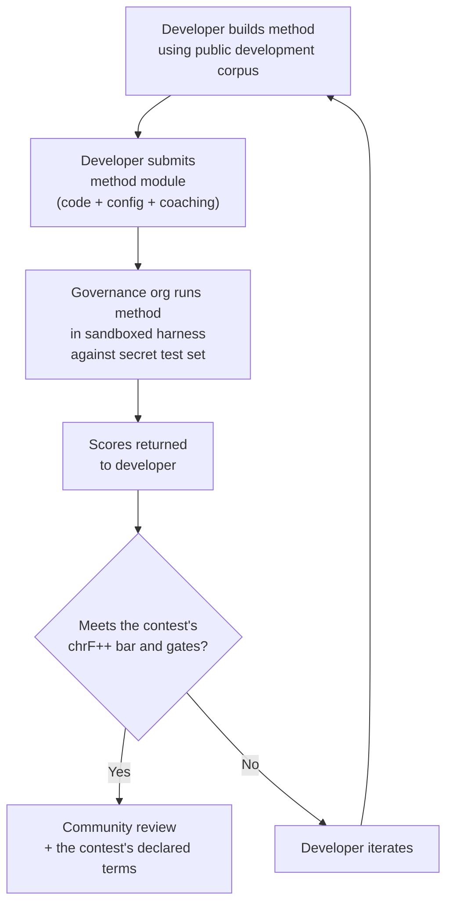

# Especificación de Referencia

> **Resumen ejecutivo.** Este documento define el protocolo de evaluación para el ecosistema de evaluación de TA de Champollion: formato del corpus (§2), esquema de run cards (§3), protocolo del benchmark (§6), requisitos de validación humana (§7), mecanismos de soberanía (§8), tabla de clasificación y modelo de envío (§9), marco de costos (§10) y extensibilidad a nuevos idiomas (§11). Para consultar cómo se puntúan las ejecuciones (la métrica principal chrF++, las métricas estándar que la acompañan, los diagnósticos) y las fórmulas de las métricas de costo/velocidad, consulte `SCORING_SPEC.md` — la única fuente de verdad para toda la lógica de puntuación. Este documento hace referencia a SCORING_SPEC para esos detalles en lugar de duplicarlos.


---

## 1. Principios

### 1.1 Los Idiomas Son Biodatos

Un idioma no es material de prueba neutral. Como datos genéticos o de salud, los datos de idioma son **biodatos**: llevan la identidad, parentesco y relaciones de las personas que lo hablan, y no pueden ser significativamente anonimizados — elimine los metadatos y el idioma aún codifica quiénes son sus hablantes. La consecuencia para esta especificación es concreta: las personas que proporcionan un corpus tienen las claves del mismo, y de todo lo que se mida contra él. La soberanía (§8) por lo tanto no es un complemento del protocolo; es una precondición del mismo, y todos los demás principios a continuación operan dentro de ella.

### 1.2 Las Métricas Automatizadas Son Aproximaciones

Cada métrica definida en este documento se calcula por máquina. chrF++, aceptación FST, precisión morfológica, similitud semántica — todas ellas son aproximaciones automatizadas de la calidad de la traducción. Son útiles para iteración rápida, comparación sistemática y detección de regresiones. **No son sustitutos del juicio humano**.

La jerarquía de evaluación:

```
Automated metrics (run cards, benchmarks)
    ↓ proxy for
Human review (bilingual speakers validate output)
    ↓ proxy for
Actual utility (does this help a language community?)
```

Ninguna puntuación automatizada, por alta que sea, puede sustituir a un hablante fluido que lea el resultado y confirme que es correcto, natural y culturalmente apropiado. Por eso ninguna puntuación automática lleva una etiqueta de calidad (§5): las métricas automáticas son útiles para seguir el progreso, pero nunca suficientes por sí solas.

### 1.3 Métodos, No Modelos

Evaluamos **métodos**, no modelos. Un modelo es un componente. Un método es la receta completa: selección de modelo, diseño de indicaciones, uso de herramientas, pre/post-procesamiento, datos de entrenamiento, estrategias de reintento, todo. Dos equipos que usan el mismo modelo con métodos diferentes obtendrán puntuaciones diferentes. Ese es el punto.

### 1.4 Reproducibilidad

Cada resultado de referencia debe ser reproducible. La tarjeta de ejecución (§3) captura la configuración completa de un experimento. La huella digital (§3.5) identifica la configuración experimental. El hash de la tarjeta de ejecución (§3.6) verifica la integridad del resultado. Cualquiera con el mismo método, corpus y configuración debe lograr puntuaciones dentro de ±2% (contabilizando la no determinismo de muestreo de LLM a temperatura > 0).

### 1.5 Sin Datos de Evaluación Sintéticos

**Este proyecto no genera, utiliza ni respalda datos de evaluación sintéticos.** Todos los corpus deben provenir de texto genuinamente escrito por humanos — traducciones publicadas, libros de texto, documentos bilingües, o traducciones elicitadas de hablantes fluidos.

Los LLM pueden ayudar con:
- Alineación de oraciones (encontrar pasajes paralelos en textos bilingües existentes)
- Conversión de formato (convertir materiales publicados al esquema de corpus)
- Enriquecimiento de metadatos (sugerir niveles de dificultad, etiquetas de registro)
- Proponer oraciones fuente para traducción humana (§11.3 — el paso de traducción siempre es humano)

Los LLM **nunca** deben generar traducciones de referencia o pares de evaluación.

**Somos neutrales en desarrollo respecto a datos de entrenamiento.** Si un desarrollador de métodos utiliza datos de entrenamiento sintéticos, retrotraducción o aumento de datos en su método, esa es su elección — evaluamos el resultado, no el proceso de entrenamiento. OMT-1600 de Meta utiliza aproximadamente 270 millones de oraciones paralelas sintéticas generadas mediante retrotraducción. No tenemos objeción a métodos entrenados de esta manera. Probamos solo en curación humana.

> **¿Por qué no texto bíblico para evaluación?** OMT-1600 evalúa 1.560 de 1.600 idiomas en texto de dominio bíblico (Meta AI, *Omnilingual MT*, arXiv:2603.16309, 2026). Las traducciones bíblicas tienen registro arcaico, vocabulario litúrgico y estructura de oración formulaica. Nuestros corpus de evaluación se obtienen de texto curado por la comunidad, diverso en dominio — salud, legal, educativo, gubernamental, conversacional y técnico (ver §2.7). Esta es una opción de diseño deliberada. Las comunidades necesitan traducción para los dominios donde realmente viven y trabajan, no un único registro religioso. Un método que obtiene una puntuación alta en Génesis 1:1 te dice casi nada sobre su desempeño en una agenda de consejo de banda o un formulario de admisión de clínica.

---

## 2. Esquema de Corpus

Un corpus es un conjunto curado de pares de texto paralelo con metadatos estructurados. Es la verdad fundamental contra la cual se miden todos los métodos.

### 2.1 Envolvente de Conjunto de Datos

La estructura de nivel superior de un archivo de corpus:

```json
{
  "dataset": {
    "id": "edtekla-dev-v1",
    "version": "1.0",
    "language_pair": "EN→CRK",
    "source_language": "en",
    "target_language": "crk",
    "created": "2026-05-01",
    "license": "LicenseRef-EdTeKLA-Modified-CC-BY-NC-SA-4.0",
    "provenance": ["gold_standard", "textbook"]
  },
  "entries": [ ... ]
}
```

| Campo | Tipo | Requerido | Descripción |
|-------|------|----------|-------------|
| `id` | string | ✅ | Identificador único del conjunto de datos, utilizado en tarjetas de ejecución y leaderboard |
| `version` | string | ✅ | Versión semántica. Incrementar invalida comparaciones de tarjetas de ejecución anteriores |
| `language_pair` | string | ✅ | Etiqueta de visualización (p. ej., `EN→CRK`) |
| `source_language` | string | ✅ | Código de idioma fuente BCP 47 |
| `target_language` | string | ✅ | Código de idioma destino BCP 47 |
| `created` | string | ✅ | Fecha de creación ISO 8601 |
| `license` | string | ✅ | Identificador de licencia SPDX |
| `provenance` | string[] | ✅ | Lista de etiquetas de procedencia utilizadas en todas las entradas |

### 2.2 Esquema de Entrada

Cada entrada en el corpus representa un desafío de traducción:

```json
{
  "id": 42,
  "source": "I see the dog",
  "reference": "niwâpamâw atim",
  "segment": "gold_standard",
  "difficulty": 2,
  "provenance": "gold_standard",
  "register": "conversational",
  "context": "declaration",
  "morphological_analysis": "ni-wâpam-âw atim | 1sg-see.TA-3sg.DIR dog.AN",
  "notes": "Animate noun (atim); direct form because speaker is proximate",
  "variant_class": "simple-ta-direct"
}
```

| Campo | Tipo | Requerido | Descripción |
|-------|------|----------|-------------|
| `id` | entero | ✅ | Identificador único dentro del corpus |
| `source` | cadena | ✅ | Texto de origen en el idioma de origen |
| `reference` | cadena | ✅ | Traducción de referencia estándar de oro en el idioma de destino |
| `segment` | cadena | 📎 | Partición del corpus: `gold_standard`, `held_out`, `development` o `diagnostic` |
| `difficulty` | entero | 📎 | Calificación de dificultad 1–5 (consulte §2.4) |
| `provenance` | cadena | 📎 | Origen de esta entrada (consulte §2.5) |
| `register` | cadena | 📎 | Nivel de registro/formalidad (consulte §2.6) |
| `context` | cadena | 📎 | Función comunicativa (consulte §2.6) |
| `domain` | cadena | 📎 | Dominio de caso de uso de la taxonomía de 16 códigos (consulte §2.7). Debe ser uno de: `conv`, `ecommerce`, `edu`, `financial`, `gov`, `legal`, `literary`, `marketing`, `medical`, `news`, `religious`, `scientific`, `subtitles`, `support`, `tech`, `ui`. Se valida al momento de la construcción. |
| `morphological_analysis` | cadena | ❌ | Desglose morfológico estándar de oro |
| `notes` | cadena | ❌ | Notas del traductor, variantes dialectales, marcas de ambigüedad |
| `variant_class` | cadena | ❌ | Etiqueta de clase que agrupa variantes de traducción aceptables |

> **📎 = RECOMENDADO.** El harness gestiona los campos opcionales faltantes de forma adecuada mediante valores predeterminados. Los corpus de terceros solo necesitan proporcionar `id`, `source` y `reference` por entrada.


### 2.3 Segmentos de Corpus

El corpus se divide en segmentos con diferentes niveles de acceso:

| Segmento | Propósito | Acceso | Tamaño Mínimo |
|---------|---------|--------|-------------|
| `development` | Desarrollo e iteración de métodos. Los desarrolladores los usan libremente. | **Público** | 30 entradas |
| `diagnostic` | Pruebas dirigidas para fenómenos lingüísticos específicos. | **Público** | 10 entradas |
| `gold_standard` | Evaluación oficial de referencia. Las puntuaciones del leaderboard provienen de aquí. | **Secreto** — mantenido por organización de gobernanza | 50 entradas |
| `held_out` | Reservado para evaluación futura. Nunca se usa hasta que se active. | **Secreto** — mantenido por organización de gobernanza | 10 entradas |

> **Estado actual:** Solo el segmento `development` existe en conjuntos de datos enviados. Los segmentos `diagnostic`, `gold_standard`, y `held_out` se definen para uso futuro a medida que los corpus crecen.

Los segmentos `gold_standard` y `held_out` son completamente secretos. Tanto las oraciones fuente como las traducciones de referencia se mantienen en infraestructura controlada por gobernanza. Los desarrolladores de métodos nunca ven las preguntas ni las respuestas. Ver §8 para el mecanismo de soberanía.

### 2.4 Niveles de Dificultad

| Nivel | Descripción | Ejemplos |
|------|-------------|----------|
| 1 — Vocabulario básico | Palabras individuales, saludos comunes, números | "hello" → "tânisi", "dog" → "atim" |
| 2 — Oraciones simples | Sujeto-verbo u orden SVO, tiempo presente | "I see the dog" → "niwâpamâw atim" |
| 3 — Complejidad moderada | Tiempo pasado/futuro, posesivos, animacidad | "I saw his dog yesterday" |
| 4 — Morfología compleja | Obviación, voz pasiva, orden conjuntivo, cláusulas relativas | "the woman whose son went to the store" |
| 5 — Avanzado | Multi-cláusula, registro formal, ceremonial, idiomático | Párrafo completo con tono apropiado al registro |

Un corpus bien construido debe incluir entradas en todos los cinco niveles de dificultad, ponderadas hacia los niveles 2–4 donde caen la mayoría de los desafíos de traducción del mundo real.

### 2.5 Etiquetas de Procedencia

Cada entrada debe indicar su origen:

| Etiqueta | Significado |
|-----|---------|
| `gold_standard` | Verificado por hablantes fluidos |
| `textbook` | De materiales educativos publicados |
| `elicited` | Producido a través de sesiones de elicitación estructurada |
| `corpus` | Extraído de un corpus paralelo |

> **Nota:** En la práctica, los valores de procedencia son cadenas de forma libre. Las etiquetas anteriores son convenciones, no una enumeración validada — los conjuntos de datos pueden usar otras cadenas de procedencia descriptivas.

### 2.6 Registro y Contexto

**Registro** describe la formalidad y contexto social:

| Registro | Descripción |
|----------|-------------|
| `conversational` | Habla cotidiana entre iguales |
| `formal` | Lenguaje oficial o institucional |
| `technical` | Vocabulario específico del dominio |
| `ceremonial` | Uso de lenguaje tradicional o sagrado |
| `educational` | Materiales de enseñanza de idiomas |

**Contexto** describe la función comunicativa:

> 🔲 **Planeado.** El campo `context` se define en el esquema pero aún no se completa en los conjuntos de datos actuales. Se reserva para enriquecimiento futuro del corpus.

| Contexto | Descripción |
|---------|-------------|
| `greeting` | Saludo social o despedida |
| `declaration` | Declaración de hecho |
| `question` | Interrogativo |
| `instruction` | Comando o directiva |
| `narrative` | Narración o descripción |
| `label` | Etiqueta de UI, texto de botón o encabezado |
| `error` | Mensaje de error o advertencia |

### 2.7 Dominio {#27-domain}

**Dominio** describe el caso de uso del mundo real — el tipo de contenido que se está traduciendo. Esto es ortogonal al registro y contexto:

- **Registro** responde: *¿Qué tan formal es esto?*
- **Contexto** responde: *¿Qué está haciendo esta oración?*
- **Dominio** responde: *¿Para qué industria/caso de uso es esto?*

Un contrato legal (dominio: `legal`) podría ser formal (registro: `formal`) y contener una declaración (contexto: `declaration`). Una transcripción de chatbot legal (dominio: `legal`) podría ser conversacional (registro: `conversational`) y contener preguntas (contexto: `question`). Mismo dominio, diferente registro y contexto.

| Código de Dominio | Descripción | Consumidores Típicos |
|-------------|-------------|-------------------|
| `ui` | Cadenas de interfaz de software | Desarrolladores de aplicaciones, equipos de localización |
| `legal` | Contratos, estatutos, presentaciones judiciales, documentos de inmigración | Bufetes de abogados, tribunales, equipos de cumplimiento, abogados de PI |
| `medical` | Notas clínicas, etiquetas de medicamentos, comunicaciones con pacientes, protocolos de ensayos | Hospitales, farma, ensayos clínicos, portales de pacientes |
| `financial` | Banca, seguros, presentaciones regulatorias, informes de auditoría | Bancos, aseguradoras, reguladores, auditores |
| `edu` | Libros de texto, currículos, planes de lecciones, materiales académicos | Escuelas, universidades, editoriales de libros de texto |
| `ecommerce` | Descripciones de productos, reseñas, listados de mercado | Minoristas en línea, vendedores de mercado |
| `marketing` | Copia publicitaria, mensajería de marca, campañas, eslóganes | Agencias publicitarias, equipos de marca |
| `gov` | Documentos de política, regulaciones, avisos públicos, legislación | Agencias gubernamentales, equipos de cumplimiento |
| `scientific` | Artículos de investigación, resúmenes, metodología, propuestas de subvenciones | Investigadores, revistas, agencias de subvenciones |
| `religious` | Escritura, textos litúrgicos, comentario teológico | Comunidades de fe, editoriales litúrgicas |
| `support` | Preguntas frecuentes, mensajes de error, guías de solución de problemas, scripts de chatbot | Empresas SaaS, mesas de ayuda |
| `subtitles` | Diálogo de cine, TV, streaming y videojuegos | Plataformas de streaming, estudios, empresas de videojuegos |
| `news` | Periodismo, reportes de agencias, editorial, comunicados de prensa | Organizaciones de medios, agencias de noticias |
| `literary` | Ficción, poesía, narrativa, textos culturales | Editoriales, organizaciones de preservación cultural |
| `conv` | Conversación informal, redes sociales, mensajería | Aplicaciones de consumidor, plataformas sociales |
| `tech` | Documentación de API, manuales, especificaciones de ingeniería, guías técnicas | Equipos de documentación, organizaciones de ingeniería |

> **Benchmarks específicos de dominio.** El benchmark general evalúa un método en todos los dominios. Pero la Red también admite **benchmarks filtrados por dominio** — donde las puntuaciones se calculan solo en entradas etiquetadas con un dominio específico. Esto permite a los usuarios responder: "¿Cuál es el mejor método para traducir documentos legales al francés?" vs. "¿Cuál es la mejor puntuación general de francés?"
>
> Las clasificaciones del leaderboard filtradas por dominio permiten a los usuarios comparar métodos dentro de un único caso de uso. Diferentes métodos funcionan de manera diferente en dominios — un método ajustado en terminología legal puede obtener una puntuación mucho más alta en texto legal que en texto conversacional. La Red ayuda a los usuarios a encontrar el método que funciona mejor para su caso de uso específico.

> **Futuro: Asistente de Red.** Un asistente conversacional que ayuda a los usuarios a describir su caso de uso de MT (dominio, par de idiomas, requisitos de calidad) y muestra métodos validados por la comunidad relevantes del leaderboard — por ejemplo, "¿qué método obtiene la puntuación más alta en benchmarks de dominio médico EN→JA?" — es una ayuda de navegabilidad que estamos considerando, condicionada a suficientes datos de evaluación etiquetados por dominio y diversidad de métodos.

---

## 3. Esquema de Tarjeta de Ejecución {#3-run-card-schema}

La tarjeta de ejecución es la unidad atómica de evaluación. Es un documento JSON independiente que registra la configuración completa y los resultados de una única ejecución de evaluación: un método, un modelo, una configuración, un conjunto de datos.

Cada tarjeta de ejecución captura tres dimensiones:
- **Calidad** — ¿qué tan buenas son las traducciones?
- **Costo** — ¿cuánto costó producirlas?
- **Velocidad** — ¿cuánto tiempo tomó?

### 3.1 Campos de Nivel Superior

| Campo | Tipo | Descripción |
|-------|------|-------------|
| `run_id` | cadena | UUID v4 generado al inicio de la ejecución |
| `harness_version` | cadena | Versión semántica del harness (p. ej., `2.0`) |
| `timestamp` | cadena | Marca de tiempo ISO 8601 UTC de cuándo comenzó la ejecución |
| `elapsed_seconds` | número | Duración de tiempo de reloj (wall-clock) de toda la ejecución |
| `score_caveats` | arreglo | Presente solo cuando algo califica las puntuaciones: una lista de objetos `{kind, source, severity, message, …}`, p. ej., un conjunto de prueba cuyas filas tienen gemelos casi idénticos en los datos de entrenamiento, salidas mucho más largas o mucho más cortas que sus referencias, salidas que copian su origen o una única salida proporcionada para muchos orígenes diferentes. Informativo: nunca cambia una puntuación y se muestra junto a la métrica principal chrF++ dondequiera que estén las puntuaciones. Consulte la [Especificación de Run Cards](/docs/network/specifications/run-card#score_caveats) |

### 3.2 Configuración de Método

Estos campos definen la configuración experimental — qué se probó y cómo.

| Campo | Tipo | Requerido | Descripción |
|-------|------|----------|-------------|
| `model_slug` | string | ✅ | Identificador de modelo (p. ej., `google/gemini-2.5-flash`) |
| `model_id` | string | ❌ | Identificador de modelo resuelto devuelto por la API |
| `condition` | string | ✅ | Etiqueta de experimento (p. ej., `baseline`, `coached-v3`, `few-shot`) |
| `temperature` | number | ✅ | Temperatura de muestreo |
| `system_prompt_sha256` | string | ✅ | Hash SHA-256 del indicador del sistema completo |
| `system_prompt_used` | string | ✅ | Texto del indicador del sistema completo |
| `coaching_data_sha256` | string | ❌ | Hash SHA-256 del archivo de datos de entrenamiento, si se usa |
| `fst_version` | string | ❌ | Versión del analizador FST, si se usa |
| `tools_enabled` | string[] | ❌ | Lista de herramientas disponibles para el método |
| `batch_size` | number | ❌ | Entradas por lote de API concurrente |
| `max_retries` | number | ❌ | Reintentos máximos para rechazo FST, si aplica |

:::info[Las Run Cards publicadas incluyen method_config]
Cuando se publica una run card en la tabla de clasificación (mediante `mt-eval publish`), también incluye un bloque `method_config` que contiene el MethodConfig canónico de 8 campos (`model`, `temperature`, `batchSize`, `register`, `coachingFile`, `coachingPrompt`, `promptContext`, `qualityTier` — todos en camelCase; `qualityTier` siempre es null en una nueva card, ya que los niveles de calidad están retirados). Esto permite una importación sin reconstrucción: `champollion leaderboard --install` lee `method_config` directamente y lo escribe como un manifiesto de plugin. Los campos de telemetría anteriores (§3.2) registran lo que observó el harness; `method_config` registra lo que el desarrollador pretendía.
:::

### 3.3 Referencia de Conjunto de Datos

| Campo | Tipo | Descripción |
|-------|------|-------------|
| `dataset.id` | string | Identificador del conjunto de datos |
| `dataset.version` | string | Versión del conjunto de datos |
| `dataset.language_pair` | string | Etiqueta de visualización |
| `dataset.sha256` | string | Hash SHA-256 del contenido del archivo del conjunto de datos |
| `dataset.entry_count` | number | Número de entradas evaluadas |

El SHA-256 del conjunto de datos fija el resultado a una versión específica de los datos. Si el conjunto de datos cambia, las tarjetas de ejecución antiguas no son comparables.

### 3.4 Puntuaciones (Calidad)

Métricas agregadas para toda la ejecución. Todas las métricas de calidad son **automatizadas** — ver §1.2.

| Campo | Tipo | Descripción |
|-------|------|-------------|
| `scores.total` | número | Total de entradas evaluadas |
| `scores.exact_matches` | número | Entradas donde la salida coincidió exactamente con la referencia |
| `scores.exact_match_rate` | número | 0.0–1.0 |
| `scores.equivalent_matches` | número | Entradas que coinciden con una variante aceptable |
| `scores.equivalent_match_rate` | número | 0.0–1.0 |
| `scores.fst_accepted` | número | Palabras de salida aceptadas por el analizador FST, sumadas en todas las entradas (un conteo de palabras, no de entradas) |
| `scores.fst_acceptance_rate` | número | 0.0–1.0, la media de las tasas de aceptación por entrada (palabras aceptadas de cada entrada ÷ sus palabras); `null` si no hay un FST configurado |
| `scores.morphological_accuracy` | número | 0.0–1.0, derivado de FST (con lemas coincidentes), `null` si no hay FST / no hay palabras con lemas coincidentes. Consultivo hasta que se active — consulte Scoring Spec §2.2 |
| `scores.morph_coverage` | número | 0.0–1.0, fracción de palabras predichas analizables con lemas coincidentes con la referencia (revela cuán disperso es `morphological_accuracy`) |
| `scores.chrf_plus_plus` | número | **La métrica principal y de clasificación:** chrF++ a nivel de corpus (0–100). Su IC de bootstrap al 95% es `scores.confidence_intervals.corpus_chrf` y su firma de sacreBLEU es `scores.sacrebleu_signatures.chrf` |
| `scores.scoring_standard` | cadena | `"standard/1"` en cada nueva card. Ausente en las cards publicadas antes del estándar, que se leen como `legacy-composite` |
| `scores.primary_metric` | cadena | `"chrf_plus_plus"` |
| `scores.spbleu` | número | spBLEU (SentencePiece de FLORES-200), mostrado junto a chrF++ |
| `scores.sacrebleu_signatures` | objeto | Firma de cada métrica de sacreBLEU calculada (`chrf`, `chrf_plain`, `bleu`, `spbleu`, `ter`) |
| `scores.semantic_score` | número | Similitud semántica basada en embeddings (0.0–1.0) |
| `scores.ter` | número | Translation Edit Rate (0–∞, menor es mejor) |
| `scores.length_ratio` | número | avg(len(predicted)/len(reference)), ideal = 1.0 |
| `scores.code_switching_rate` | número | 0.0–1.0, fracción de entradas con filtración del idioma de origen |
| `scores.hallucination_rate` | número | 0.0–1.0, fracción de entradas con contenido alucinado |
| `scores.terminology_adherence` | número | 0.0–1.0, adherencia a los términos del glosario (`null` si no hay glosario) |
| `scores.tokens_per_second` | número | total_tokens / elapsed_seconds |
| `scores.entries_per_minute` | número | entradas traducidas por minuto |
| `scores.composite` | número \| null | **Retirado.** `null` en cada nueva card; una card heredada conserva su puntuación compuesta almacenada, mostrada como "legacy composite (retired)". Consulte SCORING_SPEC §4 |
| `scores.quality_tier` | cadena \| null | **Retirado.** `null` en cada nueva card. Consulte SCORING_SPEC §5 |
| `scores.cost_adjusted` | número \| null | **Retirado** junto con la puntuación compuesta; `null` en cada nueva card |
| `scores.errors` | número | Entradas que fallaron (error de API, tiempo de espera agotado, etc.) |
| `scores.by_difficulty` | objeto | Puntuaciones desglosadas por nivel de dificultad |
| `scores.by_provenance` | objeto | Puntuaciones desglosadas por etiqueta de procedencia |
| `scores.by_domain` | objeto | ✅ Implementado — Puntuaciones desglosadas por dominio (§2.7). Permite clasificar la tabla de clasificación filtrada por dominio. Calculado por tester.py y transmitido a través de publish.py. |

### 3.5 Totales (Costo)

| Campo | Tipo | Descripción |
|-------|------|-------------|
| `totals.prompt_tokens` | number | Total de tokens de entrada en todas las llamadas de API |
| `totals.completion_tokens` | number | Total de tokens de salida |
| `totals.reasoning_tokens` | number | Tokens utilizados para cadena de pensamiento (0 para la mayoría de modelos) |
| `totals.cached_tokens` | number | Tokens servidos desde la caché de indicador del proveedor |
| `totals.total_cost_usd` | number | Costo total en USD |
| `totals.cost_per_entry_usd` | number | `total_cost_usd / entry_count` |
| `totals.cost_per_source_char` | number | USD por carácter fuente — comparable entre idiomas |

### 3.6 Tiempo (Velocidad)

| Campo | Tipo | Descripción |
|-------|------|-------------|
| `elapsed_seconds` | number | Duración de reloj de pared de la ejecución completa (nivel superior) |
| `scores.avg_latency_seconds` | number | Tiempo de respuesta promedio por entrada |
| `scores.median_latency_seconds` | number | Tiempo de respuesta mediano por entrada |
| `scores.p95_latency_seconds` | number | Tiempo de respuesta del percentil 95 por entrada |

### 3.7 Resultados Por Entrada

Cada entrada en el array `results[]` registra una traducción. Los datos por entrada se persisten en la tabla `run_card_entries` (migración 005) con veredictos LYSS desnormalizados (migración 006).

| Campo | Tipo | Descripción |
|-------|------|-------------|
| `entry_id` | string | Coincide con `entries[].id` en el corpus |
| `source` | string | Texto fuente que fue traducido |
| `expected` | string | Traducción de referencia estándar de oro |
| `raw_predicted` | string \| null | Salida del modelo sin procesar antes del post-procesamiento |
| `predicted` | string | Salida real del método (post-procesada) |
| `segment` | string | Identificador de segmento (p. ej., índice de oración) |
| `difficulty` | string \| null | Nivel de dificultad del corpus |
| `domain` | string | Etiqueta de dominio del corpus (§2.7) |
| `exact_match` | boolean | Si la salida coincidió exactamente con la referencia |
| `chrf_score` | number \| null | chrF++ a nivel de oración (0–100) |
| `bleu_score` | number \| null | BLEU a nivel de oración (0–100) |
| `latency_s` | number \| null | Tiempo de respuesta en segundos |
| `cost_usd` | number \| null | Costo en USD para esta entrada |
| `tool_call_count` | integer | Número de llamadas de herramienta utilizadas (0 si ninguna) |
| `error` | string \| null | Mensaje de error si esta entrada falló |
| `plugin_metrics` | object | Salida de plugin completa por entrada (JSONB) |
| `fst_valid` | boolean \| null | El FST de GiellaLT aceptó la predicción (LYSS-fst desnormalizado) |
| `equivalent_match` | boolean \| null | El linter de CRK confirmó equivalencia estructural (LYSS-eq desnormalizado) |
| `semantic_verdict` | string \| null | Veredicto LYSS-sem: `VALID`, `MISMATCH`, `UNKNOWN`, `ERROR` |
| `code_switching_detected` | boolean \| null | Tokens de idioma fuente detectados en la salida |
| `hallucination_detected` | boolean \| null | Contenido fabricado detectado en la salida |


### 3.8 Huella Digital

Un identificador de reproducibilidad. Dos ejecuciones con huellas digitales idénticas utilizaron la misma configuración experimental.

El fingerprint es el hash SHA-256 del JSON canónico (claves ordenadas) de:
- `dataset.sha256`
- `model_slug`
- `condition`
- `system_prompt_sha256`
- `temperature`
- `harness_version`
- `batch_size`
- `tools_enabled`

> **¿Por qué 8 componentes?** El tamaño del lote y las llamadas de herramienta afectan materialmente la calidad de la salida y deben incluirse en la identidad. Dos ejecuciones con diferentes tamaños de lote o diferentes herramientas habilitadas son configuraciones experimentales diferentes, incluso si todos los demás parámetros coinciden.

**La versión 2 (harness 0.2.0 y posteriores)** agrega cinco componentes:
- `api_provider`: el canal a través del cual pasó el texto (OpenRouter, la API propia de un proveedor, un endpoint local; el id de un motor de TA; para un plugin de método, `local` bajo `--attest-local-transport`, de lo contrario `method-plugin`). Los registros de ejecución de plugins y motores escritos antes de que esto se corrigiera indican `openrouter`, un valor predeterminado por el que nunca se enviaron; publish también registra el valor corregido para ellos, lo que cambia su identidad de versión 2, deliberadamente, ya que el valor anterior era falso
- `endpoint_host_sha256`: el SHA-256 del host del endpoint, nunca la URL sin procesar, que puede contener nombres de host internos o credenciales
- `max_tokens`
- `method_version`: la versión de la method card, de lo contrario la versión que declara el `method.json` de un plugin de método
- `method_sha256`: el hash del paquete ejecutado, para un método ejecutado por un nodo de concurso; de lo contrario, el hash sobre los archivos de un plugin de método (`method.json` y sus archivos `.py`)

La ejecución de un **plugin de método** (`mt-eval run --method <plugin dir>`) agrega dos más:
- `method_model`: el modelo que se le entregó al plugin con `-m/--model` (el plugin lo lee como `config.method_model`), o `null` cuando no se proporcionó ninguno
- `method_dependencies_sha256`: el SHA-256 de la lista `dependencies` que declara el `method.json` del plugin (JSON canónico), o `null` cuando no declara ninguna

Sin estos elementos, el mismo plugin ejecutado en dos modelos diferentes compartía una sola identidad. El harness 0.2.0 los agrega antes de su lanzamiento, de modo que la identidad de la ejecución de un plugin cambia una sola vez, aquí; ningún otro tipo de ejecución se ve afectado.

La ejecución de un motor de TA que ejecuta un modelo que se le **proporciona** (`mt-eval run --method local-model -m <model>`) también agrega dos:
- `method_model`: el modelo que se cargó — su id de Hugging Face o el nombre del directorio del modelo
- `method_model_sha256`: para un directorio, el SHA-256 sobre una lista al estilo de `sha256sum` de sus archivos (una línea `<sha256>  <relative path>` por archivo, ordenada por ruta, omitiendo directorios con punto); para un id de Hugging Face, la revisión que se cargó

Dos modelos a través del mismo motor son dos experimentos. Un registro de ejecución de `local-model` que no nombra ningún modelo (las compilaciones anteriores de 0.2.0 no pasaban `-m` al motor, el cual ejecutaba entonces un modelo de respaldo, `Helsinki-NLP/opus-mt-en-es`) no puede indicar qué produjo sus números: `mt-eval publish` lo rechaza y `contest qualify` no emitirá un recibo a partir de él.

Bajo la versión 1, el mismo modelo invocado a través de dos canales diferentes compartía una sola identidad y, debido a que una card publicada es inmutable, la segunda de las dos se rechazaba como duplicado. La run card registra `fingerprint.version`. Un registro de ejecución de un harness anterior conserva la versión 1, por lo que republicarlo reproduce su identidad original.

Dos ejecuciones con huellas digitales idénticas deben producir resultados comparables. Las diferencias se deben a no determinismo de API (temperatura > 0) o actualizaciones de modelo del lado del proveedor.

### 3.9 Hash de Tarjeta de Ejecución

El hash SHA-256 de toda la tarjeta de ejecución JSON (con el campo `run_card_hash` establecido en `""` durante el hash). Este es el sello de detección de manipulación. Si algún campo cambia, el hash se rompe.

---

## 4. Métricas Automatizadas

Todas las métricas en esta sección se calculan por máquina. Ver §1.2.

### 4.1 Definiciones de Métricas

| Métrica | Estado | Qué mide | Rango |
|--------|--------|-----------------|-------|
| **chrF++** | ✅ Implementado | Puntuación F de n-gramas de caracteres. Opera a nivel de caracteres, lo que la hace más robusta que las métricas a nivel de palabras (BLEU) para idiomas de gran riqueza morfológica donde las palabras son largas y altamente flexionadas. Calculado por sacrebleu. | 0–100 (escala nativa). **La métrica principal y de clasificación**, publicada con su IC al 95% y su firma de sacreBLEU. |
| **Tasa de aceptación de FST** | ✅ Implementado (diagnóstico) | Fracción de palabras predichas aceptadas por el analizador morfológico (GiellaLT HFST) como formas válidas en el idioma de destino. Una palabra que el FST acepta es una palabra real y estructuralmente válida, no una alucinación. | 0.0–1.0 |
| **Coincidencia exacta** | ✅ Implementado (diagnóstico) | Fracción de predicciones que coinciden exactamente con la referencia después de la normalización Unicode. Estricto pero inequívoco; útil como verificación de techo. | 0.0–1.0 |
| **Precisión morfológica** | ✅ Implementado (diagnóstico) | Derivada de FST y con lemas coincidentes: para cada palabra predicha cuya raíz aparece en la referencia, si su flexión coincide. Más granular que la aceptación de FST: una palabra puede ser válida según el FST pero tener una flexión incorrecta (raíz correcta, tiempo verbal incorrecto). Requiere un analizador FST, no un aceptador de revisión ortográfica; consulte SCORING_SPEC §2.2. | 0.0–1.0 |
| **Coincidencia equivalente** | ⚡ Parcial (diagnóstico) | Fracción que coincide con una variante aceptable de la referencia, teniendo en cuenta el orden de las palabras, las diferencias dialectales y las convenciones ortográficas. Actualmente implementado para CRK a través del estándar de evaluación de CRK `CrkLinterMetric` (en `eval_standards/crk/`); cargado automáticamente a través de la declaración `evalMetrics` de la language card de CRK. La implementación genérica requiere `variants[]` por entrada en el corpus. | 0.0–1.0 |
| **Puntuación semántica** | ⚡ Parcial (diagnóstico) | Preservación del significado independientemente de la forma superficial. Actualmente implementado para CRK a través del estándar de evaluación de CRK `CrkSemanticMetric` (en `eval_standards/crk/`, proxy ponderado por veredicto). Se planea una similitud de coseno universal basada en embeddings — consulte SCORING_SPEC §2.3. | 0.0–1.0 |

### 4.2 La métrica principal y el estándar que la acompaña

Las ejecuciones se puntúan bajo el estándar de puntuación `standard/1`, de la manera en que WMT, FLORES-200 y las tareas compartidas de AmericasNLP reportan la evaluación de TA:

- **Una métrica principal y de clasificación:** chrF++ de corpus con su intervalo de confianza bootstrap al 95% y firma de sacreBLEU, escrita como `chrF++ 47.5 [45.9, 49.0]`.
- **Las demás métricas estándar junto a ella, nunca combinadas:** BLEU, spBLEU, TER y COMET cuando se calculan (con su id de modelo).
- **Diagnósticos reportados por separado:** coincidencia exacta, aceptación de FST, precisión morfológica, coincidencia equivalente, puntuación semántica, alternancia de código (code-switching), alucinación, terminología, estilo de redacción y cada advertencia de puntuación (score caveat). Explican una puntuación; nunca son una puntuación por sí mismos.
- **Lo que es "mejor" se decide mediante una prueba de significancia pareada** en chrF++ ([Significancia](/docs/network/specifications/significance)), no comparando dos números.

**La definición completa se encuentra en `SCORING_SPEC.md`** ([Cómo se puntúan las ejecuciones](/docs/network/specifications/scoring#how-runs-are-scored)). El código del harness la refleja en `mt_eval_harness/scoring.py`.

> **¿Por qué no usar BLEU como métrica principal?** BLEU opera a nivel de palabra y penaliza la variación morfológica. En los idiomas polisintéticos, una sola palabra puede ser una cláusula completa: BLEU trataría las diferencias flexionales menores como fallas totales. chrF++ maneja esto mejor al operar a nivel de caracteres. BLEU se reporta a su lado. Consulte el Apéndice A de SCORING_SPEC.

### 4.3 La puntuación compuesta retirada

Antes del estándar, las ejecuciones se clasificaban mediante una puntuación compuesta ponderada de chrF++, coincidencia exacta, aceptación de FST, precisión morfológica y métricas de comportamiento. Está **retirada**: las nuevas cards publican `composite: null` y `cost_adjusted: null`. Podía manipularse —un modelo no entrenado que repetía una oración válida en sami septentrional para cada entrada obtuvo una puntuación de 0.6244 con un chrF++ de 5.5— y una combinación de señales que significan cosas distintas para idiomas diferentes no se puede interpretar. Las cards heredadas conservan su puntuación compuesta almacenada y siguen siendo verificables; consulte [SCORING_SPEC §4](/docs/network/specifications/scoring#4-composite-score).

---

## 5. Niveles de calidad (retirados) {#5-quality-tiers}

**Ninguna puntuación automática lleva una etiqueta de calidad.** Los niveles de calidad (Baseline, Emerging, Functional, Deployable, Fluent) que se derivaban de la puntuación compuesta se retiran con ella: las nuevas cards publican `quality_tier: null` y ninguna salida imprime un nivel. Una etiqueta como "funcional" en una puntuación automática afirma algo que solo los hablantes pueden confirmar —y los niveles retirados llamaban "funcional" a un sistema que repetía una misma oración para cada entrada—. La calidad se certifica mediante validación humana (§7). Las cards heredadas todavía almacenan un nivel; [SCORING_SPEC §5](/docs/network/specifications/scoring#5-quality-tiers) mantiene los umbrales antiguos únicamente para que esas cards puedan leerse.

---

## 6. Protocolo de Referencia

Un **benchmark** es la producción sistemática de tarjetas de ejecución en un espacio de parámetros declarado en un conjunto de datos dado. No es una única ejecución — es una exploración estructurada de cómo diferentes configuraciones funcionan.

### 6.1 Lo Que Produce un Benchmark

Un benchmark produce una **matriz de tarjetas de ejecución** — una para cada combinación de valores de parámetros. La matriz permite comparación multifacética en:

- **Calidad** — chrF++ con su IC, las demás métricas estándar y diagnósticos
- **Costo** — costo total y por entrada para cada configuración
- **Velocidad** — tiempo de reloj (wall-clock) y latencia por entrada

No existe una única "puntuación de benchmark". El benchmark es la matriz completa. Las distintas partes interesadas se enfocarán en diferentes facetas: un investigador busca una mejora significativa en chrF++, un ingeniero de despliegue optimiza el costo por entrada y una comunidad evalúa la calidad.

### 6.2 Espacio de Parámetros

Un benchmark declara qué parámetros se permutan:

| Eje | Valores Típicos | Propósito |
|-----|---------------|---------|
| `model` | 4–12 modelos (frontera + nivel medio + presupuesto) | ¿Cuánto importa la capacidad del modelo? |
| `temperature` | 0.0, 0.3, 0.7 | ¿La aleatoriedad de muestreo ayuda o perjudica? |
| `prompt_version` | 2–3 estrategias de indicador | ¿Qué tan sensible es el método al diseño de indicador? |
| `coaching_config` | con/sin datos de entrenamiento | ¿Inyectar conocimiento lingüístico mejora la salida? |
| `tool_config` | con/sin FST, con/sin diccionario | ¿Las herramientas lingüísticas mejoran la salida? |

El espacio de permutación completo:
```
runs = |models| × |temperatures| × |prompts| × |coaching| × |tools|
```

Un benchmark inicial típico: 12 modelos × 3 temperaturas × 2 indicadores × 2 entrenamientos = 144 ejecuciones.

### 6.3 Evaluación de Línea Base vs. Método

Un benchmark sirve dos propósitos distintos:

**Línea base** — mapear el panorama con enfoques ingenuos. "¿Qué pueden hacer los modelos existentes para este idioma sin ingeniería específica del idioma?" Esto establece la barra. La matriz de línea base te dice: qué modelos alucina menos, qué temperaturas producen la salida más consistente, si los datos de entrenamiento ayudan en absoluto, dónde todos los modelos fallan uniformemente (que revela problemas lingüísticos difíciles).

**Evaluación de método** — probar un método específico ingenierizado. "¿Mi pipeline entrenado con puerta FST supera las líneas base?" La tarjeta de ejecución del método se compara con la matriz de línea base. Un método es interesante cuando supera la mejor línea base — cuando la ingeniería agrega valor sobre llamadas de modelo ingenuas.

Ambas actividades producen tarjetas de ejecución con el mismo esquema. La distinción está en la intención y el espacio de parámetros: las líneas base permutan entre modelos y configuraciones; la evaluación de método prueba un método contra las mejores configuraciones.

### 6.4 Evaluación Dev vs. Estándar de Oro

Los desarrolladores de métodos iteran libremente contra segmentos de corpus `development` y `diagnostic`. Esto es informal — sin límites, sin envíos, sin participación de gobernanza. El desarrollador está aprendiendo qué funciona.

Las puntuaciones oficiales del leaderboard provienen solo de evaluación `gold_standard`. Esto es formal:
1. El desarrollador envía su método completo y ejecutable (código + configuración + datos de entrenamiento)
2. La organización de gobernanza lo ejecuta en un arnés aislado contra el conjunto de prueba secreto
3. Solo las puntuaciones regresan

Ver §8 para el mecanismo de soberanía completo.

---

## 7. Validación Humana {#7-human-validation}

Las métricas automatizadas son aproximaciones. La validación humana es la verdad fundamental.

### 7.1 Lo Que la Revisión Humana Detecta Que las Métricas Pierden

- **Morfológicamente válido pero semánticamente incorrecto** — el FST acepta la palabra, chrF++ es alto, pero la traducción significa algo diferente
- **Culturalmente inapropiado** — la traducción es técnicamente correcta pero utiliza registro o encuadre que una comunidad rechazaría
- **Plausibilidad alucinada** — la salida se parece al idioma destino para un no hablante pero es galimatías para un hablante fluido
- **Variación aceptable pero sin marcar** — la salida es correcta pero las métricas automatizadas la marcan incorrecta porque utiliza una variante dialectal no en la referencia

### 7.2 La Puerta de Validación

Ningún método puede considerarse utilizable sin una validación humana que confirme que los hablantes bilingües coinciden en que el resultado es utilizable. Esto no es una formalidad: es el objetivo principal. Las métricas automatizadas existen para reducir el volumen de salidas que requieren revisión humana. No pueden reemplazarla.

### 7.3 Protocolo de Revisión Comunitaria

> 🔲 **Planeado**: La interfaz de revisión comunitaria aún no está activa. Esta sección describe el proceso previsto.

1. Se presenta un método para su revisión —por parte de su desarrollador, o porque alcanzó los umbrales automáticos de un concurso (un umbral de chrF++ y los filtros de diagnóstico declarados por el concurso)—
2. Se presenta una muestra de las salidas (estratificada por nivel de dificultad) a hablantes bilingües
3. Los hablantes califican cada traducción en una escala: **rechazar (reject)**, **idea general (gist)** (el significado es claro pero la redacción es incorrecta), **aceptable (acceptable)** (correcta con detalles menores), **excelente (excellent)** (indistinguible de una traducción humana)
4. La organización de gobernanza revisa las calificaciones agregadas
5. Si la comunidad acepta el método, este avanza hacia lo que especifiquen los términos de premios declarados del concurso (§8.3) y hacia el despliegue

La revisión tiene una forma mínima antes de poder conferir el nivel **Community Validated** (§9.4): la muestra estratificada cubre **al menos 30 entradas**, **al menos 2 revisores** — ambos calificados según el protocolo propio de la comunidad — y **al menos el 70%** de las entradas deben cumplir con el estándar de aceptación de la comunidad. El nivel se confiere únicamente mediante pruebas de las ejecuciones de la comunidad en sí, a su discreción, y la degradación es simétrica: la misma ejecución de protocolo como auditoría puntual elimina el nivel tan públicamente como fue otorgado.

---

## 8. Soberanía

Los conjuntos de datos de evaluación contienen conocimiento lingüístico curado que pertenece a la comunidad de idioma. Esta sección define el marco técnico y legal para proteger esos datos.

### 8.1 El Problema

Los benchmarks convencionales publican conjuntos de prueba abiertamente. Una vez publicados, los datos no pueden ser no publicados. Para comunidades de idiomas indígenas y minoritarios, esto crea una dinámica extractiva — los datos lingüísticos se utilizan sin consentimiento continuo. Siguiendo la vista pragmática de Dhein de la soberanía de biodatos, tratamos los datos lingüísticos como un "recurso mercurial con potencial desconocible" que requiere gobernanza dinámica y relacional.

### 8.2 Ejecución Aislada

El mecanismo de cumplimiento principal: el desarrollador entrega su módulo de método, la organización de gobernanza lo ejecuta contra el conjunto de prueba completamente secreto en su propia infraestructura, y solo se devuelven las puntuaciones. El desarrollador nunca ve las oraciones fuente ni las traducciones de referencia.



El flujo:
1. **El corpus de desarrollo es público.** Sin restricciones en los segmentos `development` y `diagnostic`.
2. **El conjunto de prueba estándar de oro es completamente secreto.** Tanto las oraciones fuente como las traducciones de referencia residen en infraestructura controlada por la gobernanza.
3. **Para obtener una puntuación oficial, usted entrega su método.** La organización de gobernanza lo ejecuta en un entorno aislado (sandbox). Solo se devuelven las puntuaciones.
4. **La organización de gobernanza ya posee el método.** El envío ES el modelo o el método; la posesión es lo que hace posible una puntuación soberana en primer lugar. Lo que suceda con él después se rige por los términos de premios declarados del concurso (§8.3).
5. **El envío requiere la aceptación de los términos.** Siempre los términos de envío del método y —cuando el concurso declare términos de premios— una aceptación explícita de estos mediante hash (§8.3).
6. **La organización de gobernanza controla el acceso en su totalidad.** Puede rechazar o revocar la evaluación en cualquier momento. Consentimiento dinámico.
7. **El cifrado en reposo es defensa en profundidad.** La aplicación principal es arquitectónica.

### 8.3 Qué sucede con un método después {#8-3-method-transfer}

Un aspecto es estructural y no negociable: una evaluación soberana significa que la organización de gobernanza tiene la **posesión física de lo que ejecutó** —el modelo o el método llegó a su nodo para poder ser puntuado—. Todo lo que vaya más allá de la posesión corresponde a **los términos de premios declarados del concurso**, elegidos por el anfitrión y publicados antes de que alguien participe.

Ese término es uno de tres, declarados por concurso: `pass_to_holders` (el método pasa a los titulares soberanos del benchmark, quienes lo puntúan y lo conservan independientemente), `retain_ip` (el desarrollador conserva la propiedad; el anfitrión conserva a lo sumo una copia sellada para auditoría) o `release_open` (el desarrollador conserva la propiedad pero debe publicar el método bajo una licencia abierta, y esa publicación es la condición para el premio). Lo que significa cada opción en detalle —qué se retiene, si se transfieren derechos, para qué puede usarlo el anfitrión, cuándo vence una publicación— se deriva de la opción, y cómo se verifica cada una antes de un pago se encuentra en la [Especificación de Premios §1.3](/docs/network/specifications/prizes#1-3-declared-terms). Un concurso que no declara términos de premios no tiene premio, y nada de la entrada se transfiere.

**En todos los casos, el desarrollador conserva:**
- Atribución y crédito (el nombre permanece en la tabla de clasificación)
- Derecho a publicar sobre el método
- Derecho a utilizar el método para otros pares de idiomas

**Lo que obtiene la organización de gobernanza** es exactamente lo que indican sus propios términos declarados —desde "nada; el artefacto se eliminó después de la puntuación" hasta una cesión total con derecho a usar, modificar, distribuir, monetizar y sublicenciar el método para su idioma—. Cumplir con los umbrales declarados del concurso (una barrera de chrF++ y cualquier filtro de diagnóstico) frente a la evaluación estándar de oro y superar la validación humana (§7) es lo que hace que un método sea *elegible para premios*; esto por sí solo no transfiere ningún derecho.

### 8.4 Requisitos de Organización de Gobernanza

Para servir como custodio clave para un benchmark de idioma:

1. **Representar a la comunidad lingüística** — relación demostrable con los hablantes y las autoridades culturales
2. **Capacidad de gestión de claves** — competencia técnica para administrar claves criptográficas
3. **Compromiso con la disponibilidad de la evaluación** — el benchmark debe permanecer evaluable
4. **Publicar términos de participación** — documentación clara de lo que los desarrolladores aceptan
5. **Operar bajo principios reconocidos de soberanía de datos** — propiedad y control comunitario de los datos lingüísticos, principios CARE o equivalentes

### 8.5 Cumplimiento de los principios de soberanía de datos y CARE

**Lo que posee la comunidad.** Los datos lingüísticos pertenecen a la comunidad, y la organización de gobernanza opera la infraestructura de evaluación sobre la que se miden. Dicha organización decide quién puede realizar envíos y bajo qué términos, y la ejecución en sandbox es la forma en que la decisión se *hace cumplir* en lugar de simplemente declararse. La comunidad tiene acceso irrestricto a sus propios datos, a los resultados y a los métodos desarrollados con base en ellos. El conjunto de prueba sellado nunca sale de la propia infraestructura de la organización de gobernanza; el cifrado en reposo es la segunda línea de defensa detrás de eso.

**Principios CARE.**

| Principio | Implementación |
|-----------|---------------|
| **Beneficio colectivo (Collective Benefit)** | El anfitrión establece los términos del premio, de modo que una comunidad que desee que las propuestas la beneficien puede exigir exactamente eso —y conserva el método y todo lo que este genere; la plataforma no se queda con ninguna parte en ningún caso—. |
| **Autoridad de control (Authority to Control)** | La ejecución en sandbox es la implementación técnica. |
| **Responsabilidad (Responsibility)** | Los desarrolladores asumen la responsabilidad a través de los términos de participación. |
| **Ética (Ethics)** | Derechos de la comunidad por encima de la conveniencia del investigador. |

### 8.6 Clases de Dependencia y la Política de Red de Sandbox

La ejecución aislada (§8.2) y la transferencia de propiedad (§8.3) ambas dependen de saber exactamente qué necesita un método en tiempo de ejecución. La [especificación de Interfaz de Método](/docs/network/specifications/methods#method-validity-and-dependency-classes) define cinco **clases de dependencia** — S (autónomo), O (abierto externo), A1 (inferencia LLM sustituible), A2 (API externo no sustituible), X (cerrado) — y el manifiesto de dependencia que cada método debe declarar. Esta subsección registra cómo la política de red de sandbox las cumple.

**Egreso de negación predeterminada.** La especificación de sandbox requiere que los contenedores de método no tengan acceso de red de forma predeterminada. Esto no es una regla de firewall — la especificación elimina la red del entorno de ejecución, por lo que una dependencia de red no declarada falla en la capa de arquitectura, no en la capa de política. Los métodos de clase S y O se ejecutan completamente desde artefactos vendidos en el envío (los artefactos de clase O se fijan y se reflejan en tiempo de envío).

**La puerta de enlace LLM (🔲 planeado).** La mayoría de los métodos llaman a LLM, por lo que la especificación de sandbox define exactamente una excepción de egreso: una **puerta de enlace LLM** operada por la infraestructura de evaluación. La puerta de enlace:

- actúa como proxy para las solicitudes de inferencia hacia una **lista explícita de modelos fijados permitidos** —los identificadores de modelos registrados en el manifiesto del método y en la run card—;
- **registra cada solicitud y respuesta** en el registro de auditoría de solo anexado y encadenado por hash, de modo que el tráfico de la pasarela pueda revisarse en busca de intentos de exfiltración de datos antes de publicar las puntuaciones;
- es la *única* ruta de red —no hay salida general, ni DNS, ni otros endpoints—.

Esto es lo que hace que los métodos de clase A1 sean evaluables sin abandonar las garantías de verificabilidad de §8.2 — pero es un compromiso real, y la especificación lo nombra claramente: traducir una oración fuente secreta a través de un modelo externo **divulga esa oración fuente al proveedor del modelo**. Las traducciones de referencia nunca salen (se mantienen por el arnés, fuera del contenedor; ver §8.2), y el método en sí aún no puede exfiltrar nada más allá de lo que las llamadas de inferencia registradas y permitidas contienen. Si esa divulgación acotada es aceptable para un corpus dado es una decisión del administrador: autorizar una evaluación de clase A1 significa autorizarla conscientemente, por ejecución, como cualquier otro uso de los datos.

**Estado.** El **sandbox** con aislamiento de red para la ejecución de métodos **está implementado** para concursos organizados por coordinadores (lanzado el 2026-07-08; consulte [Limitaciones honestas](/docs/network/honest-limitations) para conocer exactamente qué está y qué no está construido). La **pasarela de LLM está especificada pero aún no construida.** Hasta que la pasarela esté operativa, solo los métodos de Clase S y O pueden producir puntuaciones estándar de oro; los métodos de Clase A1 siguen siendo elegibles para premios en principio (consulte la [Especificación de Premios §1.6](/docs/network/specifications/prizes)), pero aún no pueden evaluarse frente a segmentos secretos. Las dependencias de Clase A2 no pueden ingresar al sandbox bajo ninguna circunstancia hasta que el titular de los derechos otorgue el permiso: el artefacto debe tener autorización para *existir* en el sandbox antes de que surja cualquier interrogante sobre la red.

---

## 9. Leaderboard y Envío

### 9.1 Requisitos de Envío

Un envío válido para la **tabla de clasificación** es una run card completa (§3) con todos los campos requeridos y una referencia que se pueda resolver hacia el conjunto de datos. Eso es todo lo que `mt-eval publish` envía, y su código sigue siendo suyo.

Una entrada **soberana** (`gold_standard`) es algo distinto: es el modelo o el método en sí, y debe incluir:

1. El código del método —totalmente ejecutable, con instrucciones de instalación— o el modelo, como pesos declarativos
2. Todas las dependencias empaquetadas (vendored) —datos de entrenamiento/orientación (coaching data), diccionarios, binarios FST, prompts
3. Un informe de costos
4. Una descripción del enfoque y las limitaciones del método

Consulte §9.5 y la [guía de concursos soberanos](/docs/network/sovereignty/run-a-sovereign-contest).

### 9.2 Criterios de Legitimidad

1. **Sin entrenamiento en datos de evaluación.** Los métodos no deben haber sido expuestos a entradas `gold_standard` o `held_out`. (Arquitectónicamente forzado — no puedes entrenar en datos que nunca has visto.)
2. **Declarar uso de datos de desarrollo.** Usar entradas `development` para indicación de pocos disparos es permitido pero debe declararse.
3. **Reproducibilidad.** La organización de gobernanza debe poder re-ejecutar y lograr puntuaciones dentro de ±2%.
4. **Generalización.** Los métodos deben funcionar en entradas no vistas, no solo ejemplos memorizados.

### 9.3 Anti-Gaming

1. **Linting de clase de variante** — el desempeño sospechosamente perfecto en entradas con variantes conocidas se marca
2. **Rotación de corpus** — la organización de gobernanza puede rotar entradas entre segmentos sin aviso
3. **Revisión comunitaria** — la puerta de validación humana (§7) detecta métodos que juegan con métricas pero producen salida mala

### 9.4 Niveles de Verificación

Los niveles de verificación describen **quién validó el resultado**. (No están relacionados con los niveles de calidad retirados, §5).

| Nivel | Significado | Cómo se obtiene |
|------|---------|--------------|
| **Auto-evaluado (Self-benchmarked)** | El desarrollador ejecutó el harness y envió la run card | `mt-eval publish` contra el segmento `development` |
| **Verificado por Champollion (Champollion Verified)** | El proyecto volvió a puntuar las salidas enviadas contra el corpus de referencia fijado por sha y reprodujo su puntuación | Publique una run card; el proceso por lotes de repuntuación de los mantenedores la promueve cuando se reproduce. Volver a *ejecutar* el método es una capa independiente que aún no está construida |
| **Validado por la comunidad (Community Validated)** | Hablantes bilingües del idioma de destino, calificados bajo el propio protocolo de la comunidad, revisaron una muestra estratificada de la salida (≥30 entradas, ≥2 revisores) y ≥70% cumplió con el umbral de la comunidad. Otorgado únicamente mediante las pruebas propias de la comunidad; la degradación por auditoría aleatoria es simétrica | Envíe el código del método a la organización de gobernanza (§8.2); ellos lo ejecutan contra `gold_standard` y la salida supera la validación humana (§7) |


### 9.5 Modelo de Envío en Capas

El mecanismo de envío depende de qué segmento de corpus estés evaluando:

| Segmento | Ruta de envío | Verificación | ¿Se requiere el código del método? |
|---------|----------------|-------------|----------------------|
| `development` | Autoservicio: ejecute el harness, publique la run card con `mt-eval publish` | Auto-evaluado (Self-benchmarked) | No — usted conserva su código |
| `development` | El proceso por lotes de repuntuación de los mantenedores vuelve a calcular su puntuación a partir de las salidas enviadas contra el corpus fijado por sha | Verificado por Champollion (Champollion Verified) | No — se vuelven a puntuar las salidas, no se vuelve a ejecutar el método |
| `gold_standard` | Entregue el modelo o método a la organización de gobernanza; su nodo lo ejecuta | Verificado por Champollion (el nodo lo puntuó). **Validado por la comunidad** únicamente si la comunidad ejecuta luego su propia revisión (§7); ninguna revisión de este tipo se ha realizado aún | Sí — la propuesta se envía y se retiene para la ejecución |

La ruta de autoservicio (segmento de desarrollo) no tiene restricciones. La ruta soberana (segmento estándar de oro) requiere el envío completo del método porque el desarrollador nunca ve el conjunto de prueba: la única forma de obtener una puntuación es que el propio nodo de la organización de gobernanza ejecute el método. Lo que la organización pueda hacer luego con él se establece en los términos de premios declarados del concurso (§8.3).

### 9.6 Clases de Método

Los métodos se clasifican por tipo. La enumeración canónica se define en el código base del arnés (`VALID_METHOD_CLASSES` en `config.py`):

| Clase | Descripción |
|-------|-------------|
| `raw-llm` | Llamada LLM directa sin ingeniería específica del idioma |
| `coached-llm` | LLM con datos de entrenamiento (ejemplos, notas de gramática, entradas de diccionario) |
| `pipeline` | Pipeline de múltiples pasos (p. ej., traducir → validar FST → reintentar) |
| `custom-plugin` | Plugin `TranslationMethod` personalizado |
| `api` | API de traducción externa (Google Translate, DeepL, etc.) |
| `human` | Línea base de traductor humano |

### 9.7 Campos del Leaderboard

| Campo | Descripción |
|-------|-------------|
| Posición | Posición por chrF++ en ese conjunto de evaluación |
| Nombre del método | Identificador elegido por el desarrollador |
| chrF++ | La métrica principal: chrF++ a nivel de corpus (0–100) con su IC al 95% y firma de sacreBLEU (§4.2) |
| BLEU / spBLEU / TER / COMET | Métricas estándar junto a la métrica principal (COMET cuando se calcula, con su id de modelo) |
| Aceptación de FST | Diagnóstico: tasa de validez morfológica (0.0–1.0) |
| Coincidencia exacta | Diagnóstico: tasa de coincidencia estricta (0.0–1.0) |
| Puntuación semántica | Diagnóstico: preservación del significado (0.0–1.0) — 🔲 cuando esté disponible |
| Advertencias de puntuación | Se muestran junto a la métrica principal cuando se activa alguna |
| Costo por entrada | USD por entrada del corpus |
| Velocidad | Latencia promedio por entrada (segundos) |
| Clase de método | Del enum de §9.6 |
| Modelo | LLM/motor utilizado |
| Nivel de verificación | Quién validó (§9.4) |
| Fecha | Cuándo se evaluó |

> [!NOTE]
> **Todas las puntuaciones mostradas en el leaderboard son mediciones de aproximación automatizadas.** Indican desempeño relativo del método bajo condiciones controladas pero no constituyen garantías de calidad. Los métodos validados por la comunidad se marcan por separado vía la columna Nivel de Verificación. Para detalles de metodología, ver [SCORING_SPEC.md](/docs/network/specifications/scoring).

---

## 10. Marco de Costos {#10-cost-framework}

### 10.1 Costo Por Ejecución

```
run_cost = entries × api_calls_per_entry × cost_per_api_call
```

Costos típicos por ejecución para un corpus de 150 entradas:

| Método | Modelo | Costo Estimado |
|--------|-------|---------------|
| LLM Ingenuo | Gemini 2.5 Flash | $0.15–0.30 |
| LLM Entrenado | Gemini 2.5 Flash | $0.30–0.60 |
| FST-gated (3 reintentos) | Gemini 2.5 Flash | $0.45–1.20 |
| LLM Ingenuo | Claude Sonnet 4 | $0.45–0.90 |
| LLM Entrenado | GPT-4.1 | $0.60–1.50 |

### 10.2 Costo de Benchmark (Barrido)

```
sweep_cost = Σ run_cost(i)   for each parameter combination i
```

Barrido típico: 12 modelos × 3 temperaturas × 2 indicadores × 2 entrenamientos = 144 ejecuciones a ~$0.50 promedio = **~$72 por barrido**.

### 10.3 Establecimiento Por Idioma

| Componente | Rango de Costo | Notas |
|-----------|-----------|-------|
| Compensación de hablante (corpus) | $2,500–6,000 | 50–150 entradas a $50–65/hr |
| Compensación de hablante (revisión) | $500–1,500 | Revisando salida del método |
| Compute (barridos de benchmark) | $100–500 | Múltiples barridos durante desarrollo |
| Compute (leaderboard continuo) | $50–200/año | Ejecutando métodos enviados |
| Infraestructura (sandbox) | $200–500/año | Infraestructura de evaluación de organización de gobernanza |
| **Establecimiento total** | **$3,350–8,500** | |

### 10.4 Escala de Programa

| Escala | Costo Anual | Notas |
|-------|------------|-------|
| 1 idioma (mantenimiento) | $1,000–3,000 | Después del establecimiento |
| 5 idiomas (establecimiento + mantenimiento) | $25,000–65,000 | Primer año |
| 10 idiomas (estado estable) | $15,000–40,000 | Por año después del establecimiento |

---

## 11. Extensión a Nuevos Idiomas {#11-extending-to-new-languages}

### 11.1 Requisitos Mínimos

1. **50+ entradas** en el segmento `gold_standard`
2. **30+ entradas** en el segmento `development`
3. **10+ entradas** en el segmento `diagnostic` dirigidas a fenómenos lingüísticos específicos
4. **Procedencia** para cada entrada
5. **Distribución de dificultad** — al menos 3 de 5 niveles
6. **Distribución de registro** — al menos 2 registros
7. **Consentimiento comunitario** — acuerdo documentado de la comunidad de idioma

### 11.2 Opcional pero Valioso

- **Analizador morfológico FST** — habilita la métrica más potente para idiomas polisintéticos
- **Diccionario bilingüe** — permite métodos basados en diccionarios, reduce las alucinaciones
- **Análisis morfológico estándar de oro** — habilita la métrica de precisión morfológica
- **Clases de variantes** — habilita la métrica de coincidencia equivalente y el análisis estático contra manipulaciones (anti-gaming linting)
- **Organización de gobernanza** — permite la soberanía criptográfica, y es quien declara los términos de los premios

### 11.3 La Ruta Asistida por Agente

> 🔲 **Planeado**: La creación de corpus asistida por agente es una capacidad futura.

Para idiomas sin recursos extensos existentes:

1. Un agente genera oraciones fuente candidatas en todos los niveles de dificultad y registros
2. Un hablante bilingüe las traduce (este paso siempre es humano)
3. El agente propone análisis morfológico (validado por FST si está disponible, de lo contrario por hablante)
4. El agente formatea todo en el esquema de corpus
5. Un lingüista o hablante revisa el corpus final

Esto reduce el tiempo de hablante de ~80 horas a ~30–40 horas por idioma.

---

*Esta especificación es un documento vivo. A medida que establecemos benchmarks para más idiomas, aprenderemos qué funciona y refinaremos en consecuencia. El objetivo es lo suficientemente riguroso para ser creíble, lo suficientemente flexible para ser útil, y lo suficientemente abierto para que cualquiera pueda participar — en los términos de la comunidad.*
