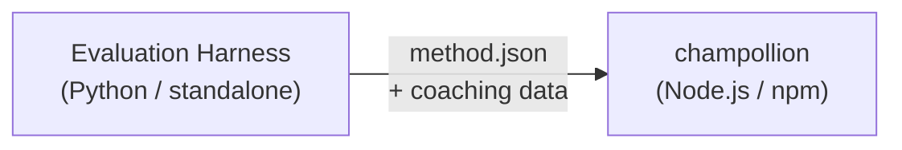

# Especificación de Plugin de Método

> **Versión**: 1.1  
> **Audiencia**: Desarrolladores de plugins  
> **Esquema Canónico**: [`shared/schemas/champollion-plugin.schema.json`](https://github.com/gamedaysuits/Champollion/blob/main/cli/shared/schemas/champollion-plugin.schema.json)

## Descripción General

champollion utiliza un **sistema de métodos conectables**. Cada par de idiomas puede usar un método de traducción diferente (LLM, entrenado, convertidor de scripts, etc.). Los métodos se registran en `lib/translate.js` y se resuelven por par a través de `lib/pairs.js`.

El trabajo del arnés de evaluación es **desarrollar, probar y exportar** métodos de traducción. El trabajo de champollion es **consumir y ejecutar** los métodos. El plugin es **solo datos** — configuración, contenido de entrenamiento y resultados de evaluación comparativa. Sin código Python, sin dependencias del arnés.

### Flujo de Datos



El arnés desarrolla y prueba métodos en Python. Cuando un método está listo para implementación, el arnés exporta un manifiesto `method.json` y archivos de datos de entrenamiento opcionales. Champollion instala y ejecuta el método utilizando sus propias implementaciones de métodos integradas.

---

## Formato de Plugin de Método

Un plugin de método es un único archivo JSON (`method.json`) con archivos de datos de entrenamiento opcionales.

### `method.json` — Requerido

```json
{
  "name": "french-formal-v1",
  "type": "llm-coached",
  "version": "1.0.0",
  "description": "Formally-tuned French with terminology enforcement and grammar coaching",
  "author": "Plugin Author",

  "config": {
    "model": "google/gemini-3.5-flash",
    "temperature": 0.2,
    "batchSize": 80,
    "register": "formal",
    "coachingFile": null,
    "coachingPrompt": null,
    "promptContext": null,
    "qualityTier": null
  },

  "locales": ["fr"],

  "benchmarks": {
    "fr": {
      "date": "2026-05-11T00:00:00Z",
      "corpus_size": 500,
      "exact_match_rate": 0.42,
      "corpus_chrf": 72.3,
      "corpus_bleu": 45.1,
      "model": "google/gemini-3.5-flash",
      "harness_version": "1.0.0"
    }
  },

  "provenance": {
    "resources": [],
    "commercialReady": false,
    "flags": ["license-unclear"]
  },

  "coaching": {
    "dir": "coaching"
  }
}
```

### Referencia de Campos

| Campo | Tipo | Requerido | Descripción |
|-------|------|----------|-------------|
| `name` | string | ✅ | Identificador único del método (kebab-case) |
| `type` | string | ✅ | Tipo de método Champollion: `llm`, `llm-coached`, `api`, `google-translate`, `deepl`, `microsoft-translator`, `libretranslate`, `openai`, `anthropic`, `gemini` |
| `version` | string | ✅ | Versión Semver (p. ej. `1.0.0`) |
| `locales` | string[] | ✅ | Qué códigos de locale este método apunta (mínimo 1) |
| `description` | string | — | Descripción legible por humanos |
| `author` | string | — | Quién desarrolló/probó este método |
| `config.model` | string | — | Identificador de modelo OpenRouter |
| `config.temperature` | number | — | Temperatura de LLM (0.0–2.0, predeterminado: 0.3) |
| `config.batchSize` | number | — | Claves por lote de API (1–200, predeterminado: 80) |
| `config.register` | string \| null | — | Registro/tono de idioma objetivo (clave preestablecida o texto libre) |
| `config.coachingFile` | string \| null | — | Ruta al archivo de indicación de entrenamiento de texto libre (relativa a la raíz del proyecto) |
| `config.coachingPrompt` | string \| null | — | Texto de indicación de entrenamiento resuelto (leído de `coachingFile` en tiempo de ejecución) |
| `config.promptContext` | string \| null | — | Contexto de aplicación inyectado en el indicador del sistema (p. ej., "Descripciones de productos de comercio electrónico") |
| `config.qualityTier` | string \| null | — | Nivel de calidad de la evaluación comparativa (`standard`, `high`, `research`, `verified`) |
| `benchmarks` | object | — | Resultados de evaluación comparativa por locale del arnés de evaluación |
| `provenance` | object | — | Licencias y dependencias de recursos |
| `coaching.dir` | string | — | Ruta relativa al directorio de datos de entrenamiento |

:::info[Forma Canónica de MethodConfig]
El bloque `config` utiliza el **esquema MethodConfig canónico** — los mismos 8 campos utilizados en `champollion.config.json`, tarjetas de ejecución del arnés, `mt-eval export-config` y publicación/instalación de tabla de clasificación. Todos los campos siempre están presentes; los valores no utilizados son `null`. Esto asegura una transferencia sin fricción entre evaluación y producción.
:::

### Objeto de Evaluación Comparativa (por locale)

| Campo | Tipo | Requerido | Descripción |
|-------|------|----------|-------------|
| `date` | string | ✅ | Marca de tiempo ISO 8601 de la ejecución de evaluación comparativa |
| `corpus_size` | number | ✅ | Número de entradas evaluadas |
| `exact_match_rate` | number | ✅ | 0.0–1.0, proporción de coincidencias exactas |
| `corpus_chrf` | number | — | Puntuación chrF++ (0–100) |
| `corpus_bleu` | number | — | Puntuación BLEU (0–100) |
| `model` | string | ✅ | Modelo utilizado durante la evaluación |
| `harness_version` | string | ✅ | Versión del arnés de evaluación utilizado |

:::info[¿Qué métricas se muestran?]
El comando `champollion status` muestra **chrF++** y **tasa de coincidencia exacta** del bloque de evaluación comparativa. `corpus_bleu` se acepta en el manifiesto pero actualmente no se muestra ni es utilizado por ningún comando de champollion. La [Tabla de Clasificación de Métodos](/leaderboard) rastrea chrF++, coincidencia exacta y tasa de aceptación de FST.
:::

---

### Objeto de Procedencia

El bloque de procedencia comunica el estado de licencia de los recursos incluidos en el plugin.

| Campo | Tipo | Predeterminado | Descripción |
|-------|------|---------|-------------|
| `resources` | object[] | `[]` | Lista de recursos incluidos con `name`, `license` y `type` |
| `commercialReady` | boolean | `false` | Si el plugin está autorizado para distribución comercial |
| `flags` | string[] | `["license-unclear"]` | Banderas de estado legibles por máquina |

**Estado predeterminado** — los plugins exportados se envían con `commercialReady: false` y `flags: ["license-unclear"]`.

**Estado autorizado** — cuando la licencia ha sido verificada: establezca `commercialReady: true` y borre las banderas.

---

## Formato de Datos de Entrenamiento

Si `type` es `llm-coached`, el plugin debe incluir archivos de datos de entrenamiento en el subdirectorio `coaching/`.

### `coaching/<locale>.json`

```json
{
  "grammar_rules": [
    "French adjectives agree in gender and number with the noun they modify",
    "Use 'vous' for formal contexts, 'tu' for informal"
  ],
  "dictionary": {
    "dashboard": "tableau de bord",
    "deployment": "déploiement",
    "settings": "paramètres"
  },
  "style_notes": "Prefer active voice. Avoid anglicisms where a native French term exists."
}
```

| Campo | Tipo | Requerido | Descripción |
|-------|------|----------|-------------|
| `grammar_rules` | string[] | — | Reglas inyectadas en cada indicación de LLM para este locale |
| `dictionary` | object | — | Mapa término → traducción. Los términos coincidentes se inyectan como terminología requerida. |
| `style_notes` | string | — | Instrucciones de estilo de forma libre anexadas al indicador |

---

## Estructura de Directorio

```
french-formal-v1/
  method.json                 # Method manifest with benchmarks
  coaching/
    fr.json                   # Coaching data for French
```

Para métodos de múltiples locales:

```
european-formal-v2/
  method.json                 # locales: ["fr", "de", "es", "it"]
  coaching/
    fr.json
    de.json
    es.json
    it.json
```

---

## Cómo Champollion Consume Plugins

### Instalación

```bash
champollion plugin install ./french-formal-v1/
```

Se guarda en `.champollion/methods/french-formal-v1/`.

### Configuración

```json title="champollion.config.json"
{
  "pairs": {
    "en:fr": {
      "methodPlugin": "french-formal-v1"
    }
  }
}
```

:::info[Semántica de fusión]
El plugin define *qué* método usar (`type`). La configuración del par ajusta *cómo* ejecutarlo (`model`, `register`, `batchSize`). Si el par establece `model`, anula el predeterminado del plugin.
:::

### Tiempo de Ejecución

1. Champollion lee `method.json` de `.champollion/methods/french-formal-v1/`
2. El campo `type` del plugin establece el método de traducción (p. ej., `llm-coached`)
3. Carga datos de entrenamiento del directorio `coaching/` del plugin
4. Utiliza el bloque `config` para llenar vacíos en modelo/registro/temperatura
5. El bloque `benchmarks` se muestra en la salida `champollion status`
6. El bloque `provenance` se verifica por `champollion provenance` para banderas de licencia

---

## Validación de Esquema

Los manifiestos de plugins se validan en tiempo de instalación contra [`shared/schemas/champollion-plugin.schema.json`](https://github.com/gamedaysuits/Champollion/blob/main/cli/shared/schemas/champollion-plugin.schema.json).

Haga referencia al esquema en su `method.json` para autocompletado de IDE:

```json
{
  "$schema": "./node_modules/champollion/shared/schemas/champollion-plugin.schema.json",
  "name": "my-method-v1"
}
```

---

## Qué NO Incluir

- ❌ Sin código Python ni dependencias del arnés
- ❌ Sin datos de corpus sin procesar ni registros de ejecución
- ❌ Sin claves de API ni credenciales
- ❌ Sin configuración del arnés
- ❌ Sin plantillas de indicación internas (esas viven en las implementaciones de métodos de champollion)

El plugin es **solo datos**: configuración, contenido de entrenamiento y resultados de evaluación comparativa.

---

## Véase También

- [Métodos de Traducción](/docs/guides/translation-methods) — cómo funciona cada método integrado
- [Configuración](/docs/getting-started/configuration) — configuración por par y por idioma
- [Servir un Método a través de API](/docs/guides/serving-a-method) — alojar métodos como servicios HTTP
- [Libro de Recetas: Pipeline Controlado por FST](/docs/network/tutorials/fst-gated-pipeline) — construir y empaquetar un pipeline
- [Evaluación de MT](/docs/network/leaderboard/rules) — evaluación comparativa de métodos para envío a tabla de clasificación
- [Apoyar un Idioma de Pocos Recursos](/docs/network/community/low-resource-languages) — el caso de uso para plugins comunitarios
