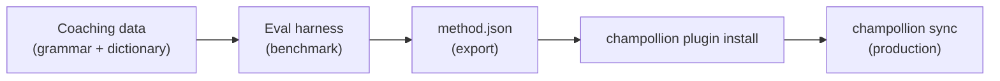

# Tutorial: Construir un Plugin de Traducción

Construya un método de traducción personalizado desde cero, evalúelo y despliéguelo como un plugin de champollion. Este es el flujo de trabajo completo para agregar un nuevo par de idiomas que ninguna API lista para usar soporta.

**Lo que construirá:** Un plugin de traducción guiada para francés formal con terminología reforzada, reglas gramaticales y puntuaciones de evaluación.

**Tiempo:** 30–45 minutos

**Requisitos previos:**
- champollion instalado (`npm install --save-dev champollion`)
- Una clave de API de OpenRouter (`OPENROUTER_API_KEY`)
- Python 3.10+ (para el harness de evaluación)

---

## Paso 1: Identificar el Problema

Está traduciendo un panel de control SaaS al francés. El método `llm` predeterminado produce traducciones correctas pero inconsistentes:

- A veces "dashboard" se convierte en "tableau de bord," otras veces en "panneau de contrôle"
- El tono alterna entre formas `tu` y `vous`
- Los términos técnicos se anglicizan de manera inconsistente

Necesita **refuerzo de terminología** y **control de registro** que el prompt genérico del LLM no proporciona.

## Paso 2: Crear Datos de Guía

Cree un archivo de guía que codifique sus requisitos lingüísticos:

```bash
mkdir -p .champollion/coaching
```

```json title=".champollion/coaching/fr.json"
{
  "grammar_rules": [
    "Always use the 'vous' form for formal register",
    "French adjectives agree in gender and number with their noun",
    "Use the present tense for UI instructions, not the imperative",
    "Preserve sentence-final punctuation style from the source"
  ],
  "dictionary": {
    "dashboard": "tableau de bord",
    "deployment": "déploiement",
    "settings": "paramètres",
    "environment variable": "variable d'environnement",
    "webhook": "webhook",
    "API key": "clé API",
    "sign in": "se connecter",
    "sign out": "se déconnecter",
    "repository": "dépôt",
    "pull request": "demande de tirage"
  },
  "style_notes": "Formal technical French. Prefer native French terms over anglicisms where established equivalents exist. Keep UI labels concise — 3 words maximum where possible."
}
```

**Lo que hace cada campo:**
- **`grammar_rules`** — Inyectado en el prompt del sistema del LLM como restricciones explícitas
- **`dictionary`** — Coincidido contra claves de origen; cuando aparece un término del diccionario, se inyecta como "terminología requerida" en el prompt
- **`style_notes`** — Añadido al prompt del sistema como orientación de estilo general

## Paso 3: Configurar el Par

Indique a champollion que use `llm-coached` para francés:

```json title="champollion.config.json"
{
  "version": 3,
  "inputLocale": "en",
  "localesDir": "./locales",
  "pairs": {
    "en:fr": {
      "method": "llm-coached",
      "model": "google/gemini-3.5-flash",
      "temperature": 0.2
    }
  },
  "languages": {
    "fr": {
      "register": "Formal technical French (vous-form)",
      "name": "French"
    }
  }
}
```

## Paso 4: Probarlo

```bash
npx champollion sync --dry
```

Revise la salida de ejecución en seco. Verifique que:
- ✅ Los términos del diccionario se usen consistentemente ("tableau de bord," no "panneau de contrôle")
- ✅ La forma `vous` se use en todo
- ✅ Los términos técnicos coincidan con su diccionario

Luego ejecute la sincronización real:

```bash
npx champollion sync
```

## Paso 5: Evaluar con el Harness de Evaluación (Opcional)

Si desea puntuaciones de calidad — y debería, porque los plugins se envían con datos de evaluación — use el harness de evaluación complementario.

### Instalar el Harness

```bash
pip install mt-eval-harness
```

### Crear un Corpus de Referencia

Cree un archivo con cadenas de origen y traducciones conocidas como correctas:

```json title="corpus/french-formal.json"
[
  {
    "source": "Dashboard",
    "reference": "Tableau de bord"
  },
  {
    "source": "Sign in to your account",
    "reference": "Connectez-vous à votre compte"
  },
  {
    "source": "Your deployment is ready",
    "reference": "Votre déploiement est prêt"
  },
  {
    "source": "Environment variables",
    "reference": "Variables d'environnement"
  }
]
```

### Ejecutar la Evaluación

```bash
mt-eval test \
  --corpus corpus/french-formal.json \
  --source en \
  --target fr \
  --model google/gemini-3.5-flash \
  --temperature 0.2 \
  --champollion-config champollion.config.json
```

El harness genera:
- **chrF++** — Puntuación F a nivel de carácter (0–100). Por encima de 70 es sólido.
- **BLEU** — Superposición de n-gramas (0–100). Por encima de 40 es bueno para traducción guiada.
- **Tasa de coincidencia exacta** — Proporción de traducciones que coinciden exactamente con la referencia.
- **COMET** — Métrica de calidad neuronal (si se instala mediante `mt-eval setup --comet`).

:::tip[Pruebe Lo Que Envía]
Usar `--champollion-config` importa su modelo de producción, registro, temperatura y datos de guía directamente desde su `champollion.config.json`. Esto asegura que esté evaluando el método exacto que desplegará.
:::

### Exportar el Plugin

Una vez que esté satisfecho con las puntuaciones:

```bash
mt-eval export \
  --name french-formal-v1 \
  --report eval/logs/harness/run_report.json \
  --output ./french-formal-v1/
```

Esto crea:

```
french-formal-v1/
├── method.json          # Manifest with config + benchmarks
└── coaching/
    └── fr.json          # Your coaching data
```

## Paso 6: Instalar el Plugin en Champollion

```bash
npx champollion plugin install ./french-formal-v1/
```

Esto copia el plugin a `.champollion/methods/french-formal-v1/`.

Actualice su configuración para usarlo:

```json title="champollion.config.json"
{
  "pairs": {
    "en:fr": {
      "methodPlugin": "french-formal-v1"
    }
  }
}
```

## Paso 7: Verificar

```bash
# Check plugin is installed and shows benchmark scores
npx champollion status

# Run a sync with the plugin
npx champollion sync

# Audit licensing status
npx champollion provenance
```

La salida `status` mostrará:

```
en → fr
  Method:    french-formal-v1 (llm-coached)
  Model:     google/gemini-3.5-flash
  Quality:   high
  chrF++:    74.2
  BLEU:      46.8
  Exact:     42%
```

## Lo Que Ha Construido



Ahora tiene:
1. **Datos de guía** — Reglas gramaticales y terminología que refuerzan la consistencia
2. **Puntuaciones de evaluación** — Calidad cuantificada que se envía con el plugin
3. **Un plugin portátil** — `method.json` + datos de guía, instalable en cualquier máquina
4. **Despliegue en producción** — Integrado en su pipeline de sincronización

## Próximos pasos

- **[Especificación de Plugin](/docs/reference/plugin-spec)** — Referencia completa del formato de manifiesto
- **[Métodos de Traducción](/docs/guides/translation-methods)** — Compare los cuatro métodos
- **[Idiomas de Bajo Recurso](/docs/network/community/low-resource-languages)** — Aplique este patrón a idiomas sin cobertura de API
- **[Traducir 30 Idiomas](/docs/tutorials/translate-30-languages)** — Escale su proyecto a una audiencia global
