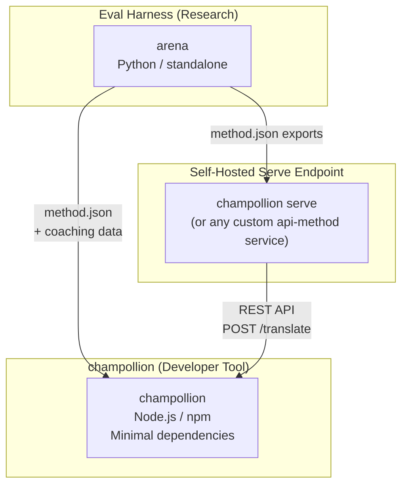
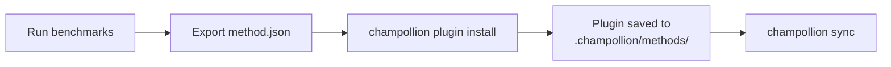
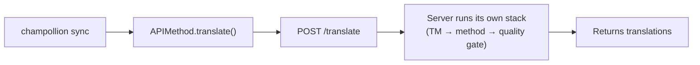
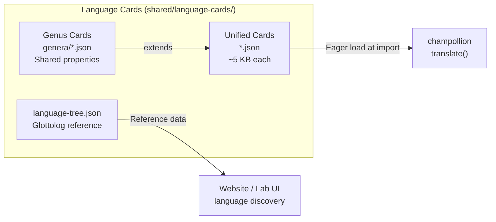

# Arkitektura

Ang ecosystem ng pagsasalin ng Champollion ay binubuo ng tatlong independiyenteng tool na nagtutulungan sa pamamagitan ng malinaw na tinukoy na mga contract. Wala sa mga ito ang umaasa sa isa’t isa sa build time. Nakikipag-ugnayan ang mga ito sa pamamagitan ng iisang **method plugin format** at **REST API contract**.

## Ang Tatlong Bahagi



### champollion (ang proyektong ito)

Ang source-available na developer tool (libre po para sa hindi komersyal na paggamit). Nagsasalin po ito ng mga locale file gamit ang mga pluggable na method. May minimal na mga dependency, config-optional, at gumagana agad out of the box.

**Mga built-in na method:**
- `llm` → OpenRouter / anumang LLM (200+ modelo)
- `llm-coached` → LLM + coaching sa gramatika/diksyonaryo
- `openai` → Direktang OpenAI API (GPT-4o, GPT-4o-mini)
- `anthropic` → Direktang Anthropic API (Claude Sonnet, Haiku, Opus)
- `gemini` → Direktang Google Gemini API (Flash, Pro — may available na free tier)
- `google-translate` → Google Cloud Translation API v2
- `deepl` → DeepL API na may suporta sa glossary
- `microsoft-translator` → Azure Cognitive Services Translator
- `libretranslate` → Self-hosted LibreTranslate (AGPL, libre)
- `api` → Manipis na pipe papunta sa anumang remote REST endpoint

### Eval Harness (kasamang proyekto)

Isang research tool para sa pag-develop, pag-test, at pag-benchmark ng mga translation method. Kapag umabot ang isang method sa katanggap-tanggap na kalidad, nag-e-export ang harness ng **method plugin** — isang `method.json` manifest at mga opsyonal na coaching data file.

Hindi kailanman tumatakbo ang harness sa loob ng champollion. Isa itong hiwalay na tool na gumagawa ng static output (mga JSON file). Binabasa lamang ng Champollion ang mga file na iyon.

[→ Eval Harness sa GitHub](https://github.com/gamedaysuits/Champollion)

### Self-hosted na serve endpoint (`champollion serve`)

Maaari pong mag-serve ang anumang champollion project ng sarili nitong naka-configure na translation stack sa pamamagitan ng HTTP gamit ang isang command — [`champollion serve`](/docs/guides/serving-a-method#the-zero-code-path-champollion-serve) — at maaari po itong i-consume ng anumang iba pang project sa pamamagitan ng `api` method. Ang mga prompt, coaching data, Translation Memory, at provider keys ay mananatili po sa imprastraktura ng may-ari; ang mga consumer ay nagpapadala lamang ng mga source string at tumatanggap ng mga pagsasalin. Ang mga pipeline na ganap na nasa labas ng champollion (isang FST chain, isang research system) ay maaari pong magpatupad ng parehong kontrata bilang isang [custom service](/docs/guides/serving-a-method). Walang naka-host na Champollion service — ang pag-serve ay palaging self-hosted, by design.

## Paano Sila Nag-uugnayan

### Eval Harness → champollion (one-way export)



**Contract**: [Plugin Specification](/docs/reference/plugin-spec)

### Serve endpoint → champollion (API sa runtime)



Ang `APIMethod` ng Champollion ay isang **dumb pipe**. Nagpapadala ito ng mga key palabas at tumatanggap ng mga salin pabalik. Wala itong translation logic at wala rin itong proprietary content.

## Ano ang Alam ng Bawat Bahagi Tungkol sa Iba

| Tool | Nakakaalam sa champollion? | Nakakaalam sa isang serve endpoint? | Nakakaalam sa harness? |
|------|---------------------|-------------------------------|---------------------|
| **champollion** | *(ito ang champollion)* | Oo — tinatawag ito ng `api` method | Hindi — binabasa lang ang mga plugin export |
| **Serve endpoint** | Oo — nagse-serve ng mga request nito | *(ito ang serve endpoint)* | Hindi — nag-i-install ng mga na-export na method tulad ng anumang project |
| **Eval Harness** | Oo — nag-e-export ng plugin format | Hindi — hiwalay na naka-deploy ang mga method | *(ito ang harness)* |

## Mga Senaryo ng User

### Senaryo 1: Libre, zero-config (karamihan ng mga user)

```bash
export OPENROUTER_API_KEY=sk-...
npx champollion sync
```

Gumagamit po ng built-in na `llm` method. Walang mga plugin, walang server, walang harness.

### Senaryo 2: Google Translate baseline

```bash
export GOOGLE_TRANSLATE_API_KEY=AIza...
npx champollion sync
```

Gumagamit ng built-in na `google-translate` method. Walang kinakailangang plugins.

### Senaryo 3: Open plugin na may kasamang coaching

```bash
champollion plugin install ./french-formal-v1/
champollion sync
```

May `type: "llm-coached"` ang plugin → ginagamit ng champollion ang sariling OpenRouter key ng user. Lokal ang coaching data (walang server call).

### Senaryo 4: DIY coaching (walang plugin, walang harness)

```json title="champollion.config.json"
{
  "pairs": {
    "en:fr": { "method": "llm-coached" }
  }
}
```

Pinananatili ng user ang sarili nilang mga grammar rule at diksyonaryo sa `.champollion/coaching/fr.json`.

### Scenario 5: I-consume ang naka-serve na stack ng ibang project

```bash
champollion plugin install ./their-project-serve/   # manifest from `champollion serve --emit-manifest`
CHAMPOLLION_API_KEY=<their bearer token> champollion sync
```

Ang `api` method ng pares ay nagpo-POST po ng mga source string sa kanilang self-hosted na [`champollion serve`](/docs/guides/serving-a-method#the-zero-code-path-champollion-serve) endpoint; ang kanilang stack (coaching, TM, quality gate) po ang gumagawa ng pagsasalin.

## Mga Language Card

Ang bawat wika sa champollion ay kino-configure sa pamamagitan ng **Language Card** — isang pinag-isang JSON file na naglalaman ng mga register preset, formality rule, method support flag, typography convention, genealogical classification, at linguistic reference data.



Kaagad na nilo-load ang mga card sa import. Naglalaman ang bawat card ng lahat ng metadata na kailangan ng translation engine at developer docs — walang hiwalay na reference tier. Binubuo ang mga card mula sa mga awtoritatibong source (IANA, CLDR, [Glottolog](https://glottolog.org), [WALS](https://wals.info)) gamit ang `scripts/generate-language-card.mjs` at `scripts/build-language-tree.mjs`, pagkatapos ay sinusuri at inaayos ng tao para sa katumpakang lingguwistiko.

## Mga Prinsipyo ng Disenyo

1. **Walang mga circular dependency.** One-way po ang mga tulay.
2. **Ang Champollion po ay ang lightweight na core.** Minimal ang mga dependency, config-optional. Additive po ang mga plugin at API.
3. **Architectural po ang proteksyon ng IP.** Mananatili po sa serving side ang mga proprietary na technique — kung sino man po ang nagpapatakbo ng endpoint ay siyang nagtatago ng kanilang mga prompt, coaching, at mga key. Wala pong ipinapadalang proprietary ang npm package.
4. **Ang plugin format po ay ang kontrata.** Ang lahat ay dumadaloy sa pamamagitan ng `method.json`.
5. **May iisang trabaho po ang bawat tool.** Harness → bumuo ng mga method. `champollion serve` → mag-host ng mga method. Champollion → magsalin ng mga file.

---

## Tingnan Din

- [Mga Translation Method](/docs/guides/translation-methods) — kung paano gumagana ang bawat built-in na method
- [Plugin Specification](/docs/reference/plugin-spec) — ang method.json manifest format
- [Eval Harness](/docs/network/specifications/harness) — ang kasamang research tool
- [Pag-serve ng Method sa pamamagitan ng API](/docs/guides/serving-a-method) — pag-host ng mga custom translation pipeline
- [Sumuporta sa Low-Resource Language](/docs/network/community/low-resource-languages) — ang use case na nagtulak sa arkitekturang ito
