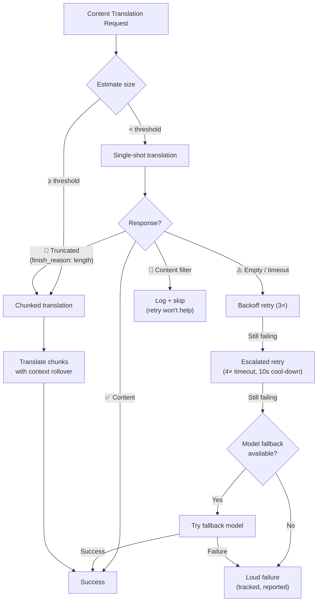

# Katatagan ng Pagsasalin ng Content

Ang pipeline ng pagsasalin ng content ng Champollion (mga dokumentong Markdown/MDX) ay gumagamit ng multi-layered na sistema ng katatagan upang maayos na mahawakan ang mga failure. Hindi tulad ng key-value translation — kung saan maliit ang bawat batch at mura ang mga retry — ang pagsasalin ng content ay may malalaking prompt at mahahabang output na maaaring mabigo dahil sa mga istruktural na dahilan, hindi lamang dahil sa mga pansamantalang dahilan.

## Ang Problema

Ang pagsasalin ng content ay may mga failure mode na pundamental na naiiba sa key-value translation:

| Failure Mode | Key-Value | Content |
|---|---|---|
| Rate limit (429) | Karaniwan, pansamantala | Karaniwan, pansamantala |
| Timeout | Bihira (maliliit na batch) | Karaniwan (mahabang output) |
| Empty response | Bihira | Karaniwan (mga limitasyon sa output, mga filter) |
| Output truncation | N/A (JSON validated) | Nangyayari nang tahimik |
| Content filter | Napakabihira | Posible (CLI docs, security docs) |
| Model limitation | Naaayos ito ng retry | Hindi ito maaayos ng pag-retry |

Ang pangunahing insight: **ang pag-retry ng parehong nabibigong request ay hindi redundancy, ito ay pagpupumilit.** Tinutukoy ng maayos na resilience system kung *bakit* nabigo ang isang bagay at binabago nito ang approach nang naaayon.

## Pangkalahatang-tingin sa Architecture



## Layer 1: Retry na Nauuna ang Diagnostic

Bago magpasya kung *paano* magre-retry, sinusuri ng system ang API response upang maunawaan kung *ano* ang nabigo.

### Pagsusuri ng Finish Reason

Bawat LLM API ay nagbabalik ng `finish_reason` kasama ng nabuong text. Ginagamit ito ng Champollion upang gumawa ng matatalinong retry decision:

| `finish_reason` | Kahulugan | Aksyon |
|---|---|---|
| `stop` + content | Normal na nakumpleto ng model | ✅ Tanggapin ang resulta |
| `stop` + empty | Walang nabuong anuman ang model | ⚠️ I-retry ang parehong request (pansamantala) |
| `length` | Naabot ng output ang token limit | 🔶 Awtomatikong i-chunk ang dokumento |
| `content_filter` | Hinarang ng safety filter ang output | 🔴 I-log at laktawan (hindi makakatulong ang retry) |
| `null` / missing | Malformed response | ⚠️ I-retry ang parehong request (pansamantala) |

Pinapalitan nito ang kasalukuyang approach na ituring ang bawat failure nang magkapareho gamit ang backoff retries.

### Retry Budget

Ang karaniwang retry budget para sa mga pansamantalang failure:

| Round | Attempts | Timeout | Backoff |
|---|---|---|---|
| Standard | 4 (0→3) | 60s | 1s → 2s → 4s |
| Escalated | 4 (0→3) | 120s | 1s → 2s → 4s |
| **Total** | **8** | — | **~3.5 min worst case** |

Sa pagitan ng mga round, may 10-segundong cool-down upang mabigyan ng panahon na maresolba ang mga pansamantalang isyu.

## Layer 2: Content Chunking

Kapag lumampas ang isang dokumento sa size threshold — o kapag nag-signal ang Layer 1 ng output truncation — hinahati ng system ang dokumento sa mga chunk na angkop sa pagsasalin.

Tingnan ang [Context Rollover](/docs/concepts/context-rollover#content-chunking) para sa detalyadong configuration ng chunking. Ang mahahalagang punto:

### Splitting Strategy

1. **Mga heading boundary** — ang `##` at `###` ay mga natural na boundary ng translation unit. Sapat na self-contained ang bawat section para sa independent translation.
2. **Paragraph fallback** — kung lumampas sa chunk size ang isang heading section, hatiin sa double newlines.
3. **Hard split** — huling remedyo para sa napakahahabang paragraph (hal., mga table). Hatiin sa sentence boundaries.

### Context sa Pagitan ng mga Chunk

Tumatanggap ang bawat chunk ng huling 2-3 paragraph ng *translation ng nakaraang chunk* bilang context. Pinipigilan nito ang:
- **Terminology drift** — nakikita ng model kung ano ang itinawag nito sa "tableau de bord" sa nakaraang chunk
- **Pronoun resolution** — naipapasa ang mga antecedent mula sa nakaraang section
- **Register consistency** — nananatili ang tonong naitatag sa chunk 1 hanggang chunk N

### Mga Trigger ng Auto-Chunking

| Trigger | Behavior |
|---|---|
| Naka-set ang `contentChunkSize` sa config | Palaging i-chunk ang docs na lumalampas sa size na iyon |
| Ibinalik ang `finish_reason: "length"` | Awtomatikong i-chunk bilang fallback (kahit walang config) |
| Input > ~12KB (auto-detect) | Mag-log ng mungkahi, ngunit huwag pilitin |

## Layer 3: Model Fallback Chain

Kapag tuloy-tuloy na nabibigo ang naka-configure na model — hindi pansamantala, kundi istruktural — susubukan ng system ang mga alternatibong model. May magkakaibang context window, output limit, safety filter, at multilingual strength ang iba’t ibang model.

### Default Fallback Chain

```json title="champollion.config.json"
{
  "contentFallbackChain": [
    "google/gemini-2.5-flash",
    "anthropic/claude-sonnet-4"
  ]
}
```

Palaging unang sinusubukan ang naka-configure na model. Ginagamit lamang ang mga fallback model matapos maubos ang lahat ng retry round (standard + escalated).

### Bakit Maraming Architecture

| Scenario | Nabibigo ang Primary Model | Nagtatagumpay ang Fallback Model |
|---|---|---|
| Vietnamese CLI docs | Nagbabalik ng empty ang Gemini | Maayos itong nahahawakan ng Claude |
| Safety-filtered content | Hinaharang ito ng OpenAI | May ibang filter threshold ang Gemini |
| Mahahabang structured table | Nagtu-truncate ang Model A | Mas malaki ang output window ng Model B |

Ang halaga ng fallback ay architectural diversity — may magkakaibang failure mode ang iba’t ibang model family. Ang failure na istruktural para sa isang model ay maaaring trivial para sa iba.

### Saklaw

> Ang model fallback ay **content-only**. Maliit ang mga key-value batch at halos hindi kailanman nabibigo nang istruktural. Ang pagdaragdag ng fallback complexity doon ay magiging over-engineering.

## Layer 4: Failure Accounting

Kapag may mga failure, sinusubaybayan at iniuulat ng system ang mga ito nang maayos sa halip na tahimik na magpatuloy.

### Habang Nagsi-sync

- Ipinapakita ng mga failed item ang `[FAIL]` sa progress output
- Ini-log ng bawat failure ang partikular na dahilan (timeout, empty response, content filter, truncation)
- Agad na sine-save ang mga completed item sa manifest (incremental persistence)

### Pagkatapos ng Sync

Nagpi-print ng failure summary sa dulo:

```
  ┌─ Content Translation Failures ─────────────────────────────────────┐
  │                                                                     │
  │  2 of 24 content translations failed:                              │
  │                                                                     │
  │  ✗ docs/reference/cli.md → vi                                      │
  │    Reason: empty response after 8 attempts + 1 fallback model      │
  │    Models tried: google/gemini-3.1-pro-preview, gemini-2.5-flash   │
  │                                                                     │
  │  ✗ docs/guides/troubleshooting.md → ar                             │
  │    Reason: content_filter (no retry — blocked by safety filter)    │
  │                                                                     │
  │  Re-run: npx champollion@latest sync                              │
  │  (22 completed translations are cached and won't re-run)           │
  └─────────────────────────────────────────────────────────────────────┘
```

### Retry Manifest

Isinusulat ang mga failed file sa `.champollion-retry.json`:

```json
{
  "failedAt": "2026-05-27T21:45:00Z",
  "files": [
    {
      "source": "docs/reference/cli.md",
      "locale": "vi",
      "reason": "empty_response",
      "attempts": 8,
      "modelsTried": ["google/gemini-3.1-pro-preview", "google/gemini-2.5-flash"]
    }
  ]
}
```

Sa susunod na pagtakbo ng `sync`, ang mga file na ito lamang ang muling ipoproseso. Pinapanatili ang mga completed file sa pamamagitan ng content hash manifest (`.champollion-content.lock`).

### Exit Codes

| Code | Kahulugan |
|---|---|
| 0 | Naging matagumpay ang lahat ng translation |
| 1 | Configuration error, nawawalang API key, atbp. |
| 2 | Partial failure — nabigo ang ilang content translation |

## Configuration

```json title="champollion.config.json"
{
  "contentChunkSize": 4000,
  "contentOverlap": 200,
  "contentFallbackChain": [
    "google/gemini-2.5-flash",
    "anthropic/claude-sonnet-4"
  ]
}
```

| Field | Type | Default | Description |
|---|---|---|---|
| `contentChunkSize` | `number \| null` | `null` | Max tokens kada content chunk. `null` = walang chunking (auto-chunks lamang kapag may truncation) |
| `contentOverlap` | `number` | `200` | Mga overlap token sa pagitan ng mga content chunk para sa context continuity |
| `contentFallbackChain` | `string[]` | `[]` | Mga fallback model na susubukan kapag nabigo nang istruktural ang naka-configure na model |

## Status ng Implementation

| Feature | Status |
|---|---|
| Diagnostic-first retry (finish_reason parsing) | 🔲 Planned |
| Content chunking (heading/paragraph split) | 🔲 Planned |
| Context rollover sa pagitan ng mga chunk | 🔲 Planned |
| Model fallback chain | 🔲 Planned |
| Failure summary report | 🔲 Planned |
| Retry manifest (.champollion-retry.json) | 🔲 Planned |
| Exit code 2 para sa partial failures | 🔲 Planned |
| Escalation retry (extended timeout) | ✅ Implemented (v3.3.3) |
| Attempt-numbered retry messages | ✅ Implemented (v3.3.3) |
| Malinaw na failure sa content errors | ✅ Implemented (v3.3.3) |

## Tingnan Din

- [Context Rollover](/docs/concepts/context-rollover) — batching consistency at configuration ng content chunking
- [Paano Gumagana ang Sync](/docs/concepts/how-sync-works) — ang buong sync pipeline
- [Mga Paraan ng Translation](/docs/guides/translation-methods) — mga available na method at ang kanilang mga katangian
