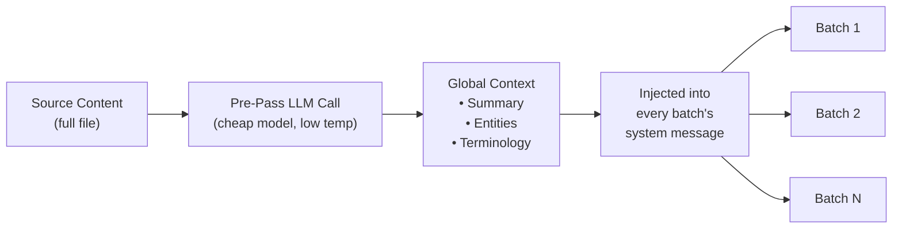

# Context Rollover Batching

Ang context rollover ay isang document-level translation consistency feature na nagdadala ng window ng mga naunang salin papunta sa mga susunod na batch, na nagbibigay sa LLM ng "short-term memory" sa mga hangganan ng batch.

## Bakit Ito Umiiral

Kapag nagsasalin ng malalaking file (100+ key o mahahabang Markdown document), hinahati ng champollion ang gawain sa mga batch. Kung walang rollover, isinasalin ang bawat batch nang hiwalay — walang memorya ang LLM kung ano ang isinalin nito sa naunang batch. Nagdudulot ito ng:

- **Terminology drift**: Naiiba ang salin ng parehong English term sa iba’t ibang batch (hal., "dashboard" → "tableau de bord" sa batch 1, "panneau" sa batch 3)
- **Coreference failure**: Nawawala ang antecedent ng mga panghalip at reference na tumatawid sa mga hangganan ng batch
- **Register inconsistency**: Maaaring magbago ang tono sa pagitan ng mga batch (formal → informal → formal)

Ito ay isang problemang mahusay na nadokumento sa literatura ng MT. Ang sliding window approach ay napatunayan ng pananaliksik sa document-level machine translation (ACL, WMT workshops).

## Paano Ito Gumagana

### Ang Sliding Window

Kapag naka-enable ang `contextRollover`, nagpapanatili ang translation pipeline ng window ng mga kamakailang naisaling key-value pair. Pagkatapos makumpleto ang bawat batch, dinadala ang isang bahagi ng output nito (default: 20% ng `batchSize`) papunta sa prompt ng susunod na batch bilang "reference translations."

```
Batch 1: Translate keys 1-80         → LLM sees: system prompt + keys 1-80
Batch 2: Translate keys 81-160       → LLM sees: system prompt + [16 reference translations from batch 1] + keys 81-160
Batch 3: Translate keys 161-240      → LLM sees: system prompt + [16 reference translations from batch 2] + keys 161-240
```

Iniinject ang reference translations sa user message na may malinaw na label:

```
--- Previous translations for context (do NOT re-translate these) ---
"nav.dashboard": "Tableau de bord"
"nav.settings": "Paramètres"
"header.welcome": "Bienvenue sur la plateforme"
---

{
  "content.main_heading": "Getting Started with Your Dashboard",
  ...
}
```

### Selection Strategy

Dalawang mode para piliin kung aling mga salin ang dadalhin pasulong:

| Strategy | Gawi | Pinakamainam Para sa |
|----------|----------|----------|
| `tail` (default) | Huling N salin mula sa naunang batch | Sequential documents, Markdown content |
| `diverse` | Pumipili ng mga entry na sumasaklaw sa iba’t ibang uri ng key (buttons, headings, descriptions) | Malalaking JSON file na may magkakahalong uri ng UI element |

### Token Budget

Kumokonsumo ng input tokens ang rollover window. Kinakalkula ng Champollion ang tinatayang token cost at nagbababala kung lumalampas ang window sa 15% ng tinatayang context window ng model. Kasama sa babala ang iminungkahing pagbawas:

```
[WARN] Rollover window is ~2400 tokens (18% of model context).
       Consider reducing rolloverSize to 0.15 or lowering batchSize.
```

## Global Context Pre-Pass

Isang opsyonal na first-pass LLM call na tumatakbo **bago** magsimula ang pagsasalin. Sinusuri ng LLM ang buong source content at gumagawa ng:

1. **Document Summary** — 2-3 pangungusap na paglalarawan ng isinasalin
2. **Named Entities** — Product names, technical terms, at proper nouns na may mungkahing paraan ng paghawak
3. **Terminology Consistency List** — Mga key term na tinukoy ng LLM bilang nangangailangan ng consistent na salin

Ini-inject ang global context na ito sa **system message** ng bawat batch, na nagbibigay sa bawat batch ng kamalayan sa buong document kahit slice lamang ang nakikita nito.



### Pre-Pass Model

Gumagamit ang global context extraction ng hiwalay at murang LLM call (default: `google/gemini-3.5-flash` sa temperature 0.1) anuman ang configured translation model ng user. Ito ay metadata extraction task, hindi translation task — mas mahalaga ang bilis at gastos kaysa creative output.

## Content Chunking {#content-chunking}

Para sa mahahabang Markdown document (content translation), maaaring lumampas ang body sa effective context window ng LLM, o maaaring i-truncate ng model ang output nito. Hinahati ng content chunking ang document sa magkakapatong na segment na bawat isa ay isinasalin nang hiwalay, pagkatapos ay muling binubuo.

### Splitting Strategy

Sumusunod ang chunking sa priority cascade — sinusubukan muna nito ang pinakamasemantikong makabuluhang split point:

1. **Heading boundaries** — Ang mga marker na `##` at `###` ay lumilikha ng natural translation units. Sapat ang pagiging self-contained ng bawat section para sa independent translation, at nagbibigay ang headings sa LLM ng structural context tungkol sa isinasalin nito.
2. **Paragraph boundaries** — kung lumalampas sa chunk size ang isang heading section, hatiin sa double newlines (`\n\n`). Ang paragraphs ang susunod na pinakamahusay na boundary dahil kinakatawan ng mga ito ang kumpletong kaisipan.
3. **Sentence boundaries** — huling opsyon para sa napakahahabang paragraph (hal., malalaking table, siksik na prosa). Naghahati sa period-space boundaries habang iginagalang ang abbreviations.

Hindi kailanman hinahati ang protected blocks (code fences, shortcodes — tingnan ang [Paano Gumagana ang Sync](/docs/concepts/how-sync-works)) sa pagitan ng chunks. Kung matatamaan sa hiwa ang isang protected block, lilipat ang split point bago o pagkatapos nito.

### Auto-Chunking Triggers

Uma-activate ang chunking sa dalawang paraan:

| Trigger | Gawi |
|---------|----------|
| Naka-set ang `contentChunkSize` sa config | Proactively na i-chu-chunk ang lahat ng docs na lumalampas sa token count na iyon |
| Nagbabalik ang model ng `finish_reason: "length"` | Nag-aauto-chunk bilang fallback, kahit walang config |

Ibig sabihin ng fallback trigger, gumagana ang chunking bilang safety net kahit hindi po ninyo ito i-configure — kung mag-truncate ang model, awtomatikong susubok muli ang champollion gamit ang chunks.

### Configuration

- **`contentChunkSize`**: Maximum tokens bawat chunk (default: null = ipadala ang buong body; i-set sa hal., 4000 para sa mahahabang document)
- **`contentOverlap`**: Overlap sa tokens sa pagitan ng chunks (default: 200). Tinitiyak ng overlap ang maayos na transitions sa chunk boundaries.

Kapag active ang chunking, awtomatikong nalalapat ang context rollover sa pagitan ng chunks — ang naisaling output ng huling paragraph ng naunang chunk ay idinadagdag sa unahan ng prompt ng susunod na chunk.

```json title="champollion.config.json"
{
  "contentChunkSize": 4000,
  "contentOverlap": 200
}
```

> Para sa buong content translation resilience system (diagnostic retry, model fallback, failure accounting), tingnan ang [Content Resilience](/docs/concepts/content-resilience).

## Configuration

### Quick Start

```json title="champollion.config.json"
{
  "contextRollover": true,
  "globalContext": true,
  "contentChunkSize": 4000,
  "contentOverlap": 200
}
```

### Full Options

```json title="champollion.config.json (advanced)"
{
  "contextRollover": {
    "size": 0.2,
    "strategy": "tail",
    "maxTokens": null
  },
  "globalContext": {
    "model": "google/gemini-3.5-flash",
    "maxEntities": 20,
    "temperature": 0.1
  },
  "contentChunkSize": 4000,
  "contentOverlap": 200,
  "contentFallbackChain": [
    "google/gemini-2.5-flash",
    "anthropic/claude-sonnet-4"
  ]
}
```

| Field | Type | Default | Description |
|-------|------|---------|-------------|
| `contextRollover` | `boolean \| object` | `false` | I-enable ang sliding window rollover |
| `contextRollover.size` | `number` | `0.2` | Fraction ng `batchSize` na dadalhin pasulong (0.0–1.0) |
| `contextRollover.strategy` | `string` | `"tail"` | Selection strategy: `"tail"` o `"diverse"` |
| `contextRollover.maxTokens` | `number \| null` | `null` | Hard cap sa rollover token budget |
| `globalContext` | `boolean \| object` | `false` | I-enable ang global context pre-pass |
| `globalContext.model` | `string` | `"google/gemini-3.5-flash"` | Model para sa pre-pass call |
| `globalContext.maxEntities` | `number` | `20` | Maximum named entities na i-eextract |
| `globalContext.temperature` | `number` | `0.1` | Temperature para sa pre-pass call |
| `contentChunkSize` | `number \| null` | `null` | Max tokens bawat content chunk (null = walang chunking) |
| `contentOverlap` | `number` | `200` | Overlap tokens sa pagitan ng content chunks |
| `contentFallbackChain` | `string[]` | `[]` | Fallback models para sa content translation kapag structurally na nabigo ang configured model |

## Kailan Ito Gagamitin

| Scenario | Rekomendasyon |
|----------|---------------|
| Maliliit na JSON file (< 50 keys) | Hindi kailangan — single batch, walang boundary issues |
| Malalaking JSON file (100+ keys) | I-enable ang `contextRollover` para sa terminology consistency |
| Mahahabang Markdown document | I-enable ang `contextRollover` + `contentChunkSize` + `globalContext` |
| Technical documentation | I-enable ang `globalContext` para sa entity extraction |
| UI strings na may magkakahalong register | Gamitin ang `contextRollover` kasama ang `strategy: "diverse"` |

## Implementation Status

| Feature | Status |
|---------|--------|
| Sliding window rollover (key-value) | 🔲 Planned |
| Sliding window rollover (content) | 🔲 Planned |
| Global context pre-pass | 🔲 Planned |
| Content chunking | 🔲 Planned |
| Auto-chunking on truncation | 🔲 Planned |
| `diverse` selection strategy | 🔲 Planned |

## Literatura

Nakabatay ang feature na ito sa published research tungkol sa document-level machine translation:

- **Sliding window approach**: Napatunayang nakapagpapahusay ng BLEU, chrF, at COMET scores kapag gumagamit ng LLMs para sa translation (ACL 2023–2025 workshops sa document-level MT)
- **Multi-knowledge fusion**: Ang pag-inject ng document summaries at entity lists bilang global context ay nagpapahusay ng terminology consistency sa mahahabang document
- **Context-Aware Prompting (CAP)**: Pagpili ng relevant context sa pamamagitan ng attention scores o semantic similarity para sa in-context learning

## Tingnan Din

- [Content Resilience](/docs/concepts/content-resilience) — diagnostic retry, model fallback, at failure accounting
- [Paano Gumagana ang Sync](/docs/concepts/how-sync-works) — ang batch pipeline na pinalalawak ng rollover
- [Coaching Data](/docs/concepts/coaching-data) — complementary feature para sa grammar/dictionary injection
- [Translation Memory](/docs/concepts/translation-memory) — ang TM cache na gumagana kasabay ng rollover
