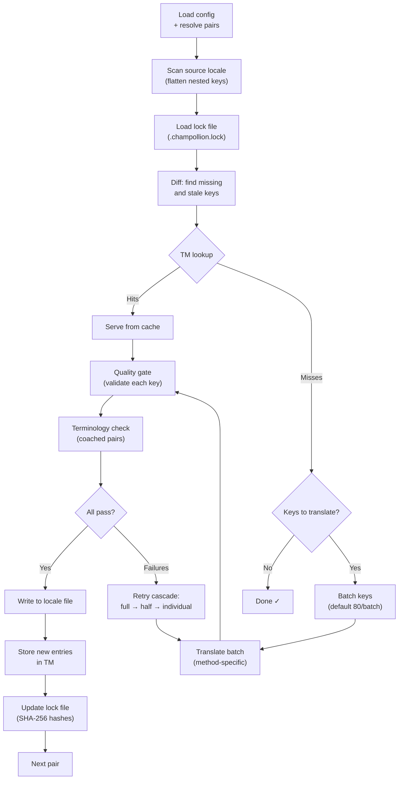

# Paano Gumagana ang Sync

Ang command na `sync` ang pangunahing operasyon ng champollion. Narito ang nangyayari kapag pinatakbo ninyo ang `npx champollion sync`.

## Pangkalahatang-ideya ng Pipeline



## Hakbang-hakbang

### 1. Pag-resolve ng Config

Nilo-load ng Champollion ang `champollion.config.json` (o awtomatikong dine-detect ang mga setting). Nire-resolve nito ang:
- Source locale at target locales
- Ang pair graph (kung aling mga kombinasyong source→target ang ipo-process)
- Method, model, at quality settings para sa bawat pair

Bago i-scan ang mga file, nagpi-print ang champollion ng startup header:

```
champollion v0.1.0

[INFO] Detected format: json (auto)
[INFO] Detected framework: Hugo
```

- **Version banner**: Ipinapakita ang naka-install na version para sa debugging at issue reports.
- **Format detection**: Iniuulat ang file format at kung ito ay awtomatikong na-detect `(auto)` o tahasang na-configure `(config)`. Sinusuportahan ang `json`, `toml`, at `yaml`.
- **Framework detection**: Kapag naka-set ang `contentDir`, tinutukoy ang framework (`Hugo`) upang kumpirmahing aktibo ang content sync.

### 2. Pag-scan ng Source

Nilo-load ang source locale file at fina-flatten ito sa isang key→value map:

```json
// Input (nested)
{ "hero": { "title": "Welcome", "subtitle": "Build" } }

// Flattened
{ "hero.title": "Welcome", "hero.subtitle": "Build" }
```

### 3. Change Detection

Binabasa ng Champollion ang `.champollion.lock`, na nag-iimbak ng mga SHA-256 hash ng mga source value na naisalin na dati. Para sa bawat key, sinusuri nito:

| Kundisyon | Aksyon |
|-----------|--------|
| Nawawala ang key sa target | **Isalin** |
| Nagbago ang source hash mula noong huling sync | **Isaling muli** (luma) |
| Nagsisimula ang target value sa `[EN]` | **Isaling muli** (legacy fallback marker) |
| Hindi nagbago ang source hash, umiiral ang key | **Laktawan** |

Ito ang dahilan kung bakit isinasalin lamang ng champollion ang nagbago — hindi nito muling isinasalin ang buong file ninyo sa bawat sync.

### 4. Batching

Pinagpapangkat ang mga key sa mga batch (default: 80 key/batch para sa LLM, 128 para sa Google Translate). Binabawasan ng batching ang API round trips habang pinananatiling madaling pamahalaan ang mga prompt.

Habang nagsasalin, nagpapakita ang champollion ng inline progress bar na nag-a-update pagkatapos makumpleto ang bawat batch:

```
[INFO] fr.json — 2,847 missing
     ████████████████░░░░░░░░░░░░░░░░ 1,440/2,847 keys
```

Nag-render ang bar gamit ang `\r` carriage return para sa in-place updates — walang scrolling. Naka-suppress sa mga mode na `--quiet` at `--json`.

### 4b. Translation Memory

Bago ang batching, sinusuri ng champollion ang Translation Memory cache (`.champollion/tm.json`). Ang mga key na tumutugma ang source text + locale + method sa dating translation ay agad na inihahatid mula sa cache — walang kinakailangang API call.

```
  [TM] 142 key(s) served from cache
  Translating 3 key(s) to French (llm)... [OK]
```

Ang TM ang pangunahing mekanismo para makatipid sa gastos. Kapag muling pinatakbo ang sync pagkatapos ng pagbabago sa iisang key, ang key lamang na iyon ang isasalin, hindi ang buong file. Tingnan ang [Translation Memory](/docs/concepts/translation-memory) para sa mga detalye.

Upang i-bypass ang cache para sa isang run: `champollion sync --no-tm`

### 5. Translation

Ipinapadala ang bawat batch sa naka-configure na translation method:

- **`llm`**: Structured prompt sa OpenRouter na may mga tagubilin sa register at gender guidance
- **`llm-coached`**: Pareho, ngunit may idinadagdag na grammar rules, dictionary, at style notes
- **`google-translate`**: Google Cloud Translation API v2 batch request
- **`api`**: HTTP POST sa isang remote endpoint

Ang system message (register, gender guidance, rules) ay pareho sa lahat ng batch para sa isang partikular na locale, na nagpapagana ng **prompt caching** — nag-cache ang mga provider tulad ng Anthropic at Google ng paulit-ulit na system messages, na nagpapababa ng token costs.

### 6. Quality Gate

Bine-validate ang bawat translation bago ito isulat sa disk. Limang check ang pinapatakbo:

| Check | Ano ang nahuhuli nito | Halimbawa |
|-------|------------------------|-----------|
| **Empty/blank** | Walang ibinalik ang model | `""` |
| **Source echo** | Ibinalik ng model ang English input | `"Welcome"` para sa Japanese |
| **Hallucination loop** | Paulit-ulit na trigrams | `"Qo' Qo' Qo' Qo'"` |
| **Length inflation** | Ang output ay 4×+ na mas mahaba kaysa source | 10-character source → 50-character output |
| **Script compliance** | Maling script para sa locale | Latin text para sa Arabic locale |

Nila-log ang mga failure na may prefix na `[GATE]`. Walang silent fallbacks.

Tingnan ang [Quality Gate](/docs/concepts/quality-gate) para sa mga detalye.

### 6b. Terminology Verification

Para sa mga coached pair na may dictionary, sinusuri ng champollion kung ginamit talaga ng LLM ang kinakailangang terminology pagkatapos ng translation. Nila-log ang mga violation bilang mga warning na `[TERM]`:

```
[TERM] en→fr: 2 term violation(s)
  • "dashboard" → expected "tableau de bord" but got "panneau"
```

Mga warning ang mga ito, hindi blocking errors — isusulat pa rin ang translation.

### 7. Retry Cascade

Kapag nabigo ang JSON parse o may batch-level errors, muling sumusubok ang champollion gamit ang paunti-unting mas maliliit na batch:

```
Full batch (80 keys) → Failed
  └→ Half batch (40 keys) → 1 failure
      └→ Individual keys (1 each) → Isolates the problem key
```

Nililimitahan ng `maxRetries` ang retry budget (default: 3) upang maiwasan ang runaway token spend.

### 8. Write & Lock

Isinusulat ang mga pumapasang translation sa target locale file, habang pinapanatili ang orihinal na nesting structure. Ina-update ang lock file gamit ang mga bagong SHA-256 hash.

### 9. Verification

Matapos ma-process ang lahat ng pair, muling binabasa ng champollion mula sa disk ang naisulat na locale files at nagpapatakbo ng verification pass (maliban kung naka-set ang `--no-verify`). Nahuhuli nito ang puwang sa pagitan ng pag-uulat ng sync na matagumpay ito at ng mga key na sa katunayan ay mali:

- **Key parity** — naroroon ang lahat ng source key sa bawat target
- **`[EN]` fallback markers** — legacy markers mula sa mga nakaraang run
- **Empty translations** — mga blank value na nakalusot
- **Script compliance** — non-Latin locales na may ASCII-only translations
- **Placeholder preservation** — tumutugma ang ICU placeholders sa source
- **Encoding issues** — BOM markers, invisible characters

Available din ito bilang standalone na command na `champollion verify` para sa CI gates.

## Content Translation (Phase 2)

Para sa mga proyektong Docusaurus at Hugo, nagpapatakbo ang `sync` ng ikalawang phase pagkatapos ng JSON key translation. Isinasalin ng phase na ito ang mga Markdown at MDX file (docs, blog posts, tutorials) gamit ang parehong methods at quality gate.

### Paano ito gumagana

1. Tinutuklasan ng Champollion ang lahat ng source content files (`.md`, `.mdx`) sa pamamagitan ng pag-walk sa content/docs directory
2. Para sa bawat file × locale pair, sinusuri nito ang hiwalay na content lock file (`.champollion-content.lock`) para sa mga pagbabago sa SHA-256 hash
3. Kinokolekta ang mga nagbago o nawawalang file sa isang flat work-item pool
4. Pino-process ang pool gamit ang **parallel concurrency** (default: 12 sabay-sabay na API calls)

```
Phase 2: content (79 translations to process, 341 skipped, concurrency: 48)

    [1/79] (1%)  docs/concepts/security.md → ja [RE-TRANSLATE] (~3328s left)
    [2/79] (3%)  docs/concepts/security.md → th [RE-TRANSLATE] (~1821s left)
    ...
    [79/79] (100%) blog/v3-2-quality.md → de [OK]

  [OK] Created 79 content file(s), 341 unchanged
```

### Parallelism

Parehong tumatakbo na ngayon nang parallel ang Phase 1 (JSON keys) at Phase 2 (content):

- **Phase 1**: Sabay-sabay na pinapatakbo ang lahat ng locale translations (default: 50 sabay-sabay na locales). Sa loob ng bawat locale, tumatakbo rin nang parallel ang mga API batch (4 concurrent batches). Nakukumpleto ang 12-locale sync na may 120 key sa ~1 minuto sa halip na ~15 minuto.
- **Phase 2**: Isinasalin ang lahat ng kombinasyong file×locale bilang isang flat pool (default: 12 sabay-sabay na API calls). Sabay-sabay na naisasalin ang magkakaibang file at magkakaibang locale.

Kontrolin ang parallelism gamit ang `--json-concurrency`, `--content-concurrency`, o `--concurrency` (sine-set ang pareho):

```bash
# Faster JSON sync (more parallel locale translations)
npx champollion sync --json-concurrency 30

# Faster content sync (more parallel API calls)
npx champollion sync --content-concurrency 20

# Slower (gentler on rate limits)
npx champollion sync --concurrency 4
```

### Content protection

Sa panahon ng translation, pinoprotektahan ng champollion ang content na hindi dapat isalin:

- **Code blocks** (fenced at indented) ay pinapalitan ng placeholders
- **Frontmatter** fields na wala sa listahang `translatableFields` ay pinapanatili nang as-is
- **Links**, image paths, at HTML tags ay pinoprotektahan
- **Shortcodes** at interpolation variables (hal., `{count}`, `{{.Params.title}}`) ay pinoprotektahan

Pagkatapos ng translation, ibinabalik at bine-validate ang lahat ng placeholders. Kung may nawawala o corrupt, nire-reject ang translation at sinusubukang muli.

## Partial Success

Hindi hinaharangan ng isang nabigong batch ang iba. Kung 9 sa 10 batch ang magtagumpay, isusulat ang 9 na iyon. Nila-log ang nabigong batch, at maaari ninyong muling patakbuhin ang `sync` upang subukang muli.

## Dry Run

I-preview kung ano ang magbabago nang hindi nagsusulat ng anumang file:

```bash
npx champollion sync --dry-run
```

## Force Re-translate

Pilitin ang mga partikular na key na muling isalin kahit hindi nagbago:

```bash
npx champollion sync --force-keys "hero.title,nav.about"
```

## Cost Estimation

Bago magsalin, gumagawa ang champollion ng **pre-sync cost report** na nagpapakita ng tinatayang gastos bawat pair. Awtomatiko itong tumatakbo sa bawat `sync` — makikita ninyo ito bago gumawa ng anumang API calls.

```
╔══════════════════════════════════════════════════════════╗
║  Cost Estimate                                          ║
╠════════════╦═══════╦════════════╦════════════════════════╣
║ Pair       ║ Keys  ║ Est. Cost  ║ Method                 ║
╠════════════╬═══════╬════════════╬════════════════════════╣
║ en → fr    ║   142 ║ $0.07      ║ google-translate       ║
║ en → ja    ║    38 ║   —        ║ llm (model-dependent)  ║
║ en → crk   ║    38 ║   —        ║ llm-coached            ║
╚════════════╩═══════╩════════════╩════════════════════════╝
```

### Ano ang Tinatantiya

Nagbibigay ang bawat translation method ng sarili nitong cost estimate:

| Method | Batayan ng Gastos | Katumpakan |
|--------|-------------------|------------|
| `google-translate` | Published rate ng Google ($20/milyong character) | Accurate |
| `llm` | Nag-iiba ayon sa OpenRouter model | Depende sa model — tingnan ang [OpenRouter pricing](https://openrouter.ai/models) |
| `llm-coached` | Pareho ng `llm` kasama ang coaching context tokens | Depende sa model |
| `api` | Tinutukoy ng server | Unknown — hindi matantya nang hindi kino-query ang endpoint |

Kapag hindi matukoy ng isang method ang cost (LLM methods, remote APIs), nag-uulat ang champollion ng `—` sa halip na manghula. Gamitin ang `--dry` upang makita ang cost estimates nang hindi aktuwal na nagsasalin.

---

## Tingnan Din

- [CLI Reference — sync](/docs/reference/cli#sync) — command flags at options
- [Translation Memory](/docs/concepts/translation-memory) — caching at cost savings
- [Quality Gate](/docs/concepts/quality-gate) — kung paano vine-validate ang translations
- [Translation Methods](/docs/guides/translation-methods) — kung paano gumagana ang bawat method
- [Paggawa Kasama ang Professional Translators](/docs/guides/professional-translators) — XLIFF workflow
- [Configuration](/docs/getting-started/configuration) — config reference
- [CI/CD Guide](/docs/guides/ci-cd) — pag-automate ng syncs sa inyong pipeline
