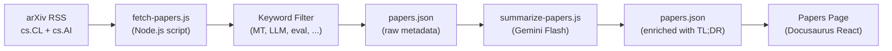

# Feed ng mga Research Paper

Ang Champollion ay nagpapanatili ng curated feed ng mga research paper tungkol sa machine translation at NLP mula sa arXiv, na sinala at binigyan ng buod para sa mga practitioner. Ang feed ay semi-automated: kinukuha at sinasala ang mga paper araw-araw, binibigyan ng buod gamit ang AI, at inilalathala sa website.

## Bakit Ito Mayroon

Ang translation pipeline ng champollion ay nakabatay sa mga teknik mula sa nailathalang pananaliksik — register-steered prompting, coaching data injection, context rollover, quality gates. May tatlong layunin ang Papers feed:

1. **Transparency**: Makikita ng mga user ang pananaliksik na sumusuporta sa bawat feature
2. **Discovery**: Maaaring makatulong ang mga bagong teknik na inilathala sa arXiv sa mga feature sa hinaharap o sa mga configuration ng user
3. **Community**: Ipinoposisyon ang champollion bilang tool na nakabatay sa pananaliksik, hindi lamang isa pang API wrapper

## Arkitektura



### Mga Hakbang ng Pipeline

#### 1. Kunin (Araw-araw)

Kinukuwestiyon ng `scripts/fetch-papers.js` ang arXiv Atom API para sa mga kamakailang paper sa:
- `cs.CL` (Computation and Language)
- `cs.AI` (Artificial Intelligence)

Ibinabalik: pamagat, mga may-akda, abstract, arXiv ID, PDF link, petsa ng paglalathala, mga category.

#### 2. Salain

Sinasala ang mga paper batay sa keyword relevance. Dapat tumugma ang isang paper sa hindi bababa sa isang pangunahing keyword:

**Mga pangunahing keyword** (dapat tumugma sa ≥1):
- `machine translation`, `neural machine translation`, `NMT`
- `LLM`, `large language model`
- `multilingual`, `cross-lingual`
- `document-level translation`
- `low-resource language`, `endangered language`
- `translation evaluation`, `BLEU`, `COMET`, `chrF`
- `tokenization`, `morphology`, `polysynthetic`
- `context window`, `sliding window`
- `prompt engineering` (sa konteksto ng pagsasalin)

**Mga boost keyword** (pinapataas ang relevance score):
- `i18n`, `internationalization`, `localization`
- `few-shot`, `in-context learning`
- `terminology`, `glossary`, `consistency`
- `quality estimation`, `hallucination`

#### 3. Ibuod (May Tulong ng AI)

Pinoproseso ng `scripts/summarize-papers.js` ang mga bagong paper (hindi pa nabibigyan ng buod):

Para sa bawat paper, ipinapadala ang abstract sa Gemini 3.5 Flash kasama ang:
```
Read this ML research abstract and produce:
1. A 2-sentence TL;DR accessible to a software developer (not a researcher)
2. A single bullet: "Why this matters for MT" — how could this technique
   improve machine translation quality, cost, or speed in production?

Abstract: {abstract}
```

Iniimbak muli ang output sa `papers.json` kasama ng raw metadata.

#### 4. Ilathala

Ire-render ng Docusaurus Papers page (`website/src/pages/papers.js`) ang `papers.json` bilang filterable at paginated na card grid.

Ipinapakita ng bawat card ang:
- **Pamagat** (naka-link sa arXiv)
- **Mga May-akda** (unang 3 + "et al.")
- **Petsa** (inilathala o huling na-update)
- **TL;DR** (binuo ng AI)
- **Bakit ito mahalaga** (binuo ng AI)
- **Mga Category** (arXiv tags)
- **PDF link**

### Automation

Araw-araw na pinapatakbo ng GitHub Actions workflow ang pipeline:

```yaml title=".github/workflows/fetch-papers.yml"
name: Fetch MT Research Papers
on:
  schedule:
    - cron: '0 6 * * *'  # 06:00 UTC daily
  workflow_dispatch: {}   # Manual trigger

jobs:
  fetch:
    runs-on: ubuntu-latest
    steps:
      - uses: actions/checkout@v4
      - uses: actions/setup-node@v4
        with:
          node-version: 20
      - run: node scripts/fetch-papers.js
      - run: node scripts/summarize-papers.js
        env:
          GEMINI_API_KEY: ${{ secrets.GEMINI_API_KEY }}
      - name: Commit if changed
        run: |
          git config user.name "github-actions[bot]"
          git config user.email "github-actions[bot]@users.noreply.github.com"
          git add website/src/data/papers.json
          git diff --cached --quiet || git commit -m "chore: update research papers feed"
          git push
```

## Data Schema

```typescript
interface Paper {
  id: string;           // arXiv ID (e.g., "2406.12345")
  title: string;
  authors: string[];
  abstract: string;
  published: string;    // ISO date
  updated: string;      // ISO date
  pdfUrl: string;
  categories: string[];
  primaryCategory: string;

  // Computed by filter
  relevanceScore: number;
  matchedKeywords: string[];

  // Computed by summarizer (null until processed)
  tldr: string | null;
  whyItMatters: string | null;
  summarizedAt: string | null;
}
```

## Mga Lokasyon ng File

| File | Layunin |
|------|---------|
| `scripts/fetch-papers.js` | arXiv RSS fetcher at keyword filter |
| `scripts/summarize-papers.js` | AI summarization sa pamamagitan ng Gemini |
| `website/src/data/papers.json` | Data ng paper (naka-commit sa repo) |
| `website/src/pages/papers.js` | Docusaurus page component |
| `website/src/pages/papers.module.css` | Mga style ng page |
| `.github/workflows/fetch-papers.yml` | Araw-araw na automation |

## Katayuan ng Implementasyon

| Feature | Katayuan |
|---------|--------|
| `fetch-papers.js` (arXiv fetch + filter) | 🔲 Nakaplano |
| `summarize-papers.js` (AI summary) | 🔲 Nakaplano |
| Papers page (React component) | 🔲 Nakaplano |
| GitHub Actions workflow | 🔲 Nakaplano |
| Category/keyword filtering sa page | 🔲 Nakaplano |
| Pagination | 🔲 Nakaplano |

## Tingnan Din

- [Arkitektura](/docs/concepts/architecture) — kung paano nag-uugnayan ang mga component ng champollion
- [Context Rollover](/docs/concepts/context-rollover) — isang feature na direktang hinubog ng research feed na ito
