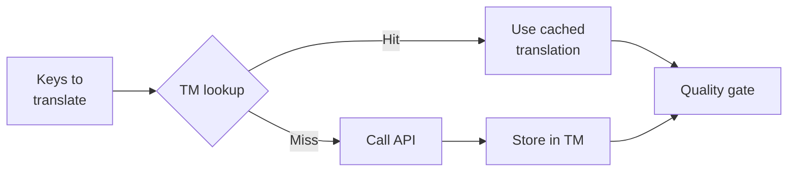

# Translation Memory

Ang Translation Memory (TM) ay ang built-in caching layer ng champollion. Iniimbak nito ang bawat salin batay sa source text + locale + method, kaya kapag muling pinatakbo ang `sync`, tatawagin lamang nito ang API para sa mga key na talagang nagbago.

## Bakit May TM

Kung walang TM, bawat `sync` ay muling nagsasalin ng bawat binagong key — kahit naisalin na ninyo dati ang eksaktong parehong English text para sa parehong locale sa naunang run. Mga karaniwang sitwasyon kung saan nagsasayang ito ng gastos:

| Sitwasyon | Kung Walang TM | Gamit ang TM |
|----------|-----------|---------|
| Muling patakbuhin ang sync pagkatapos ng 1 pagbabago sa key (500 key × 10 locale) | 5,000 API call | 10 API call |
| I-revert ang isang key sa dating English value | Buong API call | Agarang cache hit |
| Lumilitaw ang parehong parirala sa 3 locale file | 3 × API call | 1 API call + 2 cache hit |
| Dry-run → tunay na sync | Buong API call sa pareho | Nagka-cache ang unang run, muling ginagamit ng ikalawa |

Ang TM ay **naka-enable bilang default** at hindi nangangailangan ng configuration. Awtomatikong naka-cache ang mga salin sa bawat `sync` at ginagamit sa mga kasunod na run.

## Paano Ito Gumagana

### Cache Key

Bawat TM entry ay naka-key sa pamamagitan ng SHA-256 hash ng tatlong value:

```
SHA-256( sourceValue + '\x00' + locale + '\x00' + method )
```

| Bahagi | Bakit ito kasama sa key |
|-----------|-------------------|
| `sourceValue` | Ibang English text → ibang salin |
| `locale` | Iba ang pagsasalin ng "Hello" sa French kumpara sa Japanese |
| `method` | Output ng Google Translate ≠ output ng GPT-4o |

Pinipigilan ng null byte separator (`\x00`) ang collision sa pagitan ng `"ab" + "c"` at `"a" + "bc"`.

### Habang Nagsi-sync



1. Bago tawagin ang translation API, hinahati ng champollion ang mga key sa **TM hits** at **TM misses**
2. Ibinibigay agad ang hits mula sa cache — walang API call, walang latency, walang gastos
3. Dumadaan ang misses sa karaniwang translation pipeline
4. Iniimbak sa TM ang mga bagong salin mula sa API para sa mga susunod na run
5. Lahat ng salin (cached + bago) ay dumadaan sa quality gate

### Storage

Iniimbak ang TM sa `.champollion/tm.json` sa root ng inyong project. Gumagamit ang file ng compact JSON (walang pretty-printing) upang mapanatiling madaling pamahalaan ang laki. Iniimbak ng bawat entry ang:

| Field | Paglalarawan |
|-------|-------------|
| `t` | Ang isinaling text |
| `ts` | ISO-8601 timestamp kung kailan ito na-cache |
| `l` | Target locale code (para sa stats/filtering) |
| `m` | Pangalan ng translation method (para sa stats/filtering) |

Sa 50 wika × 500 key = 25,000 entry, dapat ay ~2-3 MB ang file.

## Pamamahala sa Cache

### Tingnan ang Statistics

```bash
champollion tm stats
```

Ipinapakita ang bilang ng entry, laki ng file, at per-locale breakdown:

```
  Translation Memory — .champollion/tm.json

  Entries:      2,847
  File size:    1.2 MB
  Created:      2026-05-20
  Last entry:   2026-05-24

  By locale:
    fr       482 entries  (llm: 380, llm-coached: 102)
    de       471 entries  (llm: 471)
    ja       465 entries  (llm: 465)
```

### I-clear ang Cache

```bash
# Clear everything (with confirmation prompt)
champollion tm clear

# Clear without prompt (CI environments)
champollion tm clear --yes

# Clear only one locale
champollion tm clear --locale fr
```

### Laktawan ang TM para sa Isang Run

```bash
# Force fresh API calls for all keys (useful when switching providers)
champollion sync --no-tm
```

Hindi nito binubura ang cache — binabalewala lamang ito para sa run na ito at hindi nag-iimbak ng mga bagong resulta.

## Kapag Hindi Nakakatulong ang TM

Hindi magbibigay ang TM ng cache hit kapag:

- **Nagbago ang source text** — nagbabago ang hash, kaya miss ito
- **Nagbago ang method** — ang paglipat mula `llm` patungo sa `google-translate` ay nangangahulugan ng magkaibang cache key
- **Unang run** — cold start, wala pang entry
- **`--no-tm` flag** — tahasang bina-bypass ang cache

## Dapat Ba Ninyong I-commit ang `.champollion/tm.json`?

**Sa pangkalahatan, hindi.** Ang TM ay lokal na optimization para sa developer. Awtomatiko itong napupunan habang nagsi-sync at nakakatulong lamang kapag muling pinapatakbo ang sync sa parehong machine. Gayunpaman, maaari ninyong isaalang-alang na i-commit ito kung:

- Gumagamit ang inyong team ng iisang CI runner na nagsi-sync ng mga salin
- Gusto ninyo ng reproducible builds nang walang API calls
- Ina-archive ninyo ang mga salin para sa compliance

Idagdag ang `.champollion/tm.json` sa `.gitignore` para sa karaniwang paggamit.

---

## Tingnan Din

- [Paano Gumagana ang Sync](/docs/concepts/how-sync-works) — kung saan pumapasok ang TM sa pipeline
- [Sanggunian sa CLI — tm](/docs/reference/cli#tm) — sanggunian ng command
- [Sanggunian sa CLI — sync --no-tm](/docs/reference/cli#sync) — pag-bypass sa TM
