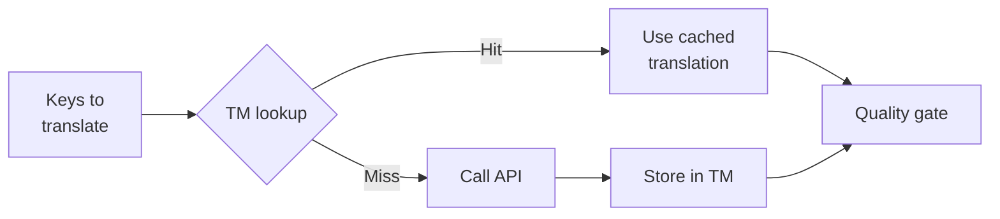

# Translation Memory

Ang Translation Memory (TM) ay ang built-in caching layer ng champollion. Iniimbak nito ang bawat salin batay sa source text + locale + method, kaya kapag muling pinatakbo ang `sync`, tatawagin lamang nito ang API para sa mga key na talagang nagbago.

## Bakit May TM

Kung walang TM, bawat `sync` ay muling nagsasalin ng bawat binagong key — kahit naisalin na ninyo dati ang eksaktong parehong English text para sa parehong locale sa naunang run. Mga karaniwang sitwasyon kung saan nagsasayang ito ng gastos:

| Sitwasyon | Kung Walang TM | Gamit ang TM |
|----------|-----------|---------|
| Muling patakbuhin ang sync pagkatapos ng 1 pagbabago sa key (500 key × 10 locale) | 5,000 API call | 10 API call |
| I-revert ang isang key sa dating English value | Buong API call | Agarang cache hit |
| Lumilitaw ang parehong parirala sa 3 locale file | 3 × API call | 1 API call + 2 cache hit |
| Dry-run → tunay na sync | Buong API call sa pareho | Nagka-cache ang unang run, muling ginagamit ng ikalawa |

Ang TM ay **naka-enable bilang default** at hindi nangangailangan ng configuration. Awtomatikong naka-cache ang mga salin sa bawat `sync` at ginagamit sa mga kasunod na run.

## Paano Ito Gumagana

### Cache Key

Bawat TM entry ay naka-key sa pamamagitan ng SHA-256 hash ng tatlong value:

```
SHA-256( sourceValue + '\x00' + locale + '\x00' + method )
```

| Bahagi | Bakit ito kasama sa key |
|-----------|-------------------|
| `sourceValue` | Ibang English text → ibang salin |
| `locale` | Iba ang pagsasalin ng "Hello" sa French kumpara sa Japanese |
| `method` | Output ng Google Translate ≠ output ng GPT-4o |

Pinipigilan ng null byte separator (`\x00`) ang collision sa pagitan ng `"ab" + "c"` at `"a" + "bc"`.

Ang `sourceValue` ay ang tekstong pinagsasalinan ng key, kasama ang anumang iba pang impormasyong nagtatangi sa dalawang magkaparehong teksto:

- **Konteksto ng gettext.** Ang isang entry na may `msgctxt` ay naka-cache kasama ang konteksto nito: ang pandiwang "Open" at ang pang-uring "Open" ay dalawang magkahiwalay na entry.
- **Mga anyong maramihan na wala sa source.** Iniimbak ng i18next ang mga maramihan bilang mga key na may suffix, at ang isang target na wika ay maaaring magkaroon ng mga anyong wala sa source: nagdaragdag ang French at Spanish ng `count_many`, na isinasalin mula sa tekstong `count_other` ng English. Nagpapadala ang dalawang key ng parehong teksto, ngunit hinihilingan ang modelo ng iba't ibang anyo (`"2 recettes"` at `"1 000 000 de recettes"`), kaya ang bawat isa ay may sariling entry: pinapanatili ng `count_other` ang payak na anyo, at ang `count_many` ay naka-cache sa ilalim ng teksto kasama ang anyo nito. Totoo rin ito para sa bawat anyong isinalin mula sa teksto ng ibang kategorya (Arabic `_zero`, `_two`, `_few`, `_many`; Russian `_few`, `_many`; mga anyong ordinal).
- **`msgid_plural` ng gettext at mga maramihan ng ARB / ICU** ay isang mensahe bawat key (bawat anyo sa iisang halaga), kaya ang mga ito ay iisang entry, tulad ng dati.

Bago ang 0.4.0, ibinabahagi ng hiniram na anyo ang entry ng anyong pinagsalinan nito, at hawak ng entry kung alinmang sagot ang huling naimbak, kaya maaaring maisulat ng `--redo all` ang isang anyo sa parehong key. Inaayos ang cache mula noon habang ginagamit ito. Kapag hawak ng ibinahaging entry ang teksto ng hiniram na anyo, inililipat ito sa sariling entry ng anyong iyon, at ang isa pang anyo ay muling isinasalin sa susunod na pagkakataong ma-queue ito. Kung hindi, mananatili ang entry sa anyong hinihiraman nito, at ang hiniram na anyo ay ipapadala sa modelo nang isang beses, sa unang pagkakataong ma-queue ito (isinasaad ito ng run). Nagbababala ang `champollion verify` kapag ang isang hiniram na anyo ay eksaktong naglalaman ng teksto ng anyong hinihiraman nito at hindi ipinapakita ng cache na ganoon ang pagkakasulat ng modelo. Ang ilang wika ay talagang magkatulad kung magsulat ng dalawang anyo, kaya ito ay isang babala lamang; muling nagtatanong ang `--redo keys:<key>`.

### Habang Nagsi-sync


```mermaid
flowchart LR
    A["Keys to\ntranslate"] --> B{"TM lookup"}
    B -->|Hit| C["Use cached\ntranslation"]
    B -->|Miss| D["Call API"]
    D --> E["Store in TM"]
    C --> F["Quality gate"]
    E --> F
```

1. Bago tawagin ang translation API, hinahati ng champollion ang mga key sa **TM hits** at **TM misses**
2. Ibinibigay agad ang hits mula sa cache — walang API call, walang latency, walang gastos
3. Dumadaan ang misses sa karaniwang translation pipeline
4. Iniimbak sa TM ang mga bagong salin mula sa API para sa mga susunod na run
5. Lahat ng salin (cached + bago) ay dumadaan sa quality gate

### Storage

Iniimbak ang TM sa `.champollion/tm.json` sa root ng inyong project. Gumagamit ang file ng compact JSON (walang pretty-printing) upang mapanatiling madaling pamahalaan ang laki. Iniimbak ng bawat entry ang:

| Field | Paglalarawan |
|-------|-------------|
| `t` | Ang isinaling text |
| `ts` | ISO-8601 timestamp kung kailan ito na-cache |
| `l` | Target locale code (para sa stats/filtering) |
| `m` | Pangalan ng translation method (para sa stats/filtering) |

Sa 50 wika × 500 key = 25,000 entry, dapat ay ~2-3 MB ang file.

## Pamamahala sa Cache

### Tingnan ang Statistics

```bash
champollion tm stats
```

Ipinapakita ang bilang ng entry, laki ng file, at per-locale breakdown:

```
  Translation Memory — .champollion/tm.json

  Entries:      2,847
  File size:    1.2 MB
  Created:      2026-05-20 09:14 MDT
  Last entry:   2026-05-24 17:52 MDT

  By locale:
    fr       482 entries
               380  llm · model google/gemini-3.8-flash · register formal-vous
               102  llm-coached · model google/gemini-3.8-flash · register formal-vous · coaching 3f2a9c1b
    de       471 entries
               471  llm · model google/gemini-3.8-flash · register formal-Sie
    ja       465 entries
               465  llm · model google/gemini-3.8-flash · register polite
```

Ang mga petsa ay nasa lokal na oras ng makinang ito, kasama ang pangalan ng sona (naglalaman
din ang `--json` ng mga naka-store na UTC timestamp bilang `createdAt` at `lastEntryAt`).
Ang bawat linya sa ilalim ng isang locale ay kung ano ang gumawa sa mga entry na iyon: ang pamamaraan, modelo, at
register (at isang fingerprint ng coaching text, para sa bawat pamamaraan na ang
prompt ay nagdadala nito: `llm`, `local`, `openai`, `anthropic`, `gemini`,
`llm-coached`; binabasa ang sariling `coachingFile` ng isang pair, wika, o fallback
para rito, at ang teksto nito, hindi ang path nito, ang binibilang). Karaniwang
nangangahulugan ng pagpapalit ng modelo ang dalawang modelo sa ilalim ng isang locale; isinasaad
ng `champollion status` kung pinaghahalo na ngayon ng mismong mga locale file ang teksto ng dalawang modelo.

### I-clear ang Cache

```bash
# Clear everything (with confirmation prompt)
champollion tm clear

# Clear without prompt (CI environments)
champollion tm clear --yes

# Clear only one locale
champollion tm clear --locale fr
```

### Laktawan ang TM para sa Isang Run

```bash
# Fresh API calls for everything queued (useful when debugging quality)
champollion sync --redo all --fresh     # --fresh = --no-tm
```

Hindi nito binubura ang cache at hindi ito binabasa sa run na ito — ngunit ang isinasalin (at binabayaran) ng run ay nakaimbak pa rin, kaya naka-cache muli ang susunod na run.

## Pagpapalit ng Modelo

**Paano magpalit.** Ang modelo ay isang setting sa `champollion.config.json`: i-edit ang `"model"` (at ang `"defaultMethod"` kapag nagbago rin ang pamamaraan), o ang sariling `"model"` ng isang pair sa `"pairs"`. Gagamitin ito ng susunod na `champollion sync`.

Tinutukoy ng `sync --model <name>` (at `--method <name>`) ang isang modelo para sa **isang run lamang**: hindi binabago ang file, isinasaad ito ng sync, at gagamitin muli ng susunod na payak na `sync` ang na-configure na modelo. Ang isinalin ng run na iyon ay mananatili sa mga file. Pagkatapos nito, isasaad ng isang payak na sync kung aling mga salin ang isinulat ng ibang modelo, na may dalawang opsyon: panatilihin ang mga ito sa pamamagitan ng paggawa sa modelong iyon bilang na-configure na modelo (itakda ang `"model"` dito — walang ipapadala), o ipasalin ang mga ito sa na-configure na modelo (ang redo command na ipinapakita nito, kasama ang presyo nito). Isinasaad din ng `champollion status` ang parehong bagay. Hindi kailangang patakbuhin muli ang `champollion init` upang magpalit; muling isinusulat lamang ng `init --force` kung ano ang tinutukoy ng mga flag nito, at pinapanatili ang bawat iba pang setting ([Sanggunian ng CLI](/docs/reference/cli#init)).

Hindi itinatapon ang iyong cache sa pagpapalit ng modelo. Kapag ang isang string ay walang entry sa ilalim ng bagong modelo, muling ginagamit ng sync ang saling ginawa sa ilalim ng naunang modelo, basta't hindi nagbago ang pamamaraan, register, at coaching. Ang mga muling ginamit na entry ay sumasailalim sa parehong quality checks tulad ng iba pang cache hit. Bago ang pagtatantya ng gastos, isinasaad ng sync kung ilang salin ang muling gagamitin nito at kung aling modelo ang sumulat sa mga ito — gayundin sa isang dry run, at pagkatapos ding makumpleto ang pagpapalit: ang isang string na ibinalik sa isang tekstong ang naunang modelo lamang ang nagsalin ay sineserbisyuhan ng salin ng modelong iyon, at isinasaad ito ng run bago ang pagtatantya.

Upang ipasalin ang mga ito sa bagong modelo (ipinapadala nito ang mga key na
isinalin ng mas naunang modelo; ang naisalin na ng bagong modelo ay magmumula
pa rin sa cache):

```bash
champollion sync --redo all --fresh-on-model-change
```

Sa sarili nito, nakakaapekto lamang ang `--fresh-on-model-change` sa mga key na isasalin pa rin
ng run (mga bago o binago). Pagkatapos ng buong muling pagsasalin, ititigil ng sync
ang pag-aanunsyo ng pagpapalit ng modelo para sa wikang iyon. Ang mga key kung saan
nabigo ang mga sagot ng bagong modelo ay itinatala bilang **pending** sa `.champollion.lock`:
hihilingin muli ng susunod na `champollion sync` ang mga ito sa bagong modelo (hindi sa cache), at
makukumpleto ang pagpapalit kapag tapos na ang mga ito. Inililista ng `champollion status` ang mga nakabinbing
key, at isinasaad kung kailan naglalaman ang mga file ng teksto mula sa isang naunang modelo — kahalo ng
kasalukuyang modelo, o ang kabuuan nito ([Quality Gate](/docs/concepts/quality-gate#a-redo-that-could-not-finish)).
Alam nito kung aling modelo ang sumulat sa bawat halaga dahil itinatala ito ng sync sa
`.champollion.lock` (ang modelong sumagot, o ang modelong ang naka-cache na
salin ay ginamit). Para sa mga halagang isinulat bago ang 0.4.0, bumabalik ito sa
cache, at sinasabing "model unknown" kapag dalawang modelo ang nag-cache ng parehong teksto. Ang isang payak na
`champollion sync` na walang kailangang isalin ay nagsasaad, sa isang linya bawat wika,
kung kailan isinulat ang mga file ng isang modelong iba sa na-configure na modelo, gamit ang
utos sa itaas.
Hindi kailanman pinapalitan ng isang maramihang redo ang isang saling inedit ng isang tao sa file
([Pag-eedit ng mga salin](/docs/guides/professional-translators#editing-key-value-files)).

Ang pagpapalit ng pamamaraan, register, o coaching ay nagbubunga pa rin ng mga bagong salin, dahil ang mga pagbabagong iyon ay ginagawa upang makakuha ng ibang teksto. Kapag ipinadala ang mga key sa modelo kahit na naglalaman ang cache ng mga salin ng parehong teksto na ginawa sa ibang paraan (halimbawa pagkatapos magpalit ng `local` → `llm`), isinasaad ito ng sync nang isang beses bawat wika, na tinutukoy kung ano ang gumawa sa mga ito — iyon ang dahilan kung bakit walang ipinapakitang kinuha mula sa cache ang run.

Ang pagbabago sa pamamaraan, register, o coaching ay hindi kusang nagsasalin muli ng anuman: ang isang payak na sync (o isang dry run) na walang bagong isasalin ay nagpapanatili sa mga file sa kasalukuyang kalagayan ng mga ito. Isinasaad nito, bawat wika: kung ilang halaga ang isinulat ng ibang pamamaraan, ang redo na magpapalit sa mga ito (`champollion sync --pair en:fr --redo all`), at kung magkano ang magiging gastos nito.

## Kapag Hindi Nakakatulong ang TM

Hindi magbibigay ang TM ng cache hit kapag:

- **Nabago ang source text** — nagbabago ang hash, kaya ito ay isang miss
- **Nabago ang pamamaraan** — ang paglipat mula `llm` patungong `google-translate` ay nangangahulugan ng magkaibang cache key
- **Nabago ang register o coaching** — kasama ang mga ito sa cache key (ang pagpapalit ng modelo lamang ay muling ginagamit; tingnan sa itaas). Ang fallback ng isang pair ay may sariling key (pamamaraan, modelo, register, coaching): pagkatapos itong baguhin, tinutukoy ng `sync` at `status` ang mga halagang isinulat ng naunang setup nito at ang redo (`--redo all`; kasama ang `--fresh-on-model-change` para sa pagpapalit lamang ng modelo). Ang mga cache na isinulat bago ang 0.4.0 ay nag-key lamang ng coaching para sa `llm-coached`; sa unang run, pinapanatili ang mga entry na ginawa gamit ang coaching na mayroon ang isang pair noon
- **Hindi bahagi ng key:** ang talasalitaan (glossary), at ang mga panuntunan sa balarila at mga tala sa estilo ng `llm-coached` — ang pag-edit sa mga ito ay hindi muling nagsasalin ng anumang naka-cache (muling nagtatanong ang `--redo keys:… --fresh`)
- **`--retranslate <glob>`** — sadyang isinasalin muli bilang bago ang mga tinukoy na content file
- **Unang run** — cold start, wala pang mga entry
- **`--no-tm` / `--fresh`** — hayagang nilalampasan ang cache
- **Isang pending key** — ang isang key na hindi natapos ng isang redo ay muling hinihiling sa modelo, hindi kinukuha mula sa cache

Hindi kailanman nagpapasya ang cache kung ang isang key ay *naka-queue*: ang isang hindi nagbagong key na ang salin ay nasa file na ay nilalampasan bago ang anumang lookup (hindi ito binibilang bilang isang cache hit). At ang isang key na tinanggihan ng quality gate mula sa isang modelo ay hindi na muling ipapadala sa modelong iyon sa isang payak na sync — sisingilin lamang nito ang parehong sagot ([pinipigilan](/docs/concepts/quality-gate#refused-keys-are-held-back)); binabasa pa rin ang cache para rito.

## Dapat Ba Ninyong I-commit ang `.champollion/tm.json`?

**Sa pangkalahatan, hindi.** Ang TM ay lokal na optimization para sa developer. Awtomatiko itong napupunan habang nagsi-sync at nakakatulong lamang kapag muling pinapatakbo ang sync sa parehong machine. Gayunpaman, maaari ninyong isaalang-alang na i-commit ito kung:

- Gumagamit ang inyong team ng iisang CI runner na nagsi-sync ng mga salin
- Gusto ninyo ng reproducible builds nang walang API calls
- Ina-archive ninyo ang mga salin para sa compliance

Idagdag ang `.champollion/tm.json` sa `.gitignore` para sa karaniwang paggamit.

---

## Tingnan Din

- [Paano Gumagana ang Sync](/docs/concepts/how-sync-works) — kung saan pumapasok ang TM sa pipeline
- [Sanggunian sa CLI — tm](/docs/reference/cli#tm) — sanggunian ng command
- [Sanggunian sa CLI — sync --no-tm](/docs/reference/cli#sync) — pag-bypass sa TM
