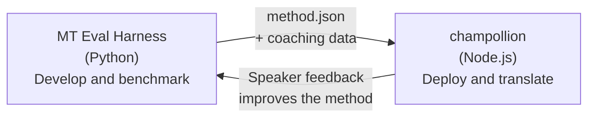

# Ang Tulay ng Eval Harness

Ang champollion at ang MT Eval Harness ay dalawang magkahiwalay na tool na bumubuo ng iisang ecosystem. Ang harness ang lugar kung saan **napatutunayan** ang mga paraan ng pagsasalin. Ang Champollion ang lugar kung saan **idine-deploy** ang mga napatunayang paraan. Nag-uugnay ang mga ito sa pamamagitan ng isang shared plugin format.



## Ang Daloy: Pananaliksik → Production

### 1. Bumuo ng paraan sa harness

Anumang Python class na nag-i-implement ng `async translate(entries, config) → [{id, predicted}]` ay maaaring mag-plug in sa harness. Hindi mahalaga sa harness kung ano ang nangyayari sa loob — prompted LLM, custom-trained model, deterministic rules, o anuman.

### 2. I-benchmark ito

Binigyan ng score ng harness ang inyong paraan laban sa standardized corpus gamit ang mga reproducible metric: chrF++, FST acceptance (para sa mga wikang mayaman sa morpolohiya), morphological accuracy, at semantic scoring.

### 3. I-export bilang plugin

Kapag umabot na sa katanggap-tanggap na kalidad ang inyong paraan, i-package ito bilang champollion plugin — isang `method.json` manifest na may opsyonal na coaching data.

:::info[Nakaplano ang Export CLI]
Sa kasalukuyan, manu-mano ninyong ginagawa ang method.json manifest. Ia-automate ito ng `mt-eval export` command. Tingnan ang [Interface ng Method](/docs/network/specifications/methods) para sa kumpletong format ng plugin.
:::

### 4. I-install sa champollion

```bash
champollion plugin install ./my-method-plugin/
```

### 5. Isalin ang tunay na content

```bash
champollion sync
```

Ang inyong na-benchmark na pamamaraan ay gumagawa na ngayon ng tunay na mga salin sa production.

## Ang Daloy: Production → Pananaliksik

Sinusuri ng mga bilingual speaker ang mga na-deploy na salin. Tinutukoy ng kanilang feedback ang mga systematic error (maling tense pattern, kulang na bokabularyo, hindi natural na pagbuo ng parirala). Ina-update ng researcher ang paraan sa harness, muling bina-benchmark, muling ine-export, at muling dine-deploy. Natututo ang system mula sa paggamit.

## Ang Plugin Format

Ang `method.json` manifest ang kontrata sa pagitan ng dalawang tool:

```json
{
  "name": "crk-coached-v3",
  "type": "llm-coached",
  "version": "3.0.0",
  "description": "Coached LLM translation for Plains Cree",
  "locales": ["crk"],
  "config": {
    "model": "google/gemini-3.5-flash",
    "temperature": 0.3
  },
  "benchmarks": {
    "crk": {
      "composite_score": 0.67,
      "fst_acceptance": 0.82,
      "corpus_size": 150
    }
  }
}
```

Tingnan ang [Plugin Specification](/docs/reference/plugin-spec) para sa buong format.

## Ano ang Nagawa na vs. Nakaplano

| Component | Status |
|-----------|--------|
| TranslationMethod protocol | ✅ Nagawa na |
| Harness benchmark runner | ✅ Nagawa na |
| method.json plugin format | ✅ Nagawa na |
| `champollion plugin install/remove/list` | ✅ Nagawa na |
| Pag-load ng coaching data | ✅ Nagawa na |
| `mt-eval export` CLI | 🔲 Nakaplano |
| Interface para sa pagsusuri ng komunidad | 🔲 Nakaplano |
| Cryptographic test set evaluation | 🔲 Nakaplano |

## Karagdagang Babasahin

- [Mga Paraan ng Pagsasalin](/docs/guides/translation-methods) — lahat ng magagamit na paraan at kung paano gumagana ang mga ito
- [Espesipikasyon ng Plugin](/docs/reference/plugin-spec) — ang format ng method.json
- [Pag-serve ng Paraan gamit ang API](/docs/guides/serving-a-method) — pag-host ng paraan sa server-side
- [Soberanya ng Datos](/docs/network/sovereignty/data-sovereignty) — Mga prinsipyo ng Indigenous data sovereignty, CARE, at proteksyong cryptographic
- [Para sa mga Mananaliksik ng MT](/docs/network/leaderboard/rules) — ang dokumentasyon ng eval harness
