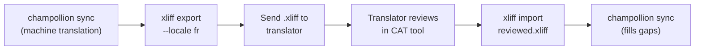

# Pakikipagtulungan sa mga Propesyonal na Tagasalin

Gumagawa ang Champollion ng mga salin ng makina, ngunit nangangailangan ang ilang proyekto ng pagsusuri ng tao — nilalamang regulatori, tekstong sensitibo sa brand, o kritikal na UI. Hinahayaan kayo ng XLIFF workflow na i-export ang mga salin para sa propesyonal na pagsusuri at i-import ang mga ito pabalik nang walang aberya.

## Ano ang XLIFF?

Ang XLIFF (XML Localization Interchange File Format) ay ang industry-standard na exchange format para sa mga translation tool. Sinusuportahan ito ng bawat propesyonal na CAT (Computer-Assisted Translation) tool:

- **memoQ** — mag-import ng XLIFF, magsuri in-context, mag-export ng nasuring file
- **SDL Trados Studio** — native na suporta sa XLIFF
- **Phrase (Memsource)** — mag-upload ng mga XLIFF job para sa mga pangkat ng tagasalin
- **Smartling** — pipeline para sa XLIFF ingestion
- **OmegaT** — libre/open-source na CAT tool na may suporta sa XLIFF

Gumagawa ang Champollion ng XLIFF 1.2 (ang bersiyong sinusuportahan sa pangkalahatan) sa halip na 2.0+ para sa pinakamalawak na compatibility sa mga tool.

## Ang Workflow



### Hakbang 1: Gumawa ng mga Salin ng Makina

Patakbuhin muna ang `sync` upang makakuha ng baseline na salin ng makina:

```bash
champollion sync
```

### Hakbang 2: I-export ang XLIFF

I-export ang pares na source + target bilang XLIFF:

```bash
champollion xliff export --locale fr
```

Isinusulat nito ang `.champollion/xliff/fr.xliff` na naglalaman ng:
- Bawat source key kasama ang English na value nito
- Ang kasalukuyang salin ng makina (kung mayroon) bilang `<target>`
- Mga key na walang salin na minarkahan bilang `state="new"`

```xml
<trans-unit id="hero.title" xml:space="preserve">
  <source>Welcome to our platform</source>
  <target state="translated">Bienvenue sur notre plateforme</target>
</trans-unit>
```

### Hakbang 3: Ipadala sa Tagasalin

Ipadala ang `.xliff` file sa inyong tagasalin o i-upload ito sa inyong CAT platform. Makikita ng tagasalin ang source at target nang magkatabi, at maaari siyang:

- Mag-edit ng mga salin ng makina
- Punan ang mga nawawalang salin
- Mag-flag ng mga isyu sa kalidad
- Ilapat ang sarili niyang translation memory at termbases

### Hakbang 4: I-import ang Nasuring File

Kapag ibinalik ng tagasalin ang nasuring `.xliff`, i-import ito:

```bash
# Preview what will change
champollion xliff import .champollion/xliff/fr.xliff --dry

# Apply changes
champollion xliff import .champollion/xliff/fr.xliff
```

Output:
```
  ✓ Imported 142 translations for fr
    Updated:    23 (changed from existing)
    Added:      0 (new keys)
    Unchanged:  119
    Written to: locales/fr.json
```

### Hakbang 5: Punan ang mga Puang

Kung may mga bagong key na idinagdag pagkatapos ma-export ang XLIFF, patakbuhin ang `sync` upang isalin ang mga ito:

```bash
champollion sync
```

Isinasalin lamang ng Champollion ang mga key na kulang pa rin — pinananatili ang mga nasuring salin mula sa XLIFF import.

## Mga Tip

### Mag-export ng Custom na Paths

```bash
# Export to a specific directory
champollion xliff export --locale ja --out ./for-review/

# Export with a specific filename
champollion xliff export --locale de --out ./review/german.xliff
```

### Maramihang Locale

I-export ang bawat locale nang hiwalay:

```bash
for locale in fr de ja ko; do
  champollion xliff export --locale $locale
done
```

### Version Control

Idagdag ang `.champollion/xliff/` sa `.gitignore` — ang mga XLIFF file ay mga pansamantalang artifact, hindi source ng proyekto:

```gitignore
.champollion/xliff/
```

### Kailan Gagamitin ang XLIFF kumpara sa `sync` Lang

| Sitwasyon | Rekomendasyon |
|----------|---------------|
| Internal app, katanggap-tanggap ang 90%+ na kalidad | `sync` lang — sapat na ang salin ng makina |
| User-facing na marketing copy | Mag-export ng XLIFF para sa pagsusuri ng tao |
| Legal/regulatory na nilalaman | Mag-export ng XLIFF — kinakailangan ang pagsusuri ng tao |
| 50+ locale, mahigpit ang deadline | `sync` muna, XLIFF export para lamang sa nangungunang 5 locale |
| Gumagamit na ang tagasalin ng CAT tool | XLIFF ang natural na handoff format |

---

## Tingnan Din

- [CLI Reference — xliff](/docs/reference/cli#xliff) — reference ng command
- [Translation Memory](/docs/concepts/translation-memory) — pag-cache ng mga nasuring salin
- [Translation Methods](/docs/guides/translation-methods) — mga opsyon sa salin ng makina
