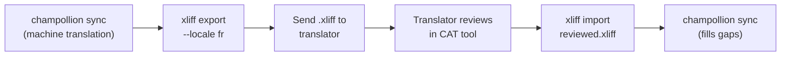

# Pakikipagtulungan sa mga Propesyonal na Tagasalin

Gumagawa ang Champollion ng mga salin ng makina, ngunit nangangailangan ang ilang proyekto ng pagsusuri ng tao — nilalamang regulatori, tekstong sensitibo sa brand, o kritikal na UI. Hinahayaan kayo ng XLIFF workflow na i-export ang mga salin para sa propesyonal na pagsusuri at i-import ang mga ito pabalik nang walang aberya.

Sinasaklaw ng XLIFF ang mga **string file** (mga key at value) ng inyong app. Ang isinaling **Markdown** (mga newsletter, blog post, pahina ng dokumentasyon) ay sinusuri sa ibang paraan: direktang ine-edit ng tagasuri ang isinaling `.md` na file, at pinapanatili ng pag-sync ang mga pagbabagong iyon. Tingnan ang [Pagsusuri sa isinaling Markdown](#reviewing-translated-markdown) sa ibaba.

## Ano ang XLIFF?

Ang XLIFF (XML Localization Interchange File Format) ay ang industry-standard na exchange format para sa mga translation tool. Sinusuportahan ito ng bawat propesyonal na CAT (Computer-Assisted Translation) tool:

- **memoQ** — mag-import ng XLIFF, magsuri in-context, mag-export ng nasuring file
- **SDL Trados Studio** — native na suporta sa XLIFF
- **Phrase (Memsource)** — mag-upload ng mga XLIFF job para sa mga pangkat ng tagasalin
- **Smartling** — pipeline para sa XLIFF ingestion
- **OmegaT** — libre/open-source na CAT tool na may suporta sa XLIFF

Gumagawa ang Champollion ng XLIFF 1.2 (ang bersiyong sinusuportahan sa pangkalahatan) sa halip na 2.0+ para sa pinakamalawak na compatibility sa mga tool.

## Ang Workflow


```mermaid
flowchart LR
    A["champollion sync\n(machine translation)"] --> B["xliff export\n--locale fr"]
    B --> C["Send .xliff to\ntranslator"]
    C --> D["Translator reviews\nin CAT tool"]
    D --> E["xliff import\nreviewed.xliff"]
    E --> F["champollion sync\n(fills gaps)"]
```

### Hakbang 1: Gumawa ng mga Salin ng Makina

Patakbuhin muna ang `sync` upang makakuha ng baseline na salin ng makina:

```bash
champollion sync
```

### Hakbang 2: I-export ang XLIFF

I-export ang pares na source + target bilang XLIFF:

```bash
champollion xliff export --locale fr
```

Isinusulat nito ang `.champollion/xliff/fr.xliff` na naglalaman ng:
- Bawat source key kasama ang English na value nito
- Ang kasalukuyang salin ng makina (kung mayroon) bilang `<target>`
- Mga key na walang salin na minarkahan bilang `state="new"`

```xml
<trans-unit id="hero.title" xml:space="preserve">
  <source>Welcome to our platform</source>
  <target state="translated">Bienvenue sur notre plateforme</target>
</trans-unit>
```

### Hakbang 3: Ipadala sa Tagasalin

Ipadala ang `.xliff` file sa inyong tagasalin o i-upload ito sa inyong CAT platform. Makikita ng tagasalin ang source at target nang magkatabi, at maaari siyang:

- Mag-edit ng mga salin ng makina
- Punan ang mga nawawalang salin
- Mag-flag ng mga isyu sa kalidad
- Ilapat ang sarili niyang translation memory at termbases

### Hakbang 4: I-import ang Nasuring File

Kapag ibinalik ng tagasalin ang nasuring `.xliff`, i-import ito:

```bash
# Preview what will change
champollion xliff import .champollion/xliff/fr.xliff --dry

# Apply changes
champollion xliff import .champollion/xliff/fr.xliff
```

Output:
```
  ✓ Imported 142 translations for fr
    Updated:    23 (changed from existing)
    Added:      0 (new keys)
    Unchanged:  119
    Written to: locales/fr.json
```

### Hakbang 5: Punan ang mga Puang

Kung may mga bagong key na idinagdag pagkatapos ma-export ang XLIFF, patakbuhin ang `sync` upang isalin ang mga ito:

```bash
champollion sync
```

Isinasalin lamang ng Champollion ang mga key na kulang pa rin — pinananatili ang mga nasuring salin mula sa XLIFF import.

## Mga Tip

### Mag-export ng Custom na Paths

```bash
# Export to a specific directory
champollion xliff export --locale ja --out ./for-review/

# Export with a specific filename
champollion xliff export --locale de --out ./review/german.xliff
```

### Maramihang Locale

I-export ang bawat locale nang hiwalay:

```bash
for locale in fr de ja ko; do
  champollion xliff export --locale $locale
done
```

### Version Control

Idagdag ang `.champollion/xliff/` sa `.gitignore` — ang mga XLIFF file ay mga pansamantalang artifact, hindi source ng proyekto:

```gitignore
.champollion/xliff/
```

### Kailan Gagamitin ang XLIFF kumpara sa `sync` Lang

| Sitwasyon | Rekomendasyon |
|----------|---------------|
| Internal app, katanggap-tanggap ang 90%+ na kalidad | `sync` lang — sapat na ang salin ng makina |
| User-facing na marketing copy | Mag-export ng XLIFF para sa pagsusuri ng tao |
| Legal/regulatory na nilalaman | Mag-export ng XLIFF — kinakailangan ang pagsusuri ng tao |
| 50+ locale, mahigpit ang deadline | `sync` muna, XLIFF export para lamang sa nangungunang 5 locale |
| Gumagamit na ang tagasalin ng CAT tool | XLIFF ang natural na handoff format |

## Pag-edit ng mga Salin sa mga Locale File {#editing-key-value-files}

Maaari ding direktang ayusin ng isang tagasuri ang isang salin sa isang locale file (`messages/fr.json`, `locale/fr/LC_MESSAGES/django.po`, `app_fr.arb`, …) at i-commit ito. Itinatala ng Champollion, sa `.champollion.lock`, ang isang fingerprint ng bawat value na isinusulat nito. Ang isang value na hindi na tumutugma ay binago ng isang tao, at itinuturing ito ng pag-sync bilang pagmamay-ari nila:

| Ang pinapatakbo | Ang mangyayari sa na-edit na value |
|-----------|----------------------------------|
| Isang payak na `sync`, hindi binago ang Ingles | Hindi ginalaw (tulad ng dati). |
| `sync --redo all` / `--force`, pagpapalit ng modelo (`--redo all --fresh-on-model-change`), o ang muling pagsubok sa mga key na iniwang nakabinbin ng isang redo | **Pinanatili.** Sinasabi sa pagpapatakbo kung ilan ang pinanatili nito at alin ang mga ito, at kung paano palitan ang isa: `--redo keys:<key>`. |
| `sync --redo keys:<key>` na tumutukoy dito | Pinalitan — hiniling ninyo ang key na iyon ayon sa pangalan. Ipi-print muna ang na-edit na mga salita. |
| Nagbago ang **Ingles na pinagmulan ng key na iyon** | Isasalin muli (ang pag-edit ay para sa lumang teksto). Ipi-print ang na-edit na mga salita upang maaari itong muling ilapat, at idaragdag sa `.champollion-replaced-edits.jsonl` sa root ng proyekto. |

Ang `.champollion-replaced-edits.jsonl` ay isang sinusubaybayang file sa tabi ng lock (ang `.champollion/` cache folder ay bawat machine at binabalewala ng git): isang linya ng JSON bawat pinalitang edit, na may locale, file, key, ang na-edit na mga salita, kung bakit ito pinalitan at ang bagong source text. I-commit ito kasama ang lock — ito lamang ang natatanging kopya ng mga salitang iyon. Sinasabi ng `champollion status` kung ilan ang hawak nito.

Ang mga value na isinulat bago umiral ang talang ito, o ng ibang tool, ay walang fingerprint. Mabibilang lamang ang naturang value bilang kay Champollion kapag eksaktong hawak ng translation cache ang tekstong iyon para sa key; kung hindi, ituturing ito bilang gawa ng tao at pananatilihin ng mga maramihang redo (tinutukoy ng pagpapatakbo ang mga ito bilang mga value na wala itong rekord ng pagsulat). Ang mga value na na-import gamit ang `champollion xliff import` ay gawa ng tao at pinapanatili sa parehong paraan.

## Pagsusuri sa Isinaling Markdown {#reviewing-translated-markdown}

Ang mga content file mula sa isang `contentDir` (halimbawa `newsletters/2026-10.md` → `newsletters/2026-10.crk.md`) ay walang XLIFF export. Nagtatrabaho ang tagasuri sa mismong isinaling file:

1. Patakbuhin ang `champollion sync` at i-commit ang mga salin kasama ang `.champollion-content.lock`.
2. Ee-edit ng tagasuri ang isinaling file, maaaring isang talata o isang isinaling front-matter field tulad ng `title`, at i-commit ito.
3. Sa mga susunod na pag-sync, pinapanatili ang mga edit. Kung magbago man ang Ingles na pinagmulan sa ibang mga talata, mananatili ang mga talata ng tagasuri nang salita por salita at ang mga nabagong talata lamang ang isasalin. Ipi-print ng pagpapatakbo ang `kept the edits made by hand to …`.

Mayroong dalawang pagbubukod, at nagbababala ang pag-sync tungkol sa dalawa. Kung magbago rin ang Ingles na talata na itinuwid ng tagasuri, isasalin muli ang talatang iyon at ipi-print ang mga salita ng tagasuri upang maaari itong muling ilapat. Kung nagdagdag o nag-alis ng mga talata ang tagasuri at pagkatapos ay nagbago ang pinagmulan, iiwanan ang file tulad ng dati, at ililista sa bawat pag-sync, hanggang may mag-update nito nang manu-mano.

Upang itapon ang mga edit at bumalik sa machine translation, tukuyin ang file: `champollion sync --redo files:2026-10.md`. Ang buong mga panuntunan ay nasa [Pagsasalin ng Nilalaman](/docs/guides/content-translation#reviewing-and-editing-translations).

---

## Tingnan Din

- [Sanggunian ng CLI — xliff](/docs/reference/cli#xliff) — sanggunian ng command
- [Translation Memory](/docs/concepts/translation-memory) — pag-cache ng mga sinuring salin
- [Mga Paraan ng Pagsasalin](/docs/guides/translation-methods) — mga opsyon sa machine translation
- [Pagsasalin ng Nilalaman](/docs/guides/content-translation) — pagsasalin ng Markdown, at kung paano pinapanatili ang mga edit ng mga tagasuri
- [Quality Gate](/docs/concepts/quality-gate#refused-keys-are-held-back) — mga key na tinanggihan ng gate, at mga key na iniwang nakabinbin ng isang redo
