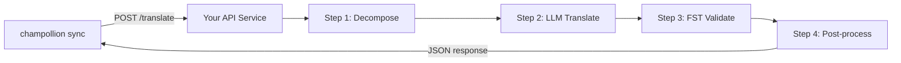

# Pag-serve ng Custom Method bilang API

Ang **`api` method** ng champollion ay nagbibigay-daan sa inyong ituro ang anumang pares ng pagsasalin sa isang external HTTP endpoint. Ganito ninyo ini-integrate ang mga pipeline na masyadong kumplikado para sa iisang LLM prompt — morphological analyzers, finite-state transducers (FSTs), multi-step LLM chains, o anumang custom research method na binuo ninyo.

May dalawang paraan upang magtayo ng ganitong endpoint:

1. **`champollion serve`** — isang command na nagse-serve sa naka-configure na stack ng inyong kasalukuyang champollion project (method, registers, coaching, Translation Memory, quality gate) sa likod ng contract na ito. Walang server code. Tingnan ang [zero-code path](#the-zero-code-path-champollion-serve).
2. **Isang custom na serbisyo** — isulat ang inyong sariling HTTP server na nagpapatupad ng contract, para sa mga pipeline na ganap na nasa labas ng champollion.

## Bakit API Service?

May ilang translation pipeline na hindi maaaring tumakbo sa loob ng simpleng prompt-response cycle:

| Hakbang sa pipeline | Halimbawa |
|---|---|
| **Morphological decomposition** | Hatiin ang mga polysynthetic na salita sa mga morpheme bago ang pagsasalin |
| **FST validation** | Tanggihan ang mga output na lumalabag sa mga tuntuning phonological o morphological |
| **Multi-step LLM chains** | Generate → verify → correct cycles gamit ang iba’t ibang model |
| **Dictionary lookup** | I-cross-reference ang curated bilingual dictionary sa gitna ng pipeline |
| **Human-in-the-loop** | Ilagay sa pila ang mga hindi tiyak na pagsasalin para sa expert review |

Itinuturing ng `api` method ang inyong pipeline bilang black box — nagpapadala ang champollion ng mga source string, at nagbabalik ang inyong service ng mga pagsasalin. Ganap na nasa sa inyo kung ano ang nangyayari sa loob.

## Arkitektura



## Ang Zero-Code Path: `champollion serve`

Kung ang inyong pipeline ay isa na pong champollion project — isang naka-configure na method (LLM, coached, o isang engine), registers, coaching files, Translation Memory, at ang deterministic quality gate — hindi na ninyo kailangang magsulat pa ng server. Itinatayo ng `champollion serve` ang **inyong sariling naka-configure na stack** sa likod ng mismong contract na inilalarawan sa ibaba:

```bash
# Owner side — run from the project whose champollion.config.json defines the stack
CHAMPOLLION_SERVE_TOKEN=$(openssl rand -hex 24) npx champollion serve
# [OK] champollion serve listening on http://127.0.0.1:1822/translate
```

Bawat request ay dumadaan sa parehong pipeline na ginagamit ng `champollion sync`:

- **Translation Memory** — ang mga string na hawak na ng TM ay isini-serve mula sa cache nang libre, nang hindi ginagalaw ang inyong upstream provider. Ang mga gate-validated na resulta ng API ay naka-cache para sa susunod na request.
- **Quality gate** — bawat response ay deterministikong bini-validate (repetition, length ratio, script compliance, source echo). Ang mga failure ay bumabalik bilang mga structured na per-key error (HTTP 207/422) — hindi kailanman bilang tahimik na na-degrade na output.
- **Cost guard** — tinatanggihan ng `--max-cost-per-request` at `--max-session-cost` ang mga request na ang *tinantyang* upstream cost ay lumampas sa inyong mga cap, bago pa man gumawa ng anumang provider call. Ang mga method na may hindi kilalang pagpepresyo ay tinatanggihan din sa ilalim ng isang cap: ang hindi kilala ay hindi libre. Ang mga request na sakop ng TM ay kilalang $0 at palaging pumapasa.

Naka-bind ang server sa `127.0.0.1` bilang default: sinumang makaka-access sa port ay maaaring gumastos ng inyong upstream API budget, kaya ang pag-expose nito ay isang tahasang desisyon — `--bind 0.0.0.0` kasama ang isang matibay na bearer token. Ang `--no-auth` ay tinatanggap lamang kasama ng isang loopback bind. Ang isang per-IP rate limit at isang request-size cap ay naka-on bilang default; tingnan ang `champollion serve --help`.

### Ituro ang Isang Consumer Dito

I-emit ang plugin manifest na ini-install ng mga consumer (isang command sa bawat panig):

```bash
# Owner side
champollion serve --emit-manifest --endpoint https://translate.example.org
# [OK] Wrote ./my-project-serve/method.json
```

```bash
# Consumer side
champollion plugin install ./my-project-serve
```

```json title="champollion.config.json (consumer)"
{
  "pairs": {
    "en:crk": { "methodPlugin": "my-project-serve" }
  }
}
```

```bash
CHAMPOLLION_API_KEY=<the server's bearer token> champollion sync
```

Ang `api` method ng consumer ay nagpo-POST ng mga source string sa inyong server; ang inyong stack ay nagta-translate, nagge-gate, at nagka-cache; ang `qualityTier` ng manifest ay isang tapat na passthrough ng inyong mga naka-configure na pair (ang pinakakonserbatibong tier kapag magkaiba ang mga ito). Ang inyong mga prompt, coaching data, at provider key ay hindi kailanman aalis sa inyong makina.

Sinasaklaw ng natitirang bahagi ng gabay na ito ang pagsusulat ng isang **custom** na serbisyo — kapaki-pakinabang kapag ang inyong pipeline ay hindi isang champollion project (isang Python FST chain, isang pasadyang research system). Ang wire contract ay magkapareho sa alinmang paraan.

## Pag-set Up ng Inyong Service

Dapat magpatupad ang inyong API service ng iisang endpoint na tumatanggap at nagbabalik ng JSON:

### Format ng Request

Ipinapadala ng champollion ang eksaktong JSON body na ito (tingnan ang [api.js](https://github.com/gamedaysuits/Champollion/blob/main/cli/lib/methods/api.js)):

```json
POST /translate
Content-Type: application/json
Authorization: Bearer <CHAMPOLLION_API_KEY>

{
  "source_locale": "en",
  "target_locale": "crk",
  "method": "crk-coached-v1",
  "keys": {
    "greeting": "Hello, welcome to our app",
    "farewell": "Goodbye and thanks"
  }
}
```

| Field | Uri | Paglalarawan |
|-------|------|-------------|
| `source_locale` | string | BCP 47 source language code |
| `target_locale` | string | BCP 47 target language code |
| `method` | string | Pangalan ng plugin o `"default"` |
| `keys` | object | Map ng key → source string na isasalin |
```

### Response Format

Your service must return a `translations` object. An optional `meta` object can include cost and diagnostic info:

```json
{
  "translations": {
    "greeting": "tânisi, pê-kîwêw ôta",
    "farewell": "ekosi mâka, kinanâskomitin"
  },
  "meta": {
    "model": "my-custom-pipeline/v1",
    "cost_usd": 0.0042,
    "method": "decompose-translate-validate"
  }
}
```

| Field | Type | Required | Description |
|-------|------|----------|-------------|
| `translations` | object | ✅ | Map of key → translated string |
| `meta` | object | — | Optional metadata |
| `meta.cost_usd` | number | — | If present, displayed in champollion's output |
| `errors` | object | — | For partial success (HTTP 207): map of key → `{ message }` |

### Minimal Express Server

```javascript
import express from 'express';

const app = express();
app.use(express.json());

/**
 * API contract ng champollion:
 *
 * Request:  { source_locale, target_locale, method, keys: { "key": "source" } }
 * Response: { translations: { "key": "translated" }, meta: { ... } }
 */
app.post('/translate', async (req, res) => {
  const { source_locale, target_locale, method, keys } = req.body;

  const translations = {};

  for (const [key, source] of Object.entries(keys)) {
    // --- Dito ilalagay ang inyong pipeline ---
    // Hakbang 1: Morphological decomposition
    const morphemes = await decompose(source, source_locale);

    // Hakbang 2: Pagsasalin gamit ang LLM na may konteksto
    const draft = await llmTranslate(morphemes, target_locale);

    // Hakbang 3: FST validation
    const validated = await fstValidate(draft, target_locale);

    // Hakbang 4: Post-processing (normalisasyon ng orthography, atbp.)
    translations[key] = await postProcess(validated);
  }

  res.json({
    translations,
    meta: {
      model: 'my-custom-pipeline/v1',
      method: 'decompose-translate-validate',
    },
  });
});

app.listen(3001, () => {
  console.log('Translation API running on http://localhost:3001');
});
```

## Configuring champollion

Point a translation pair at your running service in `champollion.config.json`:

```json
{
  "inputLocale": "en",
  "pairs": {
    "en:crk": {
      "method": "api",
      "endpoint": "http://localhost:3001/translate",
      "register": "Formal Plains Cree. Use SRO orthography."
    }
  }
}
```

Then run sync as usual:

```bash
npx champollion sync
```

champollion will POST your source strings to the endpoint and write the returned translations to `crk.json`.

## Case Study: Plains Cree Pipeline

:::info[Under Development]
The Plains Cree pipeline described below is **under active development** and is not yet running in production. Details here reflect the current design direction and may change as the project evolves.
:::

The **arena** project demonstrates this pattern. Its Plains Cree pipeline uses:

1. **Morphological decomposition** — Break polysynthetic Cree words into translatable morpheme chains
2. **LLM translation** — Context-enriched GPT-4o translation with coaching data (SRO orthography rules, register instructions)
3. **FST validation** — Finite-state transducer checks that outputs conform to Cree phonological rules
4. **Confidence scoring** — Each translation gets a confidence score based on FST pass rate and dictionary coverage

The entire pipeline runs as a single HTTP endpoint that champollion calls via the `api` method.

### Running Evaluations

After translating, you can evaluate output quality using the harness directly:

```bash
# Clone the harness
git clone https://github.com/gamedaysuits/Champollion.git
cd Champollion/arena
pip install -e .

# Patakbuhin ang evaluation laban sa isang tunay at hindi naka-bundle na corpus
mt-eval run --corpus eval-amh-fra-globalvoices-test-v1 --model gemini-pro --yes
```

This produces structured evaluation records with chrF++, BLEU, and exact match scores that can be used as regression baselines.

## Authentication

If your API requires authentication, set the `apiKey` field or use an environment variable:

```json
{
  "pairs": {
    "en:crk": {
      "method": "api",
      "endpoint": "https://my-mt-service.example.com/translate",
      "apiKey": "${CRK_API_KEY}"
    }
  }
}
```

## Data Sovereignty

The `api` method is particularly important for **Indigenous language communities**. By self-hosting the translation pipeline, a community keeps full control over:

- **Proprietary coaching data** — register instructions, orthography rules, and domain glossaries never leave community infrastructure.
- **Linguistic resources** — curated dictionaries, FST grammars, and elder-verified translations remain under community ownership.
- **Access policies** — the community decides who can call the endpoint and under what terms.

This design follows the direction of [Indigenous data-sovereignty principles](/docs/network/community/low-resource-languages#data-sovereignty-principles) — community ownership and control of language data: sensitive language data stays governed by the community rather than a third-party platform.

:::tip
Combine the `api` method with a private deployment (e.g., a community-hosted VM or on-prem server) for the strongest data-sovereignty posture. `champollion serve` gives a community exactly this self-hosting posture without writing any server code — coaching data, provider keys, and the Translation Memory all stay on community infrastructure. See [Support a Low-Resource Language](/docs/network/community/low-resource-languages) for a full walkthrough.
:::

## Cost Estimation

The `api` method returns `null` for cost estimation by default — your service controls pricing. If you want to provide cost transparency, have your API return a `cost` field in the metadata:

```json
{
  "translations": { "...": "..." },
  "metadata": {
    "cost": {
      "estimatedCost": 0.0042,
      "currency": "USD",
      "source": "my-service-pricing"
    }
  }
}
```

## Pinakamahuhusay na Kasanayan

1. **Magbalik ng empty strings para sa mga failure** — Huwag ibalik ang source string bilang “translation.” Ibalik ang `""` at mahuhuli ito ng quality gate ng champollion. Lalaktawan ang key at susubukan muli sa susunod na sync.
2. **Isama ang confidence scores** — Kung kayang tantiyahin ng inyong pipeline ang kalidad, ibalik ito sa metadata. Nakakatulong ito sa quality auditing.
3. **Magpatupad ng health checks** — Magdagdag ng `GET /health` endpoint upang ma-verify ng champollion ang connectivity bago magsimula ng malaking sync.
4. **Mag-rate limit nang maayos** — Kung may throughput limits ang inyong pipeline, magbalik ng `429` status codes. Magba-back off ang batch system ng champollion.
5. **I-log ang lahat** — Maaaring tahimik na pumalya ang multi-step pipelines. I-log ang input/output ng bawat hakbang para sa debugging.

## Licensing

Ganap na open ang pattern ng `api` method — walang licensing restrictions sa pag-wrap ng sarili ninyong translation pipeline bilang HTTP service. Ang `arena` eval harness ay lisensyadong AGPL-3.0-or-later (na may §7 eval-standard-plugin exception); maaari ninyo itong pag-aralan at pagbatayan sa ilalim ng mga tuntuning iyon.

## Tingnan Din

- [Mga Translation Method](/docs/guides/translation-methods) — pangkalahatang-ideya ng bawat built-in na method (`openai`, `google`, `api`, atbp.)
- [Plugin Specification](/docs/reference/plugin-spec) — buong schema para sa `champollion.config.json` kabilang ang mga field ng `api` method
- [Suportahan ang Isang Low-Resource Language](/docs/network/community/low-resource-languages) — end-to-end na gabay para sa mga wikang kulang sa mapagkukunan, kabilang ang mga prinsipyo ng data sovereignty
- [Arkitektura](/docs/concepts/architecture) — kung paano gumagana ang sync loop, batching, at method dispatch ng champollion
- [MT Evaluation](/docs/network/leaderboard/rules) — pamamaraan ng evaluation, mga sukatan, at ang proseso ng pagsusumite sa leaderboard
- [Method Leaderboard](/leaderboard) — live na mga ranggo ng kalidad sa iba't ibang method at pares ng wika

