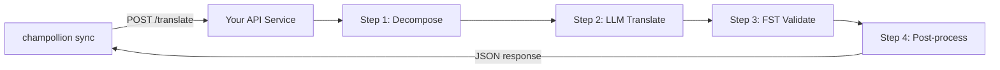

# Pag-serve ng Custom Method bilang API

Ang **`api` method** ng champollion ay nagbibigay-daan sa inyong ituro ang anumang pares ng pagsasalin sa isang external HTTP endpoint. Ganito ninyo ini-integrate ang mga pipeline na masyadong kumplikado para sa iisang LLM prompt — morphological analyzers, finite-state transducers (FSTs), multi-step LLM chains, o anumang custom research method na binuo ninyo.

May dalawang paraan upang magpatakbo ng ganitong endpoint:

1. **`champollion serve`** — isang command na nagse-serve ng naka-configure na stack ng inyong umiiral na proyekto sa champollion (method, registers, coaching, Translation Memory, quality gate) sa likod ng kontratang ito. Walang server code. Tingnan [ang zero-code path](#the-zero-code-path-champollion-serve).
2. **Isang custom na service** — sumulat ng sarili ninyong HTTP server na nagpapatupad ng kontrata, para sa mga pipeline na ganap na nasa labas ng champollion.

## Bakit API Service?

May ilang translation pipeline na hindi maaaring tumakbo sa loob ng simpleng prompt-response cycle:

| Hakbang sa pipeline | Halimbawa |
|---|---|
| **Morphological decomposition** | Hatiin ang mga polysynthetic na salita sa mga morpheme bago ang pagsasalin |
| **FST validation** | Tanggihan ang mga output na lumalabag sa mga tuntuning phonological o morphological |
| **Multi-step LLM chains** | Generate → verify → correct cycles gamit ang iba’t ibang model |
| **Dictionary lookup** | I-cross-reference ang curated bilingual dictionary sa gitna ng pipeline |
| **Human-in-the-loop** | Ilagay sa pila ang mga hindi tiyak na pagsasalin para sa expert review |

Itinuturing ng `api` method ang inyong pipeline bilang black box — nagpapadala ang champollion ng mga source string, at nagbabalik ang inyong service ng mga pagsasalin. Ganap na nasa sa inyo kung ano ang nangyayari sa loob.

## Arkitektura


```mermaid
graph LR
    A[champollion sync] -->|POST /translate| B[Your API Service]
    B --> C[Step 1: Decompose]
    C --> D[Step 2: LLM Translate]
    D --> E[Step 3: FST Validate]
    E --> F[Step 4: Post-process]
    F -->|JSON response| A
```

## Ang Zero-Code Path: `champollion serve`

Kung ang inyong pipeline ay isa nang proyekto sa champollion — isang naka-configure na method (LLM, coached, o isang engine), mga register, mga coaching file, Translation Memory, at ang deterministikong quality gate — hindi ninyo kailangang sumulat ng server kahit kaunti. Pinapatakbo ng `champollion serve` ang **sarili ninyong naka-configure na stack** sa likod ng mismong kontratang inilalarawan sa ibaba:

```bash
# Owner side — run from the project whose champollion.config.json defines the stack
CHAMPOLLION_SERVE_TOKEN=$(openssl rand -hex 24) npx champollion serve
# [OK] champollion serve listening on http://127.0.0.1:1822/translate
```

Bawat request ay dumadaan sa parehong pipeline na ginagamit ng `champollion sync`:

- **Translation Memory** — ang mga string na hawak na ng TM ay isinesilbi mula sa cache nang libre, nang hindi gumagalaw sa inyong upstream provider. Ang mga resulta ng API na napatunayan ng gate ay kina-cache para sa susunod na request.
- **Quality gate** — bawat tugon ay deterministikong bini-validate (pag-uulit, ratio ng haba, pagsunod sa script, source echo). Ang mga kabiguan ay ibinabalik bilang mga structured na per-key error (HTTP 207/422) — hindi kailanman bilang output na tahimik na bumaba ang kalidad.
- **Cost guard** — tinatanggihan ng `--max-cost-per-request` at `--max-session-cost` ang mga request na ang *tinatayang* upstream na gastos ay lumalagpas sa inyong mga cap, bago pa man gumawa ng anumang tawag sa provider. Ang mga method na may hindi tiyak na presyo ay tinatanggihan din sa ilalim ng isang cap: ang hindi alam ay hindi libre. Ang mga request na sakop ng TM ay tiyak na $0 at palaging pumapasa.

Nagba-bind ang server sa `127.0.0.1` bilang default: sinumang makakaabot sa port ay maaaring gumastos ng inyong upstream API budget, kaya ang paglalantad nito ay isang tahasang desisyon — `--bind 0.0.0.0` kasama ang isang malakas na bearer token. Ang `--no-auth` ay tinatanggap lamang kasama ng isang loopback bind. Naka-on bilang default ang per-IP na limitasyon sa bilis (rate limit) at cap sa laki ng request; tingnan ang `champollion serve --help`.

### Ituro ang Isang Consumer Dito

I-emit ang plugin manifest na ini-install ng mga consumer (isang command sa bawat panig):

```bash
# Owner side
champollion serve --emit-manifest --endpoint https://translate.example.org
# [OK] Wrote ./my-project-serve/method.json
```

```bash
# Consumer side
champollion plugin install ./my-project-serve
```

```json title="champollion.config.json (consumer)"
{
  "pairs": {
    "en:crk": { "methodPlugin": "my-project-serve" }
  }
}
```

```bash
CHAMPOLLION_API_KEY=<the server's bearer token> champollion sync
```

Ang method na `api` ng consumer ay nag-po-POST ng mga source string sa inyong server; ang inyong stack ay nagsasalin, nag-ge-gate, at nagka-cache; ang `qualityTier` ng manifest ay isang tapat na passthrough ng inyong mga naka-configure na pares (ang pinakakonserbatibong tier kapag magkaiba ang mga ito). Ang inyong mga prompt, datos ng coaching, at mga susi ng provider ay hindi kailanman lumalabas sa inyong makina.

Sinasaklaw ng natitirang bahagi ng gabay na ito ang pagsulat ng isang **custom** na service — kapaki-pakinabang kapag ang inyong pipeline ay hindi isang proyekto sa champollion (isang Python FST chain, isang bespoke na research system). Magkapareho ang wire contract sa alinmang paraan.

## Pag-set Up ng Inyong Service

Dapat magpatupad ang inyong API service ng iisang endpoint na tumatanggap at nagbabalik ng JSON:

### Format ng Request

Ipinapadala ng champollion ang eksaktong JSON body na ito (tingnan ang [api.js](https://github.com/gamedaysuits/Champollion/blob/main/cli/lib/methods/api.js)):

```json
POST /translate
Content-Type: application/json
Authorization: Bearer <CHAMPOLLION_API_KEY>

{
  "source_locale": "en",
  "target_locale": "crk",
  "method": "my-project-serve",
  "keys": {
    "greeting": "Hello, welcome to our app",
    "farewell": "Goodbye and thanks"
  }
}
```

| Field | Type | Paglalarawan |
|-------|------|-------------|
| `source_locale` | string | BCP 47 source language code |
| `target_locale` | string | BCP 47 target language code |
| `method` | string | Pangalan ng plugin o `"default"` |
| `keys` | object | Map ng key → source string na isasalin |
| `instructions` | object | Kapag nagdeklara lamang ang endpoint ng `"acceptsInstructions": true`: key → per-key na mga tala (kung aling mga anyong maramihan ang kailangan ng isang mensahe, feedback sa muling pagsubok ng quality gate) |
| `text_format` | string | `"markdown"` para sa teksto ng dokumentong Markdown (tingnan sa ibaba); wala para sa mga string ng app |

### Format ng Tugon

Dapat magbalik ang inyong service ng isang `translations` object. Ang isang opsyonal na `meta` object ay maaaring magsama ng impormasyon sa gastos at diagnostics:

```json
{
  "translations": {
    "greeting": "<the greeting, translated>",
    "farewell": "<the farewell, translated>"
  },
  "meta": {
    "model": "my-custom-pipeline/v1",
    "cost_usd": 0.0042,
    "method": "decompose-translate-validate"
  }
}
```

| Field | Type | Kinakailangan | Paglalarawan |
|-------|------|----------|-------------|
| `translations` | object | ✅ | Map ng key → naisaling string |
| `meta` | object | — | Opsyonal na metadata |
| `meta.cost_usd` | number | — | Kung mayroon, ipinapakita sa output ng champollion |
| `errors` | object | — | Para sa bahagyang tagumpay (HTTP 207): map ng key → `{ message }` |

### Minimal na Express Server

```javascript
import express from 'express';

const app = express();
app.use(express.json());

/**
 * champollion API contract:
 *
 * Request:  { source_locale, target_locale, method, keys: { "key": "source" } }
 * Response: { translations: { "key": "translated" }, meta: { ... } }
 */
app.post('/translate', async (req, res) => {
  const { source_locale, target_locale, method, keys } = req.body;

  const translations = {};

  for (const [key, source] of Object.entries(keys)) {
    // --- Your pipeline goes here ---
    // Step 1: Morphological decomposition
    const morphemes = await decompose(source, source_locale);

    // Step 2: LLM translation with context
    const draft = await llmTranslate(morphemes, target_locale);

    // Step 3: FST validation
    const validated = await fstValidate(draft, target_locale);

    // Step 4: Post-processing (orthography normalization, etc.)
    translations[key] = await postProcess(validated);
  }

  res.json({
    translations,
    meta: {
      model: 'my-custom-pipeline/v1',
      method: 'decompose-translate-validate',
    },
  });
});

app.listen(3001, () => {
  console.log('Translation API running on http://localhost:3001');
});
```

## Pag-configure ng champollion

Ituro ang isang pares ng pagsasalin sa inyong tumatakbong service sa `champollion.config.json`:

```json
{
  "inputLocale": "en",
  "pairs": {
    "en:crk": {
      "method": "api",
      "endpoint": "http://localhost:3001/translate",
      "register": "Formal Plains Cree. Use SRO orthography."
    }
  }
}
```

Pagkatapos ay patakbuhin ang pag-sync gaya ng dati:

```bash
npx champollion sync
```

I-po-POST ng champollion ang inyong mga source string sa endpoint at isusulat ang mga naibalik na salin sa `crk.json`.

### Sumusunod ba ang inyong endpoint sa mga tagubilin?

Tukuyin ito gamit ang `"acceptsInstructions"` sa pares (o sa pinakamataas na antas ng `method.json` ng plugin):

- **`false`** — ang isang sinanay na NMT model, tulad ng isa na isinesilbi ng `nmt-forge serve`, ay nagsasalin lamang ng teksto at wala nang iba; kapag tinanong nang dalawang beses ay pareho pa rin ang isasagot. Kapag tinanggihan ng quality gate ang isa sa mga sagot nito, **hindi** na ito tatanungin muli ng champollion (masasayang lamang ang tawag); hinahatulan nito ang unang sagot tulad ng paghatol sa pangalawang sagot (tinatanggap ang isang pangalang pinanatili gaya ng pagkakasulat) at ipinapadala ang iba sa `fallback` ng pares.
- **`true`** — ang isang LLM sa likod ng inyong endpoint ay maaaring gumamit ng mga per-key na tala: ang mga request ay may dalang `instructions` object, at ang tinanggihang key ay muling itinatanong kasama ang feedback ng gate.
- **unset** — hindi matukoy ng champollion. Ang isang tinanggihang key ay itinatanong muli nang isang beses nang walang feedback, at sinasabi sa pagtakbo na maaaring balewalain ito ng endpoint.

```json
{
  "pairs": {
    "en:crk": {
      "method": "api",
      "endpoint": "http://127.0.0.1:8378/translate",
      "acceptsInstructions": false,
      "fallback": { "method": "llm-coached" }
    }
  }
}
```

Ang fallback dito ay isang naka-host na modelo. Upang mapanatili ang lahat sa makinang ito, gamitin ang `"fallback": { "method": "local", "model": "<your local model>" }` sa halip (tingnan ang [Fallback method](/docs/getting-started/configuration#fallback) para sa kung kailan gagamitin ang alinman).

## Pag-aaral ng Kaso: Plains Cree Pipeline

:::info[Kasalukuyang Ginagawa]
Ang Plains Cree pipeline na inilalarawan sa ibaba ay **kasalukuyang aktibong ginagawa** at hindi pa tumatakbo sa produksiyon. Ang mga detalye rito ay sumasalamin sa kasalukuyang direksiyon ng disenyo at maaaring magbago habang umuunlad ang proyekto.
:::

Ipinapakita ng proyektong **arena** ang pattern na ito. Ginagamit ng Plains Cree pipeline nito ang:

1. **Morphological decomposition** — Hatiin ang mga polysynthetic na salitang Cree sa mga maisasaling morpheme chain
2. **Pagsasalin gamit ang LLM** — Pagsasalin gamit ang GPT-4o na pinayaman ng konteksto kasama ang datos ng coaching (mga panuntunan sa ortograpiya ng SRO, mga tagubilin sa register)
3. **Pagpapatunay ng FST** — Sinusuri ng finite-state transducer na ang mga output ay sumusunod sa mga panuntunang ponolohikal ng Cree
4. **Pagmamarka ng kumpiyansa** — Bawat salin ay nakakakuha ng marka ng kumpiyansa (confidence score) batay sa FST pass rate at saklaw ng diksiyonaryo

Ang buong pipeline ay tumatakbo bilang isang solong HTTP endpoint na tinatawag ng champollion sa pamamagitan ng method na `api`.

### Pagpapatakbo ng mga Ebalwasyon

Pagkatapos magsalin, maaari ninyong suriin ang kalidad ng output gamit mismo ang harness:

```bash
# Clone the harness
git clone https://github.com/gamedaysuits/Champollion.git
cd Champollion/arena
python3 -m pip install -e .

# Run the evaluation against a real, non-bundled corpus
mt-eval run --corpus eval-amh-fra-globalvoices-test-v1 --model google/gemini-3.1-pro-preview --yes
```

Gumagawa ito ng mga structured na talaan ng ebalwasyon na may mga marka ng chrF++, BLEU, at exact match na maaaring magamit bilang mga baseline para sa regression.

## Pagpapatotoo (Authentication)

Kung nangangailangan ng pagpapatotoo ang inyong API, pangalanan ang environment variable na naglalaman
ng token nito sa pares (`"${VAR}"`, binabasa mula sa environment o `.env.local`),
o itakda ang `CHAMPOLLION_API_KEY`. Ang token lamang na iyon ang ipinapadala ng Champollion sa
endpoint — hindi kailanman ang susi ng ibang provider. Ang isang loopback endpoint (`nmt-forge
serve`, `champollion serve`) ay hindi nangangailangan nito.

```json
{
  "pairs": {
    "en:crk": {
      "method": "api",
      "endpoint": "https://my-mt-service.example.com/translate",
      "apiKey": "${CRK_API_KEY}"
    }
  }
}
```

Ang nilalaman (mga katawan ng Markdown) ay dumadaan sa parehong kontrata: bawat block ay isang key
(`segment.<N>`, o `body` para sa isang buong pahina) at ang request ay may dalang
`"text_format": "markdown"`, upang matukoy ng isang server ang teksto ng dokumento mula sa mga string ng
app. Ang mga server na hindi nakakaalam sa field na ito ay maaaring magbalewala rito.

## Soberanya ng Datos (Data Sovereignty)

Ang method na `api` ay partikular na mahalaga para sa **mga komunidad ng Katutubong wika**. Sa pamamagitan ng pag-self-host ng pipeline ng pagsasalin, napapanatili ng isang komunidad ang buong kontrol sa:

- **Pagmamay-aring datos ng coaching** — ang mga tagubilin sa register, mga panuntunan sa ortograpiya, at mga talasalitaan ng domain ay hindi kailanman lumalabas sa imprastraktura ng komunidad.
- **Mga yamang pangwika** — ang mga na-curate na diksiyonaryo, mga FST grammar, at mga salin na napatunayan ng mga nakatatanda (elders) ay nananatili sa ilalim ng pagmamay-ari ng komunidad.
- **Mga patakaran sa pag-access** — ang komunidad ang nagpapasya kung sino ang maaaring tumawag sa endpoint at sa ilalim ng anong mga tuntunin.

Sinusundan ng disenyong ito ang direksiyon ng [mga prinsipyo ng soberanya ng datos ng mga Katutubo](/docs/network/community/low-resource-languages#data-sovereignty-principles) — pagmamay-ari at pamamahala ng komunidad sa datos ng wika: ang sensitibong datos ng wika ay nananatiling pinamamahalaan ng komunidad sa halip na ng isang third-party na platform.

:::tip
Pagsamahin ang method na `api` sa isang pribadong deployment (hal., isang VM na naka-host sa komunidad o on-prem na server) para sa pinakamatatag na postura ng soberanya ng datos. Ibinibigay ng `champollion serve` sa isang komunidad ang mismong posturang ito ng pag-self-host nang hindi sumusulat ng anumang server code — ang datos ng coaching, mga susi ng provider, at ang Translation Memory ay pawang nananatili sa imprastraktura ng komunidad. Tingnan ang [Suportahan ang Isang Low-Resource na Wika](/docs/network/community/low-resource-languages) para sa isang kumpletong walkthrough.
:::

## Cost Estimation

Nagbabalik ang method na `api` ng `null` para sa pagtatantiya ng gastos bilang default — kinokontrol ng inyong service ang pagpepresyo. Kung nais ninyong magbigay ng transparency sa gastos, ipabalik sa inyong API ang isang field na `cost` sa metadata:

```json
{
  "translations": { "...": "..." },
  "metadata": {
    "cost": {
      "estimatedCost": 0.0042,
      "currency": "USD",
      "source": "my-service-pricing"
    }
  }
}
```

## Pinakamahuhusay na Kasanayan

1. **Huwag magbalik ng salin para sa mga kabiguan** — Huwag ibalik ang source string bilang isang "salin." Huwag isama ang key sa `translations` (o iulat ito sa ilalim ng `errors` na may HTTP 207): lalaktawan ang key at itatanong muli sa susunod na pag-sync. Ang sagot na tinanggihan ng quality gate — isang walang lamang string, isang echo ng source — ay tinatandaan, at ang isang simpleng sync ay hindi na magpapadala muli ng key na iyon sa inyong endpoint hanggang sa may magtukoy rito gamit ang `--redo keys:` (sisingilin lamang nito ang parehong sagot).
2. **Magsama ng mga marka ng kumpiyansa** — Kung kayang tantiyahin ng inyong pipeline ang kalidad, ibalik ito sa metadata. Nakakatulong ito sa pag-audit ng kalidad.
3. **Magpatupad ng mga health check** — Magdagdag ng isang `GET /health` endpoint upang ma-verify ng champollion ang koneksiyon bago magsimula ng isang malaking pag-sync.
4. **Maging maayos sa pag-rate limit** — Kung ang inyong pipeline ay may mga limitasyon sa throughput, magbalik ng mga status code na `429`. Magba-back off ang batch system ng champollion.
5. **I-log ang lahat** — Ang mga multi-step na pipeline ay maaaring mabigo nang tahimik. I-log ang input/output ng bawat hakbang para sa pag-debug.

## Licensing

Ganap na open ang pattern ng `api` method — walang licensing restrictions sa pag-wrap ng sarili ninyong translation pipeline bilang HTTP service. Ang `arena` eval harness ay lisensyadong AGPL-3.0-or-later (na may §7 eval-standard-plugin exception); maaari ninyo itong pag-aralan at pagbatayan sa ilalim ng mga tuntuning iyon.

## Tingnan Din

- [Mga Paraan ng Pagsasalin](/docs/guides/translation-methods) — pangkalahatang-ideya ng bawat built-in na paraan (`openai`, `google`, `api`, atbp.)
- [Detalye ng Plugin](/docs/reference/plugin-spec) — buong schema para sa `champollion.config.json` kabilang ang mga field ng paraang `api`
- [Suportahan ang Isang Low-Resource na Wika](/docs/network/community/low-resource-languages) — komprehensibong gabay para sa mga wikang may limitadong sanggunian, kabilang ang mga prinsipyo ng soberanya ng datos
- [Arkitektura](/docs/concepts/architecture) — kung paano gumagana ang sync loop, batching, at method dispatch ng champollion
- [Ebalwasyon ng MT](/docs/network/leaderboard/rules) — metodolohiya ng ebalwasyon, mga sukatan, at ang proseso ng pagsusumite sa leaderboard
- [Leaderboard ng Paraan](/leaderboard) — live na ranggo ng kalidad sa iba't ibang method at mga pares ng wika
