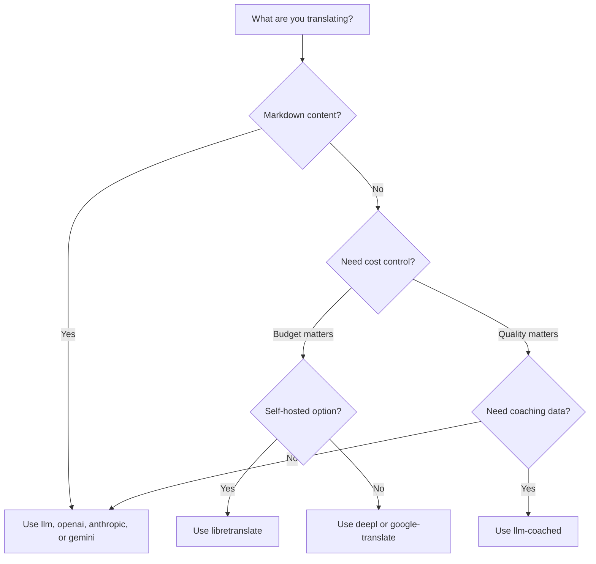

# Mga Paraan ng Pagsasalin

Sinusuportahan po ng Champollion ang iba't ibang paraan ng pagsasalin. Maaari pong gumamit ng magkakaibang paraan ang bawat pares ng wika — hindi po kayo nakakulong sa iisang diskarte para sa inyong buong proyekto.

## Paghahambing ng mga Paraan

### Mga LLM Provider

Nakatuon sa kalidad, Markdown-aware, at compatible sa coaching. Pinakamainam para sa mga proyektong maraming content.

| Paraan | Key | Ginagawa Nito |
|--------|-----|-------------|
| `llm` (default) | `OPENROUTER_API_KEY` | LLM sa pamamagitan ng OpenRouter — 200+ modelo, auto-routing |
| `llm-coached` | `OPENROUTER_API_KEY` | LLM + mga tuntunin sa gramatika, diksyunaryo, style notes |
| `openai` | `OPENAI_API_KEY` | Direktang OpenAI API (gpt-4o, gpt-4o-mini) |
| `anthropic` | `ANTHROPIC_API_KEY` | Direktang Anthropic API (Claude Sonnet, Haiku, Opus) |
| `gemini` | `GEMINI_API_KEY` | Direktang Google Gemini API (Flash, Pro) — libreng tier |

### Tradisyonal na MT

Nakatuon sa bilis at gastos. Pinakamainam para sa mataas na volume ng key-value pairs.

| Paraan | Key | Ano ang Ginagawa Nito |
|--------|-----|-------------|
| `google-translate` | `GOOGLE_TRANSLATE_API_KEY` | Google Cloud Translation API v2 (194 na wika) |
| `deepl` | `DEEPL_API_KEY` | DeepL API na may suporta sa glossary (33 na wika) |
| `microsoft-translator` | `MICROSOFT_TRANSLATOR_API_KEY` | Azure Cognitive Services Translator (135 na wika) |
| `libretranslate` | *(self-hosted)* | Self-hosted na LibreTranslate (AGPL, libre) |
| `tilde` | `TILDE_API_KEY` | Tilde MT — mga engine na binuo sa EU, mahusay sa mga wikang Baltic at European |
| `translated` | `LARA_ACCESS_KEY_ID` + `LARA_ACCESS_KEY_SECRET` | Translated's Lara — propesyonal na adaptive MT (200 na wika) |

### Imprastraktura

| Paraan | Key | Ginagawa Nito |
|--------|-----|-------------|
| `api` | *(bawat provider)* | Manipis na HTTP client para sa anumang REST translation endpoint |

## Decision Tree



---

## `llm` — LLM Translation (Default)

Nagsasalin sa pamamagitan ng anumang LLM sa [OpenRouter](https://openrouter.ai). Ito ang default na paraan at ang pinaka-versatile.

**Paano ito gumagana:**
1. Pinapangkat ang mga key (default na 80/batch) kasama ang mga tagubilin sa register at context
2. Ipinapadala sa OpenRouter bilang structured prompt
3. Pina-parse ang JSON response
4. Bine-validate ang bawat salin sa pamamagitan ng [quality gate](/docs/concepts/quality-gate)
5. Isinusulat ang mga pumapasang salin, at nire-retry o nire-reject ang mga failure

**Kailan gamitin:** Karamihan ng mga proyekto. Lalo na ang mga site na maraming content at may Markdown, kung saan kailangang protektahan ang code blocks at shortcodes.

**Configuration:**

```json
{
  "defaultMethod": "llm",
  "model": "google/gemini-3.5-flash"
}
```

## `llm-coached` — Coached LLM Translation

Pareho ng `llm`, ngunit may mga tuntunin sa gramatika, term dictionaries, at style notes na ini-inject sa bawat prompt.

**Paano ito gumagana:**
1. Naglo-load ng coaching data mula sa `.champollion/coaching/<locale>.json` o sa directory na `coaching/` ng isang plugin
2. Ini-inject ang mga tuntunin sa gramatika, dictionary terms, at style notes sa system prompt
3. Isinasama bilang kinakailangang terminolohiya ang mga dictionary term na tumutugma sa mga source key
4. Nagpapatuloy ang pagsasalin tulad ng sa `llm`, na may coaching data para magdagdag ng katumpakan

**Kailan gamitin:** Mga wikang may limitadong resource, domain-specific na terminolohiya (legal, medikal), formal registers, o anumang sitwasyon kung saan hindi sapat ang katumpakan ng generic na LLM output.

**Format ng coaching data:**

```json title=".champollion/coaching/fr.json"
{
  "grammar_rules": [
    "French adjectives agree in gender and number with the noun they modify",
    "Use 'vous' for formal contexts, 'tu' for informal"
  ],
  "dictionary": {
    "dashboard": "tableau de bord",
    "deployment": "déploiement",
    "settings": "paramètres"
  },
  "style_notes": "Prefer active voice. Avoid anglicisms where a native French term exists."
}
```

Tingnan din: [Gabay sa Mga Wikang May Limitadong Resource](/docs/network/community/low-resource-languages)

---

## `openai` — Direktang OpenAI API

Direktang nagsasalin sa pamamagitan ng OpenAI Chat Completions API. Walang OpenRouter middleman — key ninyo, account ninyo, usage dashboard ninyo.

**Mga modelo:** `gpt-4o` (default), `gpt-4o-mini`

**Mga feature:**
- ✅ Markdown-aware (pagsasalin ng content)
- ✅ Coaching support (mga tuntunin sa gramatika, dictionary overrides, style notes)
- ✅ JSON mode para sa structured key-value output
- ✅ Exponential backoff na may retry

**Configuration:**

```json
{
  "pairs": {
    "en:fr": { "method": "openai", "model": "gpt-4o-mini" }
  }
}
```

```bash
export OPENAI_API_KEY=sk-proj-...
```

Kunin ang inyong key sa [platform.openai.com/api-keys](https://platform.openai.com/api-keys).

## `anthropic` — Direktang Anthropic API

Direktang nagsasalin sa pamamagitan ng Anthropic Messages API. Ginagamit ang parameter na `system` para sa coaching data, na nagpapagana sa prompt caching ng Anthropic.

**Mga modelo:** `claude-sonnet-4-6` (default), `claude-haiku-4-5`, `claude-opus-4-7`

**Mga feature:**
- ✅ Markdown-aware (pagsasalin ng content)
- ✅ Coaching support (mga tuntunin sa gramatika, dictionary overrides, style notes)
- ✅ System prompt caching (pinapantay ang coaching cost sa maraming batch)
- ✅ Exponential backoff na may retry

**Configuration:**

```json
{
  "pairs": {
    "en:ja": { "method": "anthropic", "model": "claude-haiku-4-5" }
  }
}
```

```bash
export ANTHROPIC_API_KEY=sk-ant-...
```

Kunin ang inyong key sa [console.anthropic.com](https://console.anthropic.com/settings/keys).

## `gemini` — Direktang Google Gemini API

Direktang nagsasalin sa pamamagitan ng Google Gemini `generateContent` API. **May available na libreng tier** — pinakamainam na zero-cost na panimulang punto.

**Mga modelo:** `gemini-2.5-flash` (default), `gemini-2.5-pro`

**Mga feature:**
- ✅ Markdown-aware (pagsasalin ng content)
- ✅ Coaching support (mga tuntunin sa gramatika, dictionary overrides, style notes)
- ✅ JSON response mode sa pamamagitan ng `responseMimeType`
- ✅ Libreng tier (malaking daily quota)
- ✅ Exponential backoff na may retry

**Configuration:**

```json
{
  "pairs": {
    "en:ko": { "method": "gemini", "model": "gemini-2.5-pro" }
  }
}
```

```bash
export GEMINI_API_KEY=AI...
```

Kunin ang inyong key sa [aistudio.google.com/apikey](https://aistudio.google.com/apikey).

### Model Validation {#model-validation}

Bine-validate ng mga direct LLM provider (`openai`, `anthropic`, `gemini`) ang inyong model string sa unang paggamit. Nahuhuli nito ang tatlong kategorya ng pagkakamali:

**Maling format ng method** — Paggamit ng OpenRouter-style na model path sa isang direct provider:

```
[WARN] OpenAI: model "google/gemini-3.5-flash" looks like an OpenRouter path.
       Direct providers use bare model names (e.g., "gpt-4o").
       To use OpenRouter models, set method to 'llm' instead.
```

**Maling provider** — Paggamit ng model mula sa ganap na ibang provider:

```
[WARN] Gemini: model "claude-sonnet-4-6" is an Anthropic model.
       This provider (gemini) cannot serve Anthropic models.
       Use --method anthropic or set "method": "anthropic" in config.
```

**Deprecated o maling baybay na model** — Sa unang API call, kinukuha ng champollion ang live model list ng provider at tine-check ang inyong model laban dito:

```
[WARN] Gemini: model "gemini-1.5-flash" not found in available models.
       Similar models: gemini-2.0-flash, gemini-2.5-flash, gemini-2.5-pro
       The API call will proceed — the provider will give the final verdict.
```

:::note[Mga babala ito, hindi mga error]
Nagla-log ang model validation ng mga babala ngunit hindi nito bina-block ang API call. Ang provider API ang nagbibigay ng pinal na hatol — maaaring tumugma ang pangalan ng isang model sa hinaharap sa ibang pattern, at hindi namin nais na mag-gate batay sa heuristics.
:::

---

## `google-translate` — Google Cloud Translation API

Direktang integration sa Google Cloud Translation API v2. Ginagamit ang REST API — walang SDK, walang service account. API key lang.

**Kailan po gagamitin:** Para sa mga high-volume na key-value string pair kung saan mas mahalaga po ang bilis at gastos kaysa sa nuance. Sinusuportahan po nito ang 194 na wika out of the box ([inilathalang listahan ng Google](https://docs.cloud.google.com/translate/docs/languages)).

**Mga limitasyon:**
- ⚠️ **Walang Markdown awareness.** Masisira nito ang code blocks, shortcodes, at interpolation variables.
- Walang kontrol sa register/tone
- Walang coaching o pagpapatupad ng terminolohiya

```bash
npx champollion sync --method google-translate
```

:::tip[Auto-detection]
Kung `GOOGLE_TRANSLATE_API_KEY` lang ang naka-set (walang OpenRouter key), awtomatikong lumilipat ang champollion sa Google Translate. Hindi kailangan ng pagbabago sa config.
:::

## `deepl` — DeepL API

Direktang integration sa DeepL translation API. Sumusuporta sa glossaries para sa consistent na terminolohiya.

**Kailan gamitin:** Mga wikang European kung saan mahusay ang DeepL (German, French, Spanish, Dutch, Polish, atbp.). Ipinapatupad ng glossary support ang consistent na terminolohiya nang walang coaching data.

**Mga feature:**
- ✅ Awtomatikong free/pro endpoint detection (suffix na `:fx` sa free keys)
- ✅ Paggawa at pamamahala ng glossary
- ✅ Kontrol sa formality level
- ⚠️ **Walang Markdown awareness** — key-value pairs lang

**Configuration:**

```json
{
  "pairs": {
    "en:de": { "method": "deepl" }
  }
}
```

```bash
export DEEPL_API_KEY=your-key-here
```

Kunin ang inyong key sa [deepl.com/pro-api](https://www.deepl.com/pro-api).

## `microsoft-translator` — Azure Cognitive Services

Direktang integration sa Microsoft Translator Text API v3.

**Kailan po gagamitin:** Sa mga enterprise environment na may umiiral nang Azure infrastructure. Sinusuportahan po nito ang 135 na wika, kabilang ang ilan na hindi saklaw ng Google Translate (Tibetan, Faroese, Inuktitut, at iba pa).

**Mga feature:**
- ✅ Hanggang 100 segment bawat request (mataas na throughput)
- ✅ Optional na region parameter para sa latency optimization
- ⚠️ **Walang Markdown awareness** — key-value pairs lang
- ⚠️ **Walang content translation** — key-value pairs lang

**Configuration:**

```json
{
  "pairs": {
    "en:ar": { "method": "microsoft-translator" }
  }
}
```

```bash
export MICROSOFT_TRANSLATOR_API_KEY=your-key
export MICROSOFT_TRANSLATOR_REGION=global  # optional
```

Kunin ang inyong key mula sa [Azure Portal](https://portal.azure.com) → Cognitive Services → Translator.

## `libretranslate` — Self-Hosted Translation

Self-hosted open-source translation gamit ang LibreTranslate. Tumatakbo locally o sa sarili ninyong infrastructure — zero API costs, buong data sovereignty.

**Kailan gamitin:** Mga proyektong nangangailangan ng offline translation, pagsunod sa data privacy (GDPR), o zero-cost operation. Lalo itong kapaki-pakinabang para sa CI pipelines na hindi dapat umasa sa external APIs.

**Mga feature:**
- ✅ Self-hosted — walang external API calls
- ✅ Libre at open source (AGPL-3.0)
- ✅ May available na Docker deployment
- ⚠️ **Walang Markdown awareness** — key-value pairs lang
- ⚠️ **Walang content translation** — key-value pairs lang
- ⚠️ Nag-iiba ang kalidad depende sa pares ng wika

**Setup:**

```bash
# Run LibreTranslate locally with Docker
docker run -d -p 5000:5000 libretranslate/libretranslate

# Configure (optional — defaults to localhost:5000)
export LIBRETRANSLATE_API_URL=http://localhost:5000/translate
```

```json
{
  "pairs": {
    "en:es": { "method": "libretranslate" }
  }
}
```

---

## `api` — Remote Translation API

Isang manipis na HTTP client para sa community-hosted o IP-protected translation endpoints. Ipinapadala ng Champollion ang mga key at tumatanggap pabalik ng mga salin — wala itong anumang translation logic.

**Kailan gamitin:** Kapag naka-host server-side ang mga translation method (hal., proprietary coaching data, fine-tuned models, FST pipelines na hindi maaaring i-distribute).

```json
{
  "pairs": {
    "en:crk": {
      "method": "api",
      "endpoint": "https://api.example.com/v1/translate",
      "apiKey": "your-key"
    }
  }
}
```

:::note[Pagsasaling Kontrolado ng Komunidad (sovereignty-aspirant)]
Ang paraang `api` po ay ang tulay patungo sa **community-hosted na pagsasalin sa ilalim ng kontrol ng komunidad (sovereignty-aspirant)**. Maaari pong mag-host ang mga komunidad ng mga Katutubo at minoryang wika ng kanilang sariling mga translation endpoint — upang mapanatili ang coaching data, mga fine-tuned na modelo, at linguistic IP sa ilalim ng kontrol ng komunidad — habang ang Champollion po ay kumokonekta sa kanila bilang isang thin client.

Tingnan ang [Suportahan ang Wikang May Limitadong Resource](/docs/network/community/low-resource-languages) para sa buong community-hosting walkthrough, at [Pag-serve ng Method sa pamamagitan ng API](/docs/guides/serving-a-method) para sa mga requirement ng endpoint.
:::

---

## Per-Pair Configuration

Ang tunay na lakas ay ang paghahalo ng mga method bawat pares ng wika:

```json title="champollion.config.json"
{
  "version": 3,
  "pairs": {
    "en:fr": { "method": "deepl" },
    "en:ja": { "method": "openai", "model": "gpt-4o" },
    "en:ko": { "method": "gemini" },
    "en:ar": { "method": "microsoft-translator" },
    "en:crk": { "methodPlugin": "crk-coached-v1" }
  }
}
```

Isinasalin nito ang French sa pamamagitan ng DeepL (glossary support), Japanese sa pamamagitan ng OpenAI (kalidad), Korean sa pamamagitan ng Gemini (libreng tier), Arabic sa pamamagitan ng Microsoft Translator (coverage), at Plains Cree sa pamamagitan ng coached plugin (specialized).

## Plugins

Ang plugins ay mga pre-packaged translation recipe para sa mga partikular na language pair. Ang mga ito ay JSON manifests — hindi code — na nagsasabi sa champollion kung aling method ang gagamitin, kasama ang mga setting, at kung anong kalidad ang na-benchmark.

:::tip[Mula eval harness patungong production sa isang command]
Ang mga plugin na binuo at napatunayan sa [eval harness](/docs/network/specifications/harness) ay maaaring direktang i-install — ang pamamaraang bina-validate ninyo roon ay nade-deploy dito gamit ang isang command na `plugin install`. Tingnan ang [MT Evaluation](/docs/network/leaderboard/rules) para sa kumpletong workflow ng evaluation.
:::

```bash
champollion plugin install ./french-formal-v1/
champollion plugin list
champollion plugin remove french-formal-v1
```

Tingnan ang [Plugin Specification](/docs/reference/plugin-spec) para sa buong manifest format.

---

## Paglipat ng Providers

Lilipat ba kayo sa pagitan ng mga method? Nagbabago ang model format at env var — narito ang mapa:

### OpenRouter → Direct Provider

```diff title="champollion.config.json"
 {
   "pairs": {
     "en:fr": {
-      "method": "llm",
-      "model": "openai/gpt-4o"
+      "method": "openai",
+      "model": "gpt-4o"
     }
   }
 }
```

```diff title="Environment variables"
- export OPENROUTER_API_KEY=sk-or-v1-...
+ export OPENAI_API_KEY=sk-proj-...
```

**Mahahalagang pagkakaiba:**
- Ginagamit ng OpenRouter ang format na `provider/model` (hal., `openai/gpt-4o`). Gumagamit ang direct providers ng bare model names (hal., `gpt-4o`).
- May sariling env var ang bawat direct provider (`OPENAI_API_KEY`, `ANTHROPIC_API_KEY`, `GEMINI_API_KEY`).
- Kung mali ang model format na ginamit ninyo, babalaan kayo ng champollion — tingnan ang [Model Validation](#model-validation).

### Direct Provider → OpenRouter

```diff title="champollion.config.json"
 {
   "pairs": {
     "en:ja": {
-      "method": "anthropic",
-      "model": "claude-sonnet-4-6"
+      "method": "llm",
+      "model": "anthropic/claude-sonnet-4-6"
     }
   }
 }
```

:::tip[Kailan gagamitin ang OpenRouter kumpara sa Direct]
**Gamitin ang OpenRouter** kapag nais ninyong lumipat-lipat sa pagitan ng mga model nang hindi binabago ang env vars, o kapag nais ninyong magkaroon ng access sa 200+ models mula sa iisang key. **Gamitin ang direct providers** kapag nais ninyo ng mas simpleng billing, mas mababang latency (walang tagapamagitan), o access sa mga provider-specific feature tulad ng prompt caching ng Anthropic.
:::

---

## Paghahambing ng Gastos

Tinatayang gastos bawat 1,000 naisaling key (ipinagpapalagay ang ~10 token bawat key, 80 key bawat batch):

| Paraan | Gastos / 1K Key | Bilis | Kalidad | Pinakamainam Para Sa |
|--------|----------------|-------|---------|----------|
| `gemini` (Flash) | **Libre** (sa loob ng tier) | Mabilis | Maganda | Pagsisimula, personal na mga proyekto |
| `google-translate` | ~$0.02 | Pinakamabilis | Sapat | Mataas na volume, mga wikang European |
| `deepl` | ~$0.02 | Mabilis | Maganda | Mga wikang European, terminolohiya |
| `microsoft-translator` | ~$0.01 | Mabilis | Sapat | Mga Azure shop, malawak na language coverage |
| `libretranslate` | **Libre** (self-hosted) | Nag-iiba | Katamtaman | Air-gapped, GDPR, CI pipelines |
| `gemini` (Pro) | ~$0.07 | Katamtaman | Napakaganda | Sensitibo sa kalidad, libreng quota |
| `openai` (GPT-4o-mini) | ~$0.01 | Mabilis | Maganda | Budget LLM |
| `openai` (GPT-4o) | ~$0.10 | Katamtaman | Napakaganda | Sensitibo sa kalidad |
| `anthropic` (Haiku) | ~$0.01 | Mabilis | Maganda | Budget LLM |
| `anthropic` (Sonnet) | ~$0.10 | Katamtaman | Napakaganda | Sensitibo sa kalidad |
| `anthropic` (Opus) | ~$0.50 | Mabagal | Napakahusay | Pinakamataas na kalidad |
| `llm` (OpenRouter) | Nag-iiba ayon sa model | Nag-iiba | Nag-iiba | Paghahambing ng model, eksperimento |

:::note[Mga pagtatantya ito]
Nakadepende ang aktuwal na gastos sa haba ng inyong source text, batch size, at mga pagbabago sa pricing ng provider. Tingnan ang kasalukuyang pricing page ng bawat provider para sa eksaktong rates.
:::

---

## Tingnan Din

- [Mga Sinusuportahang Wika](/docs/reference/supported-languages)
- [Coaching Data](/docs/concepts/coaching-data)
- [Suportahan ang Wikang May Limitadong Resource](/docs/network/community/low-resource-languages)
- [Plugin Specification](/docs/reference/plugin-spec)
- [Pag-serve ng Method sa pamamagitan ng API](/docs/guides/serving-a-method)
- [Quality Gate](/docs/concepts/quality-gate)
- [Architecture](/docs/concepts/architecture)
- [Troubleshooting](/docs/guides/troubleshooting) — mga model error, isyu sa API


