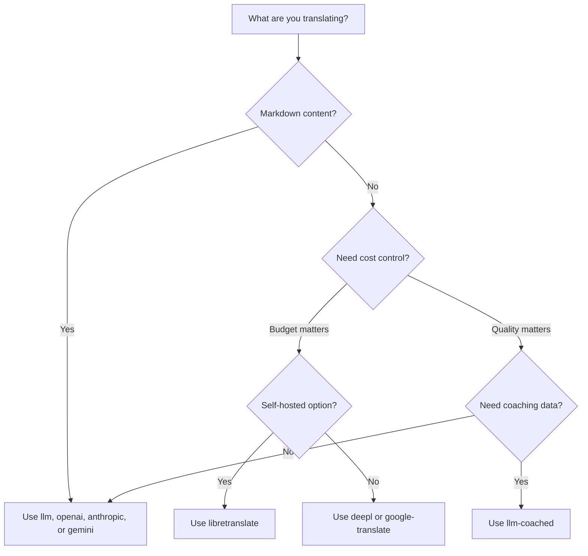

# Mga Paraan ng Pagsasalin

Sumusuporta ang Champollion sa maraming pamamaraan ng pagsasalin. Maaaring gumamit ang bawat language pair ng ibang pamamaraan — hindi kayo nakatali sa iisang paraan para sa inyong buong proyekto.

## Paghahambing ng mga Paraan

### Mga LLM Provider

Nakatuon sa kalidad, Markdown-aware, at compatible sa coaching. Pinakamainam para sa mga proyektong maraming content.

| Pamamaraan | Key | Ang Ginagawa Nito |
|------------|-----|-------------------|
| `llm` (default) | `OPENROUTER_API_KEY` | LLM sa pamamagitan ng OpenRouter — 200+ modelo, auto-routing |
| `llm-coached` | `OPENROUTER_API_KEY` | LLM + mga panuntunan sa gramatika, mga diksiyonaryo, mga tala sa estilo |
| `openai` | `OPENAI_API_KEY` | Direktang OpenAI API (gpt-4o, gpt-4o-mini) |
| `anthropic` | `ANTHROPIC_API_KEY` | Direktang Anthropic API (Claude Sonnet, Haiku, Opus) |
| `gemini` | `GEMINI_API_KEY` | Direktang Google Gemini API (Flash, Pro) — libreng tier |
| `local` | *(wala)* | Isang modelo sa inyong sariling makina o server: Ollama, vLLM, LM Studio, llama.cpp, o isang modelong sinanay ninyo gamit ang `nmt-forge`. Hindi kailanman umaalis ang teksto sa inyong imprastruktura |

### Tradisyonal na MT

Nakatuon sa bilis at gastos. Pinakamainam para sa mataas na volume ng key-value pairs.

| Pamamaraan | Key | Ang Ginagawa Nito |
|------------|-----|-------------------|
| `google-translate` | `GOOGLE_TRANSLATE_API_KEY` | Google Cloud Translation API v2 (194 na wika) |
| `deepl` | `DEEPL_API_KEY` | DeepL API na may suporta sa glossary (33 wika) |
| `microsoft-translator` | `MICROSOFT_TRANSLATOR_API_KEY` | Azure Cognitive Services Translator (135 wika) |
| `libretranslate` | *(self-hosted)* | Self-hosted LibreTranslate (AGPL, libre) |
| `tilde` | `TILDE_API_KEY` | Tilde MT — mga engine na binuo sa EU, mahusay sa mga wikang Baltic at European |
| `translated` | `LARA_ACCESS_KEY_ID` + `LARA_ACCESS_KEY_SECRET` | Lara ng Translated — propesyonal na adaptive MT (200 wika) |

### Imprastraktura

| Paraan | Key | Ginagawa Nito |
|--------|-----|-------------|
| `api` | *(bawat provider)* | Manipis na HTTP client para sa anumang REST translation endpoint |

## Decision Tree


```mermaid
flowchart TD
    A["What are you translating?"] --> B{"Markdown content?"}
    B -->|Yes| C["Use llm, openai, anthropic, or gemini"]
    B -->|No| D{"Need cost control?"}
    D -->|Budget matters| E{"Self-hosted option?"}
    D -->|Quality matters| F{"Need coaching data?"}
    E -->|Yes| G["Use libretranslate"]
    E -->|No| H["Use deepl or google-translate"]
    F -->|Yes| I["Use llm-coached"]
    F -->|No| C
```

---

## `llm` — LLM Translation (Default)

Nagsasalin sa pamamagitan ng anumang LLM sa [OpenRouter](https://openrouter.ai). Ito ang default na paraan at ang pinaka-versatile.

**Paano ito gumagana:**
1. Pinapangkat ang mga key (default na 80/batch) kasama ang mga tagubilin sa register at context
2. Ipinapadala sa OpenRouter bilang structured prompt
3. Pina-parse ang JSON response
4. Bine-validate ang bawat salin sa pamamagitan ng [quality gate](/docs/concepts/quality-gate)
5. Isinusulat ang mga pumapasang salin, at nire-retry o nire-reject ang mga failure

**Kailan gamitin:** Karamihan ng mga proyekto. Lalo na ang mga site na maraming content at may Markdown, kung saan kailangang protektahan ang code blocks at shortcodes.

**Configuration:**

```json
{
  "defaultMethod": "llm",
  "model": "google/gemini-3.8-flash"
}
```

## `llm-coached` — Coached LLM Translation

Pareho ng `llm`, ngunit may mga tuntunin sa gramatika, term dictionaries, at style notes na ini-inject sa bawat prompt.

**Paano ito gumagana:**
1. Naglo-load ng coaching data mula sa `.champollion/coaching/<locale>.json` o sa directory na `coaching/` ng isang plugin
2. Ini-inject ang mga tuntunin sa gramatika, dictionary terms, at style notes sa system prompt
3. Isinasama bilang kinakailangang terminolohiya ang mga dictionary term na tumutugma sa mga source key
4. Nagpapatuloy ang pagsasalin tulad ng sa `llm`, na may coaching data para magdagdag ng katumpakan

**Kailan gamitin:** Mga wikang may limitadong resource, domain-specific na terminolohiya (legal, medikal), formal registers, o anumang sitwasyon kung saan hindi sapat ang katumpakan ng generic na LLM output.

**Format ng coaching data:**

```json title=".champollion/coaching/fr.json"
{
  "grammar_rules": [
    "French adjectives agree in gender and number with the noun they modify",
    "Use 'vous' for formal contexts, 'tu' for informal"
  ],
  "dictionary": {
    "dashboard": "tableau de bord",
    "deployment": "déploiement",
    "settings": "paramètres"
  },
  "style_notes": "Prefer active voice. Avoid anglicisms where a native French term exists."
}
```

Tingnan din: [Gabay sa Mga Wikang May Limitadong Resource](/docs/network/community/low-resource-languages)

---

## `openai` — Direktang OpenAI API

Direktang nagsasalin sa pamamagitan ng OpenAI Chat Completions API. Walang OpenRouter middleman — key ninyo, account ninyo, usage dashboard ninyo.

**Mga Modelo:** `gpt-5.4-mini-2026-03-17` (default — isang may-petsang snapshot), o anumang eksaktong model id na nakatala sa OpenAI

**Mga Tampok:**
- ✅ May kamalayan sa Markdown (pagsasalin ng nilalaman)
- ✅ Parehong prompt gaya ng `llm` — register, gabay sa kasarian, konteksto ng prompt, mga protektadong termino, gabay sa `coachingFile` at mga termino ng glossary sa bawat batch ([tingnan sa ibaba](#one-prompt-every-llm-method))
- ✅ JSON mode para sa structured na key-value na output
- ✅ Exponential backoff na may retry

**Configuration:**

```json
{
  "pairs": {
    "en:fr": { "method": "openai", "model": "gpt-4o-mini" }
  }
}
```

```bash
export OPENAI_API_KEY=sk-proj-...
```

Kunin ang inyong key sa [platform.openai.com/api-keys](https://platform.openai.com/api-keys).

## `local` — Ang Sarili Ninyong Modelo (Ollama, vLLM, LM Studio, isang sinanay na modelo)

Nagsasalin gamit ang anumang modelong nasa likod ng isang **OpenAI-compatible** na endpoint na
pinapatakbo ninyo: Ollama, vLLM, LM Studio, server ng llama.cpp, o isang modelong sinanay ninyo gamit
ang `nmt-forge`. Walang API key na kailangan, at walang tekstong napupunta sa third party. Ito ang
pamamaraang dapat gamitin para sa sensitibong teksto, at ang nagde-deploy ng modelong kayo mismo ang
bumuo.

```json
{ "defaultMethod": "local", "model": "llama3.1" }
```

```bash
# Optional: only if your server is not at Ollama's default address
export LOCAL_API_BASE=http://localhost:11434/v1
npx champollion sync --method local
```

Binabasa ang endpoint mula sa, ayon sa pagkakasunod-sunod: `LOCAL_API_BASE`, `OPENAI_API_BASE`,
`OPENAI_BASE_URL`, pagkatapos ay ang default ng Ollama na `http://localhost:11434/v1`. Kapag ang
endpoint ay nasa makinang ito (`localhost`, `127.0.0.1`, `::1`), ang gastusin ay
ipinapakita bilang **$0 API cost (runs on this machine)** — walang bayarin sa API; ang sarili
ninyong hardware at kuryente ay hindi ibinibilang — at pinapahintulutan ng `--max-cost` na magpatuloy
ang pagpapatakbo. Anumang iba pang endpoint (Groq, Together, isang server sa inyong network) ay
iniuulat bilang **unknown**, hindi kailanman $0, dahil hindi malalaman ng tool kung magkano ang singil
nito, kaya tumatanggi ang `--max-cost` sa halip na manghula. Sa `--json`, naglalaman ang
hanay ng pagtatantya ng `"estimatedCost": 0, "local": true` para sa unang sitwasyon
at `"estimatedCost": null` para sa ikalawa. (Ang isang proxy sa makinang ito na
nagpapasa sa isang bayarang API — LiteLLM, isang gateway — ay sinisingil sa upstream, na hindi
nakikita ng Champollion: maglaan ng badyet para rito doon.)

Bago magsalin, sinusuri ng sync kung may sumasagot na server sa endpoint. Kapag
walang sumasagot, ang isang run na may ipapadala rito ay hihinto bago magpadala ng anuman
(exit `1`), na tinutukoy ang address. Ang isang run na walang ipapadala rito — walang
nakapila, o ang bawat nakapilang key ay galing sa cache, gaya ng muling paggawa ng tekstong
naisalin na — ay magbababala na offline ang server at magpapatuloy. Sa isang CI
runner (nakatakda ang `CI` o `GITHUB_ACTIONS`), ang isang server na hindi sumasagot ay nagpapatigil sa bawat run, kahit pa ang isa
na walang nakapila, upang ang isang workflow na gumagamit pa rin ng `local` ay mabigo sa unang
push nito sa halip na kapag may nagbago nang string ([gabay sa CI](/docs/guides/ci-cd)).

Tinatanggap ng pamamaraang `openai` ang parehong `OPENAI_API_BASE` / `OPENAI_BASE_URL`
na override upang maabot ang anumang OpenAI-compatible na provider (Groq, Together, …) gamit ang
isang key.

## `anthropic` — Direktang Anthropic API

Direktang nagsasalin sa pamamagitan ng Anthropic Messages API. Napupunta ang mga tagubilin sa parametrong `system`, na nagpapagana sa prompt caching ng Anthropic.

**Mga modelo:** `claude-sonnet-4-6` (default), `claude-haiku-4-5`, `claude-opus-4-7`

**Mga Tampok:**
- ✅ May kamalayan sa Markdown (pagsasalin ng nilalaman)
- ✅ Parehong prompt gaya ng `llm` — register, gabay sa kasarian, konteksto ng prompt, mga protektadong termino, gabay sa `coachingFile` at mga termino ng glossary sa bawat batch ([tingnan sa ibaba](#one-prompt-every-llm-method))
- ✅ System prompt caching (ibinabahagi ang gastos sa pagproseso ng mga tagubilin sa mga batch)
- ✅ Exponential backoff na may retry

**Configuration:**

```json
{
  "pairs": {
    "en:ja": { "method": "anthropic", "model": "claude-haiku-4-5" }
  }
}
```

```bash
export ANTHROPIC_API_KEY=sk-ant-...
```

Kunin ang inyong key sa [console.anthropic.com](https://console.anthropic.com/settings/keys).

## `gemini` — Direktang Google Gemini API

Direktang nagsasalin sa pamamagitan ng Google Gemini `generateContent` API. **May available na libreng tier** — pinakamainam na zero-cost na panimulang punto.

**Mga Modelo:** `gemini-3.8-flash` (default), o anumang eksaktong model id na nakatala sa Google

**Mga Tampok:**
- ✅ May kamalayan sa Markdown (pagsasalin ng nilalaman)
- ✅ Parehong prompt gaya ng `llm` — register, gabay sa kasarian, konteksto ng prompt, mga protektadong termino, gabay sa `coachingFile` at mga termino ng glossary sa bawat batch ([tingnan sa ibaba](#one-prompt-every-llm-method))
- ✅ JSON response mode sa pamamagitan ng `responseMimeType`
- ✅ Libreng tier (bukas-palad na pang-araw-araw na quota)
- ✅ Exponential backoff na may retry

**Configuration:**

```json
{
  "pairs": {
    "en:ko": { "method": "gemini", "model": "gemini-2.5-pro" }
  }
}
```

```bash
export GEMINI_API_KEY=AI...
```

Kunin ang inyong key sa [aistudio.google.com/apikey](https://aistudio.google.com/apikey).

### Isang prompt, bawat pamamaraan ng LLM {#one-prompt-every-llm-method}

Ang `llm`, `openai`, `anthropic`, `gemini` at `local` ay nagpapadala ng parehong mga tagubilin
para sa parehong proyekto; nagkakaiba lamang kung saan napupunta ang kahilingan. Dala ng system message
ang register, ang gabay sa kasarian ng wika, ang inyong `promptContext`,
ang inyong `protectedTerms` at ang inyong tekstong `coachingFile`; dala naman ng mensahe ng bawat batch
ang mga termino ng glossary na nilalaman nito (ang `dictionary` sa
`.champollion/coaching/<locale>.json`), ang mga tagubilin para sa bawat key (mga plural
form, konteksto ng gettext, mga paglalarawan) at ang mga string. Tingnan ito para sa inyong sarili —
walang ipinapadala:

```bash
npx champollion sync --dry --method local --show-prompt
```

Ang mga panuntunan sa gramatika at mga tala sa estilo ng coaching file ay binabasa ng `llm-coached`,
sa anumang provider: `{ "method": "llm-coached", "provider": "openai" }`.

### Mga Pangalan ng Modelo {#model-names}

Ipinapadala sa isang direktang provider ang sarili nitong pangalan para sa isang modelo. Ang isang id
na estilong-OpenRouter ay imina-map kapag mayroon ang provider ng modelong iyon: `openai/gpt-5.5` → `gpt-5.5` sa `openai`,
`anthropic/claude-haiku-4.5` → `claude-haiku-4-5` sa `anthropic`,
`google/gemini-3.8-flash` → `gemini-3.8-flash` sa `gemini`. Ang isang id na walang katumbas na modelo ang
provider ay nagpapatigil sa pagpapatakbo bago pa man may maipadala:

```
[ERR] sync failed: en:fr: model "google/gemini-3.8-flash" (from the top-level "model") is an OpenRouter model id
      — openai calls OpenAI directly, which has no model by that name. Use an OpenAI model (e.g. --model gpt-4o),
      --method gemini (its name for it: "gemini-3.8-flash") or --method llm to run it through OpenRouter.
```

Ang `local`, at ang `openai` na nakaturo sa ibang server gamit ang `OPENAI_API_BASE`, ay nagpapadala
ng pangalan ayon sa pagkakasulat ninyo — ang server na iyon ang nagpapasya kung ano ang ibig sabihin nito.

### Mga Eksaktong Slug Lamang {#exact-slugs}

Ang bawat modelo ay pinapangalanan ayon sa eksaktong slug nito, sa bawat pamamaraan: `google/gemini-3.8-flash`
sa OpenRouter, ang sariling eksaktong pangalan ng isang direktang provider (`gpt-5.5`) sa `openai`. Walang
maikling pangalan ang nagre-resolve sa isang modelo, at ang isang floating id (ang mga `~vendor/…`
router id ng OpenRouter, anumang pangalang `…-latest` o `:latest`) ay tinatanggihan din: tinutukoy nito
kung anumang modelo ang itinuturo ng provider ngayon, kaya hindi masasabi ng isang run kung aling
modelo ang nagsalin. Alinman dito ay nagpapatigil sa pagpapatakbo bago pa man may maipadala:

```
[ERR] sync failed: "gemini-flash" (from --model) is not a model id — Champollion takes exact model slugs only,
      no aliases. Did you mean google/gemini-3.8-flash (what "gemini-flash" used to stand for)? List models:
      https://openrouter.ai/models (OpenRouter slugs), or champollion models --method <gemini|openai|anthropic>
      (a direct provider's own names).
```

### Model Validation {#model-validation}

Sinusuri rin ng mga direktang LLM provider (`openai`, `anthropic`, `gemini`) ang pangalan ng inyong modelo sa unang paggamit (hindi kapag nakikipag-ugnayan sila sa ibang server sa pamamagitan ng `OPENAI_API_BASE`). Nahuhuli nito ang dalawang kategorya ng mga pagkakamali:

**Maling provider** — Paggamit ng model mula sa ganap na ibang provider:

```
[WARN] Gemini: model "claude-sonnet-4-6" is an Anthropic model.
       This provider (gemini) cannot serve Anthropic models.
       Use --method anthropic or set "method": "anthropic" in config.
```

**Deprecated o maling baybay na model** — Sa unang API call, kinukuha ng champollion ang live model list ng provider at tine-check ang inyong model laban dito:

```
[WARN] Gemini: model "gemini-1.5-flash" not found in available models.
       Similar models: gemini-2.0-flash, gemini-2.5-flash, gemini-2.5-pro
       The API call will proceed — the provider will give the final verdict.
```

:::note[Mga babala ito, hindi mga error]
Nagla-log ang model validation ng mga babala ngunit hindi nito bina-block ang API call. Ang provider API ang nagbibigay ng pinal na hatol — maaaring tumugma ang pangalan ng isang model sa hinaharap sa ibang pattern, at hindi namin nais na mag-gate batay sa heuristics.
:::

---

## `google-translate` — Google Cloud Translation API

Direktang integration sa Google Cloud Translation API v2. Ginagamit ang REST API — walang SDK, walang service account. API key lang.

**Kailan dapat gamitin:** Mga pares ng key-value string na may mataas na bulto kung saan mas mahalaga ang bilis at gastos kaysa sa nuance. Sumusuporta sa 194 na wika out of the box ([inilathalang listahan ng Google](https://docs.cloud.google.com/translate/docs/languages)).

**Mga limitasyon:**
- ⚠️ **Walang Markdown awareness.** Masisira nito ang code blocks, shortcodes, at interpolation variables.
- Walang kontrol sa register/tone
- Walang coaching o pagpapatupad ng terminolohiya

```bash
npx champollion sync --method google-translate
```

:::tip[Auto-detection]
Kung `GOOGLE_TRANSLATE_API_KEY` lang ang naka-set (walang OpenRouter key), awtomatikong lumilipat ang champollion sa Google Translate. Hindi kailangan ng pagbabago sa config.
:::

## `deepl` — DeepL API

Direktang integration sa DeepL translation API. Sumusuporta sa glossaries para sa consistent na terminolohiya.

**Kailan gamitin:** Mga wikang European kung saan mahusay ang DeepL (German, French, Spanish, Dutch, Polish, atbp.). Ipinapatupad ng glossary support ang consistent na terminolohiya nang walang coaching data.

**Mga feature:**
- ✅ Awtomatikong free/pro endpoint detection (suffix na `:fx` sa free keys)
- ✅ Paggawa at pamamahala ng glossary
- ✅ Kontrol sa formality level
- ⚠️ **Walang Markdown awareness** — key-value pairs lang

**Configuration:**

```json
{
  "pairs": {
    "en:de": { "method": "deepl" }
  }
}
```

```bash
export DEEPL_API_KEY=your-key-here
```

Kunin ang inyong key sa [deepl.com/pro-api](https://www.deepl.com/pro-api).

## `microsoft-translator` — Azure Cognitive Services

Direktang integration sa Microsoft Translator Text API v3.

**Kailan dapat gamitin:** Mga enterprise na kapaligiran na may umiiral nang Azure infrastructure. Sumusuporta sa 135 wika, kabilang ang ilan na hindi sakop ng Google Translate (Tibetan, Faroese, Inuktitut, at iba pa).

**Mga feature:**
- ✅ Hanggang 100 segment bawat request (mataas na throughput)
- ✅ Optional na region parameter para sa latency optimization
- ⚠️ **Walang Markdown awareness** — key-value pairs lang
- ⚠️ **Walang content translation** — key-value pairs lang

**Configuration:**

```json
{
  "pairs": {
    "en:ar": { "method": "microsoft-translator" }
  }
}
```

```bash
export MICROSOFT_TRANSLATOR_API_KEY=your-key
export MICROSOFT_TRANSLATOR_REGION=global  # optional
```

Kunin ang inyong key mula sa [Azure Portal](https://portal.azure.com) → Cognitive Services → Translator.

## `libretranslate` — Self-Hosted Translation

Self-hosted open-source translation gamit ang LibreTranslate. Tumatakbo locally o sa sarili ninyong infrastructure — zero API costs, buong data sovereignty.

**Kailan gamitin:** Mga proyektong nangangailangan ng offline translation, pagsunod sa data privacy (GDPR), o zero-cost operation. Lalo itong kapaki-pakinabang para sa CI pipelines na hindi dapat umasa sa external APIs.

**Mga feature:**
- ✅ Self-hosted — walang external API calls
- ✅ Libre at open source (AGPL-3.0)
- ✅ May available na Docker deployment
- ⚠️ **Walang Markdown awareness** — key-value pairs lang
- ⚠️ **Walang content translation** — key-value pairs lang
- ⚠️ Nag-iiba ang kalidad depende sa pares ng wika

**Setup:**

```bash
# Run LibreTranslate locally with Docker
docker run -d -p 5000:5000 libretranslate/libretranslate

# Configure (optional — defaults to localhost:5000)
export LIBRETRANSLATE_API_URL=http://localhost:5000/translate
```

```json
{
  "pairs": {
    "en:es": { "method": "libretranslate" }
  }
}
```

---

## `api` — Remote Translation API

Isang manipis na HTTP client para sa community-hosted o IP-protected translation endpoints. Ipinapadala ng Champollion ang mga key at tumatanggap pabalik ng mga salin — wala itong anumang translation logic.

**Kailan gamitin:** Kapag naka-host server-side ang mga translation method (hal., proprietary coaching data, fine-tuned models, FST pipelines na hindi maaaring i-distribute).

```json
{
  "pairs": {
    "en:crk": {
      "method": "api",
      "endpoint": "https://api.example.com/v1/translate",
      "apiKey": "your-key"
    }
  }
}
```

:::note[Pagsasalin na Kontrolado ng Komunidad (sovereignty-aspirant)]
Ang pamamaraang `api` ang tulay patungo sa **pagsasaling hino-host ng komunidad sa ilalim ng kontrol ng komunidad (sovereignty-aspirant)**. Maaaring mag-host ang mga katutubong komunidad at mga komunidad ng wikang minorya ng kanilang sariling mga translation endpoint — pinananatili ang datos ng coaching, mga fine-tuned na modelo, at lingguwistikong IP sa ilalim ng kontrol ng komunidad — habang kumokonekta ang Champollion sa mga ito bilang isang thin client.

Tingnan ang [Suportahan ang Wikang May Limitadong Resource](/docs/network/community/low-resource-languages) para sa buong community-hosting walkthrough, at [Pag-serve ng Method sa pamamagitan ng API](/docs/guides/serving-a-method) para sa mga requirement ng endpoint.
:::

---

## Per-Pair Configuration

Ang tunay na lakas ay ang paghahalo ng mga method bawat pares ng wika:

```json title="champollion.config.json"
{
  "version": 3,
  "pairs": {
    "en:fr": { "method": "deepl" },
    "en:ja": { "method": "openai", "model": "gpt-4o" },
    "en:ko": { "method": "gemini" },
    "en:ar": { "method": "microsoft-translator" },
    "en:crk": { "method": "llm-coached" }
  }
}
```

Isinasalin nito ang Pranses sa pamamagitan ng DeepL (suporta sa glossary), Hapones sa pamamagitan ng OpenAI (kalidad), Koreano sa pamamagitan ng Gemini (libreng tier), Arabe sa pamamagitan ng Microsoft Translator (saklaw), at Plains Cree sa pamamagitan ng pamamaraang coached LLM, na may mga tala sa gramatika at diksiyonaryong ibinibigay ninyo.

## Fallback — pangalawang pamamaraan para sa isang pares {#fallback}

Bihirang hawakan ng iisang pamamaraan ang lahat. Ang isang maliit na modelong kayo mismo ang nagsanay ay maaaring magsalin nang maayos sa karamihan ng mga pangungusap ngunit maaari pa ring magbawas ng mga `{name}` placeholder, sumira ng mga plural, o gawing pangungusap ang "Home". Bigyan ang pares ng isang `fallback`:

```json title="champollion.config.json"
{
  "pairs": {
    "en:crk": {
      "method": "api",
      "endpoint": "http://127.0.0.1:8378/translate",
      "fallback": { "method": "llm-coached", "model": "google/gemini-3.8-flash" }
    }
  }
}
```

Kapag walang maaaring umalis sa inyong mga makina, gumamit sa halip ng isang modelong kayo mismo ang nagpapatakbo bilang fallback: `"fallback": { "method": "local", "model": "<your local model>" }` (isang OpenAI-compatible na server sa makinang ito; [`local`](#local--your-own-model-ollama-vllm-lm-studio-a-trained-model)). Karaniwang mas malakas na pangalawang opinyon ang isang hosted na modelo at sinisingil bawat kahilingan; pinananatili naman ng `local` ang teksto sa site sa halagang $0 API cost.

Unang nagsasalin ang inyong modelo. Ang mga key na tinanggihan ng quality gate mula rito, at ang mga Markdown block na ibinabawas o sinisira nito, ay pupunta sa fallback nang isang beses at dadaan sa parehong gate. Anumang hindi maisalin ng alinmang pamamaraan ay mananatiling hindi nakasalin, gaya ng mangyayari kung walang fallback. Nagpi-print ang `sync` ng isang linyang `[FALLBACK]` para sa bawat pares na nagsasabi kung ilan ang napunta sa fallback at ilan ang naayos nito. Binabago ng `--method` at `--model` ang sariling pamamaraan ng pares, hindi kailanman ang fallback. Gamit ang `--max-cost`, ang bawat fallback batch ay tinatantya ang presyo bago ito tumakbo at nilalampasan kung lalampas ito sa cap. Mga detalye: [Pamamaraang fallback](/docs/getting-started/configuration#fallback).

## Plugins

Ang plugins ay mga pre-packaged translation recipe para sa mga partikular na language pair. Ang mga ito ay JSON manifests — hindi code — na nagsasabi sa champollion kung aling method ang gagamitin, kasama ang mga setting, at kung anong kalidad ang na-benchmark.

:::tip[Mula eval harness patungong production sa isang command]
Ang mga plugin na binuo at napatunayan sa [eval harness](/docs/network/specifications/harness) ay maaaring direktang i-install — ang pamamaraang bina-validate ninyo roon ay nade-deploy dito gamit ang isang command na `plugin install`. Tingnan ang [MT Evaluation](/docs/network/leaderboard/rules) para sa kumpletong workflow ng evaluation.
:::

```bash
champollion plugin install ./french-formal-v1/
champollion plugin list
champollion plugin remove french-formal-v1
```

Tingnan ang [Plugin Specification](/docs/reference/plugin-spec) para sa buong manifest format.

---

## Paglipat ng Providers

Lilipat ba kayo sa pagitan ng mga method? Nagbabago ang model format at env var — narito ang mapa:

### OpenRouter → Direct Provider

```diff title="champollion.config.json"
 {
   "pairs": {
     "en:fr": {
-      "method": "llm",
-      "model": "openai/gpt-4o"
+      "method": "openai",
+      "model": "gpt-4o"
     }
   }
 }
```

```diff title="Environment variables"
- export OPENROUTER_API_KEY=sk-or-v1-...
+ export OPENAI_API_KEY=sk-proj-...
```

**Mahahalagang pagkakaiba:**
- Ginagamit ng OpenRouter ang format na `provider/model` (hal., `openai/gpt-4o`). Gumagamit ang direct providers ng bare model names (hal., `gpt-4o`).
- May sariling env var ang bawat direct provider (`OPENAI_API_KEY`, `ANTHROPIC_API_KEY`, `GEMINI_API_KEY`).
- Kung mali ang model format na ginamit ninyo, babalaan kayo ng champollion — tingnan ang [Model Validation](#model-validation).

### Direct Provider → OpenRouter

```diff title="champollion.config.json"
 {
   "pairs": {
     "en:ja": {
-      "method": "anthropic",
-      "model": "claude-sonnet-4-6"
+      "method": "llm",
+      "model": "anthropic/claude-sonnet-4.6"
     }
   }
 }
```

:::tip[Kailan gagamitin ang OpenRouter kumpara sa Direct]
**Gamitin ang OpenRouter** kapag nais ninyong lumipat-lipat sa pagitan ng mga model nang hindi binabago ang env vars, o kapag nais ninyong magkaroon ng access sa 200+ models mula sa iisang key. **Gamitin ang direct providers** kapag nais ninyo ng mas simpleng billing, mas mababang latency (walang tagapamagitan), o access sa mga provider-specific feature tulad ng prompt caching ng Anthropic.
:::

---

## Paghahambing ng Gastos

Tinatayang gastos bawat 1,000 naisaling key (ipinagpapalagay ang ~10 token bawat key, 80 key bawat batch):

| Paraan | Gastos / 1K Key | Bilis | Kalidad | Pinakamainam Para Sa |
|--------|----------------|-------|---------|----------|
| `gemini` (Flash) | **Libre** (sa loob ng tier) | Mabilis | Maganda | Pagsisimula, personal na mga proyekto |
| `google-translate` | ~$0.02 | Pinakamabilis | Sapat | Mataas na volume, mga wikang European |
| `deepl` | ~$0.02 | Mabilis | Maganda | Mga wikang European, terminolohiya |
| `microsoft-translator` | ~$0.01 | Mabilis | Sapat | Mga Azure shop, malawak na language coverage |
| `libretranslate` | **Libre** (self-hosted) | Nag-iiba | Katamtaman | Air-gapped, GDPR, CI pipelines |
| `gemini` (Pro) | ~$0.07 | Katamtaman | Napakaganda | Sensitibo sa kalidad, libreng quota |
| `openai` (GPT-4o-mini) | ~$0.01 | Mabilis | Maganda | Budget LLM |
| `openai` (GPT-4o) | ~$0.10 | Katamtaman | Napakaganda | Sensitibo sa kalidad |
| `anthropic` (Haiku) | ~$0.01 | Mabilis | Maganda | Budget LLM |
| `anthropic` (Sonnet) | ~$0.10 | Katamtaman | Napakaganda | Sensitibo sa kalidad |
| `anthropic` (Opus) | ~$0.50 | Mabagal | Napakahusay | Pinakamataas na kalidad |
| `llm` (OpenRouter) | Nag-iiba ayon sa model | Nag-iiba | Nag-iiba | Paghahambing ng model, eksperimento |

:::note[Mga pagtatantya ito]
Nakadepende ang aktuwal na gastos sa haba ng inyong source text, batch size, at mga pagbabago sa pricing ng provider. Tingnan ang kasalukuyang pricing page ng bawat provider para sa eksaktong rates.
:::

---

## Tingnan Din

- [Mga Sinusuportahang Wika](/docs/reference/supported-languages)
- [Coaching Data](/docs/concepts/coaching-data)
- [Suportahan ang Wikang May Limitadong Resource](/docs/network/community/low-resource-languages)
- [Plugin Specification](/docs/reference/plugin-spec)
- [Pag-serve ng Method sa pamamagitan ng API](/docs/guides/serving-a-method)
- [Quality Gate](/docs/concepts/quality-gate)
- [Architecture](/docs/concepts/architecture)
- [Troubleshooting](/docs/guides/troubleshooting) — mga model error, isyu sa API
