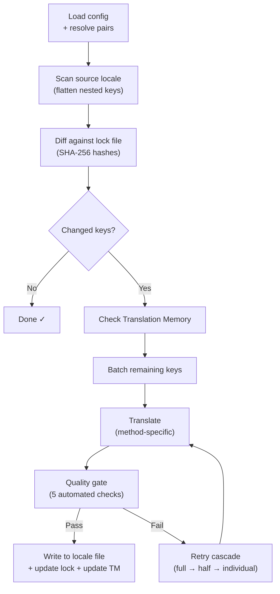

# Paano Gumagana ang champollion

Isinasalin ng champollion ang mga locale file ng inyong app gamit ang isang command. Narito ang nangyayari sa likod ng proseso.

## Ang Pipeline

Kapag pinatakbo ninyo ang `npx champollion sync`, isinasagawa ng champollion ang isang anim na yugtong pipeline:



**Mahahalagang desisyon sa disenyo:**

- **Change detection sa pamamagitan ng SHA-256 hashes.** Sinusubaybayan ng Champollion ang bawat source value gamit ang hash sa `.champollion.lock`. Kapag nag-update kayo ng English string, ang key lang na iyon ang muling isasalin. Ito ang dahilan kung bakit mabilis ang `sync` sa mga paulit-ulit na pagpapatakbo — kaunting trabaho lang ang ginagawa nito.

- **Translation Memory caching.** Bago gumawa ng anumang API call, sinusuri ng champollion ang `.champollion/tm.json` para sa mga naka-cache na translation (naka-key ayon sa source text + locale + method). Sa karaniwang re-sync matapos baguhin ang isang key, 142 key ang nanggagaling sa cache at 1 key ang tumatama sa API.

- **Quality gate bago magsulat.** Dumaraan ang bawat translation sa limang automated check (empty, source echo, hallucination loop, length inflation, script compliance) bago nito galawin ang inyong mga file. Ang mga failure ay nilo-log, at hindi kailanman tahimik na tinatanggap.

- **Retry cascade kapag may failure.** Kapag nabigo ang isang batch (JSON parse error, API timeout), muling susubukan ng champollion gamit ang unti-unting mas maliliit na batch: buo → kalahati → indibidwal. Inihihiwalay nito ang problemang key nang hindi hinaharangan ang natitira.

## Mga Paraan ng Pagsasalin

Sinusuportahan po ng Champollion ang maraming pamamaraan ng pagsasalin, kung saan ang bawat isa ay angkop para sa iba't ibang sitwasyon. Ang mga pangunahin po ay:

| Method | Paano ito gumagana | Pinakamainam para sa |
|--------|-------------|----------|
| **`llm`** | Structured prompt sa anumang OpenRouter model | Mga wikang maraming resource |
| **`llm-coached`** | Parehong prompt + grammar rules, dictionary, at style notes | Mga wikang madalas magkaroon ng predictable errors ang LLMs |
| **`google-translate`** | Google Cloud Translation API batch request | High-resource languages na may mahusay na GT support |
| **`api`** | HTTP POST sa sarili ninyong endpoint | Mga custom pipeline, community-controlled models |

Kino-configure ang mga method ayon sa bawat language pair. Maaari ninyong gamitin ang `google-translate` para sa French ngunit `llm-coached` para sa Plains Cree — bawat pair ay gumagamit ng method na pinakaangkop dito.

## Coaching Data

Para sa mga `llm-coached` pair, nagbibigay ang coaching data sa LLM ng tahasang kaalamang lingguwistiko: grammar rules, forced terminology, at style preferences. Isinasama ito sa bawat prompt bilang structured context.

```json title="coaching/crk.json"
{
  "grammar_rules": ["Animate nouns take different plural forms than inanimate nouns"],
  "dictionary": {"welcome": "ᑕᓂᓯ", "settings": "ᐃᑕᐢᑌᐘᐃᓇ"},
  "style_notes": "Use Standard Roman Orthography (SRO) unless explicitly configured otherwise."
}
```

Ang coaching data ang pangunahing mekanismo para mapahusay ang kalidad ng translation nang hindi nagfa-fine-tune ng model. Baguhin ang rules → patakbuhin muli ang sync → tingnan kung nakatutulong. Agad ang iteration.

## Plugins

Ang plugins ay mga pre-packaged translation recipe para sa mga partikular na language pair. Ang mga ito ay JSON manifests — hindi code — na nagsasabi sa champollion kung aling method ang gagamitin, kasama ang mga setting, at kung anong kalidad ang na-benchmark.

```bash
champollion plugin install ./crk-coached-v3/
champollion sync   # uses the installed plugin for en→crk
```

Tinutulay ng plugins ang agwat sa pagitan ng research at production: ang method na nakakakuha ng mataas na score sa [Network](/arena) ay maaaring i-package bilang plugin at i-deploy dito.

## Ang Mas Malaking Larawan

Ang champollion ay kalahati ng isang ecosystem na may dalawang bahagi:

- **[ang Network](/arena)** — kung saan **dinedevelop at pinatutunayan** ang mga translation method gamit ang reproducible benchmarking
- **champollion** — kung saan **idine-deploy** ang mga napatunayang method upang isalin ang tunay na content

Ikinokonekta ng [Eval Harness Bridge](/docs/guides/bridge) ang dalawa. Ang method na napapatunayan ang sarili nito sa Network ay dini-deploy dito. Ang feedback ng mga tagapagsalita mula sa production ay nagpapahusay sa susunod na version.

---

## Mas Malalim na Pagsisiyasat

- [Paano Gumagana ang Sync](/docs/concepts/how-sync-works) — detalyadong step-by-step na walkthrough ng pipeline
- [Quality Gate](/docs/concepts/quality-gate) — ang limang automated check
- [Translation Memory](/docs/concepts/translation-memory) — caching at pagtitipid sa gastos
- [Mga Translation Method](/docs/guides/translation-methods) — detalyadong paghahambing ng method
- [Architecture](/docs/concepts/architecture) — pangkalahatang-ideya ng system design
