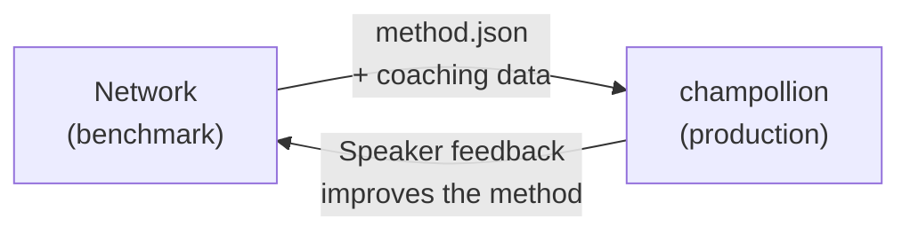

# I-deploy sa Production

Napatunayan ninyong gumagana ito sa Network. Ngayon, i-deploy na ito.

Ang Network ay para sa R&D — pagbuo, pag-benchmark, at paghahambing ng mga pamamaraan sa pagsasalin. Ang **production deployment** ay ginagawa sa pamamagitan ng [champollion](https://champollion.dev), ang translation CLI na nakatuon sa mga developer. Nag-uugnay ang mga ito sa pamamagitan ng pinagsasaluhang format ng plugin.



---

## Ang Landas ng Deployment

### 1. I-export ang Inyong Pamamaraan bilang Plugin

Gumawa ng `method.json` manifest na nagpa-package ng inyong mga resulta ng benchmark:

```json
{
  "name": "crk-coached-v3",
  "type": "llm-coached",
  "version": "3.0.0",
  "description": "Coached LLM translation for Plains Cree",
  "locales": ["crk"],
  "config": {
    "model": "google/gemini-2.5-flash",
    "temperature": 0.3
  },
  "benchmarks": {
    "crk": {
      "composite_score": 0.67,
      "fst_acceptance": 0.82,
      "corpus_size": 150
    }
  }
}
```

Isama ang anumang coaching data (mga tuntunin sa grammar, mga dictionary) kasama ng manifest.

### 2. I-install sa Champollion

```bash
champollion plugin install ./my-method-plugin/
```

### 3. I-configure ang Inyong Pair

```json title="champollion.config.json"
{
  "pairs": {
    "en-crk": { "method": "plugin", "plugin": "crk-coached-v3" }
  }
}
```

### 4. Isalin ang Tunay na Content

```bash
npx champollion sync
```

Ang inyong na-benchmark na pamamaraan ay gumagawa na ngayon ng tunay na mga salin sa production.

---

## Para sa mga Katutubong Wika

Ang mga pamamaraang nagsisilbi sa mga komunidad ng Katutubong wika ay nangangailangan po ng **pahintulot ng komunidad** bago ang production deployment. Ang mga prinsipyo ng Indigenous data sovereignty — pagmamay-ari at kontrol ng komunidad sa data ng wika — po ang namamahala kung paano binubuo, sinusuri, at idine-deploy ang mga pamamaraan ng pagsasalin.

Ang isang pamamaraang umaabot sa Deployable tier (0.70+) ay hindi awtomatikong dine-deploy — dine-deploy lamang ito **kung at kailan** nagbibigay ng pahintulot ang katawang namamahala ng komunidad ng wika.

Tingnan ang [Soberanya sa Data](/docs/network/sovereignty/data-sovereignty) at [Paglilipat ng Pagmamay-ari](/docs/network/sovereignty/ownership-transfer) para sa buong framework ng pamamahala.

---

## Tingnan Din

- [Ang Eval Harness Bridge](https://champollion.dev/docs/guides/bridge) — detalyadong walkthrough ng Network→champollion pipeline
- [Specification ng Plugin](https://champollion.dev/docs/reference/plugin-spec) — ang format ng method.json manifest
- [Gabay ng champollion Agent](https://champollion.dev/docs/guides/agent-guide) — kung paano gamitin ang champollion para sa pagsasalin

