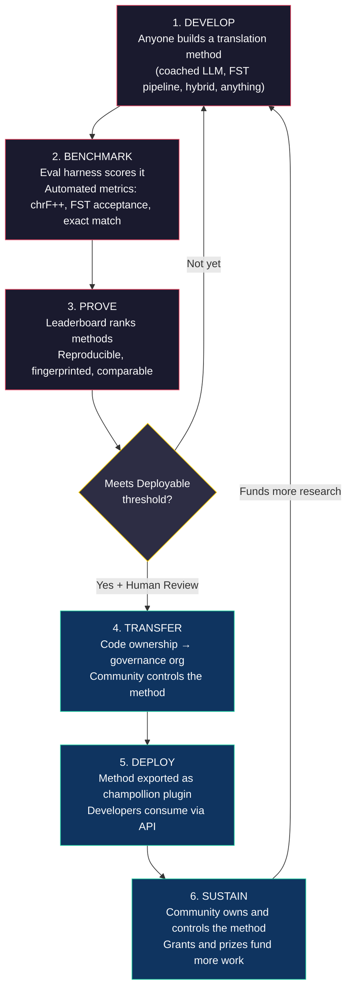
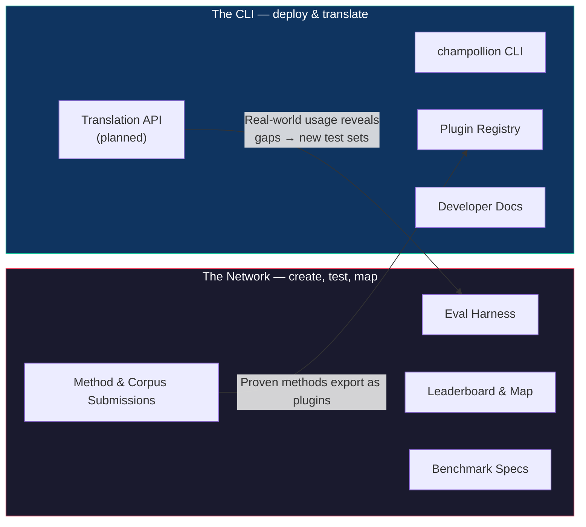
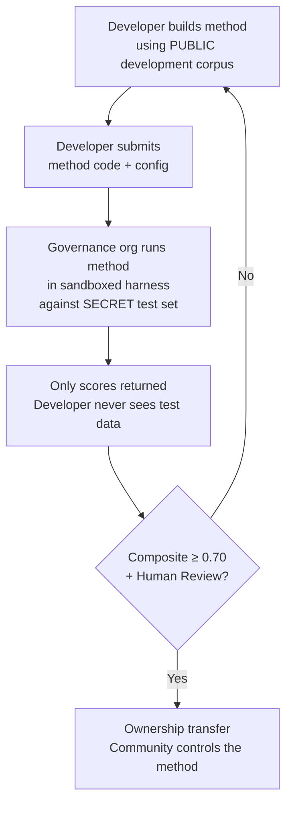

# Paano Gumagana ang Network: Bumuo, Sumubok, Mag-develop, Mag-deploy

> **Buod ng Tagapagpaganap.** Ang machine translation para sa mga wikang kulang sa serbisyo sa mundo ay hindi isang problema sa pagsasanay ng modelo — ito ay isang problema sa *imprastraktura*. Walang iisang modelo, lab, o kumpanya ang makakalutas nito. Inilalarawan ng dokumentong ito ang isang arkitektura ng platform na ginagawang isang distributed research lab ang pandaigdigang komunidad ng mga ML engineer, linguist, at mga tagapagsalita ng wika: sinuman ay maaaring bumuo ng isang pamamaraan ng pagsasalin, susubukan ng network kung ito ay gumagana — kabilang ang paghahambing sa data ng pagsusuri na hawak ng komunidad na hindi kailanman nakikita ng platform — at ang mga pamamaraang gumagana ay nagiging mga asset na pagmamay-ari ng mga komunidad na pinaglilingkuran ng kanilang mga wika. Ang mekanismo ay bukas at kolaboratibong pagbuo ng pamamaraan na ipinares sa mga nababaluktot na tuntuning itinakda ng tagapangasiwa — isang kumbinasyon na bihira pa rin sa praktika, at ang sa tingin namin ay kinakailangan para sa problemang ito.

---

> [!IMPORTANT]
> **Saklaw.** Sinusuri ng platform na ito ang **pagsasalin ng pormal na nakasulat na teksto** — mga dokumento, materyal na pang-edukasyon, opisyal na komunikasyon, mga string ng UI. Hindi ito isang chatbot, real-time na interpreter, o unrestricted-domain na conversational system. Niraranggo ng leaderboard ang mga pamamaraan ng pagsasalin laban sa mga na-curate na parallel corpora sa mga partikular na domain ng teksto (tingnan ang [Benchmark Specification §2.7](/docs/network/specifications/benchmark#27-domain) para sa taxonomy ng domain). Ang MT ay imprastraktura para sa muling pagpapasigla ng wika, hindi isang pamalit dito. Natututo ang mga bata ng wika mula sa mga tao, hindi sa mga makina.

### Kasalukuyang Saklaw ng Domain

Ang board ay **live at patuloy na nadaragdagan** — ang mga run ay patuloy na napa-publish dito, at sinuman ay maaaring magdagdag pa. Ipinapakita ng talahanayan sa ibaba kung aling mga pampublikong reference corpora ang *suportado* bawat domain; ang [leaderboard](/leaderboard) ay may mga live na ranggo.
Ang mga corpora ay kinukuha mula sa pinagmulan sa oras ng pagtakbo (run time), at hindi kailanman naka-host dito.

| Domain | Reference corpus | Katayuan | Mga Tala |
|--------|------------------|--------|-------|
| Balita / pamamahayag | Global Voices (OPUS) | Suportado — bukas para sa mga isusumite | 493 na pares ng wika, CC BY 3.0 |
| Pang-araw-araw / magkahalo (nakasulat) | Tatoeba | Suportado — bukas para sa mga isusumite | 874 na pares ng wika, CC BY 2.0 |
| Pang-edukasyon / textbook | EdTeKLA (Plains Cree) | Para sa pananaliksik lamang — **hindi nakaranggo**; ang remote model-API evaluation ay nangangailangan ng pahintulot | Binagong CC BY-NC-SA ng EdTeKLA (sovereignty-scoped, non-commercial); inalis mula sa leaderboard, mga premyo, at mga API/commercial lane |
| Naratibo / pampanitikan | — | Pinaplano | Wala pang runnable corpus na nakakonekta |
| Relihiyoso / banal na kasulatan | FLORES+ (Bible-domain) | Nakakonekta, relative-only | Runnable corpus; MATAAS ang kontaminasyon, kaya relative-only — hindi kailanman ginagamit para sa opisyal na pagmamarka |
| Sinasalita / real-time | — | Labas sa saklaw | Sinusuri ng sistemang ito ang nakasulat na teksto, hindi ang pananalita |
| Teknikal / siyentipiko | — | Sa hinaharap | Nangangailangan ng pagpapatunay ng terminolohiya na partikular sa domain |

## Para Saan ang Network

Bago ang mga mekanika, ang misyon. Ang Champollion Network ay nakasalalay sa apat na pangako:

1. **Lumikha at magtiwala sa mga test set ng pagsasalin.** Para sa karamihan ng mga wika, ang bihira at mahalagang bagay ay hindi isa pang modelo — ito ay isang *mapagkakatiwalaang* test set: isinulat ng tao, tapat sa domain, at naka-pin ang bersyon. Umiiral ang Network upang likhain ang mga test set na iyon at gawin itong mapagkakatiwalaan.
2. **Gawing madaling i-navigate ang larangan.** Kung sino ang makakapagsalin ng ano, gaano kahusay ang bawat pamamaraan sa bawat uri ng teksto, at kung saan ang mga kakulangan — ipinapakita bilang isang pampublikong mapa, hindi nakabaon sa mga nakakalat na papel at PDF.
3. **Lahat ng pamamaraan ay malugod na tinatanggap — tao at makina.** Kami ay mga pragmatista na may pagkiling sa mga solusyon. Isang propesyonal na tagasalin, isang rule-based system, isang na-coach na LLM, isang na-fine-tune na modelo — lahat ay first-class. Ang mahalaga sa amin ay maisalin ang mga wika, hindi kung aling tool ang mananalo.
4. **Binuo *kasama* ng mga komunidad, hindi kailanman na-scrape — at ang soberanya ay hindi mapag-uusapan.** Ang data ng wika ay biodata; ang mga taong nagbibigay ng corpus ang may hawak ng mga susi nito, at sa anumang sinusukat laban dito.

Ang lahat sa ibaba — ang loop, ang harness, ang leaderboard, ang deployment bridge — ay nagsisilbi sa apat na pangakong iyon.

---

## 1. Ang Problema: Machine Translation ≠ Machine Learning

Ang machine translation para sa mga wikang may limitadong mapagkukunan (low-resource languages o LRLs) ay karaniwang ibinabalangkas bilang isang problema sa machine learning: mangolekta ng data, magsanay ng modelo, mag-deploy. Ang pagbabalangkas na ito ay mali, at ang pagkakamali ay may malaking epekto — idinidirekta nito ang pagpopondo, talento, at imprastraktura patungo sa isang diskarte na sa istruktura ay hindi maaaring gumana para sa karamihan ng mga wika sa mundo.

### 1.1 Bakit Nabibigo ang Pagbabalangkas ng ML

Ang karaniwang ML pipeline para sa MT ay nangangailangan ng tatlong bagay: malalaking parallel corpora, na-validate na mga evaluation benchmark, at isang deployment path. Para sa 194 na wika sa listahan ng Cloud Translation ng Google at sa 200 na saklaw ng NLLB-200, umiiral ang tatlong ito. Para sa ~1,200 na wika sa long tail ng OMT-1600 — ang aming aritmetika: ang 1,600 na saklaw nito bawasan ng 400+ na iniulat ng mga may-akda nito na "sapat na naiintindihan" ng mga modelo — umiiral ang data ng pagsusuri ngunit ang kalidad ay kadalasang nasa ibaba ng mga magagamit na threshold, ang mga model weight ay hindi available sa publiko, at walang deployment pipeline. Para sa natitirang ~5,400+, walang umiiral na kahit ano.

| Pangangailangan | Mga Wikang Mayaman sa Mapagkukunan (High-Resource Languages) | Long Tail ng OMT-1600 (~1,200 LRLs) | Natitirang ~5,400 na Wika |
|-------------|------------------------|-------------------------------|---------------------------|
| **Parallel corpora** | Milyun-milyong pares ng pangungusap (Europarl, UN Corpus, OpenSubtitles) | Bible-domain bitext, mga web scrape, synthetic backtranslation. Walang data na na-curate ng komunidad. | Daan-daan hanggang mababang libu-libo, kung mayroon man |
| **Mga evaluation benchmark** | WMT, FLORES, NTREX — na-standardize, reproducible | BOUQuET (Bible-domain), met-BOUQuET. Walang morphological validation. Walang independiyenteng pagsusuri. | Walang mga karaniwang benchmark; ad hoc na pagsusuri |
| **Deployment path** | Google Translate, DeepL, Azure — mga komersyal na API | Hindi inilabas ang mga model weight. Walang CLI, walang plugin system, walang API na nade-deploy ng komunidad. | Wala. Walang API, walang produkto, walang merkado. |

Gumagana ang diskarte ng ML kapag umiiral ang data na pagsasanayan at umiiral ang merkado na pagde-deployan. Pinalawak nang husto ng OMT-1600 ang unang kondisyon — ngunit ang pagpapalawak nang walang independiyenteng pagpapatunay ng kalidad, morphological validation, o pamamahala ng komunidad ay pagpapalawak nang walang tiwala. Ang problema ay hindi lang "kailangan natin ng mas mahusay na modelo" — ito ay "kailangan natin ng imprastraktura na nagpapatunay na gumagana ang modelo, sa mga tuntuning kinokontrol ng komunidad."

### 1.2 Kung Ano ang Talagang Kinakailangan ng MT para sa mga LRL

Ang pagsasalin para sa mga wikang kulang sa serbisyo ay hindi pangunahing problema sa pagsasanay. Ito ay isang problema sa **inhenyeriya ng pamamaraan (method engineering)** — ang hamon ng pagsasama-sama ng mga available na mapagkukunan (mga LLM, morphological tool, kaalaman ng komunidad, mga panuntunang linggwistiko) sa mga gumaganang translation pipeline, at pagkatapos ay pagpapatunay na gumagana ang mga ito nang may mahigpit na pagsusuri.

Mahalaga ang pagkakaiba:

| Dimensyon | Diskarte ng ML | Diskarte ng Inhenyeriya ng Pamamaraan |
|-----------|------------|---------------------------|
| **Pangunahing aktibidad** | Magsanay ng modelo sa data | Pagsamahin ang mga tool, prompt, at kaalamang linggwistiko sa isang pipeline |
| **Bottleneck** | Dami ng parallel data | Pagkamalikhain sa inhenyeriya + imprastraktura ng pagsusuri |
| **Sino ang maaaring mag-ambag** | Mga team na may mga GPU cluster at dataset | Sinumang may API key, diksyunaryo, at ideya |
| **Pagsusuri** | BLEU/chrF sa mga naka-hold-out na test set | Morphological validation + pagsusuri ng tao + mga automated na sukatan |
| **Deployment** | I-serve ang modelo | I-package ang pamamaraan bilang isang plugin |

Ang mga modernong LLM ay naglalaman na ng nakatagong kaalaman sa maraming wikang may limitadong mapagkukunan — sapat upang makabuo ng output na *mukhang* kapani-paniwala. Ang problema ay ang output na ito ay kadalasang hindi wasto sa morpolohiya (nagha-hallucinate ang modelo ng mga anyo ng salita na hindi umiiral sa wika). Ang hamon sa inhenyeriya ay: paano mo kukunin ang alam ng LLM, ipapatunay ito laban sa linggwistikong realidad, at ipa-package ang resulta para sa paggamit sa produksyon?

Ito ang dahilan kung bakit nagbe-benchmark kami ng mga **pamamaraan**, hindi mga modelo. Ang isang pamamaraan ay ang buong resipe: pagpili ng modelo + prompt engineering + paggamit ng tool + pre/post-processing + coaching data + mga diskarte sa muling pagsubok (retry strategies). Ang dalawang team na gumagamit ng parehong modelo na may magkaibang pamamaraan ay makakakuha ng magkaibang marka. Iyon ang punto.

### 1.3 Bakit Sinasira ng mga Wikang Polisintetiko ang Lahat

Marami sa mga wikang pinakakulang sa serbisyo sa mundo ay **polisintetiko (polysynthetic)** — ini-encode ng mga ito ang buong pangungusap sa iisang salita sa pamamagitan ng mga produktibong prosesong morpolohikal. Isaalang-alang ang salitang Plains Cree:

> **ê-kî-nitawi-kîskinwahamâkosiyân**
> *"noong ako ay pumasok sa paaralan"*

Isang salita. Ini-encode nito ang panahunan (nakaraan), direksyon (papunta sa), ang salitang-ugat (matuto), tinig (balintiyaw/pabalik), at panauhan (unang isahan). Kailangan ng Ingles ng anim na salita para sa ipinapahayag ng Cree sa isa.

Sinasira nito ang karaniwang MT sa bawat antas:

- **Tokenization** — Pinupunit ng BPE at SentencePiece ang mga polisintetikong salita sa mga walang kahulugang piraso, dahil idinisenyo ang mga ito para sa concatenative morphology.
- **Hallucination** — Ang mga LLM ay gumagawa ng mga mukhang kapani-paniwalang string na hindi mga wastong salita. Hindi makikita ng isang hindi tagapagsalita ang pagkakaiba. Kung walang morphological validation, hindi nakikita ang mga hallucination.
- **Evaluation** — Pinarurusahan ng mga sukatan sa antas ng salita (BLEU) ang natural na inflectional variation na mahalaga sa kung paano gumagana ang mga wikang ito. Ang mga sukatan sa antas ng character (chrF++) ay mas mahusay ngunit hindi pa rin sapat kung walang structural validation.

Ang solusyon ay hindi isang mas malaking modelo o mas maraming data ng pagsasanay. Ito ay **imprastraktura na nakakahuli ng mga hallucination bago pa man ito makarating sa mga user** — mga morphological analyzer (FSTs) na tiyak na makakapagsabi na "hindi ito isang salita sa wikang ito."

---

## 2. Bakit Hindi Gumagana ang mga Umiiral na Diskarte

### 2.1 Komersyal na MT

Ang mga komersyal na serbisyo sa pagsasalin ay kasaysayang nag-optimize para sa dami ng merkado. Ang OMT-1600 ng Meta (Marso 2026) ay kumakatawan sa isang makabuluhang pagbabago — 1,600 na wika sa isang sistema. Ngunit para sa ~1,200 sa long tail nito (ang aming aritmetika: 1,600 bawasan ng 400+ na iniulat ng mga may-akda nito na "sapat na naiintindihan" ng mga modelo), ang kalidad ay nasa ibaba ng mga magagamit na threshold, ang mga model weight ay hindi available, at walang deployment pipeline. Ang problema sa istruktural na insentibo ay nag-evolve: Ang Big Tech ay maaari na ngayong bumuo ng mga modelo para sa mga LRL, ngunit kung walang independiyenteng pagsusuri, morphological validation, o pamamahala ng komunidad, ang saklaw lamang ay hindi lumulutas sa problema.

### 2.2 Akademikong Pananaliksik

Ang akademikong pananaliksik sa MT ay labis na nakatuon sa mga pares ng wika na mayaman sa mapagkukunan dahil doon matatagpuan ang data ng pagsasanay, mga shared task, at mga lugar ng publikasyon. Ang mga mananaliksik na nagtatrabaho sa mga pares na may limitadong mapagkukunan ay nahihirapang mag-publish, nahihirapang pondohan ang compute, at nahihirapang mag-deploy — dahil hindi umiiral ang imprastraktura ng deployment para sa mga LRL.

### 2.3 Mga Minsanang Kumpetisyon (One-Off Competitions)

Maaari kang magpatakbo ng isang kumpetisyon sa Kaggle: "English→Plains Cree, ang pinakamahusay na chrF++ ay mananalo ng $10,000." Narito ang mangyayari:

1. May mananalo, magsusumite ng notebook, kukunin ang premyo, at uuwi.
2. Mabubulok ang notebook sa archive ng Kaggle. Walang magde-deploy nito. Walang magme-maintain nito.
3. Ang test set ay kalaunang mapa-publish — kontaminado na magpakailanman.
4. In-upload ng organisasyon ng pamamahala ang kanilang linggwistikong data sa imprastraktura ng Google sa ilalim ng mga tuntunin ng serbisyo ng Google, nang walang tunay na kontrol sa lifecycle.
5. Walang deployment bridge. Ang isang nanalong notebook ay hindi isang gumaganang API.

Ang isang minsanang pabuya ay umaakit ng mga bounty hunter. Ang isang patuloy na leaderboard na may pamamahala ng komunidad ay lumilikha ng napapanatiling pakikilahok.

### 2.4 Fine-Tuning

Ang pag-fine-tune ng isang bukas na modelo sa parallel text ay ang malinaw na diskarte ng ML. Ngunit para sa karamihan ng mga LRL, ang parallel corpus na kailangan para sa fine-tuning ay mismong ang data na hindi umiiral — at ang paglikha nito ay nangangailangan ng parehong mga bilingguwal na tagapagsalita at pakikilahok ng komunidad na nilalayong palitan ng fine-tuning. Hindi mo maaaring i-bootstrap ang iyong paraan palabas sa isang problema sa kakulangan ng data gamit ang isang pamamaraan na nangangailangan ng data.

---

## 3. Ang Solusyon: Kolaboratibong Pagbuo ng Pamamaraan na may Soberanong Pagsusuri

Binabaligtad ng platform ang tradisyonal na diskarte: sa halip na isang team na bumubuo ng isang modelo, **ang pandaigdigang komunidad ay sama-samang bumubuo at sumusubok ng mga pamamaraan ng pagsasalin**, pinapatunayan ng network kung ano ang gumagana, at ang mga pamamaraang gumagana ay nade-deploy sa produksyon kung saan pinapanatili ng komunidad ng wika ang pagmamay-ari at kontrol.

### 3.1 Ang Buong Loop

Ang bawat yugto ay may partikular na tungkulin:

| Yugto | Ano ang Nangyayari | Sino ang Nakikinabang |
|-------|-------------|--------------|
| **Bumuo (Develop)** | Ang isang mananaliksik, mag-aaral, o hobbyist ay bumubuo ng isang pamamaraan ng pagsasalin gamit ang anumang tool na gusto nila — LLM prompting, FST pipelines, mga diksyunaryo, mga na-fine-tune na modelo, rule-based systems, o mga hybrid | Ang nag-ambag ay natututo, nag-eeksperimento, nagpa-publish |
| **Mag-benchmark (Benchmark)** | Minamarkahan ng eval harness ang pamamaraan laban sa isang na-standardize na corpus na may mga reproducible na sukatan. Ang bawat pagtakbo ay gumagawa ng isang [run card](/docs/network/specifications/benchmark#3-run-card-schema) — isang kumpletong talaan ng kung ano ang sinubukan at kung paano ito gumanap | Ang mga mananaliksik ay nakakakuha ng mga reproducible at maihahambing na resulta |
| **Patunayan (Prove)** | Lumalabas ang mga resulta sa pampublikong leaderboard. Ang mga pamamaraan ay niraranggo, inihahambing, at sinusuri. Nakikita ng komunidad kung ano ang gumagana at kung ano ang hindi | Ang lahat ay nagkakaroon ng visibility sa state of the art |
| **Ilipat (Transfer)** | Para sa mga katutubong wika, ang mga pamamaraan na umaabot sa Deployable threshold (composite ≥ 0.70) AT pumasa sa pagpapatunay ng tao ay inililipat ang pagmamay-ari ng code sa organisasyon ng pamamahala ng komunidad ng wika | Ang komunidad ang ganap na nagmamay-ari ng pamamaraan — code, mga weight, at mga desisyon sa deployment |
| **Mag-deploy (Deploy)** | Ang pamamaraan ay ini-export bilang isang [champollion](https://github.com/gamedaysuits/Champollion) plugin na maaaring patakbuhin ng komunidad sa sarili nitong imprastraktura. Kinokonsumo ng mga developer ang mga pagsasalin nang hindi kinakailangang maunawaan ang pinagbabatayan na pamamaraan | Nakakakuha ang mga developer ng pagsasalin para sa mga wika na hindi pinaglilingkuran ng mga komersyal na API |
| **Panatilihin (Sustain)** | Ang pagpopondo ng grant at mga naka-sponsor na premyo — na aktibong hinahanap ng proyekto; ito ay self-funded sa ngayon — ay nagbabayad para sa higit pang mga corpora, pagpapatunay ng tagapagsalita, at pananaliksik. Ang Champollion ay non-commercial at hindi kumukuha ng anumang bahagi sa anumang kinikita ng isang komunidad mula sa isang asset na pagmamay-ari nito | Ang bayad na trabaho sa corpus at mga pamamaraang pagmamay-ari ng komunidad ay mas tumatagal kaysa sa anumang iisang grant |

### 3.2 Bakit Gumagana ang Bukas na Kolaborasyon

Ang bukas na pakikilahok ay hindi nagkataon lamang — ito ang mekanismo. Narito kung bakit:

**Pagkakaiba-iba ng mga diskarte.** Ang pinakamahusay na pamamaraan para sa English→Plains Cree ay maaaring isang FST-gated coached LLM. Ang pinakamahusay para sa English→Quechua ay maaaring isang dictionary-augmented pipeline. Ang pinakamahusay para sa English→Inuktitut ay maaaring isang na-fine-tune na modelo na na-bootstrap mula sa Nunavut Hansard corpus. Walang iisang team o diskarte ang mangingibabaw sa lahat ng wika. Ibinubunyag ng leaderboard kung aling mga *uri* ng diskarte ang gumagana para sa aling mga *uri* ng wika — isang meta-resulta na mismong isang kontribusyon sa pananaliksik.

**Napapanatiling pakikilahok.** Ang isang leaderboard ay hindi kailanman natatapos. Palaging may mas mahusay na pamamaraan na mabubuo. Ang bawat pagsusumite ay nag-aambag ng compute at intelektwal na pagsisikap sa problema. Hindi tulad ng isang minsanang grant, ang bukas at patuloy na proseso ay bumubuo ng napapanatiling pamumuhunan sa pananaliksik mula sa pandaigdigang komunidad.

**Mababang hadlang sa pagpasok.** Kailangan mo ng API key, diksyunaryo, at ideya. Ang eval harness ay open source. Ang format ng corpus ay simpleng JSON. Ang isang mag-aaral ng linggwistika ay maaaring makipagsabayan sa isang lab na mayaman sa mapagkukunan — at kung minsan ay mas mahusay pa, dahil ang kaalaman sa domain (pag-unawa sa wika) ay maaaring humigit sa mga mapagkukunan ng compute.

**Deployment bridge.** Ang parehong pamamaraan na nakakakuha ng mataas na marka sa harness ay nade-deploy sa produksyon gamit ang isang pagbabago sa config. "Patunayan ito rito, i-deploy ito roon." Ito ang puwang na hindi natutulay ng Kaggle, mga WMT shared task, at mga akademikong publikasyon.

### 3.3 Ang Arkitektura ng Platform

Ang champollion.dev ay **isang hub na may dalawang mukha**. Ang parehong site ay nagho-host ng Network — kung saan nililikha ang mga test set, sinusuri ang mga pamamaraan, at minamapa ang mga resulta — at ang CLI, kung saan ang mga napatunayang pamamaraan ay nade-deploy sa mga totoong proyekto. Nagbabahagi sila ng isang domain, isang set ng mga doc, at isang data layer; inilalarawan ng mga label sa ibaba ang dalawang *tungkulin*, hindi dalawang site.

**Ang [Network](/docs/network/)** ay ang proving ground. Ang madla nito ay mga tagasalin, linguist, komunidad, at mananaliksik. Ang lahat dito ay tungkol sa paglikha ng mga test set, pagsusuri ng mga pamamaraan laban sa mga ito — tao o makina — at pagmamapa kung saan ang mga kakulangan.

**Ang [CLI](https://champollion.dev)** ay ang bahagi ng deployment. Ang madla nito ay mga developer na nangangailangan ng pagsasalin para sa kanilang mga app. Hindi nila kailangang maunawaan kung paano gumagana ang isang pamamaraan — tatawagin lang nila ito.

Ang tulay sa pagitan ng dalawang mukha ay ang **pamamaraan**: nilikha at pinagkatiwalaan sa Network, na-package para sa deployment sa pamamagitan ng CLI, at — para sa mga wika ng komunidad — pagmamay-ari ng komunidad.

---

## 4. Soberanong Pagsusuri: Bakit Mahalaga ang Imprastraktura

Ang imprastraktura ng pagsusuri ay hindi isang teknikal na detalye — ito ang pinakabuod ng modelo ng soberanya. Ang karaniwang pagsusuri (i-upload ang iyong test set sa isang nakabahaging platform) ay hindi gumagana para sa mga katutubong wika dahil isinusuko nito ang kontrol sa linggwistikong data.

### 4.1 Ang Mekanismo ng Soberanya

Hindi kailanman nakikita ng developer ang gold-standard na data ng pagsusuri. Nagde-develop sila laban sa isang pampublikong development corpus, pagkatapos ay isinusumite ang kanilang method code sa organisasyon ng pamamahala, na nagpapatakbo nito sa isang sandbox laban sa sikretong test set. Mga marka lamang ang bumabalik. Hindi lang ito seguridad — binuo ito patungo sa mga **prinsipyo ng Indigenous data sovereignty** na hinihingi ng pagmamay-ari at kontrol ng komunidad sa data ng wika. Kung nakakatugon ito sa mga ito ay hindi namin desisyon: ang pagpapasya ay kabilang sa mga komunidad na kasangkot.

### 4.2 Bakit Hindi Ito Maaaring Tumakbo sa Platform ng Iba

Sa Kaggle, ina-upload ng organisasyon ng pamamahala ang kanilang linggwistikong data sa imprastraktura ng Google sa ilalim ng mga tuntunin ng serbisyo ng Google. Hindi nila maaaring bawiin ang access sa sarili nilang timeline. Hindi sila maaaring maglakip ng mga custom na legal na tuntunin (tulad ng paglipat ng pagmamay-ari) sa mga isinumite. Wala silang cryptographic na garantiya na hindi gagamitin ang data para sa ibang mga layunin. Ang soberanya ng data ay nangangahulugan na kinokontrol ng komunidad ang evaluation endpoint, hawak ang mga susi, at maaaring i-shut down ito.

---

## 5. Pilosopiya ng Pagsusuri: Microeval at LYSS

Ang mga karaniwang sukatan ng MT (BLEU, chrF++, COMET) ay idinisenyo upang maging pangkalahatan sa iba't ibang wika. Ang pagiging pangkalahatan na iyon ang kanilang kalakasan — at ang kanilang blindspot. Para sa mga wikang polisintetiko, ang isang salitang hindi wasto sa morpolohiya na nagbabahagi ng mga character n-gram sa reference ay nakakakuha ng mataas na marka sa chrF++ ngunit makikilala bilang walang katuturan (gibberish) ng sinumang tagapagsalita.

Ang **pagbuo ng Microeval** ay nangangahulugan ng pagbuo ng mga sukatan ng pagsusuri na iniangkop sa mga partikular na wika gamit ang pinakamahusay na magagamit na mga linggwistikong tool. Ang framework ay tinatawag na **LYSS** (Linguistically-informed Yield & Structural Scoring):

| Bahagi | Ano ang sinusukat nito | Tool | Katayuan |
|-----------|-----------------|------|--------|
| **LYSS-fst** | Morphological validity | Finite-state transducer | ✅ Ipinatupad (Plains Cree) |
| **LYSS-eq** | Linguistic equivalence | Mga panuntunan sa variant na na-curate ng linguist | ✅ Ipinatupad (Plains Cree) |
| **LYSS-sem** | Semantic preservation | Mga semantic model na partikular sa wika | ✅ Ipinatupad (Plains Cree) |

Ang mga unibersal na sukatan (chrF++, BLEU) ay nagsisilbing mga baseline at bilang mga pangunahing signal para sa mga wika na walang LYSS tooling. Saanman umiiral ang mga tool na partikular sa wika, ang mga bahagi ng LYSS ang nagdadala ng bigat ng pagmamarka — dahil ang mga bagay na pinakamahalaga para sa bawat wika ay ang mga bagay na tanging mga tool na partikular sa wika ang makakasukat.

Para sa buong detalye ng LYSS at lohika ng composite scoring, tingnan ang [SCORING_SPEC.md §4](/docs/network/specifications/scoring#4-composite-score).

> [!WARNING]
> **Paghahambing sa iba't ibang run (Cross-run comparability).** Kapag inihahambing ang mga run na may magkakaibang availability ng sukatan (hal., ang isang run ay may mga marka ng FST, ang isa ay wala), ang mga composite score ay hindi direktang maihahambing. Ang composite ay nagno-normalize sa mga available na sukatan, ngunit ang isang run na sinusuri sa 5 sukatan ay nagdadala ng mas maraming impormasyon kaysa sa isa na sinusuri sa 2. Ipinapahiwatig ng leaderboard ang saklaw ng sukatan para sa bawat entry.

---

## 6. Sino ang Pinaglilingkuran Nito

### Para sa mga ML Engineer at Mananaliksik

Isang bukas na leaderboard na may mga na-standardize na benchmark para sa mga pares ng wika na walang sinasaklaw na shared task. I-reproduce ang anumang resulta gamit ang eval harness. I-publish ang iyong pamamaraan. Talunin ang pinakamataas na marka. Ang bawat isinumite ay naka-fingerprint sa isang partikular na configuration at bersyon ng dataset — walang kalabuan tungkol sa kung ano ang sinubukan.

### Para sa mga Komunidad ng Wika

Pagmamay-ari at kontrol sa teknolohiya ng pagsasalin na binuo para sa iyong wika. Ang mapagkumpitensyang dinamika ay nangangahulugan na maraming team ang sabay-sabay na nagtatrabaho sa iyong wika — nakikinabang ka sa kanilang lahat at pagmamay-ari mo ang resulta. Ang benepisyo ay dumadaloy sa pamamagitan ng pagmamay-ari, pagpapatungkol (attribution), kapasidad, at mga tuntunin sa data na pinamamahalaan ng komunidad — hindi kailanman isang revenue share: Ang Champollion ay non-commercial at hindi kumukuha ng anumang bahagi sa anumang kinikita ng isang komunidad mula sa isang asset na pagmamay-ari nito.

### Para sa mga Nagpopondo at Tagasuri ng Grant

Transparent at reproducible na mga sukatan upang suriin ang mga panukala sa pananaliksik sa pagsasalin. Mga nasusukat na resulta na higit pa sa mga publikasyon: mga sukatan ng kalidad sa paglipas ng panahon, saklaw ng wika, mga corpora na binuo at nakarehistro sa ilalim ng kontrol ng tagapangasiwa, mga bayad na oras ng tagapagsalita na naihatid sa mga komunidad. Ang isang matagumpay na pamamaraan ay nagiging isang asset na pagmamay-ari ng komunidad na tumatakbo sa bukas na imprastraktura ng pagsusuri — ang epekto ng grant ay lumalaki sa pamamagitan ng mga magagamit muling pamamaraan at mga pampublikong benchmark sa halip na magtapos kapag natapos na ang pagpopondo.

### Para sa mga Developer

Pagsasalin para sa mga wika na hindi pinaglilingkuran ng anumang komersyal na API. Isang CLI command (`npx champollion sync`) ang nagsasalin ng iyong mga locale file gamit ang mga pamamaraang napatunayan ng komunidad. Gamitin ang Google Translate para sa French, isang na-coach na LLM para sa Plains Cree, at isang community API para sa Quechua — lahat sa iisang proyekto, lahat ay may parehong interface.

### Para sa mga Mag-aaral

Isang bukas na hamon na may totoong epekto sa mundo. Bumuo ng isang pamamaraan ng pagsasalin para sa isang wikang kulang sa serbisyo, i-benchmark ito, at i-publish ang iyong mga resulta. Libre ang imprastraktura, bukas ang mga dataset, at walang pakialam ang leaderboard kung nasa top-10 na unibersidad ka o nagtatrabaho mula sa isang terminal ng library.

---

## 7. Panlipunan at Teknikal na Konteksto

### 7.1 Bumibilis ang Muling Pagpapasigla ng Wika

Lumalago ang mga pagsisikap sa muling pagpapasigla ng wika sa buong mundo. Ang mga immersion school, community language nest, at mga proyekto sa digital archiving ay lumalawak sa mga katutubong komunidad sa Canada, United States, Australia, New Zealand, at Northern Europe. Ang mga pagsisikap na ito ay nangangailangan ng teknolohiya — partikular, teknolohiya sa pagsasalin na gumagalang sa soberanya ng komunidad sa linggwistikong data.

### 7.2 Binago ng mga LLM ang Baseline

Bago ang 2023, ang pagbuo ng anumang kakayahan sa MT para sa isang wikang polisintetiko ay nangangailangan ng malaking kadalubhasaan sa NLP, custom na pagsasanay ng modelo, at malalaking badyet sa compute. Binago ng mga modernong LLM ang baseline: ang isang mahusay na ginawang prompt na may coaching data at morphological validation ay maaaring makabuo ng mga magagamit na pagsasalin para sa ilang pares ng wika — walang kinakailangang pagsasanay. Ito ay kapansin-pansing nagpapababa sa hadlang sa pagpasok para sa pagbuo ng pamamaraan. Ang problema ay lumipat mula sa "paano tayo bubuo ng isang modelo?" patungo sa "paano tayo bubuo ng isang pipeline na nagpapatunay at nagwawasto sa kung ano ang ginagawa ng modelo?"

### 7.3 Bukas at Reproducible na Pagsukat

Ang pampubliko at nakabahaging pagsusuri ay muling humubog sa kung paano natututunan ng larangan kung ano ang gumagana. Ipinakita ng Chatbot Arena, LMSYS, at ng Hugging Face Open LLM Leaderboard na ang bukas at reproducible na pagsukat — sinuman ay maaaring magpatakbo nito, sinuman ay maaaring suriin ito — ay nagpapakita ng tunay na pag-unlad nang mas mabilis kaysa sa mga sarado at self-reported na pag-aangkin. Kinuha namin ang aral na iyon, hindi ang kultura ng paligsahan, at itinuro ito sa pagsasalin para sa libu-libong wika kung saan ang komersyal na MT ay hindi umiiral o hindi pa independiyenteng napatunayan. Ang layunin ay isang nakabahagi at nasusuring mapa ng kung ano ang gumagana para sa aling mga wika at aling mga uri ng teksto — hindi isang pagraranggo kung sino ang tumalo kanino.

### 7.4 Ang Soberanya ng Katutubong Data ay Hindi Mapag-uusapan

Ang mga prinsipyo ng Indigenous data sovereignty — pagmamay-ari at kontrol ng komunidad sa data ng wika — ang mga prinsipyo ng CARE (Collective Benefit, Authority to Control, Responsibility, Ethics), at mga framework tulad ng Te Mana Raraunga (Māori Data Sovereignty) ay hindi mga opsyonal na add-on — ang mga ito ay mga istruktural na kinakailangan para sa anumang teknolohiya na humahawak sa mga katutubong linggwistikong mapagkukunan. Ang aming imprastraktura ng pagsusuri ay binuo upang umayon sa mga prinsipyong ito sa arkitektura, hindi lamang sa mga pahayag ng patakaran — at kung nakakatugon ito sa mga ito ay isang pagpapasya na kabilang sa mga komunidad, hindi sa amin.

---

## 8. Mga Tensyon at Limitasyon {#8-tensions-and-limitations}

Gumagamit ang proyektong ito ng isang Kanluraning mekanismo — mapagkumpitensyang benchmarking — upang maglingkod sa mga sistema ng kaalaman na kadalasang komunal, relasyonal, at ginagabayan ng mga Nakatatanda (Elder-guided). Ang tensyon na iyon ay totoo at dapat pangalanan, hindi lutasin sa pamamagitan ng paggigiit.

**Benchmarking vs. komunal na kaalaman.** Niraranggo ng mga leaderboard ang mga indibidwal at ino-optimize ang mga numerikal na marka. Binibigyang-diin ng mga tradisyon ng katutubong kaalaman ang relasyonal na awtoridad, komunal na pagwawasto, at pagiging lehitimo na nakabatay sa relasyon. Hindi namin maaaring angkinin na pinaglilingkuran namin ang mga sistema ng kaalamang ito habang bumubuo ng isang platform na ang pangunahing mekanismo ay indibidwal na mapagkumpitensyang pag-optimize. Ang arkitektura ng soberanya (§4) — kung saan pagmamay-ari ng mga komunidad ang mga pamamaraan, kinokontrol ang pagsusuri, at nagpapasya kung ano ang nade-deploy — ay ang aming istruktural na tugon, ngunit hindi nito tinutunaw ang tensyon. Ang leaderboard ay isa pa ring leaderboard.

**Kung ano ang ginagawa namin tungkol dito.** Sinusuportahan ng platform ang mga isinusumite ng team at komunidad kasama ng mga indibidwal. Ibinabalangkas ng leaderboard ang mga resulta bilang "kasalukuyang state of the art" sa halip na "sino ang nananalo." Ang organisasyon ng pamamahala — hindi ang marka sa leaderboard — ang nagpapasya kung ano ang nade-deploy. Walang automated na marka ang nagbibigay ng karapatan sa isang developer sa anuman; ang komunidad ang nagpapasya. At nagpapanatili kami ng patuloy na advisory feedback loop sa mga kasosyong komunidad tungkol sa kung ang pagbabalangkas at istruktura ng insentibo ng platform ay naglilingkod sa kanila. Kung hindi, babaguhin namin ito.

**Ang MT ay hindi muling pagpapasigla (revitalization).** Kino-convert ng pagsasalin ang teksto sa pagitan ng mga wika. Ang muling pagpapasigla ay lumilikha ng mga bagong tagapagsalita. Ang isang perpektong sistema ng MT ay hindi lumulutas sa problema sa pagpasa (transmission), problema sa prestihiyo, o problema sa pedagohiya. Maaari pa nga itong lumikha ng ilusyon na "nakakapagsalita ang computer ng wika," na nagpapahina sa pagkaapurahan para sa pagpasa ng tao. Binubuo namin ang MT bilang imprastraktura — draft na pagsasalin para sa post-editing, mga morphological tool para sa mga app sa pag-aaral ng wika, pampulitikang leverage para sa mga komunidad na humihingi ng mga serbisyo sa kanilang wika — hindi bilang pamalit sa intergenerational na pagpasa. Kinokontrol ng komunidad kung, kailan, at paano nade-deploy ang teknolohiya.

Umiiral ang seksyong ito dahil natukoy ang mga tensyong ito sa isang inimbitahang kritika (Mayo 2026) at nangako kaming papangalanan ang mga ito sa publiko sa halip na ibaon ang mga ito sa mga panloob na dokumento.

> [!NOTE]
> **Ang mga marka sa leaderboard ay mga automated na proxy.** Ang lahat ng markang ipinapakita sa leaderboard ay mga automated na sukat na kinakalkula ng evaluation harness sa ilalim ng mga kontroladong kondisyon. Ipinapahiwatig ng mga ito ang relatibong pagganap ng pamamaraan ngunit hindi bumubuo ng mga garantiya sa kalidad. Ang mga pamamaraang na-validate ng komunidad ay minarkahan nang hiwalay. Walang automated na marka ang nagbibigay ng karapatan sa isang developer sa deployment — ang organisasyon ng pamamahala ang gumagawa ng desisyong iyon.

---

## 9. Kasalukuyang Katayuan

### Ano ang Umiiral Ngayon

- **champollion** — ang CLI tool. Maramihang pamamaraan ng pagsasalin, per-pair na configuration, mga quality gate, at suporta para sa mga karaniwang format ng locale file.
- **MT Eval Harness** — Gumaganang framework ng pagsusuri. Ipinatupad ang chrF++, pagtanggap ng FST, at mga sukatan ng eksaktong tugma (exact match). Pinal na ang schema ng run card. Gumagana ang fingerprinting at pagpapatunay ng integridad.
- **EDTeKLA Dev v1** — Plains Cree evaluation corpus (Binagong CC BY-NC-SA ng EdTeKLA — sovereignty-scoped, non-commercial), nagmula sa EdTeKLA research group ng University of Alberta. Inalis mula sa leaderboard, mga premyo, at ang API/commercial path (non-commercial license); ang mga bilang ng entry ay nakasaad nang isang beses sa [pahina ng Evaluation Datasets](/docs/network/leaderboard/datasets#edtekla-development-set-v1).
- **FLORES+ Devtest** — 1,012 na pangungusap × 870 na nakatalang pares ng wika (CC BY-SA 4.0).
- **Network website** — Docusaurus-based na documentation site na may leaderboard, mga detalye, mga tutorial, at framework ng soberanya.
- **Benchmark Specification** — [Canonical spec](/docs/network/specifications/benchmark) na tumutukoy sa schema ng corpus, format ng run card, at protocol ng pagsusuri. Para sa mga kahulugan ng sukatan, mga composite weight, at mga tier ng kalidad, tingnan ang [SCORING_SPEC.md](/docs/network/specifications/scoring).

### Ano ang Susunod

| Yugto | Ano | Katayuan |
|-------|------|--------|
| Baseline sweep | 12 na modelo × 3 na temperatura × 2 na coaching config sa EDTeKLA | ⏸ Nangangailangan ng pahintulot — naghihintay sa naitalang pahintulot ng may hawak ng karapatan para sa remote model-API evaluation |
| Composite score | Pagpapatupad ng weighted metric sa harness | ✅ Tapos na |
| Semantic score | Verdict-weighted score mula sa CrkSemanticMetric (eval standard) | ✅ Tapos na |
| Morphological accuracy | Per-morpheme na pagmamarka laban sa gold-standard na pagsusuri | 🔲 Pinaplano |
| Equivalent match | Variant-class matching sa pamamagitan ng CrkLinterMetric (eval standard) | ✅ Tapos na |
| Champollion API | API para sa mga pamamaraang pagmamay-ari ng komunidad | 🔲 Pinaplano |
| Ikalawang wika | Palawakin sa ikalawang pares ng wika (Inuktitut, Quechua, o Sámi) | 🔲 Pinaplano |

---

## 10. Pagsisimula

**Bumuo ng isang pamamaraan:** I-clone ang [eval harness](https://github.com/gamedaysuits/Champollion), magpatakbo ng isang baseline na eksperimento, at tingnan kung saan ka mapupunta sa leaderboard.

**Mag-ambag ng isang corpus:** Kung nagsasalita ka ng isang wikang kulang sa serbisyo, kahit 50 na-curate na pares ng pagsasalin ay sapat na upang magbukas ng bagong track sa leaderboard. Tingnan ang [Para sa mga Komunidad ng Wika](/docs/network/community/for-language-communities).

**Mag-deploy ng mga pagsasalin:** I-install ang [champollion](https://github.com/gamedaysuits/Champollion) at isalin ang iyong app gamit ang `npx champollion sync`.

**Pondohan ang pagsisikap:** Tingnan ang [Ang Modelong Pang-ekonomiya](/docs/network/sovereignty/economic-model) para sa mga framework ng gastos at mga projection sa pagpapanatili.

---

## Tingnan Din

- **[Benchmark Specification](/docs/network/specifications/benchmark)** — format ng corpus, schema ng run card, protocol ng pagsusuri, soberanya
- **[Scoring Specification](/docs/network/specifications/scoring)** — mga sukatan, mga composite weight, mga tier ng kalidad, mga formula ng gastos/bilis
- **[ang Network](/arena)** — ang R&D proving ground
- **[champollion](https://github.com/gamedaysuits/Champollion)** — ang platform ng deployment
- **[Suportahan ang isang Wikang may Limitadong Mapagkukunan](/docs/network/community/low-resource-languages)** — malalim na pagsisid sa mga hamon at diskarte sa polysynthetic MT

---

*Ang dokumentong ito ay ang entry point para sa sinumang makakatagpo sa proyekto sa unang pagkakataon. Para sa buong teknikal na detalye, tingnan ang [BENCHMARK_SPEC.md](/docs/network/specifications/benchmark) (protocol) at [SCORING_SPEC.md](/docs/network/specifications/scoring) (mga sukatan).*

