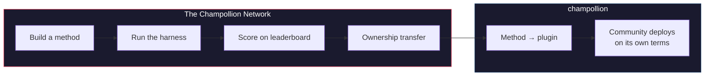

# Ang Champollion Network

> **Executive Summary.** Ang Champollion Network ay isang bukas na imprastraktura upang *lumikha at magtiwala* sa mga translation test set para sa pinakamaraming pares ng wika hangga't maaari — binuo *kasama* ang mga propesyonal at komunidad, at hindi kailanman kinuha (scraped) mula sa kanila — at upang gawing madaling unawain ang buong larangan: kung sino ang maaaring magsalin ng ano, gaano kahusay ang bawat pamamaraan sa bawat uri ng teksto, at kung saan ang mga kakulangan. Ang bawat pamamaraan ay tinatanggap, tao man o makina. Maaari rin po kayong bumuo at magsumite ng isang pamamaraan at makita kung paano ito nakakakuha ng marka laban sa mga totoong corpora. Para sa mga wika kung saan ang data ay ibinibigay ng mga komunidad, ang soberanya ay hindi maaaring ipagpalit: ang mga taong nagbibigay ng corpus ang may hawak ng mga susi nito at sa anumang sinusukat laban dito.

Ang seksyong ito ay ang tahanan ng mapa. Ipinapaliwanag ng mga pahina sa ilalim nito kung paano binubuo ang
network ng mga nasukat na pares ([Paano Gumagana ang Network](/docs/network/how-it-works)), kung bakit niraranggo ng public work queue ang mga
niraranggo nito ([Bakit ang Queue](/docs/network/perspectives/why-the-queue) at ang
[Queue Construction spec](/docs/network/specifications/queue-construction)),
at kung paano kinakalkula ang lakas ng isang koneksyon
([Lakas ng Koneksyon](/docs/network/specifications/connection-strength)).
Kung nagpapasya po kayo kung pagkakatiwalaan ang proyekto, magsimula sa
[Mga Tapat na Limitasyon](/docs/network/honest-limitations); kung alam na po ninyo
kung ano ang nais ninyong buuin, ang mga pinto ay nasa
[Ano ang Champollion](/docs/what-is-champollion).

**Tumatakbo ito sa dalawang uri ng benchmark.** Ang mga *Public benchmark* ay gumagamit ng mga bukas na dataset upang imapa at iranggo ang bawat pamamaraan nang mura at bukas — ang scraped/open-data baseline tier, na may nakatalang panganib ng kontaminasyon. Ang mga *Sovereign benchmark* ay ang gold standard: mga lihim na test set na nililikha, pagmamay-ari, at kinokontrol ng mga komunidad ng wika, at **hindi kailanman nakikita** ng Champollion — sinusuri nang blind, at kapag pinahintulutan lamang ng komunidad. Ang imprastraktura mismo ay source-available at pinamamahalaan ng iisa; ang pagmamay-ari ng isang komunidad ay ang mga test set para sa kanilang wika at ang mga pamamaraang binuo para dito.

:::info[Launch/seed stage]
Ang Network ay bago pa lamang ngunit live na: ang leaderboard ay naglalaman ng mga totoong nai-publish na run
at bukas para sa mga isusumite ng sinuman. Para sa eksaktong kung ano ang aming inaangkin at hindi pa
inaangkin — verification, community validation, held-out evaluation — tingnan ang
**[Mga Tapat na Limitasyon](/docs/network/honest-limitations)**.
:::

---

## Ang Problema

Ang Cloud Translation service ng Google ay naglilista ng 194 na wika ([Nai-publish na listahan ng Google](https://docs.cloud.google.com/translate/docs/languages)). Sinasaklaw ng NLLB-200 ng Meta ang 200, at ang OMT-1600 (Marso 2026) ay nag-aangkin ng 1,600. Mayroong higit sa 7,000 na sinasalita sa Daigdig. Para sa ~1,200 na wika sa long tail ng OMT-1600 — ang aming aritmetika: ang 1,600 na sinasaklaw nito bawasan ng 400+ na iniulat ng mga may-akda nito na "sapat na nauunawaan" ng mga modelo — ang mga model weight ay hindi available, ang kalidad ay nasa ibaba ng mga magagamit na threshold, at ang pagsusuri ay gumamit ng teksto sa Bible-domain na may mga karaniwang machine metric — walang morphological validation, walang independent testing, walang pamamahala ng komunidad. Para sa natitirang ~5,400 na wika, walang pretrained model ang gumagawa ng anumang output.

Ang Big Tech ay namumuhunan na ngayon sa LRL coverage — ngunit ang coverage na walang independent quality verification, morphological validation, o pamamahala ng komunidad ay coverage na walang tiwala. Ang mga tagapagsalita na pinakanangangailangan ng mga tool sa pagsasalin ay ang parehong mga komunidad na may pinakamaliit na posibilidad na magkaroon ng mga ito.

**Umiiral ang Network upang baguhin iyon.** Nagbibigay ito ng imprastraktura upang lumikha ng mga test set, suriin ang anumang pamamaraan laban sa mga ito — tao man o makina — at imapa ang mga resulta, para sa anumang wika, na may reproducible scoring, bukas na pagsusumite, at pamamahala ng komunidad kung sino ang kumokontrol sa data at sa mga resulta.

Ang data ng wika ay *biodata*. Tulad ng genetic o health data, ang isang wika ay nagdadala ng pagkakakilanlan at mga ugnayan ng mga taong nagsasalita nito, at hindi ito maaaring makabuluhang gawing anonymous — kaya ang mga taong nagbibigay ng corpus ang may hawak ng mga susi nito, at sa anumang sinusukat laban dito. Ang soberanya ay hindi isang tampok na idinagdag lamang dito; ito ang pundasyon kung saan itinayo ang lahat ng iba pa.

---

## Paano Ito Gumagana

1. **Bubuo po kayo ng isang translation method** — coached LLM, fine-tuned model, FST-gated pipeline, o anumang bagay na gumagawa ng mga pagsasalin.
2. **Ibe-benchmark ito ng harness** — mga standardized metric (chrF++, exact match, FST acceptance), na naka-fingerprint sa isang partikular na Git commit.
3. **Lilitaw ang mga resulta sa leaderboard** — live at bukas para sa mga isusumite; ang bawat nai-publish na run ay reproducible at maihahambing.
4. **Kapag gumana ang isang pamamaraan, malilipat ang pagmamay-ari** — para sa mga Katutubong wika, ang code ng pamamaraan ay inililipat sa organisasyon ng pamamahala ng komunidad.
5. **Ide-deploy ito ng komunidad — kung kailan at paano nila pipiliin.** Ang pamamaraan ay ie-export bilang isang [champollion](https://champollion.dev) plugin at maaaring tumakbo nang buo sa imprastraktura ng komunidad. Ang Champollion ay hindi kumukuha ng anumang bahagi sa anumang kikitain nito roon.

**Buuin ito rito. I-deploy ito roon.**

:::tip[Crack a language, win, give it back]
Ito ay sadyang isang ML-benchmarking operation — ang kumpetisyon ay kung paano nalulutas ang mga mahihirap na pares.
Inaanyayahan po namin ang mga ML researcher at sinumang may kakayahang bumuo na gawin ang pinakamahusay na
pamamaraan para sa isang partikular na mahirap na pares, **manalo ng bounty kapag may bukas**, *at* ibigay ang
nabuong pamamaraan sa organisasyon ng soberanya na nagmamay-ari ng wikang iyon. Ang
enerhiya ng kumpetisyon ay totoo; ito ay nakatuon sa misyon, hindi sa pag-akyat sa isang
leaderboard para lamang sa sarili nitong kapakanan. Tingnan ang [Prize Specification](/docs/network/specifications/prizes).
:::

---

## Para Kanino Ito

| Kayo po ay... | Ibinibigay sa inyo ng network ang... |
|---|---|
| **ML engineer / researcher** | Mga standardized benchmark, reproducible scoring, isang nakabahaging corpus na masusubukan laban dito |
| **Linguist** | Isang framework upang gawing mga nasusubok na pamamaraan ang mga panuntunan sa gramatika at mga diksyunaryo |
| **Professional / human translator** | Isang lugar upang irehistro ang inyong mga serbisyo at matagpuan — ang pagsasalin ng tao ay isang first-class method dito, nakalista at naka-benchmark kasama ng mga makina, hindi isang afterthought |
| **Miyembro ng komunidad ng wika** | Pamamahala sa kung paano binubuo at dine-deploy ang mga pamamaraan ng inyong wika |
| **Funder / grant reviewer** | Transparent at reproducible na mga metric upang suriin ang mga panukala sa pananaliksik sa pagsasalin |
| **Estudyante** | Isang bukas na imbitasyon na may totoong epekto — bumuo ng isang pamamaraan, iambag ang inyong mga resulta |

---

## Mga sinusuportahang reference corpora

**Ang board ay live at nasa maagang yugto pa lamang** — ang mga unang sweep ay nai-publish na at
marami pa ang darating habang pinapatakbo ng mga contributor ang mga queue item. Ang sumusunod ay hindi isang
leaderboard; ito ay ang set ng mga public reference corpora kung saan maaaring markahan ang isang isinumite
ngayon. Ang mga corpora ay hindi kailanman naka-host dito: kinukuha ng harness ang mga reference mula sa
upstream source sa run time at nagmamarka laban sa bagong kuhang data.

### Global Voices (OPUS) — news domain
- **Coverage:** 493 na pares ng wika ang naka-catalogue at runnable (hal. `eval-amh-fra-globalvoices-test-v1`, Amharic → French)
- **Lisensya:** CC BY 3.0
- **Source:** [Global Voices via OPUS](https://opus.nlpl.eu/)

### Tatoeba — conversational / mixed domain
- **Coverage:** 874 na pares ng wika ang naka-catalogue at runnable (hal. `eval-afr-eng-tatoeba-dev-v1`, Afrikaans → English)
- **Lisensya:** CC BY 2.0
- **Source:** [Tatoeba community](https://tatoeba.org)

:::note[EdTeKLA is research-only — not a ranking benchmark]
Ang EdTeKLA Plains Cree corpus (*Cree: Language of the Plains*) ay nagdadala ng
[**binagong** CC BY-NC-SA ng EdTeKLA](https://github.com/EdTeKLA/IndigenousLanguages_Corpora)
— sovereignty-scoped, non-commercial na mga tuntunin (ang mismong root textbook ay CC
BY-NC-ND 4.0). Ito ay **inihiwalay sa lahat ng pagraranggo** — hindi ito kwalipikado para sa
leaderboard, anumang premyo, o sa mga API/commercial lane — at ang remote
model-API evaluation nito ay **consent-gated**: tumatanggi ang harness na ipadala
ang teksto nito sa mga third-party model API maliban kung ang tahasang pahintulot ng may hawak ng karapatan
ay naitala (nananatiling posible ang local evaluation).

Ang FLORES+ **ay** naka-wire at runnable dito (870 na naka-catalogue na pares, hal.
`eval-flores-devtest-v1-amh-fra`), ngunit ito ay **HIGH-contamination** — pampubliko,
web-crawled na evaluation data na malamang na nakita na ng mga frontier model.
Samakatuwid, ito ay **relative-only**: magagamit upang ihambing ang mga pamamaraan nang head-to-head, ngunit
**hindi kailanman iniuulat bilang isang absolute-quality benchmark**, at ito ay **test /
illustration only**. Ang isang resulta ng FLORES+ ay hindi kailanman niraranggo bilang isang quality score at
hindi kailanman ginagamit bilang isang chain edge sa [mapa ng pagsasalin](https://champollion.dev).
Tingnan ang [Mga Tapat na Limitasyon](/docs/network/honest-limitations) para sa eksaktong kung ano ang aming
inaangkin at hindi inaangkin.
:::

---

## Ang Nag-iisang Panuntunan

:::danger[Do not train on evaluation data]
Ang mga pamamaraang na-expose sa benchmark dataset — bilang training data, few-shot example, dictionary entry, o prompt material — ay **madi-disqualify**. Mag-fine-tune po kayo sa kahit anong gusto ninyo. Huwag lang sa test set.
:::

---

## Mga Susunod na Hakbang

- **[Magsumite ng Pamamaraan](/docs/network/getting-started/submit-a-method)** — kung paano isumite ang inyong unang benchmark run
- **[Benchmark Specification](/docs/network/specifications/benchmark)** — ang buong protocol ng eksperimento
- **[Mga Panuntunan sa Leaderboard](/docs/network/leaderboard/rules)** — pamantayan sa pagsusumite at mga patakaran laban sa pagmamanipula (anti-gaming)
- **[Pangangasiwa ng Data](/docs/network/sovereignty/data-sovereignty)** — nananatili ang mga corpora sa kanilang mga tagapangasiwa; iginagalang ang bawat lisensya
- **[Paano Pinopondohan ang Trabaho](/docs/network/sovereignty/economic-model)** — non-commercial at kasalukuyang self-funded; naghahanap ng mga funder, at ang destinasyon ng bawat dolyar ay nai-publish

**[→ Tingnan ang Leaderboard](https://champollion.dev/leaderboard)**
