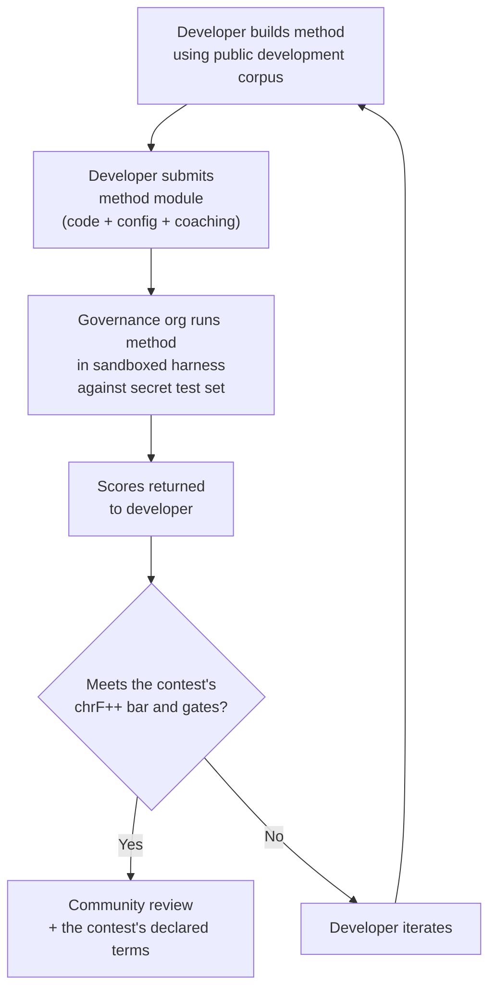

# Espesipikasyon ng Benchmark

> **Pang-ehekutibong Buod.** Tinutukoy ng dokumentong ito ang protocol sa pagsusuri para sa ecosystem ng pagsusuri ng MT ng Champollion: format ng corpus (§2), schema ng run card (§3), protocol ng benchmark (§6), mga kinakailangan sa pagpapatunay ng tao (§7), mga mekanismo ng soberanya (§8), leaderboard at modelo ng pagsusumite (§9), balangkas ng gastusin (§10), at pagiging mapapalawig sa mga bagong wika (§11). Para sa kung paano binibigyang-puntos ang mga run (ang headline ng chrF++, ang mga karaniwang sukatan sa tabi nito, ang mga diagnostic) at para sa mga formula ng sukatan ng gastusin/bilis, tingnan ang `SCORING_SPEC.md` — ang nag-iisang pinagmumulan ng katotohanan para sa lahat ng lohika ng pagmamarka. Sumasangguni ang dokumentong ito sa SCORING_SPEC para sa mga detalyeng iyon sa halip na ulitin ang mga ito.


---

## 1. Mga Prinsipyo

### 1.1 Ang mga Wika ay Biodata

Ang isang wika ay hindi neutral na materyal sa pagsubok. Tulad ng genetic o health data, ang language data ay **biodata**: dala nito ang identidad, pagkakamag-anak, at mga relasyon ng mga taong nagsasalita nito, at hindi ito maaaring gawing anonymous sa makabuluhang paraan — alisin man ang metadata, naka-encode pa rin sa wika kung sino ang mga tao nito. Ang kahihinatnan para sa espesipikasyong ito ay kongkreto: ang mga taong nagbibigay ng corpus ang may hawak ng mga susi dito, at ng anumang sinusukat laban dito. Samakatuwid, ang sovereignty (§8) ay hindi dagdag lamang sa protocol; ito ay precondition nito, at ang bawat iba pang prinsipyo sa ibaba ay umiiral sa loob nito.

### 1.2 Ang Automated Metrics ay Mga Proxy

Bawat metric na tinukoy sa dokumentong ito ay machine-computed. chrF++, FST acceptance, morphological accuracy, semantic similarity — lahat ng ito ay automated proxies para sa kalidad ng pagsasalin. Kapaki-pakinabang ang mga ito para sa mabilis na iteration, sistematikong paghahambing, at pagtukoy ng regressions. **Hindi sila kapalit ng human judgment**.

Ang evaluation hierarchy:

```
Automated metrics (run cards, benchmarks)
    ↓ proxy for
Human review (bilingual speakers validate output)
    ↓ proxy for
Actual utility (does this help a language community?)
```

Walang awtomatikong marka, gaano man ito kataas, ang makakapapalit sa isang matatas na tagapagsalita na nagbabasa ng output at nagpapatunay na ito ay tama, natural, at angkop sa kultura. Iyon ang dahilan kung bakit walang awtomatikong marka ang may label ng kalidad (§5): kapaki-pakinabang ang mga awtomatikong sukatan para sa pagsubaybay sa pag-usad, ngunit hindi kailanman sapat sa sarili lamang ng mga ito.

### 1.3 Mga Pamamaraan, Hindi Mga Model

Nagbe-benchmark tayo ng **mga pamamaraan**, hindi ng mga model. Ang model ay isang component. Ang pamamaraan ay ang buong recipe: pagpili ng model, disenyo ng prompt, paggamit ng tool, pre/post-processing, coaching data, retry strategies, lahat. Dalawang team na gumagamit ng parehong model ngunit magkaibang pamamaraan ay magkakaroon ng magkaibang score. Iyon ang punto.

### 1.4 Reproducibility

Bawat benchmark result ay dapat reproducible. Kinukuha ng run card (§3) ang kumpletong configuration ng isang experiment. Tinutukoy ng fingerprint (§3.5) ang experimental setup. Bine-verify ng run card hash (§3.6) ang integrity ng result. Sinumang may parehong method, corpus, at configuration ay dapat makamit ang scores sa loob ng ±2% (isinasaalang-alang ang LLM sampling non-determinism sa temperature > 0).

### 1.5 Walang Synthetic Evaluation Data

**Ang proyektong ito ay hindi bumubuo, gumagamit, o nag-eendorso ng synthetic evaluation data.** Lahat ng corpora ay dapat manggaling sa tunay na human-authored text — published translations, textbooks, bilingual documents, o elicited translations mula sa fluent speakers.

Maaaring tumulong ang LLMs sa:
- Sentence alignment (paghahanap ng parallel passages sa umiiral na bilingual texts)
- Format conversion (pag-convert ng published materials sa corpus schema)
- Metadata enrichment (pagmumungkahi ng difficulty tiers, register labels)
- Pagmumungkahi ng source sentences para sa human translation (§11.3 — ang translation step ay palaging human)

Hindi kailanman dapat **bumuo** ang LLMs ng reference translations o evaluation pairs.

**Development-neutral kami sa training data.** Kung ang isang method developer ay gumagamit ng synthetic training data, backtranslation, o data augmentation sa kanilang method, iyon ay kanilang pagpili — sinusuri namin ang output, hindi ang training process. Gumagamit ang Meta's OMT-1600 ng humigit-kumulang 270 milyong synthetic parallel sentences na binuo sa pamamagitan ng backtranslation. Wala kaming pagtutol sa mga method na sinanay sa ganitong paraan. Nagsusuri kami gamit lamang ang human curation.

> **Bakit hindi Bible text para sa evaluation?** Sinusuri ng OMT-1600 ang 1,560 sa 1,600 wika sa Bible-domain text (Meta AI, *Omnilingual MT*, arXiv:2603.16309, 2026). Ang mga salin ng Bible ay may archaic register, liturgical vocabulary, at formulaic sentence structure. Ang aming evaluation corpora ay nagmumula sa community-curated, domain-diverse text — health, legal, educational, governmental, conversational, at technical domains (tingnan ang §2.7). Ito ay sinadyang design choice. Kailangan ng mga community ang translation para sa mga domain kung saan sila aktwal na namumuhay at nagtatrabaho, hindi isang religious register lamang. Ang method na mataas ang score sa Genesis 1:1 ay halos walang sinasabi tungkol sa performance nito sa isang band council agenda o clinic intake form.

---

## 2. Corpus Schema

Ang corpus ay isang curated set ng parallel text pairs na may structured metadata. Ito ang ground truth kung saan sinusukat ang lahat ng method.

### 2.1 Dataset Envelope

Ang top-level structure ng isang corpus file:

```json
{
  "dataset": {
    "id": "edtekla-dev-v1",
    "version": "1.0",
    "language_pair": "EN→CRK",
    "source_language": "en",
    "target_language": "crk",
    "created": "2026-05-01",
    "license": "LicenseRef-EdTeKLA-Modified-CC-BY-NC-SA-4.0",
    "provenance": ["gold_standard", "textbook"]
  },
  "entries": [ ... ]
}
```

| Field | Type | Required | Description |
|-------|------|----------|-------------|
| `id` | string | ✅ | Natatanging dataset identifier, ginagamit sa run cards at leaderboard |
| `version` | string | ✅ | Semantic version. Ang incrementing ay nag-i-invalidate ng mga naunang run card comparisons |
| `language_pair` | string | ✅ | Display label (hal., `EN→CRK`) |
| `source_language` | string | ✅ | BCP 47 source language code |
| `target_language` | string | ✅ | BCP 47 target language code |
| `created` | string | ✅ | ISO 8601 creation date |
| `license` | string | ✅ | SPDX license identifier |
| `provenance` | string[] | ✅ | Listahan ng provenance tags na ginagamit sa mga entry |

### 2.2 Entry Schema

Bawat entry sa corpus ay kumakatawan sa isang translation challenge:

```json
{
  "id": 42,
  "source": "I see the dog",
  "reference": "niwâpamâw atim",
  "segment": "gold_standard",
  "difficulty": 2,
  "provenance": "gold_standard",
  "register": "conversational",
  "context": "declaration",
  "morphological_analysis": "ni-wâpam-âw atim | 1sg-see.TA-3sg.DIR dog.AN",
  "notes": "Animate noun (atim); direct form because speaker is proximate",
  "variant_class": "simple-ta-direct"
}
```

| Patlang | Uri | Kinakailangan | Paglalarawan |
|---|---|---|---|
| `id` | integer | ✅ | Natatanging identifier sa loob ng corpus |
| `source` | string | ✅ | Pinagmulang teksto sa pinagmulang wika |
| `reference` | string | ✅ | Gold-standard na sangguniang salin sa target na wika |
| `segment` | string | 📎 | Partisyon ng corpus: `gold_standard`, `held_out`, `development`, o `diagnostic` |
| `difficulty` | integer | 📎 | Marka ng kahirapan 1–5 (tingnan ang §2.4) |
| `provenance` | string | 📎 | Pinagmulan ng entry na ito (tingnan ang §2.5) |
| `register` | string | 📎 | Antas ng register/pormalidad (tingnan ang §2.6) |
| `context` | string | 📎 | Pangkomunikasyong gamit (tingnan ang §2.6) |
| `domain` | string | 📎 | Use-case domain mula sa 16-code taxonomy (tingnan ang §2.7). Dapat ay isa sa: `conv`, `ecommerce`, `edu`, `financial`, `gov`, `legal`, `literary`, `marketing`, `medical`, `news`, `religious`, `scientific`, `subtitles`, `support`, `tech`, `ui`. Binabalido sa oras ng pagbuo. |
| `morphological_analysis` | string | ❌ | Gold-standard na morpolohikal na breakdown |
| `notes` | string | ❌ | Mga tala ng tagasalin, mga diyalektal na baryasyon, mga flag ng kalabuan |
| `variant_class` | string | ❌ | Class label na nagpapangkat sa mga katanggap-tanggap na baryasyon ng salin |

> **📎 = INIREREKOMENDA.** Maayos na pinangangasiwaan ng harness ang mga nawawalang opsyonal na patlang sa pamamagitan ng mga default. Ang mga third-party na corpus ay kailangan lamang magbigay ng `id`, `source`, at `reference` bawat entry.


### 2.3 Corpus Segments

Hinahati ang corpus sa mga segment na may magkakaibang access levels:

| Segment | Purpose | Access | Minimum Size |
|---------|---------|--------|-------------|
| `development` | Method development at iteration. Malayang ginagamit ito ng developers. | **Public** | 30 entries |
| `diagnostic` | Targeted tests para sa tiyak na linguistic phenomena. | **Public** | 10 entries |
| `gold_standard` | Official benchmark evaluation. Dito nagmumula ang leaderboard scores. | **Secret** — hawak ng governance org | 50 entries |
| `held_out` | Nakareserba para sa future evaluation. Hindi kailanman ginagamit hanggang ma-activate. | **Secret** — hawak ng governance org | 10 entries |

> **Current state:** Tanging ang `development` segment ang umiiral sa shipped datasets. Ang `diagnostic`, `gold_standard`, at `held_out` segments ay tinukoy para sa future use habang lumalaki ang corpora.

Ang `gold_standard` at `held_out` segments ay ganap na secret. Parehong hawak sa governance-controlled infrastructure ang source sentences at reference translations. Hindi kailanman nakikita ng method developers ang mga tanong o ang mga sagot. Tingnan ang §8 para sa sovereignty mechanism.

### 2.4 Difficulty Tiers

| Tier | Description | Examples |
|------|-------------|----------|
| 1 — Basic vocabulary | Mga solong salita, karaniwang pagbati, mga numero | "kumusta" → "tânisi", "aso" → "atim" |
| 2 — Simple sentences | Subject-verb o SVO, present tense | "Nakikita ko ang aso" → "niwâpamâw atim" |
| 3 — Moderate complexity | Past/future tense, possessives, animacy | "Nakita ko ang kanyang aso kahapon" |
| 4 — Complex morphology | Obviation, passive voice, conjunct order, relative clauses | "ang babaeng ang anak na lalaki ay pumunta sa tindahan" |
| 5 — Advanced | Multi-clause, formal register, ceremonial, idiomatic | Buong talata na may register-appropriate tone |

Ang maayos na binuong corpus ay dapat magsama ng entries sa lahat ng limang difficulty tiers, na mas nakatuon sa tiers 2–4 kung saan matatagpuan ang karamihan ng real-world translation challenges.

### 2.5 Provenance Tags

Bawat entry ay dapat magpahiwatig ng pinagmulan nito:

| Tag | Meaning |
|-----|---------|
| `gold_standard` | Na-verify ng fluent speakers |
| `textbook` | Mula sa published educational materials |
| `elicited` | Ginawa sa pamamagitan ng structured elicitation sessions |
| `corpus` | Kinuha mula sa parallel corpus |

> **Note:** Sa practice, ang provenance values ay free-form strings. Ang tags sa itaas ay conventions, hindi validated enum — maaaring gumamit ang datasets ng iba pang descriptive provenance strings.

### 2.6 Register at Context

Inilalarawan ng **Register** ang formality at social context:

| Register | Description |
|----------|-------------|
| `conversational` | Pang-araw-araw na pananalita sa pagitan ng magkakapantay |
| `formal` | Official o institutional language |
| `technical` | Domain-specific vocabulary |
| `ceremonial` | Traditional o sacred language use |
| `educational` | Language teaching materials |

Inilalarawan ng **Context** ang communicative function:

> 🔲 **Planned.** Ang `context` field ay tinukoy sa schema ngunit hindi pa populated sa kasalukuyang datasets. Nakareserba ito para sa future corpus enrichment.

| Context | Description |
|---------|-------------|
| `greeting` | Social greeting o pagpapaalam |
| `declaration` | Pahayag ng katotohanan |
| `question` | Interrogative |
| `instruction` | Utos o directive |
| `narrative` | Storytelling o paglalarawan |
| `label` | UI label, button text, o heading |
| `error` | Error message o warning |

### 2.7 Domain {#27-domain}

Inilalarawan ng **Domain** ang real-world use case — ang uri ng content na isinasalin. Orthogonal ito sa register at context:

- Sinasagot ng **Register**: *Gaano ito ka-formal?*
- Sinasagot ng **Context**: *Ano ang ginagawa ng sentence na ito?*
- Sinasagot ng **Domain**: *Para saang industry/use case ito?*

Ang legal contract (domain: `legal`) ay maaaring formal (register: `formal`) at maglaman ng declaration (context: `declaration`). Ang legal chatbot transcript (domain: `legal`) ay maaaring conversational (register: `conversational`) at maglaman ng mga tanong (context: `question`). Parehong domain, magkaibang register at context.

| Domain Code | Description | Typical Consumers |
|-------------|-------------|-------------------|
| `ui` | Software interface strings | App developers, localization teams |
| `legal` | Contracts, statutes, court filings, immigration documents | Law firms, courts, compliance teams, IP lawyers |
| `medical` | Clinical notes, drug labels, patient communications, trial protocols | Hospitals, pharma, clinical trials, patient portals |
| `financial` | Banking, insurance, regulatory filings, audit reports | Banks, insurers, regulators, auditors |
| `edu` | Textbooks, curricula, lesson plans, academic materials | Schools, universities, textbook publishers |
| `ecommerce` | Product descriptions, reviews, marketplace listings | Online retailers, marketplace sellers |
| `marketing` | Ad copy, brand messaging, campaigns, slogans | Ad agencies, brand teams |
| `gov` | Policy documents, regulations, public notices, legislation | Government agencies, compliance teams |
| `scientific` | Research papers, abstracts, methodology, grant proposals | Researchers, journals, grant agencies |
| `religious` | Scripture, liturgical texts, theological commentary | Faith communities, liturgical publishers |
| `support` | FAQs, error messages, troubleshooting guides, chatbot scripts | SaaS companies, help desks |
| `subtitles` | Film, TV, streaming, at gaming dialogue | Streaming platforms, studios, gaming companies |
| `news` | Journalism, wire reports, editorial, press releases | Media organizations, wire services |
| `literary` | Fiction, poetry, narrative, cultural texts | Publishers, cultural preservation orgs |
| `conv` | Informal conversation, social media, messaging | Consumer apps, social platforms |
| `tech` | API docs, manuals, engineering specifications, technical guides | Documentation teams, engineering orgs |

> **Domain-specific benchmarks.** Sinusuri ng general benchmark ang isang method sa lahat ng domain. Ngunit sinusuportahan din ng Network ang **domain-filtered benchmarks** — kung saan kinukuwenta ang scores sa entries lamang na naka-tag sa isang partikular na domain. Hinahayaan nitong masagot ng users: "Aling method ang pinakamahusay para sa pagsasalin ng legal documents sa French?" kumpara sa "Aling method ang may pinakamahusay na overall French score?"
>
> Pinahihintulutan ng domain-filtered leaderboard rankings ang users na ihambing ang methods sa loob ng iisang use case. Iba-iba ang performance ng methods sa iba't ibang domain — ang method na fine-tuned sa legal terminology ay maaaring magkaroon ng mas mataas na score sa legal text kaysa sa conversational text. Tinutulungan ng Network ang users na mahanap ang method na pinakaangkop sa kanilang partikular na use case.

> **Future: Network assistant.** Isang conversational assistant na tumutulong sa users na ilarawan ang kanilang MT use case (domain, language pair, quality requirements) at nagpapakita ng kaugnay na community-validated methods mula sa leaderboard — halimbawa, "aling method ang may pinakamataas na score sa medical-domain EN→JA benchmarks?" — ay isang navigability aid na isinasaalang-alang namin, na nakadepende sa sapat na domain-tagged evaluation data at method diversity.

---

## 3. Run Card Schema {#3-run-card-schema}

Ang run card ang atomic unit ng evaluation. Isa itong self-contained JSON document na nagtatala ng kumpletong configuration at results ng isang evaluation run: isang method, isang model, isang configuration, isang dataset.

Bawat run card ay kumukuha ng tatlong dimension:
- **Quality** — gaano kahusay ang translations?
- **Cost** — magkano ang gastos sa paggawa ng mga ito?
- **Speed** — gaano katagal ito inabot?

### 3.1 Top-Level Fields

| Patlang | Uri | Paglalarawan |
|---|---|---|
| `run_id` | string | UUID v4 na binuo sa simula ng run |
| `harness_version` | string | Semantic version ng harness (hal., `2.0`) |
| `timestamp` | string | ISO 8601 UTC timestamp kung kailan nagsimula ang run |
| `elapsed_seconds` | number | Tagal ng buong run ayon sa wall-clock |
| `score_caveats` | array | Nariyan lamang kapag may nagtatakda ng kondisyon sa mga marka: isang listahan ng mga `{kind, source, severity, message, …}` object, hal. isang test set na ang mga hilera ay may halos magkaparehong kambal sa data ng pagsasanay, mga output na mas mahaba o mas maikli kaysa sa kanilang mga sanggunian, mga output na kumukopya sa kanilang pinagmulan, o isang output na ibinigay para sa maraming magkakaibang pinagmulan. Impormasyonal: hindi nito binabago kailanman ang isang marka, at ipinapakita ito sa tabi ng headline ng chrF++ saanman naroon ang mga marka. Tingnan ang [Pagtutukoy ng Run Card](/docs/network/specifications/run-card#score_caveats) |

### 3.2 Method Configuration

Tinutukoy ng mga field na ito ang experimental setup — ano ang sinubok at paano.

| Field | Type | Required | Description |
|-------|------|----------|-------------|
| `model_slug` | string | ✅ | Model identifier (hal., `google/gemini-2.5-flash`) |
| `model_id` | string | ❌ | Resolved model identifier na ibinalik ng API |
| `condition` | string | ✅ | Experiment label (hal., `baseline`, `coached-v3`, `few-shot`) |
| `temperature` | number | ✅ | Sampling temperature |
| `system_prompt_sha256` | string | ✅ | SHA-256 hash ng buong system prompt |
| `system_prompt_used` | string | ✅ | Ang buong system prompt text |
| `coaching_data_sha256` | string | ❌ | SHA-256 hash ng coaching data file, kung ginamit |
| `fst_version` | string | ❌ | Version ng FST analyzer, kung ginamit |
| `tools_enabled` | string[] | ❌ | Listahan ng tools na available sa method |
| `batch_size` | number | ❌ | Entries bawat concurrent API batch |
| `max_retries` | number | ❌ | Maximum retries para sa FST rejection, kung applicable |

:::info[Kasama sa mga Na-publish na Run Card ang method_config]
Kapag na-publish ang isang run card sa leaderboard (sa pamamagitan ng `mt-eval publish`), nagsasama rin ito ng isang `method_config` block na naglalaman ng canonical na 8-field MethodConfig (`model`, `temperature`, `batchSize`, `register`, `coachingFile`, `coachingPrompt`, `promptContext`, `qualityTier` — lahat ay camelCase; ang `qualityTier` ay palaging null sa isang bagong card, dahil retirado na ang mga antas ng kalidad). Nagbibigay-daan ito sa zero-reconstruction import: direktang binabasa ng `champollion leaderboard --install` ang `method_config` at isinusulat ito bilang isang plugin manifest. Itinatala ng mga patlang ng telemetriya sa itaas (§3.2) ang naobserbahan ng harness; itinatala naman ng `method_config` ang nilalayon ng developer.
:::

### 3.3 Dataset Reference

| Field | Type | Description |
|-------|------|-------------|
| `dataset.id` | string | Dataset identifier |
| `dataset.version` | string | Dataset version |
| `dataset.language_pair` | string | Display label |
| `dataset.sha256` | string | SHA-256 hash ng dataset file contents |
| `dataset.entry_count` | number | Bilang ng entries na na-evaluate |

Ini-pin ng dataset SHA-256 ang result sa isang partikular na version ng data. Kung magbabago ang dataset, hindi comparable ang mga lumang run card.

### 3.4 Scores (Quality)

Aggregate metrics para sa buong run. Lahat ng quality metrics ay **automated** — tingnan ang §1.2.

| Patlang | Uri | Paglalarawan |
|---|---|---|
| `scores.total` | number | Kabuuang mga entry na sinuri |
| `scores.exact_matches` | number | Mga entry kung saan eksaktong tumugma ang output sa sanggunian |
| `scores.exact_match_rate` | number | 0.0–1.0 |
| `scores.equivalent_matches` | number | Mga entry na tumutugma sa isang katanggap-tanggap na baryasyon |
| `scores.equivalent_match_rate` | number | 0.0–1.0 |
| `scores.fst_accepted` | number | Mga salita ng output na tinanggap ng FST analyzer, pinagsama-sama sa lahat ng entry (bilang ng salita, hindi bilang ng entry) |
| `scores.fst_acceptance_rate` | number | 0.0–1.0, ang mean ng mga rate ng pagtanggap bawat entry (ang mga tinanggap na salita ng bawat entry ÷ ang mga salita nito); `null` kung walang na-configure na FST |
| `scores.morphological_accuracy` | number | 0.0–1.0, nagmula sa FST (lemma-matched), `null` kung walang FST / walang mga salitang lemma-matched. Advisory hanggang sa ma-activate — tingnan ang Scoring Spec §2.2 |
| `scores.morph_coverage` | number | 0.0–1.0, bahagi ng mga nasusuring hinulaang salita na lemma-matched sa sanggunian (nagsisiwalat kung gaano kalat ang `morphological_accuracy`) |
| `scores.chrf_plus_plus` | number | **Ang headline at sukatan ng pagraranggo:** chrF++ sa antas ng corpus (0–100). Ang 95% bootstrap CI nito ay `scores.confidence_intervals.corpus_chrf` at ang sacreBLEU signature nito ay `scores.sacrebleu_signatures.chrf` |
| `scores.scoring_standard` | string | `"standard/1"` sa bawat bagong card. Wala sa mga card na na-publish bago ang pamantayan, na binabasa bilang `legacy-composite` |
| `scores.primary_metric` | string | `"chrf_plus_plus"` |
| `scores.spbleu` | number | spBLEU (FLORES-200 SentencePiece), ipinapakita sa tabi ng chrF++ |
| `scores.sacrebleu_signatures` | object | Lagda ng bawat sukatang sacreBLEU na kinalkula (`chrf`, `chrf_plain`, `bleu`, `spbleu`, `ter`) |
| `scores.semantic_score` | number | Semantikong pagkakatulad batay sa embedding (0.0–1.0) |
| `scores.ter` | number | Translation Edit Rate (0–∞, mas mababa ay mas maganda) |
| `scores.length_ratio` | number | avg(len(predicted)/len(reference)), ideyal = 1.0 |
| `scores.code_switching_rate` | number | 0.0–1.0, bahagi ng mga entry na may pagtagas ng pinagmulang wika |
| `scores.hallucination_rate` | number | 0.0–1.0, bahagi ng mga entry na may guni-guning content |
| `scores.terminology_adherence` | number | 0.0–1.0, pagsunod sa mga termino ng glossary (`null` kung walang glossary) |
| `scores.tokens_per_second` | number | total_tokens / elapsed_seconds |
| `scores.entries_per_minute` | number | mga entry na naisalin bawat minuto |
| `scores.composite` | number \| null | **Retirado na.** `null` sa bawat bagong card; pinapanatili ng isang legacy card ang nakaimbak nitong composite, na ipinapakita bilang "legacy composite (retired)". Tingnan ang SCORING_SPEC §4 |
| `scores.quality_tier` | string \| null | **Retirado na.** `null` sa bawat bagong card. Tingnan ang SCORING_SPEC §5 |
| `scores.cost_adjusted` | number \| null | **Retirado na** kasama ng composite; `null` sa bawat bagong card |
| `scores.errors` | number | Mga entry na nabigo (error sa API, timeout, atbp.) |
| `scores.by_difficulty` | object | Mga markang hinati-hati ayon sa antas ng kahirapan |
| `scores.by_provenance` | object | Mga markang hinati-hati ayon sa tag ng pinagmulan |
| `scores.by_domain` | object | ✅ Naipatupad — Mga markang hinati-hati ayon sa domain (§2.7). Nagbibigay-daan sa pagraranggo sa leaderboard na na-filter ayon sa domain. Kinalkula ng tester.py at ipinasa sa pamamagitan ng publish.py. |

### 3.5 Totals (Cost)

| Field | Type | Description |
|-------|------|-------------|
| `totals.prompt_tokens` | number | Kabuuang input tokens sa lahat ng API calls |
| `totals.completion_tokens` | number | Kabuuang output tokens |
| `totals.reasoning_tokens` | number | Tokens na ginamit para sa chain-of-thought (0 para sa karamihan ng models) |
| `totals.cached_tokens` | number | Tokens na na-serve mula sa prompt cache ng provider |
| `totals.total_cost_usd` | number | Kabuuang gastos sa USD |
| `totals.cost_per_entry_usd` | number | `total_cost_usd / entry_count` |
| `totals.cost_per_source_char` | number | USD bawat source character — comparable sa iba't ibang wika |

### 3.6 Timing (Speed)

| Field | Type | Description |
|-------|------|-------------|
| `elapsed_seconds` | number | Wall-clock duration ng buong run (top-level) |
| `scores.avg_latency_seconds` | number | Mean response time bawat entry |
| `scores.median_latency_seconds` | number | Median response time bawat entry |
| `scores.p95_latency_seconds` | number | 95th percentile response time bawat entry |

### 3.7 Per-Entry Results

Bawat entry sa `results[]` array ay nagtatala ng isang translation. Ang per-entry data ay persisted sa `run_card_entries` table (migration 005) na may denormalized LYSS verdicts (migration 006).

| Field | Type | Description |
|-------|------|-------------|
| `entry_id` | string | Tumutugma sa `entries[].id` sa corpus |
| `source` | string | Source text na isinalin |
| `expected` | string | Gold-standard reference translation |
| `raw_predicted` | string \| null | Raw model output bago ang post-processing |
| `predicted` | string | Aktuwal na output ng method (post-processed) |
| `segment` | string | Segment identifier (hal., sentence index) |
| `difficulty` | string \| null | Difficulty tier mula sa corpus |
| `domain` | string | Domain tag mula sa corpus (§2.7) |
| `exact_match` | boolean | Kung eksaktong tumugma ang output sa reference |
| `chrf_score` | number \| null | Sentence-level chrF++ (0–100) |
| `bleu_score` | number \| null | Sentence-level BLEU (0–100) |
| `latency_s` | number \| null | Response time sa seconds |
| `cost_usd` | number \| null | Gastos sa USD para sa entry na ito |
| `tool_call_count` | integer | Bilang ng tool calls na ginamit (0 kung wala) |
| `error` | string \| null | Error message kung nabigo ang entry na ito |
| `plugin_metrics` | object | Buong per-entry plugin output (JSONB) |
| `fst_valid` | boolean \| null | Tinanggap ng GiellaLT FST ang prediction (denormalized LYSS-fst) |
| `equivalent_match` | boolean \| null | Kinumpirma ng CRK linter ang structural equivalence (denormalized LYSS-eq) |
| `semantic_verdict` | string \| null | LYSS-sem verdict: `VALID`, `MISMATCH`, `UNKNOWN`, `ERROR` |
| `code_switching_detected` | boolean \| null | Source-language tokens na natukoy sa output |
| `hallucination_detected` | boolean \| null | Fabricated content na natukoy sa output |


### 3.8 Fingerprint

Isang reproducibility identifier. Gumamit ng parehong experimental setup ang dalawang run na may magkaparehong fingerprint.

Ang fingerprint ay ang SHA-256 hash ng canonical JSON (nakaayos na mga key) ng:
- `dataset.sha256`
- `model_slug`
- `condition`
- `system_prompt_sha256`
- `temperature`
- `harness_version`
- `batch_size`
- `tools_enabled`

> **Bakit 8 components?** Material na nakaaapekto sa output quality ang batch size at tool-calling at dapat isama sa identity. Dalawang run na may magkaibang batch size o magkaibang tools na enabled ay magkaibang experimental setups, kahit tugma ang lahat ng ibang parameters.

Idinagdag ng **Bersyon 2 (harness 0.2.0 at mas bago)** ang limang bahagi:
- `api_provider`: ang channel kung saan dumaan ang teksto (OpenRouter, sariling API ng isang vendor, isang lokal na endpoint; id ng isang MT engine; para sa isang method plugin, `local` sa ilalim ng `--attest-local-transport`, kung hindi ay `method-plugin`). Ang mga run log ng plugin at engine na naisulat bago ito naiwasto ay nagsasabing `openrouter`, isang default kung saan hindi kailanman ipinadala ang mga ito; itinatala rin ng publish ang naiwastong halaga para sa mga ito, na nagbabago sa kanilang pagkakakilanlan sa bersyon 2 — sinasadya, dahil mali ang lumang halaga
- `endpoint_host_sha256`: ang SHA-256 ng host ng endpoint, hindi kailanman ang raw na URL, na maaaring maglaman ng mga panloob na hostname o kredensyal
- `max_tokens`
- `method_version`: ang bersyon ng method card, kung hindi ay ang bersyong idinideklara ng `method.json` ng isang method plugin
- `method_sha256`: ang hash ng naisagawang bundle, para sa isang method na pinatakbo ng contest node, kung hindi ay ang hash sa mga file ng isang method plugin (`method.json` at ang mga file nitong `.py`)

Ang isang pagtakbo ng **method plugin** (`mt-eval run --method <plugin dir>`) ay nagdaragdag ng dalawa pa:
- `method_model`: ang modelong ibinigay sa plugin gamit ang `-m/--model` (binabasa ito ng plugin bilang `config.method_model`), o `null` kapag walang ibinigay
- `method_dependencies_sha256`: ang SHA-256 ng listahan ng `dependencies` na idinideklara ng `method.json` ng plugin (canonical JSON), o `null` kapag wala itong idinideklara

Kung wala ang mga ito, ang parehong plugin na pinatakbo sa dalawang magkaibang modelo ay magbabahagi ng iisang pagkakakilanlan. Idinagdag ang mga ito ng harness 0.2.0 bago ang release nito, kaya magbabago nang minsan ang pagkakakilanlan ng pagtakbo ng plugin, dito; walang ibang uri ng pagtakbo ang apektado.

Ang isang pagtakbo ng isang MT engine na nagpapatakbo ng isang modelong **ibinigay** dito (`mt-eval run --method local-model -m <model>`) ay nagdaragdag din ng dalawa:
- `method_model`: ang modelong na-load — ang Hugging Face id nito, o ang pangalan ng direktoryo ng modelo
- `method_model_sha256`: para sa isang direktoryo, ang SHA-256 sa isang estilong-`sha256sum` na listahan ng mga file nito (isang linyang `<sha256>  <relative path>` bawat file, pinagsunod-sunod ayon sa path, iniwan ang mga dot-directory); para sa isang Hugging Face id, ang rebisyong na-load

Ang dalawang modelo sa iisang engine ay dalawang magkahiwalay na eksperimento. Ang isang `local-model` run log na hindi nagpapangalan ng modelo (ang mga naunang build ng 0.2.0 ay hindi nagpasa ng `-m` sa engine, na nagpatakbo naman ng fallback model, `Helsinki-NLP/opus-mt-en-es`) ay hindi masasabi kung ano ang naglabas ng mga numero nito: tinatanggihan ito ng `mt-eval publish` at hindi maglalabas ang `contest qualify` ng resibo mula rito.

Sa ilalim ng bersyon 1, ang parehong modelong tinawag sa dalawang magkaibang channel ay nagbahagi ng iisang pagkakakilanlan, at dahil hindi nababago ang isang na-publish na card, tinanggihan ang pangalawa bilang duplicate. Itinatala ng run card ang `fingerprint.version`. Ang isang run log mula sa mas naunang harness ay nagpapanatili ng bersyon 1, kaya ang muling pag-publish dito ay muling lumilikha ng orihinal na pagkakakilanlan nito.

Dalawang run na may identical fingerprints ay dapat mag-produce ng comparable results. Ang differences ay dahil sa API non-determinism (temperature > 0) o provider-side model updates.

### 3.9 Run Card Hash

Ang SHA-256 hash ng buong run card JSON (na ang `run_card_hash` field mismo ay nakatakda sa `""` habang nagha-hash). Ito ang tamper-detection seal. Kung magbago ang anumang field, masisira ang hash.

---

## 4. Automated Metrics

Lahat ng metrics sa seksyong ito ay machine-computed. Tingnan ang §1.2.

### 4.1 Metric Definitions

| Sukatan | Katayuan | Ang Sinusukat Nito | Saklaw |
|---|---|---|---|
| **chrF++** | ✅ Naipatupad | Character n-gram F-score. Gumagana sa antas ng character, kaya mas matatag ito kaysa sa mga sukatan sa antas ng salita (BLEU) para sa mga wikang mayaman sa morpolohiya kung saan mahaba at lubhang nababago ang mga salita. Kinalkula ng sacrebleu. | 0–100 (katutubong sukat). **Ang headline at sukatan ng pagraranggo**, na-publish kasama ang 95% CI at sacreBLEU signature nito. |
| **Rate ng pagtanggap ng FST** | ✅ Naipatupad (diagnostic) | Bahagi ng mga hinulaang salita na tinanggap ng morphological analyzer (GiellaLT HFST) bilang mga wastong anyo sa target na wika. Ang isang salitang tinatanggap ng FST ay isang tunay, may wastong estrukturang salita — hindi isang guniguni. | 0.0–1.0 |
| **Eksaktong tugma** | ✅ Naipatupad (diagnostic) | Bahagi ng mga hula na eksaktong tumutugma sa sanggunian pagkatapos ng normalisasyon ng Unicode. Mahigpit ngunit malinaw — kapaki-pakinabang bilang ceiling check. | 0.0–1.0 |
| **Katumpakang morpolohikal** | ✅ Naipatupad (diagnostic) | Nagmula sa FST at lemma-matched: para sa bawat hinulaang salita na ang ugat ay lumalabas sa sanggunian, kung tumutugma ang pagbabagong-anyo nito. Mas detalyado kaysa sa pagtanggap ng FST — ang isang salita ay maaaring valid sa FST ngunit may maling inflection (tamang ugat, maling panahunan). Nangangailangan ng FST analyzer, hindi isang spell-checking acceptor; tingnan ang SCORING_SPEC §2.2. | 0.0–1.0 |
| **Katumbas na tugma** | ⚡ Bahagya (diagnostic) | Bahaging tumutugma sa isang katanggap-tanggap na baryasyon ng sanggunian — isinasaalang-alang ang ayos ng salita, mga pagkakaiba sa diyalekto, at mga kombensiyon sa ortograpiya. Kasalukuyang ipinapatupad para sa CRK sa pamamagitan ng `CrkLinterMetric` ng pamantayan sa pagsusuri ng CRK (sa `eval_standards/crk/`); awtomatikong nilo-load sa pamamagitan ng deklarasyon ng `evalMetrics` ng language card ng CRK. Ang pangkalahatang pagpapatupad ay nangangailangan ng `variants[]` bawat entry sa corpus. | 0.0–1.0 |
| **Semantikong marka** | ⚡ Bahagya (diagnostic) | Pagpapanatili ng kahulugan anuman ang panlabas na anyo. Kasalukuyang ipinapatupad para sa CRK sa pamamagitan ng `CrkSemanticMetric` ng pamantayan sa pagsusuri ng CRK (sa `eval_standards/crk/`, proxy na may timbang ayon sa hatol). Nakaplano ang unibersal na cosine similarity batay sa embedding — tingnan ang SCORING_SPEC §2.3. | 0.0–1.0 |

### 4.2 Ang Headline Metric at ang Pamantayan sa Tabi Nito

Binibigyang-puntos ang mga run sa ilalim ng pamantayan sa pagmamarka na `standard/1`, kung paano iniuulat ng WMT, FLORES-200, at ng mga ibinahaging gawain ng AmericasNLP ang pagsusuri ng MT:

- **Isang headline at sukatan ng pagraranggo:** chrF++ ng corpus kasama ang 95% bootstrap confidence interval at sacreBLEU signature nito, isinulat bilang `chrF++ 47.5 [45.9, 49.0]`.
- **Ang iba pang mga karaniwang sukatan sa tabi nito, hindi pinagsasama kailanman:** BLEU, spBLEU, TER, at COMET kapag kinalkula (kasama ang model id nito).
- **Hiwalay na iniuulat ang mga diagnostic:** eksaktong tugma, pagtanggap ng FST, katumpakang morpolohikal, katumbas na tugma, semantikong marka, code-switching, guniguni, terminolohiya, estilo ng pagsulat, at bawat kondisyon sa marka. Nagpapaliwanag ang mga ito sa isang marka; hindi kailanman ang mga ito ang mismong marka.
- **Ang "mas maganda" ay pinagpapasyahan sa pamamagitan ng isang paired significance test** sa chrF++ ([Kahalagahan](/docs/network/specifications/significance)), hindi sa pamamagitan ng paghahambing ng dalawang numero.

**Ang buong kahulugan ay nasa `SCORING_SPEC.md`** ([Paano binibigyang-puntos ang mga run](/docs/network/specifications/scoring#how-runs-are-scored)). Sinasalamin ito ng code ng harness sa `mt_eval_harness/scoring.py`.

> **Bakit hindi BLEU ang headline?** Gumagana ang BLEU sa antas ng salita at nagpaparusa sa baryasyon sa morpolohiya. Para sa mga polysynthetic na wika, ang isang salita ay maaaring maging isang buong sugnay — ituturing ng BLEU ang maliliit na pagkakaiba sa inflection bilang ganap na mga mintis. Mas mahusay itong pinangangasiwaan ng chrF++ sa pamamagitan ng paggana sa antas ng character. Iniuulat ang BLEU sa tabi nito. Tingnan ang SCORING_SPEC Appendix A.

### 4.3 Ang Retiradong Composite

Bago ang pamantayan, niraranggo ang mga run ayon sa isang weighted composite ng chrF++, eksaktong tugma, pagtanggap ng FST, katumpakang morpolohikal, at mga sukatan sa pag-uugali. Ito ay **retirado na**: nagpa-publish ang mga bagong card ng `composite: null` at `cost_adjusted: null`. Maaari itong ma-game — ang isang hindi sinanay na modelo na paulit-ulit na naglalabas ng isang wastong pangungusap sa Northern Sámi para sa bawat input ay nakakuha ng 0.6244 na may chrF++ na 5.5 — at ang pinaghalong mga signal na magkaiba ang kahulugan para sa iba't ibang wika ay hindi mababasa nang maayos. Pinapanatili ng mga legacy card ang nakaimbak nilang composite at nananatiling nabeberipika; tingnan ang [SCORING_SPEC §4](/docs/network/specifications/scoring#4-composite-score).

---

## 5. Mga Antas ng Kalidad (retirado na) {#5-quality-tiers}

**Walang awtomatikong marka ang may label ng kalidad.** Ang mga antas ng kalidad (Baseline, Emerging, Functional, Deployable, Fluent) na dating binabasa mula sa composite ay retirado na kasabay nito: nagpa-publish ang mga bagong card ng `quality_tier: null`, at walang output ang nagpi-print ng antas. Ang isang label tulad ng "functional" sa isang awtomatikong marka ay nag-aangkin ng isang bagay na ang mga tagapagsalita lamang ang makakapagpatunay — at tinawag ng mga retiradong antas na "functional" ang isang sistemang nag-uulit ng isang pangungusap para sa bawat input. Ang kalidad ay pinatutunayan sa pamamagitan ng pagpapatunay ng tao (§7). Nag-iimbak pa rin ang mga legacy card ng isang antas; pinapanatili lamang ng [SCORING_SPEC §5](/docs/network/specifications/scoring#5-quality-tiers) ang mga lumang limitasyon (thresholds) upang mabasa ang mga card na iyon.

---

## 6. Benchmark Protocol

Ang **benchmark** ay sistematikong production ng run cards sa isang declared parameter space sa isang ibinigay na dataset. Hindi ito isang run lamang — ito ay structured exploration kung paano nagpe-perform ang iba't ibang configurations.

### 6.1 What a Benchmark Produces

Gumagawa ang benchmark ng **matrix of run cards** — isa para sa bawat combination ng parameter values. Pinapagana ng matrix ang multifaceted comparison sa:

- **Kalidad** — chrF++ kasama ang CI nito, ang iba pang karaniwang sukatan, at mga diagnostic
- **Gastusin** — kabuuan at gastusin bawat entry para sa bawat pagsasaayos
- **Bilis** — oras ayon sa wall-clock at latency bawat entry

Walang iisang "marka ng benchmark." Ang benchmark ay ang buong matrix. Iba't ibang stakeholder ang magkakaroon ng malasakit sa iba't ibang aspeto: naghahanap ang isang mananaliksik ng makabuluhang pagbuti sa chrF++, nag-o-optimize ang isang deployment engineer para sa gastusin bawat entry, sinusuri naman ng isang komunidad ang kalidad.

### 6.2 Parameter Space

Idinedeklara ng benchmark kung aling parameters ang pinu-permute:

| Axis | Typical Values | Purpose |
|------|---------------|---------|
| `model` | 4–12 models (frontier + mid-tier + budget) | Gaano kahalaga ang model capability? |
| `temperature` | 0.0, 0.3, 0.7 | Nakakatulong ba o nakakasama ang sampling randomness? |
| `prompt_version` | 2–3 prompt strategies | Gaano ka-sensitive ang method sa prompt design? |
| `coaching_config` | with/without coaching data | Pinapabuti ba ng pag-inject ng linguistic knowledge ang output? |
| `tool_config` | with/without FST, with/without dictionary | Pinapabuti ba ng linguistic tools ang output? |

Ang full permutation space:
```
runs = |models| × |temperatures| × |prompts| × |coaching| × |tools|
```

Isang karaniwang initial benchmark: 12 models × 3 temperatures × 2 prompts × 2 coaching = 144 runs.

### 6.3 Pagsusuri ng Baseline laban sa Method

May dalawang magkaibang layunin ang benchmark:

**Baselining** — pagmamapa ng landscape gamit ang naive approaches. "Ano ang kayang gawin ng existing models para sa wikang ito nang walang anumang language-specific engineering?" Itinatakda nito ang bar. Sinasabi sa inyo ng baseline matrix: aling models ang pinakamababang mag-hallucinate, aling temperatures ang nagbibigay ng pinakaconsistent na output, kung nakakatulong ba talaga ang coaching data, kung saan pare-parehong nabibigo ang lahat ng models (na nagpapakita ng mahihirap na linguistic problems).

**Method evaluation** — pagsubok sa isang partikular na engineered method. "Nahihigitan ba ng aking FST-gated coached pipeline ang baselines?" Inihahambing ang run card ng method laban sa baseline matrix. Interesting ang isang method kapag nahihigitan nito ang pinakamahusay na baseline — kapag nagdaragdag ng value ang engineering kumpara sa naive model calls.

Parehong gumagawa ang dalawang activity ng run cards na may parehong schema. Ang pagkakaiba ay nasa intent at parameter space: nagpe-permute ang baselines sa models at configs; sinusubok ng method evaluation ang isang method laban sa pinakamahusay na configurations.

### 6.4 Pagsusuri ng Dev laban sa Gold-Standard

Malayang nag-i-iterate ang method developers laban sa `development` at `diagnostic` corpus segments. Informal ito — walang limits, walang submissions, walang governance involvement. Natututuhan ng developer kung ano ang gumagana.

Ang official leaderboard scores ay nagmumula lamang sa `gold_standard` evaluation. Formal ito:
1. Isusumite ng developer ang kanilang kumpleto at runnable na method (code + config + coaching data)
2. Tatakbuhin ito ng governance org sa sandboxed harness laban sa secret test set
3. Scores lamang ang ibabalik

Tingnan ang §8 para sa buong sovereignty mechanism.

---

## 7. Human Validation {#7-human-validation}

Ang automated metrics ay proxies. Ang human validation ang ground truth.

### 7.1 Ang Nahuhuli ng Pagsusuri ng Tao na Namimintis ng mga Sukatan

- **Morphologically valid ngunit semantically wrong** — tinatanggap ng FST ang salita, mataas ang chrF++, ngunit iba ang ibig sabihin ng translation
- **Culturally inappropriate** — technically correct ang translation ngunit gumagamit ng register o framing na tatanggihan ng community
- **Hallucinated plausibility** — mukhang target language ang output sa non-speaker ngunit gibberish ito para sa fluent speaker
- **Acceptable ngunit unmarked variation** — tama ang output ngunit minamarkahan itong mali ng automated metrics dahil gumagamit ito ng dialectal variant na wala sa reference

### 7.2 The Validation Gate

Walang method ang matatawag na magagamit nang walang pagpapatunay ng tao na nagpapatibay na sumasang-ayon ang mga bilingguwal na tagapagsalita na magagamit ang output. Hindi ito isang pormalidad lamang — ito ang pinakapunto. Umiiral ang mga awtomatikong sukatan upang bawasan ang dami ng output na nangangailangan ng pagsusuri ng tao. Hindi mapapalitan ng mga ito ang tao.

### 7.3 Community Review Protocol

> 🔲 **Planned**: Hindi pa live ang community review interface. Inilalarawan ng seksyong ito ang intended process.

1. Isinusumite ang isang method para sa pagsusuri — ng developer nito, o dahil naabot nito ang mga awtomatikong threshold ng isang contest (isang chrF++ bar at anumang diagnostic gate na idineklara ng contest)
2. Ang isang sample ng mga output (naka-stratify ayon sa antas ng kahirapan) ay ipinapakita sa mga bilingguwal na tagapagsalita
3. Binibigyang-marka ng mga tagapagsalita ang bawat salin sa isang sukat: **tanggihan (reject)**, **diwa (gist)** (malinaw ang kahulugan ngunit mali ang pagkakabuo), **katanggap-tanggap (acceptable)** (tama na may kaunting isyu), **napakahusay (excellent)** (hindi maipagkakaiba sa salin ng tao)
4. Sinusuri ng organisasyon ng pamamahala ang pinagsama-samang mga rating
5. Kung tatanggapin ng komunidad ang paraan, magpapatuloy ito sa anumang tinutukoy ng mga idineklarang tuntunin sa premyo ng contest (§8.3) at sa pag-deploy

May minimum na istruktura ang review bago nito maigawad ang **Community Validated**
tier (§9.4): saklaw ng stratified sample ang **hindi bababa sa 30 entry**,
**hindi bababa sa 2 reviewer** — kapwa kuwalipikado sa ilalim ng sariling protocol
ng komunidad — at **hindi bababa sa 70%** ng mga entry ang dapat makatugon sa
pamantayan ng pagtanggap ng komunidad. Iginagawad lamang ang tier sa pamamagitan
ng testing na mismong pinapatakbo ng komunidad, ayon sa pasya nito, at simetriko
ang demotion: inaalis ng parehong protocol na pinatakbo bilang spot-audit ang
tier nang kasing-publiko ng pagkakagawad nito.

---

## 8. Sovereignty

Ang evaluation datasets ay naglalaman ng curated linguistic knowledge na pag-aari ng language community. Tinutukoy ng seksyong ito ang technical at legal framework para sa pagprotekta sa data na iyon.

### 8.1 The Problem

Karaniwang inilalathala nang bukas ng conventional benchmarks ang test sets. Kapag nailathala na, hindi na maaaring bawiin ang pagkakalathala ng data. Para sa Indigenous at minority language communities, lumilikha ito ng extractive dynamic — ginagamit ang linguistic data nang walang patuloy na consent. Alinsunod sa pragmatic view ni Dhein sa biodata sovereignty, tinatrato namin ang linguistic data bilang "mercurial resource with unknowable potential" na nangangailangan ng dynamic, relational governance.

### 8.2 Sandboxed Execution

Ang pangunahing enforcement mechanism: ibinibigay ng developer ang kanilang method module, pinapatakbo ito ng governance org laban sa fully secret test set sa kanilang sariling infrastructure, at scores lamang ang ibinabalik. Hindi kailanman nakikita ng developer ang source sentences o reference translations.



Ang daloy:
1. **Pampubliko ang development corpus.** Walang mga paghihigpit sa mga segment ng `development` at `diagnostic`.
2. **Ganap na lihim ang gold-standard test set.** Parehong nasa imprastraktura na kontrolado ng pamamahala ang mga pinagmulang pangungusap at mga sangguniang salin.
3. **Upang makakuha ng opisyal na marka, isusuko ninyo ang inyong method.** Pinapatakbo ito ng organisasyon ng pamamahala sa isang sandbox. Mga marka lamang ang ibinabalik.
4. **Nasa organisasyon na ng pamamahala ang method.** Ang pagsusumite MISMO ang modelo o ang method; ang paghawak dito ang nagbibigay-daan sa pagkakaroon ng soberanong marka. Ang mangyayari rito pagkatapos ay batay sa mga idineklarang tuntunin sa premyo ng contest (§8.3).
5. **Nangangailangan ng pagsang-ayon sa mga tuntunin ang pagsusumite.** Ang mga tuntunin sa pagsusumite ng method palagi, at — kapag nagdeklara ang contest ng mga tuntunin sa premyo — isang hayagang pagtanggap sa mga iyon, ayon sa hash (§8.3).
6. **Ganap na kinokontrol ng organisasyon ng pamamahala ang access.** Maaari nilang tanggihan o bawiin ang pagsusuri anumang oras. Dynamic na pahintulot.
7. **Ang pag-encrypt sa pahinga (at rest) ay defense-in-depth.** Ang pangunahing pagpapatupad ay arkitektural.

### 8.3 Ang Mangyayari sa Isang Method Pagkatapos {#8-3-method-transfer}

May isang bagay na estruktural at hindi maaaring pag-usapan: ang isang soberanong pagsusuri ay nangangahulugang may **pisikal na pagmamay-ari ang organisasyon ng pamamahala sa pinatakbo nito** — nakarating ang modelo o ang method sa node nito upang mabigyan ito ng marka. Ang lahat ng lampas sa paghawak ay **ang mga idineklarang tuntunin sa premyo ng contest**, na pinili ng host at na-publish bago sumali ang sinuman.

Ang tuntuning iyon ay isa sa tatlo, na idineklara bawat contest: `pass_to_holders` (mapupunta ang method sa mga may hawak ng soberanong benchmark, na magbibigay ng marka rito at magpapanatili rito kahit ano pa man), `retain_ip` (pinapanatili ng developer ang pagmamay-ari; ang host ay nagpapanatili lamang ng selyadong kopya para sa pag-audit) o `release_open` (pinapanatili ng developer ang pagmamay-ari ngunit dapat i-publish ang method sa ilalim ng isang bukas na lisensya, at ang pagpapalabas na iyon ang kondisyon sa premyo). Kung ano ang ibig sabihin ng bawat opsyon nang detalyado — kung ano ang pinapanatili, kung lumilipat ang mga karapatan, kung para saan ito maaaring gamitin ng host, kung kailan dapat ilabas — ay hinango mula sa opsyon, at kung paano nabeberipika ang bawat isa bago ang payout ay nasa [Pagtutukoy ng Premyo §1.3](/docs/network/specifications/prizes#1-3-declared-terms). Ang isang contest na hindi nagdedeklara ng mga tuntunin sa premyo ay walang premyo, at walang anuman tungkol sa entry ang ililipat.

**Sa bawat pagkakataon, pinapanatili ng developer ang:**
- Pagpapatungkol at pagkilala (mananatili ang pangalan sa leaderboard)
- Karapatang mag-publish tungkol sa method
- Karapatang gamitin ang method para sa iba pang mga pares ng wika

**Ang nakukuha ng organisasyon ng pamamahala** ay kung ano mismo ang sinasabi ng sarili nitong mga idineklarang tuntunin — mula sa "wala; binura ang artifact pagkatapos bigyang-marka" hanggang sa isang buong paglilipat na may karapatang gumamit, magbago, mamahagi, pagkakitaan, at mag-sublisensya ng method para sa kanilang wika. Ang pag-abot sa mga idineklarang threshold ng contest (isang chrF++ bar at anumang diagnostic gate) laban sa gold-standard na pagsusuri at pagpasa sa pagpapatunay ng tao (§7) ang nagiging dahilan upang maging *karapat-dapat sa premyo* ang isang method; hindi nito sa sarili lamang inililipat ang anumang karapatan.

### 8.4 Mga Kinakailangan sa Organisasyon ng Pamamahala

Upang magsilbi bilang key custodian para sa isang language benchmark:

1. **Kumatawan sa komunidad ng wika** — mapapatunayang ugnayan sa mga tagapagsalita at mga awtoridad sa kultura
2. **Kapasidad para sa pamamahala ng susi (key management)** — teknikal na kakayahang mamahala ng mga cryptographic key
3. **Mangako sa availability ng pagsusuri** — dapat manatiling masusuri ang benchmark
4. **I-publish ang mga tuntunin sa paglahok** — malinaw na dokumentasyon kung ano ang sinasang-ayunan ng mga developer
5. **Magpatakbo sa ilalim ng mga kinikilalang prinsipyo ng soberanya ng data** — pagmamay-ari at kontrol ng komunidad sa data ng wika, CARE, o katumbas

### 8.5 Pagsisilbi sa Soberanya ng Data at mga Prinsipyo ng CARE

**Ang hawak ng komunidad.** Sa komunidad ang data ng wika, at pinapatakbo ng organisasyon ng pamamahala ang imprastraktura ng pagsusuri kung saan ito sinusukat. Ang organisasyong iyon ang nagpapasya kung sino ang maaaring magsumite at sa ilalim ng anong mga tuntunin, at ang sandboxed na pagpapatakbo ang paraan kung paano *ipinapatupad* ang pasya sa halip na sabihin lamang. Ang komunidad ay may walang limitasyong access sa sarili nitong data, sa mga resulta, at sa mga pamamaraang binuo laban dito. Ang selyadong test set ay hindi kailanman umaalis sa sariling imprastraktura ng organisasyon ng pamamahala; ang pag-encrypt sa pahinga (at rest) ang pangalawang linya sa likod niyan.

**Mga prinsipyo ng CARE.**

| Prinsipyo | Pagpapatupad |
|---|---|
| **Pangmaramihang Benepisyo (Collective Benefit)** | Itinatakda ng host ang mga tuntunin sa premyo, kaya ang isang komunidad na nais makinabang mula sa mga entry ay maaaring hilingin nang eksakto iyon — at pinapanatili ang method at lahat ng kinikita nito; hindi kumukuha ng anumang bahagi ang platform sa anumang sitwasyon. |
| **Awtoridad na Magkontrol (Authority to Control)** | Ang sandboxed execution ang teknikal na pagpapatupad. |
| **Responsibilidad (Responsibility)** | Tumatanggap ng responsibilidad ang mga developer sa pamamagitan ng mga tuntunin sa paglahok. |
| **Etika (Ethics)** | Mga karapatan ng komunidad bago ang kaginhawahan ng mananaliksik. |

### 8.6 Dependency Classes at ang Sandbox Network Policy

Parehong nakadepende ang sandboxed execution (§8.2) at ownership transfer (§8.3) sa eksaktong pagkaalam kung ano ang kailangan ng method sa runtime. Tinutukoy ng [Method Interface spec](/docs/network/specifications/methods#method-validity-and-dependency-classes) ang limang **dependency classes** — S (self-contained), O (open external), A1 (substitutable LLM inference), A2 (non-substitutable external API), X (closed) — at ang dependency manifest na dapat ideklara ng bawat method. Itinatala ng subsection na ito kung paano ipinapatupad ng sandbox network policy ang mga ito.

**Default-deny egress.** Kinakailangan ng sandbox specification na walang network access ang method containers by default. Hindi ito firewall rule — inaalis ng specification ang network mula sa execution environment, kaya ang undeclared network dependency ay nabibigo sa architecture layer, hindi sa policy layer. Ang Class S at O methods ay tumatakbo nang ganap mula sa artifacts na naka-vendor sa submission (ang Class O artifacts ay naka-pin at naka-mirror sa submission time).

**The LLM gateway (🔲 planned).** Karamihan ng methods ay tumatawag sa LLMs, kaya tumutukoy ang sandbox specification ng eksaktong isang egress exception: isang **LLM gateway** na pinapatakbo ng evaluation infrastructure. Ang gateway ay:

- nagpo-proxy ng mga kahilingan sa inference sa isang **tahasang allowlist ng mga naka-pin na modelo** — ang mga identifier ng modelo na nakatala sa manifest at run card ng method;
- **nagtatala ng bawat kahilingan at tugon** sa append-only, hash-chained na audit log, upang masuri ang trapiko ng gateway para sa mga pagtatangkang mag-exfiltrate ng data bago ilabas ang mga marka;
- ang *tanging* landas ng network — walang pangkalahatang egress, walang DNS, walang iba pang endpoint.

Ito ang nagpapahintulot na ma-evaluate ang Class A1 methods nang hindi tinatalikuran ang verifiability guarantees ng §8.2 — ngunit tunay itong trade-off, at malinaw itong pinapangalanan ng specification: ang pagsasalin ng secret source sentence sa pamamagitan ng external model ay **nagdi-disclose ng source sentence na iyon sa model provider**. Hindi kailanman umaalis ang reference translations (hawak sila ng harness, sa labas ng container; tingnan ang §8.2), at hindi pa rin makakapag-exfiltrate ang method ng anumang higit sa nilalaman ng logged, allowlisted inference calls. Kung katanggap-tanggap ang bounded disclosure na iyon para sa isang partikular na corpus ay desisyon ng steward: ang pag-authorize ng Class A1 evaluation ay nangangahulugang sinasadyang ina-authorize ito, bawat run, tulad ng bawat ibang paggamit ng data.

**Katayuan.** Ang **sandbox para sa pagpapatakbo ng paraan na nakahiwalay sa network ay naipatupad na** para sa mga contest na pinapatakbo ng tagapag-ayos (inilabas noong 2026-07-08; tingnan ang [Mga Tapat na Limitasyon](/docs/network/honest-limitations) para sa eksaktong kung ano ang binuo at kung ano ang hindi pa). Ang **LLM gateway ay tinukoy na ngunit hindi pa binuo.** Hanggang sa gumana ang gateway, tanging mga Class S at O na method lamang ang makakagawa ng mga gold-standard na marka; ang mga Class A1 na method ay nananatiling karapat-dapat sa premyo sa prinsipyo (tingnan ang [Pagtutukoy ng Premyo §1.6](/docs/network/specifications/prizes)) ngunit hindi pa masusuri laban sa mga lihim na segment. Ang mga Class A2 na dependency ay hindi makakapasok sa sandbox sa anumang paraan hanggang sa magbigay ng pahintulot ang may-hawak ng karapatan — kailangang payagan ang artifact na *umiral* sa sandbox bago lumitaw ang anumang tanong sa network.

---

## 9. Leaderboard & Submission

### 9.1 Submission Requirements

Ang isang wastong pagsusumite sa **leaderboard** ay isang kumpletong run card (§3) na naglalaman ng lahat ng kinakailangang patlang at isang nalulutas na sanggunian sa dataset. Iyon ang lahat ng ipinapadala ng `mt-eval publish`, at ang inyong code ay mananatiling sa inyo.

Ang isang **soberanong** (`gold_standard`) entry ay ibang bagay — ito ang mismong modelo o method, at dapat itong magsama ng:

1. Ang code ng method — ganap na napapatakbo, na may mga tagubilin sa pag-install — o ang modelo, bilang mga declarative weight
2. Lahat ng mga dependency, naka-vendor — coaching data, mga diksiyonaryo, mga FST binary, mga prompt
3. Isang ulat ng gastusin
4. Isang paglalarawan ng diskarte at mga limitasyon ng method

Tingnan ang §9.5 at ang [gabay sa soberanong contest](/docs/network/sovereignty/run-a-sovereign-contest).

### 9.2 Legitimacy Criteria

1. **Walang training sa evaluation data.** Hindi dapat na-expose ang methods sa `gold_standard` o `held_out` entries. (Architecturally enforced — hindi kayo makakapag-train sa data na hindi pa ninyo nakita.)
2. **Ideklara ang development data usage.** Pinapayagan ang paggamit ng `development` entries para sa few-shot prompting ngunit dapat ideklara.
3. **Reproducibility.** Dapat kayang i-re-run ng governance org at makamit ang scores sa loob ng ±2%.
4. **Generalization.** Dapat gumana ang methods sa unseen entries, hindi lamang sa memorized examples.

### 9.3 Anti-Gaming

1. **Variant-class linting** — fina-flag ang kahina-hinalang perfect performance sa entries na may known variants
2. **Corpus rotation** — maaaring mag-rotate ang governance org ng entries sa pagitan ng segments nang walang notice
3. **Community review** — nahuhuli ng human validation gate (§7) ang methods na nagga-game ng metrics ngunit gumagawa ng masamang output

### 9.4 Verification Tiers

Inilalarawan ng mga antas ng pagpapatunay kung **sino ang nagpatunay sa resulta**. (Wala silang kaugnayan sa mga retiradong antas ng kalidad, §5.)

| Antas | Kahulugan | Paano Nakamit |
|---|---|---|
| **Self-benchmarked** | Pinatakbo ng developer ang harness at isinumite ang run card | `mt-eval publish` laban sa `development` na segment |
| **Champollion Verified** | Muling binigyang-marka ng proyekto ang inyong mga isinumiteng output laban sa sha-pinned na sangguniang corpus at muling nagawa ang inyong marka | Mag-publish ng run card; itinataas ito ng re-score batch ng mga maintainer kapag muli itong nagawa. Ang muling *pagpapatakbo* sa method ay isang hiwalay na layer na hindi pa binuo |
| **Community Validated** | Sinuri ng mga bilingguwal na tagapagsalita ng target na wika, na kuwalipikado sa ilalim ng sariling protocol ng komunidad, ang isang stratified sample ng output (≥30 entry, ≥2 tagasuri) at ≥70% ang umabot sa antas ng komunidad. Ipinagkakaloob lamang sa pamamagitan ng sariling pagsubok ng komunidad; ang pagbaba ng antas sa pamamagitan ng spot-audit ay simetriko | Isumite ang code ng method sa organisasyon ng pamamahala (§8.2); pinapatakbo nila ito laban sa `gold_standard` at pumapasa ang output sa pagpapatunay ng tao (§7) |


### 9.5 Layered Submission Model

Nakadepende ang submission mechanism sa kung aling corpus segment ang ine-evaluate ninyo:

| Segment | Landas ng Pagsusumite | Pagpapatunay | Kailangan ba ang Code ng Method? |
|---|---|---|---|
| `development` | Self-serve: patakbuhin ang harness, i-publish ang run card gamit ang `mt-eval publish` | Self-benchmarked | Hindi — pinapanatili ninyo ang inyong code |
| `development` | Muling kinukuha ng re-score batch ng mga maintainer ang inyong marka mula sa inyong mga isinumiteng output laban sa sha-pinned na corpus | Champollion Verified | Hindi — muling binibigyang-marka ang mga output, hindi muling pinapatakbo ang method |
| `gold_standard` | Ibigay ang modelo o method sa organisasyon ng pamamahala; pinapatakbo ito ng kanilang node | Champollion Verified (binigyang-marka ito ng node). **Community Validated** lamang kung magpapatakbo ang komunidad ng sarili nitong pagsusuri pagkatapos (§7) — wala pang ganoong pagsusuri ang napatakbo | Oo — isinumite at hawak ang entry para sa pagtakbo |

Walang paghihigpit ang pansariling landas (development segment). Ang soberanong landas (gold-standard segment) ay nangangailangan ng buong pagsusumite ng method dahil hindi kailanman nakikita ng developer ang test set: ang tanging paraan upang makakuha ng marka ay kung ang sariling node ng organisasyon ng pamamahala ang magpapatakbo sa method. Kung ano ang maaaring gawin ng organisasyon dito pagkatapos ay itinatakda ng mga idineklarang tuntunin sa premyo ng contest (§8.3).

### 9.6 Method Classes

Inuuri ang methods ayon sa type. Ang canonical enum ay tinukoy sa harness codebase (`VALID_METHOD_CLASSES` sa `config.py`):

| Class | Description |
|-------|-------------|
| `raw-llm` | Direct LLM call na walang language-specific engineering |
| `coached-llm` | LLM na may coaching data (examples, grammar notes, dictionary entries) |
| `pipeline` | Multi-step pipeline (hal., translate → FST validate → retry) |
| `custom-plugin` | Custom `TranslationMethod` plugin |
| `api` | External translation API (Google Translate, DeepL, atbp.) |
| `human` | Human translator baseline |

### 9.7 Leaderboard Fields

| Patlang | Paglalarawan |
|---|---|
| Ranggo | Posisyon ayon sa chrF++ sa evaluation set na iyon |
| Pangalan ng method | Identifier na pinili ng developer |
| chrF++ | Ang headline: chrF++ ng corpus (0–100) kasama ang 95% CI at sacreBLEU signature nito (§4.2) |
| BLEU / spBLEU / TER / COMET | Mga karaniwang sukatan sa tabi ng headline (COMET kapag kinalkula, kasama ang model id nito) |
| Pagtanggap ng FST | Diagnostic: rate ng katumpakang morpolohikal (0.0–1.0) |
| Eksaktong tugma | Diagnostic: rate ng mahigpit na pagtutugma (0.0–1.0) |
| Semantikong marka | Diagnostic: pagpapanatili ng kahulugan (0.0–1.0) — 🔲 kapag available |
| Mga caveat sa marka | Ipinapakita sa tabi ng headline kapag may na-trigger |
| Gastusin bawat entry | USD bawat entry ng corpus |
| Bilis | Karaniwang latency bawat entry (segundo) |
| Klase ng method | Mula sa enum ng §9.6 |
| Modelo | Ginamit na LLM/engine |
| Antas ng pagpapatunay | Sino ang nagpatunay (§9.4) |
| Petsa | Kung kailan sinuri |

> [!NOTE]
> **Lahat ng scores na ipinapakita sa leaderboard ay automated proxy measurements.** Ipinapahiwatig nila ang relative method performance sa ilalim ng controlled conditions ngunit hindi bumubuo ng quality guarantees. Hiwalay na minamarkahan ang community-validated methods sa pamamagitan ng Verification tier column. Para sa methodology details, tingnan ang [SCORING_SPEC.md](/docs/network/specifications/scoring).

---

## 10. Cost Framework {#10-cost-framework}

### 10.1 Per-Run Cost

```
run_cost = entries × api_calls_per_entry × cost_per_api_call
```

Karaniwang per-run costs para sa 150-entry corpus:

| Method | Model | Tinatayang Gastusin |
|---|---|---|
| Naive LLM | Gemini 2.5 Flash | $0.15–0.30 |
| Coached LLM | Gemini 2.5 Flash | $0.30–0.60 |
| FST-gated (3 retries) | Gemini 2.5 Flash | $0.45–1.20 |
| Naive LLM | Claude Sonnet 4 | $0.45–0.90 |
| Coached LLM | GPT-4.1 | $0.60–1.50 |

### 10.2 Benchmark (Sweep) Cost

```
sweep_cost = Σ run_cost(i)   for each parameter combination i
```

Karaniwang sweep: 12 models × 3 temps × 2 prompts × 2 coaching = 144 runs sa ~$0.50 avg = **~$72 bawat sweep**.

### 10.3 Pagtatatag Bawat Wika

| Component | Cost Range | Notes |
|-----------|-----------|-------|
| Speaker compensation (corpus) | $2,500–6,000 | 50–150 entries sa $50–65/hr |
| Speaker compensation (review) | $500–1,500 | Pag-review ng method output |
| Compute (benchmark sweeps) | $100–500 | Multiple sweeps habang development |
| Compute (ongoing leaderboard) | $50–200/year | Pagpapatakbo ng submitted methods |
| Infrastructure (sandbox) | $200–500/year | Eval infra ng governance org |
| **Total establishment** | **$3,350–8,500** | |

### 10.4 Program Scale

| Scale | Annual Cost | Notes |
|-------|------------|-------|
| 1 language (maintenance) | $1,000–3,000 | Pagkatapos ng establishment |
| 5 languages (establishment + maintenance) | $25,000–65,000 | Unang taon |
| 10 languages (steady state) | $15,000–40,000 | Bawat taon pagkatapos ng establishment |

---

## 11. Extending to New Languages {#11-extending-to-new-languages}

### 11.1 Minimum Requirements

1. **50+ entries** sa `gold_standard` segment
2. **30+ entries** sa `development` segment
3. **10+ entries** sa `diagnostic` segment na nagta-target ng specific linguistic phenomena
4. **Provenance** para sa bawat entry
5. **Difficulty distribution** — hindi bababa sa 3 sa 5 tiers
6. **Register distribution** — hindi bababa sa 2 registers
7. **Community consent** — documented agreement mula sa language community

### 11.2 Optional but Valuable

- **FST morphological analyzer** — nagbibigay-daan sa pinakamakapangyarihang sukatan para sa mga polysynthetic na wika
- **Bilingguwal na diksiyonaryo** — nagbibigay-daan sa mga pamamaraang nakabatay sa diksiyonaryo, nagbabawas ng guniguni
- **Gold-standard na morpolohikal na pagsusuri** — nagbibigay-daan sa sukatan ng katumpakang morpolohikal
- **Mga klase ng baryasyon (variant classes)** — nagbibigay-daan sa sukatan ng katumbas na tugma at pag-lint laban sa pag-game
- **Organisasyon ng pamamahala** — nagbibigay-daan sa cryptographic sovereignty, at siyang nagdedeklara ng mga tuntunin sa premyo

### 11.3 The Agent-Assisted Path

> 🔲 **Planned**: Ang agent-assisted corpus creation ay future capability.

Para sa mga wikang walang malawak na existing resources:

1. Bumubuo ang agent ng candidate source sentences sa iba't ibang difficulty tiers at registers
2. Isinasalin ito ng bilingual speaker (ang step na ito ay palaging human)
3. Nagmumungkahi ang agent ng morphological analysis (validated ng FST kung available, kung hindi ay ng speaker)
4. Ifo-format ng agent ang lahat sa corpus schema
5. Ire-review ng linguist o speaker ang final corpus

Binabawasan nito ang speaker time mula ~80 hours patungong ~30–40 hours bawat wika.

---

*Ang spec na ito ay living document. Habang nagtatatag kami ng benchmarks para sa mas maraming wika, matututuhan namin kung ano ang gumagana at magre-refine kami nang naaayon. Ang goal ay sapat na rigorous upang maging credible, sapat na flexible upang maging useful, at sapat na open upang makalahok ang sinuman — ayon sa terms ng community.*
