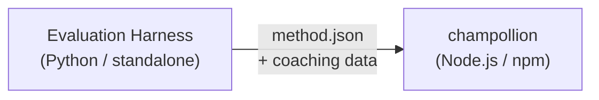

# Espesipikasyon ng Method Plugin

> **Bersyon**: 1.1  
> **Audience**: Mga developer ng plugin  
> **Canonical Schema**: [`shared/schemas/champollion-plugin.schema.json`](https://github.com/gamedaysuits/Champollion/blob/main/cli/shared/schemas/champollion-plugin.schema.json)

## Pangkalahatang-ideya

Gumagamit ang champollion ng **pluggable method system**. Maaaring gumamit ang bawat language pair ng ibang translation method (LLM, coached, script-converter, atbp.). Nirerehistro ang mga method sa `lib/translate.js` at niri-resolve per-pair sa pamamagitan ng `lib/pairs.js`.

Ang trabaho ng eval harness ay **bumuo, sumubok, at mag-export** ng mga translation method. Ang trabaho ng champollion ay **konsumehin at patakbuhin** ang mga ito. Ang plugin ay **data lamang** — configuration, coaching content, at benchmark results. Walang Python code, walang harness dependencies.

### Daloy ng Data



Binubuo at sinusubok ng harness ang mga method sa Python. Kapag handa na ang isang method para sa deployment, nag-e-export ang harness ng `method.json` manifest at opsyonal na coaching data files. Ini-install at pinapatakbo ng Champollion ang method gamit ang sarili nitong built-in method implementations.

---

## Format ng Method Plugin

Ang method plugin ay isang JSON file (`method.json`) na may opsyonal na coaching data files.

### `method.json` — Kinakailangan

```json
{
  "name": "french-formal-v1",
  "type": "llm-coached",
  "version": "1.0.0",
  "description": "Formally-tuned French with terminology enforcement and grammar coaching",
  "author": "Plugin Author",

  "config": {
    "model": "google/gemini-3.5-flash",
    "temperature": 0.2,
    "batchSize": 80,
    "register": "formal",
    "coachingFile": null,
    "coachingPrompt": null,
    "promptContext": null,
    "qualityTier": null
  },

  "locales": ["fr"],

  "benchmarks": {
    "fr": {
      "date": "2026-05-11T00:00:00Z",
      "corpus_size": 500,
      "exact_match_rate": 0.42,
      "corpus_chrf": 72.3,
      "corpus_bleu": 45.1,
      "model": "google/gemini-3.5-flash",
      "harness_version": "1.0.0"
    }
  },

  "provenance": {
    "resources": [],
    "commercialReady": false,
    "flags": ["license-unclear"]
  },

  "coaching": {
    "dir": "coaching"
  }
}
```

### Sanggunian ng Field

| Field | Uri | Kinakailangan | Paglalarawan |
|-------|------|----------|-------------|
| `name` | string | ✅ | Natatanging method identifier (kebab-case) |
| `type` | string | ✅ | Uri ng method ng Champollion: `llm`, `llm-coached`, `api`, `google-translate`, `deepl`, `microsoft-translator`, `libretranslate`, `openai`, `anthropic`, `gemini` |
| `version` | string | ✅ | Bersyong Semver (hal. `1.0.0`) |
| `locales` | string[] | ✅ | Aling mga locale code ang tina-target ng method na ito (minimum 1) |
| `description` | string | — | Paglalarawang nababasa ng tao |
| `author` | string | — | Sino ang bumuo/sumubok ng method na ito |
| `config.model` | string | — | OpenRouter model identifier |
| `config.temperature` | number | — | LLM temperature (0.0–2.0, default: 0.3) |
| `config.batchSize` | number | — | Mga key bawat API batch (1–200, default: 80) |
| `config.register` | string \| null | — | Rehistro/tono ng target na wika (preset key o freeform text) |
| `config.coachingFile` | string \| null | — | Path papunta sa free-text coaching prompt file (relative sa project root) |
| `config.coachingPrompt` | string \| null | — | Na-resolve na coaching prompt text (binasa mula sa `coachingFile` sa runtime) |
| `config.promptContext` | string \| null | — | Application context na ini-inject sa system prompt (hal., "E-commerce product descriptions") |
| `config.qualityTier` | string \| null | — | Quality tier mula sa benchmark evaluation (`standard`, `high`, `research`, `verified`) |
| `benchmarks` | object | — | Per-locale benchmark results mula sa eval harness |
| `provenance` | object | — | Licensing at resource dependencies |
| `coaching.dir` | string | — | Relative path papunta sa coaching data directory |

:::info[Canonical na Anyo ng MethodConfig]
Ginagamit ng `config` block ang **canonical MethodConfig schema** — ang parehong 8 field na ginagamit sa buong `champollion.config.json`, harness run cards, `mt-eval export-config`, at leaderboard publish/install. Laging naroroon ang lahat ng field; ang mga hindi ginagamit na value ay `null`. Tinitiyak nito ang walang-alitang round-tripping sa pagitan ng evaluation at production.
:::

### Benchmark Object (bawat locale)

| Field | Uri | Kinakailangan | Paglalarawan |
|-------|------|----------|-------------|
| `date` | string | ✅ | ISO 8601 timestamp ng benchmark run |
| `corpus_size` | number | ✅ | Bilang ng mga entry na na-evaluate |
| `exact_match_rate` | number | ✅ | 0.0–1.0, proporsyon ng mga eksaktong tugma |
| `corpus_chrf` | number | — | chrF++ score (0–100) |
| `corpus_bleu` | number | — | BLEU score (0–100) |
| `model` | string | ✅ | Model na ginamit sa eval |
| `harness_version` | string | ✅ | Bersyon ng evaluation harness na ginamit |

:::info[Aling mga metric ang ipinapakita?]
Ipinapakita ng `champollion status` command ang **chrF++** at **exact match rate** mula sa benchmark block. Tinatanggap ang `corpus_bleu` sa manifest ngunit sa kasalukuyan ay hindi ito ipinapakita o ginagamit ng anumang champollion command. Sinusubaybayan ng [Method Leaderboard](/leaderboard) ang chrF++, exact match, at FST acceptance rate.
:::

---

### Provenance Object

Ipinapabatid ng provenance block ang licensing status ng mga resource na naka-bundle sa plugin.

| Field | Uri | Default | Paglalarawan |
|-------|------|---------|-------------|
| `resources` | object[] | `[]` | Listahan ng mga naka-bundle na resource na may `name`, `license`, at `type` |
| `commercialReady` | boolean | `false` | Kung ang plugin ay cleared para sa commercial distribution |
| `flags` | string[] | `["license-unclear"]` | Machine-readable status flags |

**Default na estado** — ang mga na-export na plugin ay ipinapadala na may `commercialReady: false` at `flags: ["license-unclear"]`.

**Cleared na estado** — kapag na-verify na ang licensing: itakda ang `commercialReady: true` at i-clear ang mga flag.

---

## Format ng Coaching Data

Kung ang `type` ay `llm-coached`, dapat isama ng plugin ang coaching data files sa `coaching/` subdirectory.

### `coaching/<locale>.json`

```json
{
  "grammar_rules": [
    "French adjectives agree in gender and number with the noun they modify",
    "Use 'vous' for formal contexts, 'tu' for informal"
  ],
  "dictionary": {
    "dashboard": "tableau de bord",
    "deployment": "déploiement",
    "settings": "paramètres"
  },
  "style_notes": "Prefer active voice. Avoid anglicisms where a native French term exists."
}
```

| Field | Uri | Kinakailangan | Paglalarawan |
|-------|------|----------|-------------|
| `grammar_rules` | string[] | — | Mga rule na ini-inject sa bawat LLM prompt para sa locale na ito |
| `dictionary` | object | — | Term → translation map. Ang mga matched term ay ini-inject bilang kinakailangang terminolohiya. |
| `style_notes` | string | — | Freeform style instructions na idinadagdag sa prompt |

---

## Istruktura ng Directory

```
french-formal-v1/
  method.json                 # Method manifest with benchmarks
  coaching/
    fr.json                   # Coaching data for French
```

Para sa mga multi-locale method:

```
european-formal-v2/
  method.json                 # locales: ["fr", "de", "es", "it"]
  coaching/
    fr.json
    de.json
    es.json
    it.json
```

---

## Paano Kinokonsumo ng Champollion ang Mga Plugin

### Pag-install

```bash
champollion plugin install ./french-formal-v1/
```

Nagse-save sa `.champollion/methods/french-formal-v1/`.

### Configuration

```json title="champollion.config.json"
{
  "pairs": {
    "en:fr": {
      "methodPlugin": "french-formal-v1"
    }
  }
}
```

:::info[Merge semantics]
Tinutukoy ng plugin kung *anong* method ang gagamitin (`type`). Inaayos ng pair config kung *paano* ito patatakbuhin (`model`, `register`, `batchSize`). Kung itinakda ng pair ang `model`, ino-override nito ang default ng plugin.
:::

### Runtime

1. Binabasa ng Champollion ang `method.json` mula sa `.champollion/methods/french-formal-v1/`
2. Itinatakda ng `type` field ng plugin ang translation method (hal., `llm-coached`)
3. Naglo-load ng coaching data mula sa `coaching/` directory ng plugin
4. Ginagamit ang `config` block upang punan ang mga kakulangan sa model/register/temperature
5. Ipinapakita ang `benchmarks` block sa output ng `champollion status`
6. Tinitingnan ng `champollion provenance` ang `provenance` block para sa licensing flags

---

## Schema Validation

Vina-validate ang mga plugin manifest sa oras ng install laban sa [`shared/schemas/champollion-plugin.schema.json`](https://github.com/gamedaysuits/Champollion/blob/main/cli/shared/schemas/champollion-plugin.schema.json).

I-reference ang schema sa inyong `method.json` para sa IDE autocompletion:

```json
{
  "$schema": "./node_modules/champollion/shared/schemas/champollion-plugin.schema.json",
  "name": "my-method-v1"
}
```

---

## Ano ang HINDI Dapat Isama

- ❌ Walang Python code o harness dependencies
- ❌ Walang raw corpus data o run logs
- ❌ Walang API keys o credentials
- ❌ Walang harness configuration
- ❌ Walang internal prompt templates (nasa method implementations ng champollion ang mga iyon)

Ang plugin ay **data lamang**: configuration, coaching content, at benchmark results.

---

## Tingnan Din

- [Mga Translation Method](/docs/guides/translation-methods) — kung paano gumagana ang bawat built-in method
- [Configuration](/docs/getting-started/configuration) — per-pair at per-language config
- [Pag-serve ng Method sa pamamagitan ng API](/docs/guides/serving-a-method) — pag-host ng mga method bilang HTTP services
- [Cookbook: FST-Gated Pipeline](/docs/network/tutorials/fst-gated-pipeline) — pagbuo at pag-package ng pipeline
- [MT Evaluation](/docs/network/leaderboard/rules) — pag-benchmark ng mga method para sa leaderboard submission
- [Suportahan ang Wikang may Kaunting Mapagkukunan](/docs/network/community/low-resource-languages) — ang use case para sa community plugins
