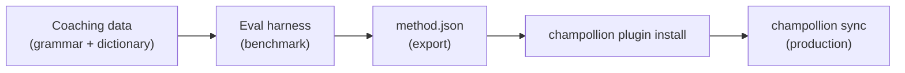

# Tutorial: Bumuo ng Translation Plugin

Bumuo ng custom na paraan ng pagsasalin mula sa simula, i-benchmark ito, at i-deploy ito bilang champollion plugin. Ito ang kumpletong workflow para sa pagdaragdag ng bagong language pair na hindi sinusuportahan ng anumang off-the-shelf API.

**Ang bubuuin ninyo:** Isang coached translation plugin para sa pormal na French na may ipinapatupad na terminology, mga tuntunin sa grammar, at mga benchmark score.

**Oras:** 30–45 minuto

**Mga prerequisite:**
- Naka-install ang champollion (`npm install --save-dev champollion`)
- Isang OpenRouter API key (`OPENROUTER_API_KEY`)
- Python 3.10+ (para sa eval harness)

---

## Hakbang 1: Tukuyin ang Problema

Nagsasalin kayo ng isang SaaS dashboard sa French. Ang default na pamamaraang `llm` ay nagbubunga ng tama ngunit hindi magkakatugmang mga pagsasalin:

- Minsan ang "dashboard" ay nagiging "tableau de bord," sa ibang pagkakataon naman ay "panneau de contrôle"
- Nagpapalit-palit ang tono sa pagitan ng mga anyong `tu` at `vous`
- Hindi magkakatugma ang pag-aanglicize ng mga technical term

Kailangan ninyo ng **pagpapatupad ng terminology** at **kontrol sa register** na hindi ibinibigay ng generic na LLM prompt.

## Hakbang 2: Gumawa ng Coaching Data

Gumawa ng coaching file na nag-e-encode ng inyong mga kinakailangang pangwika:

```bash
mkdir -p .champollion/coaching
```

```json title=".champollion/coaching/fr.json"
{
  "grammar_rules": [
    "Always use the 'vous' form for formal register",
    "French adjectives agree in gender and number with their noun",
    "Use the present tense for UI instructions, not the imperative",
    "Preserve sentence-final punctuation style from the source"
  ],
  "dictionary": {
    "dashboard": "tableau de bord",
    "deployment": "déploiement",
    "settings": "paramètres",
    "environment variable": "variable d'environnement",
    "webhook": "webhook",
    "API key": "clé API",
    "sign in": "se connecter",
    "sign out": "se déconnecter",
    "repository": "dépôt",
    "pull request": "demande de tirage"
  },
  "style_notes": "Formal technical French. Prefer native French terms over anglicisms where established equivalents exist. Keep UI labels concise — 3 words maximum where possible."
}
```

**Ang ginagawa ng bawat field:**
- **`grammar_rules`** — Ini-inject sa LLM system prompt bilang tahasang mga constraint
- **`dictionary`** — Itinutugma laban sa source keys; kapag lumitaw ang isang dictionary term, ini-inject ito bilang "required terminology" sa prompt
- **`style_notes`** — Idinaragdag sa system prompt bilang pangkalahatang gabay sa style

## Hakbang 3: I-configure ang Pair

Sabihin sa champollion na gamitin ang `llm-coached` para sa French:

```json title="champollion.config.json"
{
  "version": 3,
  "inputLocale": "en",
  "localesDir": "./locales",
  "pairs": {
    "en:fr": {
      "method": "llm-coached",
      "model": "google/gemini-3.5-flash",
      "temperature": 0.2
    }
  },
  "languages": {
    "fr": {
      "register": "Formal technical French (vous-form)",
      "name": "French"
    }
  }
}
```

## Hakbang 4: Subukan Ito

```bash
npx champollion sync --dry
```

Suriin ang dry-run output. Tiyaking:
- ✅ Ginagamit nang consistent ang mga dictionary term ("tableau de bord," hindi "panneau de contrôle")
- ✅ Ginagamit ang anyong `vous` sa kabuuan
- ✅ Tumutugma ang mga technical term sa inyong dictionary

Pagkatapos ay patakbuhin ang totoong sync:

```bash
npx champollion sync
```

## Hakbang 5: Mag-benchmark gamit ang Eval Harness (Opsyonal)

Kung nais ninyo ng mga quality score — at kailangan ninyo iyon, dahil may kasamang benchmark data ang mga plugin — gamitin ang kasamang eval harness.

### I-install ang Harness

```bash
pip install mt-eval-harness
```

### Gumawa ng Reference Corpus

Gumawa ng file na may source strings at mga napatunayang mahusay na pagsasalin:

```json title="corpus/french-formal.json"
[
  {
    "source": "Dashboard",
    "reference": "Tableau de bord"
  },
  {
    "source": "Sign in to your account",
    "reference": "Connectez-vous à votre compte"
  },
  {
    "source": "Your deployment is ready",
    "reference": "Votre déploiement est prêt"
  },
  {
    "source": "Environment variables",
    "reference": "Variables d'environnement"
  }
]
```

### Patakbuhin ang Benchmark

```bash
mt-eval test \
  --corpus corpus/french-formal.json \
  --source en \
  --target fr \
  --model google/gemini-3.5-flash \
  --temperature 0.2 \
  --champollion-config champollion.config.json
```

Ang harness ay naglalabas ng:
- **chrF++** — Character-level F-score (0–100). Malakas ang higit sa 70.
- **BLEU** — N-gram overlap (0–100). Matatag ang higit sa 40 para sa coached translation.
- **Exact match rate** — Proporsyon ng mga pagsasaling eksaktong tumutugma sa reference.
- **COMET** — Neural quality metric (kung naka-install sa pamamagitan ng `mt-eval setup --comet`).

:::tip[Subukan ang Ide-deploy Ninyo]
Ang paggamit ng `--champollion-config` ay direktang nag-i-import ng inyong production model, register, temperature, at coaching data mula sa inyong `champollion.config.json`. Tinitiyak nitong bina-benchmark ninyo ang eksaktong pamamaraang ide-deploy ninyo.
:::

### I-export ang Plugin

Kapag kuntento na kayo sa mga score:

```bash
mt-eval export \
  --name french-formal-v1 \
  --report eval/logs/harness/run_report.json \
  --output ./french-formal-v1/
```

Lumilikha ito ng:

```
french-formal-v1/
├── method.json          # Manifest with config + benchmarks
└── coaching/
    └── fr.json          # Your coaching data
```

## Hakbang 6: I-install ang Plugin sa Champollion

```bash
npx champollion plugin install ./french-formal-v1/
```

Kinokopya nito ang plugin sa `.champollion/methods/french-formal-v1/`.

I-update ang inyong config upang gamitin ito:

```json title="champollion.config.json"
{
  "pairs": {
    "en:fr": {
      "methodPlugin": "french-formal-v1"
    }
  }
}
```

## Hakbang 7: I-verify

```bash
# Check plugin is installed and shows benchmark scores
npx champollion status

# Run a sync with the plugin
npx champollion sync

# Audit licensing status
npx champollion provenance
```

Ipapakita ng output ng `status` ang:

```
en → fr
  Method:    french-formal-v1 (llm-coached)
  Model:     google/gemini-3.5-flash
  Quality:   high
  chrF++:    74.2
  BLEU:      46.8
  Exact:     42%
```

## Ang Nabuo Ninyo



Mayroon na kayo ngayon ng:
1. **Coaching data** — Mga tuntunin sa grammar at terminology na nagpapatupad ng consistency
2. **Mga benchmark score** — Naka-quantify na kalidad na kasama sa plugin
3. **Isang portable na plugin** — `method.json` + coaching data, mai-install sa anumang machine
4. **Production deployment** — Naka-integrate sa inyong sync pipeline

## Mga Susunod na Hakbang

- **[Plugin Specification](/docs/reference/plugin-spec)** — Kumpletong reference ng manifest format
- **[Translation Methods](/docs/guides/translation-methods)** — Ihambing ang lahat ng apat na method
- **[Low-Resource Languages](/docs/network/community/low-resource-languages)** — Ilapat ang pattern na ito sa mga wikang walang API coverage
- **[Translate 30 Languages](/docs/tutorials/translate-30-languages)** — I-scale ang inyong proyekto para sa global audience
